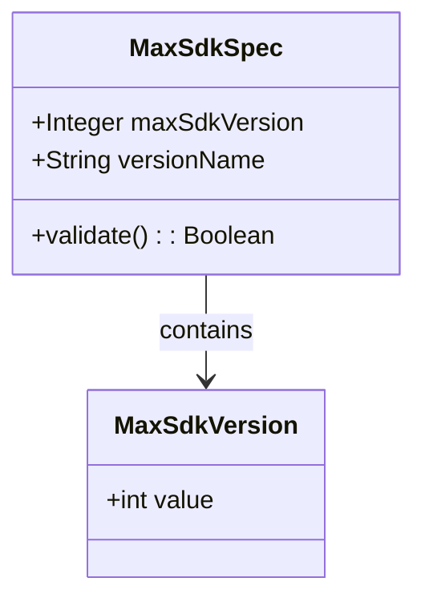
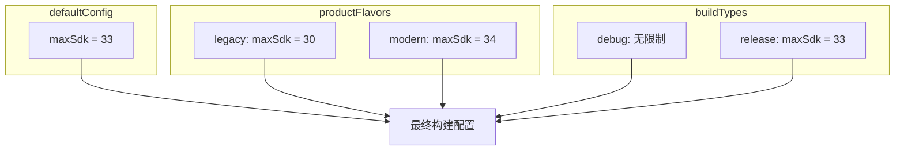
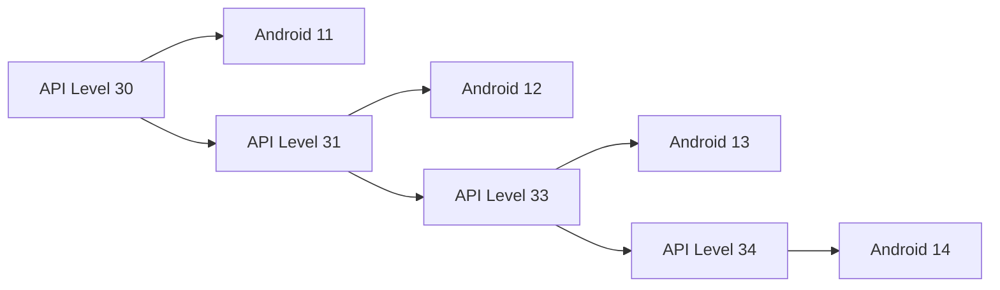
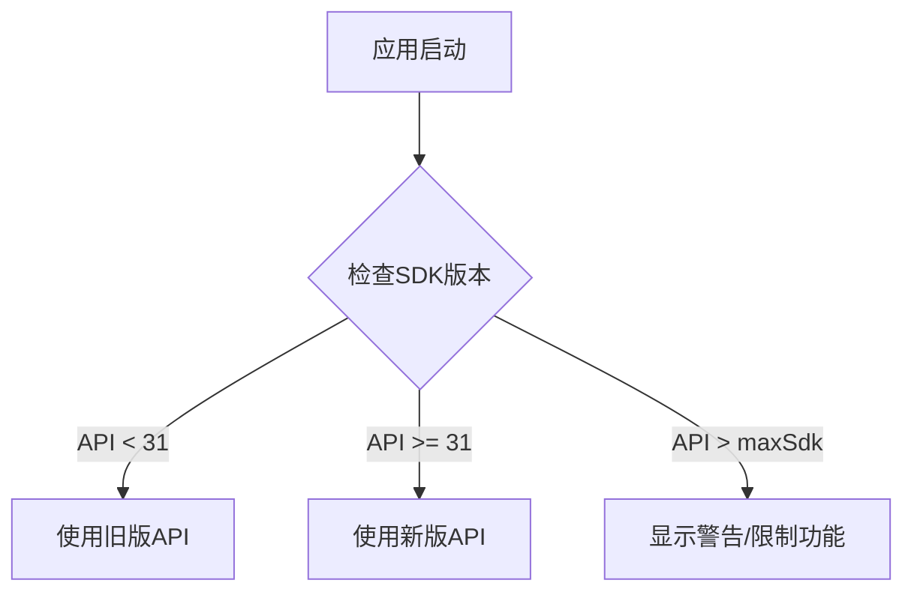

# 21.1.164 最大SdkVersion

天边的晚霞渐渐变成了深蓝色，湖畔的灯笼一盏盏地亮了起来，像是指引夜归人的星星。洛芙惬意地躺在野餐垫上，用手肘撑着下巴，看着黛琳从背包里又拿出了一本小册子。

"刚才的MaxSdkSpec是规范对象，那这个又是什么？"洛芙注意到封面上写着"MaxSdkVersion"。

"这个问题问得好。"黛琳翻开册子，"MaxSdkSpec是我们用来定义'我要限制最高版本'这个意图的对象，而MaxSdkVersion则是具体的版本号数值。简单说，一个是'我要设限'这个想法，另一个是'限到33'这个具体数字。"

希尔正在摆弄她的笔记本，屏幕上是Gradle的配置代码："它们两个经常一起用，但职责不同。MaxSdkSpec是包装器，MaxSdkVersion是里面的值。"

---

**从规范到数值的区别**

伊莎点燃了一盏小灯笼，暖黄色的光芒映照在她的脸上："我打个比方吧。MaxSdkSpec就像是说'我要制定一个规则'，而MaxSdkVersion是这个规则具体写多少。"

"就像露营时的规则和具体的规则内容？"洛芙眼睛一亮。

"差不多。"黛琳点点头，"在Gradle DSL里，MaxSdkSpec是一个配置对象，你可以对它进行各种设置，而MaxSdkVersion通常是它的一个属性，保存着具体的版本号。"

黛琳在白板上画了一个简单的类比图：



"这个图展示了它们的关系。"黛琳解释道，"MaxSdkSpec对象包含了一个MaxSdkVersion属性，存储具体的版本号。MaxSdkVersion是一个简单的数值包装类，而MaxSdkSpec是配置规范类。"

---

**MaxSdkVersion的实际用法**

希尔把笔记本转过来，开始敲代码："我们来看具体的用法。"

```kotlin
android {
    defaultConfig {
        // 使用具体的版本号设置
        maxSdk = 33
        
        // 这两种写法效果相同
        // 方式一：直接设置数值
        maxSdk = 34
        
        // 方式二：通过MaxSdkSpec对象
        maxSdkVersion = 34
    }
}
```

"注意这里的maxSdk和maxSdkVersion在功能上几乎是一样的。"希尔说，"它们都表示最高支持的SDK版本。但从代码语义上，maxSdkVersion更明确地表达了'这是一个版本号'的意思。"

洛芙歪着头："那为什么要有两个名字？"

"这是Gradle DSL的演变历史。"黛琳解释道，"早期的AGP版本用的是maxSdk，后来为了更清晰地表达语义，添加了maxSdkVersion这个更明确的名字。现在两者都可以用，但maxSdkVersion是更新的写法。"

---

**在构建变体中使用**

伊莎指着远处的湖面："那在不同构建变体里怎么用呢？"

黛琳画了一幅流程图来说明：



"每个维度都可以设置自己的maxSdkVersion值。"黛琳说，"构建时会综合考虑所有维度的配置。"

希尔补充了一段更复杂的示例：

```kotlin
android {
    compileSdk = 34
    
    defaultConfig {
        minSdk = 24
        // 这里是具体的版本号
        maxSdk = 33
    }
    
    flavorDimensions += "compatibility"
    productFlavors {
        create("legacy") {
            dimension = "compatibility"
            // 限制在Android 11以下
            maxSdk = 30
        }
        create("standard") {
            dimension = "compatibility"
            // 限制在Android 13以下
            maxSdk = 33
        }
        create("latest") {
            dimension = "compatibility"
            // 不设上限，支持最新系统
        }
    }
    
    buildTypes {
        release {
            // 发布版本可以额外加一个安全限制
            // 防止在新系统上出现未知问题
            // 注意：buildType中的maxSdk会覆盖flavor中的设置
        }
        debug {
            // 调试版本不设限，方便测试
        }
    }
}
```

"这个例子展示了三个层次的配置。"希尔解释道，"defaultConfig设置默认值，productFlavor针对不同用户群，buildType针对调试和发布。"

---

**版本号的具体含义**

洛芙举手提问："我看到代码里写的是33、34这些数字，这些数字到底代表什么？"

黛琳把白板翻到新的一页，画了一个版本对照表：



"API Level就是SDK版本号。"黛琳解释道，"Android系统每一次大版本更新都会增加一个API Level。30对应Android 11，33对应Android 13，34对应Android 14。"

"所以maxSdk = 33的意思就是最高支持到Android 13？"洛芙问。

"对。"黛琳点头，"在这之后发布的设备就无法安装你的应用了。"

---

**与MaxSdkSpec对象的配合**

"那MaxSdkSpec对象怎么和MaxSdkVersion配合使用呢？"伊莎好奇地问。

希尔调出一段代码：

```kotlin
// 方式一：直接使用数值
android {
    defaultConfig {
        maxSdk = 33  // 直接写版本号
    }
}

// 方式二：使用MaxSdkSpec对象
android {
    defaultConfig {
        // MaxSdkSpec是配置对象，maxSdkVersion是它的属性
        maxSdk = MaxSdkSpec(33)  // 或者 maxSdk = 33
        
        // 下面是等效的写法
        maxSdkVersion = 34
    }
}

// 方式三：在代码中动态设置
android {
    defaultConfig {
        // 可以通过变量传递
        val targetMaxSdk: Int = 33
        maxSdk = targetMaxSdk
    }
}
```

"实际上，在现代AGP中，两种写法会生成相同的构建配置。"希尔说，"编译器会把maxSdk = 33转换为MaxSdkSpec(33)的内部表示。"

---

**版本范围与条件逻辑**

伊莎轻声说："我想到一个实际的应用场景。"

"什么场景？"洛芙问。

"假如你的应用有一个功能只在特定版本范围有效，"伊莎解释道，"比如Android 12引入了新的拍照API，你想让应用在这个版本以上才启用这个功能。"

黛琳点点头，画了一个条件分支图：



"代码可以这样写："希尔在笔记本上敲了起来：

```kotlin
object SdkConfig {
    // 这些值从BuildConfig读取
    const val MIN_SDK = 24
    const val MAX_SDK = 33
    
    // 检查当前设备是否在支持范围内
    fun isSupported(): Boolean {
        val currentSdk = android.os.Build.VERSION.SDK_INT
        return currentSdk in MIN_SDK..MAX_SDK
    }
    
    // 根据SDK版本选择API
    fun getCameraApi(): CameraApi {
        return if (Build.VERSION.SDK_INT >= 31) {
            NewCameraApi()  // Android 12+
        } else {
            LegacyCameraApi()  // Android 11及以下
        }
    }
}

// 在应用中使用
class MainActivity : AppCompatActivity() {
    override fun onCreate(savedInstanceState: Bundle?) {
        super.onCreate(savedInstanceState)
        
        if (!SdkConfig.isSupported()) {
            showCompatibilityWarning()
        }
        
        val cameraApi = SdkConfig.getCameraApi()
        cameraApi.initialize()
    }
}
```

"这个例子展示了如何根据SDK版本来条件性地使用不同的API。"希尔说，"通过BuildConfig.MIN_SDK_VERSION和MAX_SDK_VERSION，我们可以动态判断当前设备是否在支持的范围内。"

---

**反模式与最佳实践**

黛琳表情变得认真起来："我再说几个常见的错误做法。"

**反模式一：设置过低的maxSdk**

```kotlin
// ❌ 错误示例
android {
    defaultConfig {
        minSdk = 21
        maxSdk = 26  // 限制到Android 8.0，会导致大量用户无法使用
    }
}

// ✅ 正确示例
android {
    defaultConfig {
        minSdk = 21
        // 不设上限，或设置一个合理的近期版本
        maxSdk = 33  // Android 13
    }
}
```

"设置过低的maxSdk会严重影响应用的用户覆盖范围。"黛琳警告道，"除非有充分的理由，否则不要轻易设置maxSdk。"

**反模式二：忘记更新maxSdk**

```kotlin
// ❌ 错误示例
android {
    defaultConfig {
        // 几年没更新，导致应用无法在新系统上运行
        maxSdk = 28
    }
}

// ✅ 正确示例：定期检查更新
android {
    defaultConfig {
        // 根据最新测试结果设置
        maxSdk = 34  // Android 14
    }
}
```

"如果你设置了maxSdk，每年都需要检查是否需要更新。"黛琳说，"Android系统版本在不断推进，你的maxSdk也需要跟上。"

**反模式三：混淆compileSdk和maxSdk**

```kotlin
// ❌ 错误示例
android {
    compileSdk = 34  // 编译用最新版本
    defaultConfig {
        maxSdk = 34  // 但运行时限制到Android 14
        // 这会导致什么问题？
    }
}

// ✅ 正确示例
android {
    compileSdk = 34  // 编译用最新版本，获得最新API
    defaultConfig {
        minSdk = 24  // 最低支持到Android 7.0
        // maxSdk不设限，让应用可以安装在任何版本上
    }
}
```

"compileSdk只影响编译，maxSdk影响安装。"黛琳强调，"它们是独立的概念。"

---

**实际项目中的配置策略**

希尔总结了一份配置策略表：

| 场景 | 推荐配置 |
|------|----------|
| 普通应用 | minSdk设置合理值，maxSdk不设 |
| 测试新特性 | maxSdk设置到测试版本 |
| 企业内部应用 | 根据安全策略设置maxSdk |
| 游戏应用 | minSdk设置低，maxSdk不设 |

"大多数情况下，你只需要设置minSdk就够了。"希尔说，"maxSdk是特殊场景才用的。"

洛芙似懂非懂地点点头："所以MaxSdkVersion就是一个数字，而MaxSdkSpec是管这个数字的？"

"理解得不错。"黛琳微笑着说。

---

**代码验证**

希尔打开一个测试示例："我们写个简单的测试来验证配置是否生效。"

```kotlin
// build.gradle.kts
android {
    namespace = "com.example.app"
    compileSdk = 34
    
    defaultConfig {
        applicationId = "com.example.app"
        minSdk = 24
        maxSdk = 33
        
        versionCode = 1
        versionName = "1.0"
    }
}

// BuildConfig中会自动生成这些常量
object BuildConfig {
    const val VERSION_NAME = "1.0"
    const val VERSION_CODE = 1
    const val MIN_SDK_VERSION = 24
    const val MAX_SDK_VERSION = 33  // 这里就是我们设置的MaxSdkVersion
}

// 测试用例
@Test
fun testMaxSdkConfiguration() {
    val maxSdk = BuildConfig.MAX_SDK_VERSION
    assertEquals("maxSdk应该是33", 33, maxSdk)
    
    // 验证设备兼容性
    val currentSdk = Build.VERSION.SDK_INT
    val isCompatible = currentSdk <= maxSdk
    
    println("当前设备SDK: $currentSdk")
    println("应用最高支持: $maxSdk")
    println("是否兼容: $isCompatible")
}
```

"运行这个测试，你就能看到当前设备的SDK版本和应用设置的最大版本。"希尔说，"如果currentSdk > maxSdk，说明设备不在支持范围内。"

---

**与上一章的联系**

伊莎轻声说："其实MaxSdkSpec和MaxSdkVersion的关系，就像露营时的计划和具体的执行步骤。"

"怎么说？"洛芙问。

"MaxSdkSpec是'我要设一个上限'这个计划，"伊莎解释道，"MaxSdkVersion是具体的上限数字33。计划需要具体数字才能执行，数字也需要计划来赋予意义。"

黛琳补充："在Gradle DSL中，它们经常一起出现，但理解它们的区别很重要——一个是配置规范，一个是具体数值。"

---

夜幕已经完全降临，湖畔的萤火虫数量多了起来，像落在草地上的星星。四个女孩收拾好东西，准备回帐篷休息。

"今天学到了MaxSdkVersion是具体的数字。"洛芙总结道，"配合MaxSpecSpec使用，可以精确控制应用的SDK版本限制。"

"记住，大多数应用不需要设置maxSdk。"黛琳最后提醒道，"只有特殊场景才需要。"

"比如什么样的场景？"洛芙好奇地问。

"比如你的应用依赖的某个第三方库有严重bug，只在特定版本以下才能正常工作。"黛琳说，"或者你的企业客户要求只能在特定版本的设备上安装。"

洛芙点点头表示理解。夜风吹过，带来湖水的清凉气息。

---

> 学习建议

1. **理解概念区别**：MaxSdkSpec是配置对象，MaxSdkVersion是具体的版本号数值。在实际使用中，两者经常配合，但职责不同。

2. **谨慎设置maxSdk**：大多数应用不需要设置maxSdk，优先确保minSdk的合理性。只有在有充分理由时才设置上限。

3. **定期维护**：如果设置了maxSdk，建议每半年检查一次是否需要更新，以跟上Android系统的版本推进。

4. **测试验证**：使用不同SDK版本的模拟器测试应用，确保配置在不同设备上都能正常工作。

5. **参考官方文档**：查阅Android官方Gradle DSL文档了解最新的API变化和最佳实践。

---

## 洛芙的小小日记本

今晚学到了MaxSdkVersion——就是那个具体的数字33、34啥的～黛琳说MaxSdkSpec是"我要设上限"这个想法，而MaxSdkVersion是具体设到几。和之前的MaxSdkSpec配合使用，就能精确控制APP最高能装在哪个版本的Android上。不过大多数APP其实不需要设上限，还是minSdk更常用。今天也是收获满满的一天！(99字)

---

## 今日关键词

- **MaxSdkVersion**：Gradle DSL中表示具体SDK版本号的属性或数值
- **MaxSdkSpec**：Gradle DSL中用于定义SDK版本限制的配置对象
- **API Level**：Android系统的版本编号，如30对应Android 11
- **compileSdk**：编译时使用的SDK版本
- **minSdk**：应用最低支持的SDK版本
- **maxSdk**：应用最高支持的SDK版本
- **BuildConfig**：自动生成的构建配置类
- **productFlavors**：构建变体维度
- **buildTypes**：构建类型
- **SDK版本检查**：系统检查设备SDK版本是否符合应用要求
