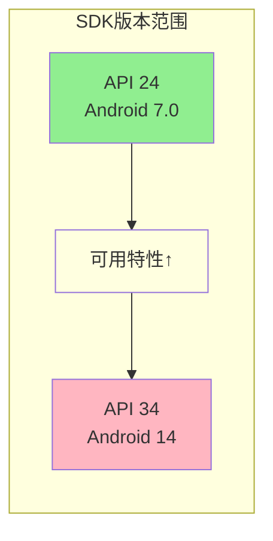
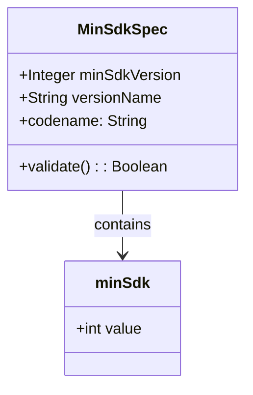
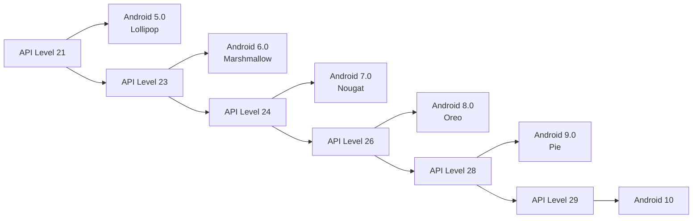
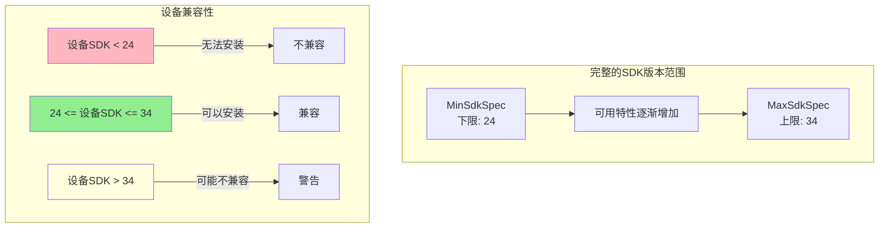
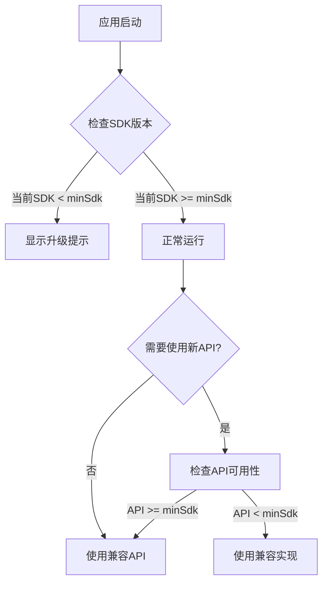
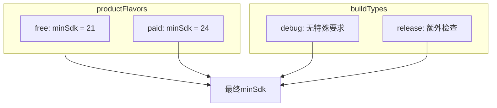
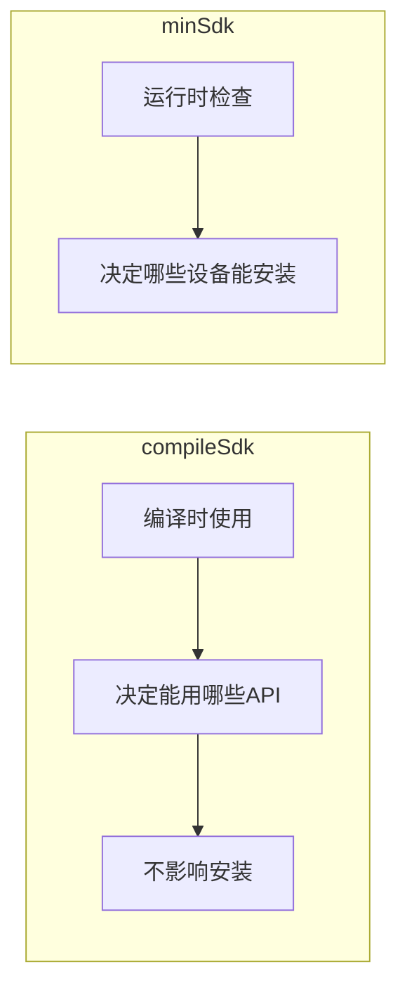

# 21.1.165 最小SDK规格

夜风轻拂，萤火虫在草丛中忽闪忽闪，像落在草叶上的星星。洛芙打了个哈欠，揉了揉眼睛——刚才学的MaxSdkVersion和MaxSdkSpec让她的大脑有点超载。

“还有没？”洛芙问，声音里带着一点困意，但更多的是好奇。

“有。”黛琳翻着小册子，“刚才我们说了'最高能到什么版本'，现在来说说'最低不能低于什么版本'。”

伊莎点亮了另一盏小灯笼，暖黄色的光芒驱散了一些夜晚的凉意：“这和MaxSdkSpec是配套的，对吧？”

“对。”黛琳点头，“一个管上限，一个管下限。没有下限的应用就像没有地基的房子，什么设备都能装，但也意味着你无法使用任何新特性。”

---

**从上限到下限的过渡**

希尔把笔记本放在膝盖上，屏幕上是Gradle的配置代码：“你们看，MaxSdkSpec管的是'最高'，MinSdkSpec管的是'最低'。一个应用就像一个人，需要有个'年龄范围'。”

洛芙想了想：“就像玩游戏有的人有最低等级要求一样？”

“差不多是这个意思。”黛琳微笑，“游戏要求角色等级至少20级才能进入某个副本，你的应用也要求设备至少是Android 7.0才能安装。”

黛琳在白板上画了一个简单的示意图：



“这个图展示了SDK版本的范围。”黛琳解释道，“你设置的minSdk决定了'能用什么特性'，设置的maxSdk决定了'哪些设备能安装'。”

---

**MinSdkSpec对象是什么**

伊莎好奇地问：“刚才MaxSdkSpec是一个对象，MinSdkSpec也是一样的吗？”

“一样的。”黛琳翻开册子，“MinSdkSpec是Gradle DSL中用来定义'最低SDK版本'这个意图的配置对象。它和MaxSdkSpec是对应的，一个管下限，一个管上限。”

希尔敲了一段代码：

```kotlin
android {
    defaultConfig {
        // MinSdkSpec对象的用法
        // 方式一：直接设置数值
        minSdk = 24
        
        // 方式二：通过MinSdkSpec对象（现代AGP写法）
        minSdk = minSdk { 24 }
        
        // 方式三：使用具体的属性
        minSdkVersion = 24
    }
}
```

“注意看，这三种写法在现代AGP中效果是一样的。”希尔说，“minSdk = 24是最简洁的写法，minSdk = minSdk { 24 }是显式使用MinSdkSpec对象，而minSdkVersion是属性写法。”

洛芙歪着头：“所以minSdk和MinSdkSpec也是像之前MaxSdkVersion和MaxSdkSpec那样的关系？”

“对。”黛琳点头，“一个是具体数值，一个是配置对象。数值是给机器看的，对象是给我们配置的。”

---

**minSdk与MinSdkSpec的区别**

黛琳在白板上画了一个类比图：



“这个图展示了它们的包含关系。”黛琳说，“MinSdkSpec对象里面包含了minSdk这个具体数值。在实际使用中，你设置minSdk = 24，Gradle会在内部创建一个MinSdkSpec对象来管理这个值。”

伊莎轻声说：“那和MaxSdkSpec一样，MinSdkSpec也是一个规范对象？”

“对的。”黛琳说，“它们都是DSL中的配置对象。MaxSdkSpec管理上限，MinSdkSpec管理下限。”

---

**版本号的具体含义**

洛芙举手提问：“我看到代码里写的是24、26这些数字，它们代表什么？”

黛琳把白板翻到新的一页，画了一个版本对照表：



“API Level就是Android系统的版本编号。”黛琳解释道，“数字越大，系统越新。21对应Android 5.0，24对应Android 7.0，26对应Android 8.0，以此类推。”

“所以minSdk = 24的意思就是最低支持到Android 7.0？”洛芙问。

“对。”黛琳点头，“在这之前发布的设备就无法安装你的应用了。”

---

**与MaxSdkSpec的配合使用**

伊莎指着远处的湖面：“那上下限一起用会怎样？”

黛琳画了一幅完整的范围图：



“这个图展示了上下限配合的效果。”黛琳说，“设置minSdk = 24和maxSdk = 34，应用就只支持Android 7.0到Android 14这个范围内的设备。”

希尔补充了一段代码示例：

```kotlin
android {
    compileSdk = 34
    
    defaultConfig {
        // 设置完整的版本范围
        minSdk = 24   // 最低 Android 7.0
        maxSdk = 34   // 最高 Android 14
        
        // 生成的BuildConfig会自动包含这些值
        // BuildConfig.MIN_SDK_VERSION = 24
        // BuildConfig.MAX_SDK_VERSION = 34
    }
}

// 在代码中可以使用BuildConfig读取这些值
object SdkConfig {
    const val MIN_SDK = 24  // 从defaultConfig读取
    const val MAX_SDK = 34
    
    fun isInRange(): Boolean {
        val current = android.os.Build.VERSION.SDK_INT
        return current in MIN_SDK..MAX_SDK
    }
}
```

---

**如何选择合适的minSdk值**

洛芙问：“那minSdk应该设置多少呢？”

“这是个很重要的问题。”黛琳的表情变得认真起来，“选择minSdk是一个权衡：设置太低要兼容很多老设备，设置太高会失去大量用户。”

希尔打开一个图表：“我们来看一下2024年的设备分布。”

| API Level | Android版本 | 市场占有率 | 推荐场景 |
|-----------|-------------|------------|----------|
| 21-22 | 5.0-5.1 | <1% | 特殊情况 |
| 23 | 6.0 | 约1% | 需要运行时权限 |
| 24-27 | 7.0-8.1 | 约10% | 主流应用 |
| 28-31 | 9.0-12 | 约50% | 新应用推荐 |
| 32-34 | 13-14 | 约35% | 新特性优先 |

“这个表展示了不同API Level的市场分布。”希尔说，“现在的趋势是minSdk = 24或26是比较合理的选择。”

---

**反模式与最佳实践**

黛琳表情变得认真起来：“我再讲几个常见的错误做法。”

**反模式一：设置过高的minSdk**

```kotlin
// ❌ 错误示例
android {
    defaultConfig {
        // 设置太高会失去大量用户
        minSdk = 33  // 要求Android 13+
        // 这会导致约30%的设备无法安装
    }
}

// ✅ 正确示例
android {
    defaultConfig {
        // 根据应用特性需求设置
        minSdk = 24  // Android 7.0，覆盖90%+设备
    }
}
```

“设置minSdk需要考虑你的目标用户群体。”黛琳说，“除非你的应用必须使用很新的API，否则不要设置太高的minSdk。”

**反模式二：minSdk和maxSdk设置反了**

```kotlin
// ❌ 错误示例
android {
    defaultConfig {
        minSdk = 34  // 设置成上限
        maxSdk = 24  // 设置成下限，完全反了！
        // 这会导致无法在任何设备上安装
    }
}

// ✅ 正确示例
android {
    defaultConfig {
        minSdk = 24  // 下限：最低Android 7.0
        maxSdk = 34  // 上限：最高Android 14
    }
}
```

“这是个很初级的错误，但新手容易犯。”黛琳强调，“minSdk是minimum，小的数字；maxSdk是maximum，大的数字。”

**反模式三：忘记考虑第三方库的最低要求**

```kotlin
// ❌ 错误示例
android {
    defaultConfig {
        minSdk = 21
        // 但你用的某个库要求minSdk = 23
        // 运行时会崩溃！
    }
}

// ✅ 正确示例：先查看依赖库的最低要求
android {
    defaultConfig {
        // 取所有依赖库中最高的minSdk
        minSdk = 23
    }
}

// 检查依赖的最低要求
dependencies {
    // 这个库要求API 23+
    implementation("com.example:some-lib:1.0") {
        // 可以在依赖配置中指定
    }
}
```

---

**实际项目中的配置策略**

希尔总结了一份配置策略表：

| 场景 | 推荐minSdk | 说明 |
|------|-----------|------|
| 新应用 | 24 | 平衡覆盖率和特性 |
| 老应用升级 | 保持现有 | 不要降低已有的minSdk |
| 银行/安全应用 | 26 | 需要较新的安全特性 |
| 只需要新特性 | 29+ | 追求最新API |

“大多数应用推荐minSdk = 24或26。”希尔说，“这个范围能覆盖90%以上的设备，同时可以使用大多数现代API。”

---

**版本检查与运行时判断**

伊莎轻声说：“设置了minSdk之后，代码里怎么知道当前设备是否支持？”

黛琳画了一个流程图：



“代码可以这样写。”希尔在笔记本上敲了起来：

```kotlin
class MainActivity : AppCompatActivity() {
    override fun onCreate(savedInstanceState: Bundle?) {
        super.onCreate(savedInstanceState)
        
        // 方法一：使用Build.VERSION.SDK_INT
        if (Build.VERSION.SDK_INT < BuildConfig.MIN_SDK_VERSION) {
            showUpgradeDialog()
            return
        }
        
        // 方法二：使用版本判断
        if (Build.VERSION.SDK_INT >= 29) {
            // 使用Android 10+的API
            useModernApi()
        } else {
            // 使用兼容实现
            useLegacyApi()
        }
        
        // 方法三：使用VersionUtils工具类
        if (VersionUtils.isAtLeastQ()) {
            // Android 10+
        }
    }
    
    // 自定义版本检查工具
    object VersionUtils {
        fun isAtLeastQ(): Boolean = Build.VERSION.SDK_INT >= 29
        fun isAtLeastR(): Boolean = Build.VERSION.SDK_INT >= 30
        fun isAtLeastS(): Boolean = Build.VERSION.SDK_INT >= 31
        fun isAtLeastT(): Boolean = Build.VERSION.SDK_INT >= 33
    }
}
```

---

**在构建变体中的差异化配置**

伊莎好奇地问：“不同构建变体可以设置不同的minSdk吗？”

黛琳画了一幅流程图：



“可以的。”黛琳说，“不同版本可以设置不同的minSdk。”

希尔敲了一段代码：

```kotlin
android {
    flavorDimensions += "version"
    productFlavors {
        create("free") {
            dimension = "version"
            // 免费版支持更老的设备
            minSdk = 21
        }
        create("paid") {
            dimension = "version"
            // 付费版需要更多特性
            minSdk = 24
        }
        create("beta") {
            dimension = "version"
            // 测试版用最新特性
            minSdk = 29
        }
    }
}
```

---

**与compileSdk的区别**

洛芙举手提问：“我有点混淆minSdk和compileSdk的区别。”

“这是个常见的混淆点。”黛琳在白板上画了一个对比图：



“compileSdk只在编译时起作用，决定你能用什么API。”黛琳解释说，“minSdk在运行时起作用，决定什么设备能安装你的应用。”

---

**代码验证**

希尔打开一个测试示例：“我们写个简单的测试来验证配置是否生效。”

```kotlin
// build.gradle.kts
android {
    namespace = "com.example.app"
    compileSdk = 34
    
    defaultConfig {
        applicationId = "com.example.app"
        minSdk = 24
        maxSdk = 34
        
        versionCode = 1
        versionName = "1.0"
    }
}

// BuildConfig中会自动生成这些常量
object BuildConfig {
    const val VERSION_NAME = "1.0"
    const val VERSION_CODE = 1
    const val MIN_SDK_VERSION = 24
    const val MAX_SDK_VERSION = 34
    const val COMPILE_SDK_VERSION = 34
}

// 测试用例
@Test
fun testSdkVersionConfiguration() {
    // 测试minSdk
    assertEquals("minSdk应该是24", 24, BuildConfig.MIN_SDK_VERSION)
    
    // 测试maxSdk
    assertEquals("maxSdk应该是34", 34, BuildConfig.MAX_SDK_VERSION)
    
    // 测试运行时版本检查
    val currentSdk = Build.VERSION.SDK_INT
    val isInRange = currentSdk in BuildConfig.MIN_SDK_VERSION..BuildConfig.MAX_SDK_VERSION
    
    println("当前设备SDK: $currentSdk")
    println("应用支持范围: ${BuildConfig.MIN_SDK_VERSION} - ${BuildConfig.MAX_SDK_VERSION}")
    println("是否在支持范围内: $isInRange")
}
```

“运行这个测试，你就能看到当前设备的SDK版本和应用设置的版本范围。”希尔说。

---

夜风吹过，萤火虫的光芒在草丛中摇曳。洛芙抬头看着星空，有些出神。

“所以minSdk和MaxSdkSpec是一对？”洛芙问。

“对。”黛琳说，“一个管下限，一个管上限。配合使用，就能精确控制应用的设备支持范围。”

伊莎轻声补充：“就像露营时的装备清单，既要带够东西，也不能超重。minSdk是'最低需要什么'，maxSdk是'最高不能超过什么'。”

黛琳点头：“理解得很准确。大多数应用只需要设置minSdk就够了，但理解这两个概念，你才能应对各种场景。”

---

> 学习建议

1. **理解MinSdkSpec对象**：它是Gradle DSL中用于定义最低SDK版本的配置对象，包含具体的minSdkVersion数值。

2. **权衡minSdk值**：选择minSdk需要平衡用户覆盖率和可用特性，一般推荐24或26。

3. **注意与compileSdk的区别**：compileSdk只影响编译，minSdk影响安装和运行。

4. **结合maxSdk使用**：上下限配合可以创建精确的设备支持范围。

5. **运行时检查**：即使设置了minSdk，代码中也需要进行运行时版本检查以使用正确的API。

---

## 洛芙的小小日记本

今晚学到了MinSdkSpec——就是设置APP最低能装在哪个版本的Android上～和MaxSdkSpec配合，一个管上限一个管下限，就能精确控制APP能安装在哪些设备上。黛琳说大多数APP设置minSdk = 24或26就够了，这样能覆盖90%以上的设备。还有compileSdk只影响编译，minSdk才影响安装，完全不一样的！今天又是干货满满的一天！(99字)

---

## 今日关键词

- **MinSdkSpec**：Gradle DSL中用于定义最低SDK版本的配置对象
- **minSdk**：应用最低支持的SDK版本号数值
- **maxSdk**：应用最高支持的SDK版本号数值
- **MaxSdkSpec**：Gradle DSL中用于定义最高SDK版本的配置对象
- **API Level**：Android系统的版本编号
- **compileSdk**：编译时使用的SDK版本
- **BuildConfig**：自动生成的构建配置类
- **运行时版本检查**：代码中判断当前设备SDK版本是否符合要求
- **productFlavors**：构建变体维度
- **SDK版本范围**：应用支持的最低到最高版本区间
