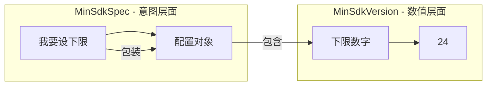
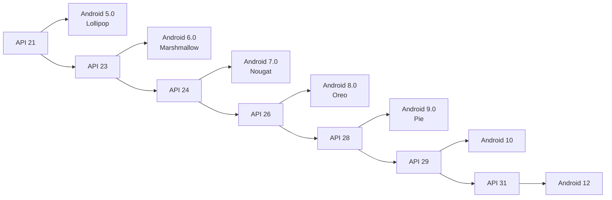
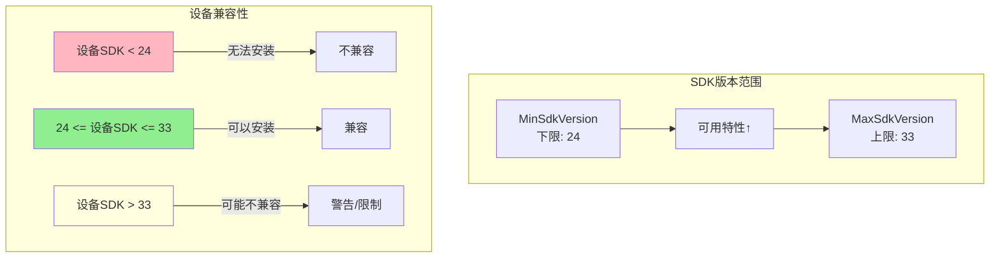
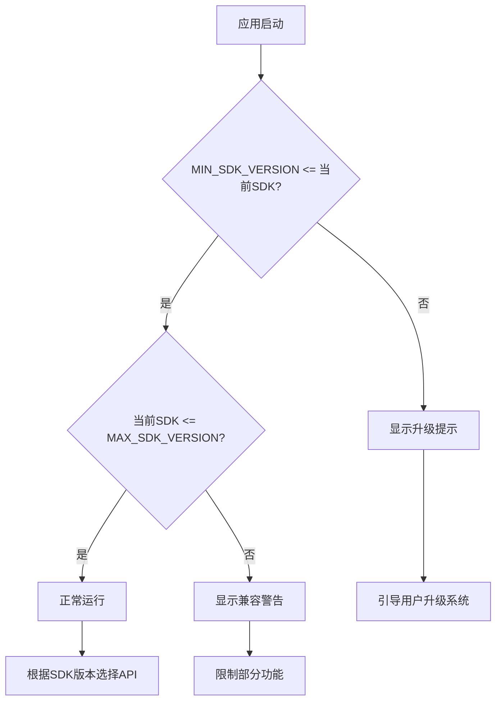
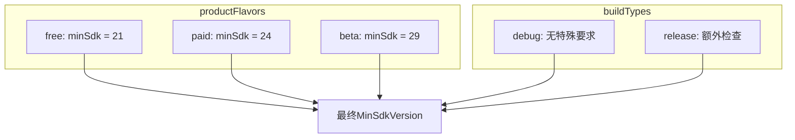
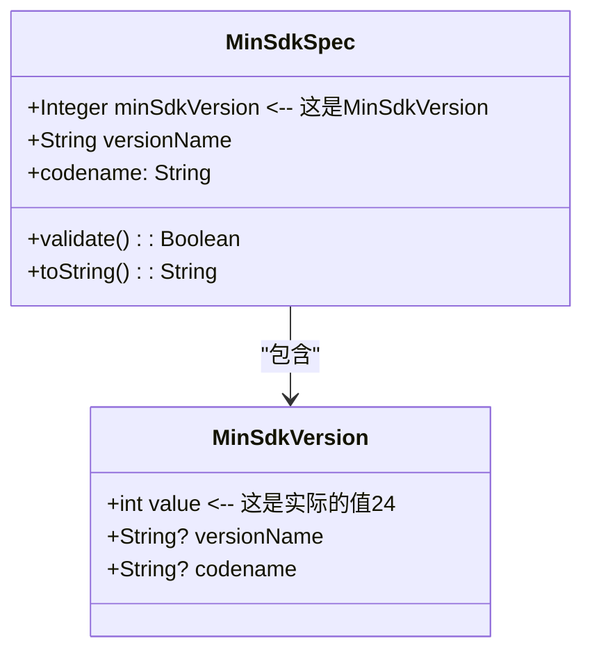

# 21.1.166 最小SdkVersion

夜已经深了。

萤火虫的光芒在草丛中闪烁，像落入人间的星星。洛芙躺在野餐垫上，双手枕在脑袋后面，看着头顶的星空。刚才黛琳讲的MinSdkSpec在她脑子里转来转去，像是一团解不开的毛线球。

“黛琳，”洛芙翻了个身，“你说MinSdkSpec是一个对象，能配置各种东西。那……具体要设成哪个版本的时候，怎么办？”

黛琳正在收拾白板笔，听到这个问题，动作停顿了一下。她转过身来，眼中闪过一丝笑意：“问得好。这就要用到MinSdkVersion了。”

“又是Version？”洛芙觉得这个名字有点耳熟。

“对，和上一章的MaxSdkVersion对应。”希尔把笔记本放在膝盖上，“MaxSdkVersion是具体设'最高'到多少，MinSdkVersion就是具体设'最低'到多少。”

伊莎点燃了另一盏小灯笼，暖黄色的光芒照亮了她们围坐的小圈：“所以一个是上限的具体数字，一个是下限的具体数字？”

“没错。”黛琳点头，“MinSdkSpec是'我要设下限'这个意图，MinSdkVersion是具体的下限数字。打个比方，MinSdkSpec是'制定规则'，MinSdkVersion是规则里的那个数字。”

---

**从意图到数字的转换**

洛芙歪着头：“那它们是怎么配合的？”

黛琳在白板上画了一个示意图：



“这个图展示了它们的关系。”黛琳解释道，“MinSdkSpec是一个配置对象，你可以对它进行各种设置。它的核心属性之一就是MinSdkVersion，保存着具体的版本号。”

希尔敲了一段代码来演示：

```kotlin
android {
    defaultConfig {
        // 方式一：直接设置数值（最简洁）
        minSdk = 24
        
        // 方式二：使用MinSdkSpec对象（显式写法）
        // 编译器在内部会创建一个MinSdkSpec对象
        // 这个对象包含MinSdkVersion属性，值就是24
        minSdk = minSdk { 24 }
        
        // 方式三：使用属性名（较老的写法）
        minSdkVersion = 24
    }
}
```

“看到没有，三种写法在现代AGP中效果完全一样。”希尔说，“minSdk = 24是最简洁的，minSdkVersion = 24是显式写出属性名，minSdk = minSdk { 24 }是显式创建对象。”

洛芙盯着代码看了半天：“所以minSdkVersion就是那个……藏在里面的数字？”

“对，就是藏在里面的具体数值。”黛琳微笑，“MinSdkSpec是包装盒，MinSdkVersion是盒子里那颗糖。”

---

**版本号背后的含义**

伊莎指着远处的湖面：“这些数字24、26、28，都代表什么呀？”

黛琳把白板翻到新的一页，画了一个版本对照图：



“API Level就是Android系统的版本编号。”黛琳解释道，“数字越大，系统越新。21对应Android 5.0，23对应Android 6.0，24对应Android 7.0，以此类推。”

“所以minSdk = 24的意思是——”洛芙扳着手指，“最低只能装在Android 7.0以上的手机上？”

“对的。”黛琳点头，“在这之前发布的设备就无法安装你的应用了。”

---

**MinSdkVersion的内部结构**

希尔把笔记本转过来，调出更详细的代码：

```kotlin
// MinSdkVersion的内部表示（简化版）
// 实际上这是一个Gradle DSL中的属性类型

class MinSdkVersion private constructor(
    val value: Int,                    // 具体的API Level，如24
    val versionName: String?,          // 版本名称，如"7.0"
    val codename: String?              // 代号，如"N"
) {
    // 验证版本号是否合法
    fun validate(): Boolean {
        return value in 1..34  // 合法的API Level范围
    }
    
    // 转换为字符串表示
    override fun toString(): String {
        return value.toString()
    }
}

// 在Gradle DSL中的使用方式
android {
    defaultConfig {
        // 创建MinSdkVersion对象
        val minSdk = MinSdkVersion(
            value = 24,
            versionName = "7.0",
            codename = "N"
        )
        
        // 或者更简单地
        minSdk = 24  // 编译器会自动转换
    }
}
```

“实际上，MinSdkVersion在Gradle内部是一个封装类。”希尔解释道，“它不只是保存一个数字，还可以保存版本名称、代号等信息。但在大多数情况下，我们只需要用数字就够了。”

---

**与MaxSdkVersion的对应关系**

洛芙突然想到一个问题：“那MinSdkVersion和MaxSdkVersion合在一起用，会怎么样？”

黛琳画了一幅完整的范围图：



“合在一起，就是一个完整的版本范围。”黛琳说，“MinSdkVersion设下限，MaxSdkVersion设上限。在这个范围内的设备可以安装，超出范围的设备会被拦截。”

希尔补充了一段完整示例：

```kotlin
android {
    compileSdk = 34
    
    defaultConfig {
        // 设置完整的版本范围
        minSdkVersion = 24   // 最低 Android 7.0
        maxSdkVersion = 33   // 最高 Android 13
        
        // 或者用简洁写法
        minSdk = 24
        maxSdk = 33
    }
}

// BuildConfig中会自动生成这些常量
object BuildConfig {
    const val MIN_SDK_VERSION = 24   // 对应MinSdkVersion
    const val MAX_SDK_VERSION = 33   // 对应MaxSdkVersion
    const val COMPILE_SDK_VERSION = 34
}

// 运行时可以这样检查
class DeviceCompatibilityHelper {
    fun checkCompatibility(): CompatibilityResult {
        val currentSdk = Build.VERSION.SDK_INT
        val minSdk = BuildConfig.MIN_SDK_VERSION
        val maxSdk = BuildConfig.MAX_SDK_VERSION
        
        return when {
            currentSdk < minSdk -> CompatibilityResult.TOO_OLD
            currentSdk > maxSdk -> CompatibilityResult.TOO_NEW
            else -> CompatibilityResult.COMPATIBLE
        }
    }
}

enum class CompatibilityResult {
    TOO_OLD,    // 设备太旧，不支持
    TOO_NEW,    // 设备太新，可能有兼容问题
    COMPATIBLE  // 兼容
}
```

---

**如何选择合适的MinSdkVersion值**

洛芙问：“那我应该把minSdk设成多少呢？”

“这是个需要权衡的问题。”黛琳的表情认真起来，“设太低要兼容很多老设备，很多新特性用不了；设太高会失去大量用户。”

希尔打开一份设备分布数据：

| API Level | Android版本 | 市场占有率 | 推荐场景 |
|-----------|-------------|------------|----------|
| 21-22 | 5.0-5.1 | <1% | 特殊情况 |
| 23 | 6.0 | 约1% | 需要运行时权限 |
| 24-27 | 7.0-8.1 | 约10% | 主流应用 |
| 28-31 | 9.0-12 | 约50% | 新应用推荐 |
| 32-34 | 13-14 | 约35% | 新特性优先 |

“这个表展示了不同API Level的市场分布。”希尔说，“现在的推荐是minSdk = 24或26，能覆盖90%以上的设备，同时可以使用大多数现代API。”

---

**代码中的运行时判断**

伊莎轻声说：“设置了MinSdkVersion之后，代码里怎么知道当前设备是否支持？”

黛琳画了一个流程图：



“代码可以这样写。”希尔在笔记本上敲了起来：

```kotlin
class MainActivity : AppCompatActivity() {
    override fun onCreate(savedInstanceState: Bundle?) {
        super.onCreate(savedInstanceState)
        
        // 方法一：使用BuildConfig中的常量
        val currentSdk = Build.VERSION.SDK_INT
        val minSdk = BuildConfig.MIN_SDK_VERSION
        val maxSdk = BuildConfig.MAX_SDK_VERSION
        
        when {
            currentSdk < minSdk -> {
                // 设备太旧，显示升级提示
                showUpgradeDialog()
                return
            }
            currentSdk > maxSdk -> {
                // 设备太新，显示兼容警告
                showCompatibilityWarning()
            }
        }
        
        // 方法二：使用特性检测
        if (Build.VERSION.SDK_INT >= BuildConfig.MIN_SDK_VERSION) {
            // 可以使用minSdk以上的特性
            useModernFeatures()
        } else {
            // 使用兼容实现
            useLegacyFeatures()
        }
        
        // 方法三：针对特定API级别
        if (Build.VERSION.SDK_INT >= 29) {
            // Android 10+ 特性
            useAndroid10Features()
        } else if (Build.VERSION.SDK_INT >= 26) {
            // Android 8.0+ 特性
            useAndroid8Features()
        } else {
            // 更早版本
            useLegacyFeatures()
        }
    }
    
    private fun showUpgradeDialog() {
        AlertDialog.Builder(this)
            .setTitle("系统版本过低")
            .setMessage("此应用需要Android ${BuildConfig.MIN_SDK_VERSION}及以上版本")
            .setPositiveButton("确定") { _, _ -> finish() }
            .show()
    }
    
    private fun showCompatibilityWarning() {
        Toast.makeText(
            this,
            "此应用在Android ${BuildConfig.MAX_SDK_VERSION}以上版本上可能存在兼容问题",
            Toast.LENGTH_LONG
        ).show()
    }
}
```

---

**反模式与最佳实践**

黛琳表情变得认真起来：“再说几个常见的错误做法。”

**反模式一：设置过高的MinSdkVersion**

```kotlin
// ❌ 错误示例
android {
    defaultConfig {
        // 设置太高会失去大量用户
        minSdkVersion = 33  // 要求Android 13+
        // 这会导致约30%的设备无法安装
    }
}

// ✅ 正确示例
android {
    defaultConfig {
        // 根据应用特性需求设置
        minSdkVersion = 24  // Android 7.0，覆盖90%+设备
    }
}
```

“除非你的应用必须使用很新的API，否则不要设置太高的minSdk。”黛琳说。

**反模式二：混淆minSdk和compileSdk**

```kotlin
// ❌ 错误示例
android {
    compileSdk = 34
    defaultConfig {
        // 误以为compileSdk会影响安装
        minSdkVersion = 34  // 这是错的！
        // compileSdk只影响编译，不影响安装
    }
}

// ✅ 正确示例
android {
    compileSdk = 34  // 编译用最新，获得最新API
    defaultConfig {
        minSdkVersion = 24  // 最低安装到Android 7.0
    }
}
```

“compileSdk只在编译时起作用，minSdk在安装时起作用。”黛琳强调。

**反模式三：忘记考虑第三方库的最低要求**

```kotlin
// ❌ 错误示例
android {
    defaultConfig {
        minSdkVersion = 21
        // 但你用的某个库要求minSdk = 23
        // 运行时会崩溃！
    }
}

// ✅ 正确示例：先查看依赖库的最低要求
android {
    defaultConfig {
        // 取所有依赖库中最高的minSdk
        minSdkVersion = 23
    }
}

// 查看依赖的最低要求
// 运行 ./gradlew dependencies | grep minSdk
```

---

**构建变体中的差异化配置**

伊莎好奇地问：“不同构建变体可以设置不同的MinSdkVersion吗？”

黛琳画了一幅流程图：



“可以的。”黛琳说，“不同版本可以设置不同的MinSdkVersion。”

希尔敲了一段代码：

```kotlin
android {
    flavorDimensions += "version"
    
    productFlavors {
        create("free") {
            dimension = "version"
            // 免费版支持更老的设备
            minSdkVersion = 21
        }
        create("paid") {
            dimension = "version"
            // 付费版需要更多特性
            minSdkVersion = 24
        }
        create("beta") {
            dimension = "version"
            // 测试版用最新特性
            minSdkVersion = 29
        }
    }
}
```

---

**MinSdkVersion与MinSdkSpec的深度比较**

洛芙举手提问：“我还是有点分不清MinSdkSpec和MinSdkVersion的区别。”

黛琳画了一个详细的类比图：



“这个图展示了它们的细节区别。”黛琳说，“MinSdkSpec是配置对象，里面包含了MinSdkVersion属性。而MinSdkVersion才是那个真正保存24这个数字的东西。”

希尔补充：“就像一个盒子（MinSdkSpec）和盒子里的糖果（MinSdkVersion）。你要设置的是糖果，但操作的是盒子。”

---

**代码验证与测试**

希尔打开一个测试示例：“我们写个简单的测试来验证配置是否生效。”

```kotlin
// build.gradle.kts
android {
    namespace = "com.example.app"
    compileSdk = 34
    
    defaultConfig {
        applicationId = "com.example.app"
        minSdkVersion = 24  // 这就是我们设置的MinSdkVersion
        maxSdkVersion = 33
        
        versionCode = 1
        versionName = "1.0"
    }
}

// BuildConfig中会自动生成这些常量
object BuildConfig {
    const val VERSION_NAME = "1.0"
    const val VERSION_CODE = 1
    const val MIN_SDK_VERSION = 24   // MinSdkVersion的值
    const val MAX_SDK_VERSION = 33   // MaxSdkVersion的值
    const val COMPILE_SDK_VERSION = 34
}

// 测试用例
@Test
fun testMinSdkVersionConfiguration() {
    // 测试minSdkVersion
    assertEquals("minSdkVersion应该是24", 24, BuildConfig.MIN_SDK_VERSION)
    
    // 测试maxSdkVersion
    assertEquals("maxSdkVersion应该是33", 33, BuildConfig.MAX_SDK_VERSION)
    
    // 测试运行时版本检查
    val currentSdk = Build.VERSION.SDK_INT
    val isInRange = currentSdk in BuildConfig.MIN_SDK_VERSION..BuildConfig.MAX_SDK_VERSION
    
    println("当前设备SDK: $currentSdk")
    println("应用支持范围: ${BuildConfig.MIN_SDK_VERSION} - ${BuildConfig.MAX_SDK_VERSION}")
    println("是否在支持范围内: $isInRange")
    
    // 边界测试
    assertTrue("24应该在范围内", 24 in BuildConfig.MIN_SDK_VERSION..BuildConfig.MAX_SDK_VERSION)
    assertTrue("33应该在范围内", 33 in BuildConfig.MIN_SDK_VERSION..BuildConfig.MAX_SDK_VERSION)
    assertFalse("23不应该在范围内", 23 in BuildConfig.MIN_SDK_VERSION..BuildConfig.MAX_SDK_VERSION)
    assertFalse("34不应该在范围内", 34 in BuildConfig.MIN_SDK_VERSION..BuildConfig.MAX_SDK_VERSION)
}
```

---

夜已经很深了，湖面上泛着星光。洛芙打了个哈欠，眼皮开始打架。

“所以MinSdkVersion就是具体的数字24、26、28……”洛芙总结道。

“对。”黛琳点头，“MinSdkSpec是配置对象，MinSdkVersion是里面的具体数值。两者配合，一个表达意图，一个存储数值。”

伊莎轻声补充：“就像露营时的装备清单，MinSdkSpec是'要带够最低限度的东西'这个想法，MinSdkVersion是具体列出来的'帐篷、睡袋、手电筒'这些 items。”

“理解得很形象。”黛琳说。

希尔收起笔记本：“大多数情况下，你只需要设置minSdk = 24或26就够了。这个数字决定了你能用什么特性，也决定了哪些设备能安装你的应用。”

洛芙点点头，夜风轻轻吹过，带着湖水的清凉和青草的香气。萤火虫在草丛中闪烁，像是夜空撒落的星星。

“记住，"黛琳最后说，"MinSdkVersion是你和应用商店、和用户设备之间的第一个约定。”

---

> 学习建议

1. **理解MinSdkVersion的具体含义**：它是Gradle DSL中表示最低SDK版本号的数值属性，对应具体的API Level。

2. **与MinSdkSpec的关系**：MinSdkSpec是配置对象，MinSdkVersion是其核心属性。实际使用时，编译器会自动将数值包装成对象。

3. **权衡minSdk值**：选择minSdk需要平衡用户覆盖率和可用特性，一般推荐24或26。

4. **与compileSdk的区别**：compileSdk只影响编译（能用什么API），minSdk影响安装（什么设备能装）。

5. **运行时检查**：即使设置了minSdk，代码中也需要使用BuildConfig.MIN_SDK_VERSION进行运行时版本检查。

6. **与MaxSdkVersion配合**：两者一起设置，可以创建精确的设备支持范围。

---

## 洛芙的小小日记本

今晚学到了MinSdkVersion——就是那个具体的数字24、26啥的～黛琳说MinSdkSpec是包装盒，MinSdkVersion是盒子里那颗糖。之前学的MaxSdkVersion是管上限，这个是管下限。配合在一起用，就能精确定义APP能安装在哪些Android版本上。大多数APP设置minSdk = 24就够了，能覆盖90%以上的设备！晚安～(92字)

---

## 今日关键词

- **MinSdkVersion**：Gradle DSL中表示具体最低SDK版本号的数值属性
- **MinSdkSpec**：Gradle DSL中用于定义最低SDK版本需求的配置对象
- **MaxSdkVersion**：Gradle DSL中表示具体最高SDK版本号的数值属性
- **API Level**：Android系统的版本编号，如24对应Android 7.0
- **compileSdk**：编译时使用的SDK版本，决定能用什么API
- **minSdk**：应用最低支持的SDK版本号
- **maxSdk**：应用最高支持的SDK版本号
- **BuildConfig**：自动生成的构建配置类
- **运行时版本检查**：代码中使用Build.VERSION.SDK_INT判断当前设备版本
- **SDK版本范围**：应用支持的最低到最高版本区间
- **productFlavors**：构建变体维度，可设置不同的minSdk
