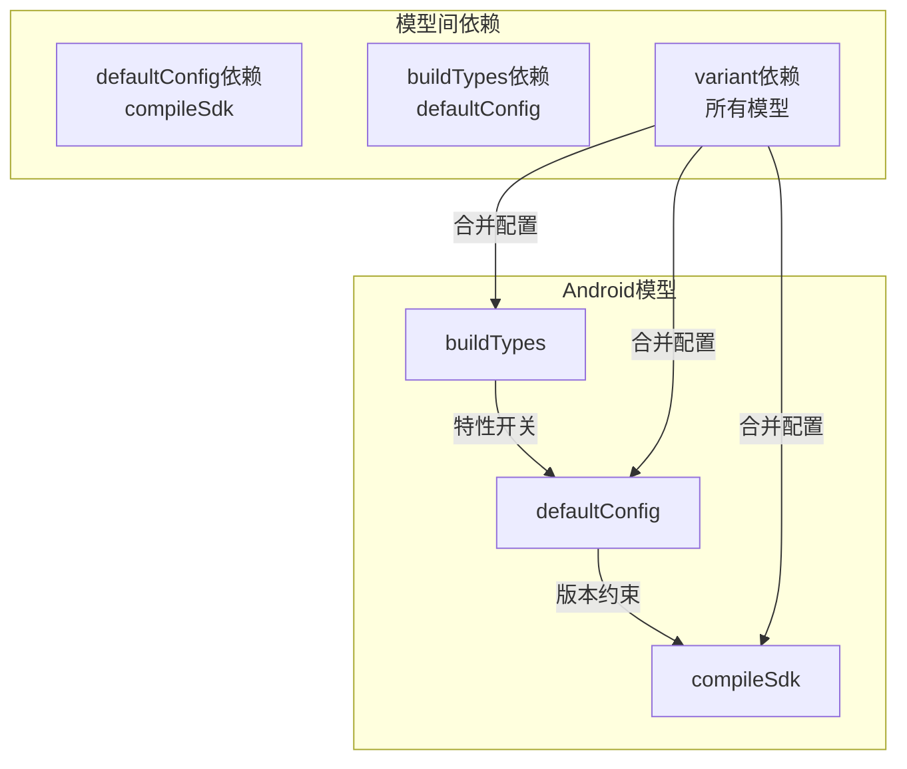
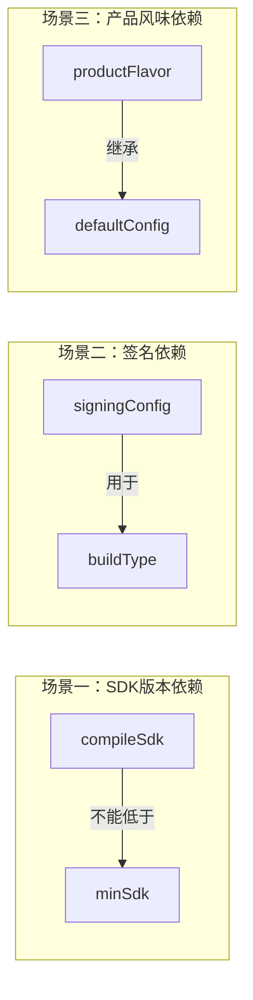
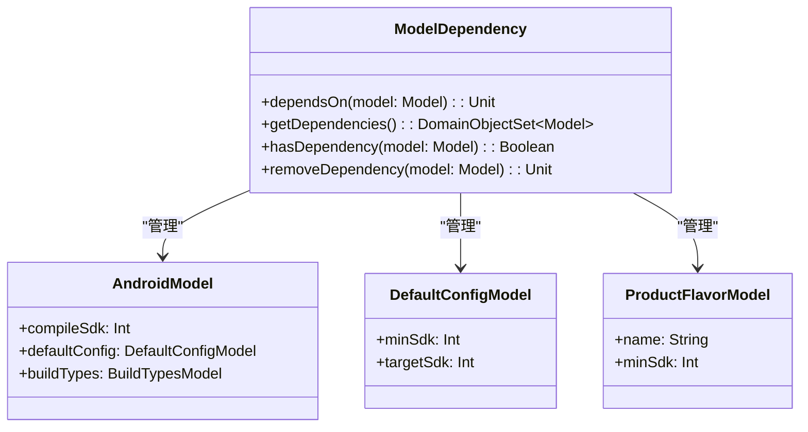
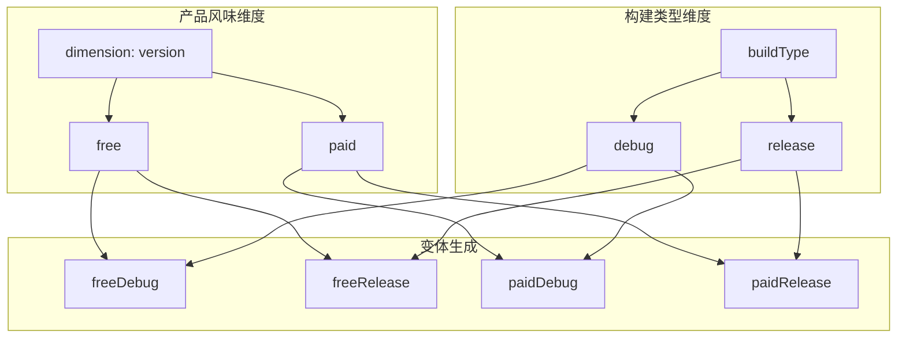

# 21.1.167 模型依赖

夜已经深了。

萤火虫的光芒在草丛中闪烁，像落入人间的星星。洛芙躺在野餐垫上，双手枕在脑袋后面，看着头顶的星空。刚才黛琳讲的MinSdkVersion在她脑子里转来转去，像是一团解不开的毛线球。

“黛琳，”洛芙翻了个身，“你说MinSdkVersion是具体数字，MinSdkSpec是配置对象。那……这些配置对象之间有没有什么关系？”

黛琳正在收拾白板笔，听到这个问题，动作停顿了一下。她转过身来，眼中闪过一丝笑意：“你问到点子上了。这就要讲到ModelDependency了。”

“又是Dependency？”洛芙觉得这个单词有点耳熟，“是依赖的意思吗？”

“对，是依赖。”希尔把笔记本放在膝盖上，“不过这次不是代码库的依赖，而是构建配置模型之间的依赖。”

伊莎点燃了另一盏小灯笼，暖黄色的光芒照亮了她们围坐的小圈：“构建配置模型……又是什么？”

---

**构建系统里的“模型”是什么**

黛琳在白板上画了一个示意图：“在Gradle构建系统里，我们写的每一行配置，最终都会变成一个'模型'。比如你写android {}，就创建了一个Android模型；写defaultConfig {}，创建了默认配置模型；写buildTypes {}，创建了构建类型模型。”

洛芙歪着头：“所以模型就是……配置的具体化？”

“差不多是这个意思。”黛琳微笑，“模型就是配置的结构化表示。编译器看到你的配置，会把它们转换成可以被查询、操作的对象。”

希尔敲了一段代码来演示：

```kotlin
// 我们写的配置
android {
    compileSdk = 34
    
    defaultConfig {
        applicationId = "com.example.app"
        minSdk = 24
    }
    
    buildTypes {
        release {
            isMinifyEnabled = true
        }
        debug {
            isDebuggable = true
        }
    }
}

// Gradle内部会创建对应的模型对象
class AndroidModel(
    val compileSdk: Int = 34,
    val defaultConfig: DefaultConfigModel = ...,
    val buildTypes: BuildTypesModel = ...
)

class DefaultConfigModel(
    val applicationId: String = "com.example.app",
    val minSdk: Int = 24
)

class BuildTypesModel(
    val release: BuildTypeModel = BuildTypeModel(isMinifyEnabled = true),
    val debug: BuildTypeModel = BuildTypeModel(isDebuggable = true)
)
```

“这个例子展示了配置和模型的对应关系。”希尔说，“我们写的每一行配置，Gradle都会在内部创建一个对应的模型对象。”

---

**为什么需要ModelDependency**

伊莎轻声问：“那这些模型之间，为什么需要依赖关系？”

黛琳画了一幅流程图：



“这个图展示了模型之间的关系。”黛琳解释道，“defaultConfig的minSdk不能超过compileSdk，buildTypes会继承defaultConfig的特性，而variant（变体）需要合并所有模型的配置。”

洛福举手提问：“那ModelDependency就是用来管理这些关系的？”

“对。”黛琳点头，“ModelDependency是Gradle DSL中专门用来定义'这个模型的某个属性依赖于另一个模型'的类。”

---

**ModelDependency的基本用法**

希尔把笔记本转过来，调出详细的代码：

```kotlin
// ModelDependency的使用方式（简化版）
// 实际上在现代AGP中，这些依赖大多是自动推断的

android {
    defaultConfig {
        // 这里有隐式的ModelDependency
        // minSdk依赖于compileSdk
        // 如果minSdk > compileSdk，会报错
        minSdk = 24
    }
    
    compileSdk = 34
}

// 显式使用ModelDependency（自定义插件场景）
class MyPlugin : Plugin<Project> {
    override fun apply(project: Project) {
        project.extensions.configure<com.android.build.gradle.AppExtension> { android ->
            // 显式定义模型依赖关系
            android.defaultConfig.minSdkDependency().apply {
                // 设置对compileSdk的依赖
                // 当compileSdk变化时，minSdk的验证会重新执行
            }
        }
    }
}

// 更详细的依赖定义
androidComponents {
    beforeVariants(selector().all()) { variant ->
        // 在变体创建前，可以定义配置模型之间的依赖
        variant.minSdkDependencies { minSdk ->
            // minSdk依赖于compileSdk
            minSdk.get().dependsOn(android.compileSdk)
        }
    }
}
```

“实际上，大多数情况下你不需要显式写ModelDependency。”希尔解释道，“Gradle会自动推断模型之间的依赖关系。但当你写自定义插件或高级配置时，ModelDependency就很重要了。”

---

**常见的模型依赖场景**

黛琳在白板上画了更多的场景：



“这些是常见的模型依赖场景。”黛琳说，“compileSdk必须大于等于minSdk，buildType可以使用签名配置，productFlavor会继承defaultConfig的设置。”

洛芙问：“那这些依赖关系在代码里怎么体现？”

希尔敲了一段代码：

```kotlin
// 场景一：SDK版本依赖
android {
    compileSdk = 34
    
    defaultConfig {
        minSdk = 24  // OK，24 < 34
        
        // minSdk = 35  // 错误！35 > 34，违反了依赖约束
    }
}

// 场景二：签名配置依赖
android {
    signingConfigs {
        create("debug") {
            storeFile = file("debug.keystore")
            storePassword = "android"
            keyAlias = "androiddebugkey"
            keyPassword = "android"
        }
    }
    
    buildTypes {
        debug {
            signingConfig = signingConfigs.debug
        }
        release {
            signingConfig = signingConfigs.release
        }
    }
}

// 场景三：产品风味依赖
android {
    defaultConfig {
        applicationId = "com.example.app"
        minSdk = 21
    }
    
    productFlavors {
        create("free") {
            // 继承defaultConfig的所有属性
            // 并可以覆盖或添加新属性
            applicationIdSuffix = ".free"
            minSdk = 24  // 覆盖，free版需要更高的minSdk
        }
        create("paid") {
            applicationIdSuffix = ".paid"
        }
    }
}
```

---

**ModelDependency的内部结构**

伊莎好奇地问：“ModelDependency这个类里面有什么？”

黛琳画了一个类图：



“这个图展示了ModelDependency的结构。”黛琳说，“它有几个关键方法：dependsOn()用于添加依赖，getDependencies()用于查询所有依赖，hasDependency()用于检查是否存在依赖。”

---

**依赖链的解析与验证**

希尔打开一个更复杂的示例：

```kotlin
// 复杂的模型依赖链示例
android {
    compileSdk = 34
    
    defaultConfig {
        minSdk = 24
        targetSdk = 34
    }
    
    productFlavors {
        create("china") {
            minSdk = 23  // 覆盖defaultConfig的minSdk
            // 隐式依赖：china依赖于defaultConfig
            // 同时也隐式依赖于compileSdk
        }
        create("global") {
            minSdk = 21  // 更低的minSdk
        }
    }
    
    buildTypes {
        debug {
            minSdk = 19  // 覆盖，debug版支持更老的设备
        }
        release {
            // 依赖链：release → defaultConfig → compileSdk
        }
    }
}

// Gradle内部的依赖验证逻辑
class DependencyValidator {
    fun validate(config: AndroidConfig): List<ValidationError> {
        val errors = mutableListOf<ValidationError>()
        
        // 验证1：minSdk不能超过compileSdk
        for (flavor in config.productFlavors) {
            if (flavor.minSdk > config.compileSdk) {
                errors.add(ValidationError(
                    "产品风味 ${flavor.name} 的 minSdk (${flavor.minSdk}) " +
                    "不能超过 compileSdk (${config.compileSdk})"
                ))
            }
        }
        
        // 验证2：targetSdk不能超过compileSdk
        if (config.defaultConfig.targetSdk > config.compileSdk) {
            errors.add(ValidationError(
                "targetSdk (${config.defaultConfig.targetSdk}) " +
                "不能超过 compileSdk (${config.compileSdk})"
            ))
        }
        
        // 验证3：buildType的minSdk不能违反约束
        for (buildType in config.buildTypes) {
            if (buildType.minSdk > config.compileSdk) {
                errors.add(ValidationError(
                    "构建类型 ${buildType.name} 的 minSdk 不能超过 compileSdk"
                ))
            }
        }
        
        return errors
    }
}
```

“Gradle会在构建时自动验证这些依赖关系。”希尔说，“如果违反了约束，会在编译时报错。”

---

**变体维度的依赖管理**

洛芙问：“刚才说的都是单个模型，如果有多个维度呢？”

黛琳画了一幅更复杂的图：



“变体是产品风味和构建类型的组合。”黛琳说，“每个变体都会继承所有模型的依赖关系。”

希尔敲代码演示：

```kotlin
// 变体维度的依赖配置
android {
    flavorDimensions += "version"
    flavorDimensions += "device"
    
    productFlavors {
        create("free") {
            dimension = "version"
            minSdk = 21
            applicationIdSuffix = ".free"
        }
        create("paid") {
            dimension = "version"
            minSdk = 24
            applicationIdSuffix = ".paid"
        }
        create("phone") {
            dimension = "device"
            // 继承version维度的依赖
        }
        create("tablet") {
            dimension = "device"
            minSdk = 23  // 平板需要更高的minSdk
        }
    }
    
    buildTypes {
        debug {
            // debug构建类型
            minSdk = 19  // debug可以更低
        }
        release {
            // release构建类型
            // 依赖签名配置
        }
    }
}

// 生成的变体：
// freePhoneDebug, freePhoneRelease
// freeTabletDebug, freeTabletRelease
// paidPhoneDebug, paidPhoneRelease
// paidTabletDebug, paidTabletRelease
// 
// 每个变体都遵循依赖链：
// variant.minSdk = max(free.minSdk, tablet.minSdk, debug.minSdk)
// variant.dependsOn(compileSdk)
// variant.dependsOn(defaultConfig)
```

---

**自定义模型依赖**

伊莎轻声问：“如果我们自己写插件，怎么定义模型依赖？”

黛琳画了一个自定义场景：

```kotlin
// 自定义插件中定义模型依赖
abstract class MyVariantExtension : Extension {
    abstract val minSdk: Property<Int>
    abstract val targetSdk: Property<Int>
    abstract val dependencies: DomainObjectSet<ModelDependency>
}

class MyPlugin : Plugin<Project> {
    override fun apply(project: Project) {
        val ext = project.extensions.create<MyVariantExtension>("myExt")
        
        // 定义依赖关系
        project.afterEvaluate {
            ext.dependencies.all { dep ->
                println("扩展依赖: ${dep.name}")
            }
        }
    }
}

// 在build.gradle中使用自定义插件
plugins {
    id("my-custom-plugin")
}

myExt {
    minSdk = 24
    targetSdk = 34
    
    // 使用dependsOn定义依赖
    minSdkDependency {
        dependsOn(android.defaultConfig)
    }
}
```

---

**反模式与最佳实践**

黛琳表情变得认真起来：“再说几个常见的错误做法。”

**反模式一：循环依赖**

```kotlin
// ❌ 错误示例：循环依赖
android {
    defaultConfig {
        // 这里不能依赖自己！
    }
    
    productFlavors {
        create("a") {
            // 错误：不能形成循环依赖
            minSdk = this@defaultConfig.minSdk
        }
    }
}

// ✅ 正确示例：单向依赖
android {
    defaultConfig {
        minSdk = 21
    }
    
    productFlavors {
        create("a") {
            // 正确：flavor依赖于defaultConfig
            minSdk = 24  // 覆盖defaultConfig的值
        }
    }
}
```

“循环依赖会导致构建失败。”黛琳说，“依赖链必须是单向的。”

**反模式二：隐式依赖不清晰**

```kotlin
// ❌ 错误示例：依赖关系不明确
android {
    compileSdk = 34
    defaultConfig {
        // 不清楚minSdk依赖于compileSdk
        minSdk = 35  // 编译时才会报错，不够明确
    }
}

// ✅ 正确示例：明确依赖关系
android {
    compileSdk = 34  // 先定义被依赖的
    
    defaultConfig {
        // 明确minSdk的合法范围
        minSdk = 24  // 小于compileSdk
    }
    
    // 使用验证插件明确依赖约束
    pluginManager.withPlugin("com.android.model-validator") {
        // 在配置阶段就验证依赖
    }
}
```

**反模式三：忽略依赖验证**

```kotlin
// ❌ 错误示例：忽略依赖验证
android {
    compileSdk = 34
    
    defaultConfig {
        minSdk = 33
        
        // 违反了 minSdk <= compileSdk 的约束
        // 运行./gradlew build 时会报错
    }
}

// ✅ 正确示例：正确设置依赖约束
android {
    compileSdk = 34
    
    defaultConfig {
        minSdk = 24  // 24 <= 34，正确
    }
}
```

---

**模型依赖的调试**

希尔展示了一个调试技巧：

```kotlin
// 查看模型依赖关系
// 在build.gradle中添加调试代码

androidComponents {
    beforeVariants(selector().all()) { variant ->
        println("=== 变体: ${variant.name} ===")
        println("minSdk: ${variant.minSdk.get()}")
        println("targetSdk: ${variant.targetSdk.get()}")
        
        // 打印依赖信息
        variant.modelDependencies.forEach { dep ->
            println("  依赖: ${dep}")
        }
    }
}

// 运行 ./gradlew build --info | grep "依赖"
// 可以看到详细的依赖解析过程
```

---

夜已经很深了，湖面上泛着星光。洛芙打了个哈欠，眼皮开始打架。

“所以ModelDependency就是……管理这些配置模型之间关系的东西？”洛芙总结道。

“对。”黛琳点头，“它定义了哪个模型的属性依赖于哪个模型，确保依赖链的正确性。大多数情况下，Gradle会自动处理这些依赖，但你需要理解这个机制，才能写出正确的配置。”

伊莎轻声补充：“就像露营时的装备配合，帐篷需要地钉固定，地钉需要锤子敲，锤子需要背包来背——它们形成了一个依赖链，哪个环节出了问题都不行。”

“理解得很形象。”黛琳说。

希尔收起笔记本：“记住，模型依赖的核心规则是：被依赖的值必须先定义，依赖链不能形成循环，依赖约束必须在编译前满足。”

洛芙点点头，夜风轻轻吹过，带着湖水的清凉和青草的香气。萤火虫在草丛中闪烁，像是夜空撒落的星星。

“晚安，洛芙。”黛琳说。

“晚安～”洛芙应道，闭上眼睛。

---

> 学习建议

1. **理解ModelDependency的基本概念**：它是Gradle DSL中用于管理构建配置模型之间依赖关系的类。

2. **常见的模型依赖场景**：包括SDK版本依赖（minSdk <= compileSdk）、签名配置依赖、产品风味继承等。

3. **依赖链的单向性**：依赖链必须是单向的，不能形成循环依赖，否则构建会失败。

4. **隐式依赖vs显式依赖**：大多数依赖是Gradle自动推断的，但自定义插件场景可能需要显式定义。

5. **依赖验证机制**：Gradle会在构建时验证依赖约束，违反约束会导致编译错误。

6. **变体的依赖组合**：变体是产品风味和构建类型的组合，每个变体都继承所有模型的依赖关系。

---

## 洛芙的小小日记本

今晚学到了ModelDependency～黛琳说构建配置模型之间有依赖关系，就像帐篷需要地钉、地钉需要锤子这个道理一样。compileSdk是底层，minSdk要依赖它不能超过它。产品风味依赖defaultConfig，构建类型也是。大多数依赖是自动推断的，但自己要写插件时就得显式定义啦。好困，晚安～(95字)

---

## 今日关键词

- **ModelDependency**：Gradle DSL中用于管理构建配置模型之间依赖关系的类
- **构建模型**：Gradle配置的结构化表示，如AndroidModel、DefaultConfigModel等
- **模型依赖链**：模型之间形成的单向依赖关系
- **SDK版本依赖**：minSdk不能超过compileSdk的约束关系
- **产品风味依赖**：productFlavor继承defaultConfig的依赖关系
- **构建类型依赖**：buildType继承配置的依赖关系
- **变体依赖**：variant合并所有模型配置的依赖关系
- **循环依赖**：模型之间形成闭环的依赖（错误）
- **隐式依赖**：Gradle自动推断的依赖关系
- **显式依赖**：在自定义插件中显式定义的依赖关系
- **依赖验证**：构建时检查依赖约束是否满足的机制
