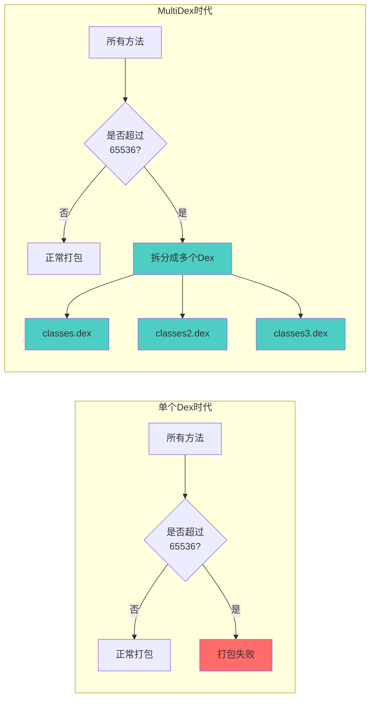
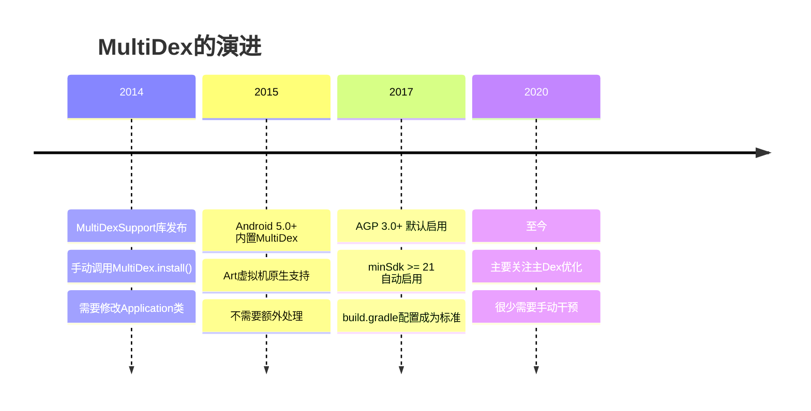
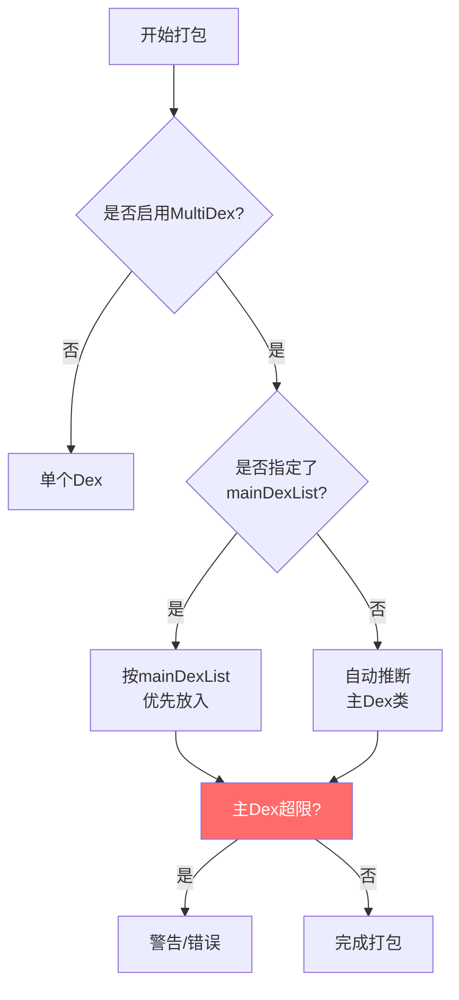
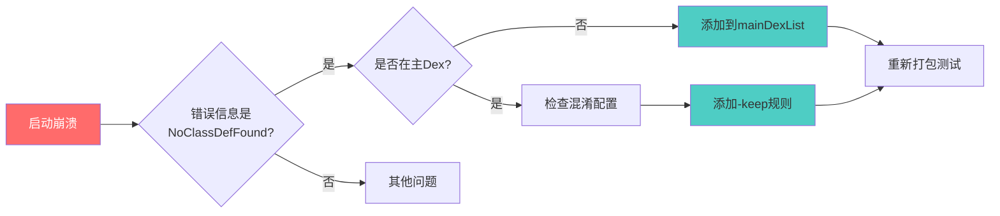

# 21.1.168 MultiDexConfig

夜已经很深了。

洛芙打了个哈欠，眼皮开始打架。刚才黛琳讲的ModelDependency在她脑子里转来转去，像是解开的毛线团终于理出了个头绪。

“黛琳，”洛芙揉了揉眼睛，“你说模型之间有依赖关系……那构建系统里还有没有别的什么复杂问题？”

黛琳正在收拾白板笔，听到这个问题，她看了一眼希尔。希尔正盯着笔记本屏幕，眉头微微皱起。

“有啊，”希尔开口了，“说到复杂问题，你们知道吗，有些大型App，光是依赖的库加起来，方法数能超过六万个。”

“六万？”洛芙瞬间清醒了，“这么多？”

伊莎正在给大家倒热可可，她抬起头：“方法数？是指函数的数量吗？”

“对，就是方法的数量。”希尔点点头，“Android的Dex文件有个硬性限制——单个Dex文件最多只能包含65536个方法。一旦超过这个数字，安装就会失败。”

洛芙瞪大了眼睛：“那……那怎么办？”

“这就是今天要讲的——MultiDex。”黛琳重新坐好，“让一个App能有两个甚至多个Dex文件，分担这个压力。”

---

**为什么需要MultiDex**

伊莎把热可可递给每个人：“65536……这个数字好眼熟。”

“对，2的16次方。”黛琳接过杯子，“这是Dex格式的Limitation。每个Dex文件的索引表只有16位，只能寻址65536个方法引用。这是Dex文件格式本身的限制，没法直接修改。”

洛芙算了算：“我们才学了一个多月的方法数……那大公司那些做了好几年的App，岂不是随随便便就超限了？”

“随随便便。”希尔苦笑，“一个Retrofit加OkHttp，将近百个方法。Glide又是近百个。Room、Navigation、WorkManager……随随便便加起来就超标了。”

黛琳在白板上画了一个示意图：



“这个图展示了SingleDex和MultiDex的区别。”黛琳解释道，“SingleDex模式下，如果方法数超限就直接失败。MultiDex模式下，会自动把代码拆成多个Dex文件。”

---

**MultiDexConfig是什么**

洛芙问：“那这个MultiDexConfig，是用来配置这个的？”

“对。”希尔调出代码，“MultiDexConfig是Gradle DSL中专门用来配置MultiDex行为的接口。它可以控制是否启用MultiDex、主Dex的选择、是否包含原生库Dex等等。”

黛琳补充：“在现代AGP中，默认情况下，如果你的minSdkVersion大于等于21，系统会自动启用MultiDex。所以很多情况下你甚至不需要手动配置。”

“这么智能？”洛芙惊讶。

“对，因为Android 5.0之前的系统不支持MultiDex，需要特殊处理。”黛琳解释，“后来Google就默认启用了。”

---

**MultiDexConfig的基本属性**

希尔在笔记本上敲了一段代码示例：

```kotlin
android {
    defaultConfig {
        // 启用MultiDex支持
        multiDexEnabled = true
    }
    
    // 详细的MultiDex配置
    buildTypes {
        debug {
            // debug构建也启用MultiDex
            multiDexEnabled = true
        }
        release {
            // release构建的MultiDex配置
            multiDex {
                // 是否启用MultiDex
                isEnable = true
                
                // 主Dex中必须包含的类（可选）
                // 这在某些需要主Dex中类优先加载的场景很有用
                mainDexList = listOf(
                    "com.example.app.MyApplication",
                    "com.example.app.SomeCriticalClass"
                )
                
                // 是否包含原生库Dex（可选）
                // 某些情况下可能需要
                includeNativeLibs = true
            }
        }
    }
}
```

洛芙看着代码：“isEnable、mainDexList……这些是主要的配置项吗？”

“对。”黛琳点头，“isEnable用来开关MultiDex，mainDexList用来指定哪些类必须放在主Dex中，includeNativeLibs控制是否在Dex中包含原生库。”

伊莎问：“为什么需要指定主Dex？让系统自动分配不行吗？”

“这就要说到一个历史问题了。”黛琳的表情变得认真起来，“在Android 5.0之前的设备上，应用启动时必须先加载主Dex。如果主Dex中的类找不到，整个应用都启动不了。”

希尔补充：“最常见的问题是某些库在静态初始化块中加载类。如果你把那个库的所有类都放到secondaryDex，启动时就会崩溃。”

---

**MultiDex的演进历程**

伊莎很好奇：“那以前是怎么处理的？”

黛琳讲起了历史：“早期MultiDex有两个实现——MultiDex.install()和MultiDexApplication。”

“在你的Application类中，要么继承MultiDexApplication，要么在attachBaseContext中调用MultiDex.install()。”

黛琳画了一幅时间线：



“这个图展示了MultiDex的发展历程。”黛琳说，“从最初需要手动调用install()，到后来系统原生支持，再到现在的默认启用，门槛越来越低。”

---

**主Dex优化的艺术**

洛芙问：“那现在我们还需要关心主Dex吗？”

“需要。”希尔说，“虽然大多数情况下系统会自动处理，但了解主Dex优化可以帮你解决一些奇怪的启动崩溃问题。”

黛琳在白板上画了一个主Dex选择的流程图：



“这个图展示了主Dex的选择逻辑。”黛琳解释，“如果你指定了mainDexList，就按列表来；没有指定的话，AGP会自动推断哪些类应该优先放在主Dex中。”

洛芙好奇：“那它怎么推断？”

“主要是看Application类、launcher Activity，以及一些已知的库类。”希尔说，“这些类如果在secondaryDex，启动时会找不到对应的类。”

---

**实战：配置MultiDex**

希尔把笔记本转过来：“我写一个完整的示例，你们看看。”

```kotlin
// build.gradle (app level)
plugins {
    id 'com.android.application'
}

android {
    compileSdk = 34
    
    defaultConfig {
        applicationId = "com.example.campingapp"
        minSdk = 21
        targetSdk = 34
        versionCode = 1
        versionName = "1.0"
        
        // 启用MultiDex
        multiDexEnabled = true
    }
    
    buildTypes {
        release {
            minifyEnabled = true
            shrinkResources = true
            proguardFiles getDefaultProguardFile('proguard-android-optimize.txt'), 'proguard-rules.pro'
            
            // release构建的MultiDex配置
            multiDex {
                isEnable = true
                
                // 显式指定主Dex类列表
                // 某些需要优先加载的关键类
                mainDexList = listOf(
                    // Application类必须在主Dex
                    "com.example.campingapp.CampingApp",
                    // 关键的启动类
                    "com.example.campingapp.ui.MainActivity"
                )
            }
        }
        
        debug {
            // debug构建也启用MultiDex，方便调试
            multiDexEnabled = true
        }
    }
}

dependencies {
    implementation 'androidx.multidex:multidex:2.0.1'
}
```

洛芙仔细看着代码：“那个multidex依赖是必须的？”

“在minSdk >= 21的情况下不是必须的。”黛琳解释，“但如果你要支持更低版本的Android，还是需要这个库。”

洛芙点头表示理解。

---

**反模式与常见问题**

伊莎问：“有什么常见的坑吗？”

“有几个。”希尔扳着手指头，“第一，不要把太多类放到主Dex。主Dex太大会影响启动速度。”

黛琳补充：“第二，如果遇到启动崩溃，先检查主Dex中是否包含了所有需要的类。特别是那些在静态初始化块中加载其他类的类。”

“第三，”希尔说，“混淆和MultiDex有时会冲突。混淆可能会把某些类从主Dex中移出去，导致找不到类。”

洛芙问：“那怎么解决？”

“保持主DexList中的类不被混淆，或者使用-keep参数保护它们。”希尔说，“这就是为什么我在mainDexList中指定了具体的类名。”

黛琳画了一个问题排查流程图：



“这个图展示了启动崩溃的排查思路。”黛琳说，“最常见的问题就是类不在主Dex中，加上混淆或者没加-keep规则保护。”

---

**现代最佳实践**

伊莎问：“那现在的最佳实践是什么？”

“现代AGP已经非常智能了。”黛琳总结，“大多数情况下，你只需要在defaultConfig中设置multiDexEnabled = true，其他的系统会自动处理。”

希尔补充：“只有在遇到启动崩溃等特殊问题时，才需要显式配置mainDexList。”

“还有一个建议，”黛琳说，“尽量保持依赖精简。有时候与其花时间优化主Dex，不如直接减少依赖。”

洛芙若有所思：“这好像是另一个层面的问题了。”

“对，这是一个系统工程。”黛琳微笑，“好了，时间不早了。我们明天还要早起去爬山呢。”

洛芙抬头看了看天。凌晨的湖畔，萤火虫的光芒变得更加稀疏，像快要燃尽的萤灯。草丛里的虫鸣声渐渐稀少，只有偶尔一两声夜鸟的叫声打破寂静。

“黛琳，”洛芙最后问一个问题，“那有没有什么情况下不应该使用MultiDex？”

“有。”黛琳收拾着东西，“如果你的方法数远低于65536，启用MultiDex反而会增加复杂度。但这种情况很少见，因为现代App几乎都会超过这个限制。”

洛芙点点头，把热可可喝完。深夜的露营地上，她感觉学到了很多。

---

> 学习建议

理解MultiDex的关键在于把握三点：1）Dex文件65536的方法数限制是Dex格式本身的限制，无法直接突破；2）MultiDex通过将代码拆分为多个Dex文件来解决这个问题；3）现代AGP在minSdk >= 21时默认启用MultiDex，只需关注主Dex优化即可解决大多数启动崩溃问题。

## 洛芙的小小日记本

今天黛琳讲的是MultiDex配置，说是因为Dex文件最多只能放65536个方法，大型App会超限。以前要手动调用MultiDex.install()，现在AGP默认启用。不过有时候启动会崩溃，是因为需要的类没在主Dex里，需要通过mainDexList来指定。感觉构建系统要考虑的事情好多啊，不过希尔说大部分情况系统会自动处理，我就放心啦~

---

## 今日关键词

**MultiDex** — Android构建技术，将应用代码拆分为多个Dex文件以突破65536方法数限制的机制。

**MultiDexConfig** — Gradle DSL中用于配置MultiDex行为的接口，包含isEnable、mainDexList、includeNativeLibs等属性。

**Dex文件** — Android平台的字节码文件格式，每个Dex文件最多包含65536个方法引用。

**mainDexList** — MultiDexConfig的属性，指定必须放在主Dex中的类列表，用于解决启动时类找不到的问题。

**MultiDex.install()** — 早期MultiDex库的方法，需在Application的attachBaseContext中手动调用，现已极少使用。

**65536** — 2的16次方，Dex文件格式的硬性限制，单个Dex最多包含的方法引用数。
