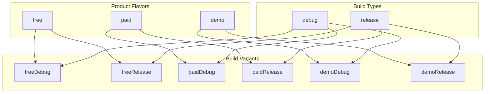
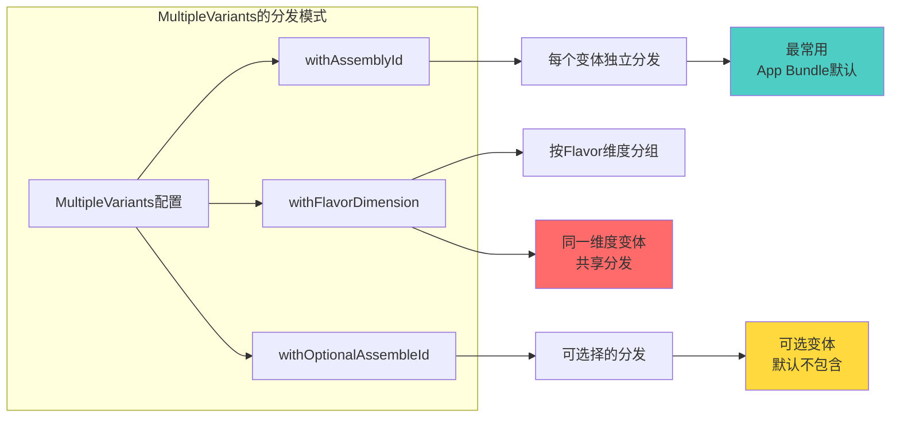
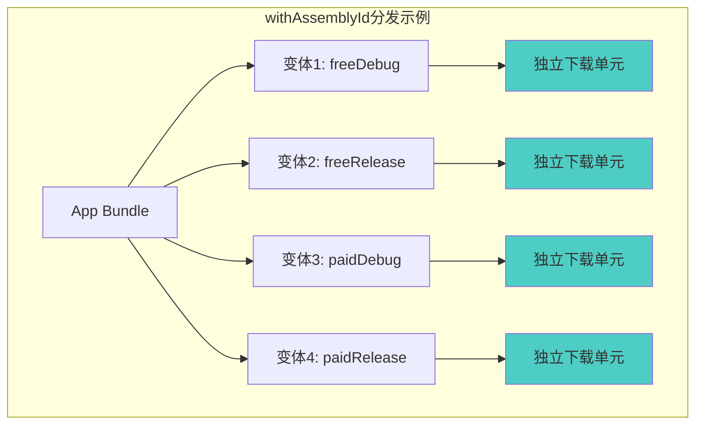
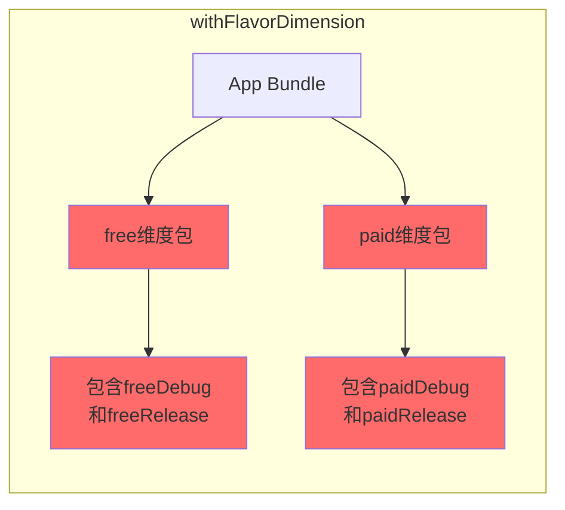
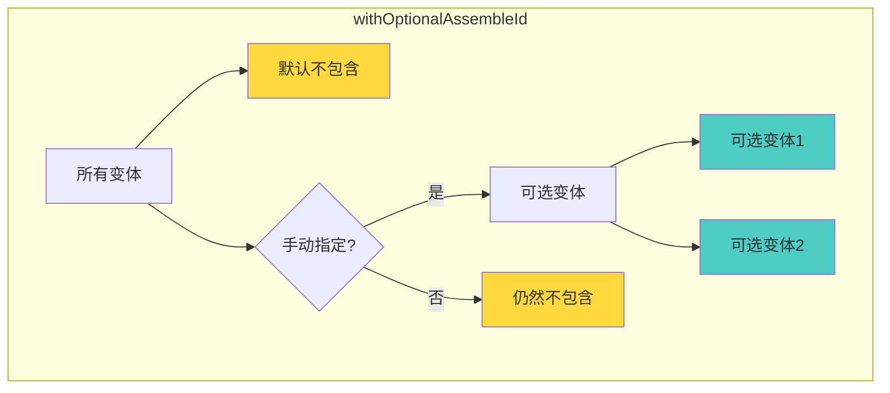
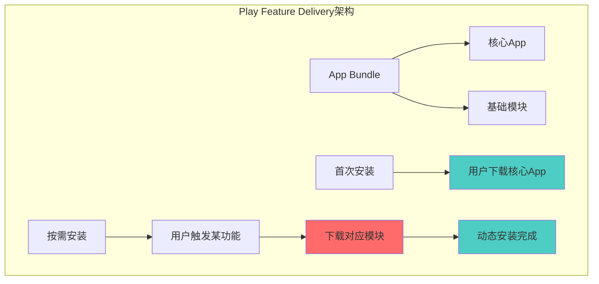
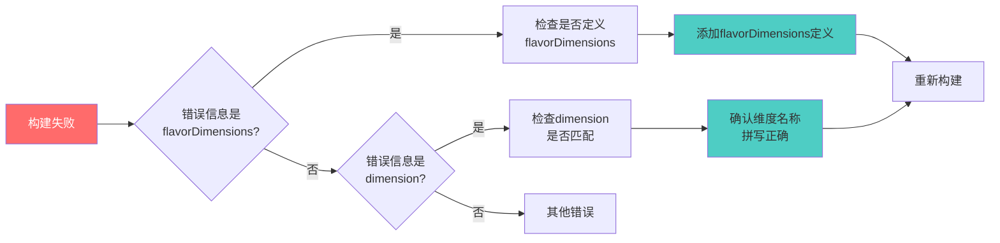

# 21.1.169 MultipleVariants

天边刚泛起鱼肚白，洛芙就被窗外的鸟鸣声唤醒了。

她钻出帐篷，深深吸了一口清晨的空气。湖面上的薄雾正在慢慢散开，朝霞把东方的天空染成了橘红色，水面上波光粼粼，像是撒了一层细碎的金箔。

“洛芙！这边！”

希尔坐在野餐区的长椅上，膝盖上放着笔记本电脑。她招呼洛芙过去，手边还放着一杯刚冲好的咖啡。

“起这么早？”洛芙走过去，在希尔旁边坐下。

“在看我们昨天打包的APK。”希尔把屏幕转过来，“你看，这里有个问题。”

洛芙看到屏幕上显示着项目结构，其中有一行特别醒目：“main”和"full"两个variant。

“我们这个项目，有两个变体？”洛芙问。

“对，一个是标准版，一个是完整版。”希尔说，“昨天黛琳讲的MultiDex解决的是单个APK太大的问题。但有时候我们希望不同的变体可以有不同的分发策略——比如有些功能只给特定的用户群体。”

洛芙似懂非懂地点头。她看到黛琳和伊莎也起来了，正朝这边走来。

“早上好。”黛琳在她们旁边坐下，看到屏幕上的内容，“你们在讨论变体配置？”

“对，我在想怎么更好地配置这两个变体的分发策略。”希尔说。

黛琳微微一笑：“那今天就来讲讲MultipleVariants——这是专门用来配置多变体分发的DSL类。”

---

**为什么需要MultipleVariants**

伊莎接过希尔递来的热可可，好奇地问：“多变体？是指有多个不同的版本吗？”

“对。”黛琳点点头，“在实际项目中，尤其是大型App，经常会有不同的产品版本。比如免费版和付费版，或者针对不同地区的版本。”

洛芙问：“这些版本是怎么区分的？”

“通过Build Variants（构建变体）。”希尔调出一张图来展示，“构建变体是Build Type和Product Flavor的组合。”



“这个图展示了Flavor和Build Type的组合关系。”希尔解释道，“比如你有free和paid两个Flavor，以及debug和release两个Build Type，就会得到四个变体。”

洛芙掰着手指头算：“那如果我有三个Flavor和两个Build Type……”

“六变体。”希尔说，“以此类推。有些大型项目甚至有十几个Flavor，变体数量能达到几十个。”

黛琳补充：“MultipleVariants就是用来配置这些变体的分发策略的。特别是当你使用App Bundle或者Play Feature Delivery时，这个类非常有用。”

---

**MultipleVariants是什么**

伊莎问：“这个MultipleVariants，具体是用来做什么的？”

“简单说，它是用来配置哪些变体可以参与分发的。”黛琳解释道，“比如你想让某些变体只在特定的渠道发布，或者想让某些变体使用动态分发而不是完整的APK。”

希尔调出代码示例：“看，这是MultipleVariants的基本用法。”

```kotlin
android {
    // 配置分发策略
    bundle {
        // 使用MultipleVariants配置多变体分发
        multipleVariants {
            // 指定要包含的变体维度
            // 这里表示所有维度的变体都参与分发
            withAssemblyId()
        }
    }
}
```

洛芙看着代码：“withAssemblyId()是什么？”

“那是MultipleVariants的一个方法。”黛琳解释，“它表示为每个变体生成一个独立的分发ID。这样每个变体都可以单独分发。”

伊莎问：“那有没有其他的选择？”

“有。”希尔说，“最常用的有三个方法。”

黛琳在白板上画了一个对比图：



“这个图展示了三种分发模式的区别。”黛琳说，“withAssemblyId()是最常用的，它会为每个变体生成一个独立的分发包。withFlavorDimension()会把同一维度的变体打包在一起。withOptionalAssembleId()则提供可选的分发。”

---

**withAssemblyId详解**

洛芙问：“那这三个方法，分别用在什么场景？”

“withAssemblyId()最简单直接。”黛琳说，“每个变体都会生成一个独立的分发包。用户下载时，只会下载他们需要的那个变体。”

希尔补充：“这在使用App Bundle时特别有用。因为App Bundle会根据用户的设备配置，只分发需要的代码和资源。”

“比如，”黛琳举例，“如果你的App有arm64和x86两个ABI变体，使用withAssemblyId()后，x86设备的用户只会下载x86的代码，不需要下载arm64的。”

洛芙点头：“这样确实省空间。”

“而且，”希尔说，“它还支持按屏幕密度、按语言等维度分发。”

黛琳画了一个更详细的示例：



---

**withFlavorDimension详解**

伊莎问：“那withFlavorDimension呢？”

“这个稍微复杂一点。”黛琳说，“它不是为每个变体生成独立的分发，而是把同一Flavor维度的变体打包在一起。”

希尔调出代码示例：

```kotlin
android {
    bundle {
        // 按Flavor维度分发
        // 同一个Flavor的debug和release会打包在一起
        multipleVariants {
            withFlavorDimension("version") {
                // 指定Flavor维度名称
                // 如果不指定，默认使用第一个维度
            }
        }
    }
}
```

洛芙问：“这有什么用？”

“有时候，你不想把每个变体都分发给用户。”黛琳解释，“比如你想让所有free版用户下载同一个包，只是区分debug和release。”

希尔补充：“或者，某些变体可能只在特定渠道发布，不需要单独生成下载链接。”

黛琳画了一个对比图：



“这个图展示了withFlavorDimension的效果。”黛琳说，“它把同一Flavor的变体打包在一起，生成两个分发包而不是四个。”

---

**withOptionalAssembleId详解**

洛芙又问：“那第三个方法呢？”

“withOptionalAssembleId()。”希尔说，“这个比较特殊——它是可选的变体，默认不会包含在分发中。”

黛琳补充：“你需要主动指定要包含哪些可选变体。”

```kotlin
android {
    bundle {
        multipleVariants {
            withOptionalAssembleId("demoDebug") {
                // 只有明确指定的变体才会被包含
                // 其他变体不会生成下载单元
            }
        }
    }
}
```

洛芙问：“这有什么用？”

“有时候，”黛琳说，“你想让某些变体只在特定条件下可用。比如内部测试版本，只给特定的测试人员下载。”

希尔补充：“或者，某些功能性的变体，只在特定市场发布。”

黛琳画了一个示意：



---

**实际配置示例**

希尔把笔记本转过来：“我写一个完整的示例给你们看。”

```kotlin
// build.gradle (app level)
plugins {
    id 'com.android.application'
}

android {
    compileSdk = 34
    
    // 定义Product Flavor维度
    flavorDimensions += "version"
    flavorDimensions += "region"
    
    productFlavors {
        // version维度
        free {
            dimension = "version"
            applicationIdSuffix = ".free"
            versionNameSuffix = "-free"
        }
        paid {
            dimension = "version"
            applicationIdSuffix = ".paid"
            versionNameSuffix = "-paid"
        }
        
        // region维度
        global {
            dimension = "region"
        }
        cn {
            dimension = "region"
            applicationIdSuffix = ".cn"
        }
    }
    
    // 配置App Bundle分发策略
    bundle {
        // 使用MultipleVariants
        multipleVariants {
            // 方案一：为每个变体生成独立分发
            withAssemblyId()
            
            // 或者方案二：按Flavor维度分组
            // withFlavorDimension("version")
            
            // 或者方案三：可选变体
            // withOptionalAssembleId("demoDebug")
        }
        
        // 配置ABI分发（仅分发用户设备需要的ABI）
        abi {
            enableSplit = true
        }
        
        // 配置语言分发
        language {
            enableSplit = true
        }
        
        // 配置屏幕密度分发
        density {
            enableSplit = true
        }
    }
}
```

洛芙看着代码：“flavorDimensions、productFlavors、bundle……好复杂。”

“是有点复杂。”黛琳说，“但这个配置非常强大。你可以根据不同的分发需求，选择合适的模式。”

伊莎问：“哪种模式最常用？”

“withAssemblyId()最常用。”希尔说，“因为它最简单，而且能最大化节省用户的下载量。”

---

**与动态分发结合**

黛琳补充：“MultipleVariants还可以和Play Feature Delivery结合使用。”

“什么意思？”洛芙问。

“就是你可以把某些功能做成可选的模块。”黛琳解释，“用户首次安装App时只需要下载核心功能，需要用某个功能时再单独下载。”

希尔调出另一个示例：

```kotlin
// 配置动态功能模块
android {
    bundle {
        // 核心App分发
        multipleVariants {
            withAssemblyId()
        }
    }
}

// 动态功能模块配置
androidFeatures {
    // 高级功能模块
    create("advancedFeatures") {
        // 这个模块是可选的
        // 用户需要时才会下载
        delivery = "on-demand"
    }
    
    // 付费功能模块
    create("premiumFeatures") {
        // 付费用户专属
        delivery = "on-demand"
    }
}
```

黛琳画了一个架构图：



“这个图展示了动态分发的工作流程。”黛琳说，“用户首次安装时只下载核心App，需要用某个功能时再下载对应的模块。”

---

**常见配置错误**

伊莎问：“有什么常见的坑吗？”

“有几个。”希尔扳着手指头，“第一，flavorDimensions必须定义，否则会报错。”

黛琳补充：“第二，如果使用了动态分发，要确保模块之间的依赖关系正确。否则会出现找不到类的问题。”

“第三，”希尔说，“withFlavorDimension()需要指定正确的维度名称，否则会找不到对应的变体。”

洛芙问：“那怎么调试？”

“可以用./gradlew bundleDebug来检查配置是否正确。”希尔说，“或者查看生成的Bundle文件内容。”

黛琳画了一个问题排查流程图：



---

**最佳实践建议**

伊莎问：“那现在的最佳实践是什么？”

黛琳总结：“大多数情况下，使用withAssemblyId()就可以了。它简单、强大，而且能最大化用户利益。”

希尔补充：“只有在有特殊需求时，才考虑其他两种模式。比如你想控制分发渠道，或者某些变体只给特定用户。”

“还有一个建议，”黛琳说，“合理规划你的Flavor。不要创建太多Flavor，否则维护成本会很高。”

洛芙若有所思：“感觉构建系统要考虑的事情好多啊。”

“对，这是一个系统工程。”黛琳微笑，“不过一旦配置好，后续就很少需要改动了。”

清晨的阳光渐渐强烈起来，湖面上的雾气完全散开了。远处的山峦轮廓清晰可见，草地在阳光下发着光。

“黛琳，”洛芙最后问一个问题，“那MultipleVariants和昨天学的MultiDexConfig有关系吗？”

“没什么直接关系。”黛琳解释，“MultiDexConfig是处理单个APK太大问题的，MultipleVariants是处理多变体分发问题的。虽然都涉及构建配置，但解决的问题不同。”

洛芙点点头，把热可可喝完。清晨的露营地上，她感觉又学到了新东西。

---

> 学习建议

理解MultipleVariants的关键在于把握三点：1）它是用来配置多变体分发策略的DSL类，与App Bundle和Play Feature Delivery配合使用；2）三种分发模式（withAssemblyId、withFlavorDimension、withOptionalAssembleId）分别适用于不同场景；3）合理使用MultipleVariants可以显著减少用户的下载量，同时保持App的功能完整性。

## 洛芙的小小日记本

今天学的是MultipleVariants，用来配置多变体分发的。黛琳说withAssemblyId()最常用，因为它会为每个变体生成独立的下载单元，用户只需要下载自己需要的那个版本。之前学的MultiDexConfig是解决单个APK太大的问题，MultipleVariants是解决多变体分发的问题，虽然都和构建配置有关，但解决的问题不一样。感觉构建系统越来越复杂了，不过希尔说大部分情况用默认配置就行，我就放心啦~

---

## 今日关键词

**MultipleVariants** — Gradle DSL中用于配置多变体分发策略的类，决定App Bundle如何为不同变体生成分发单元。

**withAssemblyId()** — MultipleVariants的方法，为每个变体生成独立的分发单元，是最常用的分发模式。

**withFlavorDimension()** — MultipleVariants的方法，按Flavor维度分组分发，同一维度的变体共享分发包。

**withOptionalAssembleId()** — MultipleVariants的方法，可选变体分发，默认不包含，只生成明确指定的变体分发包。

**Build Variants** — 构建变体，由Build Type和Product Flavor组合而成的变体，如freeDebug、paidRelease等。

**Product Flavor** — 产品风味，用于创建不同版本App的维度，如free/paid、global/cn等。

**Build Type** — 构建类型，如debug、release，控制构建的调试和优化选项。

**App Bundle** — Google Play的分发格式，根据用户设备配置动态生成最优的APK。

**Play Feature Delivery** — Google Play的动态功能分发，允许App功能模块按需下载安装。

**flavorDimensions** — Gradle配置中定义Product Flavor维度的属性，用于组合不同的Flavor。