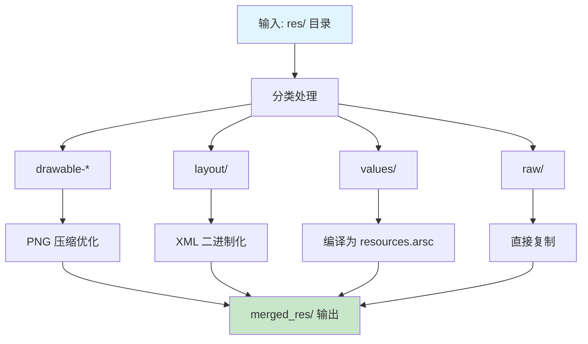
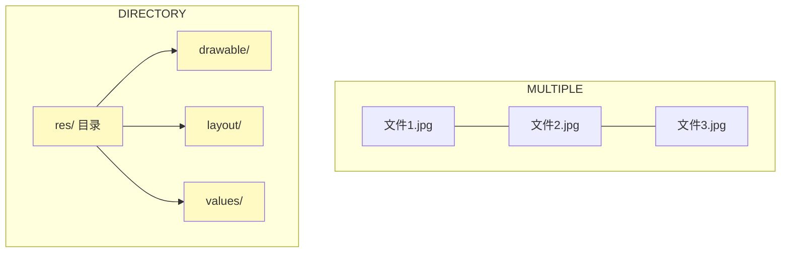

# 21.1.17 ArtifactKind.DIRECTORY

夜已经深了，但帐篷里的讨论却刚刚进入状态。

黛琳刚才画的三个圆圈——SINGLE、MULTIPLE、DIRECTORY——还留在白板上。洛芙盯着那个画着"大框套小框"的 DIRECTORY 类型，总觉得有什么东西没完全想通。

“黛琳，”洛芙歪着脑袋，“你说 DIRECTORY 是文件夹……那到底是怎样的文件夹啊？我们平时在 Android 项目里看到的哪些文件夹是这种类型？”

希尔正在往笔记本电脑上接移动电源，屏幕的电量显示只剩 12% 了。她抬起头：“这个问题问得好！res 文件夹、assets 文件夹——这些可都是 DIRECTORY 类型的典型代表。”

“assets？”洛芙眨了眨眼，“就是那个放图片、放字体、放 JSON 文件的 assets？”

“对。”黛琳点点头，“你想啊——assets 目录里可能有很多子文件夹，每个子文件夹里又有很多不同类型的文件。Gradle 要处理它的时候，总不能把它们打散成单个文件吧？它需要的是一个完整的目录结构。”

伊莎一直倚在帐篷门口，夜风把她的头发轻轻吹起。她回过头来，轻声说：“就像我们的营地一样——帐篷、炊具区、休息区，这些是一个整体。你不能把'炊具区'单独拆出来，因为没有炊具，炊具区就失去意义了。”

“伊莎这个比喻好！”希尔打了个响指，“Android 构建也是一样的——res 目录里的 drawable、layout、values，它们是一个整体。AAPT（Android 资源打包工具）处理资源的时候，需要看到完整的目录结构，才能做合并、优化、压缩。”

黛琳走到白板前，指着 DIRECTORY 的那个大框：“我们来具体看看，Gradle 是怎么处理 DIRECTORY 类型工件的。”

她在白板上画了一个流程图：


“你们看，”黛琳指着图说，“当 Gradle 知道一个工件是 DIRECTORY 类型时，它会怎么做呢？”

她等了一会儿，让洛芙和希尔思考一下。

“首先，”黛琳继续说，“它会递归遍历整个目录树——也就是说，不只是看第一层，还要看子文件夹、子子文件夹……所有内容都要看到。”

“然后呢？”洛芙问。

“然后，它会根据文件类型做不同的处理。drawable 类型的图片会统一压缩，XML 布局文件会统一编译，values 目录里的字符串、颜色、尺寸会统一打包……”黛琳在白板上又画了一个更详细的图：



“原来如此！”洛芙恍然大悟，“所以 res 目录不是一个简单的文件夹，而是一个有组织结构的'资源宝库'！”

“对，”黛琳笑了，“而且最重要的是——你不能只处理其中某一个文件。因为资源之间是有依赖关系的。一个布局文件引用了一个 drawable，一个 drawable 又可能引用了另一个 drawable……所以必须把整个目录作为整体来处理。”

希尔把笔记本电脑转过来，让大家都看到屏幕：“我刚才查了一下 Android Gradle Plugin 的源码，你们看——”

她打开了一个代码片段：

```kotlin
// 这是一个处理 DIRECTORY 类型工件的 Transform 示例
abstract class ResourceMergerTransform : Transform() {

    // 声明输入是 DIRECTORY 类型
    override fun getInputTypes(): Set<ContentType> {
        return setOf(AndroidType.Res)
    }

    // 声明输出也是 DIRECTORY 类型
    override fun outputTypes(): Set<ArtifactKind> {
        return setOf(ArtifactKind.DIRECTORY)
    }

    // 处理单个输入时，会得到一个 DirectoryInput 对象
    override fun transform(transformInvocations: TransformInvocation) {
        transformInvocations.inputs.forEach { input ->
            input.directoryInputs.forEach { directoryInput ->
                // directoryInput.file 是文件夹本身
                val inputDir = directoryInput.file
                
                // 遍历整个目录树
                inputDir.walkTopDown().forEach { file ->
                    if (file.isFile) {
                        // 根据文件扩展名做不同处理
                        when (file.extension) {
                            "png", "jpg" -> compressImage(file)
                            "xml" -> compileXml(file)
                            else -> copyAsIs(file)
                        }
                    }
                }
                
                // 输出到新的目录
                val outputDir = transformInvocations.outputProvider
                    .getContentLocation(
                        directoryInput.name,
                        outputTypes(),
                        setOf(QualifiedContent.Scope.PROJECT),
                        ArtifactKind.DIRECTORY
                    )
                
                // 把处理后的文件写入输出目录
                // ... 写入逻辑 ...
            }
        }
    }
}
```

“哇……”洛芙看着代码，“这个 Transform 处理的输入是 DIRECTORY，输出也是 DIRECTORY。”

“对，”希尔点点头，“这就是 DIRECTORY 类型的一个典型用法——输入一个资源目录，输出一个合并、优化后的资源目录。”

伊莎这时候从帐篷门口走进来，盘腿坐下：“我有个问题——如果我把 assets 目录和 res 目录都交给一个 Transform，它会怎么区分它们？”

“好问题！”黛琳看向伊莎，“虽然它们都是 DIRECTORY，但它们的内容类型不同。Gradle 用另一个概念来区分——那就是 ArtifactType。”

“Type？”洛芙想起了上一章结尾提到的词，“就是那个比 Kind 更细的分类？”

“对。Kind 是大类——SINGLE、MULTIPLE、DIRECTORY。Type 是更具体的类型。”黛琳在白板上写了两行字：

```
Kind: DIRECTORY
Type: ANDROID_RESOURCES  (res 目录)
Type: ANDROID_ASSETS     (assets 目录)
```

“原来如此！”洛芙赶紧记下来，“Kind 是形式——是文件夹，Type 是内容——是什么内容的文件夹。”

夜风更凉爽了。远处偶尔传来蟋蟀的鸣叫声此起彼伏。帐篷里的夜灯摇曳着，在帆布上投下跳动的光影。

“那……”洛芙又举手了，就像在课堂上提问的小学生，“MULTIPLE 和 DIRECTORY 到底有什么区别啊？我老是把它们搞混。”

黛琳想了想：“这样吧——我们来做个对比实验。”

她从背包里拿出两个小盒子：

“第一个盒子——MULTIPLE。就像这个饼干盒里的每一块饼干：它们都是独立的个体，每一块都可以单独拿出来吃。你吃一块，不影响另一块。”

她打开盒子，每人发了一块饼干。

“第二个盒子——DIRECTORY。就像我们的整个营地：帐篷、炊具、食物……它们是一个整体。你不能只把炊具拿走，说'这是炊具区'——没有帐篷，炊具就没有遮风挡雨的地方；没有食物，炊具就没有用武之地。”

黛琳把两个盒子并排放在白板前：



“你们看，”黛琳继续说，“MULTIPLE 里的每个文件是独立的，你可以单独处理任何一个。DIRECTORY 里的文件是相互关联的，你必须作为一个整体来处理。”

洛芙咬了一口饼干，想了想：“那……如果我有一个 Transform，要把 res 目录里的所有 PNG 图片都换成 WebP 格式——这个 Transform 的 Kind 应该是什么？”

希尔 grins（露出灿烂的笑容）：“好问题！答案是什么取决于你的输入和输出是什么。”

她走到白板前，画了一个简单的对比：

```kotlin
// 场景1：把 res/drawable 目录里的所有 PNG 换成 WebP
// 输入：DIRECTORY（整个 res 目录）
// 输出：DIRECTORY（处理后的 res 目录）
// 原因：需要保持目录结构不变

// 场景2：把很多张独立的图片文件压缩
// 输入：MULTIPLE（多个独立的图片文件）
// 输出：MULTIPLE（压缩后的多个图片文件）
// 原因：每个文件独立处理，不需要维持目录结构
```

“我明白了！”洛芙眼睛一亮，“如果我的处理需要保持目录结构，就是 DIRECTORY；如果只是批量处理独立文件，就是 MULTIPLE！”

“对，就是这样。”黛琳点头表示肯定。

伊莎这时候轻声说：“我觉得……这就像整理行李一样。”

大家都看向她。

“如果我要把衣服按类型分开放——上衣、裤子、袜子——每样都是独立的，我需要的是 MULTIPLE。但如果我要准备一个露营的'装备包'——帐篷、炊具、食物、急救用品——它们是一个整体，缺一不可，我需要的是 DIRECTORY。”

“真有你的！”希尔笑了，“这么一说确实很清楚。”

夜更深了。银河在天空中缓缓移动，星星们安静地闪烁着。露水一定结得更重了，洛芙想，明天早上的草地一定是湿漉漉的。

“那……”洛芙打了个哈欠，但还是坚持问完最后一个问题，“DIRECTORY 类型在 Gradle 里到底是怎么表示的？我看代码里好像有个 Directory 接口之类的？”

希尔把屏幕往回滚动，找到了刚才的代码：“对，你来看这里——”

```kotlin
// DirectoryInput - 表示输入的目录
interface DirectoryInput : Named {
    // 获取目录本身
    fun getFile(): File
    
    // 获取目录中的所有文件（包括子目录）
    fun getFiles(): Set<File>
}

// DirectoryOutput - 表示输出的目录
interface DirectoryOutput {
    // 设置输出的目录位置
    fun getContentLocation(
        name: String,
        types: Set<ArtifactKind>,
        scopes: Set<QualifiedContent.Scope>,
        kind: ArtifactKind
    ): File
}
```

“原来是这样……”洛芙仔细看着代码，“DirectoryInput 有一个 getFiles() 方法，可以获取目录里所有的文件……但这个是'平铺'的，不是树状的。”

“对，”黛琳说，“所以在 Transform 里，你经常需要用递归遍历来处理子目录。刚才希尔代码里的 `walkTopDown()` 就是做这个的——它会一层一层地遍历整个目录树。”

她指着图继续说：

```mermaid
graph TD
    A[res/] --> B[drawable/]
    A --> C[layout/]
    A --> D[values/]
    
    B --> B1[icon.png]
    B --> B2[background.jpg]
    
    C --> C1[activity_main.xml]
    C --> C2[fragment_detail.xml]
    
    D --> D1[strings.xml]
    D --> D2[colors.xml]
    
    style A fill:#fff9c4
    style B fill:#fff9c4
    style C fill:#fff9c4
    style D fill:#fff9c4
    
    note[walkTopDown() 会按 A→B→C→D→B1→B2... 的顺序遍历]
```

“如果用 Kotlin 的 API，”希尔补充道，“可以这样写：”

```kotlin
// 递归遍历目录树的几种方式

// 方式1：Kotlin 内置的 walkTopDown()
directoryInput.file.walkTopDown()
    .filter { it.isFile }
    .forEach { file ->
        println("处理文件: ${file.absolutePath}")
    }

// 方式2：walkBottomUp() - 从子文件开始处理
directoryInput.file.walkBottomUp()
    .filter { it.extension == "xml" }
    .forEach { file ->
        // 从内向外处理
        processXml(file)
    }

// 方式3：只遍历第一层
directoryInput.file.listFiles()
    ?.filter { it.isDirectory }
    ?.forEach { subDir ->
        println("子目录: ${subDir.name}")
    }
```

“原来 Kotlin 还有这么方便的 API！”洛芙惊叹道。

“这就是 Kotlin 的强大之处——它的标准库对文件操作支持得很好。”希尔笑着说。

黛琳看了一下手表：“时间不早了。今天我们深入讲了 DIRECTORY 类型——它是文件夹类型，需要整体处理，通常用于资源目录。关键是要区分 MULTIPLE 和 DIRECTORY：需要保持目录结构就用 DIRECTORY，不需要就用 MULTIPLE。”

洛芙点了点头，把刚才学的知识在脑海里过了一遍：DIRECTORY 是文件夹类型，需要整体处理，和露营的"装备包"一样是完整的整体。处理时用 DirectoryInput 和 DirectoryOutput，遍历目录树用 walkTopDown() 或 walkBottomUp()。

“那明天我们讲什么？”洛芙问。

“ArtifactType，”黛琳说，“就是比 Kind 更细的分类——比如 res 目录是 ANDROID_RESOURCES 类型，assets 目录是 ANDROID_ASSETS 类型……”

“听起来好复杂……”洛芙嘟囔着，但嘴角带着笑。

“慢慢来，”伊莎温柔地说，“先把这个晚上学的记住就好。星星都在提醒我们该休息了。”

帐篷外的星空依旧明亮。洛芙闭上眼睛，脑海里还回响着 DIRECTORY、MULTIPLE、SINGLE——三种类型，三种整理方式，三种处理逻辑。晚风轻轻吹过，带来了夜晚特有的草木清香。

明天又是新的一天。

---

## 技术总结

### 核心机制定义

ArtifactKind.DIRECTORY 是 Android Gradle Plugin 中表示"文件夹/目录类型"的工件Kind。与 SINGLE（单文件）和 MULTIPLE（多文件）不同，DIRECTORY 强调**保持完整的目录结构**进行整体处理。

### 典型应用场景

- **res 目录**：Android 资源目录，包含 drawable、layout、values 等子目录
- **assets 目录**：原始资源目录，存放图片、字体、JSON等
- **jniLibs 目录**：Native 库目录
- **AAPT 处理**：AAPT 会递归处理资源目录，保持子目录结构

### 与 MULTIPLE 的区别

| 特性 | DIRECTORY | MULTIPLE |
|------|-----------|----------|
| 处理方式 | 保持目录结构 | 批量处理独立文件 |
| 遍历顺序 | 可控制（topDown/bottomUp） | 无序集合 |
| 适用场景 | 资源目录、assets | class文件、图片集合 |
| API | DirectoryInput/DirectoryOutput | MultipleArtifact |

### 反模式与陷阱

**❌ 错误：把 DIRECTORY 当 MULTIPLE 处理**
- 会丢失目录结构，导致资源引用失败

**❌ 错误：目录遍历顺序不当**
- topDown：适合需要父目录先于子目录处理的场景
- bottomUp：适合需要子目录先处理的场景

---

## 动手练习

### ★ 区分 DIRECTORY 和 MULTIPLE

判断以下产物类型：
1. `app/src/main/res/` → **DIRECTORY**
2. `app/build/intermediates/javac/debug/classes/` → **MULTIPLE**
3. `app/src/main/assets/` → **DIRECTORY**
4. `app/build/outputs/apk/debug/` → **MULTIPLE**

### ★★ 实现目录遍历

使用 Kotlin 遍历 res 目录，统计每种资源类型的文件数量：
```kotlin
val resDir = file("app/src/main/res")
resDir.walkTopDown()
    .filter { it.isFile }
    .groupBy { it.extension }
    .forEach { (ext, files) ->
        println("$ext: ${files.size} 个文件")
    }
```

### ★★★ 设计 DIRECTORY Transform

设计一个自动生成版本信息文件的 Transform：
- 输入：res 目录 (DIRECTORY)
- 输出：generated 版本目录 (DIRECTORY)
- 保持原始目录结构

---

## 面试热身

### Q1: 什么是 ArtifactKind.DIRECTORY？

**A**: 表示文件夹/目录类型的工件Kind，需要整体处理并保持目录结构。

### Q2: DIRECTORY 和 MULTIPLE 的核心区别？

**A**: DIRECTORY 强调保持目录结构，MULTIPLE 是独立文件的集合。

### Q3: DirectoryInput 和 File 的区别？

**A**: DirectoryInput 表示整个目录及其内容，File 只是单个文件。

### Q4: 何时使用 walkTopDown() vs walkBottomUp()？

**A**: 
- walkTopDown：父目录先于子目录处理
- walkBottomUp：子目录先于父目录处理

### Q5: AAPT 如何处理资源目录？

**A**: AAPT 递归遍历资源目录，解析 XML，编译资源表，保持目录结构生成 .flat 文件。

---

## 参考实现要点

```kotlin
class VersionInfoTransform : Transform() {
    
    override fun getInputTypes(): Set<QualifiedContent.DefaultContentType> {
        return setOf(QualifiedContent.DefaultContentType.NATIVE_RES)
    }
    
    override fun getScopes(): MutableSet<in QualifiedContent.Scope> {
        return mutableSetOf(QualifiedContent.Scope.PROJECT)
    }
    
    // 关键：声明为 DIRECTORY 类型
    override fun isManifestFile(): Boolean = false
    
    override fun transform(transformInvocation: TransformInvocation) {
        val outputProvider = transformInvocation.outputProvider
        
        // 获取输入目录
        transformInvocation.inputs.forEach { input ->
            input.directoryInputs.forEach { dirInput ->
                // 遍历目录树
                dirInput.file.walkTopDown().forEach { file ->
                    if (file.isFile) {
                        // 处理每个文件
                        processFile(file)
                    }
                }
                
                // 获取输出目录（保持结构）
                val outputDir = outputProvider.getContentLocation(
                    dirInput.name,
                    dirInput.contentTypes,
                    dirInput.scopes,
                    Format.DIRECTORY
                )
                
                // 复制到输出（保持目录结构）
                dirInput.file.copyRecursively(outputDir, overwrite = true)
            }
        }
    }
}
```

---

> 学习建议：理解 ArtifactKind.DIRECTORY 的关键是认识到它是"需要整体处理的文件夹类型"。在实际开发中，res 目录、assets 目录、jniLibs 目录等都是 DIRECTORY 类型的典型代表。写 Transform 时，如果需要保持目录结构不变，就应该选择 DIRECTORY 作为输入输出的 Kind。

---

## 洛芙的小小日记本

今天深入学习了 ArtifactKind.DIRECTORY——就是文件夹类型的工件！就像露营的装备包一样，是一个整体，缺一不可。希尔展示了怎么用 DirectoryInput 来处理目录，黛琳用饼干和营地的比喻帮我分清了 MULTIPLE 和 DIRECTORY 的区别。好困，但学到了好多～晚安⭐

---

## 今日关键词

- **ArtifactKind.DIRECTORY**：Android Gradle Plugin 中定义的一种工件类型，表示文件夹/目录形式的产出物
- **DirectoryInput**：Transform 的输入接口，表示一个目录类型的输入工件
- **DirectoryOutput**：Transform 的输出接口，表示一个目录类型的输出工件
- **walkTopDown()**：Kotlin 标准库的目录遍历方法，从根目录开始逐层向下遍历
- **walkBottomUp()**：Kotlin 标准库的目录遍历方法，从子文件开始逐层向上处理
- **AAPT**：Android Asset Packaging Tool，负责处理和打包 Android 资源
- **res 目录**：Android 项目的资源目录，包含 drawable、layout、values 等子目录
- **assets 目录**：Android 项目的原始资源目录，用于存放图片、字体、JSON 等文件
- **ArtifactType**：比 Kind 更细粒度的类型分类，如 ANDROID_RESOURCES、ANDROID_ASSETS
- **Transform**：Android Gradle Plugin 的转换任务，用于处理构建过程中的工件
