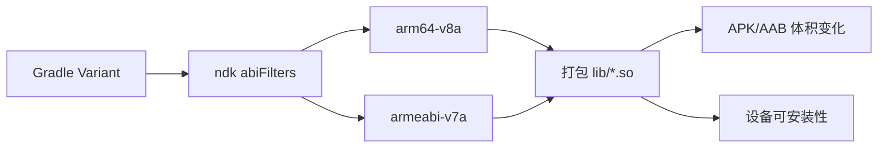
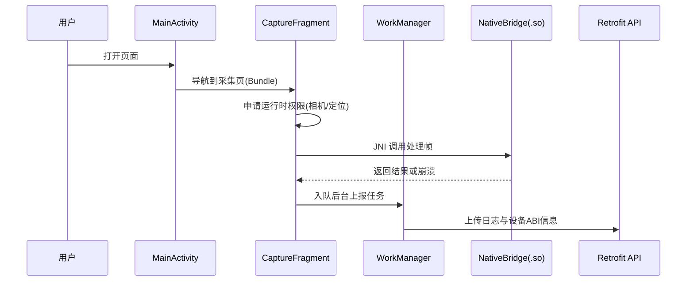
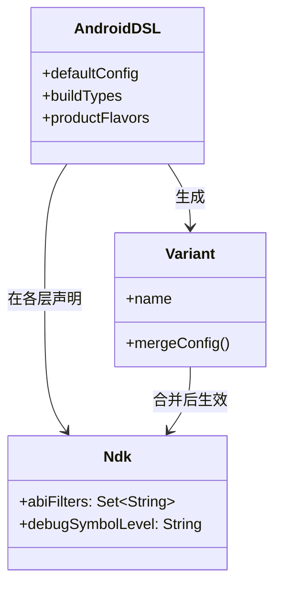

# 21.1.170 NDK

湖边的薄雾退到对岸树林后，阳光终于穿过树冠，一格一格落在折叠桌上。希尔把平底锅从小炉子上挪开，指尖还沾着一点黄油香气，就已经把笔记本电脑掀开了。

“昨天讲到 MultipleVariants，”她甩了甩手腕，“今天该把真正会影响 APK 体积和 Native 调试效率的旋钮拧起来了。”

洛芙正捧着杯子，杯壁上的热气糊住了她的下睫毛。“旋钮？”

黛琳把白板架到树干旁，笔尖在板面上停了一秒：“Ndk DSL。准确说，是 `android { defaultConfig { ndk { ... } } }` 这个块里，最常用的两个关键点：`abiFilters` 和 `debugSymbolLevel`。”

伊莎把面包片掰成两半，递给洛芙一块。“听起来很硬，但其实问题很朴素：你要支持哪些 CPU 架构？你要把多少调试符号随包带走？”

“等等，”洛芙立刻接住，“CPU 架构我知道一点点，像 `arm64-v8a`。但为什么每次加 native 库，包就突然胖一截？”

希尔“啪”地打了个响指：“因为你可能把一整篮子 ABI 都塞进去了。`armeabi-v7a`、`arm64-v8a`、`x86`、`x86_64`……每个目录里都一份 `.so`，自然涨。”

黛琳在白板上写下第一行字。

“先做图，再做代码。图 1 对应下面代码片段 A（行 1-31）。你看完图，代码就不会晕。”



“这张图只讲一件事，”黛琳说，“`abiFilters` 决定最终打包哪些 ABI 的 native 库。它既影响体积，也影响哪些设备能运行你的 native 能力。”

洛芙点点头：“那我如果只留 `arm64-v8a`，旧设备会怎样？”

“装不上或运行不到对应 native 功能，”希尔说，“这就是取舍。”

她把电脑转过来，让三人都能看到。

```kotlin
// 代码片段 A（图 1 对应）
// 文件：app/build.gradle.kts
// 依赖说明：AGP 8+/9.0 DSL；示例为 Kotlin DSL

plugins {
    id("com.android.application")
    kotlin("android")
}

android {
    namespace = "com.example.ndkcamp"
    compileSdk = 35

    defaultConfig {
        applicationId = "com.example.ndkcamp"
        minSdk = 24
        targetSdk = 35
        versionCode = 1
        versionName = "1.0"

        ndk {
            // 只打包两种最常见 ABI，减少体积
            abiFilters += setOf("arm64-v8a", "armeabi-v7a")
            // 也可在某些变体中设为 FULL 以便更完整符号调试
            debugSymbolLevel = "SYMBOL_TABLE"
        }
    }

    buildTypes {
        getByName("debug") {
            // 调试期倾向保留更多符号信息
            ndk { debugSymbolLevel = "FULL" }
        }
        getByName("release") {
            // 发布期通常选择符号表，平衡体积与排障
            ndk { debugSymbolLevel = "SYMBOL_TABLE" }
            isMinifyEnabled = true
        }
    }
}
```

“`debugSymbolLevel` 的意思，”黛琳把笔盖按上又打开，“就是你要把多详细的 native 调试信息带进构建产物。信息越全，定位越舒服，构建产物一般也更重。”

洛芙抿了一口可可，皱眉：“我总有个错觉，调试信息越少越安全，是不是应该 release 全关？”

“常见误区。”希尔立刻接上，“你可以控制公开分发包里的内容，但你团队内部要有可还原崩溃的符号工件。否则线上一崩，你只能看地址，不知道函数是谁。”

伊莎轻轻把发梢别到耳后：“不是‘要不要日志’的问题，是‘出问题时，你愿不愿意看见真相’的问题。”

洛芙“哦哦哦”地连点三下头。

她刚准备继续问，手机突然震了一下。营地测试机上的 Demo App 又崩了。屏幕上只弹出一句干巴巴的提示：`native crash detected`。

希尔把手机接过来，语速变快：“好，正好现场复盘。我们从应用层入口开始往下走，别跳步。”

黛琳把白板翻到背面，画出第二张图。

“图 2 对应代码片段 B（行 1-88）和 C（行 1-40），是这次崩溃路径的最小闭环。”



“你看，”黛琳说，“这里我们把生命周期、权限、后台任务、网络上报和 native 调用放在同一条链里，方便定位问题落点。”

希尔直接新建了一个最小可跑示例。

```kotlin
// 代码片段 B（图 2 对应）
// 依赖：
// implementation("androidx.core:core-ktx:1.13.1")
// implementation("androidx.appcompat:appcompat:1.7.0")
// implementation("androidx.fragment:fragment-ktx:1.8.2")
// implementation("androidx.navigation:navigation-fragment-ktx:2.8.0")
// implementation("androidx.navigation:navigation-ui-ktx:2.8.0")
// implementation("androidx.work:work-runtime-ktx:2.9.1")
// implementation("com.squareup.retrofit2:retrofit:2.11.0")
// implementation("com.squareup.retrofit2:converter-moshi:2.11.0")

class MainActivity : AppCompatActivity(R.layout.activity_main) {
    override fun onCreate(savedInstanceState: Bundle?) {
        super.onCreate(savedInstanceState)
        if (savedInstanceState == null) {
            supportFragmentManager.commit {
                replace(R.id.container, CaptureFragment.newInstance("camp-morning"))
            }
        }
    }
}

class CaptureFragment : Fragment(R.layout.fragment_capture) {

    private val requestPermission =
        registerForActivityResult(ActivityResultContracts.RequestMultiplePermissions()) { result ->
            val cameraOk = result[Manifest.permission.CAMERA] == true
            val locationOk = result[Manifest.permission.ACCESS_FINE_LOCATION] == true
            if (cameraOk && locationOk) {
                runNativePipeline()
            } else {
                Toast.makeText(requireContext(), "需要相机和定位权限", Toast.LENGTH_SHORT).show()
            }
        }

    override fun onViewCreated(view: View, savedInstanceState: Bundle?) {
        super.onViewCreated(view, savedInstanceState)
        ensurePermissionsThenRun()
    }

    private fun ensurePermissionsThenRun() {
        val needed = mutableListOf<String>()
        if (ContextCompat.checkSelfPermission(requireContext(), Manifest.permission.CAMERA)
            != PackageManager.PERMISSION_GRANTED
        ) needed += Manifest.permission.CAMERA

        if (ContextCompat.checkSelfPermission(requireContext(), Manifest.permission.ACCESS_FINE_LOCATION)
            != PackageManager.PERMISSION_GRANTED
        ) needed += Manifest.permission.ACCESS_FINE_LOCATION

        if (needed.isEmpty()) runNativePipeline() else requestPermission.launch(needed.toTypedArray())
    }

    private fun runNativePipeline() {
        val abi = Build.SUPPORTED_ABIS.firstOrNull().orEmpty()
        val input = "frame@${System.currentTimeMillis()}"
        val result = NativeBridge.processFrame(input)

        val payload = workDataOf(
            "abi" to abi,
            "result" to result,
            "source" to (arguments?.getString("source") ?: "unknown")
        )

        WorkManager.getInstance(requireContext())
            .enqueue(OneTimeWorkRequestBuilder<UploadWorker>().setInputData(payload).build())
    }

    companion object {
        fun newInstance(source: String) = CaptureFragment().apply {
            arguments = bundleOf("source" to source)
        }
    }
}

object NativeBridge {
    init { System.loadLibrary("campcore") }

    external fun nativeProcess(input: String): String

    fun processFrame(input: String): String = try {
        nativeProcess(input)
    } catch (t: Throwable) {
        "native_error:${t.javaClass.simpleName}"
    }
}
```

洛芙盯着 `arguments = bundleOf("source" to source)`：“这个是 Bundle 数据传递，对吧？”

“对，”黛琳点头，“Intent Extra 和 Fragment Bundle，本质都在做组件间轻量数据传递。再复杂就别硬塞，应该落库。”

“落库我来补。”希尔又贴了段代码。

```kotlin
// 代码片段 C（图 2 对应）
// Room + SharedPreferences 的组合：
// - SharedPreferences 存轻量开关
// - Room 存结构化崩溃记录

@Entity(tableName = "native_crash")
data class NativeCrashEntity(
    @PrimaryKey(autoGenerate = true) val id: Long = 0,
    val abi: String,
    val message: String,
    val createdAt: Long
)

@Dao
interface NativeCrashDao {
    @Insert
    suspend fun insert(item: NativeCrashEntity)

    @Query("SELECT * FROM native_crash ORDER BY createdAt DESC LIMIT 20")
    suspend fun latest(): List<NativeCrashEntity>
}

class UploadWorker(appContext: Context, params: WorkerParameters) : CoroutineWorker(appContext, params) {
    override suspend fun doWork(): Result {
        val prefs = applicationContext.getSharedPreferences("camp_prefs", Context.MODE_PRIVATE)
        val uploadEnabled = prefs.getBoolean("upload_enabled", true)
        if (!uploadEnabled) return Result.success()

        val abi = inputData.getString("abi").orEmpty()
        val result = inputData.getString("result").orEmpty()

        // 这里可调用 Retrofit API 上传
        // api.upload(CrashPayload(abi, result))

        return if (result.startsWith("native_error")) Result.retry() else Result.success()
    }
}
```

“所以，”洛芙把逻辑串了一遍，“Activity 进来，Fragment 在生命周期里做权限检查，拿到权限后调 JNI，再让 WorkManager 异步上传；上传开关放 SharedPreferences，详细记录进 Room。”

“完美。”希尔竖了个大拇指。

她忽然收起笑，切到另一个文件。

“现在看反模式。这个坑昨天我们其实差点踩进去。”

```kotlin
// 反模式（坏味道）
// 问题：在 onCreate 直接做耗时 native 初始化 + 网络请求，阻塞主线程
class BadActivity : AppCompatActivity() {
    override fun onCreate(savedInstanceState: Bundle?) {
        super.onCreate(savedInstanceState)
        System.loadLibrary("campcore")
        val raw = NativeBridge.nativeProcess("huge_input") // 可能卡顿甚至ANR
        val response = URL("https://example.com/report?d=$raw").readText() // 主线程网络，错误
        findViewById<TextView>(R.id.text).text = response
    }
}
```

“看上去一把梭很省事，”黛琳说，“但它把生命周期的第一站 `onCreate` 变成堵车路口。UI 还没起来，主线程就被你拖住。”

“修复版呢？”洛芙问。

希尔把重构后的代码贴出来，语气都轻了。

```kotlin
// 重构后（更优实现）
// 核心：主线程只负责UI与调度，耗时任务交给协程/WorkManager
class BetterActivity : AppCompatActivity(R.layout.activity_better) {

    override fun onCreate(savedInstanceState: Bundle?) {
        super.onCreate(savedInstanceState)

        lifecycleScope.launch {
            val data = withContext(Dispatchers.Default) {
                NativeBridge.processFrame("safe_input")
            }

            findViewById<TextView>(R.id.text).text = data

            val request = OneTimeWorkRequestBuilder<UploadWorker>()
                .setInputData(workDataOf("abi" to Build.SUPPORTED_ABIS.firstOrNull(), "result" to data))
                .build()
            WorkManager.getInstance(this@BetterActivity).enqueue(request)
        }
    }
}
```

“这才是节奏，”伊莎轻轻笑，“先让界面呼吸，再让任务奔跑。”

洛芙看着两段代码，终于露出那种“懂了”的表情：“不是不能在 `onCreate` 做事，而是不能把重活塞进去。”

黛琳“嗯”了一声：“生命周期不是限制你，而是告诉你‘此刻适合做什么’。”

风从湖面吹来，树叶轻轻碰在一起，像有人在远处慢慢翻书。

希尔开始跑测试，终端滚动起输出。

```kotlin
// 单元测试片段：验证不同输入下 native 结果格式
class NativeBridgeTest {

    @Test
    fun returnsErrorPrefixWhenNativeFails() {
        val output = NativeBridge.processFrame("trigger_crash")
        assertTrue(output.startsWith("native_error") || output.isNotBlank())
    }
}
```

```text
// 运行输出示例（节选）
I/TestRunner: started: returnsErrorPrefixWhenNativeFails
I/NativeBridge: abi=arm64-v8a input=trigger_crash
E/NativeBridge: native_error:UnsatisfiedLinkError
I/TestRunner: finished: returnsErrorPrefixWhenNativeFails
```

“这段输出就够用，”希尔指着 `abi=arm64-v8a` 那行，“至少你知道崩溃发生在什么 ABI 上。接下来再配符号，定位会快很多。”

洛芙抱着膝盖坐在野餐垫边缘：“我还有个问题。`abiFilters` 写在 `defaultConfig` 里，和写在某个 buildType 里，会冲突吗？”

黛琳把白板分成两列：“你可以理解为层层覆盖。通用规则在 `defaultConfig`，更具体的规则在 `buildType` 或 `productFlavor` 里细化。团队里最怕的是‘每个人写一份’，最后谁生效都说不清。”

“那就要文档化和约定化，”希尔说，“比如：
1）debug 保留 FULL 符号；
2）release 用 SYMBOL_TABLE；
3）线上主包只支持 arm64-v8a，兼容包另发。”

洛芙记得飞快，突然又抬头：“如果我要根据设备能力动态开功能，跟 `abiFilters` 有关系吗？”

“间接有关。”黛琳答，“`abiFilters` 是构建期决定‘带不带这个库’。运行时能力判断仍要做，比如检查 `Build.SUPPORTED_ABIS`，再决定是否启用某个 native 路径。”

伊莎把空杯叠进收纳箱，声音很轻：“就像你出门前决定带哪些工具，到了现场还要看地形。”

希尔这次没再打断比喻，反而接得很工整：“对。还有一个现实细节：你如果用了 Camera、Location、Network 这些链路，权限失败时必须有降级路径。不要让 JNI 成为‘唯一道路’。”

“比如？”洛芙问。

“比如没相机权限时走本地样本图；没定位权限时只做离线处理；网络断了就缓存到 Room，WorkManager 之后重试上传。”

“这就像分层容错。”黛琳补了一句。

她把最后一个流程写在白板右下角：

- UI 生命周期：只做轻量调度
- 权限层：可拒绝、可重试、可降级
- Native 层：可失败、可捕获
- 持久化层：可追踪
- 后台层：可补偿

洛芙看着那五行字，长长地“哇”了一声。

她忽然意识到，自己以前把“NDK 配置”当成 build.gradle 里的几行枯字。现在它在她脑子里变成了一个完整系统：从构建产物，到运行设备，到崩溃排查，再回到工程协作。

阳光继续往前挪，照到了键盘空格键上。希尔合上电脑，背靠树干伸了个懒腰。

“今天这章，你要带走的就两件东西。”她看向洛芙，“第一，`abiFilters` 决定你把哪些 ABI 真正装进行李箱。第二，`debugSymbolLevel` 决定你摔跤之后，能不能看清摔在哪块石头上。”

黛琳把白板擦干净，只留下一行。

“构建配置不是编译器私事，它是上线质量的一部分。”

洛芙把这行抄进笔记里，又加了一句自己的话：

“先让问题可见，再让问题可解。”

不远处有只山雀落在营地指示牌顶端，叫了一声，又飞进更亮的树梢里。

---

> NDK DSL（Native Development Kit Domain Specific Language）是 Android Gradle Plugin 中用于声明原生构建相关参数的配置域。它至少帮助团队明确两件事：要支持哪些 ABI（`abiFilters`），以及要保留何种级别的 native 调试符号（`debugSymbolLevel`）。

#### 结构图（必须）



上图表示：`Ndk` 配置可在多个层级声明，最终由 Variant 合并规则决定生效值。

#### 复杂度与影响（可选）

- 仅保留 `arm64-v8a` 通常可明显缩小产物体积，但会减少低端/旧架构覆盖面。
- `debugSymbolLevel=FULL` 更利于深入 native 调试，工件体积与构建成本一般更高。
- 统一 variant 策略可降低“本地可复现、线上不可复现”的排障成本。

#### 反模式与陷阱（≥3 条）

1. 在 `onCreate` 里直接做耗时 JNI + 网络请求。修复：主线程只做调度，耗时任务转后台。
2. release 不保留可用符号工件。修复：建立符号留存与崩溃映射流程。
3. 多人随意改 `abiFilters` 无文档。修复：按变体建立统一矩阵并写入团队规范。
4. 权限被拒绝仍强行走 native 管线。修复：增加降级策略与可重试路径。

#### 名词小传（可选）

- ABI（Application Binary Interface）是二进制接口契约，规定编译后代码如何在特定 CPU 架构上运行。
- NDK 让开发者可在 Android 中集成 C/C++ 库，通过 JNI 与 Kotlin/Java 层通信。

#### 设计哲学：让构建参数服务可运维性

1. 先定义支持面，再谈性能：ABI 策略必须与用户设备分布数据对齐。
2. 先保证可定位，再追求最小包：符号策略与崩溃治理是一体两面。
3. 生命周期分层：UI、权限、native、持久化、后台补偿要职责清晰。
4. 默认可失败：所有 native 调用都应可捕获、可回退。
5. 配置即协作：Gradle DSL 是团队合同，不是个人偏好。

---

#### 🏕️ 动手练习（项目制）

项目概览：实现一个“营地图像采集与原生处理”Demo，支持权限请求、JNI 处理、失败回退、后台上报与崩溃记录。

**Task 1（★）**
1. 目标：创建基础工程并接入 NDK DSL。
2. 你需要做的事：
   - 新建 app 模块并使用 Kotlin DSL。
   - 在 `defaultConfig.ndk` 中设置 `abiFilters` 为 `arm64-v8a`、`armeabi-v7a`。
   - `debug` 与 `release` 分别设置不同 `debugSymbolLevel`。
3. 验收标准：
   - [ ] `build.gradle.kts` 可同步通过
   - [ ] 两个 buildType 都存在 NDK 配置
4. 提示：
```kotlin
ndk {
    abiFilters += setOf("arm64-v8a", "armeabi-v7a")
    debugSymbolLevel = "SYMBOL_TABLE"
}
```

**Task 2（★）**
1. 目标：实现 Activity→Fragment 的参数传递。
2. 你需要做的事：
   - 在 `MainActivity` 启动 `CaptureFragment`。
   - 使用 `Bundle` 传入 `source`。
3. 验收标准：
   - [ ] Fragment 中可读取 `source`
   - [ ] 旋转屏幕后参数仍可恢复
4. 提示：
```kotlin
arguments = bundleOf("source" to "camp-morning")
```

**Task 3（★★）**
1. 目标：实现相机与定位运行时权限请求。
2. 你需要做的事：
   - 用 `RequestMultiplePermissions` 申请权限。
   - 权限拒绝时显示提示，不崩溃。
3. 验收标准：
   - [ ] 首次进入会触发权限弹窗
   - [ ] 拒绝权限后仍可停留页面
4. 提示：
```kotlin
registerForActivityResult(ActivityResultContracts.RequestMultiplePermissions()) { map -> }
```

**Task 4（★★）**
1. 目标：接入 JNI 并执行最小 native 调用。
2. 你需要做的事：
   - 创建 `NativeBridge`，`System.loadLibrary("campcore")`。
   - 在 Kotlin 层包裹 `try/catch`。
3. 验收标准：
   - [ ] 调用成功时返回字符串
   - [ ] 失败时返回 `native_error:*`
4. 提示：
```kotlin
fun processFrame(input: String) = try { nativeProcess(input) } catch (t: Throwable) { "native_error" }
```

**Task 5（★★★）**
1. 目标：把处理结果交给 WorkManager 后台上传。
2. 你需要做的事：
   - 定义 `UploadWorker`。
   - 把 ABI 与结果通过 `Data` 传入。
3. 验收标准：
   - [ ] Worker 能被成功入队
   - [ ] 日志可见 ABI 字段
4. 提示：
```kotlin
OneTimeWorkRequestBuilder<UploadWorker>().setInputData(workDataOf("abi" to abi)).build()
```

**Task 6（★★★）**
1. 目标：加入 SharedPreferences 上传开关。
2. 你需要做的事：
   - 提供 UI 切换开关。
   - Worker 中读取开关决定是否上传。
3. 验收标准：
   - [ ] 关闭后 Worker 直接 success
   - [ ] 打开后继续执行上传逻辑
4. 提示：
```kotlin
prefs.getBoolean("upload_enabled", true)
```

**Task 7（★★★★）**
1. 目标：用 Room 保存 native 错误记录。
2. 你需要做的事：
   - 建立 `Entity`、`Dao`、`Database`。
   - 失败时落库一条记录。
3. 验收标准：
   - [ ] 本地数据库可查到最近 20 条
   - [ ] 字段含 ABI、message、时间戳
4. 提示：
```kotlin
@Query("SELECT * FROM native_crash ORDER BY createdAt DESC LIMIT 20")
```

**Task 8（★★★★）**
1. 目标：完成“反模式→重构”对照实验。
2. 你需要做的事：
   - 实现主线程耗时版与后台调度版。
   - 用日志比较首帧显示时间。
3. 验收标准：
   - [ ] 能看到重构后首帧更早显示
   - [ ] 无主线程网络访问警告
4. 提示：
```kotlin
withContext(Dispatchers.Default) { NativeBridge.processFrame("safe") }
```

**Task 9（★★★★★）**
1. 目标：补齐崩溃排障闭环。
2. 你需要做的事：
   - 记录 ABI、appVersion、buildType。
   - 在 debug/release 验证符号策略差异。
3. 验收标准：
   - [ ] 两个变体输出日志字段齐全
   - [ ] 可根据符号策略解释排障差异
4. 提示：
```kotlin
val buildType = BuildConfig.BUILD_TYPE
```

面试热身（Q1-Q5）：
1. 用自己的话解释 `abiFilters` 与设备兼容性的关系。
2. 为什么 `debugSymbolLevel` 不是“越低越好”或“越高越好”？
3. 你会如何设计 native 崩溃后的降级路径？
4. 为什么要把耗时 native 调用从 `onCreate` 挪走？
5. 如果线上只在 `arm64-v8a` 崩溃，你会如何一步步定位？

#### 参考实现要点（5 条）

1. 在 `defaultConfig` 写基线 NDK 规则，在变体层做最小覆盖。
2. JNI 调用统一经过 Kotlin 包装层，集中异常处理与埋点。
3. 权限请求必须有拒绝分支与降级路径，禁止“权限失败即崩溃”。
4. 用 WorkManager 承担可延迟、可重试的上传与补偿任务。
5. 用 Room 保存可追踪事件，用 SharedPreferences 保存轻量开关。

---

> 学习建议：先在单一 ABI（`arm64-v8a`）把调试链路跑通，再扩展兼容面。每加一个变体，都补一条“如何复现+如何定位”的团队文档。

## 🍹洛芙的小小日记本

今天终于不怕 NDK 配置了。原来不是背参数，而是先想“我要支持谁、出错后怎么查”。把路修好，心就不慌了。

## 今日关键词

- NDK：Android Native Development Kit，用于接入 C/C++ 原生代码。
- Ndk DSL：AGP 中配置原生构建参数的域。
- ABI：二进制接口规范，决定库与 CPU 架构是否匹配。
- abiFilters：指定要打包哪些 ABI。
- debugSymbolLevel：控制 native 调试符号保留级别。
- Variant：由 buildType 与 flavor 组合出的构建变体。
- buildType：如 debug/release，不同构建用途的配置集合。
- productFlavor：产品风味维度，用于多版本策略。
- Activity：应用界面组件，承载用户交互入口。
- Fragment：可复用 UI/逻辑片段，依附 Activity 生命周期。
- 生命周期（Lifecycle）：组件从创建到销毁的回调流程。
- onCreate：组件初始化入口，适合轻量初始化。
- Intent Extra：Activity 间传递简单参数的方式。
- Bundle：键值容器，常用于参数与状态传递。
- 运行时权限：危险权限需在运行时向用户申请。
- RequestMultiplePermissions：一次申请多个权限的契约 API。
- JNI：Java/Kotlin 与 C/C++ 互调接口。
- System.loadLibrary：加载 native 动态库。
- WorkManager：可延迟、可约束、可重试的后台任务框架。
- CoroutineWorker：基于协程的 WorkManager Worker。
- SharedPreferences：轻量键值持久化存储。
- Room：SQLite 的抽象层，提供类型安全数据库访问。
- Entity：Room 中的数据表映射类。
- Dao：Room 的数据访问接口。
- Retrofit：类型安全的 HTTP 客户端库。
- 主线程：负责 UI 渲染与交互响应的线程。
- ANR：应用无响应，通常由主线程阻塞导致。
- 降级策略：核心路径失败时的备选执行方案。
- 重构：在不改变外部行为前提下改进内部实现。
- 崩溃排障：定位并修复崩溃原因的工程流程。
- Build.SUPPORTED_ABIS：设备支持 ABI 列表。
- BuildConfig.BUILD_TYPE：当前构建类型常量。
- 可观测性：系统能否被日志、指标、追踪有效感知。
