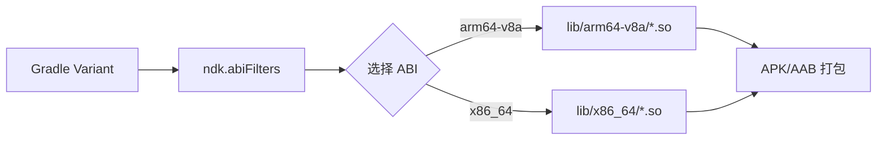
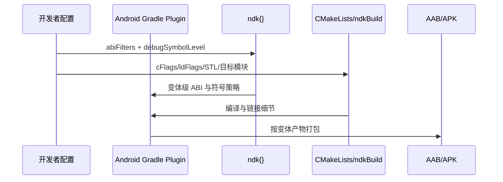
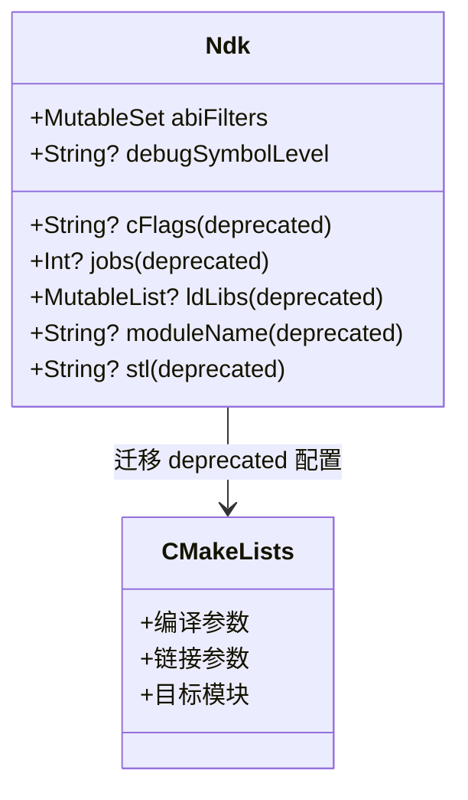

# 21.1.170 NDK

湖边的雾线正在往后退。

洛芙把前一章写满“multipleVariants”的纸翻过来，背面又是一页干净格子。她刚抬头，看到黛琳已经把便携白板支在折叠桌边，白板笔“哒”地按开，墨味和热可可一起飘起来。

“上一章我们说变体像路线图。”黛琳把“variant”圈起来，“今天我们看每条路线里，原生库到底给哪些 ABI 发货，以及调试符号要打包到什么程度。”

希尔把笔记本转了半圈，屏幕上是 `build.gradle`，标签名写着：`app-release-size-investigation`。

伊莎把一小片烤面包递给洛芙：“先吃，再看构建日志。不然你会把 warning 当成鸟叫背景音。”

洛芙咬了一口，点头：“所以今天主角是……Ndk？”

“对，”黛琳说，“准确地说是 Gradle API 里的 `Ndk` DSL 对象。官方定义很短：它是按 variant 配置 NDK 的地方，比如 ABI filter。”

她在白板第一行写下：

`interface Ndk (Added in 4.2.0)`

“只有接口？”洛芙眨眼。

“对，接口背后是 Android Gradle Plugin 把你写的 DSL 变成模型。你平常在 `defaultConfig { ndk { ... } }`、`buildTypes { release { ndk { ... } } }`、或者 flavor 里写的内容，最后都会落到这里。”

希尔敲了几下键盘，把第一段配置放大。

```kotlin
// 代码片段 A（build.gradle.kts，行 12-27）
android {
    defaultConfig {
        ndk {
            abiFilters += setOf("arm64-v8a", "x86_64")
        }
    }

    buildTypes {
        release {
            ndk {
                debugSymbolLevel = "symbol_table"
            }
        }
    }
}
```

“先盯住两个属性，”黛琳说，“`abiFilters` 和 `debugSymbolLevel`。这是官方页面里最关键、也最常用的部分。”

洛芙把手指按在“abi”三个字母上：“第一次见这词的时候我总会紧张。”

伊莎笑着把她的手拨开一点：“那就用最普通的话。ABI，Application Binary Interface，应用二进制接口。它规定了机器层面对函数调用、寄存器、指令集的约定。你可以把它想成‘同一个 native 库，不同 CPU 方言版本’。”

“不是魔法门？”洛芙故意问。

“不是。”希尔拍了拍她肩膀，“是冷冰冰的二进制兼容规则。你手机是 arm64，就不能直接吃给 x86 编译的 `.so`。”

黛琳在白板画了第一张图。



“图 1 对应代码片段 A（行 14-16）。”她敲了敲白板角，“如果你不配置 `abiFilters`，Gradle 默认会把可用 ABI 都构建并打包。结果是通用性高，但包体更大、构建时间更长。”

“所以 `abiFilters` 像‘只打包我需要的 CPU 版本清单’？”

“这句非常准。”黛琳点头。

希尔接过话头：“还有一个工程决策：你是做一个大包，还是按 ABI 拆分多 APK。官方也提示了，如果你在意安装包体积，可以考虑 ABI split。”

她新开一个文件，贴出对比。

```kotlin
// 代码片段 B（build.gradle.kts，行 30-49）
android {
    // 方案 1：单包 + abiFilters（一个包里只含指定 ABI）
    defaultConfig {
        ndk {
            abiFilters += setOf("arm64-v8a", "armeabi-v7a")
        }
    }

    // 方案 2：按 ABI 拆分多个 APK
    splits {
        abi {
            isEnable = true
            reset()
            include("arm64-v8a", "armeabi-v7a", "x86_64")
            isUniversalApk = false
        }
    }
}
```

“这两个可以一起用吗？”洛芙问。

“能，但要非常清楚意图。”黛琳说，“很多团队在迁移时把它们叠着写，最后谁筛掉了谁，自己都说不清，CI 日志里全是‘为什么少了 x86_64’。”

晨光从树缝落在键盘上，希尔把日志窗口拖到侧边：“来，先看一个坏味道实现。”

```kotlin
// 代码片段 C：反模式（行 52-84）
android {
    defaultConfig {
        ndk {
            abiFilters += setOf("arm64-v8a", "x86_64", "armeabi-v7a")
            cFlags = "-O2 -DDEBUG"       // 已弃用
            jobs = 8                      // 已弃用
            moduleName = "oldcore"       // 已弃用
            stl = "c++_shared"           // 已弃用
            ldLibs?.add("log")           // 已弃用
        }
    }

    buildTypes {
        debug {
            ndk {
                debugSymbolLevel = "full"
            }
        }
        release {
            ndk {
                debugSymbolLevel = "full" // 线上包过重
            }
        }
    }
}
```

洛芙愣住：“这段不是能跑吗？”

“能跑不等于合理。”黛琳把官方属性表逐项点出来，“`cFlags`、`jobs`、`ldLibs`、`moduleName`、`stl` 在 8.5.0 开始都 deprecated。官方给的迁移方向非常明确：把 C/C++ 编译参数和链接参数放到 `CMakeLists.txt` 或 `Application.mk`，并行线程配置也交给 CMake 或 ndkBuild DSL。”

“那 `debugSymbolLevel` 呢？”

“它没弃用，但要按场景分级。”希尔说，“`none`、`symbol_table`、`full`。release 盲目写 `full`，AAB 会膨胀，上传和下载都慢。”

伊莎把温度计从杯边挪开，轻声补一句：“你可以把它当成调试信息的打包粒度。不是越多越好，是够定位问题就好。”

“我们重构它。”黛琳说。

```kotlin
// 代码片段 D：重构后（build.gradle.kts，行 87-129）
android {
    defaultConfig {
        ndk {
            // 仅保留当前设备覆盖率最高的 ABI
            abiFilters += setOf("arm64-v8a", "armeabi-v7a")
        }

        externalNativeBuild {
            cmake {
                // 编译参数迁移到 CMake 层
                cppFlags += listOf("-O2", "-DANDROID_STL=c++_shared")
                // 仅示例：具体参数应在 CMakeLists.txt 中统一维护
            }
        }
    }

    buildTypes {
        debug {
            ndk {
                debugSymbolLevel = "full"
            }
        }
        release {
            ndk {
                // 线上常用折中：保留符号表，控制体积
                debugSymbolLevel = "symbol_table"
            }
        }
    }
}
```

“图 2 对应代码片段 D（行 90-122）。”黛琳又画了一张流程图。



洛芙盯着“Dev->>CMake”那一行：“所以 deprecated 属性不是不能用了，而是官方让我们把职责放回原生构建系统？”

“没错。”黛琳说，“这是职责边界修正。`ndk{}` 管打包侧和少量变体控制；具体 C/C++ 构建参数交给 CMake/ndkBuild。”

希尔把终端打开，贴了一段构建输出。

```text
> Task :app:mergeReleaseNativeLibs
Packaging native libraries for ABIs: [armeabi-v7a, arm64-v8a]

> Task :app:packageReleaseBundle
debugSymbolLevel for release: symbol_table
Native debug metadata packaged: symbol tables only

BUILD SUCCESSFUL in 18s
42 actionable tasks: 42 executed
```

“这段输出就是我们验收的第一步。”希尔说，“ABI 列表对不对，release 符号级别是不是 `symbol_table`。”

洛芙点点头，又举手：“我还有一个担心。我们上章刚讲过 multiple variants。如果 productFlavor 里也写 `ndk`，到底谁覆盖谁？”

黛琳在白板写了一串优先级箭头：

`defaultConfig -> productFlavor -> buildType -> variant`

“同名属性后者覆盖前者。你可以把它看成叠层配置。官方页面虽然聚焦 Ndk 属性本身，但放在 AGP 实际工程里，必须配合 variant 合并规则理解。”

“我们来做一个最小可运行 demo。”希尔把 Android Studio 的工程窗口切到 `app/src/main/java`。

```kotlin
// 代码片段 E（MainActivity.kt，行 10-62）
// 依赖：implementation("androidx.core:core-ktx:1.13.1")
// 运行方式：普通 Activity 启动，按钮点击后显示当前 ABI 与本地库加载状态

package com.example.ndkdemo

import android.os.Bundle
import android.widget.Button
import android.widget.TextView
import androidx.appcompat.app.AppCompatActivity

class MainActivity : AppCompatActivity() {

    companion object {
        init {
            // 加载 native 库，验证打包 ABI 是否正确
            try {
                System.loadLibrary("native-lib")
            } catch (e: UnsatisfiedLinkError) {
                // 仅用于教学演示
            }
        }
    }

    external fun nativeHello(): String

    override fun onCreate(savedInstanceState: Bundle?) {
        super.onCreate(savedInstanceState)
        setContentView(R.layout.activity_main)

        val text = findViewById<TextView>(R.id.result)
        val button = findViewById<Button>(R.id.btnCheck)

        button.setOnClickListener {
            val abi = android.os.Build.SUPPORTED_ABIS.joinToString()
            val nativeText = runCatching { nativeHello() }
                .getOrElse { "native call failed: ${it.javaClass.simpleName}" }
            text.text = "ABIs=$abi\n$nativeText"
        }
    }
}
```

“别忘了生命周期。”黛琳看着洛芙，“你在 `onCreate` 里做的是轻量初始化。不要在 `onCreate` 里跑重型 NDK 文件扫描。”

“这条我记住了。”洛芙说，“`onCreate` 放 UI 与必要初始化，耗时工作交后台。”

“给你一个坏例子，再给修复。”希尔又贴一段。

```kotlin
// 代码片段 F：反模式（行 65-86）
class BadActivity : AppCompatActivity() {
    override fun onCreate(savedInstanceState: Bundle?) {
        super.onCreate(savedInstanceState)
        // 错误：主线程做耗时 I/O + native 初始化扫描
        val huge = java.io.File(filesDir, "big_dump.bin").readBytes()
        findViewById<TextView>(R.id.result).text = "size=${huge.size}"
    }
}
```

```kotlin
// 代码片段 G：修复（行 89-127）
class BetterActivity : AppCompatActivity() {
    override fun onCreate(savedInstanceState: Bundle?) {
        super.onCreate(savedInstanceState)
        setContentView(R.layout.activity_main)

        val text = findViewById<TextView>(R.id.result)

        lifecycleScope.launch {
            val size = withContext(kotlinx.coroutines.Dispatchers.IO) {
                val f = java.io.File(filesDir, "big_dump.bin")
                if (f.exists()) f.length() else 0L
            }
            text.text = "size=$size"
        }
    }
}
```

湖面上有一只水鸟掠过去，翅尖在光里一闪。

伊莎把白板翻到下一面：“你们刚才提到生命周期，那我们顺手把 Service、Fragment 也接进这个小项目。不然知识会断层。”

她写下一个“native 符号上传任务”的小流程：Activity 点击后，把参数通过 Intent Extra 交给前台 Service，再由 WorkManager 在网络允许时上传映射文件。配置页用 Fragment 保存偏好。

洛芙眼睛亮了一下：“这就把我们之前几卷学的东西串起来了。”

希尔点头：“而且全是工程里会遇到的真实路径。”

```kotlin
// 代码片段 H（SymbolUploadService.kt，行 130-193）
// 依赖：implementation("androidx.work:work-runtime-ktx:2.9.1")

class SymbolUploadService : android.app.Service() {
    override fun onBind(intent: android.content.Intent?) = null

    override fun onStartCommand(intent: android.content.Intent?, flags: Int, startId: Int): Int {
        val flavor = intent?.getStringExtra("flavor") ?: "prod"

        val req = androidx.work.OneTimeWorkRequestBuilder<SymbolUploadWorker>()
            .setInputData(androidx.work.workDataOf("flavor" to flavor))
            .setConstraints(
                androidx.work.Constraints.Builder()
                    .setRequiredNetworkType(androidx.work.NetworkType.CONNECTED)
                    .build()
            )
            .build()

        androidx.work.WorkManager.getInstance(this).enqueue(req)
        stopSelf(startId)
        return START_NOT_STICKY
    }
}
```

“这里 Activity 到 Service 的数据传递就是 Intent Extra。”黛琳说。

```kotlin
// 代码片段 I（MainActivity.kt 片段，行 195-214）
val intent = android.content.Intent(this, SymbolUploadService::class.java)
intent.putExtra("flavor", "release")
startService(intent)
```

“Fragment 呢？”洛芙问。

“配置页。”希尔把另一段打出来。

```kotlin
// 代码片段 J（NdkConfigFragment.kt，行 216-276）
class NdkConfigFragment : androidx.fragment.app.Fragment(R.layout.fragment_ndk_config) {

    override fun onViewCreated(view: android.view.View, savedInstanceState: Bundle?) {
        super.onViewCreated(view, savedInstanceState)
        val prefs = requireContext().getSharedPreferences("ndk_pref", MODE_PRIVATE)

        val save = view.findViewById<android.widget.Button>(R.id.btnSave)
        val input = view.findViewById<android.widget.EditText>(R.id.etAbi)

        save.setOnClickListener {
            val abiText = input.text.toString().trim()
            prefs.edit().putString("target_abi", abiText).apply()
        }
    }
}
```

“SharedPreferences 负责轻量配置，Room 负责结构化记录。”黛琳补上一段仓库代码。

```kotlin
// 代码片段 K（Room + Repository，行 278-342）
@Entity(tableName = "build_record")
data class BuildRecord(
    @PrimaryKey(autoGenerate = true) val id: Long = 0,
    val variant: String,
    val abi: String,
    val symbolLevel: String,
    val timestamp: Long
)

@Dao
interface BuildRecordDao {
    @Insert
    suspend fun insert(item: BuildRecord)

    @Query("SELECT * FROM build_record ORDER BY timestamp DESC")
    suspend fun listAll(): List<BuildRecord>
}
```

洛芙边抄边问：“权限在这个场景里怎么体现？”

“如果你上传符号到私有服务器，需要网络。”希尔说，“`INTERNET` 是普通权限，清单声明就行；如果你还要读外部文件做本地符号索引，在新系统上要走运行时权限流程。”

她快速写了一个请求示例。

```kotlin
// 代码片段 L（运行时权限请求，行 344-386）
private val req = registerForActivityResult(
    androidx.activity.result.contract.ActivityResultContracts.RequestPermission()
) { granted ->
    if (granted) {
        // proceed
    }
}

fun ensureReadPermission() {
    if (android.os.Build.VERSION.SDK_INT >= 33) {
        req.launch(android.Manifest.permission.READ_MEDIA_IMAGES)
    }
}
```

“网络通信用 Retrofit 呢？”洛芙继续追问。

```kotlin
// 代码片段 M（Retrofit API，行 388-432）
interface SymbolApi {
    @retrofit2.http.POST("/symbol/upload")
    suspend fun upload(
        @retrofit2.http.Body body: SymbolPayload
    ): retrofit2.Response<Unit>
}

data class SymbolPayload(
    val variant: String,
    val abi: String,
    val symbolLevel: String
)
```

“Intent Filter 可以让你从分享入口接收日志文件。”黛琳说，“比如 `text/plain` 或 zip。这个在排查 native crash 时很实用。”

洛芙点开清单，把示例也记下。

```xml
<!-- 代码片段 N（AndroidManifest.xml，行 434-456） -->
<activity android:name=".ImportActivity">
    <intent-filter>
        <action android:name="android.intent.action.SEND" />
        <category android:name="android.intent.category.DEFAULT" />
        <data android:mimeType="application/zip" />
    </intent-filter>
</activity>
```

“你看，”伊莎把纸页按平，“我们在 NDK 章节里没脱离主线：核心是 `ndk{}` 的配置边界。但项目层面依然要和 Activity/Fragment/Service、WorkManager、存储、权限、网络协作。”

“我终于知道为什么你们总说‘配置不是孤岛’了。”洛芙笑起来。

希尔把最后一段测试贴出来：“为了防回归，我们给 Gradle 配置写一个轻量校验测试。它不直接跑 AGP API，但验证我们的配置映射逻辑。”

```kotlin
// 代码片段 O（单元测试，行 458-514）
import org.junit.Assert.assertEquals
import org.junit.Test

data class NdkPolicy(
    val buildType: String,
    val debugSymbolLevel: String
)

fun resolveSymbolLevel(policy: NdkPolicy): String {
    return if (policy.buildType == "release") "symbol_table" else "full"
}

class NdkPolicyTest {
    @Test
    fun release_uses_symbolTable() {
        val level = resolveSymbolLevel(NdkPolicy("release", "full"))
        assertEquals("symbol_table", level)
    }

    @Test
    fun debug_uses_full() {
        val level = resolveSymbolLevel(NdkPolicy("debug", "none"))
        assertEquals("full", level)
    }
}
```

```text
// 测试输出示例
NdkPolicyTest > release_uses_symbolTable PASSED
NdkPolicyTest > debug_uses_full PASSED

BUILD SUCCESSFUL
```

“这个测试很朴素，”黛琳说，“但它把团队约定固定住了：release 不允许误配成 full。”

洛芙合上电脑，又马上打开：“我还差一个点。官方里 `abiFilters` 示例写过 `armeabi`，现在是不是过时？”

“对，”希尔说，“历史示例里可能出现老 ABI。你要以当前 NDK 支持列表为准，常见是 `armeabi-v7a`、`arm64-v8a`、`x86`、`x86_64`。新项目通常优先 arm64，是否保留 32 位看业务和设备覆盖策略。”

黛琳把最后一行写成粗体：

**Ndk DSL 的核心，是“按变体声明打包/符号策略”；编译细节回归 CMake/ndkBuild。**

树荫移动了一点点，杯壁上的水珠也跟着滑下去。

伊莎把白板收好：“今天的收获，不只是记住几个字段名。更重要的是知道哪一层该放什么配置。边界清楚，项目就不容易长成藤蔓。”

洛芙靠在折叠椅背上，看着湖面被上午的风切出细碎纹路，轻轻嗯了一声。

“数据该放在哪，配置该写在哪，和人把话说给谁听，其实是同一种判断。”黛琳把笔帽扣上。

远处又有鸟叫起来，短短两声，像构建日志里干净的 `BUILD SUCCESSFUL`。

---

> Ndk（Native Development Kit DSL）是 Android Gradle Plugin 中按变体配置原生构建打包策略的接口，重点用于声明 ABI 过滤与原生调试元数据级别；而具体 C/C++ 编译、链接、模块等细节应交给 CMakeLists.txt 或 Application.mk。

#### 结构图（必须）



上图说明：`Ndk` 保留变体级控制能力，deprecated 字段的职责已迁移到 CMake/ndkBuild 配置。

#### 复杂度与影响（可选）

- 使用 `abiFilters` 限制 ABI 可显著降低 APK/AAB 体积与构建时间，但会缩小设备覆盖面。
- `debugSymbolLevel=full` 增强 native 调试能力，但会增大产物；`symbol_table` 通常是 release 的平衡选项。
- 配置职责分层后（Gradle DSL vs CMake）可降低维护复杂度，减少“重复配置 + 覆盖冲突”。

#### 反模式与陷阱（≥3 条）

- 在 `ndk{}` 继续堆 `cFlags/jobs/stl/moduleName/ldLibs` → 修复：迁移到 CMakeLists.txt 或 Application.mk。
- release 一律 `debugSymbolLevel=full` → 修复：按环境分级，release 常用 `symbol_table`。
- `abiFilters` 与 `splits.abi` 混写却不验收 → 修复：在 CI 输出中校验最终 ABI 列表。
- 在 Activity `onCreate` 做重 I/O 或 native 全量扫描 → 修复：用协程 IO 线程或 WorkManager。

#### 名词小传（可选）

- NDK 让 Android 应用可用 C/C++ 构建 native 库，常见于性能敏感、跨平台复用和底层能力场景。
- Android Gradle Plugin 在 4.2.0 引入该 DSL 接口，并在后续版本逐步收敛不合适的字段职责。

#### 设计哲学：配置边界先于参数堆叠

1. 变体策略归 Gradle（`abiFilters`、符号级别）。
2. 编译与链接归原生构建系统（CMake/ndkBuild）。
3. release 配置优先“可回溯 + 可控体积”。
4. 通过自动化测试与 CI 日志让配置可验证。
5. 少写“全局一刀切”，多写“按 variant 约束”。

---

#### 🏕️ 动手练习（项目制）

项目概览：实现一个“native 构建策略观测器”小应用，可切换构建变体、记录 ABI 与符号级别，并发起后台上传任务。

**Task 1（★）建立最小 NDK 配置**
- 目标：让应用仅打包 `arm64-v8a` 与 `armeabi-v7a`。
- 你需要做的事：
  1. 在 `defaultConfig.ndk` 写入 `abiFilters`。
  2. 构建 release 包。
  3. 检查 `mergeReleaseNativeLibs` 输出。
- 验收标准：
  - [ ] 构建成功。
  - [ ] 日志中仅出现目标 ABI。
- 提示：

```kotlin
ndk { abiFilters += setOf("arm64-v8a", "armeabi-v7a") }
```

**Task 2（★）配置 debugSymbolLevel 分级**
- 目标：debug=full，release=symbol_table。
- 你需要做的事：在 `buildTypes` 下分别设置 `ndk.debugSymbolLevel`。
- 验收标准：
  - [ ] debug 包为 `full`。
  - [ ] release 包为 `symbol_table`。
- 提示：

```kotlin
release { ndk { debugSymbolLevel = "symbol_table" } }
```

**Task 3（★★）清理 deprecated 字段**
- 目标：移除 `cFlags/jobs/ldLibs/moduleName/stl`。
- 你需要做的事：
  1. 删除 `ndk{}` 中上述字段。
  2. 将编译参数迁移到 `externalNativeBuild.cmake` 与 `CMakeLists.txt`。
- 验收标准：
  - [ ] Gradle sync 无相关 deprecated 警告。
  - [ ] native 编译成功。
- 提示：

```kotlin
externalNativeBuild { cmake { cppFlags += listOf("-O2") } }
```

**Task 4（★★）实现 Activity + native 调用**
- 目标：按钮点击显示当前设备 ABI 与 native 返回值。
- 你需要做的事：完成 `System.loadLibrary` 与 `external fun` 调用。
- 验收标准：
  - [ ] 页面能显示 `SUPPORTED_ABIS`。
  - [ ] native 方法返回非空字符串。
- 提示：

```kotlin
val abi = Build.SUPPORTED_ABIS.joinToString()
```

**Task 5（★★★）加入 Fragment 配置页**
- 目标：用 SharedPreferences 保存目标 ABI 偏好。
- 你需要做的事：创建 `NdkConfigFragment`，输入并保存 `target_abi`。
- 验收标准：
  - [ ] 关闭重进后配置仍在。
- 提示：

```kotlin
prefs.edit().putString("target_abi", abiText).apply()
```

**Task 6（★★★）后台上传任务链路**
- 目标：Activity -> Service -> WorkManager。
- 你需要做的事：
  1. 用 Intent Extra 传 flavor。
  2. Service 中创建 OneTimeWorkRequest。
  3. 约束网络为 CONNECTED。
- 验收标准：
  - [ ] Worker 在联网时执行。
  - [ ] 输入参数能被 Worker 读取。
- 提示：

```kotlin
workDataOf("flavor" to flavor)
```

**Task 7（★★★★）接入 Room 构建记录**
- 目标：持久化每次构建策略。
- 你需要做的事：建表 `build_record`，保存 variant/abi/symbolLevel/timestamp。
- 验收标准：
  - [ ] 可查询最近 10 条记录。
- 提示：

```kotlin
@Query("SELECT * FROM build_record ORDER BY timestamp DESC")
```

**Task 8（★★★★）接入 Retrofit 上传接口**
- 目标：将构建记录上传到测试服务器。
- 你需要做的事：定义 `SymbolApi.upload()`，Worker 中调用并处理失败重试。
- 验收标准：
  - [ ] 成功返回 200。
  - [ ] 失败时按策略重试。
- 提示：

```kotlin
Result.retry()
```

**Task 9（★★★★★）配置回归测试**
- 目标：防止 release 被误改成 `full`。
- 你需要做的事：写单元测试验证策略函数。
- 验收标准：
  - [ ] 两条测试都通过。
- 提示：

```kotlin
assertEquals("symbol_table", resolveSymbolLevel(NdkPolicy("release", "full")))
```

**面试热身（Q1-Q5）**
1. 用自己的话解释：为什么 `ndk{}` 不应该继续承载大量 C/C++ 编译细节？
2. `abiFilters` 与 ABI split 的目标分别是什么，何时优先哪个？
3. 为什么 release 常选 `symbol_table` 而不是 `full`？
4. 在 Activity/Service/WorkManager 协作链路里，哪一步最容易造成主线程阻塞？
5. 如果线上出现 `UnsatisfiedLinkError`，你会按什么顺序排查？

#### 参考实现要点（5 条）

1. 只在 `ndk{}` 保留变体打包决策字段，编译参数统一收口到 CMake。
2. 为 release/debug 分别制定固定符号策略并写测试锁定。
3. 在 CI 解析构建日志，自动校验最终 ABI 集合。
4. Native 调用失败时提供可观测日志与降级文案，避免白屏。
5. 用 Room 记录构建元数据，便于回溯线上包与符号策略。

---

> 先把“配置属于哪一层”想清楚，再去写参数。边界清楚，构建才会稳定；稳定了，排错才不会靠运气。

## 🍹洛芙的小小日记本

今天终于不把 NDK 配置当黑箱了。最重要的一句是：变体策略写在 ndk，编译细节写进 CMake。原来“把话说给对的人听”，在工程里也成立。

## 今日关键词

- NDK（Native Development Kit）：让 Android 应用使用 C/C++ 原生代码的工具集合。常用于性能敏感或底层能力场景。
- Ndk DSL：AGP 中按变体配置 native 打包策略的接口。
- AGP（Android Gradle Plugin）：把 Gradle 与 Android 构建流程连接起来的插件。
- Variant：由 buildType、productFlavor 等组合出的具体构建产物。
- ABI（Application Binary Interface）：二进制层面的接口约定，决定 native 库可运行在哪类 CPU 架构。
- abiFilters：指定要构建和打包的 ABI 集合。
- APK：Android 安装包格式。
- AAB（Android App Bundle）：提交到应用商店的发布包格式。
- debugSymbolLevel：控制 native 调试元数据打包级别的字段。
- none：不打包 native 调试元数据。
- symbol_table：仅打包符号表，体积与可回溯性较平衡。
- full：打包完整调试信息与符号表，调试能力强但体积更大。
- cFlags：旧式 C/C++ 编译参数字段，已弃用。
- jobs：旧式并行编译线程字段，已弃用。
- ldLibs：旧式链接库字段，已弃用。
- moduleName：旧式 native 模块名字段，已弃用。
- stl：旧式 STL 配置字段，已弃用。
- Deprecated：被官方标记不建议继续使用，未来可能移除。
- CMakeLists.txt：CMake 构建脚本文件，管理 native 编译与链接细节。
- Application.mk：ndk-build 的配置文件。
- externalNativeBuild：Gradle 中接入 CMake/ndk-build 的配置入口。
- Activity：Android 的界面组件，承担用户交互。
- Fragment：可复用的界面与逻辑片段，依附 Activity 生命周期。
- Service：后台组件，适合处理不直接与 UI 交互的任务。
- onCreate：Activity 初始化回调，应避免重型阻塞任务。
- Intent Extra：在组件跳转时附带键值数据的方式。
- WorkManager：可延迟、可约束、可恢复的后台任务框架。
- SharedPreferences：轻量键值存储，适合配置项。
- Room：基于 SQLite 的结构化持久化库。
- DAO：Room 中的数据访问接口。
- Runtime Permission：运行时动态申请的敏感权限机制。
- Retrofit：常用的类型安全 HTTP 客户端。
- Intent Filter：声明组件可响应哪些隐式 Intent 的规则。
- UnsatisfiedLinkError：native 库缺失或 ABI 不匹配时常见错误。
- CI（Continuous Integration）：持续集成系统，用于自动构建与校验。
