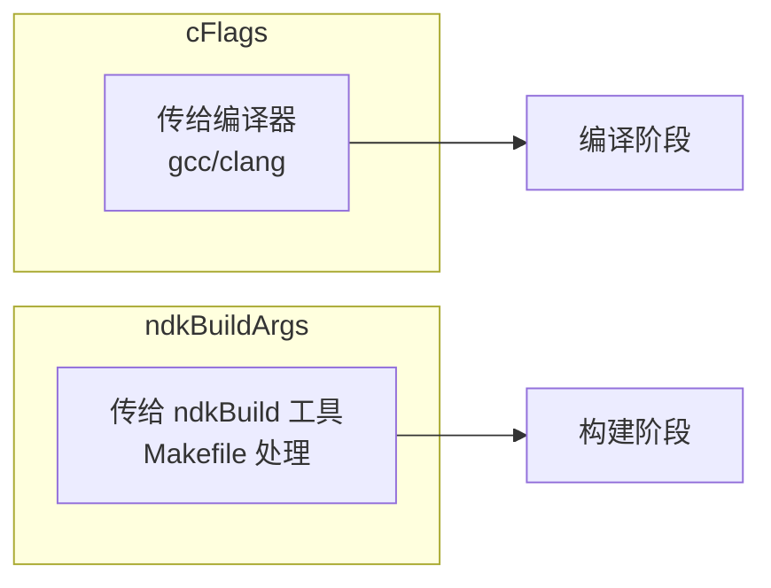
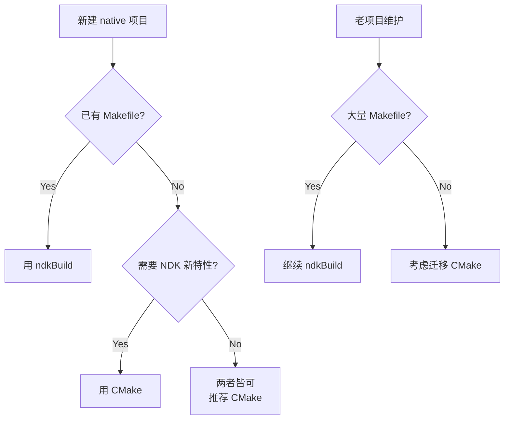
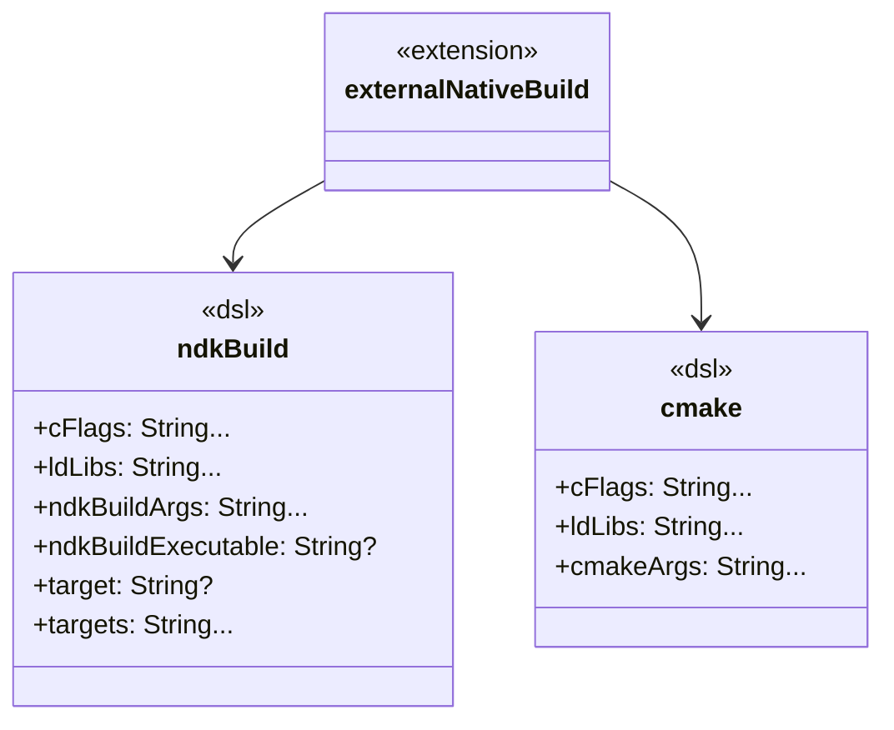

# 21.1.171 NDK构建

阳光透过叶隙，在折叠桌上投下细碎的光斑。

洛芙把黛琳刚才写的 ABI 列表抄到笔记本上，抬头看见希尔已经把电脑合上，正从背包里翻出一个旧的 Android 手机。

“你拿那个老手机干嘛？”伊莎好奇地问。

“等下要用，”希尔把手机放在耳边作了然状，“先让黛琳把 Ndk 讲完，然后我们来点真东西——NdkBuild。”

黛琳把白板翻了一页，新的标题是：`NdkBuild：ndkBuild 构建系统的 Gradle DSL`。

“Ndk 是 NDK 本身，”黛琳说，“NdkBuild 是 ndkBuild 工具的配置入口。”

“等等，”洛芙举起手，“ndkBuild 是什么？CMake 我知道……”

“在 Android NDK 里，有两套构建系统可以编译 C/C++ 代码，”黛琳在白板上画了两个方框，“CMake 是新的、官方推荐的；ndkBuild 是老的、用 Makefile 的。”

伊莎把一片烤培根递给洛芙：“就像露营有两种引火方式——一种是喷火枪（CMake），一种是火柴堆（ndkBuild）。喷火枪方便，但火柴堆在一些老帐篷里用惯了的。”

“比喻女王又来了，”希尔笑，“总之，现在新项目都用 CMake，但老项目很多还在用 ndkBuild。今天我们就看看这个 DSL 怎么配。”

黛琳在白板上写出第一个属性：

```kotlin
interface NdkBuild (Added in 4.0)
```

“接口名就叫 NdkBuild，”黛琳说，“在 `externalNativeBuild { ndkBuild { ... } }` 里面用。”

---

## 第一个问题：ndkBuild 在哪里启用？

“对啊，”洛芙问，“我们怎么告诉 Gradle 要用 ndkBuild 而不是 CMake？”

黛琳把白板翻到新的一页，画了一个流程图：

```mermaid
flowchart TD
    A[app build.gradle] --> B{externalNativeBuild}
    B --> C[cmake { }]
    B --> D[ndkBuild { }]
    D --> E[启用 ndkBuild 构建系统]
    C --> F[启用 CMake 构建系统]
```

“在 `android { }` 里面，不是在 `defaultConfig { }` 里，”黛琳说，“也不是在 `ndk { }` 里——那个已经 deprecated 了。”

希尔把笔记本打开，调出一个真实项目的配置：

```kotlin
android {
    defaultConfig {
        externalNativeBuild {
            ndkBuild {
                cFlags "-DDEBUG_MODE"
            }
        }
    }
    
    buildTypes {
        release {
            externalNativeBuild {
                ndkBuild {
                    cFlags "-DNDEBUG"
                }
            }
        }
    }
}
```

“这里有几个重点，”希尔指着屏幕说，“第一，`externalNativeBuild` 是开关；第二，`ndkBuild { }` 是配置块；第三，`cFlags` 用来传编译参数。”

洛芙歪着头看：“那之前学的 `ndk { }` 呢？”

“旧了，”黛琳说，“官方从 AGP 4.0 开始推荐用 `externalNativeBuild ndkBuild { }`，老的 `ndk { }` 虽然还能用，但已经标记弃用。你看——”

她在白板上写下：

| 旧写法 | 新写法 | 位置 |
|--------|--------|------|
| `ndk { abiFilters "armeabi-v7a" }` | `externalNativeBuild { ndkBuild { ... } }` | android {} |
| `ndk { cFlags "-D..." }` | `ndkBuild { cFlags "..." }` | externalNativeBuild {} |

“abiFilters 已经移到 `ndk { }` 里了？”洛芙问。

“不完全是。abiFilters 在 variant 级别还是在 defaultConfig 级别，情况不同。”黛琳说，“我们后面会详细讲。先把 NdkBuild DSL 的核心属性过一遍。”

---

## 核心属性：cFlags、ldLibs、ndkBuildArgs

黛琳在白板上列出三个属性，每个写一行：

```kotlin
ndkBuild {
    cFlags "-DDEBUG", "-Wall"
    ldLibs "log", "android"
    ndkBuildArgs "-j4", "V=1"
}
```

“cFlags 传编译选项给 gcc/clang，”黛琳说，“ldLibs 传链接库，ndkBuildArgs 传 ndkBuild 自己的参数。”

洛芙问：“cFlags 和 ndkBuildArgs 有什么区别？”

“这个问题问得好，”黛琳在白板上画了一个对比图：



“cFlags 会被放进生成的 Makefile 里，传给编译器；ndkBuildArgs 作用于 ndkBuild 本身，比如指定并行任务数 `-j4` 或者 verbose 输出 `V=1`。”

伊莎补充：“就像烤棉花糖——火候（cFlags）是给棉花糖的感受，温度计（ndkBuildArgs）是给炉子的设置。”

“但是！”希尔突然说，“大多数情况下，你不需要手动写这些。”

她打开另一个项目的配置：

```kotlin
android {
    externalNativeBuild {
        ndkBuild {
            // 通常不需要手动写！
            // cFlags 会从 defaultConfig 继承
            // ldLibs 可以从 dependency 推断
        }
    }
}
```

“NDK 模块的依赖会自动加到链接库列表里，”希尔说，“比如你 gradle 依赖了 `com.google.code.gson:gson`，对应有 JNI 库会自动链接。”

洛芙恍然：“所以其实不需要像以前那样手动写 `ldLibs`？”

“对，现在推荐用 gradle 依赖来管理 native 库，”黛琳说，“只有极少数情况才需要手动指定——比如要链接一个没有 gradle artifact 的第三方库。”

---

## 第二个问题：旧项目怎么迁移？

“我们的老项目用的是 `ndk { }` 里的配置，”洛芙说，“怎么迁移到新的 DSL？”

黛琳翻开一张准备好的表格：

```kotlin
// 旧写法 (deprecated)
ndk {
    moduleName "MyNativeLib"
    cFlags "-DDEBUG"
    ldLibs "log"
    abiFilters "armeabi-v7a", "arm64-v8a"
    stl "c++_static"
}

// 新写法 (AGP 4.0+)
android {
    defaultConfig {
        externalNativeBuild {
            ndkBuild {
                cFlags "-DDEBUG"
            }
        }
        ndk {
            abiFilters "armeabi-v7a", "arm64-v8a"
            stl "c++_static"
        }
    }
    
    externalNativeBuild {
        ndkBuild {
            // 模块名现在通过 target property 指定
        }
    }
}
```

“moduleName 去哪了？”洛芙发现少了点什么。

“在 NdkBuild DSL 里，moduleName 变成了 `target` 属性，”黛琳说，“我们来搜一下——”

她在白板上写：

```kotlin
externalNativeBuild {
    ndkBuild {
        // 方式1：通过 target 指定单个模块
        target "MyNativeLib"
        
        // 方式2：多模块项目用 targets []
        targets "libfoo", "libbar"
    }
}
```

希尔补充：“大多数情况也不需要写 target——Gradle 会自动扫描 `jni/` 或 `Android.mk` 文件，找出所有模块。”

洛芙问：“那 stl 呢？”

“stl 还在 ndk { } 里，”黛琳指给她看，“`ndk { stl \"c++_static\" }` 没有变。”

---

## 第三个问题：ndkBuild vs CMake 怎么选？

伊莎忽然问了一个关键问题：“什么时候用 ndkBuild？什么时候用 CMake？”

黛琳在白板上画了一个决策树：



“官方态度很明确：新项目用 CMake，”黛琳说，“CMake 支持更现代的特性和更好的增量构建。”

“那老项目呢？”洛芙问。

“能跑就不改，”希尔说，“除非要加新功能或者遇到 bug，再考虑迁移。”

她打开电脑，调出一个真实的迁移案例：

```kotlin
// 迁移前：ndkBuild
android {
    defaultConfig {
        externalNativeBuild {
            ndkBuild {
                cFlags "-O3"
            }
        }
    }
}

// 迁移后：CMake
android {
    defaultConfig {
        externalNativeBuild {
            cmake {
                cFlags "-O3"
            }
        }
    }
}
```

“配置几乎一样，只是把 `ndkBuild { }` 换成 `cmake { }`，”希尔说，“这就是 DSL 设计的一致性。”

---

## 第四个问题：ndkBuild 的特殊配置

洛芙盯着屏幕看了一份更复杂的配置：

```kotlin
android {
    externalNativeBuild {
        ndkBuild {
            // 指定 ndk-build 路径（自定义 NDK 版本时用到）
            ndkBuildExecutable "${ndkDirectory}/ndk-build"
            
            // 清理构建产物
            buildStl "c++_static"
            
            // 传递额外参数
            ndkBuildArgs "NDK_DEBUG=1", "V=1"
        }
    }
}
```

“这个 ndkBuildExecutable 是什么？”洛芙问。

“让你指定用哪个 ndk-build 可执行文件，”黛琳说，“默认用 AGP 自带的，但如果你装了多个 NDK 版本，想指定用某一个，就在这里写路径。”

伊莎问：“这就像……露营时要带哪个品牌的瓦斯罐？”

“差不多，”黛琳笑，“大多数情况不需要改，用默认的。”

洛芙又问：“ndkBuildArgs 里那个 `NDK_DEBUG=1` 是什么意思？”

“让 ndkBuild 产出带调试信息的 so 文件，”希尔说，“跟 `cFlags "-g"` 效果类似，但这是传给 Makefile 的变量。”

她在屏幕上打了一个对比：

```kotlin
// 方式1：通过 cFlags 传编译器参数
ndkBuild {
    cFlags "-g", "-O0", "-DDEBUG"
}

// 方式2：通过 ndkBuildArgs 传 Makefile 变量
ndkBuild {
    ndkBuildArgs "NDK_DEBUG=1", "APP_OPTIM=debug"
}
```

“两种方式都能产出调试版本，”希尔说，“但 NDK_DEBUG 更底层，会影响整个构建流程。”

---

## 场景练习：配置一个 ndkBuild 项目

“我们来动手配一个，”希尔把笔记本推过来，“假设我们要编译一个老项目，它有个 `jni/Android.mk`。”

黛琳在白板上写出完整的配置示例：

```kotlin
android {
    compileSdk 34
    
    defaultConfig {
        ndk {
            abiFilters "armeabi-v7a", "arm64-v8a", "x86", "x86_64"
            stl "c++_static"
            moduleName "native-lib"
        }
        
        externalNativeBuild {
            ndkBuild {
                // 编译选项
                cFlags "-Wall", "-Wextra", "-O2"
                
                // 链接库（通常不用写，会自动从依赖推断）
                // ldLibs "log", "android"
            }
        }
    }
    
    buildTypes {
        debug {
            externalNativeBuild {
                ndkBuild {
                    // debug 模式特殊配置
                    ndkBuildArgs "NDK_DEBUG=1"
                }
            }
        }
        release {
            externalNativeBuild {
                ndkBuild {
                    // release 模式优化
                    cFlags "-O3", "-DNDEBUG"
                }
            }
        }
    }
    
    externalNativeBuild {
        ndkBuild {
            // 指定 Android.mk 路径（默认是 jni/Android.mk）
            // ndkBuildFile "jni/MyAndroid.mk"
            
            // 指定模块（通常自动检测）
            // target "native-lib"
            
            // 并行构建任务数
            ndkBuildArgs "-j${Runtime.getRuntime().availableProcessors()}"
        }
    }
}
```

“等等，”洛芙发现一个问题，“abiFilters 到底该写在 ndk {} 还是 externalNativeBuild {} 里？”

“这是个常见困惑，”黛琳画了一张对比表：

| 属性 | 位置 | 作用 |
|------|------|------|
| `abiFilters` | `ndk { }` | 控制生成哪些 ABI 的 .so |
| `cFlags` | `ndkBuild { }` | 传给编译器的参数 |
| `ldLibs` | `ndkBuild { }` | 传给链接器的库 |
| `ndkBuildArgs` | `ndkBuild { }` | ndkBuild 自己的参数 |

“abiFilters 在 ndk {} 里，因为它影响的是 NDK 构建产物；cFlags 在 ndkBuild {} 里，因为它影响的是编译器。”

洛芙点头：“所以是两个不同的配置入口。”

“对，就像露营的背包分层——食物放上层，帐篷放底层，”伊莎说，“不同属性的配置也要放对地方。”

---

## 第五个问题：常见坑与调试

“有没有常见的坑？”洛芙问。

黛琳一口气列出三个：

```kotlin
// 坑1：ndkBuild 和 CMake 混用
android {
    externalNativeBuild {
        cmake { ... }  // 配置了 CMake
        ndkBuild { ... }  // 又配置了 ndkBuild
    }
}
// 结果：只有一个生效，另一个被覆盖
```

“Gradle 会报错还是默默忽略？”洛芙问。

“通常会报错，让你二选一，”黛琳说，“但有时候旧项目迁移时会踩坑。”

```kotlin
// 坑2：cFlags 写错位置
ndk {
    cFlags "-Wall"  // 旧写法deprecated
}
android {
    externalNativeBuild {
        ndkBuild {
            cFlags "-Wall"  // 新写法
        }
    }
}
```

“旧写法不会报错，但不会生效，”希尔说，“这就是 silent failure——你改了配置，但构建结果纹丝不动。”

```kotlin
// 坑3：ldLibs 写了不存在 的库
ndkBuild {
    ldLibs "nonexistent-lib"  // 编译失败
}
```

“这个会报明确的链接错误，”黛琳说，“还算好查。”

洛芙问：“那怎么调试 ndkBuild 配置？”

“用 build logging，”希尔说，“在命令行执行：”

```bash
./gradlew :app:externalNativeBuildDebug --info 2>&1 | grep -E "(ndkBuild|Android.mk)"
```

“或者看构建日志里的具体命令，”她补充，“加上 `--stacktrace` 可以看到更详细的错误。”

---

## 知识总结

黛琳把白板整理成最后一页：



“NDK 构建系统的配置就两件事：**在哪配**和**配什么**，”黛琳总结，“`externalNativeBuild { ndkBuild { } }` 是新写法，老的 `ndk { }` 已经 deprecated。”

“配什么取决于你要控制什么：编译选项用 cFlags，链接库用 ldLibs，ndkBuild 自己的参数用 ndkBuildArgs。”

伊莎把最后一块烤面包分成四份：“今天的收获是——CMake 是现在，ndkBuild 是过去。”

“而你，”希尔指向洛芙，“以后看到老项目的 ndkBuild 配置，知道怎么读、怎么改就够了。”

洛芙看着笔记本上满满一页的笔记，伸了个懒腰。阳光已经移到膝盖上，湖水在远处闪闪发亮。

---

> 学习建议：理解 NdkBuild DSL 的关键在于区分「编译参数」(cFlags) 和「构建参数」(ndkBuildArgs)。新项目优先用 CMake，老项目维护时看懂 ndkBuild 配置即可。迁移时注意 `abiFilters` 位置的变化。

---

## 洛芙的小小日记本

今天学会了看 ndkBuild 配置！原来 CMake 不是唯一选择，老项目用的 ndkBuild 也能看懂啦。黛琳说的对——知道在哪配、配什么，就不怕配置文件的魔法。明天还要学 NdkBuild 的构建标志~

---

## 今日关键词

- **NdkBuild**: Gradle DSL 接口，用于配置 ndkBuild 构建系统编译 C/C++ 代码
- **externalNativeBuild**: Android Gradle Plugin 提供的扩展，用于配置 native 构建系统（CMake 或 ndkBuild）
- **cFlags**: 传递给编译器的参数（如 `-Wall`、`-O2`）
- **ldLibs**: 传递给链接器的库（如 `log`、`android`）
- **ndkBuildArgs**: 传递给 ndkBuild 工具本身的参数（如 `-j4`、`V=1`）
- **ndkBuildExecutable**: 指定 ndk-build 可执行文件路径的属性
- **moduleName**: 已弃用的旧属性，新写法中通过 `target` 指定
- **Android.mk**: ndkBuild 构建系统使用的模块定义文件
- **CMake**: Android NDK 推荐的新一代构建系统
- **buildStl**: 指定 STL 库类型（如 `c++_static`、`c++_shared`）
- **ABI Filter**: 控制生成哪些 CPU 架构对应的 .so 文件
- **增量构建**: 只重新编译改动了的源文件，提升构建速度
