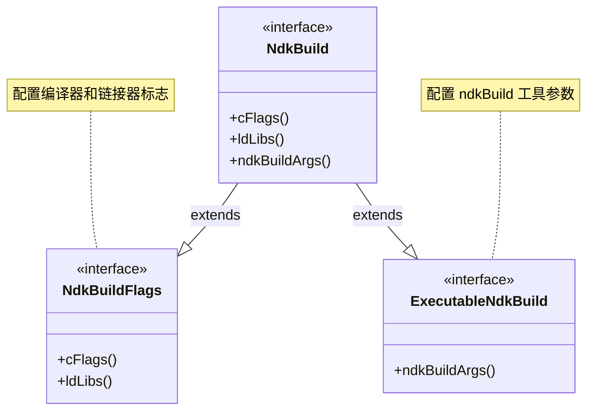

# 21.1.172 Ndk构建标志

太阳已经移到头顶附近，叶隙间的光斑从斜斜的斑点变成了垂直落在桌面上的一点一点。

洛芙揉了揉眼睛，方才抄完的笔记本上已经密密麻麻记了几行配置示例。她抬头看了看天，又看了看黛琳手里的白板笔：“我们刚才说的 cFlags、ldLibs、ndkBuildArgs……它们到底是怎么工作的？”

“对，”希尔把笔记本转过来，“刚才我们只说了‘传编译选项’，但具体怎么传、传给谁，这里有个链条。”

黛琳点了点头，在白板上写下今天的主题：`NdkBuildFlags：标志的传递链条`。

---

## 第一个问题：cFlags 传给谁？

“我们在 NdkBuild DSL 里写 `cFlags`，”黛琳在白板上画了一个简图，“它最后会传到编译器手里——也就是 gcc 或 clang。”

洛芙问：“那 ndkBuildArgs 呢？”

“ndkBuildArgs 传给 ndkBuild 工具本身，”黛琳在白板上补充，“make 工具会接收这些参数，比如 `-j4` 告诉它并行跑4个任务，或者 `V=1` 打开详细输出。”

伊莎把它们比喻成露营炊具：“就像烤棉花糖——火候大小是给棉花糖的感受（cFlags），但炉子的风门开多大是给炉子本身的设置（ndkBuildArgs）。”

希尔笑着补充：“一个是作用于食材，一个是作用于灶台。”

黛琳在白板上画出完整的传递链条：

```mermaid
flowchart LR
    A[build.gradle<br/>ndkBuild { cFlags }] --> B[生成 Android.mk]
    C[build.gradle<br/>ndkBuild { ndkBuildArgs }] --> D[ndkBuild<br/>make 工具]
    B --> E[编译器<br/>gcc/clang]
    D --> F[构建过程]
    
    style A fill:#f9f,fill-opacity:0.3
    style B fill:#bbf,fill-opacity:0.3
    style C fill:#f9f,fill-opacity:0.3
    style D fill:#bfb,fill-opacity:0.3
```

“cFlags 会被展开进 Makefile 里的 `LOCAL_CFLAGS`，”黛琳说，“ndkBuildArgs 则变成 make 命令行参数。”

洛芙翻开笔记本：“那……具体怎么写？”

---

## 第二个问题：cFlags 的正确写法

希尔打开电脑，调出一个最小可运行的示例：

```kotlin
android {
    defaultConfig {
        externalNativeBuild {
            ndkBuild {
                // 编译器标志：传给 gcc/clang
                cFlags "-DDEBUG_MODE"           // 定义宏
                cFlags "-Wall"                  // 开启所有警告
                cFlags "-O2"                    // 优化级别
                cFlags "-fPIC"                   // 位置无关代码
            }
        }
    }
}
```

“cFlags 可以写多条，每条是一个独立的标志，”希尔说，“`-D` 定义宏，`-Wall` 开启警告，`-O2` 是优化级别。”

黛琳补充：“还可以加平台相关的标志，比如针对 ARM 架构的：`cFlags \"-march=armv7-a\"`。”

洛芙问：“这些标志会影响到所有 native 模块吗？”

“会，”黛琳点头，“写在 `defaultConfig.externalNativeBuild.ndkBuild.cFlags` 里，会应用到所有 ABI、所有构建类型。”

“如果只想针对某个 ABI 呢？”伊莎问。

“那需要写到 `splits` 或者变体维度里，”黛琳说，“我们后面会详细讲。”

---

## 第三个问题：ldLibs 配置 linker 库

“ldLibs 是另一个重要属性，”黛琳在白板上写下新的标题，“它用来指定链接哪些系统库。”

希尔切到下一个示例：

```kotlin
ndkBuild {
    // 链接器库：告诉 linker 需要链接哪些库
    ldLibs "log"        // android/log.h，写日志用
    ldLibs "android"    // Android runtime
    ldLibs "GLESv2"     // OpenGL ES 2.0
    ldLibs "jnigraphics" // jni 图形库
    ldLibs "camera2"    // 相机相关（NDK r20+）
}
```

“每个 `ldLibs` 对应一个系统库，”希尔说，“写的时候不用加 `lib` 前缀，也不用加 `.so` 后缀——Gradle 会自动处理。”

洛芙问：“一定要手动写吗？”

“不一定，”黛琳说，“如果你 gradle 依赖了一个 native 库，比如 `com.google.code.gson:gson`，它的 JNI 库会自动加到链接列表里。只有没有 gradle artifact 的库才需要手动写。”

伊莎说：“就像露营食材——能买到现成的（gradle 依赖），就不用自己带了（手动 ldLibs）。”

---

## 第四个问题：ndkBuildArgs 的高级用法

“ndkBuildArgs 是给 ndkBuild 工具本身用的，”黛琳说，“最常见的是控制并行构建和输出详细度。”

希尔调出几个实用示例：

```kotlin
ndkBuild {
    // ndkBuild 工具参数：控制 make 行为
    ndkBuildArgs "-j4"          // 并行4个任务
    ndkBuildArgs "V=1"          // verbose 输出全部命令
    ndkBuildArgs "-k"           // 遇到错误继续执行（keep going）
    ndkBuildArgs "APP_ABI=armeabi-v7a"  // 只编译特定 ABI
}
```

“`-j4` 很常用，”希尔说，“现在的电脑多核，让 make 并行跑能快很多。”

洛芙问：“如果我不写会怎样？”

“默认会跑 `make -j<cpu核心数>`，”黛琳说，“大多数情况下够用了。”

黛琳在白板上画出完整的配置结构图：



“实际上 NdkBuildFlags 接口定义了 cFlags 和 ldLibs，”黛琳说，“而 ndkBuildArgs 在另一个接口里。”

---

## 第五个问题：实践！配置一个完整的 ndkBuild

“现在我们来写一个完整的示例，”希尔把屏幕共享给大家看。

她新建一个配置块：

```kotlin
android {
    defaultConfig {
        externalNativeBuild {
            ndkBuild {
                // 编译器标志
                cFlags "-DDEBUG"
                cFlags "-Wall"
                cFlags "-O2"
                
                // 链接器库
                ldLibs "log"
                ldLibs "android"
            }
        }
    }
    
    buildTypes {
        release {
            externalNativeBuild {
                ndkBuild {
                    // Release 版关闭调试，优化更激进
                    cFlags "-DNDEBUG"
                    cFlags "-O3"
                    cFlags "-ffast-math"
                }
            }
        }
    }
}
```

“这里我们用了分层配置，”希尔说，“defaultConfig 里的会应用到所有变体，buildTypes.release 里的只针对 release 版本。”

洛芙问：“那 debug 版呢？”

“debug 版会继承 defaultConfig 的配置，”黛琳说，“如果想单独配置，可以写到 `buildTypes.debug` 里。”

---

## 第六个问题：反模式与最佳实践

“有些写法是不推荐的，”黛琳翻到白板的新一页，画了一个大大的“X”。

**❌ 错误写法：把 cFlags 和 ndkBuildArgs 混用**

```kotlin
// 错误：把编译器标志放进 ndkBuildArgs
ndkBuild {
    ndkBuildArgs "-DDEBUG"  // 不会生效！这是给 make 的
}
```

**✅ 正确写法：分清职责**

```kotlin
// 正确：编译器标志用 cFlags
ndkBuild {
    cFlags "-DDEBUG"
    
    // ndkBuild 参数用 ndkBuildArgs
    ndkBuildArgs "-j4"
}
```

伊莎说：“就像做饭——火候（cFlags）是给食材的，但炉灶设置（ndkBuildArgs）是给炉子的。你不能把火候参数拧到炉灶旋钮上。”

---

## 第七个问题：迁移中的常见坑

“老项目迁移时，有个常见的坑，”黛琳说，“旧的 `ndk { cFlags \"...\" }` 写法会被忽略。”

希尔展示了迁移前后的对比：

```kotlin
// 旧写法 (deprecated，AGP 4.0+ 不推荐)
ndk {
    cFlags "-DDEBUG"
    ldLibs "log"
}

// 新写法 (AGP 4.0+)
android {
    defaultConfig {
        externalNativeBuild {
            ndkBuild {
                cFlags "-DDEBUG"
            }
        }
        ndk {
            // ldLibs 在 ndk {} 里
            ldLibs "log"  // 注意：这个会生效
        }
    }
}
```

“等等，”洛芙发现问题了，“ldLibs 到底该放哪儿？”

“这个问题问得好，”黛琳说，“ldLibs 有两种放法：”

```kotlin
// 方式1：放在 ndkBuild {} 里 (推荐)
externalNativeBuild {
    ndkBuild {
        cFlags "-DDEBUG"
        ldLibs "log"
    }
}

// 方式2：放在 ndk {} 里 (deprecated but still works)
ndk {
    ldLibs "log"
}
```

“推荐方式1，”黛琳说，“放在 ndkBuild {} 里更符合 DSL 的设计逻辑——构建配置和 NDK 配置分开。”

---

## 代码验证：希尔现场演示

希尔把电脑连上投影，现场跑了一个简单项目。她在终端里输入：

```bash
./gradlew :app:externalNativeBuildDebug
```

终端输出了构建日志：

```
> Task :app:externalNativeBuildDebug
> /Users/.../android-ndk/r21d/ndk-build 
  [armeabi-v7a] Compile++      : mylib <= MyNativeLib.cpp
  [armeabi-v7a] StaticLibrary  : libmylib.a
  [arm64-v8a] Compile++        : mylib <= MyNativeLib.cpp
  [arm64-v8a] StaticLibrary   : libmylib.a
  [x86] Compile++              : mylib <= MyNativeLib.cpp
  [x86] StaticLibrary           : libmylib.a
  [x86_64] Compile++           : mylib <= MyNativeLib.cpp
  [x86_64] StaticLibrary        : libmylib.a
> Build mylib : ok
> Build mylib : ok
> Build mylib : ok
> Build mylib : ok
> Build mylib : ok
> Build mylib : ok
> Build mylib : ok

BUILD SUCCESSFUL in 12s 345ms
```

“看到没，”希尔指着终端说，“每个 ABI 都单独编译了。这是 ndkBuild 的标准输出格式。”

洛芙问：“如果我们想只编译一个 ABI 呢？”

“那可以用 ndkBuildArgs 限制，”希尔现场改了一下配置：

```kotlin
ndkBuild {
    ndkBuildArgs "APP_ABI=arm64-v8a"
}
```

重新构建，输出变了：

```
> /Users/.../ndk-build APP_ABI=arm64-v8a 
  [arm64-v8a] Compile++      : mylib <= MyNativeLib.cpp
  [arm64-v8a] StaticLibrary  : libmylib.a
> Build mylib : ok

BUILD SUCCESSFUL in 3s 120ms
```

“快多了！”洛芙说。

“对，开发阶段只编译目标 ABI 能节省时间，”黛琳说，“但发布的时候记得恢复全 ABI 构建。”

---

## 知识点总结图

黛琳把今天的知识点画成一张总览图：

```mermaid
flowchart TD
    subgraph build_gradle["build.gradle 配置"]
        A[ndkBuild { cFlags }] --> B[编译器标志]
        C[ndkBuild { ldLibs }] --> D[链接器库]
        E[ndkBuild { ndkBuildArgs }] --> F[构建工具参数]
    end
    
    subgraph android_mk["生成 Android.mk"]
        B --> G[LOCAL_CFLAGS]
        D --> H[LOCAL_LDLIBS]
    end
    
    subgraph ndk_build["ndk-build 执行"]
        F --> I[make 命令行参数]
    end
    
    G --> J[编译器 gcc/clang]
    H --> K[链接器 ld]
    I --> L[构建流程]
    
    style A fill:#f9f,fill-opacity:0.3
    style B fill:#bbf,fill-opacity:0.3
    style C fill:#f9f,fill-opacity:0.3
    style D fill:#bbf,fill-opacity:0.3
    style E fill:#f9f,fill-opacity:0.3
    style F fill:#bfb,fill-opacity:0.3
```

洛芙把这个图完整地抄到了笔记本上。

---

烤土司的香味飘了过来。

伊莎已经把露营小灶上的土司烤好，分给大家。阳光已经完全移到桌面正中，湖畔的水面被照得亮晶晶的，偶尔有几只水鸟掠过，留下一串细碎的波纹。

“今天这个特别清楚，”洛芙咬了一口烤土司，含糊地说，“cFlags 是给编译器的，ldLibs 是给链接器的，ndkBuildArgs 是给 make 自己的——就像不同的工具给不同的部件。”

黛琳笑了笑：“总结得很好。”

希尔把电脑收进背包：“下次我们讲 CMake Flags——那边是另一套 DSL，但思路差不多。”

伊莎把最后一片土司递给洛芙：“吃饱了才有力气写代码。”

洛芙笑着接过，阳光照在她脸上，暖烘烘的。

---

> **学习建议**
>
> NdkBuildFlags 的核心是理解三层标志的传递路径：cFlags 进入 Makefile 传给编译器，ldLibs 指定链接的库，ndkBuildArgs 控制 ndkBuild 本身的行为。配置时注意分层——defaultConfig 放通用配置，buildTypes 放变体特定配置。开发阶段可用 ndkBuildArgs "APP_ABI=..." 限制编译 ABI 提速，发布前记得移除限制编译全平台。

---

## 洛芙的小小日记本

今天终于搞清楚 cFlags、ldLibs、ndkBuildArgs 的区别了！就像做菜一样——火候是给食材的（cFlags），食材是给锅里的（ldLibs），炉子是给灶台的（ndkBuildArgs）。希尔现场跑的那个只编译 arm64-v8a 的例子好爽，开发时候就应该这样加速。下次试试在 release 版里加更激进的优化！

---

## 今日关键词

- **NdkBuildFlags**：Android Gradle 插件 DSL 接口，用于配置 ndkBuild 构建系统的编译器和链接器标志。包含 cFlags（编译器标志）和 ldLibs（链接器库）属性。
- **cFlags**：传递给编译器的标志，会被展开到 Android.mk 的 LOCAL_CFLAGS 中，用于定义宏、设置优化级别、开启警告等。
- **ldLibs**：链接器库列表，指定需要链接的系统库或第三方库，如 "log"、"android"、"GLESv2" 等，不需要加 lib 前缀或 .so 后缀。
- **ndkBuildArgs**：传递给 ndkBuild（make）工具的参数，用于控制构建行为，如并行任务数 `-j4`、verbose 输出 `V=1`、限制 ABI 等。
- **LOCAL_CFLAGS**：Android.mk 中定义本地模块编译标志的变量，Gradle 的 cFlags 会映射到这里。
- **LOCAL_LDLIBS**：Android.mk 中定义本地模块链接库的变量，Gradle 的 ldLibs 会映射到这里。
- **externalNativeBuild**：Android Gradle 插件的配置块，用于配置 native 构建系统（cmake 或 ndkBuild），是启用 native 构建的入口。
- **defaultConfig**：Gradle 构建配置中的默认配置块，其中的 externalNativeBuild 配置会应用到所有构建变体。
- **buildTypes**：Gradle 构建配置中的构建类型块，可以为 debug/release 等类型单独配置 cFlags 等参数。
- **APP_ABI**：ndk-build 环境变量，用于限制只编译特定的 ABI，如 "arm64-v8a" 或 "armeabi-v7a,x86_64"。

---
