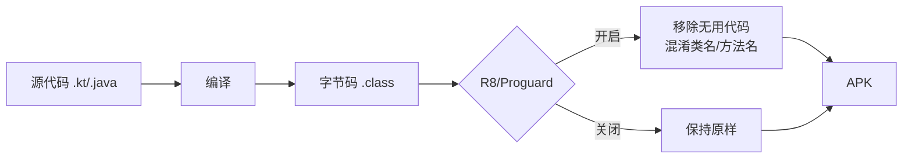
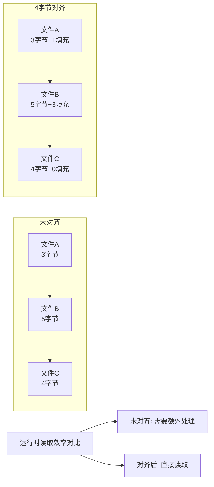
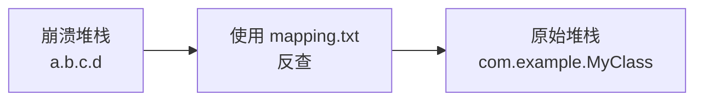

# 21.1.173 优化

正午的阳光透过密集的树叶，在折叠桌上投下星星点点的光斑。洛芙抬手挡住眼睛，看了看手表。

"十二点了呢。"

"这么快？"希尔正低头在笔记本上敲代码，抬起头来揉了揉眼睛，"我都忘了吃饭这回事了。"

伊莎笑着从背包里翻出几个饭团和三明治，还有一小袋切好的水果。"就知道你们会忘记，先吃点东西吧。"

黛琳却没有动面前的食物，而是从背包里掏出一本皱巴巴的笔记本，封面上写着"构建优化清单"几个大字。她把笔记本摊开，指着其中一页。

"刚才我们讲了 NdkBuildFlags 的 cFlags 和 ldLibs，但那些只是编译阶段的优化。构建出来的 APK，其实还有很多可以优化的地方。"

洛芙咬了一口饭团，含糊不清地问："APG 还能怎么优化？体积吗？"

"对，"黛琳点点头，"体积、启动速度、运行效率，这些都可以通过构建时的优化设置来改善。今天要讲的 Optimization DSL，就是控制这些优化开关的接口。"

---

## 压缩与混淆：代码层面的瘦身

黛琳用笔尖点了点笔记本上的第一行。

"R8 和 Proguard，你们应该都听说过吧？"

洛芙举手："我知道！就是那个把代码混淆成 a、b、c 的工具！"

"差不多是这个意思，"黛琳笑了笑，"在 Android Gradle Plugin 里，控制混淆和代码压缩的开关，就藏在 Optimization 接口里。"

她在白板纸上画了一个简单的流程图。



"看，这里有一个关键的分支，"黛琳用笔尖指着 D 节点，"开启优化开关时，R8 会做三件事：shrink（移除未使用的代码和资源）、obfuscate（混淆类名方法名）、optimize（做些代码层面的优化）。"

希尔终于抬起头来，补充道："我之前做过一个对比实验，同一个 App，开启 R8 前是 12MB，开启后是 7MB，直接缩小了将近一半。"

"这么厉害！"洛芙惊叹道。

"不过混淆也有代价，"黛琳说，"如果你的代码被反射调用，或者动态加载类名，混淆后就找不到了。需要在 proguard-rules.pro 文件里手动保留。"

她在白板上写下配置示例：

```kotlin
android {
    buildTypes {
        release {
            // 开启 R8 代码压缩和混淆
            isMinifyEnabled = true
            // 开启资源压缩（移除未使用的资源）
            isShrinkResources = true
            // 指定混淆规则文件
            proguardFiles(
                getDefaultProguardFile("proguard-android-optimize.txt"),
                "proguard-rules.pro"
            )
        }
    }
}
```

"等等，"洛芙歪着头，"isMinifyEnabled 和 isShrinkResources 有什么区别？"

"好问题，"黛琳点点头，"isMinifyEnabled 针对的是 Java/Kotlin 字节码，会移除未使用的类、方法、字段。而 isShrinkResources 针对的是资源文件，比如图片、布局文件、字符串资源等等。两者是独立的，可以单独开启。"

伊莎剥开一个橘子，一边吃一边说："我把它想象成整理行李箱——isMinifyEnabled 像把不穿的衣服扔掉，isShrinkResources 像把不用的杂志和说明书扔掉。"

---

## 图片压缩：PNG 与 JPEG 的处理

黛琳翻到笔记本的第二页。

"除了代码压缩，还有资源压缩。尤其是图片，在 APK 里通常占了很大比重。"

她看向希尔："上次你说的那个图片压缩的开关，是叫 crunchPng 吧？"

"对！"希尔来劲了，"这个优化很实用。crunchPngs 会在构建时自动压缩 PNG 图片，crunchJpg 压缩 JPEG。原理是在构建阶段用工具重新编码图片，去除冗余的元数据。"

"我可以看一下效果吗？"洛芙好奇地问。

希尔掏出手机，翻出一张对比图。"这是我之前测的，同样一张 PNG，原图是 500KB，crunch 之后变成 320KB，将近节省了 36% 的空间。而且视觉上几乎看不出区别。"

"这么神奇？"洛芙凑过去看，"真的差不多啊！"

"不过要注意，"黛琳补充道，"crunch 是在构建时处理的，会增加构建时间。如果你的图片已经经过压缩工具处理过了，或者图片数量非常多，每次构建都重新处理可能会比较慢。"

她在白板上写下配置：

```kotlin
android {
    buildTypes {
        release {
            // 压缩 PNG 图片
            crunchPngs = true
            // 压缩 JPEG 图片
            crunchJpg = true
        }
    }
}
```

洛芙举手："那 debug 版本也要开启这些吗？"

"通常不建议，"黛琳说，"debug 版本关闭这些压缩有两个原因：第一，debug 构建速度更重要，压缩会增加耗时；第二，debug 版本通常需要保留完整的符号信息，方便调试。"

---

## ZIP 对齐与资源优化

"还有一个很重要的优化项——ZIP 对齐，"黛琳说，"在 Android 里，APK 实际上就是一个 ZIP 文件。如果文件没有被对齐，运行时读取会变慢，还可能报错。"

"这个是自动开启的吗？"洛芙问。

"在 release 构建类型里默认是开启的，"黛琳答道，"叫 isZipAlignEnabled。原理是把 APK 里的所有文件按照 4 字节对齐，这样系统读取时更高效。"

她在白板上画了一个对比图：



"你看，未对齐的文件在读取时需要额外的处理，对齐后就可以直接映射到内存。"

希尔补充道："在 Android 6.0 之后，系统会强制要求 APK 对齐，未对齐的 APK 甚至无法安装。"

"对了，还有 resource optimized——资源优化，"黛琳继续说，"在某些场景下，可以只保留用户需要的语言资源，或者根据屏幕密度只保留一套图片资源。这需要配合 splits 配置使用。"

---

## 构建类型与优化组合

伊莎忽然插话道："说了这么多优化开关，那 debug 和 release 应该怎么配置呢？"

黛琳点点头："好问题。让我把常见的组合整理一下。"

她在白板上列了一个表格：

| 构建类型 | isMinifyEnabled | isShrinkResources | crunchPngs | isZipAlignEnabled | 适用场景 |
|---------|-----------------|-------------------|------------|-------------------|---------|
| debug | false | false | false | false | 快速迭代、调试 |
| release | true | true | true | true | 发布上线 |
| staging | false | false | true | true | 预发布测试 |
| development | false | false | false | false | 本地开发 |

"这个表格只是一个参考，"黛琳补充道，"实际项目中，可以根据团队的需求调整。比如有些团队希望在 staging 环境也做代码混淆，以便提前发现问题。"

洛芙指着 staging 那行："staging 环境也开启 zipAlign 但不混淆，是为了测试安装包的完整性吗？"

"对，"黛琳露出赞许的笑容，"staging 通常用来做完整的集成测试，包括安装、卸载、OTA 升级等等。开启 ZIP 对齐可以验证这些流程，但关闭混淆可以让测试人员更容易查看日志和堆栈。"

---

## R8 的高级优化选项

希尔忽然想起什么，把笔记本转过来给大家看。

"对了，差点忘了说。R8 除了基本的混淆，还有几个高级选项，可以进一步优化 APK 体积和性能。"

她在键盘上敲了一段配置：

```kotlin
android {
    buildTypes {
        release {
            isMinifyEnabled = true
            isShrinkResources = true
            // 启用 R8 的完整模式（默认开启）
            isEnableR8FullMode = true
            // 允许 R8 做代码优化（内联、死代码消除等）
            isEnableR8CodeShrinking = true
        }
    }
    // R8 配置（DSL）
    r8 {
        // 是否生成映射文件
        isGenerateProguardRules = true
        // 是否保留行号信息（便于崩溃追踪）
        isKeepDebugSymbols = true
    }
}
```

"这些参数在大多数场景下不需要手动设置，"希尔解释道，"但如果遇到问题，可以针对性调整。比如 isGenerateProguardRules 会在构建时自动生成一些保留规则，输出到 build/outputs/mapping/ 目录。"

黛琳补充："还有一个重要的优化——desugar。Java 8 的特性（如 lambda、方法引用）在 Android 低版本上运行，需要在编译时做 desugar 转换。这个转换本身也有一些优化选项。"

她在白板上写下：

```kotlin
android {
    compileOptions {
        // 启用 desugar（默认开启）
        isCoreLibraryDesugaringEnabled = true
        // Java 版本
        sourceCompatibility = JavaVersion.VERSION_17
        targetCompatibility = JavaVersion.VERSION_17
    }
}
```

"不过这个属于 compileOptions，不是 Optimization DSL 的范畴了。我们回头再单独讲。"

---

## 优化与调试的矛盾

洛芙忽然举手："那个……我有個问题。"

"说。"

"如果我把优化全部打开了，但是遇到了问题，怎么调试呢？"

黛琳赞许地点点头："这个问题很实际。确实，开启优化后，堆栈信息会被混淆，调试会变得困难。"

她指了指白板上的配置："有几个解决方案：第一，确保在构建输出目录保留映射文件。release 构建会在 build/outputs/mapping/ 目录生成 mapping.txt，里面记录了原始类名和混淆后类名的对应关系。"



"第二，在 proguard-rules.pro 里保留行号信息。"

黛琳写下配置示例：

```proguard
# 保留行号信息，便于调试
-keepattributes SourceFile,LineNumberTable
# 保留泛型信息
-keepattributes Signature
# 保留异常信息
-keepattributes Exceptions
```

"第三，"希尔补充道，"如果问题难以排查，可以临时关闭优化进行调试，确认问题后再重新打开。这需要一个构建开关来控制。"

她在白板上写了一个条件配置：

```kotlin
buildTypes {
    release {
        // 从命令行传入 -PenableMinify=true 来控制
        isMinifyEnabled = project.hasProperty("enableMinify") && 
            project.property("enableMinify") == "true"
    }
}
```

"这样本地调试时可以关闭混淆，CI 构建时再打开。"

---

## 资源shrink的细节

伊莎忽然想起一个问题："资源压缩那个，shrinkResources，是怎么判断哪些资源要保留、哪些要删除的呢？"

"好问题，"黛琳说，"R8 在做代码 shrink 时，会分析所有被引用的资源。但有一种情况很特殊——动态生成的资源路径。"

她在白板上写下场景：

```kotlin
// 动态加载资源，无法被静态分析发现
val resId = resources.getIdentifier(
    "icon_${deviceType}",  // "icon_phone" 或 "icon_tablet"
    "drawable",
    packageName
)
```

"这种情况需要手动在 res/raw/ 下保留，或者在 proguard-rules.pro 里用 -keep 规则保留。"

希尔补充道："还有一个常用的技巧——shrinkResources 只清理 res/ 目录下的资源，但不会清理 assets/ 目录。如果 assets/ 里有不需要的文件，需要手动删除或在构建脚本里处理。"

---

## 优化与增量构建

"对了，还有一个问题很重要，"黛琳正色道，"开启这些优化开关后，会影响增量构建。"

洛芙不解："增量构建？"

"就是只重新构建有变化的部分，而不是整个项目重新构建，"黛琳解释道，"因为 R8 需要分析整个代码图来决定哪些可以删除，所以每次构建都需要完整运行。这会增加构建时间。"

她在白板上画了一个对比：

```mermaid
gantt
    title 构建时间对比（示例项目）
    dateFormat X
    axisFormat %s秒
    
    section 关闭优化
    编译: 0, 30
    打包: 30, 40
    
    section 开启优化
    编译: 0, 30
    R8分析: 30, 55
    打包: 55, 65
```



"可以看到，开启优化后，构建时间大约增加了 50%。所以很多团队在日常开发时关闭优化，只在 CI 构建或发布时开启。"

"这样啊，"洛芙理解了，"所以 debug 版本不开启优化，除了调试方便，还有加快构建速度的原因！"

"对，"黛琳点点头，"这是个很重要的权衡。"

---

## 本章小结：优化开关的组合艺术

伊莎把最后一块三明治吃完，总结道："原来一个 Optimization DSL 里有这么多门道！"

"是啊，"黛琳说，"总结一下今天学的——"

她在白板上写下：

- **代码混淆**：isMinifyEnabled = true（需要配合 proguard-rules.pro）
- **资源压缩**：isShrinkResources = true
- **图片压缩**：crunchPngs = true, crunchJpg = true
- **ZIP对齐**：isZipAlignEnabled = true（release 默认开启）
- **调试兼容性**：保留 mapping 文件、保留行号信息

"这些优化开关看起来简单，但实际项目中需要根据团队的开发流程、测试策略、发布流程来做调整。没有绝对的最佳实践，只有最适合团队的选择。"

洛芙把这些记在笔记本上，抬头看了看天。

"对了，下午要不要去湖边走走？刚才一直在讲课，都没怎么动。"

"我也想休息一下，"伊莎伸了个懒腰，"不过下次能不能换个话题，我想学点 Service 相关的内容了。"

"没问题，"黛琳笑着收起笔记本，"下次我们讲 Android 的后台任务处理。"

---

> 学习建议：Optimization DSL 是构建优化的核心，掌握这些设置能显著减小 APK 体积并提升运行效率。建议先在测试项目里尝试各个优化选项，观察构建时间和产物的变化，再根据实际需求做调整。混淆规则的学习是一个渐进的过程，从简单场景开始，逐步掌握更多高级配置。

## 洛芙的小小日记本

今天学到了构建优化！原来一个 isMinifyEnabled 就能让 APK 缩小一半，好厉害！但是黛琳说优化和调试是矛盾的，需要用 mapping 文件来反查堆栈——这让我想到，做任何事情都要权衡啊，不能只追求一个方面。下午去湖边走走吧，晒晒太阳~

---

## 今日关键词

- **Optimization**：Android Gradle Plugin 中的构建优化配置接口
- **R8/Proguard**：代码混淆和压缩工具，R8 是新一代实现
- **isMinifyEnabled**：控制是否启用代码混淆和压缩
- **isShrinkResources**：控制是否启用资源压缩
- **crunchPngs/crunchJpg**：构建时压缩 PNG/JPEG 图片的开关
- **isZipAlignEnabled**：控制 APK 文件是否按 4 字节对齐
- **proguard-rules.pro**：Proguard/R8 混淆规则配置文件
- **mapping 文件**：混淆前后的符号对应表，用于调试反解
- **desugar**：将 Java 8 特性转换为 Android 低版本兼容代码的编译步骤
- **增量构建**：只重新构建有变化部分的构建策略，优化会降低增量构建效率