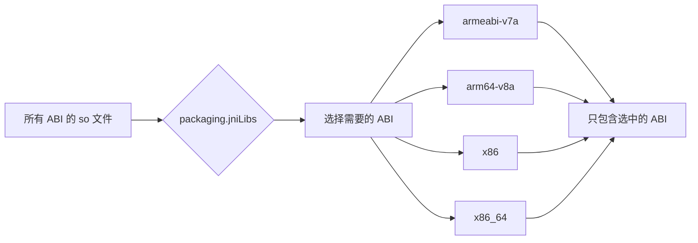
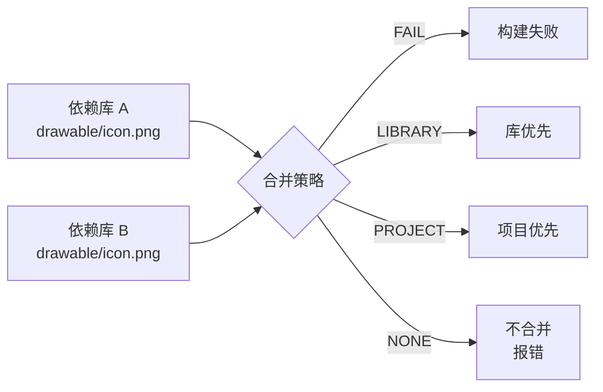

# 21.1.174 包装

知了的叫声稀疏了一些，洛芙靠在折叠椅背上，舒服地伸了个懒腰。

"吃饱了果然容易犯困……"

"别睡啊，"希尔用笔帽戳了戳她的肩膀，"刚才讲的优化还没消化完吧？我们再讲讲打包的事。"

"打包？"洛芙揉了揉眼睛，"APK 不就是把所有东西打包在一起吗？还有什么要配置的？"

黛琳把笔记本翻到新的一页，上面写着"Packaging Options"几个字。

"可没那么简单，"她笑了笑，"你知道你的 APK 里都装了什么东西吗？有些东西可能根本不需要打包进去——比如某些 native 库、测试资源、或者特定架构的 so 文件。Packaging Options 就是用来控制这些的。"

---

## 排除不必要的内容

黛琳在白板上写下第一行标题：Excludes（排除项）。

"每次构建时，Gradle 会把所有依赖都打包进 APK，"她解释道，"但有些依赖你可能不需要。比如某些库自带了 JNI 库，但你的应用只用到其中一部分功能。"

洛芙举手："那个……能不能举个例子？"

黛琳点点头，看向希尔："上次我们项目里是不是遇到过 so 文件的问题？"

"啊，对！"希尔想起来了，"就是那个地图 SDK，ABI 切分之后，每个 APK 都带了一套 so 文件，但其实是同一套代码在不同 ABI 下的不同版本。有些用户下载了不适合他们设备的版本，导致 native 库加载失败。"

"那怎么办？"洛芙问。

"可以用 excludes 来排除特定的 so 文件，"黛琳说，"或者更聪明的方式——用 ABI 过滤器只保留需要的架构。"

她在白板上写下配置示例：

```kotlin
android {
    packaging {
        // 排除特定的资源文件
        resources {
            excludes += "META-INF/DEPENDENCIES"
            excludes += "META-INF/LICENSE"
            excludes += "META-INF/LICENSE.txt"
            excludes += "META-INF/NOTICE"
            excludes += "META-INF/NOTICE.txt"
        }
    }
}
```

伊莎歪着头："这些 META-INF 的是什么？"

"通常是 Maven 依赖带来的许可证文件，"黛琳解释道,"如果不排除，会打包进 APK，虽然不影响功能，但会增加包体积，而且某些应用市场会因此报错。"

"原来如此！"洛芙明白了，"那这些 exclude 是不是必须写的？"

"在大多数项目里是推荐的，"黛琳说，"因为大多数 Android 项目都会依赖一些第三方库，而这些库往往会带来这些 LICENSE 文件。"

---

## JNI 库的过滤

黛琳翻到笔记本的第二页。

"除了资源文件，还有 JNI 库——就是 .so 文件——的过滤。这个更复杂一些，但也很重要。"

她在白板上画了一个图：



"Android 设备有很多种 CPU 架构，"黛琳解释道，"最常见的是 ARM 和 x86。ARM 里面又分 32 位和 64 位。如果你把所有的 so 文件都打包进去，APK 会变得很大。"

"那怎么处理？"洛芙问。

"可以用 filters 来过滤，"黛琳说，"只保留你需要支持的 ABI。"

她在配置里写下：

```kotlin
android {
    packaging {
        jniLibs {
            // 只保留 arm64-v8a 和 x86_64
            // 这样可以大幅减少 APK 体积
            filters += "arm64-v8a"
            filters += "x86_64"
        }
    }
}
```

希尔补充道："不过要注意，有些设备只支持特定的 ABI。比如很多低端 Android 设备只支持 armeabi-v7a。如果你只打包 64 位库，这些设备就运行不了。"

"那怎么办？"洛芙问。

"通常的做法是打包多个 ABI 的 so 文件，用 ABI 切分（ABI Splits）来实现，"黛琳说，"这样 Google Play 会根据用户的设备自动分发合适的 APK。"

---

## 资源过滤与语言配置

伊莎忽然插话道："我之前看到一个 APK，里面有很多 res/values-xx 的文件夹，是不是和这个也有关系？"

"对！"黛琳点点头，"这也是 Packaging Options 的一部分——资源配置文件（Resource Configurations）。"

她在白板上写下：

```kotlin
android {
    packaging {
        resources {
            // 排除不需要的语言资源
            // 只保留中文和英文
            includes += "*/values-zh-rCN/*"
            includes += "*/values-en/*"
            
            // 或者用 excludes 排除特定语言
            excludes += "*/values-ja/*"
            excludes += "*/values-ko/*"
            excludes += "*/values-fr/*"
            excludes += "*/values-de/*"
        }
    }
}
```

"一个成熟的 App，通常只需要支持几种语言就够了，"黛琳解释道，"但如果你不配置，Gradle 会把所有依赖库里的语言资源都打包进去。一个库有 20 种语言，10 个库就是 200 套，会让 APK 变得非常大。"

洛芙掰着手指算了一下："一个库 20 种语言，10 个库……那岂不是要打包 200 套？"

"没错，"黛琳说，"所以很多大厂 App 都会做语言资源的过滤，只保留需要的几种。"

伊莎剥开一颗坚果："我听说有些 App 只保留英语和中文，因为用户基本只用这两种语言。"

"对，这是一个很常见的策略，"黛琳说，"但要注意，应用市场的审核可能会检查是否所有翻译都齐全。如果你只打包部分语言，需要在应用商店后台标注支持的语言列表。"

---

## Java 资源与 Android 资源

希尔忽然想起什么，打开笔记本敲了一段代码。

"对了，还有一种资源容易被忽略——Java resources。"

她在键盘上敲出配置：

```kotlin
android {
    packaging {
        // Java resources 的处理
        java {
            // 排除 Java resources 中的特定文件
            excludes += "**/test/**"
            excludes += "**/Mock*.class"
            excludes += "**/*\$*.class"
        }
    }
}
```

"Java resources 和 Android resources 是两套系统，"希尔解释道，"Java resources 主要是 .class 文件和一些配置文件，放在 JAR 里。Android resources 是 res/ 目录下的资源。"

洛芙举手："那个 \$ 符号的 class 是什么？"

"是内部类，"希尔说，"在 Java 编译后，内部类会生成名为 OuterClass\$InnerClass.class 的文件。通常不需要打包进 APK，所以可以用 excludes 排除。"

黛琳补充道："还有 test 目录下的文件——这些是单元测试用的，不应该打包进正式 APK。"

---

## 合并策略

黛琳在白板上写下第三行标题：Merge Strategy（合并策略）。

"当多个依赖库里有同名的资源时，Gradle 需要决定怎么处理。这就是合并策略。"

她在白板上画了一个图：



"Merge Strategy 有几种选项："黛琳解释道，"LIBRARY 表示库优先，PROJECT 表示项目优先，NONE 表示不合并直接报错。"

她在配置里写下：

```kotlin
android {
    packaging {
        resources {
            // 依赖库之间的合并策略
            // LIBRARY: 依赖库优先
            // PROJECT: 项目本身的资源优先
            // NONE: 直接报错
            mergeStrategy = "LIBRARY"
            
            // 对特定资源使用不同策略
            // 比如某些文件可以覆盖，有的不能
            pickFirsts += "**/important_resource.xml"
        }
    }
}
```

"通常用 PROJECT 比较多，"黛琳说，"因为项目本身的资源通常是最重要的，依赖库的资源只是备选。"

---

## Excludes 与 Proguard 的区别

洛芙忽然举手："这个 exclude 和我们之前学的 Proguard 有什么区别？"

"好问题！"黛琳说，"Proguard/R8 是处理 Java/Kotlin 字节码的——删除未使用的类、方法，混淆名称。而 Packaging Options 是处理打包阶段的资源——控制哪些文件装进 APK，哪些不装。"

她在白板上写了一个对比表：

| | Proguard/R8 | Packaging Options |
|-------------|-------------|-------------------|
| 处理对象 | .class 字节码 | 资源文件、.so 文件 |
| 处理时机 | 编译后 | 打包时 |
| 主要目的 | 代码混淆、压缩 | 排除不必要资源 |
| 是否需要额外配置 | 需要 proguard-rules.pro | 简单 DSL 配置 |

"两者是互补的关系，"黛琳总结道，"Proguard 帮你缩减代码体积，Packaging 帮你精简打包进去的资源。"

---

## 实际案例：多 ABI 项目的打包策略

希尔翻出之前做的项目配置文件。

"我们之前那个多 ABI 项目，最终的打包配置是这样的——"

她在键盘上敲出完整的配置：

```kotlin
android {
    packaging {
        // 排除 META-INF 下的许可证文件
        resources {
            excludes += "META-INF/DEPENDENCIES"
            excludes += "META-INF/LICENSE"
            excludes += "META-INF/LICENSE.txt"
            excludes += "META-INF/NOTICE"
            excludes += "META-INF/NOTICE.txt"
            excludes += "META-INF/AL2.0"
            excludes += "META-INF/LGPL2.1"
        }
        
        // JNI 库过滤：只保留主流 ABI
        jniLibs {
            // 只保留需要的架构（根据实际需求调整）
            // 注释掉表示打包所有 ABI
            // filters += "arm64-v8a"
            // filters += "x86_64"
        }
    }
}
```

"看到了吧，我们保留了所有的 ABI，"希尔解释道，"因为那个项目需要支持从 Android 5.0 到最新版本的所有设备。"

"如果只支持新设备呢？"洛芙问。

"如果只支持 Android 9.0 以上，可以只打包 arm64-v8a，"希尔说，"这样 APK 体积能减少大约一半。"

---

## 资源压缩与打包的协同

伊莎想起一个问题："我们之前学过 shrinkResources，这个和 Packaging 的资源过滤有什么区别？"

黛琳点点头："这是个好问题。shrinkResources 是在代码 shrink 之后，根据实际使用的资源来删除未引用的资源。而 Packaging 的资源过滤是在打包阶段，事先排除特定类型的资源。"

她在白板上画了一个流程：


"两者是配合使用的，"黛琳解释道，"shrinkResources 帮你删除未被引用的资源，Packaging 帮你过滤特定类型的资源。比如你要排除日语资源，就需要在 Packaging 里配置，因为 shrinkResources 不知道你的应用支不支持日语。"

---

## 配置建议与最佳实践

黛琳把笔记本翻到最后一页，总结道："我们把 Packaging Options 的要点再过一遍——"

她在白板上写下：

```kotlin
android {
    packaging {
        // 1. 排除 META-INF 许可证文件（推荐）
        resources {
            excludes += "META-INF/DEPENDENCIES"
            excludes += "META-INF/LICENSE*"
            excludes += "META-INF/NOTICE*"
        }
        
        // 2. JNI 库配置（根据项目需求）
        jniLibs {
            // filters += "arm64-v8a"  // 只支持 64 位 ARM
            // 或保留默认（所有 ABI）
        }
        
        // 3. 资源语言配置（可选）
        resources {
            // 只保留需要的语言
            // excludes += "*/values-ja/*"
        }
        
        // 4. 合并策略
        resources {
            mergeStrategy = "PROJECT"
        }
    }
}
```

"这些配置看起来简单，但在大型项目里可以节省可观的体积，"黛琳说，"尤其是多语言支持和多 ABI 的项目。"

洛芙把这些配置记在笔记本上，抬头看了看天。

"太阳没那么晒了呢我们去走走吧？"

"走吧，"伊莎站起来，伸了个懒腰，"不过下次能不能讲点别的，我想知道怎么做后台任务了。"

"没问题，"黛琳笑着收起笔记本，"下次我们讲 Android 的后台任务处理。"

---

## 本章小结：打包配置的艺术

伊莎把笔记本收进背包，总结道："原来 Packaging Options 里有这么多门道！"

"是啊，"黛琳说，"总结一下今天学的——"

她在白板上写下：

- **Excludes**：排除 META-INF 许可证文件、测试资源等
- **JNI 过滤**：filters 控制打包哪些 CPU 架构的 native 库
- **资源语言配置**：includes/excludes 控制打包哪些语言资源
- **合并策略**：LIBRARY/PROJECT/NONE 决定冲突资源的优先级
- **Java resources**：排除内部类、测试类等不需要的 class 文件

"这些优化看起来都是小打小闹，但累积起来可以让 APK 缩小 10% 到 30%，"黛琳补充道，"对于应用市场分发和用户下载体验都很有帮助。"

---

> 学习建议：Packaging Options 是构建配置中容易被忽视但又很实用的一部分。建议先从基础的 excludes 开始，逐步尝试 JNI 过滤和语言资源过滤。注意测试不同配置下的 APK，确保功能不受影响。ABI 切分是一个更高级的优化手段，需要配合 Google Play 的分发机制使用。

## 洛芙的小小日记本

今天学到了打包配置！原来 APK 里装了这么多不需要的东西——许可证文件、不同 CPU 架构的 so 文件、各个国家语言资源……黛琳说，这些配置累积起来能减小 10%-30% 的体积，好厉害！下午去湖边走走吧，晒晒太阳~

---

## 今日关键词

- **Packaging Options**：Android Gradle Plugin 中控制 APK 打包内容的 DSL
- **Excludes**：排除特定文件不打包进 APK
- **JNI Filters**：过滤 JNI 库的 CPU 架构（armeabi-v7a、arm64-v8a、x86 等）
- **Resource Configurations**：资源配置文件，控制打包哪些语言、密度的资源
- **Merge Strategy**：资源合并策略（LIBRARY/PROJECT/NONE）
- **Java Resources**：Java 字节码资源，包含 .class 文件
- **META-INF**：JAR 文件中的元信息目录，常包含许可证文件
- **ABI Splits**：按 CPU 架构切分 APK 的机制，让应用市场分发合适版本
- **Internal Class**：Java 内部类，编译后生成 OuterClass\$InnerClass.class 文件
