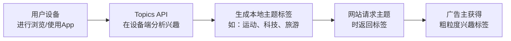
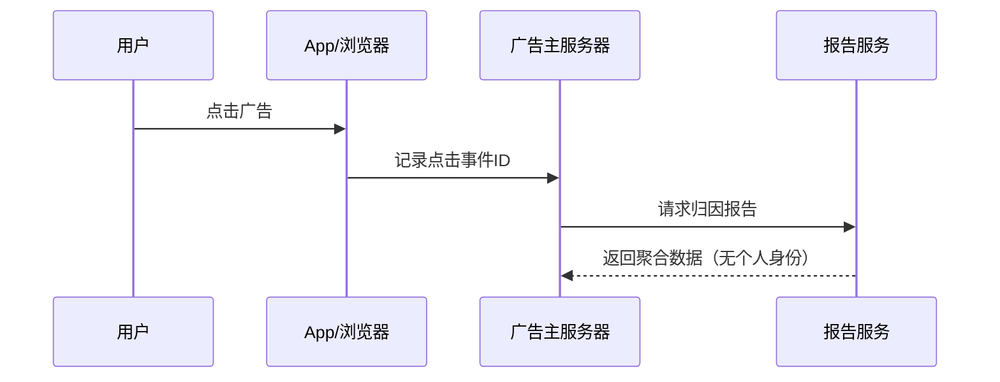

# 21.1.176 隐私沙箱

夜幕像一块柔软的丝绸，轻轻覆盖下来。

洛芙仰躺在野餐垫上，双手枕在脑袋后面。天空从橙红变成深蓝，再变成近乎黑色的深蓝——星星开始一颗一颗地冒出来，像谁在大草原上点燃了无数盏小灯笼。

“好漂亮啊……”洛芙喃喃地说。

希尔正在收拾白板，听到这话抬起头来看了一眼天空，然后又低下去了：“你在说什么梦话呢？星星有什么好看的赶紧把刚才的 Prefab 再整理一下明天还要去 meetup——”

“希尔。”伊莎轻声打断她，“星星确实好看呀。”

黛琳把白板笔一支一支放回笔盒里，动作不紧不慢：“今天就到这里吧，我们也该休息了。明天还要赶路去下一个露营地。”

“等一下！”洛芙一下子坐起来，“刚才说的 Prefab 我还没问完呢！那个如果我想让我的库也支持 Prefab，要怎么——”

“洛芙。”黛琳无奈地笑了笑，“你刚才问过这个问题了。”

“是吗？”洛芙歪着头，“那……那我想问下一个问题！”

“行。”黛琳又把白板笔拿出来了，“你想问什么？”

洛芙眼睛亮晶晶的：“就是我们今天说的这些构建配置……有没有什么跟隐私有关系的？我记得之前听到有人说什么隐私沙箱——”

希尔正在合笔记本的手停住了。

“隐私沙箱？”希尔抬起头，“啊，我想起来了！最近 Android 一直在推的那个 Privacy Sandbox 项目，说是用来保护用户隐私的……怎么，Gradle 也有相关配置？”

“有。”黛琳翻开笔记本新的一页，“Android Gradle Plugin 提供了 PrivacySandbox DSL，专门用来配置隐私沙箱相关的 SDK。”

伊莎托着腮帮子：“隐私沙箱……这个名字听起来像是很厉害的安全装置呢。”

“说是装置也不完全对。”黛琳在白板上写下 "PrivacySandbox" 几个字，“它是 Google 推出的一系列新技术，目的是在保护用户隐私的前提下，仍然能让广告主获得必要的统计数据。简单来说，就是让你的设备在本地处理更多数据，而不是把个人信息上传到服务器。”

洛芙眨了眨眼：“听起来像是在本地安装了一个……安全的小盒子？”

“比喻得挺形象的。”黛琳点头，“Privacy Sandbox 包含好几种 API，比如 Topics API（主题API）、Attribution Reporting API（归因报告API）等等。这些 API 可以在不追踪用户具体行为的情况下，让广告主知道大概的兴趣方向。”

希尔搓了搓手：“这个我听说过！说是要用机器学习在设备端分析用户的兴趣，然后只上报一个‘主题’，而不是完整的浏览历史。对吧？”

“对。”黛琳画了一幅图，“Topics API 会分析设备上的活动，然后给你打上几个标签——比如你对‘运动’、‘科技’、‘旅游’感兴趣。这些标签会保存在本地，只有当你访问支持 Topics 的网站时，浏览器才会把这些标签分享出去。”



（图 1 对应 Topics API 工作流程）

伊莎歪着头：“那……这个和我们在 App 开发里有什么关系呢？”

“问得好。”黛琳点头，“虽然这些 API 最初是为 Chrome 浏览器设计的，但 Google 也在把它们带到 Android 系统上。作为 App 开发者，你可以选择集成这些 Privacy Sandbox SDK，让你的应用也能参与到隐私保护的生态系统中。”

洛芙举手：“那……这些 SDK 怎么配置啊？”

“就是我们现在要说的。”黛琳敲了敲白板，“Android Gradle Plugin 提供了 PrivacySandbox DSL，你可以在 build.gradle 里配置相关的 SDK 依赖和特性开关。”

希尔打开笔记本：“快给我看看代码怎么写！”

“先别急。”黛琳笑着摇头，“首先，你的项目必须满足一些条件才能使用 PrivacySandbox SDK。”

“什么条件？”

“第一，目标 SDK 版本必须在 19 及以上——因为隐私沙箱功能是从 Android 14 开始支持的。第二，你的应用必须签署 Google Play 的 Privacy Sandbox 协议。”

洛芙掰着手指头数：“Android 14……那就是要 API 34 对吧？”

“对。API 34 是 Android 14。”黛琳点头，“满足这些条件后，你就可以在 build.gradle 里配置 PrivacySandbox SDK 了。”

```kotlin
android {
    // 启用 Privacy Sandbox 相关功能
    privacySandbox {
        // 启用 SDK 运行时（必须）
        sdkRuntime = true
        
        // 启用敏感信息处理（可选）
        sensitiveUriProtection = true
    }
}
```

希尔盯着代码：“这个 `sdkRuntime` 是做什么的？”

“SDK 运行时是 Privacy Sandbox 的核心组件。”黛琳解释道，“它允许你的 App 使用那些被‘沙箱化’的 SDK——这些 SDK 在一个隔离的环境中运行，不能直接访问你的个人信息，只能处理脱敏后的数据。”

伊莎举起手：“那……如果我不启用这个会怎样？”

“不启用的话，你就只能使用常规的 Privacy Sandbox API，它们会在系统层面提供基本的隐私保护功能，但不会给你提供那种完全隔离的 SDK 运行环境。”

洛芙似懂非懂地点了点头：“也就是说，启用的话可以获得更安全的隐私保护？”

“对。SDK 运行时相当于给你的 SDK 加了一层‘金钟罩’，让它在执行的时候完全看不到用户的敏感信息。”

希尔眼睛亮了起来：“那这个要在哪里配置依赖呢？”

“在 dependencies 里。”黛琳指向白板的另一边，“Privacy Sandbox SDK 是单独发布的，你需要添加对应的依赖：

```kotlin
dependencies {
    // 核心 Privacy Sandbox SDK 运行时
    implementation("androidx.privacysandbox:ads-adservices:1.0.0-alpha05")
    
    // Topics API
    implementation("androidx.privacysandbox:ads-adservices-topics:1.0.0-alpha05")
    
    // Attribution Reporting API
    implementation("androidx.privacysandbox:ads-adservices-attribution:1.0.0-alpha05")
}
```

洛芙歪着头：“这些依赖……是 Google 官方的吗？”

“对。这些都是 Google 官方发布的 Jetpack 库。”黛琳点头，“它们封装了底层的 Privacy Sandbox API，让你在 Android 上使用更方便。”

伊莎突然想到了什么：“那……这些 API 会不会很复杂啊？我记得之前看到的文档好长好长。”

“直接用原始 API 确实很复杂。”黛琳表示同意，“但用这些封装好的库就简单多了。比如你想用 Topics API，只需要几行代码就可以了。”

```kotlin
// 导入 Topics 相关类
import androidx.privacysandbox.adservices.topics.TopicsManager

// 获取 TopicsManager 实例
val topicsManager = TopicsManager.getOrCreate()

// 异步获取当前用户的主题
topicsManager.getTopics(
    null,  // 使用默认的 topicFilterPackageName
    Executors.newSingleThreadExecutor()
).addOnSuccessListener { topics ->
    // 处理获取到的主题
    for (topic in topics) {
        Log.d("Topics", "Topic: ${topic.taxonomyId}, ${topic.topicId}")
    }
}.addOnFailureListener { e ->
    Log.e("Topics", "Failed to get topics", e)
}
```

希尔看完代码，吹了个口哨：“这个 API 设计得挺简洁的嘛！”

“因为它被封装过了。”黛琳说，“底层的工作很复杂——包括在设备端运行机器学习模型、维护主题数据库、处理请求等等——但这些都对开发者透明了。”

洛芙举手：“我我我——还有个问题！那这个 Topics API 会不会很耗电啊？在后台跑机器学习的话……”

“不会。”黛琳摇头，“Google 设计这个 API 的时候就考虑到了功耗问题。模型只在设备空闲、接通电源的时候才会运行，而且不会频繁更新——通常是一周更新一次。”

伊莎好奇地问：“那 Attribution Reporting API 呢？它是做什么的？”

“这个啊，”黛琳换了一张白板纸，“Attribution Reporting 是用来衡量广告效果的。简单来说，它能告诉你用户的点击和转化之间的关系，但不会暴露用户的具体行为。”



（图 2 对应 Attribution Reporting 工作流程）

“传统的广告追踪会在每个用户的设备上存储一个唯一的 ID，然后把这个 ID 上传给广告主。”黛琳解释道，“但 Privacy Sandbox 的做法不同——它会在本地生成一个随机的事件 ID，只有当转化发生时，这个 ID 才会被用来做匹配，而且匹配是发生在聚合服务器上的，最终广告主只能看到汇总的统计数据。”

洛芙似懂非懂：“也就是说……广告主知道我有很多用户转化了，但不知道具体是哪些用户？”

“对的。这就是‘聚合’的概念——你只能看到整体的转化率、点击率这些数字，而不是单个用户的行踪。”

希尔敲了敲笔记本：“这个设计挺巧妙的。那——在实际项目里，我们应该怎么选择用哪个 API 呢？”

“很简单。”黛琳总结道，“如果你的目标是了解用户的兴趣偏好，用 Topics API。如果你的目标是衡量广告效果，用 Attribution Reporting API。如果你想提供更安全的 SDK 环境给第三方合作伙伴用，那就启用 SDK 运行时。”

湖面上的星星倒影开始变得模糊——起雾了。远处的草丛里传来蟋蟀的低鸣，声音细细碎碎的，像是在唱一首夏夜的摇篮曲。

洛芙打了个哈欠：“听起来好复杂……但又好像挺有用的。”

“刚开始都会觉得复杂。”黛琳把白板收起来，“多用几次就熟练了。而且 Google 还在持续更新这些 API，文档也在不断完善。”

伊莎抬头看着天空：“星星越来越多了呢。”

“别看星星了，看路。”希尔一把拉起洛芙，“回帐篷睡觉了，明天还要早起赶路。”

四个女孩收拾好野餐垫和白板，沿着湖边的小径走向帐篷区。湖水在夜色中轻轻摇晃，倒映着满天繁星，像是把整个银河都装进了水里。

---

> 学习建议：Privacy Sandbox 是 Android 隐私保护的重要方向，建议在实际项目中了解并尝试集成相关的 SDK。如果你的应用涉及广告业务，尤其需要关注 Topics API 和 Attribution Reporting API。启用 SDK 运行时需要签署协议，请在正式使用前仔细阅读 Google 的相关文档和政策。

---

## 洛芙的小小日记本

今天学到了 Privacy Sandbox！原来 Android 花了这么多心思在保护用户隐私上——在设备端分析兴趣、只上报聚合数据、SDK 运行时隔离……感觉比之前的 Prefab 要复杂一些，但仔细想想都是为了用户好呀。明天要再看看官方文档，把示例代码跑一遍！

---

## 今日关键词

- **Privacy Sandbox**：Google 推出的隐私保护技术系列，包括 Topics API、Attribution Reporting API 等
- **PrivacySandbox DSL**：Android Gradle Plugin 提供的 DSL，用于配置隐私沙箱相关 SDK
- **SDK 运行时**：Privacy Sandbox 的核心组件，提供隔离的 SDK 执行环境
- **Topics API**：隐私沙箱 API 之一，用于在设备端分析用户兴趣并生成主题标签
- **Attribution Reporting API**：隐私沙箱 API 之一，用于广告转化归因
- **聚合数据**：经过汇总统计的数据，不包含个人身份信息
- **Jetpack 库**：AndroidX 提供的 Privacy Sandbox 封装库
- **API 34**：Android 14 对应的 API 级别
- **隐私保护**：Privacy Sandbox 的核心设计理念
