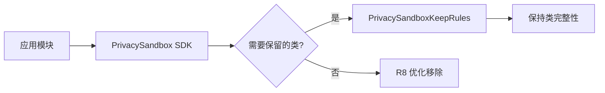
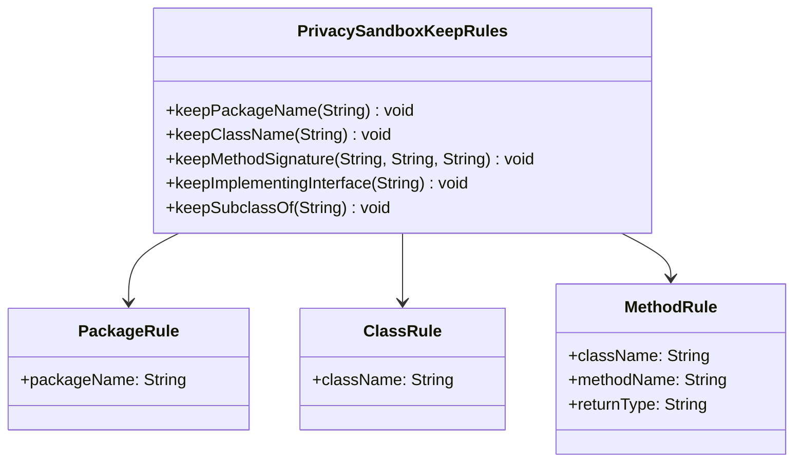
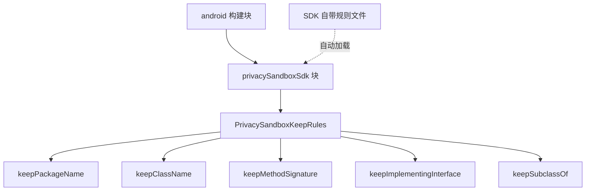

# 21.1.177 PrivacySandboxKeepRules

湖面上的星光像撒了一把碎银，微波粼粼间，又倒映出天上那轮被云半遮的月亮。黛琳把白板笔别回笔帽，转向下一话题。

“刚才我们讲了 Prefab，”她轻轻敲了敲白板边缘，“接下来看看 PrivacySandbox 相关的配置——PrivacySandboxKeepRules。”

洛芙眨了眨眼：“隐私沙箱？是要保护什么隐私呀？”

“说是保护用户隐私其实不太准确，”伊莎捧起热可可杯，热气在夜空中凝成一团薄薄的白雾，“PrivacySandbox 是 Android 用来限制广告追踪的一整套方案。它让广告主没办法直接拿到用户的 IDFA——就是那个设备标识符——而是通过一系列抽象 API 来做人群定向。这样既能让广告业继续运行，又不会把用户的真实身份暴露给第三方。”

希尔补充道：“对开发者来说，PrivacySandbox 引入了一套新的 SDK 体系，我们在应用里集成它的时候，需要在构建阶段配置一些保留规则，防止某些类被 R8 错误地移除掉。”

黛琳点点头，在白板上画了一个简单的流程图。



“这个图对应我们接下来要写的构建配置，”黛琳说，“PrivacySandboxKeepRules 就是用来告诉构建系统‘这些类你要给我留住，别优化没了’的 DSL 对象。”

洛芙好奇地问：“那具体要怎么做呢？”

希尔已经把电脑放在草地上，屏幕的荧光在夜色里特别显眼。她敲了几行代码：

```kotlin
android {
    namespace = "com.example.myapp"
    
    // PrivacySandboxKeepRules 配置示例
    privacySandboxKeepRules {
        // 添加需要保留的规则
        keepPackageName("com.example.mysdk")
        keepClassName("com.example.mysdk.RenderActivity")
        keepMethodSignature("com.example.mysdk.SdkHelper", "getAdId", "java.lang.String")
    }
}
```

“这里我们用了三种常见的保留方式，”希尔指着屏幕解释道，“keepPackageName 保留整个包，keepClassName 保留特定类，keepMethodSignature 保留特定方法——要写完整的类名、方法名和返回值类型。”

伊莎歪着头看：“那……如果我不写这些规则，会怎么样？”

“你的应用在 Release 构建时可能直接崩溃，”黛琳的语气很平静，“PrivacySandbox SDK 里的某些类是被反射调用的，R8 不知道这些调用链，它会觉得‘哦，这个类没被其他地方用到，删掉吧’。结果就是运行时找不到类，一堆 ClassNotFoundException。”

洛芙缩了缩脖子：“好险……那，岂不是每次加新的 SDK 都要手动写一堆保留规则？”

“对，所以 Google 在 DSL 里提供了几种配置方式，”希尔滑动屏幕，又展示了一段代码：

```kotlin
android {
    privacySandboxKeepRules {
        // 方式一：按包名保留
        keepPackageName("com.ads.module")
        
        // 方式二：按完整类名保留
        keepClassName("com.ads.module.AdProvider")
        
        // 方式三：按方法签名保留（保留指定方法及其返回类型）
        keepMethodSignature(
            "com.ads.module.AdProvider",
            "getAdId",
            "java.lang.String"
        )
        
        // 方式四：保留实现特定接口的所有类
        keepImplementingInterface("com.ads.module.AdInterface")
        
        // 方式五：保留继承自特定父类的所有类  
        keepSubclassOf("com.ads.module.BaseAdClass")
    }
}
```

黛琳在白板上补充了一个更完整的图示，展示这些规则之间的关系：



“看起来好像很复杂，”洛芙抓了抓头发，“就不能让系统自动保留所有 PrivacySandbox 相关的类吗？”

希尔“嘿”了一声：“你问到点子上了。其实大部分情况下，PrivacySandbox SDK 本身会自带一个 rules 文件，你只需要在 build.gradle 里引用它就行。”

她切换到另一段代码：

```kotlin
android {
    // 引用 SDK 自带的保留规则文件
    privacySandboxSdk {
        // SDK 的 name 和 version
        sdkName = "ads-sdk"
        sdkVersion = "1.2.3"
        
        // 启用自带的保留规则
        enableKeepRules = true
    }
}
```

“这就是最推荐的姿势，”黛琳说，“不要自己手写一堆规则，先看看你依赖的 PrivacySandbox SDK 有没有自带规则文件。一般在 SDK 的 aar 包里会有一个 `privacy_sandbox_keep_rules.pro` 或者类似的文件，构建系统会自动加载。”

伊莎好奇地问：“那如果 SDK 没带规则文件，或者规则不全怎么办？”

“那就得自己补充了，”希尔答道，“常见的情况是：你的应用代码直接调用了 PrivacySandbox SDK 的某些方法，这些方法在 SDK 的规则文件里没有被列出来——因为 SDK 作者不知道你会怎么用它。这种时候就得自己在 build.gradle 里加额外的 keepRule。”

洛芙举手：“那个……我有个问题。之前我们学 ProGuard 的时候，好像也有类似的 keep 规则对吧？PrivacySandboxKeepRules 跟 ProGuard 的 keep 有什么区别？”

黛琳露出赞许的表情：“问得好。确实，ProGuard/R8 本身就有 `-keep` 系列规则，而 PrivacySandboxKeepRules 是针对 PrivacySandbox 场景的专用 DSL。它们本质上做的是同一件事——防止类被优化掉——但 PrivacySandboxKeepRules 的优势在于：它是类型安全的 DSL 配置，在编译期就能检查你是不是写错了类名。而且它专门为 PrivacySandbox SDK 设计，使用起来更直观。”

“还有一个关键区别，”希尔补充道，“普通的 ProGuard keep 规则是全局的，一旦加了就影响整个应用。而 PrivacySandboxKeepRules 是作用域在 privacySandboxSdk 块内部的，它可以针对不同的 SDK 配置不同的保留规则，更精细。”

洛芙似懂非懂地点点头：“也就是说，如果我有两个不同的 PrivacySandbox SDK，可以分别给它们配不同的保留规则？”

“对，就是这个意思，”黛琳说，“你可以这样写：”

```kotlin
android {
    // 第一个 PrivacySandbox SDK
    privacySandboxSdk {
        sdkName = "ads-sdk"
        sdkVersion = "1.2.3"
        
        // 只保留 ads-sdk 需要的类
        keepPackageName("com.ads.module")
        keepClassName("com.ads.module.AdProvider")
    }
    
    // 第二个 PrivacySandbox SDK
    privacySandboxSdk {
        sdkName = "analytics-sdk" 
        sdkVersion = "2.0.0"
        
        // 保留 analytics-sdk 需要的类（不同的保留规则）
        keepPackageName("com.analytics.module")
        keepMethodSignature(
            "com.analytics.module.Tracker",
            "trackEvent",
            "void"
        )
    }
}
```

伊莎轻轻鼓了鼓掌：“这样每个 SDK 的规则都隔离清晰，确实比混在一起写 ProGuard 文件优雅多了。”

夜风更凉了，洛芙缩了缩脖子，抬头看天。星星比刚才更亮了一些。

“那……如果我们配置错了会怎样？”洛芙问，“比如保留了一个根本不存在的类？”

希尔笑了笑：“DSL 会在编译期报错的。比如你写 `keepClassName("com.example.NotExist")`，Gradle 会告诉你这个类在 SDK 里找不到。所以比手写 ProGuard 配置文件安全多了。”

“我来总结一下今天的重点吧，”黛琳把白板翻到新的一页，画了几个关键词：

- PrivacySandbox SDK 用于替代 IDFA 的广告追踪方案
- PrivacySandboxKeepRules 防止 SDK 的关键类被 R8 优化移除
- 优先使用 SDK 自带的保留规则文件
- 自己配置时用 DSL 方法：keepPackageName / keepClassName / keepMethodSignature 等
- DSL 配置比传统 ProGuard 文件更类型安全、作用域更精细

洛芙把这些要点记在了笔记本上。远处的蛙鸣声又响了起来，此起彼伏的，像是在开一场夏夜演唱会。

“今天的露营编程就到这里啦，”希尔合上电脑，伸了个懒腰，“明天我们再看看还有什么 DSL 可以玩。”

伊莎轻轻打了个哈欠：“星星真好看啊。”

洛芙没有说话，只是抬头看着天。湖面上倒映的星光，也跟着水面轻轻晃动。她忽然觉得，学会这些配置也不那么可怕了——只要找对方法，一步步来就好。

---

## 专业技术总结

> **PrivacySandboxKeepRules** — Android Gradle Plugin 提供的 DSL 对象，用于配置 PrivacySandbox SDK 的类保留规则，防止 R8/ProGuard 优化时错误移除被反射调用的关键类。

### 结构图



### 核心机制

- **keepPackageName(String)**：保留指定包名下的所有类
- **keepClassName(String)**：保留指定完整类名的类
- **keepMethodSignature(String, String, String)**：保留指定类的特定方法（类名、方法名、返回值类型）
- **keepImplementingInterface(String)**：保留实现指定接口的所有类
- **keepSubclassOf(String)**：保留继承自指定父类的所有类

### 复杂度与影响

- 使用 PrivacySandboxKeepRules DSL 可获得编译期类型检查，降低运行时 ClassNotFoundException 风险
- 每个 privacySandboxSdk 块可独立配置规则，支持多 SDK 场景
- 相比传统 ProGuard 文件，DSL 更简洁且易于维护

### 反模式与陷阱

1. **不配置保留规则**：Release 构建时 SDK 类被 R8 优化移除 → 运行时崩溃
2. **过度保留**：保留过多不必要的类 → APK 体积增大、影响混淆效果
3. **遗漏应用层调用**：SDK 自带规则不包含应用代码的直接调用 → 同样会导致运行时找不到类

### 设计哲学

- **类型安全优先**：DSL 在编译期检查类名、方法签名是否存在
- **作用域隔离**：每个 SDK 可独立配置保留规则，避免全局污染
- **优先使用自带规则**：SDK 作者提供的规则文件通常已覆盖核心场景

### 🏕️ 动手练习

#### 目标

掌握 PrivacySandboxKeepRules DSL 的配置方法，能够正确配置 PrivacySandbox SDK 的保留规则。

#### 任务

**Task 1: 基础配置**

1. 创建一个新的 Android 项目（或使用现有项目）
2. 在 app 的 build.gradle.kts 中添加 privacySandboxSdk 配置块
3. 使用 keepPackageName 保留一个示例包名
4. 执行 assembleDebug 观察构建日志

**Task 2: 方法级保留**

1. 在上一步基础上添加 keepMethodSignature
2. 指定完整的类名、方法名和返回值类型
3. 验证构建是否成功

**Task 3: 多 SDK 隔离**

1. 添加第二个 privacySandboxSdk 块，使用不同 sdkName
2. 为每个 SDK 配置不同的保留规则
3. 观察生成的 mapping.txt 确认规则生效

**验收标准**

- [ ] 能够在 build.gradle.kts 中正确配置 privacySandboxSdk 块
- [ ] 理解 keepPackageName、keepClassName、keepMethodSignature 的区别
- [ ] 能够为多个 SDK 分别配置独立的保留规则

**提示代码**

```kotlin
android {
    privacySandboxSdk {
        sdkName = "my-ads-sdk"
        sdkVersion = "1.0.0"
        keepPackageName("com.example.ads")
    }
}
```

#### 面试热身

1. 为什么 PrivacySandbox SDK 需要配置保留规则？
2. PrivacySandboxKeepRules 和传统 ProGuard -keep 规则有什么区别？
3. 如果 SDK 自带规则文件和应用代码直接调用冲突，应该怎么处理？
4. 描述一下 R8 优化移除类的决策逻辑。
5. 什么情况下会导致运行时 ClassNotFoundException？

### 参考实现要点

1. 优先使用 SDK 自带的规则文件（通常在 aar 包的 assets 目录下）
2. 仅在 SDK 规则覆盖不全时补充 DSL 配置
3. 保留规则应最小化，避免影响 R8 的混淆效果
4. 使用 keepMethodSignature 时确保返回类型完整（包名+类名）
5. 多 SDK 场景下为每个 privacySandboxSdk 块配置独立的规则集

> 学习建议：PrivacySandboxKeepRules 是 Android 构建配置中的高级功能，建议在实际项目中遇到 PrivacySandbox SDK 集成时再深入研究。核心思路是“先看 SDK 自带规则，再按需补充 DSL 配置”。

## 洛芙的小小日记本

今天学会了怎么配置 PrivacySandbox 的保留规则！黛琳说如果不用 DSL 写清楚要保留哪些类，R8 就会把它们优化掉，然后应用就会崩。听起来好可怕，但是希尔说优先用 SDK 自带的规则文件就行，不用自己写很多。明天还要继续学 DSL，期待～

## 今日关键词

- **PrivacySandbox**：Android 用于限制广告追踪的隐私保护方案，通过抽象 API 替代 IDFA
- **PrivacySandboxKeepRules**：Gradle DSL 对象，用于配置 PrivacySandbox SDK 的类保留规则
- **R8**：Android 的代码混淆和压缩工具，会移除未被引用的类
- **ProGuard**：R8 的前身，提供代码混淆、优化和压缩功能
- **keepPackageName**：DSL 方法，保留指定包名下的所有类
- **keepClassName**：DSL 方法，保留指定完整类名的类
- **keepMethodSignature**：DSL 方法，保留指定类的特定方法（含返回值类型）
- **keepImplementingInterface**：DSL 方法，保留实现指定接口的所有类
- **keepSubclassOf**：DSL 方法，保留继承自指定父类的所有类
- **privacySandboxSdk**：Android Gradle Plugin 的 DSL 块，用于配置 PrivacySandbox SDK
- **SDK 自带规则文件**：PrivacySandbox SDK 包中附带的 ProGuard 规则，通常在 assets 目录
- **类型安全 DSL**：在编译期检查配置正确性的 DSL，相比手写配置文件更安全
