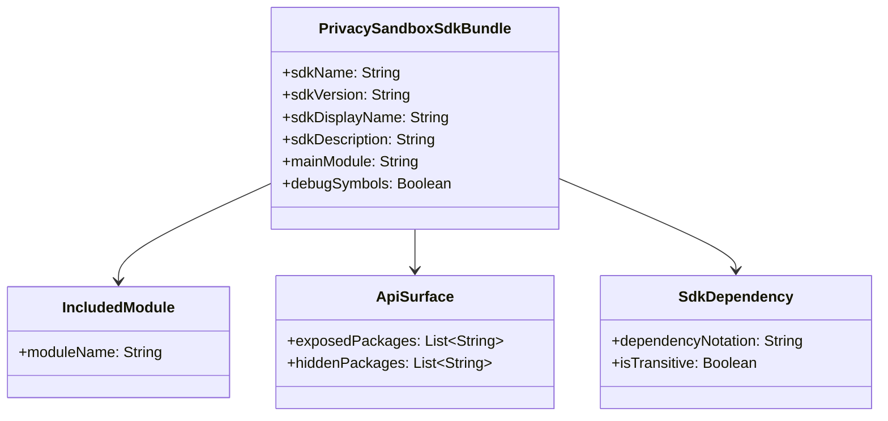
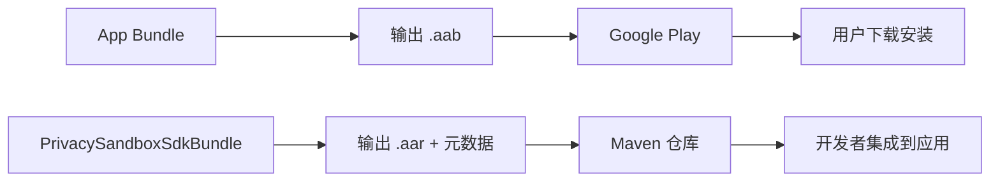
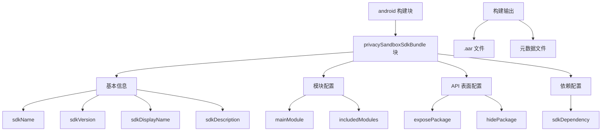

# 21.1.178 PrivacySandboxSdkBundle

湖面上的星光像撒了一把碎银，微波粼粼间，又倒映出天上那轮被云半遮的月亮。黛琳把白板笔别回笔帽，转向下一话题。

“刚才我们讲了 PrivacySandboxKeepRules，”她轻轻敲了敲白板边缘，“接下来看看怎么把这些 PrivacySandbox SDK 打包成一个可发布的 bundle——这就是 PrivacySandboxSdkBundle 的作用。”

洛芙眨了眨眼：“bundle？我们之前是不是学过什么 bundle？”

“你说的是 App Bundle 吧？”希尔从草地上捡起一块小石子，在手里抛了抛，“那个是给应用发布的。我们现在说的 PrivacySandboxSdkBundle 是给 SDK 用的，本质上都是把一堆东西打包，但目的不一样——App Bundle 是为了让用户下载的应用更小，PrivacySandboxSdkBundle 是为了让其他开发者能方便地集成你的 PrivacySandbox SDK。”

伊莎轻轻理了理被风吹乱的发丝：“也就是说，我们可以把自己写的 PrivacySandbox 功能，打包成一个 SDK 给别人用？”

“对，”黛琳点点头，在白板上画了一个简单的流程图，“PrivacySandboxSdkBundle 就是用来定义这个 SDK 长什么样子的——它叫什么名字、是什么版本、包含哪些模块、依赖什么别的 SDK。”

洛芙好奇地问：“那……具体要怎么做呢？”

希尔已经把电脑放在草地上，屏幕的荧光在夜色里特别显眼。她敲了几行代码：

```kotlin
android {
    namespace = "com.example.myapp"
    
    // PrivacySandboxSdkBundle 配置示例
    privacySandboxSdkBundle {
        // SDK 名称
        sdkName = "my-privacy-sdk"
        
        // SDK 版本
        sdkVersion = "1.0.0"
        
        // SDK 显示名称（给开发者看的）
        sdkDisplayName = "My Privacy SDK"
        
        // SDK 描述
        sdkDescription = "A privacy-focused SDK for ad measurement"
        
        // 主模块
        mainModule = ":mymodule"
        
        // 依赖的其他 SDK
        sdkDependency("com.other:other-sdk:1.0.0")
        
        // 启用调试符号
        debugSymbols = true
    }
}
```

“这里我们定义了 SDK 的基本信息，”希尔指着屏幕解释道，“sdkName 是给构建系统用的唯一标识，sdkDisplayName 是给人类看的名字，sdkVersion 要遵循语义化版本规范。”

伊莎歪着头看：“那……如果我不写 mainModule，会怎么样？”

“你的 SDK 就没有入口，”黛琳的语气很平静，“PrivacySandboxSdkBundle 必须指定一个主模块，这个模块包含了 SDK 的核心 API。其他的模块可以是被主模块依赖的库，但总得有一个入口点。”

洛芙缩了缩脖子：“好险……那，岂不是每次都要手动指定主模块？”

“对，但这是必须的，”希尔滑动屏幕，又展示了一段代码，“而且主模块必须是一个 Android Library 模块，不能是 Application 模块。”

她切换到另一段代码：

```kotlin
android {
    // 主模块配置
    privacySandboxSdkBundle {
        sdkName = "ads-measurement-sdk"
        sdkVersion = "1.2.3"
        sdkDisplayName = "Ad Measurement SDK"
        
        // 指定主模块（必须是一个 library 模块）
        mainModule = ":ads-core"
        
        // 配置 SDK 包含的额外模块
        includedModules(":ads-api", ":ads-utils")
        
        // 配置 SDK 的 API 表面（暴露给使用者的 API）
        apiSurface(":ads-api") {
            // 暴露特定的包
            exposePackage("com.ads.measurement")
            
            // 隐藏内部的实现包
            hidePackage("com.ads.measurement.internal")
        }
        
        // 配置 SDK 的依赖（传递性）
        sdkDependency("com.google.android.gms:play-services-basement:18.0.0")
    }
}
```

黛琳在白板上补充了一个更完整的图示，展示这些配置项之间的关系：



“看起来好像很复杂，”洛芙抓了抓头发，“就不能让系统自动把所有模块都包含进去吗？”

希尔“嘿”了一声：“你问到点子上了。其实默认情况下，主模块的依赖都会被自动包含进去。但问题是，有些内部模块你不希望暴露给使用你 SDK 的开发者——这就需要用 apiSurface 来控制。”

“什么是 apiSurface？”洛芙问。

“就是 API 表面，”黛琳解释道，“你可以理解为 SDK 对外开放的‘门面’。默认情况下，你的 SDK 包含的所有 public 类都会被暴露出去。但有时候你有一些内部实现类不希望被外部调用——这时候就可以用 exposePackage 明确指定要暴露的包，用 hidePackage 指定要隐藏的包。”

伊莎好奇地问：“那……如果我不配置 apiSurface，会怎么样？”

“那所有 public 类都会被暴露出去，”希尔答道，“这可能会导致几个问题：第一，暴露了不必要的 API会增加使用者的认知负担；第二，内部实现类被暴露后，你以后想修改实现就可能会破坏使用者的代码；第三，可能会泄露一些不应该公开的实现细节。”

洛芙举手：“那个……我有个问题。之前我们学 App Bundle 的时候，是不是也有类似的配置？PrivacySandboxSdkBundle 跟 App Bundle 有什么区别？”

黛琳露出赞许的表情：“问得好。确实，它们都叫 Bundle，但用途完全不同。App Bundle 是给最终用户下载应用用的，它的目的是让 Google Play 只分发用户设备需要的资源，从而减小下载体积。而 PrivacySandboxSdkBundle 是给 SDK 开发者打包 SDK 用的，它的目的 是让其他开发者能方便地集成你的 PrivacySandbox 功能。”

“还有一个关键区别，”希尔补充道，“App Bundle 的输出是一个 .aab 文件，用于发布到应用商店。而 PrivacySandboxSdkBundle 的输出是一个 .aar 文件和对应的元数据，你可以上传到 Maven 仓库供别人依赖。”

洛芙似懂非懂地点点头：“也就是说，一个是给用户用的，一个是给开发者用的？”

“对，就是这个意思，”黛琳说，“你可以这样理解：”



伊莎轻轻鼓了鼓掌：“这样一画就清楚多了。”

夜风更凉了，洛芙缩了缩脖子，抬头看天。星星比刚才更亮了一些。

“那……如果我们配置错了会怎样？”洛芙问，“比如指定了一个不存在的模块？”

希尔笑了笑：“DSL 会在编译期报错的。比如你写 `mainModule = ":not-exist"`，Gradle 会告诉你这个模块在项目里找不到。所以比手写配置文件安全多了。”

“我来总结一下今天的重点吧，”黛琳把白板翻到新的一页，画了几个关键词：

- PrivacySandboxSdkBundle 用于打包 PrivacySandbox SDK
- 必须指定 mainModule 作为 SDK 入口
- apiSurface 控制暴露给开发者的 API
- sdkDependency 配置 SDK 的依赖
- 输出是 .aar 文件供其他开发者集成

洛芙把这些要点记在了笔记本上。远处的蛙鸣声又响了起来，此起彼伏的，像是在开一场夏夜演唱会。

“今天的露营编程就到这里啦，”希尔合上电脑，伸了个懒腰，“明天我们再看看还有什么 DSL 可以玩。”

伊莎轻轻打了个哈欠：“星星真好看啊。”

洛芙没有说话，只是抬头看着天。湖面上倒映的星光，也跟着水面轻轻晃动。她忽然觉得，学会这些配置也不那么可怕了——只要找对方法，一步步来就好。

---

## 专业技术总结

> **PrivacySandboxSdkBundle** — Android Gradle Plugin 提供的 DSL 对象，用于配置 PrivacySandbox SDK 的打包和发布参数。它定义了 SDK 的名称、版本、包含的模块、API 表面和依赖关系，最终输出一个可分发的 .aar 文件。

### 结构图



### 核心机制

- **sdkName**：SDK 的唯一标识符，必须遵循 Maven 坐标规范
- **sdkVersion**：SDK 版本，使用语义化版本（semver）
- **sdkDisplayName**：SDK 的显示名称，供开发者在 IDE 中查看
- **mainModule**：主模块名称（必须是一个 Android Library 模块）
- **includedModules**：额外包含的模块列表
- **apiSurface**：配置暴露或隐藏的包
- **sdkDependency**：配置 SDK 的依赖（可传递）

### 复杂度与影响

- 使用 PrivacySandboxSdkBundle DSL 可获得编译期类型检查，降低配置错误风险
- apiSurface 配置影响 SDK 的公共 API 表面，合理的暴露/隐藏策略可降低使用者迁移成本
- sdkDependency 配置影响 SDK 的传递依赖，合理的依赖管理可避免依赖冲突

### 反模式与陷阱

1. **不指定 mainModule**：构建失败，SDK 没有入口点
2. **暴露所有 public 类**：增加使用者认知负担，可能泄露内部实现
3. **过度依赖传递**：导致使用者项目依赖膨胀，应使用 `transitive = false`

### 设计哲学

- **模块化优先**：将 SDK 拆分为多个模块，主模块提供入口，子模块承载功能
- **API 表面控制**：明确暴露的 API，避免泄露内部实现
- **依赖最小化**：仅声明必要的依赖，避免引入不必要的传递依赖
- **版本语义化**：使用语义化版本规范，便于依赖管理

### 🏕️ 动手练习

#### 目标

掌握 PrivacySandboxSdkBundle DSL 的配置方法，能够正确打包和发布 PrivacySandbox SDK。

#### 任务

**Task 1: 基础配置**

1. 创建一个新的 Android Library 模块（或使用现有项目）
2. 在 app 的 build.gradle.kts 中添加 privacySandboxSdkBundle 配置块
3. 配置 sdkName、sdkVersion、sdkDisplayName
4. 指定 mainModule 为你的 library 模块
5. 执行 assembleDebug 观察构建日志

**Task 2: 模块配置**

1. 在项目中创建两个以上的 library 模块
2. 使用 includedModules 添加额外模块
3. 在主模块中添加对其他模块的依赖
4. 验证构建产物包含所有模块

**Task 3: API 表面配置**

1. 在主模块中创建两个包：一个 public 包，一个 internal 包
2. 使用 apiSurface 暴露 public 包，隐藏 internal 包
3. 构建 SDK 并验证生成的 API 文档

**验收标准**

- [ ] 能够在 build.gradle.kts 中正确配置 privacySandboxSdkBundle 块
- [ ] 理解 mainModule、includedModules、apiSurface 的区别
- [ ] 能够控制 SDK 暴露给开发者的 API 表面
- [ ] 构建产物为可分发的 .aar 文件

**提示代码**

```kotlin
android {
    privacySandboxSdkBundle {
        sdkName = "my-privacy-sdk"
        sdkVersion = "1.0.0"
        sdkDisplayName = "My Privacy SDK"
        mainModule = ":mylibrary"
        
        apiSurface(":mylibrary") {
            exposePackage("com.example.mylibrary")
            hidePackage("com.example.mylibrary.internal")
        }
    }
}
```

#### 面试热身

1. 为什么 PrivacySandbox SDK 需要使用 PrivacySandboxSdkBundle 打包？
2. mainModule 和 includedModules 有什么区别？
3. apiSurface 的作用是什么？为什么需要控制 API 暴露？
4. PrivacySandboxSdkBundle 和 App Bundle 有什么区别？
5. 如何避免 SDK 的依赖传递导致使用者项目依赖膨胀？

### 参考实现要点

1. 主模块必须是一个 Android Library 模块，不能是 Application 模块
2. apiSurface 配置应在 SDK 发布前仔细设计，避免破坏性变更
3. 使用语义化版本（semver）管理 SDK 版本
4. sdkDependency 可设置 `transitive = false` 避免不必要的依赖传递
5. 构建产物包含 .aar 文件和对应的元数据文件，可上传到 Maven 仓库

> 学习建议：PrivacySandboxSdkBundle 是 Android SDK 开发中的高级功能，建议在需要将 PrivacySandbox 功能打包成可分发 SDK 时再深入研究。核心思路是“先设计 API 表面，再配置模块和依赖，最后打包发布”。

## 洛芙的小小日记本

今天学会了怎么打包 PrivacySandbox SDK！黛琳说一定要指定 mainModule，不然 SDK 就没有入口。还学了 apiSurface 可以控制暴露哪些包给开发者，不能把内部实现也暴露出去，不然以后想改就麻烦了。希尔说明天还有更多 DSL 要学，期待～

## 今日关键词

- **PrivacySandboxSdkBundle**：Android Gradle Plugin DSL 对象，用于配置 PrivacySandbox SDK 的打包和发布
- **sdkName**：PrivacySandboxSdkBundle 的属性，定义 SDK 的唯一标识符
- **sdkVersion**：PrivacySandboxSdkBundle 的属性，定义 SDK 的版本号
- **sdkDisplayName**：PrivacySandboxSdkBundle 的属性，定义 SDK 的显示名称
- **mainModule**：PrivacySandboxSdkBundle 的属性，定义 SDK 的主模块（入口）
- **includedModules**：PrivacySandboxSdkBundle 的属性，定义额外包含的模块
- **apiSurface**：PrivacySandboxSdkBundle 的子配置块，控制 API 的暴露和隐藏
- **exposePackage**：apiSurface 方法，指定要暴露的包
- **hidePackage**：apiSurface 方法，指定要隐藏的包
- **sdkDependency**：PrivacySandboxSdkBundle 的方法，添加 SDK 的依赖
- **.aar 文件**：Android Archive，Android 库的二进制分发格式
- **语义化版本**：遵循 semver 规范的版本号，如 "1.0.0"
- **传递依赖**：Maven/Gradle 中自动传递的依赖，可通过 transitive 配置控制
