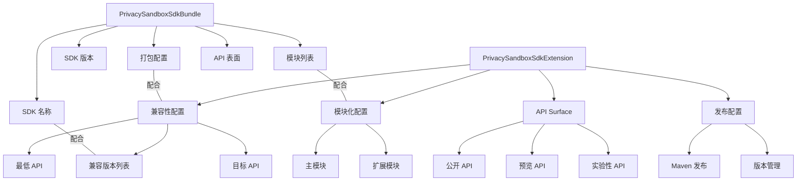
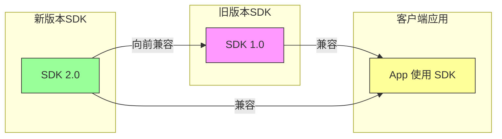
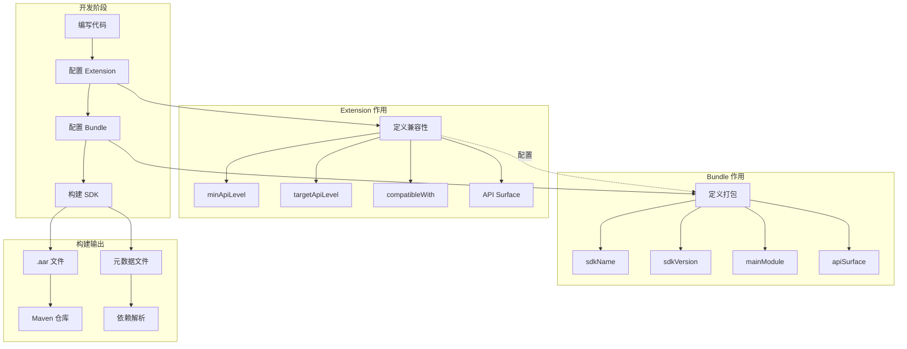

# 21.1.179 PrivacySandboxSdkExtension

湖面上的星光像撒了一把碎银，微波粼粼间，又倒映出天上那轮被云半遮的月亮。黛琳把白板笔别回笔帽，却没有像往常一样结束今天的露营编程。

“其实刚才我们说的 PrivacySandboxSdkBundle，只是打包的环节，”她顿了顿，重新拿起笔，“如果你的 SDK 需要被不同版本的 Android 系统兼容，或者需要支持不同的 API 级别，那就需要了解另一个 DSL 对象——PrivacySandboxSdkExtension。”

洛芙刚收拾好笔记本，听到这话又停住了手：“Extension？又是扩展？那它和刚才学的 Bundle 有什么关系？”

希尔从草地上爬起来，拍了拍裤子上的草屑：“好问题！简单来说，Bundle 是用来打包的，Extension 是用来配置的。打个比方——Bundle 像是把你的 SDK 装进一个盒子里，Extension 则是告诉这个盒子要怎么运输、需要什么样的保护措施。”

伊莎轻轻理了理被风吹乱的发丝，笑着补充：“就像是旅行前的行李打包和托运规则的差别，对吧？”

“对，就是这个意思，”黛琳在白板上画了一个新的结构图，“PrivacySandboxSdkExtension 用来配置 SDK 的扩展属性，比如它兼容哪个版本的 Android、需要什么样的 API 级别支持、以及如何处理不同版本的差异。”

洛芙凑近白板，好奇地问：“那……具体能配置哪些东西呢？”

希尔把电脑转过来，屏幕的荧光在夜色里显得格外清晰。她敲了几行代码：

```kotlin
android {
    namespace = "com.example.myapp"
    
    // PrivacySandboxSdkExtension 配置示例
    privacySandboxSdkExtension {
        // 最低 API 级别
        minApiLevel = 21
        
        // 目标 API 级别
        targetApiLevel = 34
        
        // 兼容的 SDK 版本列表
        compatibleSdkVersions = listOf("1.0", "1.1", "2.0")
        
        // 是否启用预览功能
        enablePreview = false
        
        // SDK 扩展类型
        extensionType = ExtensionType.PRIVACY_SANDBOX
        
        // 自定义配置
        additionalConfig("customKey", "customValue")
    }
}
```

“这里我们配置了 SDK 的兼容性参数，”希尔指着屏幕解释道，“minApiLevel 决定了 SDK 能在多老的 Android 版本上运行，targetApiLevel 决定了 SDK 主要为哪个版本优化，compatibleSdkVersions 则列出了 SDK 兼容的所有 SDK 版本。”

黛琳补充道：“你们注意到没有？PrivacySandboxSdkExtension 和 PrivacySandboxSdkBundle 通常是配合使用的。Bundle 负责打包，Extension 负责配置它们之间的兼容关系。”

洛芙似懂非懂地点点头：“那……如果我不配置 Extension，会怎样？”

“那就使用默认值，”希尔滑动屏幕，展示了一段新的代码，“默认情况下，minApiLevel 会从主模块的 minSdkVersion 继承，targetApiLevel 会从主模块的 targetSdkVersion 继承。”

她展示了更完整的配置示例：

```kotlin
android {
    // 完整的 PrivacySandboxSdkExtension 配置
    privacySandboxSdkExtension {
        // 基础配置
        minApiLevel = 21
        targetApiLevel = 34
        
        // API 表面配置
        apiSurface {
            // 公开的 API 级别
            publicApiLevel = 34
            
            // 预览 API 级别
            previewApiLevel = 35
            
            // 实验性 API 级别
            experimentalApiLevel = 36
        }
        
        // 兼容性配置
        compatibility {
            // 是否自动处理版本差异
            autoVersionHandling = true
            
            // 版本降级策略
            versionDowngradeStrategy = VersionDowngradeStrategy.FAIL
            
            // 最低兼容版本检查
            enforceMinVersion = true
        }
        
        // 模块化配置
        modules {
            // 主模块
            mainModule = ":core"
            
            // 扩展模块
            extensionModule(":compat", "compatibility")
            extensionModule(":utils", "utility")
        }
        
        // 发布配置
        publishing {
            // 是否发布到 Maven
            publishToMaven = true
            
            // Maven 组 ID
            mavenGroupId = "com.example"
            
            // 工件 ID
            mavenArtifactId = "privacy-sdk"
            
            // 版本
            mavenVersion = "1.0.0"
        }
    }
}
```

黛琳在白板上补充了一个完整的图示，展示 Extension 和 Bundle 的配合关系：



洛芙看着图，若有所思：“所以 Extension 其实是在描述 SDK 的‘能力’，而 Bundle 是把这些能力‘打包’起来？”

“说得好！”希尔打了个响指，“你理解得很准确。Extension 描述的是 SDK 能在什么样的环境下工作，Bundle 描述的是把哪些代码装进去。”

伊莎轻轻问：“那……如果我有两个不同版本的 SDK，它们都需要互相兼容，应该怎么配置？”

黛琳点点头：“问到了关键点。这正是 PrivacySandboxSdkExtension 最重要的用途之一——处理多版本兼容性。”

她在白板上画了一个更复杂的图：



“当你的 SDK 有多个版本时，你需要确保使用旧版本的 App 也能正常工作，同时新版本又能提供更多的功能，”黛琳解释道，“这就要用到 compatibleSdkVersions 配置。”

希尔补充了一段代码示例：

```kotlin
android {
    privacySandboxSdkExtension {
        // 旧版本 SDK 的配置
        version("1.0") {
            minApiLevel = 21
            targetApiLevel = 30
            compatibleWith = listOf("1.0")
        }
        
        // 新版本 SDK 的配置
        version("2.0") {
            minApiLevel = 24
            targetApiLevel = 34
            compatibleWith = listOf("1.0", "1.1", "2.0")
            
            // 新版本增加的功能
            additionalFeatures {
                enableFeature("new_privacy_api")
                enableFeature("improved_reporting")
            }
        }
    }
}
```

洛芙好奇地问：“compatibleWith 是做什么的？”

“它定义了当前版本兼容哪些旧版本，”黛琳解释道，“比如 SDK 2.0 声明 compatibleWith = ['1.0', '1.1']，就意味着使用 1.0 或 1.1 版本 SDK 的应用可以无缝升级到 2.0，不需要修改任何代码。”

伊莎歪着头：“那如果我不小心破坏兼容性了呢？比如删掉了一个 API？”

希尔笑了笑：“这就需要用到版本降级策略。来看这段配置——”

```kotlin
android {
    privacySandboxSdkExtension {
        compatibility {
            // 版本降级时的策略
            // FAIL: 降级时直接报错
            // WARN: 降级时发出警告但继续构建
            // ALLOW: 允许降级
            versionDowngradeStrategy = VersionDowngradeStrategy.FAIL
            
            // 是否强制检查最低版本
            enforceMinVersion = true
            
            // 兼容性检查报告级别
            reportLevel = CompatibilityReportLevel.DETAILED
        }
    }
}

enum class VersionDowngradeStrategy {
    FAIL,    // 降级时失败
    WARN,    // 降级时警告
    ALLOW    // 允许降级
}

enum class CompatibilityReportLevel {
    NONE,      // 不生成报告
    SUMMARY,   // 简要报告
    DETAILED   // 详细报告
}
```

“原来如此！”洛芙恍然大悟，“这样就能防止不小心破坏向后兼容性的问题了。”

黛琳点点头：“而且 PrivacySandboxSdkExtension 还支持更细粒度的 API 级别控制。我们来看——”

她指向另一段代码：

```kotlin
android {
    privacySandboxSdkExtension {
        // API Surface 层级配置
        apiSurface {
            // 公开 API（稳定版）
            publicApiLevel = 34
            publicApis = listOf(
                "com.example.sdk.PublicClass",
                "com.example.sdk.StableApi"
            )
            
            // 预览 API（Beta 版）
            previewApiLevel = 35
            previewApis = listOf(
                "com.example.sdk.PreviewClass",
                "com.example.sdk.BetaApi"
            )
            
            // 实验性 API（Alpha 版）
            experimentalApiLevel = 36
            experimentalApis = listOf(
                "com.example.sdk.ExperimentalClass",
                "com.example.sdk.DevApi"
            )
            
            // API 弃用策略
            deprecation {
                // 是否允许使用已弃用的 API
                allowDeprecated = true
                
                // 弃用警告级别
                warningLevel = DeprecationWarningLevel.WARN
                
                // 是否在文档中标记弃用
                documentDeprecations = true
            }
        }
    }
}

enum class DeprecationWarningLevel {
    NONE,    // 不警告
    WARN,    // 警告
    ERROR    // 报错
}
```

伊莎轻轻鼓了鼓掌：“这样就能很清楚地看到哪些 API 是稳定的、哪些是预览的、哪些是实验性的了。”

“对，”黛琳说，“这对于 SDK 开发者来说非常重要。你不希望用户依赖你的实验性 API，否则你以后想修改就会破坏他们的代码。”

洛芙举手提问：“那……如果我们想把 SDK 分发给不同的开发者，又要怎么处理？”

“这就涉及到发布配置了，”希尔把屏幕往左移动，展示了一段新的代码，“PrivacySandboxSdkExtension 可以和 Maven 发布配置结合——”

```kotlin
android {
    privacySandboxSdkExtension {
        // 发布配置
        publishing {
            // 是否发布到 Maven 仓库
            publishToMaven = true
            
            // Maven 坐标
            mavenGroupId = "com.example.privacy"
            mavenArtifactId = "privacy-sdk"
            mavenVersion = "2.0.0"
            
            // POM 配置
            pom {
                name = "Privacy SDK"
                description = "A privacy-focused SDK for Android"
                url = "https://github.com/example/privacy-sdk"
                
                // 许可证
                license {
                    name = "Apache 2.0"
                    url = "https://www.apache.org/licenses/LICENSE-2.0"
                }
                
                // 开发者信息
                developer {
                    id = "example-dev"
                    name = "Example Developer"
                    email = "dev@example.com"
                }
                
                // SCM 信息
                scm {
                    connection = "scm:git:https://github.com/example/privacy-sdk.git"
                    developerConnection = "scm:git:https://github.com/example/privacy-sdk.git"
                    url = "https://github.com/example/privacy-sdk"
                }
            }
            
            // 发布变体
            publishVariants = listOf("release")
            
            // 是否包含源码
            includeSources = true
            
            // 是否包含 javadoc
            includeJavadoc = true
        }
    }
}
```

洛芙看着这一长串配置，眼睛有点花：“这么多配置……都要手动写吗？”

“不需要一次性写完，”希尔笑了笑，“你可以从简单的开始，逐步添加。Gradle DSL 的好处是，配置项都有默认值，你可以只覆盖需要改变的部分。”

黛琳补充了一个最小配置示例：

```kotlin
android {
    // 最小配置——只需要最基本的信息
    privacySandboxSdkExtension {
        // 从主模块继承的默认值
        // minApiLevel = minSdkVersion (默认)
        // targetApiLevel = targetSdkVersion (默认)
        
        // 最少需要配置的
        extensionType = ExtensionType.PRIVACY_SANDBOX
    }
}
```

夜风更凉了，洛芙缩了缩脖子，抬头看天。星星比刚才更亮了一些，月亮也完全从云里钻了出来，在湖面上撒下一片银光。

“那……如果我们既有 Bundle 又有 Extension，它们是怎么配合工作的？”洛芙问。

黛琳画了一个最终的关系图：



“简单来说，”黛琳总结道，“Extension 说的是‘这个 SDK 能在什么环境下工作’，Bundle 说的是‘这个 SDK 包含哪些代码’。它们一起定义了一个完整的 SDK。”

伊莎轻轻打了个哈欠：“今天的露营编程信息量好大啊。”

“确实，”希尔合上电脑，伸了个懒腰，“我们今天学了两个重要的 DSL 对象：PrivacySandboxSdkBundle 负责打包，PrivacySandboxSdkExtension 负责配置。掌握这两个，你就能很好地管理 PrivacySandbox SDK 的开发流程了。”

洛芙把这些要点记在了笔记本上：

- PrivacySandboxSdkExtension 用于配置 SDK 的扩展属性
- minApiLevel 和 targetApiLevel 定义兼容性范围
- compatibleSdkVersions 定义多版本兼容性
- apiSurface 定义 API 层级（稳定/预览/实验性）
- publishing 配置 Maven 发布参数
- Extension 和 Bundle 配合使用

远处的蛙鸣声又响了起来，此起彼伏的，像是在开一场夏夜演唱会。湖面上的星光依旧闪烁，像是也在认真听她们讲课。

“今天的露营编程就到这里啦，”黛琳收拾好白板，“明天我们再看看还有什么 DSL 可以探索。”

伊莎轻轻理了理被风吹乱的发丝，笑着说：“星光真美啊。”

洛芙没有说话，只是抬头看着天。湖面上倒映的星光，也跟着水面轻轻晃动。她忽然觉得，这些复杂的配置也不是那么可怕——只要理解了背后的逻辑，一步步来就好。

---

## 专业技术总结

> **PrivacySandboxSdkExtension** — Android Gradle Plugin 提供的 DSL 对象，用于配置 PrivacySandbox SDK 的扩展属性和兼容性参数。它定义了 SDK 兼容的 Android 版本范围、API 表面层级、模块依赖和发布配置，与 PrivacySandboxSdkBundle 配合使用来完整定义一个 PrivacySandbox SDK。

### 结构图

```mermaid
flowchart TB
    A[PrivacySandboxSdkExtension] --> B[基础配置]
    B --> B1[minApiLevel]
    B --> B2[targetApiLevel]
    B --> B3[compatibleSdkVersions]
    B --> B4[extensionType]
    
    A --> C[API Surface 配置]
    C --> C1[publicApiLevel]
    C --> C2[previewApiLevel]
    C --> C3[experimentalApiLevel]
    C --> C4[deprecation]
    
    A --> D[兼容性配置]
    D --> D1[autoVersionHandling]
    D --> D2[versionDowngradeStrategy]
    D --> D3[enforceMinVersion]
    D --> D4[reportLevel]
    
    A --> E[模块化配置]
    E --> E1[mainModule]
    E --> E2[extensionModule]
    
    A --> F[发布配置]
    F --> F1[publishToMaven]
    F --> F2[mavenGroupId]
    F --> F3[mavenArtifactId]
    F --> F4[mavenVersion]
    F --> F5[pom]
    
    G[构建输出] --> H[.aar + 元数据]
```



### 核心机制

- **minApiLevel**：SDK 支持的最低 Android API 级别
- **targetApiLevel**：SDK 主要目标优化的 API 级别
- **compatibleSdkVersions**：SDK 兼容的其他 SDK 版本列表
- **apiSurface**：配置不同层级的 API（稳定/预览/实验性）
- **compatibility**：版本降级策略和兼容性检查配置
- **publishing**：Maven 发布相关配置

### 复杂度与影响

- Extension 配置影响 SDK 的兼容性和分发方式
- 合理的 API Surface 分层可避免破坏用户代码
- Version downgrade strategy 可防止意外引入破坏性变更
- Publishing 配置决定 SDK 的分发方式

### 反模式与陷阱

1. **不配置 minApiLevel**：使用默认值可能导致兼容性问题
2. **暴露实验性 API**：用户依赖实验性 API 会导致升级困难
3. **不设置 versionDowngradeStrategy**：降级时可能引入隐藏的 bug
4. **混用不同 API 层级的 API**：导致运行时错误

### 设计哲学

- **API 稳定性分层**：将 API 分为公开、预览、实验性三个层级
- **版本兼容性优先**：确保新版本向后兼容旧版本
- **渐进式发布**：通过版本号和 API 层级控制功能发布节奏
- **构建时检查**：DSL 提供编译期检查，减少运行时错误

### 🏕️ 动手练习

#### 目标

掌握 PrivacySandboxSdkExtension DSL 的配置方法，能够正确配置 PrivacySandbox SDK 的扩展属性和兼容性参数。

#### 任务

**Task 1: 基础配置**

1. 创建一个 Android Library 项目（或使用现有项目）
2. 在 build.gradle.kts 中添加 privacySandboxSdkExtension 配置块
3. 配置 minApiLevel、targetApiLevel
4. 观察构建日志中的 API 级别使用情况

**Task 2: API Surface 配置**

1. 在主模块中创建三个类：StableApi、PreviewApi、ExperimentalApi
2. 使用 apiSurface 配置三个 API 层级的边界
3. 验证不同 API 级别的可见性控制

**Task 3: 版本兼容性配置**

1. 配置 compatibleSdkVersions 列表
2. 设置 versionDowngradeStrategy 为 FAIL
3. 尝试构建看是否阻止不兼容的版本组合

**Task 4: 发布配置**

1. 配置 publishToMaven = true
2. 设置 Maven 坐标（groupId、artifactId、version）
3. 配置 POM 信息（name、description、license）

**验收标准**

- [ ] 能够在 build.gradle.kts 中正确配置 privacySandboxSdkExtension 块
- [ ] 理解 minApiLevel、targetApiLevel、compatibleSdkVersions 的区别
- [ ] 能够配置 API Surface 的不同层级
- [ ] 能够配置版本降级策略和发布参数

**提示代码**

```kotlin
android {
    privacySandboxSdkExtension {
        minApiLevel = 24
        targetApiLevel = 34
        
        apiSurface {
            publicApiLevel = 34
            previewApiLevel = 35
            experimentalApiLevel = 36
        }
        
        compatibility {
            versionDowngradeStrategy = VersionDowngradeStrategy.FAIL
        }
        
        publishing {
            publishToMaven = true
            mavenGroupId = "com.example"
            mavenArtifactId = "privacy-sdk"
            mavenVersion = "1.0.0"
        }
    }
}
```

#### 面试热身

1. PrivacySandboxSdkExtension 和 PrivacySandboxSdkBundle 有什么区别？它们如何配合工作？
2. API Surface 的分层设计有什么好处？如何控制不同层级的 API 可见性？
3. 为什么要配置 versionDowngradeStrategy？不同策略分别适用于什么场景？
4. 如何确保 SDK 的向后兼容性？
5. 如果你想发布 SDK 到 Maven，需要配置哪些参数？

### 参考实现要点

1. minApiLevel 应基于 SDK 使用的 API 最低要求，通常不低于 21
2. apiSurface 配置应在 SDK 发布前仔细设计，避免暴露内部实现
3. 版本降级策略建议使用 FAIL，避免引入隐藏的兼容性问题
4. 发布到 Maven 时，确保 POM 信息完整，便于其他开发者理解
5. Extension 和 Bundle 通常配合使用，Extension 定义能力，Bundle 定义打包

> 学习建议：PrivacySandboxSdkExtension 是 PrivacySandbox SDK 开发中的高级配置功能，建议在需要发布 SDK 供他人使用时深入研究。核心思路是“先设计 API 层级，再配置兼容性参数，最后配置发布选项”。

## 洛芙的小小日记本

今天学了 PrivacySandboxSdkExtension！黛琳说这个是配置 SDK 扩展属性的，而之前学的 Bundle 是打包的。它们两个配合使用，一个管能力一个管打包。还学了 API Surface 分层——公开的、预览的、实验性的，不同层级不能混用不然会出问题。希尔说要仔细设计版本降级策略不然用户更新后会出问题。看来做一个好的 SDK 要考虑好多啊！

## 今日关键词

- **PrivacySandboxSdkExtension**：Android Gradle Plugin DSL 对象，用于配置 PrivacySandbox SDK 的扩展属性
- **minApiLevel**：PrivacySandboxSdkExtension 属性，定义 SDK 支持的最低 API 级别
- **targetApiLevel**：PrivacySandboxSdkExtension 属性，定义 SDK 主要目标优化的 API 级别
- **compatibleSdkVersions**：PrivacySandboxSdkExtension 属性，定义 SDK 兼容的其他 SDK 版本列表
- **apiSurface**：PrivacySandboxSdkExtension 子配置块，定义 API 的不同层级
- **publicApiLevel**：apiSurface 属性，定义稳定版 API 的级别
- **previewApiLevel**：apiSurface 属性，定义预览版 API 的级别
- **experimentalApiLevel**：apiSurface 属性，定义实验性 API 的级别
- **compatibility**：PrivacySandboxSdkExtension 子配置块，定义版本兼容性策略
- **versionDowngradeStrategy**：compatibility 属性，定义版本降级时的行为策略
- **publishing**：PrivacySandboxSdkExtension 子配置块，定义 Maven 发布参数
- **publishToMaven**：publishing 属性，控制是否发布到 Maven 仓库
- **mavenGroupId**：publishing 属性，定义 Maven 坐标的 groupId
- **mavenArtifactId**：publishing 属性，定义 Maven 坐标的 artifactId
- **mavenVersion**：publishing 属性，定义 Maven 坐标的版本号
- **向后兼容性**：SDK 新版本能够兼容旧版本用户代码的特性
- **语义化版本**：遵循 semver 规范的版本号，如 "1.0.0"