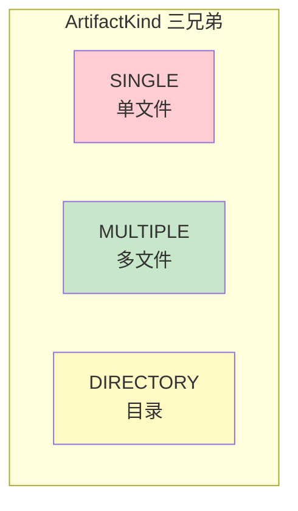
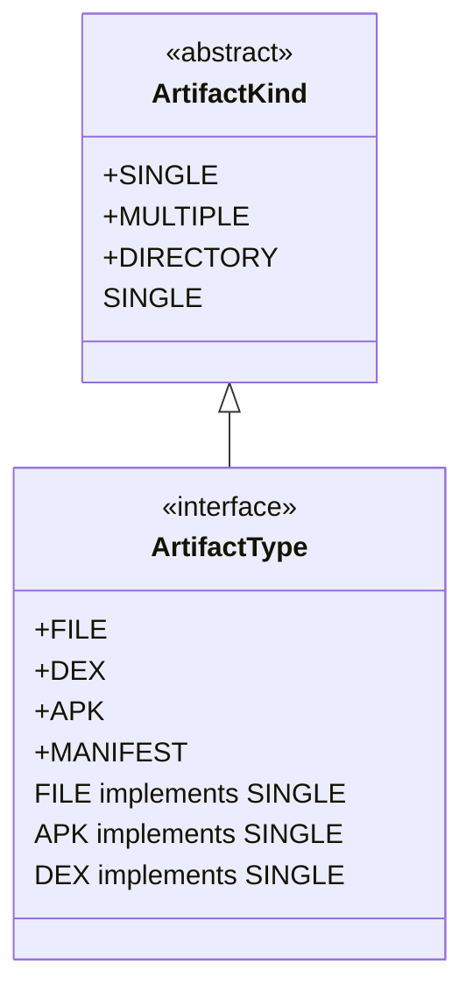
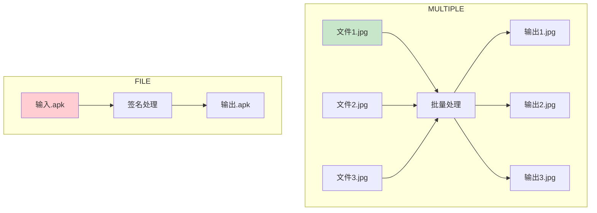
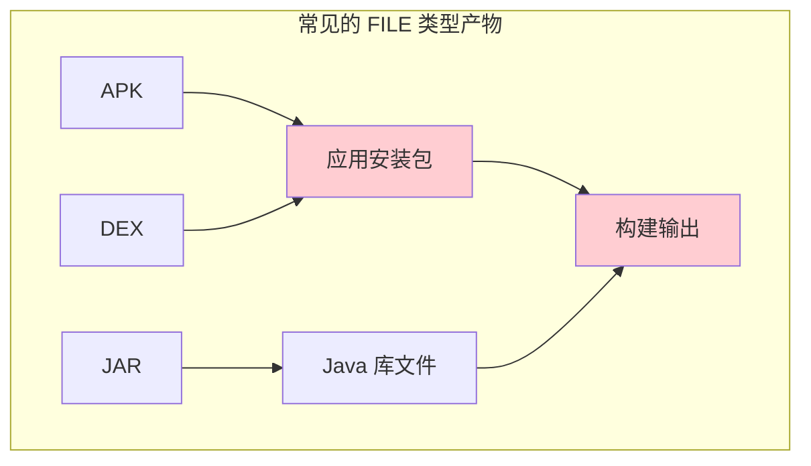
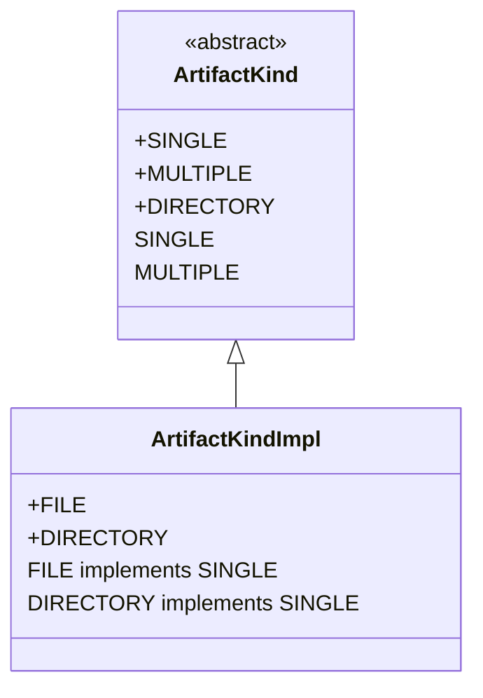

# 21.1.18 ArtifactKind.FILE

夜已经深了，但帐篷里的讨论却刚刚进入状态。

黛琳刚才讲的 DIRECTORY 类型——就像一个完整的露营装备包，需要保持整体结构——让洛芙印象深刻。此刻她正在整理思路，突然想到了一个问题。

“那……如果说 DIRECTORY 是一个文件夹，是'很多文件打包在一起的整体'，”洛芙歪着脑袋，“那有没有一种类型，是'单个文件'的意思？”

希尔正在给笔记本电脑充电，听到这个问题抬起头来：“好问题！其实我们昨天处理过的 APK 输出，就是一个单文件。”

“APK？”洛芙眨了眨眼，“那个安装包？”

“对，”黛琳点点头，“APK 是一个单文件——它虽然是 ZIP 格式的压缩包，但在 Gradle 眼里，它就是一个 FILE 类型的产物。”

伊莎从帐篷门口探出头来：“就像……一颗星星？”

“一颗星星？”希尔愣了一下，然后笑了，“对！可以这么说。DIRECTORY 是一片星空，有很多星星；FILE 就是其中单独的一颗星。”

黛琳走到白板前，在昨天画的三个圆圈旁边，又画了一个新的圆：



“昨天我们说了，Kind 有三种——SINGLE、MULTIPLE、DIRECTORY。”黛琳指着 SINGLE 这个圆圈，“今天我们要讲的 FILE，其实就是 SINGLE 的具体实现。”

“等一下，”洛芙举手，“SINGLE 和 FILE 是什么关系？”

“好问题！”黛琳笑了，“SINGLE 是一个抽象概念，表示'单个产出物'。FILE 是对 SINGLE 的具体实现——当这个'单个产出物'是一个文件时，用 FILE 来表示。”

她在白板上画了一个简单的类比图：



“你们看，”黛琳指着图说，“Kind 是大类，Type 是具体实现。FILE 是 SINGLE 的一种具体类型——就像 APK 也是 SINGLE 的一种具体类型一样。”

“原来如此！”洛芙赶紧记下来，“所以 SINGLE 是爸爸，FILE 是儿子！”

“可以这么理解，”希尔 grins（露出灿烂的笑容），“而且不仅仅是 FILE——APK、DEX、JAR，这些全都是 SINGLE 类型，因为它们都是单个文件。”

夜风吹过帐篷门口，带来了一丝凉意。洛芙裹了裹身上的外套：“那……FILE 类型在 Gradle 里到底是怎么用的？”

黛琳没有直接回答，而是反问洛芙：“你还记得昨天希尔展示的 Transform 代码吗？”

“记得！”洛芙点头，“就是那个处理 res 目录的 Transform，输入是 DirectoryInput，输出是 DirectoryOutput。”

“对。那如果是处理单个文件呢？”黛琳看向希尔，“希尔，给她展示一下 SINGLE 类型的 Transform 是怎么写的。”

希尔把笔记本电脑转过来，让大家都看到屏幕：“看好了——这是处理单个文件的 Transform 示例：”

```kotlin
// 处理单个文件的 Transform 示例
abstract class SingleFileTransform : Transform() {

    // 声明输入是单文件类型
    override fun getInputTypes(): Set<ContentType> {
        return setOf(DefaultContentType.CLASSES)
    }

    // 声明输出是单文件类型（FILE）
    override fun outputTypes(): Set<ArtifactKind> {
        return setOf(ArtifactKind.FILE)
    }

    // 判断是否是单文件
    override fun isSingleInput(): Boolean {
        return true
    }

    // 处理单个输入文件
    override fun transform(transformInvocations: TransformInvocation) {
        transformInvocations.inputs.forEach { input ->
            // 获取单个输入文件
            val singleInput = input as? TransformInput
            singleInput?.jarInputs?.firstOrNull()?.let { jarInput ->
                val inputFile = jarInput.file
                
                // 处理这个文件
                val processedFile = processFile(inputFile)
                
                // 获取输出位置（单文件）
                val outputProvider = transformInvocations.outputProvider
                val outputFile = outputProvider.getContentLocation(
                    jarInput.name,
                    outputTypes(),
                    jarInput.scopes,
                    ArtifactKind.FILE  // 注意这里！FILE 类型
                )
                
                // 复制处理后的文件
                processedFile.copyTo(outputFile, overwrite = true)
            }
        }
    }
    
    private fun processFile(input: File): File {
        // 处理逻辑
        return input
    }
}
```

“哇……”洛芙看着代码，“这里用的是 ArtifactKind.FILE！”

“对，”希尔点点头，“当你需要输出一个单文件时，就用 ArtifactKind.FILE。”

黛琳补充道：“而且注意看 isSingleInput() 这个方法——返回 true 表示这是一个 SINGLE 类型的 Transform，Gradle 会确保每次只传递一个输入文件给你处理。”

“那……”洛芙又问，“如果我要输出一个 APK，应该用什么 Kind？”

“好问题！”黛琳笑了，“APK 本身也是一个 FILE——因为它是一个单文件安装包。”

她在白板上画了一个 APK 构建的流程图：


“你们看，”黛琳指着图说，“从源码到 DEX，从 DEX 到 APK——每一步的产出都是一个单文件。所以在整个构建链条中，这些产出物都是 FILE 类型。”

伊莎这时候轻声说：“我觉得……这就像我们露营时的不同阶段。”

大家都看向她。

“出发前，我们整理好的'装备包'——那个大背包，就是 DIRECTORY。然后在路上，我们从背包里拿出一个'水壶'——这是一个单件物品，就是 FILE。”

“真有你的！”希尔笑了，“这么一类比确实很清楚。”

洛芙想了想：“那……MULTIPLE 和 FILE 到底有什么区别？我总是搞混。”

黛琳点点头：“这是个好问题。MULTIPLE 和 FILE 看起来都是处理文件，但本质不同。”

她走到白板前，画了一个对比图：



“你们看，”黛琳指着图解释，“MULTIPLE 是'一批文件，批量处理'——每个文件独立处理，输入 N 个文件，输出 N 个文件。”

她停顿了一下：“而 FILE 是'单个文件，整体处理'——输入一个文件，输出一个文件。但这个'处理'可能是整体的转换，而不是拆分成多个小文件。”

洛芙似懂非懂地点点头：“那……MULTIPLE 就像同时烤很多块饼干，每块都独立；FILE 就像把一整块披萨切成几块？”

“不对不对，”希尔笑着摇头，“FILE 更像是给一整张照片加滤镜——输入一张照片，输出一张处理过的照片。整体处理，不是拆分。”

“明白了！”洛芙眼睛一亮。

夜更深了。银河在天空中缓缓移动，偶尔有流星划过。洛芙盯着帐篷顶部的夜灯发呆，突然又想到了一个问题。

“那……”洛芙问，“FILE 类型在实际开发中，最常见的用途是什么？”

黛琳和希尔对视一眼，然后由黛琳回答：“最常见的……应该是处理 APK 输出吧。”

“对！”希尔点头，“APK 是 Android 应用的安装包，它就是一个单文件。每次构建完成后，你会得到一个 .apk 文件——这个就是 FILE 类型的产出物。”

她打开笔记本电脑，找了一段代码：

```kotlin
// 获取 APK 输出文件
androidComponentsExtension.onVariants(selector().all()) { variant ->
    val packageApplication = variant.packageApplication
    
    // packageApplication 的输出是 APK 文件（FILE 类型）
    val apkOutput = packageApplication.outputDirectory.flatMap { dir ->
        // 遍历输出目录，找到 .apk 文件
        dir.listFiles { _, name -> name.endsWith(".apk") }
            ?.firstOrNull()
    }
    
    apkOutput?.let { apk ->
        println("APK 输出路径: ${apk.absolutePath}")
    }
}
```

“原来如此！”洛芙看着代码，“所以 APK 输出就是 FILE 类型。”

“对，”黛琳说，“还有一个常见的例子是 DEX 文件——Android 虚拟机的字节码文件。它也是一个单文件。”

她在白板上补充了更多的 FILE 类型例子：



“除了 APK 和 DEX，”黛琳继续说，“还有 JAR 文件、AAR 文件——这些都是单文件，都是 FILE 类型。”

洛芙记着笔记，突然想到了另一个问题：“那……如果我们自己写一个 Transform，要输出 FILE 类型，具体怎么做？”

希尔又把笔记本电脑转过来：“来，我给你展示一个完整的例子——”

```kotlin
// 自定义 Transform，输出 FILE 类型的产物
abstract class VersionInfoTransform : Transform() {

    override fun getInputTypes(): Set<ContentType> {
        return setOf(DefaultContentType.CLASSES)
    }

    override fun outputTypes(): Set<ArtifactKind> {
        // 声明输出为 FILE 类型
        return setOf(ArtifactKind.FILE)
    }

    override fun getScopes(): MutableSet<in QualifiedContent.Scope> {
        return mutableSetOf(QualifiedContent.Scope.PROJECT)
    }

    override fun transform(transformInvocation: TransformInvocation) {
        val outputProvider = transformInvocation.outputProvider
        
        transformInvocation.inputs.forEach { input ->
            input.jarInputs.forEach { jarInput ->
                // 创建一个新的单文件输出
                // 注意：getContentLocation 的最后一个参数是 ArtifactKind.FILE
                val outputFile = outputProvider.getContentLocation(
                    "version_info",
                    outputTypes(),
                    jarInput.scopes,
                    ArtifactKind.FILE
                )
                
                // 生成版本信息文件
                generateVersionInfo(outputFile)
            }
        }
    }
    
    private fun generateVersionInfo(outputFile: File) {
        // 创建版本信息文件
        outputFile.writeText("""
            |App Version: ${getVersionName()}
            |Build Type: ${getBuildType()}
            |Build Time: ${System.currentTimeMillis()}
        """.trimMargin())
    }
    
    private fun getVersionName(): String = "1.0.0"
    private fun getBuildType(): String = "debug"
}
```

“原来是这样……”洛芙仔细看着代码，“输出用 ArtifactKind.FILE，然后用 outputProvider.getContentLocation() 来获取输出文件的路径。”

“对，”黛琳补充道，“关键是要记住——FILE 类型只能输出一个单文件，不能输出多个文件。如果你需要输出多个文件，应该用 MULTIPLE；如果需要输出目录，应该用 DIRECTORY。”

伊莎这时候轻声说：“我有个问题——如果我既想输出文件，又想保持目录结构，怎么办？”

“好问题！”黛琳看向伊莎，“这种情况，你可能需要输出 DIRECTORY 类型的产物，然后在目录里放文件。”

她举例说明：

```kotlin
// 错误示范：想输出多个文件，却用了 FILE 类型
override fun outputTypes(): Set<ArtifactKind> {
    return setOf(ArtifactKind.FILE)  // ❌ 只能输出一个文件！
}

// 正确做法：根据需求选择
override fun outputTypes(): Set<ArtifactKind> {
    return when {
        needSingleFile -> setOf(ArtifactKind.FILE)      // 单文件
        needMultipleFiles -> setOf(ArtifactKind.MULTIPLE) // 多文件
        needDirectory -> setOf(ArtifactKind.DIRECTORY)   // 目录
    }
}
```

“原来如此！”洛芙恍然大悟，“选择 Kind 是基于输出形式，而不是输入形式。”

“对，”黛琳点头，“这就是关键——不管你的输入是什么（文件、多个文件、目录），输出是什么形式，就用什么 Kind。”

帐篷外的星空依旧明亮。洛芙打了个哈欠，但还是想再问一个问题。

“那……”洛芙问，“FILE 和 SINGLE 到底有什么区别？我还是有点 confused。”

希尔笑着解释：“SINGLE 是一个抽象概念，表示'单一产出物'。FILE 是对 SINGLE 的一种具体实现——当这个产出物是一个文件时，就用 FILE。”

“还有另一种实现吗？”洛芙好奇地问。

“有！”黛琳点头，“还有 DIRECTORY——它也是 SINGLE 的实现，表示'单一产出物'是一个目录。”

她在白板上画了一个总结图：



“你们看，”黛琳指着图解释，“SINGLE 有两种具体实现——FILE（单文件）和 DIRECTORY（单目录）。MULTIPLE 是另一个大类，表示多个独立产出物。”

“终于明白了！”洛芙长舒一口气，“SINGLE 是'一个'，MULTIPLE 是'多个'。而 SINGLE 这个'一个'，可以是 FILE（一个文件）或 DIRECTORY（一个目录）。”

“对！”希尔 grins（露出灿烂的笑容），“就是这样的层次关系。”

夜已经很深了。银河横跨天际，星星们安静地闪烁着。露水一定结得更重了，洛芙想，明天早上的草地一定是湿漉漉的。

黛琳看了一下手表：“时间不早了。今天我们讲了 FILE 类型——它是 SINGLE 类型的具体实现，表示单文件产出物。关键是要区分 FILE、MULTIPLE 和 DIRECTORY：需要输出单个文件就用 FILE，需要输出多个独立文件就用 MULTIPLE，需要输出目录就用 DIRECTORY。”

洛芙点了点头，把刚才学的知识在脑海里过了一遍：FILE 是单文件类型，就像一颗星星，是 SINGLE 的具体实现。APK、DEX、JAR 都是 FILE 类型的典型例子。处理 FILE 类型用 SingleInput，输出用 ArtifactKind.FILE。

“那明天我们讲什么？”洛芙问。

“ArtifactType，”黛琳说，“就是比 Kind 更细的分类——比如 APK 类型、DEX 类型、JAR 类型……”

“听起来好复杂……”洛芙嘟囔着，但嘴角带着笑。

“慢慢来，”伊莎温柔地说，“先把这个晚上学的记住就好。星星都在提醒我们该休息了。”

帐篷外的星空依旧明亮。洛芙闭上眼睛，脑海里还回响着 FILE、SINGLE、DIRECTORY——三种类型，三种产出形式。晚风轻轻吹过，带来了夜晚特有的草木清香。

明天又是新的一天。

---

## 技术总结

### 核心机制定义

ArtifactKind.FILE 是 Android Gradle Plugin 中表示"单文件类型"的工件 Kind。与 SINGLE（单一产出物）和 MULTIPLE（多文件）不同，**FILE 强调的是一个具体的文件产出物**。它是 SINGLE 抽象概念的具体实现之一，另一种实现是 DIRECTORY（单目录）。

### 典型应用场景

- **APK 文件**：Android 应用的安装包，最终产出物
- **DEX 文件**：Dalvik Executable，Android 虚拟机字节码
- **JAR 文件**：Java 库文件
- **AAR 文件**：Android 库文件
- **签名文件**：APK 签名后的输出

### 与其他 Kind 的区别

| 特性 | FILE | MULTIPLE | DIRECTORY |
|------|------|----------|-----------|
| 产出形式 | 单个文件 | 多个独立文件 | 完整目录 |
| 层级 | SINGLE 的实现 | 独立大类 | SINGLE 的实现 |
| 处理方式 | 整体转换 | 批量独立处理 | 保持结构整体处理 |
| API | SingleInput | TransformInput | DirectoryInput |

### FILE 与 SINGLE 的关系

SINGLE 是抽象概念，表示"单一产出物"。FILE 和 DIRECTORY 都是 SINGLE 的具体实现：
- **FILE**：单一产出物是一个文件
- **DIRECTORY**：单一产出物是一个目录

```mermaid
classDiagram
    class ArtifactKind {
        <<abstract>>
        +SINGLE
        +MULTIPLE
    }
    
    ArtifactKind <|-- "FILE"
    ArtifactKind <|-- "DIRECTORY"
    
    note for ArtifactKind "SINGLE 有两种实现：\nFILE（单文件）和 DIRECTORY（单目录）"
```

### 反模式与陷阱

**❌ 错误：输出多个文件却用 FILE 类型**
- FILE 只能输出一个文件，需要输出多个文件应该用 MULTIPLE

**❌ 错误：混淆 FILE 和 DIRECTORY**
- FILE 是单文件，DIRECTORY 是目录结构

**❌ 错误：在 Transform 中错误声明 outputTypes**
- 必须根据实际输出形式选择正确的 Kind

---

## 动手练习

### ★ 识别 FILE 类型产物

判断以下产物类型：
1. `app/build/outputs/apk/debug/app-debug.apk` → **FILE**
2. `app/build/intermediates/dex/debug/classes.dex` → **FILE**
3. `app/build/intermediates/javac/debug/classes/` → **DIRECTORY**
4. `app/build/outputs/aar/debug.aar` → **FILE**

### ★★ 实现 FILE 类型 Transform

设计一个生成应用签名信息的 Transform：
- 输入：JAR 文件 (FILE)
- 输出：签名信息文件 (FILE)
- 使用 ArtifactKind.FILE

```kotlin
// 参考实现要点
abstract class SignatureInfoTransform : Transform() {
    override fun outputTypes(): Set<ArtifactKind> {
        return setOf(ArtifactKind.FILE)  // 声明为 FILE 类型
    }
    
    override fun transform(transformInvocation: TransformInvocation) {
        val outputProvider = transformInvocation.outputProvider
        // 获取输出文件位置
        val outputFile = outputProvider.getContentLocation(
            "signature_info",
            outputTypes(),
            setOf(QualifiedContent.Scope.PROJECT),
            ArtifactKind.FILE
        )
        // 生成签名信息文件
        // ...
    }
}
```

### ★★★ 区分三种 Kind

设计一个场景，说明何时使用 FILE、MULTIPLE、DIRECTORY：
- 输出 APK → **FILE**
- 输出多个优化后的图片 → **MULTIPLE**
- 输出资源目录 → **DIRECTORY**

---

## 面试热身

### Q1: 什么是 ArtifactKind.FILE？

**A**: 表示单文件类型的工件 Kind，是 SINGLE 抽象概念的具体实现之一。

### Q2: FILE 和 SINGLE 的关系？

**A**: SINGLE 是抽象概念，FILE 和 DIRECTORY 都是它的具体实现。SINGLE 表示"单一产出物"，FILE 表示这个产出物是一个文件。

### Q3: 常见的 FILE 类型产物有哪些？

**A**: APK、DEX、JAR、AAR 等单文件产出物。

### Q4: FILE 和 DIRECTORY 的区别？

**A**: FILE 是单文件，DIRECTORY 是目录结构。两者都是 SINGLE 的实现。

### Q5: 如何在 Transform 中输出 FILE 类型？

**A**: 在 outputTypes() 方法中声明 setOf(ArtifactKind.FILE)，然后使用 outputProvider.getContentLocation() 获取输出文件路径。

---

## 参考实现要点

```kotlin
// 输出 FILE 类型产物的 Transform 示例
class FileOutputTransform : Transform() {
    
    override fun outputTypes(): Set<ArtifactKind> {
        return setOf(ArtifactKind.FILE)  // 关键：声明为 FILE 类型
    }
    
    override fun transform(transformInvocation: TransformInvocation) {
        val outputProvider = transformInvocation.outputProvider
        
        transformInvocation.inputs.forEach { input ->
            input.jarInputs.forEach { jarInput ->
                // 获取输入文件
                val inputFile = jarInput.file
                
                // 处理文件...
                val processedFile = processFile(inputFile)
                
                // 获取输出位置（FILE 类型）
                val outputFile = outputProvider.getContentLocation(
                    jarInput.name,
                    outputTypes(),
                    jarInput.scopes,
                    ArtifactKind.FILE
                )
                
                // 复制到输出
                processedFile.copyTo(outputFile, overwrite = true)
            }
        }
    }
    
    private fun processFile(input: File): File {
        // 处理逻辑
        return input
    }
}
```

---

> 学习建议：理解 ArtifactKind.FILE 的关键是认识到它是"SINGLE 的具体实现——单文件"。在实际开发中，APK、DEX、JAR 等都是 FILE 类型的典型代表。写 Transform 时，要根据实际输出形式选择正确的 Kind——输出单文件用 FILE，输出多个独立文件用 MULTIPLE，输出目录用 DIRECTORY。

---

## 洛芙的小小日记本

今天学到了 ArtifactKind.FILE——单文件类型！就像一颗星星，是 SINGLE 的具体实现。黛琳用星星和露营装备的比喻帮我区分了 FILE、DIRECTORY 和 MULTIPLE。APK、DEX、JAR 都是 FILE 类型～好困，但好满足！晚安⭐

---

## 今日关键词

- **ArtifactKind.FILE**：Android Gradle Plugin 中定义的一种工件类型，表示单文件形式的产出物
- **SINGLE**：抽象概念，表示"单一产出物"，FILE 和 DIRECTORY 都是它的实现
- **ArtifactKind**：工件的Kind分类，包括 SINGLE、MULTIPLE、DIRECTORY
- **APK**：Android Application Package，应用安装包，是 FILE 类型的典型代表
- **DEX**：Dalvik Executable，Android 虚拟机字节码文件
- **JAR**：Java Archive，Java 库文件
- **AAR**：Android Archive，Android 库文件
- **SingleInput**：Transform 的单文件输入接口
- **ArtifactType**：比 Kind 更细粒度的类型分类
- **Transform**：Android Gradle Plugin 的转换任务，用于处理构建过程中的工件
