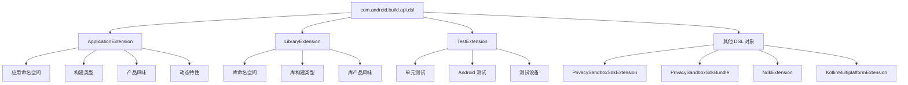
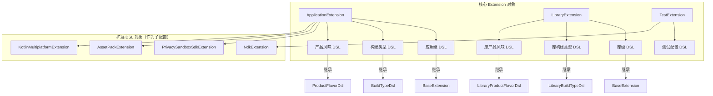
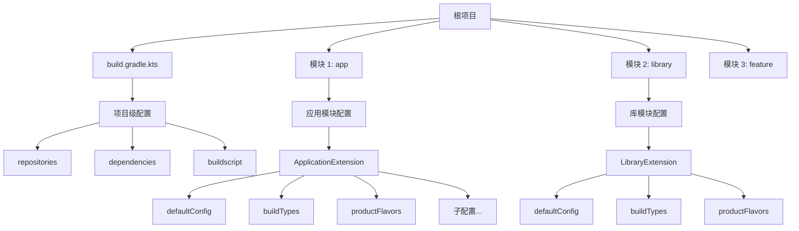
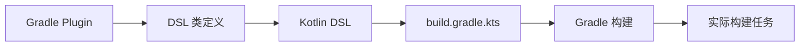
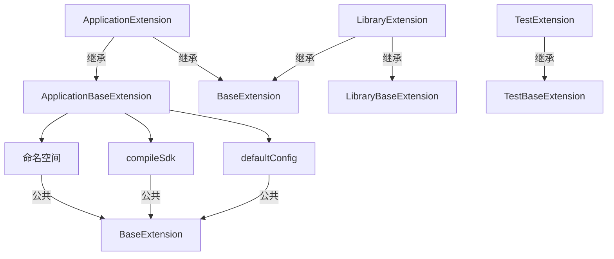
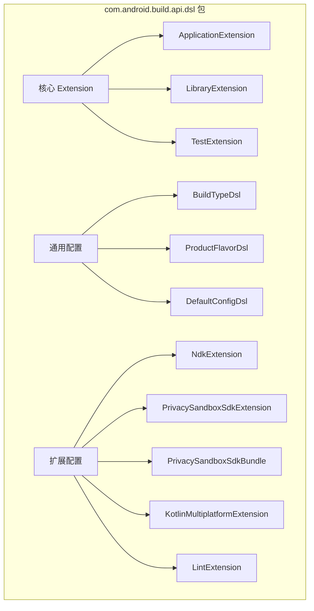
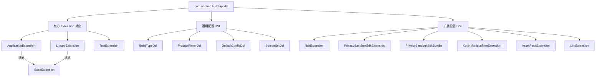

# 21.1.180 com.android.build.api.dsl

湖面上的星光像撒了一把碎银，微波粼粼间，又倒映出天上那轮被云半遮的月亮。黛琳把白板笔别回笔帽，却没有像往常一样结束今天的露营编程。

她转身指向白板，上面还留着之前画的各种 DSL 对象结构图——PrivacySandboxSdkExtension、PrivacySandboxSdkBundle、ApplicationExtension、LibraryExtension 等等。

“洛芙，你有没有想过一个问题？”黛琳问道，“我们之前学了这么多 DSL 对象——ApplicationExtension、LibraryExtension、PrivacySandboxSdkExtension——它们都是从哪儿来的？”

洛芙愣了一下：“这个……我们一直都在用 android { } 这个块，好像没想过它们为什么存在。”

希尔笑了笑：“那是因为我们一直在用，却没停下来看过全貌。今天就让黛琳给我们画一张大图——看看我们到底在用些什么。”

黛琳重新拿起白板笔，在白板的右侧清出一块空白，画了一个大的矩形，然后在里面写下了几个字母：

```
┌─────────────────────────────────┐
│    com.android.build.api.dsl   │
└─────────────────────────────────┘
```

“这个，就是我们所有 DSL 对象的‘家’，”黛琳说，“com.android.build.api.dsl 是 Android Gradle Plugin 提供的 DSL API 的根包。我们之前学的所有 android { } 里的配置，其实都是这个包里的对象在起作用。”

洛芙凑近白板，好奇地问：“那……这个包里到底有哪些对象？”

伊莎轻轻理了理被风吹乱的发丝，笑着说：“让我猜猜——是不是有管 App 的、管 Library 的、还有管测试的？”

“差不多，”黛琳笑着在白板上画了一个层级图，“我们来看——”



“你看，这就是整个 DSL 包的结构，”黛琳指着图解释道，“最顶层是 com.android.build.api.dsl 这个包，它下面是几个核心的 Extension 对象——ApplicationExtension 是给 App 用的，LibraryExtension 是给 Library 用的，TestExtension 是给测试用的。其他所有的 DSL 对象，比如我们之前学的 PrivacySandboxSdkExtension，都是这些核心对象的子配置。”

洛芙似懂非懂地点点头：“所以……我们一直在用的 android { } 块，其实就是在配置这些 Extension 对象？”

“对，”希尔把电脑转过来，屏幕的荧光在夜色里显得格外清晰，“我们来写代码验证一下——”

```kotlin
// build.gradle.kts 中的 android { } 块
android {
    // 这里配置的每一样东西，都对应着 ApplicationExtension 的属性
    namespace = "com.example.myapp"
    
    compileSdk = 34
    
    defaultConfig {
        applicationId = "com.example.myapp"
        minSdk = 24
        targetSdk = 34
    }
    
    buildTypes {
        release {
            isMinifyEnabled = true
            proguardFiles(getDefaultProguardFile("proguard-android-optimize.txt"), "proguard-rules.pro")
        }
        debug {
            isDebuggable = true
        }
    }
    
    productFlavors {
        create("free") {
            applicationIdSuffix = ".free"
        }
        create("paid") {
            applicationIdSuffix = ".paid"
        }
    }
}
```

“这里我们配置的 namespace、compileSdk、defaultConfig、buildTypes、productFlavors，全部都是 ApplicationExtension 的属性，”希尔指着屏幕解释道，“每个属性都对应着 ApplicationExtension 这个类的一个成员。”

黛琳补充道：“你们注意到没有？android { } 块在 App 的 build.gradle.kts 和 Library 的 build.gradle.kts 里都能用，但它们实际上配置的是不同的对象——App 用的是 ApplicationExtension，Library 用的是 LibraryExtension。”

洛芙好奇地问：“那……怎么知道自己在用的是哪个 Extension？”

“很简单，看 build.gradle.kts 所在的模块类型，”黛琳在白板上写道：

```kotlin
// App 模块的 build.gradle.kts
plugins {
    id("com.android.application")
}
// android { } 配置的是 ApplicationExtension

// Library 模块的 build.gradle.kts
plugins {
    id("com.android.library")
}
// android { } 配置的是 LibraryExtension
```

“当你使用 com.android.application 插件时，android { } 块配置的就是 ApplicationExtension；当你使用 com.android.library 插件时，配置的就是 LibraryExtension，”黛琳解释道，“这两个类虽然很多属性是相似的，但也有一些各自特有的属性。”

希尔补充了一段对比代码：

```kotlin
// ApplicationExtension 特有的属性
android {
    // App 特有的：应用 ID
    defaultConfig {
        applicationId = "com.example.myapp"
    }
    
    // App 特有的：版本信息
    defaultConfig {
        versionCode = 1
        versionName = "1.0.0"
    }
    
    // App 特有的：签名配置
    signingConfigs {
        create("release") {
            // ...
        }
    }
}

// LibraryExtension 特有的属性
android {
    // Library 特有的：是否生成混淆映射
    buildFeatures {
        buildConfig = true
    }
    
    // Library 特有的：是否发布
    publishing {
        singleVariant("release")
    }
}
```

伊莎轻轻问：“那 TestExtension 是做什么的？”

“问得好，”黛琳在白板上画了一个新的分支，“TestExtension 是用来配置测试相关的设置的——”

```kotlin
android {
    // TestExtension 的配置
    testOptions {
        // 单元测试的配置
        unitTests {
            // 是否包含 Android 资源
            isIncludeAndroidResources = true
            
            // 是否返回默认结果
            isReturnDefaultValues = true
        }
        
        // 仪表测试的配置
        instrumentationTests {
            // 目标包
            targetPackageId = "com.example.myapp"
        }
    }
}
```

“TestExtension 让你可以配置单元测试和仪表测试的行为，”黛琳解释道，“比如是否包含 Android 资源、是否返回默认值、目标包是什么等等。”

洛芙举手提问：“那……我们之前学的 PrivacySandboxSdkExtension，它们是什么关系？”

黛琳画了一个更完整的图：



“你看，PrivacySandboxSdkExtension 这些扩展对象，是作为 ApplicationExtension 或其他核心对象的子配置存在的，”黛琳指着图解释道，“它们不是直接放在 com.android.build.api.dsl 包下的第一层，而是嵌套在核心 Extension 对象里面的。”

“打个比方的话，”伊莎轻声说，“ApplicationExtension 就像是露营营地的主帐篷，而 PrivacySandboxSdkExtension 就像是主帐篷里的一顶小帐篷——它属于营地的一部分，但又是相对独立的。”

“这个比喻好，”希尔打了个响指，“我们来写代码验证一下这种嵌套关系——”

```kotlin
android {
    // 这是 ApplicationExtension 的属性
    namespace = "com.example.myapp"
    
    // 这里是子配置的嵌套
    privacySandboxSdkExtension {
        // PrivacySandboxSdkExtension 的属性
        minApiLevel = 24
        targetApiLevel = 34
    }
    
    // 另一个子配置
    ndk {
        // NdkExtension 的属性
        abiFilters += listOf("armeabi-v7a", "arm64-v8a")
    }
    
    // 再一个子配置
    kotlin {
        // KotlinMultiplatformExtension 的属性
        // ...
    }
}
```

“这里，android { } 块对应的是 ApplicationExtension，而里面的 privacySandboxSdkExtension { }、ndk { }、kotlin { } 等子块，都是 ApplicationExtension 的属性——它们各自是对应的 Extension 对象，”希尔解释道，“这种嵌套关系就是整个 DSL 系统的运作方式。”

洛芙若有所思：“所以……整个 Android Gradle Plugin 的构建配置，就是一个大的对象树？”

“对，”黛琳画了一个更宏观的图，“你想象一下——”



“实际的项目中，一个根项目下面会有多个模块——App 模块、Library 模块、动态特性模块等等。每个模块都有自己的 build.gradle.kts，每个 build.gradle.kts 里的 android { } 块配置的是不同的 Extension 对象，它们一起构成了一棵配置树。”

夜风更凉了，洛芙缩了缩脖子，抬头看天。星星比刚才更亮了一些，月亮也完全从云里钻了出来，在湖面上撒下一片银光。

“那……”洛芙问，“如果我们想看某个具体的属性在哪个类里，该怎么办？”

希尔笑了笑：“好问题！这个问题问得好——因为 Android Gradle Plugin 的 DSL 文档就在那里。”

她把电脑转过来，展示了一个网页：

```markdown
# 查看 DSL API 文档的方法

1. 打开官方文档：
   https://developer.android.com/reference/tools/gradle-api

2. 选择你的 AGP 版本（如 9.0）

3. 在左侧导航中找到 com.android.build.api.dsl 包

4. 点击具体的类名（如 ApplicationExtension）

5. 查看类的属性和方法
```

“官方文档里就有所有的 DSL 对象定义，”希尔指着屏幕说，“比如你想知道 ApplicationExtension 有什么属性，去文档里一查就知道。”

黛琳补充道：“而且，IDE（如 Android Studio）也有自动补全功能。你在 build.gradle.kts 里输入 android { } 后，IDE 会自动显示可以配置的属性——这些都是从 DSL 类里读取的。”

洛芙好奇地问：“那……这些 DSL 类是怎么变成我们可以写的代码的？”

“这是一个很好的问题，”黛琳在白板上画了一个流程图，“整个过程是这样的——”



“Android Gradle Plugin 首先定义了 DSL 类（比如 ApplicationExtension），然后 Gradle 把这些类暴露为 Kotlin DSL——也就是我们可以在 build.gradle.kts 里写的代码。当你写 android { } 的时候，Gradle 实际上是在创建一个 ApplicationExtension 实例，并配置它的属性。”

希尔补充了一段代码，展示 DSL 对象的内部结构：

```kotlin
// 这是一个简化版的 ApplicationExtension 定义
abstract class ApplicationExtension : com.android.build.api.dsl.ApplicationBaseExtension {
    
    // 命名空间
    abstract var namespace: String?
    
    // 编译 SDK
    abstract var compileSdk: Int?
    
    // 默认配置
    abstract fun defaultConfig(action: DefaultConfig.() -> Unit)
    
    // 构建类型
    abstract fun buildTypes(action: BuildTypeContainerDsl.() -> Unit)
    
    // 产品风味
    abstract fun productFlavors(action: ProductFlavorContainerDsl.() -> Unit)
    
    // NDK 配置
    abstract fun ndk(action: NdkExtension.() -> Unit)
    
    // PrivacySandbox SDK 配置
    abstract fun privacySandboxSdkExtension(action: PrivacySandboxSdkExtension.() -> Unit)
    
    // ... 其他属性和方法
}

// 这就是为什么我们可以在 build.gradle.kts 里写：
android {
    namespace = "com.example.myapp"
    compileSdk = 34
    
    defaultConfig {
        applicationId = "com.example.myapp"
    }
    
    ndk {
        abiFilters += listOf("armeabi-v7a")
    }
}
```

洛芙看着代码，若有所思：“所以……这些 DSL 类其实就是一个个配置接口？”

“对的，”黛琳说，“ApplicationExtension 这样的 DSL 类，本质上就是一个配置接口——它定义了你可以配置哪些东西。Gradle 会在构建时读取这些配置，然后生成实际的任务来执行构建。”

伊莎轻轻问：“那……如果我们想给 Gradle Plugin 贡献新的 DSL 配置，该怎么做？”

“这就涉及到自定义 DSL 了，”希尔说，“要创建一个新的 DSL 对象，你需要——”

```kotlin
// 1. 定义 DSL 类（使用 Gradle 的 DSL 标记）
@GradleDsl
abstract class MyCustomExtension {
    abstract var enabled: Boolean
    abstract var configValue: String
}

// 2. 在插件中暴露这个扩展
open class MyPlugin : Plugin<Project> {
    override fun apply(project: Project) {
        project.extensions.create("myCustom", MyCustomExtension::class.java)
    }
}

// 3. 在 build.gradle.kts 中使用
myCustom {
    enabled = true
    configValue = "example"
}
```

“这就是自定义 DSL 的基本流程，”希尔解释道，“当然，实际做起来要复杂得多，需要处理类型转换、属性委托等等。但核心思路是一样的——先定义一个类，然后在插件里把它注册为扩展，最后在 build.gradle.kts 里配置它。”

黛琳补充了一个图示，展示 DSL 对象的继承关系：



“你们看，ApplicationExtension 和 LibraryExtension 都继承自 BaseExtension——这就是为什么它们有很多共同的属性，比如 namespace、compileSdk、defaultConfig 等等，”黛琳指着图解释道，“而 ApplicationBaseExtension 则是 Application 特有的部分，比如 applicationId。”

洛芙举手提问：“那……我们之前学的 PrivacySandboxSdkExtension，它有没有父类？”

“有的，”希尔滑动屏幕，展示了一段代码，“所有扩展 DSL 对象都有一个共同的模式——”

```kotlin
// PrivacySandboxSdkExtension 的简化定义
abstract class PrivacySandboxSdkExtension {
    abstract var minApiLevel: Int
    abstract var targetApiLevel: Int
    abstract fun apiSurface(action: ApiSurfaceDsl.() -> Unit)
    abstract fun compatibility(action: CompatibilityDsl.() -> Unit)
    abstract fun publishing(action: PublishingDsl.() -> Unit)
}

// ApiSurfaceDsl 的定义
abstract class ApiSurfaceDsl {
    abstract var publicApiLevel: Int
    abstract var previewApiLevel: Int
    abstract var experimentalApiLevel: Int
}
```

“每个 DSL 对象都有自己的结构，”希尔说，“有的像 PrivacySandboxSdkExtension 那样，有子配置块（apiSurface、compatibility、publishing）；有的则更简单，只是一些属性。”

黛琳在白板上补充了一个完整的 DSL 包结构图：



“简单来说，com.android.build.api.dsl 这个包就是所有 Android 构建配置的源头，”黛琳总结道，“ApplicationExtension 是给 App 用的，LibraryExtension 是给 Library 用的，TestExtension 是给测试用的。其他所有的 DSL 对象——NdkExtension、PrivacySandboxSdkExtension 等等——都是嵌套在这些核心对象里面的子配置。”

伊莎轻轻打了个哈欠：“今天学的这些，感觉像是把之前的东西都串起来了。”

“确实，”希尔合上电脑，伸了个懒腰，“我们之前学的是一个一个的 DSL 对象，今天学的是它们怎么组织在一起。理解了整体结构，再学新的 DSL 对象就容易多了。”

洛芙把这些要点记在了笔记本上：

- com.android.build.api.dsl 是所有 DSL 对象的根包
- ApplicationExtension 用于 App 模块，LibraryExtension 用于 Library 模块
- TestExtension 用于配置测试行为
- 其他 DSL 对象（如 NdkExtension、PrivacySandboxSdkExtension）作为子配置嵌套在核心对象中
- DSL 对象之间有继承关系，共享的属性来自共同的父类

远处的蛙鸣声又响了起来，此起彼伏的，像是在开一场夏夜演唱会。湖面上的星光依旧闪烁，像是也在认真听她们讲课。

“今天的露营编程就到这里啦，”黛琳收拾好白板，“明天我们再看看还有什么具体的 DSL 对象可以深入学习。”

伊莎轻轻理了理被风吹乱的发丝，笑着说：“星光真美啊。”

洛芙没有说话，只是抬头看着天。湖面上倒映的星光，也跟着水面轻轻晃动。她忽然觉得，这些复杂的配置也不是那么可怕——只要理解了背后的结构，一步步来就好。就像是走进一片森林，虽然每棵树都不一样，但它们都长在同一片土地上。

---

## 专业技术总结

> **com.android.build.api.dsl** — Android Gradle Plugin 提供的 DSL（Domain-Specific Language）API 的根包，包含了所有用于配置 Android 项目的 DSL 对象。这些对象定义了 build.gradle.kts 文件中 android { } 块及其子配置块的结构和行为。

### 结构图



### 核心机制

- **ApplicationExtension**：App 模块使用的 DSL 对象，配置应用级构建参数
- **LibraryExtension**：Library 模块使用的 DSL 对象，配置库级构建参数
- **TestExtension**：测试相关的 DSL 对象，配置单元测试和仪表测试行为
- **BaseExtension**：ApplicationExtension 和 LibraryExtension 的共同父类，定义共享属性
- **嵌套 DSL**：NdkExtension、PrivacySandboxSdkExtension 等作为子配置嵌套在核心对象中

### 复杂度与影响

- DSL 对象的设计遵循继承和组合模式，共享属性集中在父类中
- 子配置块通过嵌套 DSL 对象实现，提供更细粒度的配置能力
- 不同模块类型使用不同的 Extension 对象，但共享大部分配置概念

### 反模式与陷阱

1. **混用 App 和 Library 的配置**：在 Library 模块中使用 App 特有的配置（如 applicationId）
2. **忽略版本兼容性**：未检查 DSL 属性在不同 AGP 版本中的可用性
3. **过度嵌套**：创建过多层的子配置块，导致 build.gradle.kts 难以阅读
4. **不查阅文档**：直接猜测 DSL 属性的用法，而不是查阅官方文档

### 设计哲学

- **配置即代码**：DSL 用 Kotlin 代码代替传统 XML 配置，实现类型安全的构建脚本
- **继承与组合**：通过继承减少重复，通过组合实现模块化
- **渐进式暴露**：AGP 逐步暴露新的 DSL 属性，保持向后兼容
- **IDE 支持**：DSL 设计考虑了 IDE 的代码补全和重构支持

### 🏕️ 动手练习

#### 目标

理解 com.android.build.api.dsl 包的整体结构，掌握核心 DSL 对象之间的关系和适用场景。

#### 任务

**Task 1: 探索 DSL 文档**

1. 打开 Android Gradle Plugin 官方文档
2. 找到 com.android.build.api.dsl 包
3. 列出包中的所有类和接口
4. 记录每个类的简要用途

**Task 2: 创建多模块项目**

1. 创建一个包含 App 模块和 Library 模块的项目
2. 在 App 模块的 build.gradle.kts 中添加 ApplicationExtension 配置
3. 在 Library 模块的 build.gradle.kts 中添加 LibraryExtension 配置
4. 观察两者配置块的异同

**Task 3: 配置子扩展**

1. 在 App 模块中添加 NdkExtension 配置
2. 添加 PrivacySandboxSdkExtension 配置
3. 验证子配置块可以同时存在

**Task 4: 探索继承关系**

1. 创建一个简单的自定义 DSL 扩展
2. 观察其与 ApplicationExtension 的关系
3. 记录 DSL 对象的继承链

**验收标准**

- [ ] 能够查阅 com.android.build.api.dsl 包中的类文档
- [ ] 理解 ApplicationExtension 和 LibraryExtension 的区别
- [ ] 能够在项目中正确配置核心 DSL 对象和子扩展
- [ ] 理解 DSL 对象的继承关系和设计模式

**提示代码**

```kotlin
// App 模块 build.gradle.kts
android {
    namespace = "com.example.app"
    compileSdk = 34
    
    defaultConfig {
        applicationId = "com.example.app"
        minSdk = 24
        targetSdk = 34
    }
    
    ndk {
        abiFilters += listOf("arm64-v8a")
    }
}

// Library 模块 build.gradle.kts
android {
    namespace = "com.example.library"
    compileSdk = 34
    
    defaultConfig {
        minSdk = 21
    }
}
```

#### 面试热身

1. com.android.build.api.dsl 包包含哪些核心 DSL 对象？它们分别用于什么场景？
2. ApplicationExtension 和 LibraryExtension 有什么区别？它们有什么共同的父类？
3. 子配置块（如 ndk { }、privacySandboxSdkExtension { }）是如何嵌套在核心对象中的？
4. 如何查看某个 DSL 属性的具体定义和可用值？
5. DSL 对象的设计遵循了哪些设计模式？为什么要这样设计？

### 参考实现要点

1. ApplicationExtension 用于 App 模块，LibraryExtension 用于 Library 模块
2. BaseExtension 是 ApplicationExtension 和 LibraryExtension 的共同父类，定义共享属性
3. 子配置块通过嵌套 DSL 对象实现，如 ndk { } 对应 NdkExtension
4. 使用 IDE 的代码补全功能可以快速查看可用的 DSL 属性
5. 查阅官方文档是理解 DSL 对象结构和属性的最佳方式

> 学习建议：com.android.build.api.dsl 是整个 Android Gradle Plugin DSL 的入口。建议先理解整体结构（核心对象 + 子配置），然后根据实际需要深入学习具体的 DSL 对象。核心思路是“理解继承关系，掌握嵌套结构”。

## 洛芙的小小日记本

今天好充实！黛琳给我们看了 DSL 对象的“全貌地图”——原来我们之前学的 ApplicationExtension、LibraryExtension、NdkExtension 什么的，都是 com.android.build.api.dsl 这个包里的。而且它们是有关系的，ApplicationExtension 和 LibraryExtension 都继承自 BaseExtension，所以很多属性是一样的。子配置块就像小帐篷搭在大帐篷里一样，嵌套在主配置里面。希尔说要常查文档，因为 IDE 只会显示能配置的属性，但不会告诉你每个属性是哪个类的。明天继续探索！

## 今日关键词

- **com.android.build.api.dsl**：Android Gradle Plugin DSL API 的根包
- **ApplicationExtension**：用于配置 Android App 模块的 DSL 对象
- **LibraryExtension**：用于配置 Android Library 模块的 DSL 对象
- **TestExtension**：用于配置测试相关行为的 DSL 对象
- **BaseExtension**：ApplicationExtension 和 LibraryExtension 的共同父类
- **子配置块**：嵌套在核心 DSL 对象中的配置块，如 ndk { }
- **DSL (Domain-Specific Language)**：领域特定语言，用于特定领域的配置
- **Gradle DSL**：Gradle 提供的构建配置语言
- **build.gradle.kts**：使用 Kotlin DSL 的 Gradle 构建脚本文件
- **AGP (Android Gradle Plugin)**：Android Gradle 插件，提供构建能力
- **命名空间**：用于避免类名冲突的机制
- **compileSdk**：编译时使用的 SDK 版本
- **minSdk**：应用支持的最低 SDK 版本
- **targetSdk**：应用主要面向的 SDK 版本
- **继承**：面向对象中的复用机制，子类继承父类的属性和方法
