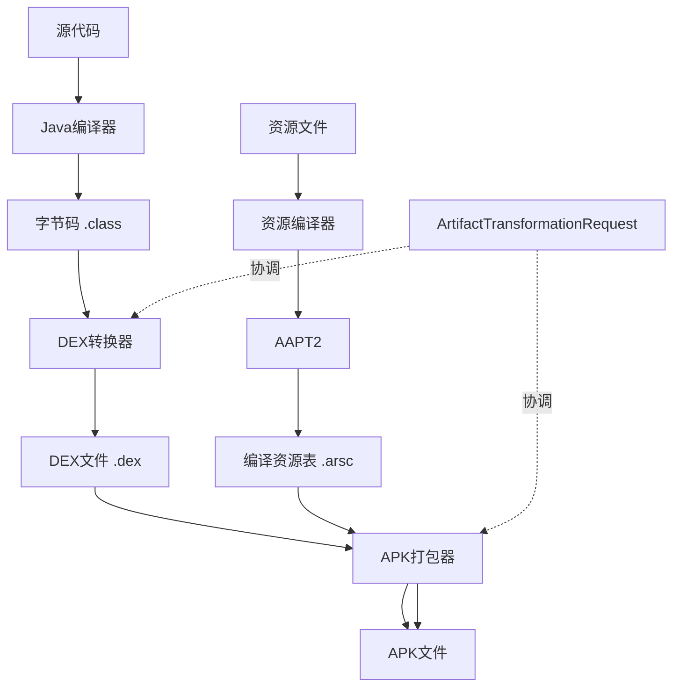
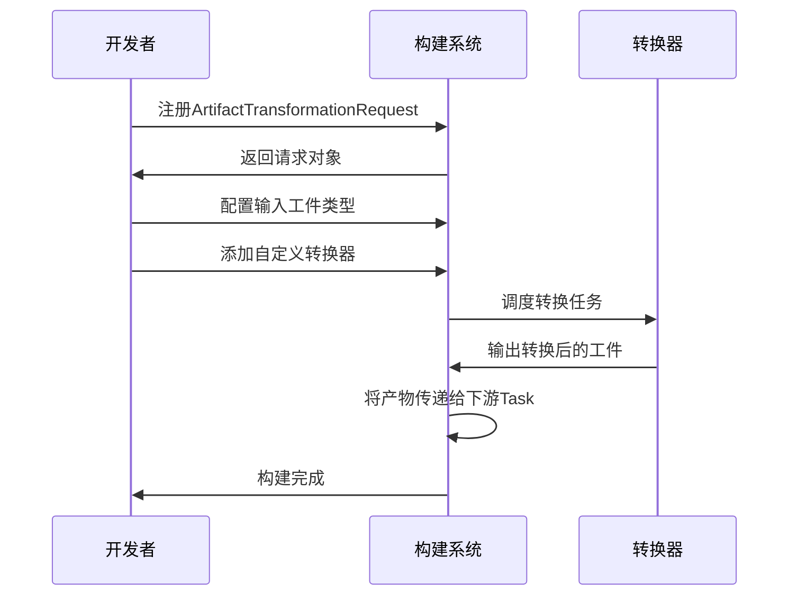
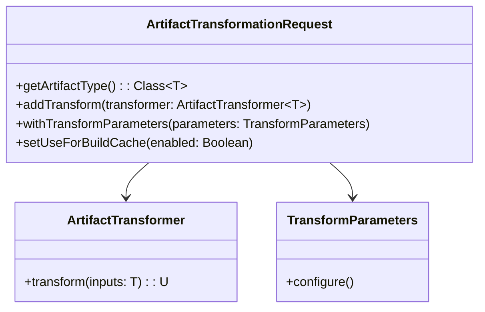

# 21.1.19 工件转换请求

星空在头顶铺展开，像谁不小心打翻了一盒银色的星星。

洛芙仰躺在防潮垫上，双手枕在脑袋后面，看着帐篷顶上的透明纱窗。外面是更深沉的蓝黑色，远处的山轮廓模糊，只有近处的草丛里虫子们在开夜间音乐会，此起彼伏地唱着。

“黛琳姐，”洛芙轻声说，“我们白天说的那个FILE类型，最后变成APK的过程……到底是谁在帮我们把东西‘打包’好啊？我知道有Gradle在干活，但具体是怎么办到的呢？”

黛琳正在整理她的笔记本电脑，屏幕的光在黑暗里显得格外柔和。她抬起头，想了想，嘴角浮现一丝微笑。

“你这个问题问得好。其实呢——在我们写完代码之后，Gradle就像一个超级管家，会指挥一堆工人来把源代码变成最终的APK。这些‘工人’就是各种Task，而他们处理的‘材料’，就是我们今天要聊的新朋友——工件转换请求。”

“工件转换请求？”洛芙把这个名词在嘴里念了一遍，“感觉好像很正式的名字呢。”

“正式是因为它真的很重要，”黛琳把电脑转过来，指着屏幕上的一张架构图，“你看，其实在构建过程中，我们会有很多‘中间产物’。比如Java文件先被编译成.class文件，然后可能被转换成DEX文件，最后还要打包成APK。这些转换，就是由ArtifactTransformationRequest来管理和协调的。”

伊莎从睡袋里探出头来，她的头发有点乱糟糟的，眼睛在昏暗的灯光下亮晶晶的：“听起来好像是一个……转换站的站长？把所有东西按照需要变来变去的？”

“差不多就是这个意思，”黛琳笑着点头，“不过让我们说得更具体一点。希尔，给她们看看那个你之前做的实验？”

希尔正盘腿坐在旁边捣鼓她的平板，听到这话立刻来了精神：“哦！那个啊！我正好带了这个——看！”

她把平板举起来，屏幕上显示着一个Android项目的构建配置。希尔的手指滑动，展示着一个自定义插件的代码。

“你们看，这是我自己写的一个简单示例，”希尔解释道，“我创建了一个Task，它会请求对某个工件进行转换处理。比如我们有Input Artifact（输入工件），然后通过Transformation Request（转换请求），最后输出Output Artifact（输出工件）。”

```kotlin
// 示例：使用 ArtifactTransformationRequest 进行工件转换
abstract class MyTransformTask : Task() {

    @get:InputFiles
    abstract val inputArtifacts: Provider<Directory>

    @get:OutputFiles
    abstract val outputDirectory: Provider<Directory>

    @TaskAction
    fun transform() {
        val inputDir = inputArtifacts.get()
        val outputDir = outputDirectory.get().asFile.get()

        // 遍历输入文件并进行处理
        inputDir.walk().filter { it.isFile }.forEach { file ->
            val outputFile = File(outputDir, file.name)
            // 简单的转换处理：复制并添加标记
            outputFile.writeText(
                "// Transformed by MyTransformTask\n" + file.readText()
            )
        }
    }
}
```

洛芙凑近屏幕，仔细看着代码：“这个例子感觉像是把文件复制了一份然后加了注释？但真实的情况下会做什么样的转换呢？”

“好问题，”黛琳走到白板前，开始画图，“真实的构建过程中，转换的类型要丰富得多。我来给你们画一个全景图——”

她在白板上画了起來：



“你们看，”黛琳指着图解释，“从源代码到最终的APK，中间会经过好几道‘加工工序’。这些工序有些是必须的（比如编译成DEX），有些是可选的（比如混淆、压缩、多语言剥离）。而ArtifactTransformationRequest做的事情呢，就是告诉Gradle：‘嘿，我需要对某个工件做这个处理，你帮我安排一下顺序和资源。’”

伊莎若有所思地点点头：“就像……在厨房里做菜？你会告诉帮厨：‘先把蔬菜洗了，然后切块，最后炒一下。’而帮厨会根据你的要求，安排先做什么、后做什么？”

“完全正确！”黛琳笑了，“而且这个‘帮厨’非常聪明，它会尽量优化顺序，避免重复劳动。比如如果两个Task都需要相同的输入，它可以自动安排让它们共享中间结果。”

洛芙好奇地问：“那我们实际开发中，会直接用到这个ArtifactTransformationRequest吗？还是说它主要是给插件作者用的？”

“这是个好问题，”黛琳坐回垫子上，“对于大多数应用开发者来说，你可能不会直接写ArtifactTransformationRequest的代码——因为Android Gradle Plugin已经帮你封装好了大部分常见的转换。但是呢，有几种场景你可能会接触到它：”

她扳着手指数起来：

“第一，当你使用APK Splits来生成多个APK（比如按ABI分离、按屏幕密度分离）时；第二，当你使用Dynamic Feature Modules（动态特性模块）时；第三，当你写自定义构建插件，需要对构建产物进行特殊处理时。”

“听起来像是大厨才需要掌握的技能呢，”洛芙吐了吐舌头，“我们这种还在学做菜的，是不是不用管这么多？”

希尔拍了拍她的肩膀：“话不是这么说哦！了解这些背后的原理，可以帮助你更好地理解构建错误、更高效地调试构建问题。而且指不定哪天你就需要写插件了呢？”

她翻了翻平板，调出另一段代码：

“来，给你们看一个更完整的例子——这是AGP中实际的ArtifactTransformationRequest接口定义。虽然我们不会直接调用它，但了解一下它的结构可以帮助你理解整个系统是怎么运作的。”

```kotlin
/**
 * 工件转换请求 - Android Gradle Plugin 核心 API
 * 用于请求对构建工件进行转换处理
 * 
 * 常见使用场景：
 * - APK Splits 的产物处理
 * - Dynamic Feature 的产物转换
 * - 自定义构建插件的产物处理
 */
interface ArtifactTransformationRequest<T : Artifact> {
    
    // 获取要转换的工件类型
    fun getArtifactType(): Class<T>
    
    // 添加转换器
    fun addTransform(transformer: ArtifactTransformer<T>)
    
    // 配置转换器参数
    fun withTransformParameters(parameters: TransformParameters)
    
    // 指定是否允许多阶段转换
    fun setUseForBuildCache(enabled: Boolean)
}
```

洛芙盯着代码看了一会儿，然后抬起头：“这个接口看起来……好像有很多方法要实现啊。如果我想要写一个自己的转换器，需要怎么做？”

“问得好，”黛琳重新站起来，在白板上画了一个新的示意图，“假设你想写一个自定义的转换器，大概需要经历这几个步骤——”



“这个图展示了整个流程，”黛琳解说道，“首先你要向构建系统注册一个转换请求；然后告诉它你输入的是什么类型的工件（比如一个文件夹、一个文件集合）；再把你写好的转换器加进去；之后构建系统会智能地调度这个转换器，在合适的时机执行；最后把结果传递给下游的其他Task。”

伊莎轻轻鼓掌：“好像一个精密的流水线呢，每个环节都知道自己什么时候该干什么。”

“而且还有一点很重要的是，”黛琳补充道，“构建系统会尽量利用缓存。如果你上次已经执行过某个转换，输出没有变化，它就会直接用缓存的结果，不会再跑一遍。这对大型项目的构建速度非常重要。”

洛芙突然想到了什么：“那……如果转换过程中出了错会怎么样？比如我写转换器的时候有bug？”

“这就涉及到错误处理了，”黛琳的表情变得认真了一些，“如果你在转换过程中抛出异常，构建系统会捕获它，然后给你一个清晰的错误信息。常见的问题有几类——”

她在白板上写了起来：

“**第一类是输入输出不匹配**：你声明的输出和下游Task期望的输入不一致。比如你说我输出的是文件目录，但下一个Task想要的是单个文件，那就可能会出问题。”

“**第二类是转换逻辑错误**：比如你的转换器没有正确处理所有可能的输入情况，或者忘记了处理空目录这种情况。”

“**第三类是依赖顺序问题**：如果你依赖的工件还没有生成，你的转换器就开始跑了，这时候会报错。”

希尔在旁边补充道：“我有一次就遇到了第二种情况，那时候排查了很久。”她做了个鬼脸，“那次我的转换器在遇到空文件时会崩溃，但测试用例里刚好有个空文件……后来加了空值检查才解决。”

“那怎么调试这种问题呢？”洛芙问。

黛琳露出欣慰的笑容：“很好的问题。调试转换相关的问题，通常有几个办法——”

她竖起手指：

“**第一，看日志**。Gradle的日志会清楚地告诉你哪个Task失败了、输入是什么、输出是什么。”

“**第二，使用--stacktrace**。运行构建命令时加上这个参数，可以看到完整的堆栈信息。”

“**第三，隔离测试**。把转换器单独抽出来，写一个简单的单元测试，不依赖整个项目，这样可以更快定位问题。”

“**第四，利用Build Cache**。先确保缓存正常工作，这样可以排除缓存导致的问题。”

夜更深了。帐篷外的虫鸣声变得稀疏，偶尔有夜风拂过，带来远处树叶的沙沙声。银河更加清晰地横跨天际，偶尔有流星划过，留下一道淡淡的轨迹。

洛芙打了个小哈欠，但眼睛还是亮晶晶的：“听你们说了这么多，我觉得……这个ArtifactTransformationRequest虽然我们平时不会直接写，但它真的好像一个隐形的功臣呢。没有它，我们的APK可能就没法正常生成。”

“没错，”黛琳柔声说，“很多伟大的系统都是这样——你可能感受不到它的存在，但它一直在后台默默工作，保证一切正常运行。这其实也是软件工程中一个很重要的哲学——让复杂的东西对使用者尽量简单。”

伊莎轻声说：“这就像……星空？我们每天都能看到星星，但不会去思考它们具体是怎么运行的。只有偶尔，才会抬起头，然后感叹一句‘啊，真美啊’。”

“你这个比喻好浪漫，”希尔笑了，“不过对于我们开发者来说，了解一下背后的原理还是很有价值的。指不定哪天就需要Debug构建问题呢？”

洛芙点点头，把笔记本翻到新的一页，准备记录今天的心得。

---

## 专业技术总结

> 工件转换请求（ArtifactTransformationRequest）是Android Gradle Plugin提供的核心API，用于在构建过程中请求对构建产物进行转换处理。

#### 结构图



#### 复杂度与影响

使用ArtifactTransformationRequest进行自定义转换会增加构建时间复杂度，建议优先使用AGP内置的转换机制，仅在需要特殊处理时才编写自定义转换器。

#### 反模式与陷阱

1. **输入输出类型不匹配**：声明的输出类型与下游Task期望的输入不一致 → 修复：仔细检查Task的Input/Output注解类型
2. **忽略空输入处理**：转换器没有处理空目录或空文件的情况 → 修复：添加空值检查和边界情况处理
3. **转换依赖顺序错误**：依赖的工件还未生成就开始转换 → 修复：确保Task依赖关系正确配置，使用dependsOn明确顺序
4. **滥用Build Cache**：对不应该缓存的转换器启用了缓存 → 修复：根据转换特性合理配置cache策略

#### 设计哲学

**组件化与可组合性**：Android Gradle Plugin的设计强调模块化和可组合性，ArtifactTransformationRequest正是这一理念的体现——开发者可以灵活地组合各种转换器，而不需要修改核心构建流程。

**声明式配置**：通过声明式的API，开发者只需要指定"要做什么"，而不需要关心"怎么做"——构建系统会自动处理执行顺序、资源分配等细节。

#### 🏕️ 动手练习

**项目目标**：创建一个简单的Gradle插件，实现对构建产物的自定义转换处理。

**Task 1 - 准备环境**
- 目标：创建一个使用Android Gradle Plugin的测试项目
- 操作：创建新的Android Library Module或App Module，确保能正常构建
- 验收标准：`./gradlew assembleDebug` 能够成功执行

**Task 2 - 创建自定义Task**
- 目标：编写一个处理输出工件的自定义Gradle Task
- 操作：在build.gradle.kts中创建自定义Task，输出简单日志
- 验收标准：Task能够被Gradle识别并在构建时执行

**Task 3 - 实现文件转换**
- 目标：在自定义Task中实现对文件的基本处理
- 操作：读取输入文件，添加时间戳标记，输出到新文件
- 验收标准：构建后在指定目录看到带标记的输出文件

**Task 4 - 配置依赖关系**
- 目标：让自定义Task正确依赖于构建产物的生成
- 操作：使用dependsOn或finalizedBy配置Task依赖
- 验收标准：自定义Task在assembleDebug之后执行

**Task 5 - 测试与调试**
- 目标：验证转换器的正确性并学会调试常见问题
- 操作：故意引入错误（如类型不匹配），观察错误信息
- 验收标准：能够根据错误信息定位并修复问题

**面试热身**

Q1: 请解释ArtifactTransformationRequest在Android构建流程中的作用？
Q2: 什么时候应该使用自定义转换器，而不是使用AGP内置的机制？
Q3: 如果你在转换过程中遇到了构建错误，应该如何调试？
Q4: 请描述ArtifactTransformationRequest和普通Gradle Task的区别？
Q5: 在使用Build Cache时，需要注意哪些问题？

#### 参考实现要点

1. 优先使用Android Gradle Plugin提供的内置转换机制（如APK Splits、Dynamic Features）
2. 仅在需要特殊处理时才编写自定义ArtifactTransformationRequest
3. 确保转换器的输入输出类型与下游Task兼容
4. 合理配置Build Cache策略，避免不必要的重复计算
5. 添加充分的日志和错误处理，便于调试和排查问题

> 学习建议：理解工件转换请求的关键在于理解它在构建流程中的位置和作用。不需要死记硬背API的具体用法，而是要理解"为什么需要工件转换"这个核心问题。在实际项目中，可以先从观察Gradle的构建日志开始，看看有哪些Task涉及到工件转换，逐步建立直观认识。

## 洛芙的小小日记本

今天黛琳姐讲的是工件转换请求——原来我们的APK从代码到最终可以安装的文件，中间要经过这么多道“加工”啊！虽然我们可能不会直接写这个API，但了解它就像知道了厨房里的秘密通道，以后遇到构建问题心里也有底了。构建系统真是一个庞大而精密的机器呢。

## 今日关键词

- **ArtifactTransformationRequest**：工件转换请求，Android Gradle Plugin的核心API，用于请求对构建产物进行转换处理
- **Build Artifact**：构建产物，指构建过程产生的结果文件，如APK、AAR、JAR等
- **DEX**：Dalvik Executable，Android平台的字节码格式，.dex文件
- **APK Splits**：APK拆分，允许将一个应用拆分成多个APK的配置
- **Dynamic Feature Modules**：动态特性模块，允许按需下载应用部分功能的机制
- **Gradle Task**：Gradle任务，构建过程中的基本执行单元
- **Build Cache**：构建缓存，存储构建结果以加速后续构建的机制
- **TransformParameters**：转换参数，配置转换器行为的参数对象
- **AAPT2**：Android Asset Packaging Tool 2，Android资源打包工具