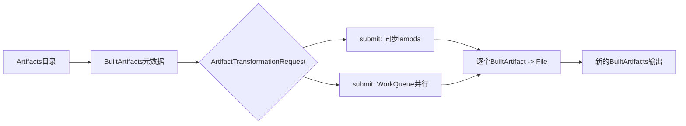
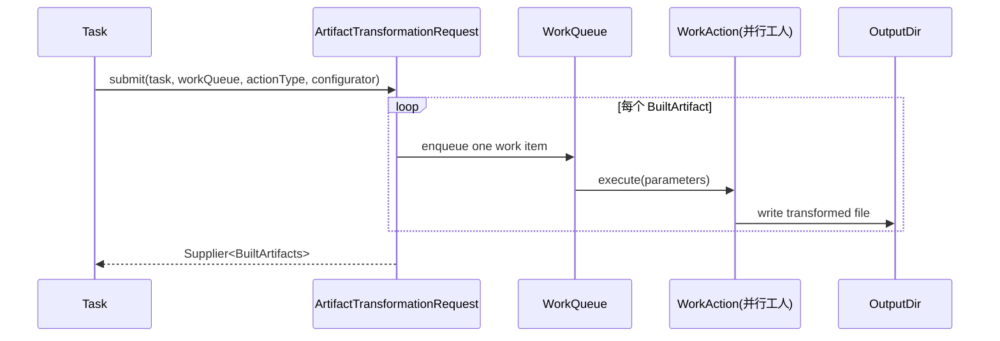
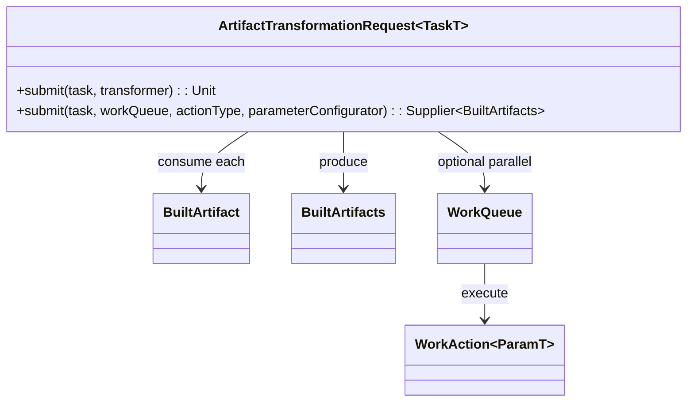

# 21.1.19 工件转换请求

帐篷拉链被轻轻拨开时，夜色已经不再是纯黑。

洛芙抱着保温杯钻出来，踩到草地的一瞬间“嘶”了一声，鞋底被露水冻得发凉。

希尔正蹲在折叠桌边，拿着记号笔在白板上画方框，头发被凌晨的风吹得一翘一翘。

“昨晚我们把 `ArtifactKind.FILE` 讲明白了，”黛琳把暖灯调低一点，声音很轻，“今天要解决一个更像工程现场的问题：不是‘文件是什么’，而是‘一堆文件怎么优雅地挨个处理’。”

伊莎把小饼干盒递给洛芙，眨眨眼：“想象你有一篮子同款苹果，但每颗大小不同。你不是先把篮子抬起来啃，而是一颗一颗挑、洗、切。`ArtifactTransformationRequest` 就是那双会帮你递苹果的手。”

洛芙捧着杯子点头：“所以它是……转换请求？像一个‘请系统帮我逐个处理构建产物’的委托单？”

“对。”黛琳在白板上写下第一句定义，“它是 AGP（Android Gradle Plugin）里一个接口：`ArtifactTransformationRequest<TaskT : Task>`。核心目标有两件事——第一，帮你绕开手动读写 `BuiltArtifacts` 元数据的麻烦；第二，允许你按‘一个 `BuiltArtifact` 一次处理’的方式写转换逻辑。”

希尔啪地打了个响指：“并且它还支持 `WorkQueue`，也就是 Gradle 的工人队列。你可以让多个工件并行跑，不用你自己手搓线程池。”

洛芙“哦哦哦”地连写三遍，忽然抬头：“等等，为什么会有‘一堆工件’？`SingleArtifact.APK` 不就是单个 APK 吗？”

黛琳笑了笑，把白板往她那边转：“名字叫 Single，不代表每次构建都只会有一个实体文件。比如按屏幕密度拆分，可能会生成多个 APK；它们在同一个目录里，由 `BuiltArtifacts` 清单来描述。”

她补上一行：

- 目录里有 N 个 APK 文件
- `BuiltArtifacts` 记录它们的输出路径与属性
- 转换时需要逐个读取输入，逐个生成输出

“如果不用 `ArtifactTransformationRequest`，”希尔接话，“你就得自己加载 metadata 文件、循环、拼输出文件名、再回写 metadata。写起来很容易踩坑。”

洛芙吸了口气：“这听起来像我会写崩的那种代码……”

“太真实了。”伊莎笑出声，“凌晨写脚本，最怕的就是‘我以为自己在搬箱子，结果把标签全撕掉了’。”

黛琳在白板上画了第一张流程图。



“图 1 对应代码片段 A（行 92-133）和代码片段 B（行 136-203）。”黛琳用笔尖敲了敲 `submit` 两个分支，“你会看到两种提交方式，其实是同一套思想的两种速度档。”

洛芙揉揉眼睛：“先讲慢速档，我现在脑袋还是睡袋模式。”

“好，先看第一个 `submit`。”

希尔把电脑转过来，屏幕亮度调到最低，开始敲示例。

```kotlin
// 代码片段 A：同步 lambda 版（教学化最小示例）
// 依赖：AGP Variant API + Kotlin DSL
// 作用：对每个 BuiltArtifact 逐个计算输出文件

abstract class RenameApkTask : DefaultTask() {

    @get:InputFiles
    abstract val apkFolder: DirectoryProperty

    @get:OutputDirectory
    abstract val outFolder: DirectoryProperty

    @get:Internal
    abstract val transformationRequest: Property<ArtifactTransformationRequest<RenameApkTask>>

    @TaskAction
    fun run() {
        transformationRequest.get().submit(this) { input: BuiltArtifact ->
            val inFile = File(input.outputFile)
            val renamed = inFile.nameWithoutExtension + "-camp" + ".apk"
            File(outFolder.asFile.get(), renamed)
        }
    }
}
```

“这一版的签名很短。”黛琳念给洛芙听，“`submit(task, transformer: (BuiltArtifact) -> File)`。意思是：给我一个任务对象，再给我一个转换函数。系统会把每个输入 `BuiltArtifact` 交给你，你只要返回它要写到哪里。”

洛芙盯着 `File(outFolder..., renamed)`：“就是我不用去维护总清单了？”

“对。”

“我不用自己把新旧路径映射成 metadata？”

“也对。”

“我不用担心漏掉某个 split APK？”

“只要输入里有，它就会过你的 lambda。”

洛芙抱紧杯子，眼睛亮起来：“这也太救命了。”

伊莎轻声说：“像有人在你身后把每一张快递单都排好，你只专心写收件地址。”

风从营地旁的杉树间穿过，哗啦一声。

希尔在白板右侧写下第二个重载：

- `submit(task, workQueue, actionType, parameterConfigurator): Supplier<BuiltArtifacts>`

“这是并行档。”她说，“当转换工作本身很重，比如还要压缩、签名、二进制改写，就该把每个工件丢给 `WorkAction` 工人去跑。”

洛芙挠挠脸：“`Supplier<BuiltArtifacts>` 是什么意思？”

黛琳回答得很慢：“它表示一个‘稍后可取结果’的供给器。你把工作提交出去，Gradle worker 执行，最后由 `Supplier` 提供新的 `BuiltArtifacts` 视图。它比同步 lambda 更适合吞吐量场景。”

她又画了第二张图。



“图 2 对应代码片段 B（行 136-203）。”黛琳说，“注意角色分工：`parameterConfigurator` 负责‘把每个输入映射成参数 + 输出路径’，`WorkAction.execute()` 负责‘真正干活’。”

希尔把完整示例贴出来。

```kotlin
// 代码片段 B：WorkQueue 并行版（贴近官方示例）
// 依赖：Gradle Worker API

interface CopyParams : WorkParameters {
    val inputApkFile: RegularFileProperty
    val outputApkFile: RegularFileProperty
}

abstract class CopyWorkAction : WorkAction<CopyParams> {
    override fun execute() {
        val inFile = parameters.inputApkFile.asFile.get()
        val outFile = parameters.outputApkFile.asFile.get()
        inFile.copyTo(outFile, overwrite = true)
    }
}

abstract class CopyApksTask @Inject constructor(
    private val workers: WorkerExecutor
) : DefaultTask() {

    @get:InputFiles
    abstract val apkFolder: DirectoryProperty

    @get:OutputDirectory
    abstract val outFolder: DirectoryProperty

    @get:Internal
    abstract val transformationRequest: Property<ArtifactTransformationRequest<CopyApksTask>>

    @TaskAction
    fun taskAction() {
        val supplier = transformationRequest.get().submit(
            this,
            workers.noIsolation(),
            CopyWorkAction::class.java
        ) { builtArtifact: BuiltArtifact, outputLocation: Directory, param: CopyParams ->
            val inputFile = File(builtArtifact.outputFile)
            val outputFile = File(outputLocation.asFile, inputFile.name)
            param.inputApkFile.set(inputFile)
            param.outputApkFile.set(outputFile)
            outputFile
        }

        // 某些场景可继续传递 supplier，而不是立刻求值
        logger.lifecycle("Transformation submitted: {}", supplier)
    }
}
```

“`workers.noIsolation()` 和 `classLoaderIsolation()` 怎么选？”洛芙问。

希尔把手背贴在保温杯上暖了一下：“看你 `WorkAction` 干的事。简单文件复制、重命名，`noIsolation()` 通常够；涉及复杂依赖冲突就考虑隔离。核心是别盲目并行，把稳定性当祭品。”

黛琳点头：“还有个关键点：`parameterConfigurator` 要返回最终输出 `File`。这不是装饰，是让 API 明确知道‘这个输入工件的结果文件在哪里’。”

洛芙写下粗体：**返回 File 不是可选糖衣，是映射关系本体**。

伊莎看着她写字，忽然笑了：“你现在像在给每颗星星系红绳。输入哪颗星，最终会落到哪条轨道，必须说清楚。”

这时希尔故意咳了一声：“好，来一段反模式。凌晨最容易犯这种。”

她写出“坏味道实现”。

```kotlin
// 反模式示例：手动遍历目录 + 共享可变状态 + 覆盖输出名
// 问题：
// 1) 没有使用 BuiltArtifacts 清单，可能漏处理或顺序错乱
// 2) 输出文件名固定，多个输入会互相覆盖
// 3) 并行时共享计数器不安全

var index = 0
val out = File(outDir, "result.apk")
File(apkDir).listFiles()?.forEach { input ->
    index++
    input.copyTo(out, overwrite = true)
}
println("processed=$index")
```

洛芙皱眉：“这个看起来短，但真的很危险……”

“是。”黛琳接过笔，“我们重构成请求式。”

```kotlin
// 重构后：以 BuiltArtifact 为单元，输出名稳定且可追踪
// 优点：
// 1) 输入来源由 AGP 提供，和变体工件一致
// 2) 每个输入映射唯一输出，避免覆盖
// 3) 可平滑切换到 WorkQueue 并行

transformationRequest.get().submit(this) { input: BuiltArtifact ->
    val source = File(input.outputFile)
    val stableName = source.nameWithoutExtension + "-optimized.apk"
    File(outFolder.asFile.get(), stableName)
}
```

“看见差别了吗？”黛琳问。

“嗯，”洛芙点点头，“以前是‘我猜目录里有什么’，现在是‘系统明确告诉我有什么’；以前是‘大家往同一个桶里倒’，现在是‘每个输入都有自己的出口’。”

“答得漂亮。”希尔冲她竖拇指。

营地外侧突然传来一声鸟叫，短促又清亮，像在提醒天快亮了。

洛芙翻到新页，忽然停住：“我还有个旧习惯问题。以前在 App 层我处理任务，经常会把重活塞进 `Activity.onCreate()`，结果首帧卡顿。这里是不是同理——不要把重转换直接堵在任务主流程里？”

“完全同理。”黛琳说，“虽然这是构建期，不是运行期，但思想一致：生命周期入口要轻，重活分流到合适机制。”

她顺手画了个“跨场景类比表”：

- App 运行期：`onCreate()` 只做初始化，重活放 `WorkManager` / 协程
- 构建期：Task action 只做编排，重转换放 `WorkQueue` `WorkAction`

希尔补充：“你还记得权限流吗？运行期要按流程申请相机、位置权限；构建期也有‘流程意识’，例如输入输出声明（`@InputFiles`、`@OutputDirectory`）要完整，不然增量构建和缓存会乱。”

伊莎把一根树枝放进炭火，火星轻轻一跳：“不同世界，同一种礼貌。你先告诉系统你要什么，再请它给你路。”

洛芙笑得很轻：“我好像开始理解‘工程感’这个词了。”

“再加一个你最喜欢的‘能跑的证据’。”希尔说完敲出测试片段，“这个不是 AGP 集成测试，而是一个最小单元测试思路：验证映射函数不会产生命名冲突。”

```kotlin
// 代码片段 C：最小可运行 Kotlin 单元测试（JVM）
// 依赖：testImplementation("org.junit.jupiter:junit-jupiter:5.10.2")

import org.junit.jupiter.api.Assertions.assertEquals
import org.junit.jupiter.api.Assertions.assertTrue
import org.junit.jupiter.api.Test
import java.io.File

class OutputNameMappingTest {

    private fun mapName(inputPath: String): String {
        val f = File(inputPath)
        return f.nameWithoutExtension + "-camp.apk"
    }

    @Test
    fun `should map different inputs to different outputs`() {
        val in1 = "/tmp/app-xhdpi.apk"
        val in2 = "/tmp/app-xxhdpi.apk"

        val out1 = mapName(in1)
        val out2 = mapName(in2)

        assertTrue(out1.endsWith("-camp.apk"))
        assertTrue(out2.endsWith("-camp.apk"))
        assertTrue(out1 != out2)
        assertEquals("app-xhdpi-camp.apk", out1)
    }
}
```

希尔在下方贴了一段执行输出。

```text
OutputNameMappingTest > should map different inputs to different outputs() PASSED

BUILD SUCCESSFUL in 1s
1 test completed, 1 succeeded
```

“这就是最小防线。”她说，“先把命名映射这种纯逻辑测牢，再接 AGP 真环境，调试成本会小很多。”

洛芙咬着笔帽，忽然又冒出一串问题：“那 `submit` 的同步版和并行版，我什么时候该选哪个？有没有一个一眼能用的判断？”

黛琳直接给了四条：

1. **转换很轻**（改名、简单拷贝）→ 先用同步 lambda。
2. **转换很重**（压缩、解析、签名再处理）→ 用 `WorkQueue` 并行版。
3. **需要精细参数**（每个工件要不同参数）→ 并行版更清晰。
4. **团队新人多**、先追可读性 → 先同步版，稳定后再并行化。

“还有一个隐藏条件，”希尔说，“你要不要拿到 `Supplier<BuiltArtifacts>` 继续串后续流程。比如后面还有二次处理任务，这个返回值会很有用。”

伊莎把手掌伸到火边，像在托一颗看不见的球：“同步版像你亲手一颗颗抛球；并行版像你雇了几位可靠助手，球还是那批球，但轨迹变得更密更快。”

洛芙低头看自己写满的笔记页，突然笑了：“所以 `ArtifactTransformationRequest` 不是‘替我转换’，它是‘替我管理转换流程中的重复劳动’，让我专注每个输入怎么变成输出。”

黛琳很满意地点头：“这句话可以写在你今天日记第一页。”

营地另一侧的天幕开始发白，蝉鸣退到更远的地方。

洛芙把笔记本合上，又重新打开：“最后一个确认。它为什么强调 `BuiltArtifact`，不直接给我 `File`？”

黛琳回答得很干净：“因为 `BuiltArtifact` 不只有路径。它还承载与变体相关的信息。只给 `File` 会丢上下文，工程里一丢上下文，后面就会靠猜。”

“而且，”希尔补了一句，“API 设计成‘一个 `BuiltArtifact` → 一个输出 `File`’，就是在强迫你把映射关系写清楚。这种强迫是好事。”

伊莎笑着看向天边：“像清晨的风，轻轻地，但会把雾吹开。”

洛芙慢慢点头。

她把保温杯最后一口热可可喝完，呼出一口白气。

“数据应该待在哪里，取决于它要活多久；转换应该怎么提交，取决于它要跑多重。”她轻声复述。

黛琳把白板收起，希尔把电脑扣上，伊莎把饼干盒盖好。

第一缕真正的晨光落在桌角，像给那行 `submit(...)` 镀了一层很薄的金边。

---

> **ArtifactTransformationRequest（工件转换请求）定义**：`ArtifactTransformationRequest` 是 Android Gradle Plugin 中用于按 `BuiltArtifact` 粒度提交工件转换的接口。它屏蔽了手动读写 `BuiltArtifacts` 元数据的复杂度，支持同步 lambda 与基于 `WorkQueue` 的并行 `WorkAction` 两种处理模式。

#### 结构图（必须）



上图展示了接口核心关系：输入是逐个 `BuiltArtifact`，输出汇总为 `BuiltArtifacts`，并可借助 `WorkQueue` 扩展并行能力。

#### 复杂度与影响

- 同步 lambda 版实现成本低、可读性高，适合轻量转换；吞吐量受单线程限制。
- `WorkQueue` 并行版可提升大批量工件处理效率，但参数设计与调试复杂度更高。
- 使用接口封装后，维护成本通常低于手写 metadata 解析方案，减少因格式变更导致的脆弱代码。

#### 反模式与陷阱（≥3 条）

1. 手动扫描目录替代 `BuiltArtifact` 输入 → 修复：始终以 `submit` 回调参数为真实输入源。  
2. 所有输入输出到同名文件 → 修复：基于输入名或属性构造稳定且唯一的输出名。  
3. 在 `TaskAction` 中执行大体量 CPU/IO 串行重活 → 修复：迁移到 `WorkQueue` + `WorkAction`。  
4. 忘记声明 `@InputFiles` / `@OutputDirectory` → 修复：补齐任务输入输出注解，保障增量与缓存行为。  

#### 名词小传（可选）

`BuiltArtifacts` 是 AGP 为多产物场景设计的元数据容器，常见于 split APK / 多变体输出。`ArtifactTransformationRequest` 的价值在于让插件作者不用直接维护这层元数据细节。

#### 设计哲学：把重复劳动交给框架，把业务决策留给你

1. 以“单工件映射”为最小操作单位，降低认知负担。  
2. 输入输出关系必须显式化，拒绝隐式目录猜测。  
3. 轻任务优先简单路径，重任务再引入并行。  
4. 先保证可追踪性，再追求吞吐量。  
5. 构建期编排与运行期调度遵循同一原则：入口轻、重活分流。  

---

#### 🏕️ 动手练习（项目制）

项目目标：做一个“APK 产物重命名与复制插件小样”，分别实现同步版与并行版转换。

**Task 1（★）**  
1) 目标：搭建最小 Gradle 插件项目骨架。  
2) 你需要做的事：创建 `buildSrc` 或独立插件模块；启用 Kotlin DSL；声明 AGP API 依赖。  
3) 验收标准：  
- [ ] 插件可被应用到测试 app 模块  
- [ ] 能在配置阶段打印插件加载日志  
4) 提示：
```kotlin
class CampPlugin : Plugin<Project> {
    override fun apply(project: Project) {
        project.logger.lifecycle("CampPlugin loaded")
    }
}
```

**Task 2（★★）**  
1) 目标：实现同步 `submit(task, transformer)` 路径。  
2) 你需要做的事：定义 `RenameApkTask`，声明输入输出属性，接入 transformationRequest 并返回新文件名。  
3) 验收标准：  
- [ ] 每个输入 APK 都生成 `-camp.apk` 输出  
- [ ] 无文件覆盖冲突  
4) 提示：
```kotlin
transformationRequest.get().submit(this) { built ->
    val src = File(built.outputFile)
    File(outDir.get().asFile, src.nameWithoutExtension + "-camp.apk")
}
```

**Task 3（★★★）**  
1) 目标：实现并行 `submit(...workQueue...)` 路径。  
2) 你需要做的事：定义 `WorkParameters` + `WorkAction`；在 configurator 中设置输入输出文件。  
3) 验收标准：  
- [ ] 构建日志显示 work items 被提交  
- [ ] 输出文件数量与输入一致  
4) 提示：
```kotlin
workers.noIsolation()
```

**Task 4（★★★）**  
1) 目标：为输出命名策略写单元测试。  
2) 你需要做的事：抽离 `mapName()` 纯函数；覆盖普通名、带后缀名、重复输入场景。  
3) 验收标准：  
- [ ] 关键测试用例全部通过  
- [ ] 不同输入不会映射到同一路径  
4) 提示：
```kotlin
assertTrue(mapName("a.apk") != mapName("b.apk"))
```

**Task 5（★★★★）**  
1) 目标：加入失败保护与日志。  
2) 你需要做的事：在 `WorkAction` 捕获异常并记录输入路径；对失败项输出明确错误。  
3) 验收标准：  
- [ ] 失败时能定位具体输入工件  
- [ ] 构建失败信息可读  
4) 提示：
```kotlin
try { /* copy */ } catch (e: Exception) { throw GradleException("fail: $inFile", e) }
```

**Task 6（★★★★）**  
1) 目标：比较同步版与并行版耗时。  
2) 你需要做的事：准备 20+ 模拟输入文件；记录两版执行时间。  
3) 验收标准：  
- [ ] 有一份对比表（输入数、总时长）  
- [ ] 给出你的方案选择结论  
4) 提示：
```kotlin
val start = System.currentTimeMillis()
```

**Task 7（★★★★★）**  
1) 目标：把 `Supplier<BuiltArtifacts>` 接到下游任务。  
2) 你需要做的事：实现二次处理任务，读取上游转换结果并打印摘要。  
3) 验收标准：  
- [ ] 下游能消费上游转换结果  
- [ ] 任务依赖关系正确  
4) 提示：
```kotlin
val resultSupplier: Supplier<BuiltArtifacts> = ...
```

**Task 8（★★★★★）**  
1) 目标：完成一次端到端演示。  
2) 你需要做的事：从原始 APK 输入到最终输出，跑通日志、校验、失败提示。  
3) 验收标准：  
- [ ] 全流程可重复执行  
- [ ] 文档写清“何时选同步/并行”  
4) 提示：把本章“四条判断规则”写进 README。

**面试热身（Q1-Q5）**

- Q1：为什么 `ArtifactTransformationRequest` 选择 `BuiltArtifact` 作为输入，而不是直接 `File`？
- Q2：同步 submit 与 WorkQueue submit 的取舍标准是什么？
- Q3：`parameterConfigurator` 为什么要返回 `File`？
- Q4：如果输出命名冲突，会导致什么构建问题？如何防？
- Q5：你会如何向新人解释“构建期编排”和“运行期调度”的共通设计思想？

#### 参考实现要点（5 条）

1. 先实现同步版，验证映射正确，再升级并行版。  
2. 输出路径命名必须稳定、可追踪、可复现。  
3. `WorkAction` 只做单工件处理，避免跨工件共享可变状态。  
4. 任务输入输出声明齐全，尊重 Gradle 增量构建模型。  
5. 用最小单元测试守住纯逻辑（命名/路径映射）再进集成验证。  

---

> 学习建议：先把“一个输入工件对应一个输出文件”的映射思维练到本能，再考虑并行化。工程优化的顺序永远是：正确性 > 可追踪性 > 性能。

## 🍹洛芙的小小日记本

凌晨的风好凉，但我今天脑子很亮。原来厉害的 API 不是替我做一切，而是帮我把重复和混乱拿走。先把映射写清楚，再去追求快，心里就不慌啦。

## 今日关键词

- **ArtifactTransformationRequest**：AGP 中的工件转换请求接口，负责按 `BuiltArtifact` 粒度提交转换任务。  
- **Task**：Gradle 的任务类型，构建流程中的基本执行单元。  
- **BuiltArtifact**：单个构建产物及其相关信息的表示，不只是文件路径。  
- **BuiltArtifacts**：多个 `BuiltArtifact` 的集合与元数据描述。  
- **submit**：提交转换工作的 API 方法，本章有同步与并行两个重载。  
- **transformer lambda**：同步版 `submit` 里处理单个输入并返回输出 `File` 的函数。  
- **WorkQueue**：Gradle 的并行工作队列，用于分发 worker 任务。  
- **WorkAction**：在 worker 中执行的具体工作逻辑类。  
- **WorkParameters**：传递给 `WorkAction` 的参数接口。  
- **parameterConfigurator**：为每个 `BuiltArtifact` 配置参数并返回输出文件的回调。  
- **Supplier<BuiltArtifacts>**：可延后获取转换结果集合的提供器。  
- **DirectoryProperty**：Gradle 的目录型属性，常用于任务输入输出声明。  
- **RegularFileProperty**：Gradle 的文件型属性，用于 worker 参数等场景。  
- **@InputFiles**：声明任务输入文件集合，供增量与缓存判断。  
- **@OutputDirectory**：声明任务输出目录。  
- **@TaskAction**：标记任务执行入口方法。  
- **noIsolation**：Worker 执行隔离级别之一，开销较低，适合简单场景。  
- **split APK**：按设备条件（如密度）拆分出的多个 APK。  
- **metadata（元数据）**：描述产物关系和属性的数据，供构建系统追踪。  
- **增量构建**：只重建变化部分以缩短构建时间的机制。  
- **命名映射**：把输入文件名稳定映射到输出文件名的规则。  
- **反模式**：看起来省事但长期高风险的实现方式，如手动扫目录并覆盖输出。  
- **重构**：在不改变目标行为前提下改进代码结构与可维护性。  
- **生命周期（Activity）**：运行期组件状态变化过程，本章用来类比“入口轻、重活分流”。  
- **WorkManager**：运行期后台任务框架，本章用于与构建期 WorkQueue 做思想对照。  
- **SharedPreferences / Room**：运行期数据存储方案，本章作为“数据该放哪”的工程类比。  
- **运行时权限**：如相机、位置权限申请流程，本章借用其“先声明再执行”的流程意识。  
- **Retrofit / Intent Filter / 传感器 / 相机 / 位置**：Android 常见能力域，本章用于强调跨领域一致的工程设计习惯。