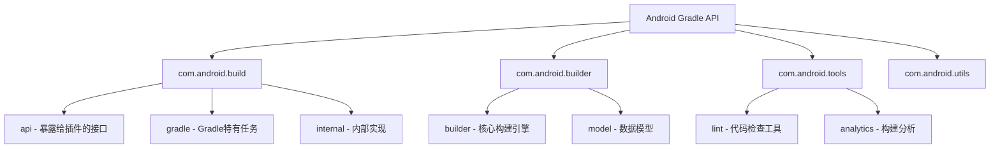
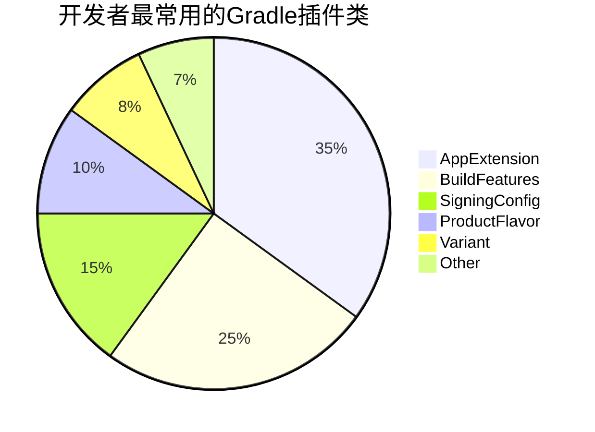
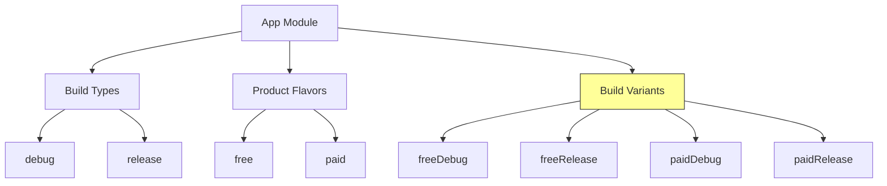
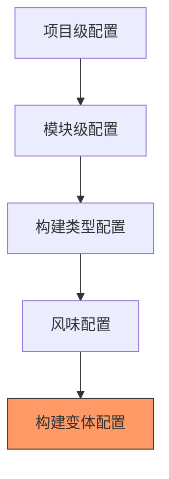
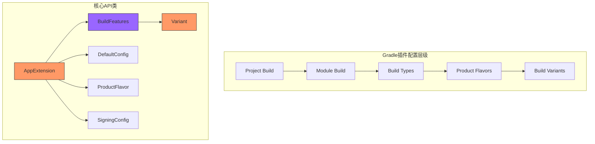

# 21.1.2 类别索引

午后的阳光像融化的蜂蜜一样，懒洋洋地流淌在帐篷顶上。远处的蝉鸣声一浪一浪地从树梢涌来，热浪让空气都变得黏糊糊的。

黛琳把白板支在一棵老橡树的树荫下，笔尖在板面上敲了敲："昨天的API还记得多少？"

洛芙想了想："就是那个……软件可以扩展Gradle功能的东西嘛！"

"对，"黛琳微微一笑，"那今天我们来玩一个更有趣的游戏——去Gradle的宝山里挖宝。"

"挖宝？"希尔立刻抬起头，眼睛亮了起来，"是不是那个Class Index？！”

"正是，"黛琳点点头，"Android Gradle插件的类别索引，就像一张藏宝图，标记了所有你能用的工具类和方法。学会看这张图，你以后遇到任何构建问题，都能自己找到答案。"


## 宝山之门：什么是类别索引

伊莎捧着一杯冰镇柠檬水，吸管在杯子里转了两圈："黛琳说的类别索引，是不是就像……图书馆的目录卡片？"

"差不多，"黛琳在白板上写下几个大字——Class Index，"你走进一座巨大的图书馆，里面有成千上万本书。类别索引就是指引你快速找到想要那本书的目录系统。"

"如果没有这个目录呢？"洛芙好奇地问。

"那就只好一本一本翻了，"黛琳耸耸肩，"想象一下你要找一个关于'如何压缩APK'的方法，没有目录的话，你可能要把整个图书馆翻个遍。但有了类别索引，你可以直接奔向'Build'相关的那一排书架。"

希尔已经迫不及待地打开了电脑："我找到了！这是Android Gradle API 9.0的官方类别索引页面……哇，好多类啊！"

洛芙探过头去，屏幕上显示着一长串的类名列表，从A开头一直到Z：

- AppExtension
- Artifact
- BuildFeatures
- NdkBuildOptions
- SigningConfig
- Variant
- ...

"好多啊……"洛芙看得头晕，"这些都代表什么？"

"别急，"黛琳走到希尔旁边，指着屏幕说，"我们先来看几个最核心的包——就像图书馆里最重要的几个区域。"


## 图书馆的四大区域

黛琳拿起白板笔，在白板上画了一个大大的书架示意图：



"整个API可以分为四大区域，"黛琳一边画一边解释，"每个区域负责不同的事情。"

### com.android.build：插件的face

"这个包是和我们开发者直接打交道的部分，"黛琳用笔尖点了点白板上的"com.android.build"，就像敲门砖一样——你要修改构建配置，首先就要和这个包里的类对话。”

"具体包含什么？"洛芙掏出小本本准备记录。

"很多，我举几个最常用的，"黛琳如数家珍：

- **AppExtension** —— 你的app模块的总管，掌控所有构建配置
- **BuildFeatures** —— 开关，控制哪些功能启用（比如BuildConfig、Resources）
- **NdkBuildOptions** —— NDK构建相关配置
- **SigningConfig** —— 签名配置，谁来签名、怎么签
- **Variant** —— 构建变体（debug、release、各种flavor）

"就像一个公司的各个部门经理？"洛芙突然想到。

"非常准确的比喻！"伊莎轻轻鼓掌，"每个'部门经理'都管着一摊具体的事情。"

### com.android.builder：真正的建筑工人

"这个包是背后的功臣，"黛琳把笔尖移到"com.android.builder"区域，“如果说build包是'设计图'，那builder包就是真正搬砖盖楼的人。”

希尔操作性很强，立刻补充道："我之前查过，这个包里的类主要是处理字节码、生成DEX、打包资源这些底层活儿。"

"对，"黛琳点头，"普通开发者一般不会直接用到这个包，但当你需要做一些高级定制——比如自定义编译器插件——就需要和它打交道了。"

### com.android.tools：工具箱

"这个包名字最长，但也最直观——就是'工具'的意思，"黛琳笑着说，"lint代码检查、构建分析、调试工具……都在这里。"

洛芙想起之前希尔用过lint检查代码："就是那个会挑我们代码毛病的lint？”

"对，就是它，"希尔点点头，"LintAnalysisManager、LintViewerDialog……都是这个包里的类在起作用。"

### com.android.utils： utility functions

"最后是util包，就像名字说的，这是一个工具箱，"黛琳比划着，"各种零散的小工具：字符串处理、文件操作、并行计算……都是些不大但不可或缺的零件。"

"感觉就像……"伊莎想了想，"露营时的瑞士军刀？不大，但关键时刻什么都能开。"


## 实战演练：找到你的宝藏

"好，区域划分讲完了，"黛琳把笔放下，"现在我们来玩真的——假设你现在有一个具体需求，你该怎么在类别索引里找到对应的类？”

"什么需求？"洛芙问。

"比如——我想在构建时自动给APK的版本号加上构建时间的后缀，该找哪个类？”

洛芙盯着屏幕上的类列表看了半天，摇摇头："不知道……”

"来，我们一起推理，"黛琳引导道，"版本号属于什么？”

"签名……不对，应该是……产品配置？”

"对，版本号是'产品配置'的一部分，"黛琳指着屏幕上的"ProductFlavor"和"DefaultConfig"类，"在Gradle插件里，版本号属于defaultConfig或productFlavors。而这两个类，都归AppExtension管。”

"所以应该先找AppExtension？"洛芙明白了。

"对，这就是类别索引的用法——先想清楚你要配置的东西属于哪个领域，然后去找对应的类，"黛琳总结道，"这个过程就像查字典：先确定偏旁部首，再找目标字。"


## 常见宝藏排行榜

黛琳打开了一个新的页面，上面显示着开发者最常用的类：



"在实际项目中，有几个类是几乎每天都会打交道的，"黛琳圈出几个重点：

### AppExtension —— 大管家

"AppExtension是你的app模块的'大管家'，"黛琳调出官方文档，"它定义了android {}闭包里的所有配置。”

洛芙翻开自己的项目，找到build.gradle文件："原来android {}这个大括号，就是AppExtension的入口？”

"对，android {}闭包里的所有东西——compileSdkVersion、defaultConfig、buildTypes、productFlavors……都是AppExtension的属性，"黛琳点头，"你只要记住这个名字，下次查文档就知道该从哪开始。"

### BuildFeatures —— 开关面板

"这个类控制着构建的各种'开关'，"黛琳着重强调，"比如你要不要生成BuildConfig类？要不要启用R8混淆？要不要打多个APK？”

"感觉像控制面板，"洛芙说。

"没错，而且它是可以动态配置的，"希尔补充道，"你可以在不同的构建变体里开启不同的功能，非常灵活。"

### SigningConfig —— 门禁卡

"签名配置很好理解，就是'谁有权进入'的问题，"黛琳举例，"debug签名、release签名、不同的渠道签名……每个都是一把'门禁卡'。”

洛芙想起之前配置多渠道打包时的经历："好像每次都要配置签名路径和密码之类的……”

"对，那就是在配置SigningConfig，"黛琳说。


## 索引的使用技巧

"类别索引不只是让你一个一个类往下翻的，"黛琳把页面往上拉，露出搜索框，"这里有个很强大的功能——搜索。”

希尔演示了一遍，在搜索框里输入"ndk"：

屏幕上立刻过滤出了所有包含"ndk"的类：

- NdkBuildOptions
- NdkOptions
- NdkSourceSet
- NdkCompileOptions
- ...

"哇！这个功能太实用了！"洛芙惊呼。

"还有更实用的，"黛琳微微一笑，按下键盘上的"/"键，"浏览器自带的页面内搜索也可以用。而且官方文档支持按包名过滤——比如你想只看某个包里的类，可以直接在URL里加参数。”

"URL参数？"洛芙好奇地问。

"对，比如在地址栏里改一下，"黛琳指着浏览器地址栏说，"官方文档支持按包名过滤，这样你就不用在几千个类里大海捞针了。"


## 类与接口的二三事

伊莎歪着头看屏幕："黛琳，我注意到有些是Class，有些是Interface，它们有什么区别吗？”

"你观察得很仔细，"黛琳点点头，"在Java/Kotlin的世界里，Class是'蓝图'，你可以直接new一个实例。Interface是'契约'，它只定义方法签名，具体实现由其他类提供。”

"在Gradle插件的领域里，这个区别意味着——”

黛琳调出了两个例子：

```kotlin
// Class可以直接实例化
val signingConfig = SigningConfig.Builder("myConfig")
    .build()

// Interface需要找实现类
// SigningConfig是一个接口，你需要用Builder来创建实例
```

"所以通常情况下，我们不会直接实现接口，而是调用那些返回接口的工厂方法？"洛芙问。

"对，这是Gradle插件API的一个特点——大量使用Builder模式和接口分离，"黛琳解释道，"这样设计的好处是，API的实现可以随时替换，但接口保持不变。"


## 文档的正确打开方式

"说了这么多，"希尔活动了一下手指，"我们来看看官方文档的正确用法吧。”

她点开一个类的详细页面：


"看到没，每个类的文档都长这样，"希尔解释道，"我一般先看继承关系——知道它爸是谁，就能猜到它能继承什么功能。然后看属性和方法列表——最后再看示例。”

"看示例是最快的学习方法，"黛琳补充道，"直接复制粘贴，改一改参数，就能跑起来。”

洛芙跃跃欲试："那我试试看？”

她选中一个类——ProductFlavor——滚动到代码示例部分：

```kotlin
android {
    defaultConfig {
        applicationId "com.example.myapp"
        minSdk 21
        targetSdk 34
        versionCode 1
        versionName "1.0"
        
        // 在这里配置多维度支持
        vectorDrawables {
            useSupportLibrary true
        }
    }
}
```

"原来defaultConfig就是这样配置的！"洛芙兴奋地说，"感觉好直观！"


## 举一反三：变体的世界

"接下来我们讲一个进阶话题——Variant，变体，"黛琳的表情认真起来，"这是很多开发者头疼的地方。”

"变体我知道！"希尔抢答，"就是debug版本和release版本的区别嘛！”

"远不止于此，"黛琳摇摇头，打开白板开始画图：



"在Gradle插件里，'变体'是构建类型和产品风味的组合，"黛琳解释道，"debug × free = freeDebug，release × paid = paidPaid……每个组合都是一个独立的变体。”

洛芙数了数："如果我有2种构建类型和3种风味，那就是6个变体？”

"对，就是这个数学关系，"黛琳点头，"每个变体都有自己的配置——应用ID、版本号、签名、资源目录……都可以独立设置。”

"这就是为什么有时候我改了一个参数，出来的APK却没变化——因为改错变体了！"希尔一拍脑袋。


## 配置的艺术：分层与合并

"最后，我想讲一个很多新手容易踩的坑，"黛琳的表情变得严肃，"关于配置的分层与合并。”

她打开一个示例项目：

```kotlin
// 根build.gradle
allprojects {
    repositories {
        google()
        mavenCentral()
    }
}

// app/build.gradle
android {
    compileSdk 34
    
    defaultConfig {
        applicationId "com.example.app"
        minSdk 21
    }
}
```

"这里的层级关系是这样的，"黛琳画了一个金字塔：



"越往下，优先级越高，"黛琳解释，"如果defaultConfig和productFlavor都设置了applicationId，风味配置会覆盖默认配置。如果release版本又设置了，那就是release覆盖风味。”

"原来是这样……"洛芙若有所思，"那如果我想让某个配置对所有变体生效，应该放在越高的地方越好？”

"对，项目级的配置对所有模块生效，模块级的配置对所有变体生效——但具体的变体配置优先级最高。"


## 学以致用：洛芙的第一次探索

"听完这些，"洛芙深吸一口气，"我想自己试试看！”

她打开浏览器，在类别索引里搜索"applicationId"：

搜索结果瞬间过滤出了所有包含这个关键词的类：

- DefaultConfig
- ProductFlavor
- ApplicationIdScenario
- VariantConfiguration

"我知道了！applicationId主要在DefaultConfig和ProductFlavor里配置！"洛芙兴奋地说。

"很好，"黛琳露出赞许的微笑，"这就是类别索引的正确用法——带着问题找答案，而不是从头读到尾。"


## 小结：类别索引的使用心法

傍晚的阳光变得柔和起来，金色的余晖透过树叶的缝隙，在白板上洒下点点光斑。

"最后总结一下今天的内容，"黛琳把白板擦干净，只留下几个关键词：

1. **类别索引是地图**——帮你快速定位想要的类
2. **四大包是区域**——build/api、builder、tools、utils各司其职
3. **常用类是热门景点**——AppExtension、BuildFeatures、SigningConfig……这些必须熟悉
4. **搜索是神器**——用好搜索功能和包名过滤
5. **文档要看继承关系**——知道父类就知道它能继承什么功能
6. **配置有优先级**——越具体优先级越高

伊莎伸了个懒腰："感觉今天收获满满的呢~”

"有了这张藏宝图，"希尔挥舞着笔记本，"以后就不怕在Gradle的世界里迷路了！”

洛芙看着手里的笔记本，上面密密麻麻记录着今天的知识点："原来学构建配置也能这么有趣……”

远处的山峦轮廓渐渐模糊，暮色四合，露营的一天又要过去了。

---

## 核心机制定义

### 类别索引（Class Index）
Android Gradle插件API的完整类列表，相当于API的地图目录，提供所有可用的公开类、接口、方法的索引和导航。

### 四大核心包
- **com.android.build**：Gradle插件的主要API包，包含暴露给开发者的接口和配置类
- **com.android.builder**：构建引擎的核心包，处理底层编译、打包、DEX生成等工作
- **com.android.tools**：工具包，包含lint代码检查、构建分析等辅助工具
- **com.android.utils**：工具函数包，提供各种辅助方法和零散工具

### 关键概念
- **AppExtension**：Android Gradle插件的主入口类，定义android {}闭包中的所有配置
- **BuildFeatures**：构建功能开关，控制BuildConfig、R8、资源优化等特性的启用状态
- **Variant**：构建变体，代表构建类型与产品风味的笛卡尔积（如freeDebug、paidRelease）
- **ProductFlavor**：产品风味，用于创建同一应用的不同版本（免费版/付费版）
- **SigningConfig**：签名配置，管理应用的签名密钥、别名、密码等信息
- **DefaultConfig**：默认配置类，设置所有变体共用的基础配置



---

## 反模式与陷阱

### 1. 盲目遍历所有类
很多初学者试图一次性阅读整个类别索引，结果迷失在数千个类中。**正确做法**：带着具体问题查阅，建立整体认知后按需深入。

### 2. 忽略继承关系
只看当前类的文档，不了解父类能做什么，导致重复造轮子。**正确做法**：先看继承关系图，理解子类从父类继承了哪些能力。

### 3. 混用配置层级
在错误的层级配置参数，导致配置不生效或覆盖问题。**正确做法**：理解配置优先级——构建变体 > 产品风味 > 构建类型 > 模块配置 > 项目配置。

### 4. 把接口当类用
尝试直接实例化Interface类型的对象。**正确做法**：使用返回接口的工厂方法或Builder模式创建实例。

### 5. 版本号配置错误
在错误的类中配置版本号，导致多渠道打包时版本混乱。**正确做法**：versionCode在DefaultConfig/ProductFlavor中配置，了解变体覆盖规则。

---

## 设计哲学

### 1. 接口分离原则
Gradle插件API大量使用接口而非具体类，实现可替换、API稳定。理解这一设计才能正确使用API。

### 2. Builder模式
复杂对象通过链式调用逐步构建，配置直观、可读性强。如SigningConfig.Builder()、ProductFlavor.Builder()。

### 3. 分层配置
通过project → module → buildType → flavor → variant的层级设计，实现配置的复用与覆盖平衡。

### 4. 约定优于配置
提供合理的默认值，开发者只需关注需要自定义的部分，降低使用门槛。

### 5. 扩展点设计
通过Extension、Task、Transform等机制，为第三方插件提供扩展能力，构建开放生态。

---

## 动手练习

1. **练习一**：在类别索引中搜索"applicationId"，找出所有与applicationId相关的类，记录它们的功能差异

2. **练习二**：创建一个新的Android项目，使用AppExtension配置两种product flavor（free和paid），为每种flavor设置不同的applicationId

3. **练习三**：使用BuildFeatures关闭BuildConfig生成，观察构建产出的变化

4. **练习四**：创建一个自定义SigningConfig，为release构建配置签名信息

5. **练习五**：研究Variant的继承关系，画出AppExtension、BuildType、ProductFlavor、Variant之间的类图

6. **练习六**：配置多维度product flavor（例如：dimension = ["version", "channel"]），理解维度的作用

7. **练习七**：在DefaultConfig中配置multiDexEnabled，观察对构建的影响

8. **练习八**：对比debug和release构建类型的默认配置差异，理解Build Type的作用

9. **练习九**：使用类别索引查找与NDK相关的所有类，了解NdkOptions的配置方式

10. **练习十**：创建一个自定义Task，在构建过程中读取并打印当前的Variant信息

---

## 面试热身

**Q1: 请解释Android Gradle插件中AppExtension的作用，以及它与android {}闭包的关系？**

A1: AppExtension是Android Gradle插件的主入口类，它定义了android {} DSL闭包中的所有配置。当我们在build.gradle中编写android {}闭包时，实际上是在配置AppExtension对象。AppExtension管理着compileSdk、defaultConfig、buildTypes、productFlavors、signingConfigs等核心配置项，是整个Android模块构建配置的入口点。

**Q2: Build Type和Product Flavor有什么区别？它们如何组合成Build Variant？**

A2: Build Type（如debug、release）控制构建的优化级别和调试选项，比如是否启用调试符号、是否进行混淆等。Product Flavor用于创建同一应用的不同版本，比如免费版和付费版、国内版和海外版。Build Variant是二者的笛卡尔积，例如debug×free=freeDebug，release×paid=paidRelease。每个Variant都有独立的配置。

**Q3: Gradle插件API中为什么要大量使用接口而不是具体类？这样设计的好处是什么？**

A3: 好处包括：1) 实现可替换——API实现可以随时升级而不影响使用者；2) 解耦——调用方依赖抽象而非具体实现；3) 扩展性——第三方可以提供接口的不同实现。这是典型的接口分离原则和依赖倒置原则的应用。

**Q4: 配置优先级是怎样的？为什么有时候修改了配置但构建结果没有变化？**

A4: 优先级从低到高：项目级配置 → 模块级配置 → Build Type配置 → Product Flavor配置 → 具体Variant配置。修改不生效的常见原因是修改了较低优先级的配置，但较高优先级已经覆盖了它。比如在defaultConfig中设置了applicationId，但某个flavor中又设置了，flavor会覆盖defaultConfig。

**Q5: 请解释SigningConfig的作用，以及如何为不同的构建变体配置不同的签名？**

A5: SigningConfig管理应用的签名密钥，包括keyAlias、keyPassword、storeFile、storePassword等。在buildTypes中可以指定不同的SigningConfig给debug和release构建。也可以在productFlavors中为不同风味配置不同的签名，实现不同渠道使用不同签名。

---

## 参考实现要点

### AppExtension配置示例
```kotlin
android {
    compileSdk 34
    
    defaultConfig {
        applicationId "com.example.app"
        minSdk 21
        targetSdk 34
        versionCode 1
        versionName "1.0"
    }
    
    buildTypes {
        debug {
            isDebuggable = true
            isMinifyEnabled = false
        }
        release {
            isMinifyEnabled = true
            proguardFiles(...)
        }
    }
    
    flavorDimensions += "version"
    productFlavors {
        create("free") {
            dimension = "version"
            applicationIdSuffix = ".free"
        }
        create("paid") {
            dimension = "version"
            applicationIdSuffix = ".paid"
        }
    }
}
```

### 核心要点
1. **先理解整体结构再深入细节**——先掌握四大包的概念，再针对具体需求查阅
2. **善用搜索功能**——类别索引的搜索是定位类的最快方式
3. **重视文档示例**——官方示例是最可靠的学习资源
4. **理解继承关系**——知道父类能做什么，避免重复劳动
5. **区分接口和类**——接口需要用工厂方法或Builder创建实例
6. **注意配置优先级**——理解覆盖规则，避免配置失效

---

## 学习建议

类别索引是Android Gradle插件开发的核心工具。建议先通读一遍官方索引，建立整体认知；然后在实际项目中遇到问题时，再针对性地查阅具体类。常用类（如AppExtension、BuildFeatures、SigningConfig）建议深入阅读其官方文档和示例代码，理解其设计思想和扩展点。

日常开发中，多尝试在类别索引中搜索自己遇到的问题关键词，比如"apk"、"signing"、"variant"等，逐渐熟悉各类的作用和用法。随着经验积累，你会形成自己的"API地图"，遇到构建问题能快速定位解决方案。

---

## 洛芙的小小日记本

今天黛琳教我看类别索引！原来Gradle API就像一个大图书馆，类别索引是目录。我学会了用搜索快速定位想要的类，还知道了四大包的区别——build是接口，builder是实现，tools是工具箱，utils是小零件。伊莎说的对，这就像在宝山里挖宝一样有趣呀~明天还想探索更多！🌟

---

## 今日关键词

**Class Index（类别索引）**：Android Gradle插件API的完整类列表，相当于API的地图目录。

**com.android.build**：Gradle插件的主要包，包含暴露给开发者的API。

**com.android.builder**：构建引擎的核心包，处理底层编译、打包工作。

**com.android.tools**：工具包，包含lint、分析器等辅助工具。

**com.android.utils**：工具函数包，提供各种零散的辅助方法。

**AppExtension**：Android Gradle插件的主入口类，定义android {}闭包配置。

**BuildFeatures**：构建功能开关，控制各种构建特性的启用/禁用。

**SigningConfig**：签名配置类，管理应用的签名密钥和方式。

**ProductFlavor**：产品风味配置类，用于多渠道/多版本定制。

**Variant**：构建变体，代表一个具体的构建结果（如freeDebug、paidRelease）。

**DefaultConfig**：默认配置类，设置所有变体共用的基础配置。

**Builder Pattern（建造者模式）**：一种创建对象的模式，通过链式调用逐步构建复杂对象。

**继承关系**：类与类之间的父子关系，子类可以继承父类的属性和方法。

**构建类型（Build Types）**：如debug、release，控制构建的优化和调试选项。

**产品风味（Product Flavors）**：在同一应用中创建不同版本（如免费版/付费版）。

**维度（Dimensions）**：产品风味的分组，用于组合多个风味维度。

**构建变体（Build Variants）**：构建类型与产品风味的笛卡尔积。
