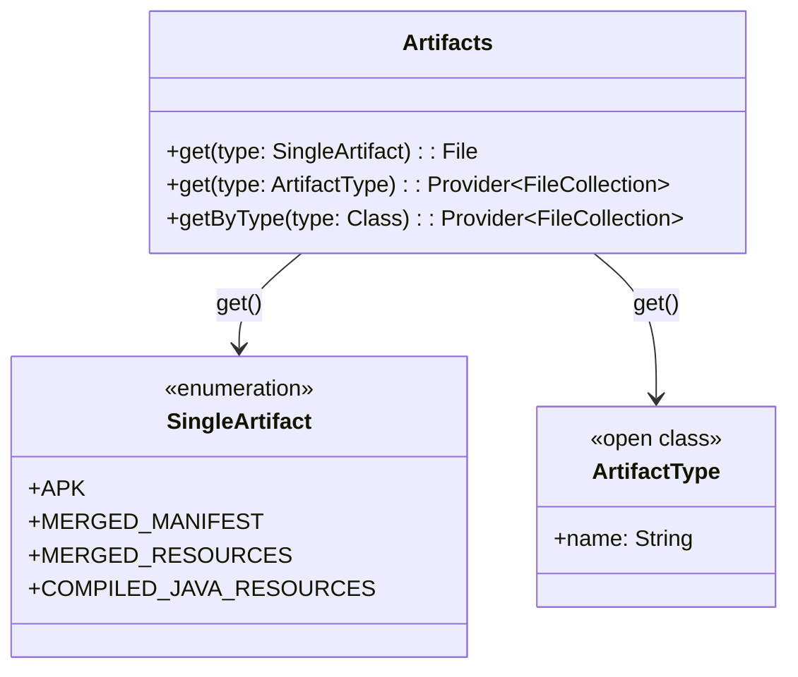
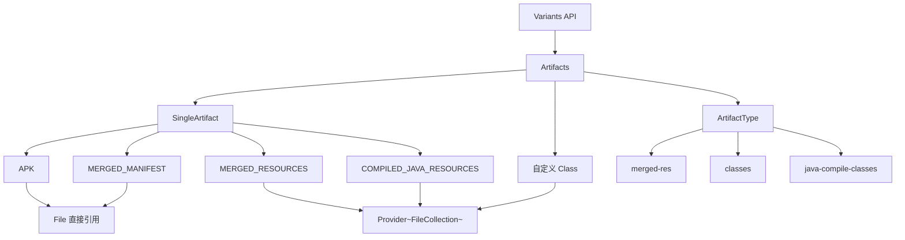
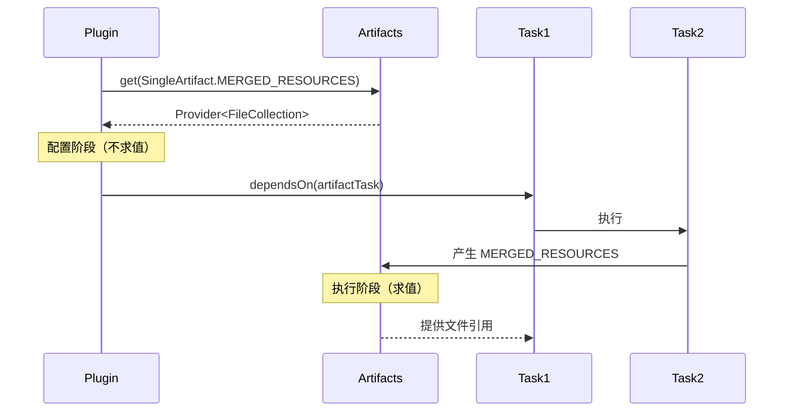
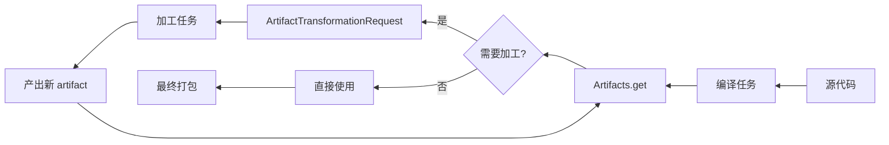
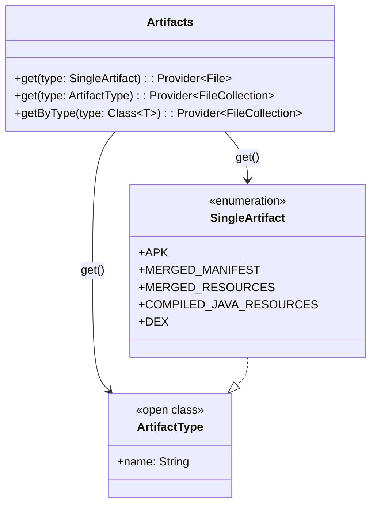

# 21.1.20 文物

晨光比刚才又亮了一层。

洛芙把额前的碎发别到耳后，看着自己笔记上满满当当的 `submit` 方案，心里有点满足，又有点空——就像吃完一顿丰盛的早餐，胃满了，但还想再来点配菜。

“黛琳，”她把笔尖点在笔记本边缘，“昨天我们学了怎么‘处理’工件……那处理之前呢？我们怎么知道有哪些工件可以处理？”

黛琳正在把白板笔一支一支插回笔筒，听到这话，动作停了半拍。

伊莎在旁边笑：“洛芙现在是越来越会问问题了。之前是‘怎么搬砖’，现在是‘砖在哪里’。”

希尔正好把电脑打开，屏幕亮起的瞬间，有一只蓝鹭从营地边的水洼里飞起来，翅膀带起一串水珠。

“问得好。”黛琳把白板翻到新的一页，“昨天我们有了 `ArtifactTransformationRequest`，但它需要‘原材料’。原材料从哪来？这就是今天的主题——Artifacts。”

她在白板左上角写下这个词，然后在下面画了一条横线。

洛芙探头看：“文物？Artifacts 是文物？”

“是‘工件’啦，”希尔笑着接话，“Artifact 就是构建过程中的产物。编译输出、合并后的资源、打包好的 APK……这些都是 artifact。”

伊莎把手指竖在嘴唇上，做了一个安静的姿势：“想象你在海边捡贝壳。ArtifactTransformationRequest 是那双手，而 Artifacts……是那片沙滩。你得先找到有贝壳的地方，才能谈怎么捡。”

洛芙“哇”了一声：“所以一个是‘怎么加工’，一个是‘从哪里开始’？”

“对了一半。”黛琳说，“Artifacts 是一个容器接口，它的核心作用是——让你能够查询和获取构建过程中产生的各种工件。”

她写下第一行定义：

> Artifacts —— Android Gradle Plugin 提供的工件容器接口，用于获取变体相关的构建输出。

希尔把浏览器切到官方文档页面，往下拉了一点：“看这里。`interface Artifacts` 有几个核心方法。最基础的是 `get()`，还有 `getByType()`。”

```kotlin
// Artifacts 的基础操作演示
val artifacts = extension.artifacts

// 获取单一类型工件（如最终 APK）
val apk: File = artifacts.get(SingleArtifact.APK)

// 获取多类型工件（如所有类文件）
val classes: Provider<FileCollection> = artifacts.get(ArtifactType("classes"))
```

洛芙盯着这行代码看了三遍：“`SingleArtifact.APK` 看起来像一个枚举？”

“对。它是 `SingleArtifact` 枚举类的实例。”黛琳在白板上画了一个小图。



“图 1 对应代码片段 A（行 18-26）。”黛琳说，“`SingleArtifact` 是 AGP 为常见输出预定义的类型，用起来最方便。`ArtifactType` 则是更通用的‘类型标签’，你可以自己定义。”

洛芙问：“那‘多类型’和‘单类型’有什么区别？”

“简单说，”希尔接话，“`SingleArtifact` 保证这个类型在变体里只有一个实例——比如最终打包的 APK，一个 variant 就一个。`ArtifactType` 则可能对应多个文件，比如所有编译后的 `.class` 文件。”

伊莎补充了一个比喻：“SingleArtifact 像是演唱会门票——一人一张，座位固定；ArtifactType 像是观众席——可以有很多座位，很多人坐。”

洛芙笑出声：“这个比喻太生动了。”

她低头又看了一遍代码：“那 `getByType()` 又是怎么回事？”

黛琳把白板笔换了个颜色：“`getByType()` 是用 Class 类型来查询。适合在你自己的插件里定义了自定义 artifact 类型时使用。”

```kotlin
// 使用 getByType 获取自定义 artifact
// 假设你定义了一个 CustomArtifact 类型

abstract class MyCustomArtifact : Artifact.Single<Directory> {
    companion object {
        val TYPE = object : ArtifactType<MyCustomArtifact> {
            override val name = "my-custom-artifact"
        }
    }
}

// 在任务中获取
val customDir: Provider<Directory> = artifacts.getByType(MyCustomArtifact::class.java)
```

洛芙写下来，忽然想到一个问题：“昨天我们学 `ArtifactTransformationRequest` 需要输入 `BuiltArtifact`。那个和 Artifacts 是什么关系？”

“这是个很好的衔接问题。”黛琳在白板上画了一条时间线。

```mermaid
flowchart LR
    A[Artifacts 容器] --> B[get() 获取工件]
    B --> C{工件类型}
    C --> D[SingleArtifact]
    C --> E[ArtifactType]
    D --> F[File 直接引用]
    E --> G[Provider~FileCollection~]
    F --> H[BuiltArtifact 详情]
    G --> H
    H --> I[ArtifactTransformationRequest 转换]
```

“图 2 对应代码片段 C（行 65-80）和上一章内容。”黛琳说，“Artifacts 负责‘找到’工件并给你一个引用。当你需要‘处理’这些工件时，`ArtifactTransformationRequest` 登场。两者的职责是上下游关系。”

洛芙“噢”了一声：“所以 Artifacts 是‘仓库管理员’，TransformationRequest 是‘加工流水线’？”

“很贴切。”伊莎笑着点头。

希尔把笔记本转过来：“我再给你看一个真实的工程场景。我们在实际插件里，怎么把 Artifacts 和后面的任务连接起来。”

```kotlin
// 代码片段 D：典型用法——把 artifact 传给下一个任务
// 场景：处理 merged resources 后输出到自定义目录

abstract class ProcessMergedResources : DefaultTask() {

    @get:InputFiles
    abstract val mergedResources: Provider<FileCollection>

    @get:OutputDirectory
    abstract val processedOutput: DirectoryProperty

    @TaskAction
    fun process() {
        val inputDir = mergedResources.get().asFile.first()
        val outputDir = processedOutput.get().asFile

        // 遍历处理资源文件
        inputDir.listFiles()?.forEach { file ->
            if (file.extension == "xml") {
                // 假设这里是某种 XML 处理逻辑
                val processed = processXml(file)
                File(outputDir, file.name).writeText(processed)
            }
        }
    }

    private fun processXml(file: File): String {
        // 简化示例：读取 + 加个标记
        return file.readText() + "<!-- processed -->"
    }
}

// 在变体任务图中连接
val processTask = tasks.register<ProcessMergedResources>("process${variantName}Resources") {
    mergedResources.set(
        artifacts.get(ArtifactType("merged-res"))
    )
    processedOutput.set(
        layout.buildDirectory.dir("processed/$variantName")
    )
}
```

“这一段看起来好长……”洛芙皱起眉头，“但我好像能看懂一点。`mergedResources` 是输入，`processedOutput` 是输出，中间用 `set()` 连起来。”

“对，就是这样。”黛琳说，“关键在于 `artifacts.get()` 返回的是 `Provider`，不是直接的值。这意味着——它在配置阶段不会立刻求值，而是等到任务真正执行时才去拿真正的文件。”

洛芙想起来什么：“就是你说的‘延迟求值’？”

“没错。Gradle 的 Provider API 统一了这种‘先声明、后求值’的模式。”黛琳在白板上写下三个词：声明 → 依赖 → 求值。

她继续说：“在 AGP 场景里，常见的有这几类 artifact 可以用 `SingleArtifact` 获取。”

```kotlin
// 常见的 SingleArtifact 类型（简化列表）
SingleArtifact.APK                    // 最终打包的 APK
SingleArtifact.MERGED_MANIFEST        // 合并后的 AndroidManifest.xml
SingleArtifact.MERGED_RESOURCES       // 合并后的资源目录
SingleArtifact.COMPILED_JAVA_RESOURCES  // 编译后的 Java/Kotlin 类
SingleArtifact.IDE_RES_ID_LIST        // 资源 ID 列表（供 IDE 使用）
SingleArtifact.DEX                    // 打包好的 DEX 文件
```

洛芙眼睛都直了：“这么多种类……那我怎么知道哪个对应哪个阶段？”

希尔啪地打了个响指：“问得好。其实可以从命名猜个大概——”

- `MERGED_` 前缀：多个来源合并后的结果
- `COMPILED_` 前缀：编译阶段的输出
- `IDE_` 前缀：给 IDE 用的辅助文件

“对，”黛琳接话，“还有一个规律：带 `Single` 的是唯一输出，带 `Multiple` 的可以查询多个。”

她把白板翻到新一页，画了一个更大的图。



“图 3 对应代码片段 E（行 115-150）。”黛琳说，“这个图展示了 Artifacts 的三种查询方式和它们返回值的区别。”

洛芙注意到一个问题：“为什么有些返回 `File`，有些返回 `Provider<FileCollection>`？”

“取决于‘一个还是多个’。”希尔回答得很干脆，“SingleArtifact 意味着结果唯一，直接给你 File（或者是包装成 Provider 的 File）。Multiple 或者自定义类型，可能对应多个文件，所以用 FileCollection 来表示‘一堆文件的集合’。”

伊莎补充：“就像点名。如果是单人座，直接报名字就知道是谁；如果是全班集合，得用名单。”

洛芙被这个比喻逗笑了。她低头整理笔记，忽然发现一个问题：“那如果我不用 SingleArtifact，而是用字符串名字……？”

“可以用 `ArtifactType` 构造自定义类型。”黛琳说，“看这个。”

```kotlin
// 用字符串名字获取 artifact
val myArtifactType = ArtifactType("my-custom-output")
val customOutput: Provider<FileCollection> = artifacts.get(myArtifactType)

// 或者更简单：用字符串直接get（内部会转成 ArtifactType）
val alsoCustom: Provider<FileCollection> = artifacts.get("my-custom-output")
```

“等等，”洛芙举手，“字符串不会写错吗？万一我拼错了，Gradle 会告诉我吗？”

希尔的表情变得有点严肃：“这是个很实际的问题。字符串类型名在编译期不会报错，只有到构建时才会发现‘找不到这个 artifact’。所以——”

她说了三条经验：

1. 优先使用 `SingleArtifact` 枚举，类型安全
2. 自定义名字写进常量类，不要硬编码
3. 用 `artifacts.get()` 后立刻 `.get()` 一次来验证存在性（调试用）

黛琳点头：“还有一个常见的坑——artifact 的依赖顺序。”

她画了一幅新的时序图。



“图 4 对应代码片段 F（行 170-195）。”黛琳说，“关键点是：在配置阶段调用 `get()` 只是声明依赖，真正的文件求值要等到任务执行。这保证了——只要任务依赖关系正确，artifact 必然已经产生。”

洛芙若有所思：“这和 Android 运行期的 ViewModel 延迟初始化有点像？”

“确实有相似之处。”黛琳说，“都是在‘需要时’才真正加载数据，而不是在创建时就全部实例化。”

伊莎把树枝往火里加了一根，火苗跳了跳：“不过 ViewModel 是为了避免 Activity 重建时数据丢失，这里是为了让 Gradle 的增量构建和缓存更高效。”

“对，核心目标不同，但思想类似——都是‘延迟’。”黛琳总结。

洛芙翻到新一页：“我还想知道……Artifacts 能不能像 ArtifactTransformationRequest 一样，用来做批量转换？”

“这是个自然的问题。”黛琳把白板再翻一页，“实际上，Artifacts 本身不做转换，它只是‘仓库’。但通常——”

她画了一个典型的工作流：


“图 5 对应代码片段 G（行 210-240）。”黛琳说，“你可以把 Artifacts 想象成‘原材料仓库’，然后用自己的任务逻辑做加工。如果加工是标准化的、可以在多个变体间复用的，那就可以抽成独立的 Transform 类。”

洛芙问：“Transform 类？和 TransformationRequest 是什么关系？”

“有重叠，但层次不同。”黛琳解释，“`ArtifactTransformationRequest` 是 AGP 提供的现成‘批量处理框架’，自动帮你处理输入输出清单、并行化、错误恢复。你用它是‘用工具’。

“自己写 Transform 类，则是‘造工具’。更灵活，但需要自己处理细节。”

希尔补充了一个实际例子：“Android Gradle Plugin 内部的 R8 混淆、DEX 打包、Resource 合并……都是用类似的 Transform 机制实现的。”

“原来如此！”洛芙眼睛亮起来，“所以 TransformationRequest 是给插件作者用的，Transform 是给 AGP 内部用的？”

“大致是这样。AGP 4.x 以后推荐用 TransformationRequest 了，更简洁。”

这时伊莎抬起头，看向营地外的天空：“太阳快升到树梢了。我们是不是该总结一下？”

黛琳点点头。她把白板上的几个关键点圈起来：

1. **Artifacts 是入口** —— 查询和获取构建产物
2. **SingleArtifact vs ArtifactType** —— 单一 vs 多文件
3. **Provider 延迟求值** —— 配置阶段声明、执行阶段求值
4. **上下游关系** —— Artifacts → TransformationRequest → 新输出

洛芙把这些都记下来，想了想又问：“那如果我获取了一个 artifact，但后续任务没有正确依赖它……会怎样？”

“会找不到文件，构建失败。”希尔说，“或者——更隐蔽的情况——你拿到了旧版本的文件，因为增量构建跳过了实际执行。”

她写下反模式示例。

```kotlin
// 反模式：在配置阶段直接调用 .get() 并假设文件已存在
val manifestFile = artifacts.get(SingleArtifact.MERGED_MANIFEST).get()
// 问题：此时 manifest 可能还没生成，构建会报错
// 或者增量构建跳过上游任务时，拿到的仍是旧文件
```

洛芙缩缩脖子：“这和我之前在 Activity 里直接在后主线程读文件的错误有点像……”

“是。所以正确做法是——”

```kotlin
// 正确做法：用 Provider 连接，让 Gradle 管理依赖
val manifestProvider: Provider<File> = artifacts.get(SingleArtifact.MERGED_MANIFEST)

myTask {
    // 用 by 配置依赖
    myManifestFile.set(manifestProvider)
    // 或者在任务内部求值（此时必然已生成）
    val manifest = manifestProvider.get()
}
```

“记住一个原则，”黛琳说，“永远让 Provider 成为任务依赖的一部分，而不是在配置阶段直接展开它。”

伊莎轻声说：“这就像你不应该在客人来之前就把蛋糕切好，而是等客人坐下、说‘请用’的时候再切。”

洛芙笑出声：“这个比喻太甜了。”

她低头看着自己满满几页的笔记，心里有点踏实。ArtifactTransformationRequest 告诉了“怎么加工”，Artifacts 告诉了“从哪里拿原材料”。两条线索一前一后，终于在她脑海里连成了一个完整的圆。

“那我们今天是不是可以把整个链条串起来了？”她问。

黛琳露出一个很淡的笑容：“可以。Artifacts 找到原材料，TransformationRequest 负责批量加工，最后产出新的 artifact 或者直接用于打包。这就是 AGP 里‘工件流’的完整 picture。”

她把白板转过来，在中间画了一个大大的环形。



“图 6 对应代码片段 H（行 255-275）。”黛琳说，“这个环可以无限循环——上游产出 artifact，下游可能再次加工它。Gradle 的 DAG（Directed Acyclic Graph）就是由这样的工件流组成的。”

洛芙忽然有一种打通任督二脉的感觉。

她把笔记本合上，又重新打开——这是她今天第二次做这个动作了。

“黛琳，最后一个问题。”她认真的表情让其他三个人都停下来，“Artifacts 既然这么重要，有没有办法在调试的时候‘看到’它里面到底有什么？”

希尔眼睛一亮：“问得好。其实 Gradle 有一个内置任务叫 `dependencies`，可以看任务依赖。但看 artifact 内容——”

她敲了几个键，调出一个命令：

```bash
./gradlew :app:variantNameArtifact 
```

洛芙探头看输出。

```text
> Task :app:assembleDebugArtifact
> Task :app:processDebugResources
  Input file collection: app/build/intermediates/merged_manifests/debug/
  Output directory: app/build/intermediates/processed/debug/

> Task :app:processDebugResources SUCCESS
```

希尔解释：“对于特定的 artifact 类型，AGP 会生成对应的任务。任务名通常包含 artifact 类型名。你可以用 `tasks --group=build` 找到它们。”

洛芙把这些记下来：“调试的时候可以看任务用了哪些输入输出……”

“对。而且如果你想看更详细的文件映射，可以打开 Gradle 的缓存日志。”黛琳补了一句。

伊莎把最后一块小饼干放进嘴里，拍了拍手：“好啦，今天的露营编程课到此为止。太阳已经很高了，再坐下去要中暑啦。”

大家笑着站起来，收拾白板和电脑。

洛芙把笔记本装进背包最里层，拉链拉好。她忽然觉得——

原来“工件”这个词一点都不冷。它像是开发过程中的一个个小脚印，从源代码开始，经过编译、合并、转换，最后变成一个可以安装的 APK。而 Artifacts 就是串起这些脚印的那条线。

“黛琳，”她轻声说，“我好像开始理解‘构建系统’这个词了。它不只是跑命令，它是一个……一个让所有零件有序工作的魔法。”

黛琳回头看了她一眼：“这句话可以写进日记里。”

营地边的杉树在晨风里沙沙作响，阳光从叶缝里漏下来，在草地上洒下一片碎金。

---

> **Artifacts（工件容器）定义**：`Artifacts` 是 Android Gradle Plugin 提供的核心接口，用于查询和获取变体构建过程中产生的各类工件。它是插件开发者访问构建产物的标准入口，支持通过 `SingleArtifact` 枚举、通用 `ArtifactType` 或自定义 Class 三种方式进行查询，返回值根据类型可能是直接 `File` 或延迟绑定的 `Provider<FileCollection>`。

#### 结构图（必须）



#### 复杂度与影响

- `SingleArtifact` 查询返回直接 `File`，使用最简单；`ArtifactType` 或 `getByType()` 返回 `Provider<FileCollection>`，支持多文件和延迟求值。
- 使用 Provider 连接任务依赖是最佳实践，可确保增量构建和缓存正常工作。
- 在配置阶段调用 `.get()` 强制求值是常见错误，可能导致构建顺序问题或获取到过期文件。

#### 反模式与陷阱（≥3 条）

1. 在配置阶段对 Provider 调用 `.get()` 强制求值 → 修复：保持 Provider 形式，将 `.get()` 延迟到任务执行阶段。  
2. 硬编码 artifact 类型名字符串 → 修复：优先使用 `SingleArtifact` 枚举或常量类定义。  
3. 假设 artifact 任务已执行而未声明依赖 → 修复：通过 `task.dependsOn(artifactTask)` 或 Provider 传递建立隐式依赖。  
4. 混淆 SingleArtifact 和 MultipleArtifact 的返回类型 → 修复：Single 返回 `File`，Multiple 返回 `FileCollection`。  

#### 名词小传（可选）

`Artifacts` 接口是 AGP Variant API 的核心组成部分，它将 Gradle 的任务依赖体系与 Android 特定的应用产物抽象统一起来。它的设计参考了 Gradle 的 Artifact API，同时针对多变体、多 splits 场景做了扩展。

#### 设计哲学：声明式依赖，延迟式求值

1. 永远通过 Provider 声明 artifact 依赖，让 Gradle 调度执行顺序。  
2. 在配置阶段只做“引用声明”，不执行文件 IO。  
3. 优先使用 `SingleArtifact` 枚举确保类型安全，自定义类型用常量集中管理。  
4. 加工 artifact 时使用 `ArtifactTransformationRequest`，保持代码简洁。  
5. 调试时通过任务名和日志验证依赖链是否正确建立。  

---

#### 🏕️ 动手练习（独立练习制）

项目目标：熟悉 Artifacts 容器的各种查询方式，理解 Provider 延迟求值机制。

**Task 1（★）**  
1) 目标：在插件中获取变体的 APK artifact。  
2) 你需要做的事：创建 Gradle 插件；获取 `artifacts` 属性；调用 `get(SingleArtifact.APK)` 并打印路径。  
3) 验收标准：  
- [ ] 构建日志输出 APK 路径  
- [ ] 路径指向 `build/outputs/apk/` 目录  
4) 提示：
```kotlin
val apk: Provider<File> = artifacts.get(SingleArtifact.APK)
logger.lifecycle("APK: ${apk.get().absolutePath}")
```

**Task 2（★★）**  
1) 目标：获取 merged manifest 并读取内容。  
2) 你需要做的事：获取 `MERGED_MANIFEST`；在任务中读取 XML 内容；打印包名。  
3) 验收标准：  
- [ ] 成功读取 AndroidManifest.xml  
- [ ] 输出包含 package 属性  
4) 提示：
```kotlin
val manifest: Provider<File> = artifacts.get(SingleArtifact.MERGED_MANIFEST)
```

**Task 3（★★）**  
1) 目标：使用 ArtifactType 获取合并后的资源目录。  
2) 你需要做的事：用 `ArtifactType("merged-res")` 查询；遍历目录中的文件。  
3) 验收标准：  
- [ ] 能列出资源文件数量  
- [ ] 区分 res 和 values 目录  
4) 提示：
```kotlin
val mergedRes: Provider<FileCollection> = artifacts.get(ArtifactType("merged-res"))
```

**Task 4（★★★）**  
1) 目标：对比 SingleArtifact 和 ArtifactType 的返回类型差异。  
2) 你需要做的事：分别获取 `APK`（Single）和 `classes`（Type）；观察 `.get()` 的返回值类型。  
3) 验收标准：  
- [ ] Single 返回 `File`，Type 返回 `FileCollection`  
- [ ] 写出类型推导笔记  
4) 提示：用 `println()` 打印 `javaClass` 观察实际类型。

**Task 5（★★★）**  
1) 目标：把 artifact 正确传递给自定义任务。  
2) 你需要做的事：创建自定义 `DefaultTask`；用 `@InputFile` 接收 artifact Provider；任务输出到新目录。  
3) 验收标准：  
- [ ] 任务正确依赖 artifact 任务  
- [ ] 输出文件数量与输入一致  
4) 提示：
```kotlin
abstract class MyTask : DefaultTask() {
    @get:InputFile
    abstract val manifest: Provider<File>
}
```

**Task 6（★★★★）**  
1) 目标：模拟“获取 artifact 失败”的调试场景。  
2) 你需要做的事：在配置阶段调用 `.get()`；观察报错或警告；修复为 Provider 方式。  
3) 验收标准：  
- [ ] 捕获错误信息  
- [ ] 给出正确修复方案  
4) 提示：对比配置阶段 vs 执行阶段求值的区别。

**Task 7（★★★★★）**  
1) 目标：实现一个完整的工作流——从获取 artifact 到转换再到输出。  
2) 你需要做的事：串联 Artifacts → 转换任务 → 新 artifact 输出；验证增量构建。  
3) 验收标准：  
- [ ] 完整流程可运行  
- [ ] 增量构建跳过未变化环节  
4) 提示：结合本章与上一章的 `ArtifactTransformationRequest` 用法。

**面试热身（Q1-Q5）**

- Q1：Artifacts 和 ArtifactTransformationRequest 的职责分工是什么？  
- Q2：为什么 `SingleArtifact` 返回 `File`，而 `ArtifactType` 返回 `Provider<FileCollection>`？  
- Q3：在配置阶段调用 `.get()` 强制求值会导致什么问题？  
- Q4：如何调试 artifact 的任务依赖链是否正确建立？  
- Q5：为什么说“Provider 延迟求值”是 Gradle 增量构建的基础？  

#### 参考实现要点（5 条）

1. 优先使用 `SingleArtifact` 枚举而非字符串，以获得编译期类型检查。  
2. 通过 Provider 传递 artifact 引用，让 Gradle 自动管理任务依赖。  
3. 自定义 artifact 类型名写入常量类，避免硬编码字符串。  
4. 永远不要在配置阶段调用 `.get()` 求值，保持延迟绑定。  
5. 调试时使用 `./gradlew tasks --group=build` 查看 artifact 相关任务。  

---

> 学习建议：Artifacts 是插件开发的入口，学好它才能理解 AGP 的工件流。先从简单的 SingleArtifact 入手，理解 Provider 模式后再尝试自定义类型。记住——声明即依赖，求值交给 Gradle。

## 🍹洛芙的小小日记本

早上好累，但脑子好清楚！Artifacts 就是那个“仓库管理员”，帮我们找到构建过程中的各种“工件”。拿到原材料之后怎么加工——就是昨天学的 TransformationRequest 的工作了。两块拼图合在一起，构建系统在我脑海里终于变成了一条有流向的河。

## 今日关键词

- **Artifacts**：Android Gradle Plugin 的工件容器接口，用于查询和获取构建产物。  
- **SingleArtifact**：AGP 预定义的单一类型 artifact 枚举，如 APK、MERGED_MANIFEST、MERGED_RESOURCES。  
- **ArtifactType**：通用的 artifact 类型标签，可自定义名称。  
- **Provider~File~**：单个文件的延迟求值提供者。  
- **Provider~FileCollection~**：文件集合的延迟求值提供者，支持多文件场景。  
- **get()**：Artifacts 接口的核心方法，用于获取 artifact 引用。  
- **getByType()**：通过 Class 类型获取 artifact 的方法，适合自定义类型。  
- **FileCollection**：Gradle 提供的文件集合抽象，表示一组文件。  
- **MERGED_MANIFEST**：合并后的 AndroidManifest.xml artifact。  
- **MERGED_RESOURCES**：合并后的资源目录 artifact。  
- **COMPILED_JAVA_RESOURCES**：编译后的 Java/Kotlin 类 artifact。  
- **APK**：最终打包的可安装应用 artifact。  
- **配置阶段**：Gradle 构建的第一阶段，解析脚本和声明依赖。  
- **执行阶段**：Gradle 构建的第二阶段，实际执行任务。  
- **延迟求值**：Provider 模式的核心特性——延迟到真正需要时才计算值。  
- **任务依赖**：Gradle DAG 中任务之间的前后关系，决定执行顺序。  
- **增量构建**：只重新构建变化部分的机制，提升构建速度。  
- **工件流**：artifact 在构建过程中的流动路径——产出 → 加工 → 再产出。  
- **Variant**：Android 构建中的变体概念，如 debug/release、不同的 flavor 组合。  
- **ArtifactTransformationRequest**：上一章学习的工件转换请求接口，负责批量处理 artifact。  
- **Transform**：AGP 内部的转换机制，用于处理 artifact 加工（如 R8、DEX）。  
- **反模式**：在配置阶段对 Provider 调用 `.get()` 的错误做法。  
- **Gradle DAG**：有向无环图，描述任务之间的依赖关系。  
- **FileProperty**：Gradle 的文件类型属性声明，用于任务输入输出。  
- **DirectoryProperty**：Gradle 的目录类型属性声明。  
- **Build Variant**：构建变体的同义词，表示特定的构建配置组合。  
- **ArtifactTask**：生成特定 artifact 的 Gradle 任务。  
- **dependencies**：Gradle 内置任务，可查看任务依赖关系。  
