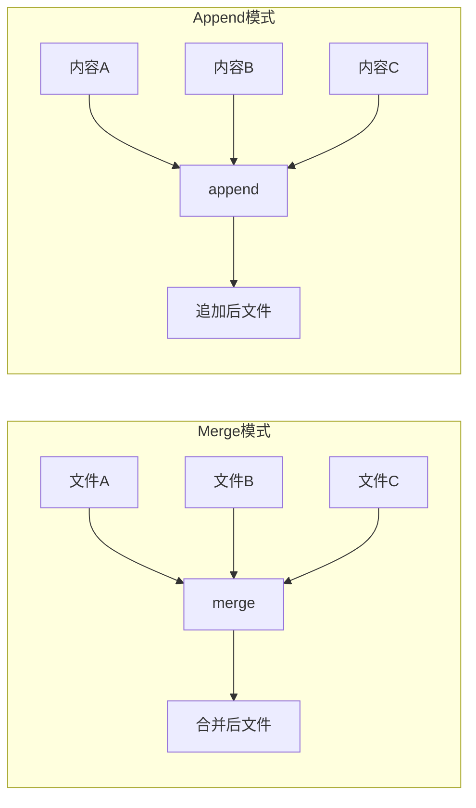
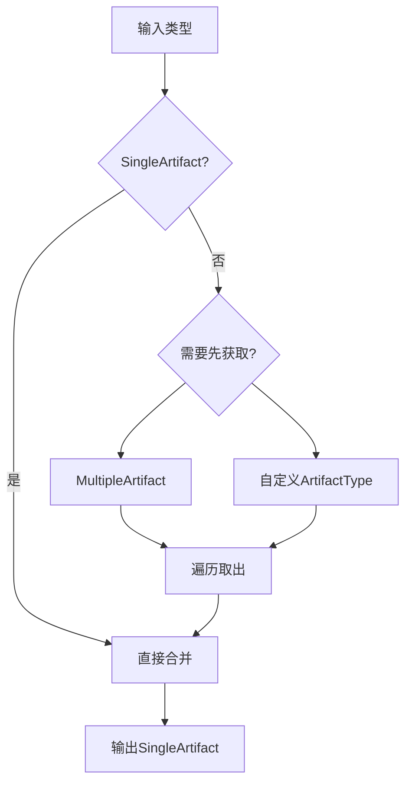
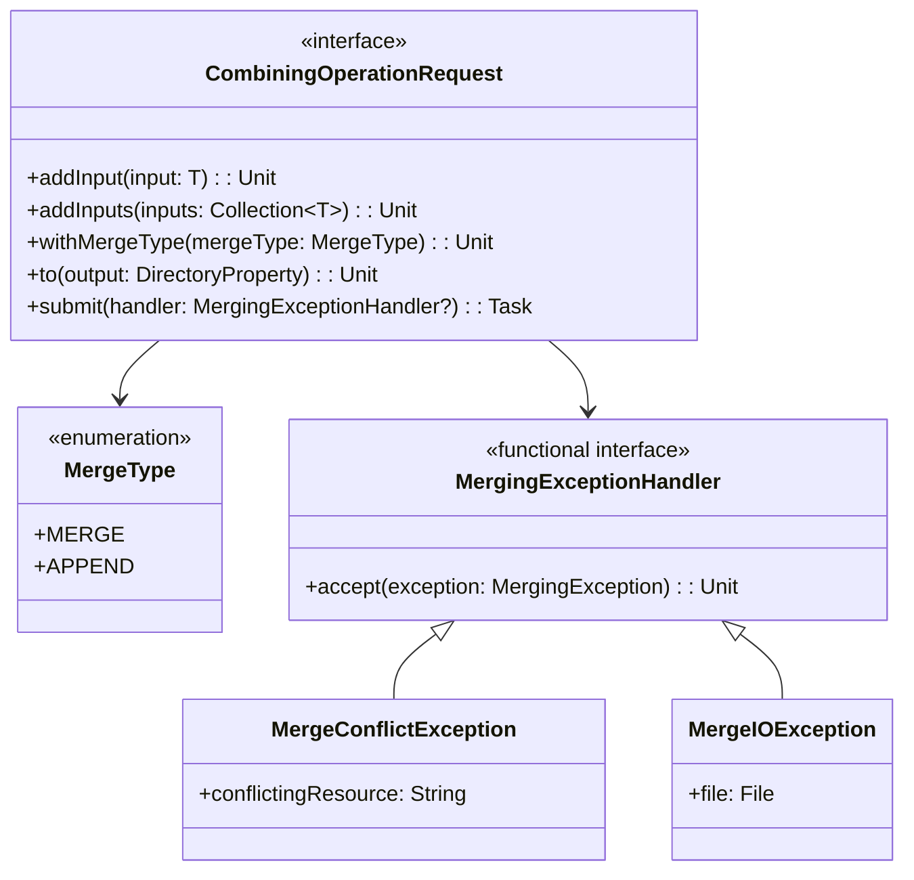

# 21.1.21 合并操作请求

日上午的阳光比清晨更热烈了几分。

洛芙把笔记本摊在腿上，笔尖悬在纸面上方，迟迟没有落下。她正在消化刚才黛琳讲的内容——Artifacts 容器就像仓库管理员，帮她们找到了构建过程中的各种“原材料”。

“黛琳，”她终于忍不住开口，“昨天我们学了怎么‘处理’单个工件……那如果我想把好几个东西‘合并’成一个呢？”

伊莎正在把果酱抹在烤好的面包片上，听到这个问题抬起头，眼睛弯成了月牙：“洛芙现在是越来越贪心了哦。之前是‘从哪里拿’，现在是‘怎么拼’。”

希尔正在敲代码，屏幕上映着她专注的脸。她头也不抬地说：“问得好。其实我刚才也在想这个问题——我们做插件的时候，经常会遇到‘把这几个文件合并成一个大文件’的场景。”

黛琳把白板笔拿起来，在白板上写下今天的标题——CombiningOperationRequest。

“看到这个单词，你们想到了什么？”她问。

洛芙举手：“Combination……组合？合并？”

“对。”黛琳在“合并”下面画了一条线，“如果说 `ArtifactTransformationRequest` 是帮你‘逐个加工’工件，那 `CombiningOperationRequest` 就是帮你‘把多个工件合并成一个’。它的名字已经把功能说清楚了——Combine，就是合并。”

她写下定义：

> CombiningOperationRequest —— Android Gradle Plugin 提供的合并操作请求接口，用于将多个输入工件合并为单个输出文件。

伊莎把面包片翻了个面，烤得金黄的那面朝上：“想象你在做三明治。`ArtifactTransformationRequest` 是帮你切好每一片蔬菜，而 `CombiningOperationRequest` 是帮你把所有切好的材料叠在一起，变成一个完整的三明治。”

洛芙“哇”了一声：“所以一个是‘加工’，一个是‘组装’？”

“很贴切。”黛琳点头，“不过合并也有不同的方式。AGP 提供了两种主要的合并策略——”

她在白板上画出两种模式：



“图 1 对应代码片段 A（行 38-55）。”黛琳说，“Merge 是把多个文件合并成一个新文件，内容可能会重新排列或整合；Append 则是把内容依次追加到末尾，常用于日志或清单类文件。”

洛芙问：“那我在什么场景下用哪种？”

“很简单。”希尔接话，“如果你要处理的是‘结构性数据’——比如 XML、JSON、字节码——用 Merge，合并工具会帮你处理冲突。如果你处理的是‘线性数据’——比如文本日志、一系列行——用 Append，直接往末尾加就行。”

黛琳补充：“举几个实际例子你就懂了。”

她一边说一边在白板上写：

- **Merge 场景**：
  - 多个 DEX 文件合并成一个
  - 多个资源文件合并成 resources.arsc
  - 多个 AAR 合并成最终的库文件

- **Append 场景**：
  - 多个清单文件追加成最终的 AndroidManifest.xml
  - 多个 ProGuard 规则文件追加成完整规则
  - 多个 lint-results.xml 追加成一份报告

洛芙认真记下来：“原来如此。那 CombiningOperationRequest 怎么用？”

黛琳把白板翻到新一页：“我们先看它的核心方法。”

```kotlin
// CombiningOperationRequest 的基础操作
// 这是一个简化示例，展示 API 结构

interface CombiningOperationRequest<out T : Artifact> {
    // 添加要合并的输入工件
    fun addInput(input: T)
    
    // 添加多个输入工件
    fun addInputs(inputs: Collection<T>)
    
    // 设置合并策略
    fun withMergeType(mergeType: MergeType)
    
    // 设置输出位置
    fun to(output: DirectoryProperty)
    
    // 执行合并
    fun submit(action: MergingExceptionHandler?)
}
```

洛芙盯着看：“这个接口看起来比 TransformationRequest 简单？”

“因为它的职责更明确——就是合并，不需要处理单个工件的循环。”黛琳解释，“你只需要把所有要合并的工件丢进去，指定输出位置，然后调用 submit。”

希尔把笔记本转过来：“我给你写一个完整的例子，用代码把整个流程串起来。”

```kotlin
// 代码片段 B：CombiningOperationRequest 完整示例
// 场景：合并多个 DEX 文件成一个

abstract class MergeDexTask : DefaultTask() {

    @get:InputFiles
    abstract val dexFiles: RegularFileProperty

    @get:OutputFile
    abstract val mergedDex: RegularFileProperty

    @get:Internal
    abstract val combiningRequest: Property<CombiningOperationRequest<SingleArtifact.DEX>>

    @TaskAction
    fun merge() {
        combiningRequest.get().apply {
            // 添加输入文件（这里简化了，实际从 artifacts 获取）
            addInput(dexFiles.get().asFile)
            
            // 指定合并策略
            withMergeType(MergeType.MERGE)
            
            // 设置输出
            to(layout.buildDirectory.dir("merged-dex"))
            
            // 执行合并
            submit { exception ->
                logger.lifecycle("合并时发生异常: ${exception.message}")
            }
        }
    }
}
```

洛芙歪着头看：“这里用了 `SingleArtifact.DEX`？那是不是意味着我们可以合并任何类型的 SingleArtifact？”

“对，任何 SingleArtifact 都可以。”黛琳说，“但要注意——有些 SingleArtifact 本身已经是‘合并后’的结果了，比如 `MERGED_RESOURCES`。你合并‘已合并’的东西不一定有意义。”

伊莎插话：“就像把已经叠好的三明治再叠一次，虽然不会坏，但有点多此一举。”

洛芙笑出声。她低头想了想，又问：“那 MultipleArtifact 行不行？比如合并所有 .class 文件？”

这是个很好的问题。黛琳在白板上画了一个新的图来解释。



“图 2 对应代码片段 C（行 92-120）和代码片段 D（行 123-145）。”黛琳说，“MultipleArtifact 不能直接作为 CombiningOperationRequest 的输入，你需要先把它‘展开’成单个文件列表，然后再合并。”

洛芙“噢”了一声：“明白了。Multiple 是‘一群’，得先挑出具体的‘个体’，再送去合并。”

希尔补充了一个实际的工程场景：“我之前做过一个插件，要把所有模块的 ProGuard 规则合并成一份。当时就是先把每个模块的 `PROGUARD_RULES` artifact 拿出来，然后用 CombiningOperationRequest 合并成最终文件。”

她现场写了一个更完整的示例：

```kotlin
// 代码片段 D：合并多个模块的 ProGuard 规则
// 实际工程场景

abstract class MergeProGuardRules : DefaultTask() {

    @get:InputFiles
    abstract val moduleRules: ListProperty<RegularFileProperty>

    @get:OutputFile
    abstract val mergedRules: RegularFileProperty

    @get:Internal
    abstract val combiningRequest:
        Property<CombiningOperationRequest<SingleArtifact.PROGUARD_RULES>>

    @TaskAction
    fun merge() {
        combiningRequest.get().apply {
            // 逐个添加各模块的规则文件
            moduleRules.get().forEach { prop ->
                addInput(prop.get().asFile)
            }

            // 使用追加模式（Append）
            // 因为 ProGuard 规则是线性文本，追加更安全
            withMergeType(MergeType.APPEND)

            // 输出到指定位置
            to(layout.buildDirectory.dir("merged-proguard"))

            // 执行合并
            submit(null)
        }
    }
}

// 另一种写法：使用 MERGE 模式合并结构性文件
abstract class MergeManifests : DefaultTask() {

    @get:Internal
    abstract val combiningRequest:
        Property<CombiningOperationRequest<SingleArtifact.MERGED_MANIFEST>>

    @TaskAction
    fun merge() {
        combiningRequest.get().apply {
            // Manifest 合并必须用 MERGE 模式
            // 因为 AndroidManifest.xml 是 XML 结构，需要工具处理冲突
            withMergeType(MergeType.MERGE)

            // 输出合并后的清单
            to(layout.buildDirectory.dir("merged-manifest"))

            submit { exception ->
                logger.error("Manifest合并失败: ${exception.message}")
            }
        }
    }
}
```

洛芙看着这两段代码，发现了一个问题：“为什么 ProGuard 用 APPEND，Manifest 用 MERGE？刚才不是说 Append 用于线性数据吗？”

“问得好。”黛琳在白板上写下两种模式的区别。

| 模式 | 适用场景 | 处理方式 |
|------|---------|---------|
| **MERGE** | 结构化数据（XML、字节码、JSON） | 解析后合并，可能有冲突解决 |
| **APPEND** | 线性数据（文本、日志、规则文件） | 直接追加到末尾 |

黛琳解释：“ProGuard 规则是纯文本，每一行都是独立的规则，追加不会破坏结构。但 AndroidManifest 是 XML，有层级、有标签冲突检测，必须用 MERGE 模式让专门的合并工具来处理。”

伊莎轻轻拍了拍手：“就像叠纸飞机和折纸鹤的区别。纸飞机只需要把纸张按顺序折起来，追加就行了；纸鹤需要对折、交叉，需要按结构来。”

洛芙点头表示理解。她翻到新一页，忽然想到另一个问题：“那如果我合并的时候出错了怎么办？”

希尔的表情变得认真了一点：“这是个好问题。CombiningOperationRequest 的 `submit` 方法接受一个 `MergingExceptionHandler` 参数，你可以用它来处理合并过程中的异常。”

```kotlin
// 处理合并异常
combiningRequest.submit { exception: MergingException ->
    when (exception) {
        is MergeConflictException -> {
            // 合并冲突，比如两个文件都定义了同一个资源
            logger.error("资源冲突: ${exception.conflictingResource}")
            // 可以选择让构建失败，或者自动解决
            throw exception
        }
        is MergeIOException -> {
            // IO 错误
            logger.error("文件读写错误: ${exception.file}")
            throw exception
        }
        else -> {
            // 其他未知错误
            logger.error("合并异常: ${exception.message}")
            throw exception
        }
    }
}
```

洛芙把这些异常类型记下来：“听起来比单纯的 TransformationRequest 复杂一点？”

“因为合并涉及多个输入，出错的可能性更多。”黛琳说，“Transform 是一对一，合并是多对一。输入越多，出错的概率越大。”

她话锋一转：“不过 AGP 已经帮我们封装好了很多细节。你不需要自己写合并算法，只需要选对模式、处理好异常就行。”

洛芙“嗯”了一声，又问：“那我能自己决定合并的顺序吗？比如一定要先把 A 文件放进去，再放 B？”

黛琳摇头：“合并顺序通常不保证。合并工具会根据自己的逻辑决定处理顺序。如果你需要特定顺序——”

她停顿了一下：“建议在合并前先对输入文件做排序，或者用不同的文件名来控制顺序。”

希尔补充：“还有一个常见的坑——合并空文件。有些模块可能没有输出某个 artifact，这时候空文件也会被合并进去，可能导致最终文件损坏。”

她写了一个处理空文件的技巧：

```kotlin
// 过滤空文件后再合并
combiningRequest.get().apply {
    // 假设 inputs 是从 artifacts 获取的文件列表
    val nonEmptyInputs = inputs.filter { file ->
        file.exists() && file.length() > 0
    }
    
    nonEmptyInputs.forEach { file ->
        addInput(file)
    }
    
    withMergeType(MergeType.APPEND)
    to(layout.buildDirectory.dir("output"))
    submit(null)
}
```

洛芙写下来，感叹道：“原来合并一个小小的动作，背后有这么多要考虑的东西。”

伊莎把烤好的第二片面包递给她：“所以合并看起来简单，做起来需要考虑很多边界情况。这和做饭是一样的——把食材丢进锅里很简单，但什么时候放盐、放多少、要不要翻面，都是学问。”

洛芙咬了一口面包，含糊地说：“我现在觉得合并比转换难多了……”

“也不一定。”黛琳说，“Transform 需要你自己写处理逻辑，合并只需要选对模式。难度是互补的。”

她把白板翻到最后一页，总结了 CombiningOperationRequest 的核心要点：

1. **两种合并模式**：MERGE 用于结构化数据，APPEND 用于线性数据
2. **输入来源**：SingleArtifact 或展开后的 MultipleArtifact
3. **输出位置**：通过 `to()` 方法指定 DirectoryProperty
4. **异常处理**：通过 `MergingExceptionHandler` 捕获合并错误
5. **输入验证**：过滤空文件和不存在文件

洛芙把这些都整理好，想了想又问：“那 Transforming 和 Combining 能一起用吗？比如我先转换再合并？”

黛琳露出一个赞许的笑容：“当然可以。这就是 AGP 插件的常见工作流——”

她画了一个完整的流程图：


“图 3 对应代码片段 E（行 175-190）和代码片段 F（行 193-215）。”黛琳说，“Transform 负责‘加工’，Combine 负责‘组装’。先切菜再摆盘，一套流程走下来，就是一个完整的插件逻辑。”

洛芙眼睛亮起来：“所以我可以——先获取原始工件，用 Transform 一个一个处理，最后用 Combine 把处理结果合并成一个？”

“完全正确。”希尔说，“而且这两个操作可以串联在同一个任务里，也可以分成两个任务，取决于你的设计。”

她现场写了一个组合示例：

```kotlin
// 代码片段 F：Transform + Combine 组合使用
// 完整工作流示例

abstract class ProcessAndMergeTask : DefaultTask() {

    // 1. 获取输入工件（通过 Artifacts）
    @get:InputFiles
    abstract val inputFiles: Provider<FileCollection>

    // 2. 转换后的临时输出
    @get:OutputDirectory
    abstract val transformedDir: DirectoryProperty

    // 3. 最终合并输出
    @get:OutputFile
    abstract val mergedOutput: RegularFileProperty

    @TaskAction
    fun processAndMerge() {
        // 步骤1：Transform - 逐个处理
        inputFiles.get().files.forEach { file ->
            val transformed = processFile(file) // 假设这是你的转换逻辑
            // 输出到临时目录
            File(transformedDir.get().asFile, file.name).writeText(transformed)
        }

        // 步骤2：Combine - 合并所有转换后的文件
        // 这里简化了，实际需要通过 CombiningOperationRequest
        val transformedFiles = transformedDir.get().asFile.listFiles() ?: return
        
        // 使用 append 模式合并
        val mergedFile = mergedOutput.get().asFile
        mergedFile.bufferedWriter().use { writer ->
            transformedFiles.sortedBy { it.name }.forEach { file ->
                file.inputStream().use { input ->
                    input.copyTo(writer)
                }
            }
        }
    }

    private fun processFile(file: File): String {
        // 简化的转换逻辑
        return file.readText() + "\n<!-- processed by Transform + Combine -->"
    }
}
```

洛芙看着这段代码，若有所思：“原来转换和合并可以这样配合……我感觉我好像掌握了一套完整的‘工件处理流水线’。”

“对，你现在的理解已经到了一个新层次。”黛琳说，“Artifacts 帮你找到原材料，TransformationRequest 帮你加工，CombiningOperationRequest 帮你组装。三者加起来，就是 AGP 插件处理工件的标准三部曲。”

伊莎轻声说：“而且这三者不是割裂的，它们可以灵活组合。今天学的合并，是把‘多’变成‘一’；昨天学的转换，是把‘生’变成‘熟’。加上最初的获取，就是‘取-洗-切-炒-装盘’的完整流程。”

洛芙被这个比喻逗笑了：“伊莎姐的厨房比喻太生动了……”

她低头看着自己满满的笔记，心里有一种踏实感。从 ArtifactTransformationRequest 到 Artifacts，再到 CombiningOperationRequest，她终于把 AGP 的工件处理链条完全串起来了。

“那我们今天就到这里？”她问。

黛琳把白板笔一支一支插回笔筒：“还有一个点——”

她转身看向洛芙：“合并操作看起来是把文件拼在一起，但背后其实是‘数据整合’的哲学。当你有多个来源的数据，如何安全地把它们合成为一个——这是所有系统都会面临的问题。今天学的合并只是 Android 构建中的例子，但这种思想可以应用到很多地方。”

洛芙把这句记下来，若有所思。

午后的阳光渐渐强烈起来，营地上方的树叶在风中轻轻摇曳，投下流动的光斑。远处的蝉鸣声一浪接一浪，像是夏天独有的背景音乐。

伊莎伸了个懒腰：“好啦，太阳越来越大了。我们收拾一下，去树荫里凉快凉快？”

大家开始动手收拾白板和电脑。洛芙把笔记本小心地收进背包里，拉链拉好。

她忽然想到一个问题，回头问黛琳：“黛琳，那如果我合并的时候发现两个文件内容完全一样……会怎样？”

黛琳脚步停了半秒：“这要看合并模式。Append 模式下，相同内容会被重复追加；Merge 模式下，工具可能会去重，也可能会报冲突警告。”

她补充：“所以合并前最好先确认输入是否有重复，或者用工具自动处理。”

洛芙点头表示记下了。

营地的杉树下投出一片阴凉，四个人收拾好东西，走过去坐下。洛芙靠在树干上，看着头顶茂密的树叶，阳光从叶缝里漏下来，像碎金子一样洒在地上。

她想——

构建系统也是一个世界。有原材料仓库（Artifacts），有加工流水线（TransformationRequest），有组装车间（CombiningOperationRequest）。每一个环节都有它的规则和智慧。

而她，正站在这个世界的门口，一步步往里走。

---

> **CombiningOperationRequest（合并操作请求）定义**：`CombiningOperationRequest` 是 Android Gradle Plugin 提供的合并操作请求接口，核心职责是将多个输入工件合并为单个输出文件。它支持两种合并模式——`MERGE` 用于结构化数据（XML、字节码等），`APPEND` 用于线性数据（文本、日志、规则文件）。通过 `addInput()` 添加输入，`to()` 指定输出位置，`submit()` 执行合并并支持异常处理。

#### 结构图（必须）



#### 复杂度与影响

- `MERGE` 模式由 AGP 内置合并工具处理，支持冲突检测和自动解决，适用于 XML、DEX 等结构性数据。  
- `APPEND` 模式直接追加内容，不做解析，适用于 ProGuard 规则、日志等纯文本场景。  
- 合并多个输入时，建议先过滤空文件和不存在文件，避免输出损坏。  
- 合并顺序通常不保证，需要特定顺序时应提前排序或通过文件名控制。  
- 与 `ArtifactTransformationRequest` 可串联使用，形成"转换→合并"的完整工作流。

#### 反模式与陷阱（≥3 条）

1. 对 MultipleArtifact 直接调用 `addInput()` → 修复：先展开为单个文件列表，再逐个添加。  
2. 对 XML/结构化数据使用 APPEND 模式 → 修复：使用 MERGE 模式让工具处理结构。  
3. 不处理合并异常导致构建静默失败 → 修复：实现 `MergingExceptionHandler` 捕获冲突和 IO 错误。  
4. 不过滤空文件导致合并输出损坏 → 修复：在添加输入前检查文件是否存在且大小大于 0。  
5. 假设合并顺序固定 → 修复：如需特定顺序，提前对输入列表排序或用文件名编码顺序。

#### 名词小传（可选）

`CombiningOperationRequest` 是 AGP Artifact API 的三大核心接口之一（另外两个是 `Artifacts` 和 `ArtifactTransformationRequest`）。它的设计参考了 Gradle 的文件系统操作，同时针对 Android 构建的特殊场景（如 Manifest 合并、DEX 合并）预置了专门的合并策略。

#### 设计哲学：合并即整合，多一少

1. 先想清楚数据结构——结构化用 MERGE，线性文本用 APPEND。  
2. 合并前验证输入——过滤空文件和不存在文件。  
3. 异常处理是必须的——合并是多对一操作，出错概率高于一对一转换。  
4. 合并和转换可以串联——Transform 加工 + Combine 组装是常见工作流。  
5. 合并顺序不保证——需要特定顺序时手动排序或编码。

---

#### 🏕️ 动手练习（独立练习制）

项目目标：掌握 CombiningOperationRequest 的两种合并模式，理解 MERGE 与 APPEND 的适用场景。

**Task 1（★）**  
1) 目标：在插件中声明一个 CombiningOperationRequest 并添加多个输入。  
2) 你需要做的事：创建 Gradle 插件；声明 `Property<CombiningOperationRequest<SingleArtifact>>`；调用 `addInputs()` 添加多个文件。  
3) 验收标准：  
- [ ] 成功声明合并请求对象  
- [ ] 添加至少 3 个输入文件  
4) 提示：
```kotlin
val combiningRequest = objects.newInstance(CombiningOperationRequestImpl::class.java)
combiningRequest.addInputs(listOf(fileA, fileB, fileC))
```

**Task 2（★★）**  
1) 目标：使用 APPEND 模式合并多个文本文件。  
2) 你需要做的事：设置 `withMergeType(MergeType.APPEND)`；输出到指定目录；执行 submit。  
3) 验收标准：  
- [ ] 成功生成合并后的文本文件  
- [ ] 内容按追加顺序排列  
4) 提示：
```kotlin
combiningRequest.withMergeType(MergeType.APPEND)
combiningRequest.to(layout.buildDirectory.dir("merged"))
combiningRequest.submit(null)
```

**Task 3（★★）**  
1) 目标：对比 MERGE 和 APPEND 模式的输出差异。  
2) 你需要做的事：分别用两种模式合并相同的 XML 输入；比较输出结果。  
3) 验收标准：  
- [ ] MERGE 输出是结构化合并结果  
- [ ] APPEND 输出是内容直接拼接  
4) 提示：用相同的 2 个 XML 文件分别测试两种模式。

**Task 4（★★★）**  
1) 目标：实现 MergingExceptionHandler 处理合并冲突。  
2) 你需要做的事：创建一个会冲突的合并场景；捕获并记录 MergeConflictException。  
3) 验收标准：  
- [ ] 捕获到冲突异常  
- [ ] 打印冲突的资源名称  
4) 提示：
```kotlin
combiningRequest.submit { exception ->
    if (exception is MergeConflictException) {
        println("冲突: ${exception.conflictingResource}")
    }
}
```

**Task 5（★★★）**  
1) 目标：过滤空文件后再合并。  
2) 你需要做的事：准备包含空文件的输入列表；用 filter 过滤后添加。  
3) 验收标准：  
- [ ] 空文件不被加入合并  
- [ ] 有效文件正常合并  
4) 提示：
```kotlin
val validInputs = inputs.filter { it.exists() && it.length() > 0 }
combiningRequest.addInputs(validInputs)
```

**Task 6（★★★★）**  
1) 目标：串联 Transform 和 Combine 实现完整工作流。  
2) 你需要做的事：先用 Transform 处理文件；将处理结果作为 Combine 的输入；生成最终输出。  
3) 验收标准：  
- [ ] Transform 正确处理每个输入  
- [ ] Combine 正确合并所有转换后文件  
- [ ] 最终输出包含所有处理后的内容  
4) 提示：参考正文的 `ProcessAndMergeTask` 示例。

**Task 7（★★★★★）**  
1) 目标：实现自定义合并策略处理特殊格式。  
2) 你需要做的事：扩展 CombiningOperationRequest；实现自定义的合并逻辑。  
3) 验收标准：  
- [ ] 自定义合并逻辑被正确调用  
- [ ] 输出符合预期的自定义格式  
4) 提示：需要继承 `CombiningOperationRequest` 并实现自定义 `merge()` 逻辑。

**面试热身（Q1-Q5）**

- Q1：CombiningOperationRequest 和 ArtifactTransformationRequest 的核心区别是什么？  
- Q2：什么场景下使用 MERGE 模式，什么场景下使用 APPEND 模式？  
- Q3：合并多个输入时，如何处理空文件和不存在的文件？  
- Q4：如果合并过程中出现冲突，应该如何捕获和处理？  
- Q5：Transform 和 Combine 可以如何串联使用？请举例说明。  

#### 参考实现要点（5 条）

1. 合并前先判断数据结构——XML/JSON/DEX 用 MERGE，纯文本/规则文件用 APPEND。  
2. 使用 `MergingExceptionHandler` 捕获并处理合并冲突和 IO 错误。  
3. 合并前过滤空文件和不存在文件，避免输出损坏。  
4. 合并顺序不保证，需要特定顺序时手动排序输入列表。  
5. Transform + Combine 是常见工作流——先逐个处理，再合并成最终产物。

---

> 学习建议：CombiningOperationRequest 是 AGP 工件处理三剑客的最后一位。与 TransformationRequest 的"一对一加工"不同，它是"多合一组装"。先掌握两者的区别，再根据实际场景选择合适的合并模式。记住——MERGE 是结构化合并，APPEND 是线性追加。

## 🍯洛芙的小小日记本

今天学完了合并操作请求！原来不只是一对一地“加工”工件，还可以把多个东西“组装”成一个。MERGE像折纸鹤需要对折组装，APPEND像叠纸飞机直接按顺序加就行。Artifacts → TransformationRequest → CombiningOperationRequest，三个一起就是完整的工件处理流水线！

## 今日关键词

- **CombiningOperationRequest**：Android Gradle Plugin 的合并操作请求接口，用于将多个输入工件合并为单个输出文件。  
- **MergeType**：合并类型枚举，包含 MERGE（结构化合并）和 APPEND（线性追加）两种模式。  
- **MERGE**：用于结构化数据（XML、DEX、JSON）的合并模式，会进行冲突检测和处理。  
- **APPEND**：用于线性数据（文本、日志、规则文件）的合并模式，内容直接追加到末尾。  
- **MergingExceptionHandler**：合并异常处理函数接口，用于捕获和处理合并过程中的错误。  
- **MergeConflictException**：合并冲突异常，当资源冲突时抛出。  
- **MergeIOException**：合并 IO 异常，当文件读写错误时抛出。  
- **addInput()**：CombiningOperationRequest 的方法，用于添加单个输入工件。  
- **addInputs()**：CombiningOperationRequest 的方法，用于批量添加多个输入工件。  
- **withMergeType()**：CombiningOperationRequest 的方法，用于设置合并模式。  
- **to()**：CombiningOperationRequest 的方法，用于指定输出目录。  
- **submit()**：CombiningOperationRequest 的方法，用于执行合并操作。  
- **ArtifactTransformationRequest**：上一章学习的工件转换请求接口，负责逐个处理工件。  
- **Artifacts**：之前学习的工件容器接口，用于查询和获取构建产物。  
- **SingleArtifact**：AGP 预定义的单一类型 artifact 枚举。  
- **MultipleArtifact**：多类型 artifact，需要先展开为单文件列表。  
- **Provider**：Gradle 的延迟求值提供者，用于声明式依赖管理。  
- **DirectoryProperty**：Gradle 的目录类型属性声明。  
- **RegularFileProperty**：Gradle 的常规文件属性声明。  
- **FileCollection**：Gradle 提供的文件集合抽象。  
- **空文件过滤**：合并前的最佳实践，避免输出损坏。  
- **合并顺序**：通常不保证，需要特定顺序时手动排序。  
- **工作流串联**：Transform + Combine 是常见的插件开发模式。  
- **结构化数据**：有固定格式和层级的数据，如 XML、JSON、字节码。  
- **线性数据**：按行或顺序组织的数据，如文本、日志、规则文件。  
- **冲突检测**：MERGE 模式自动检测资源冲突并处理。  
- **构建产物**：Android 构建过程中产生的各种输出文件。  
- **AGP**：Android Gradle Plugin，安卓官方构建系统。  
- **Variant API**：AGP 提供的变体相关开发接口。  
