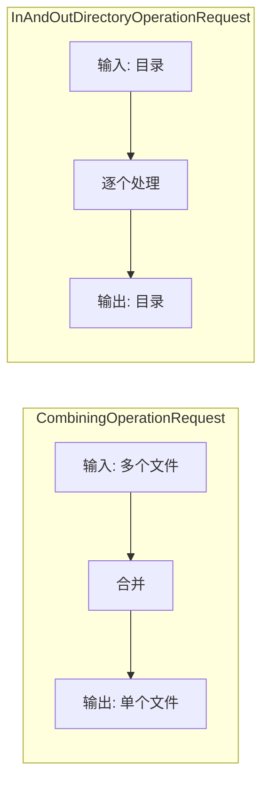
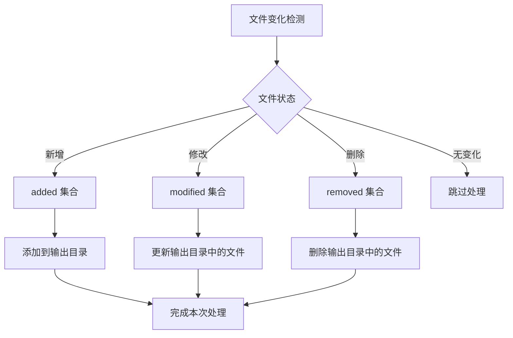
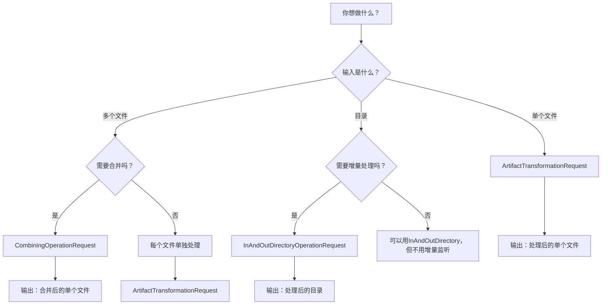
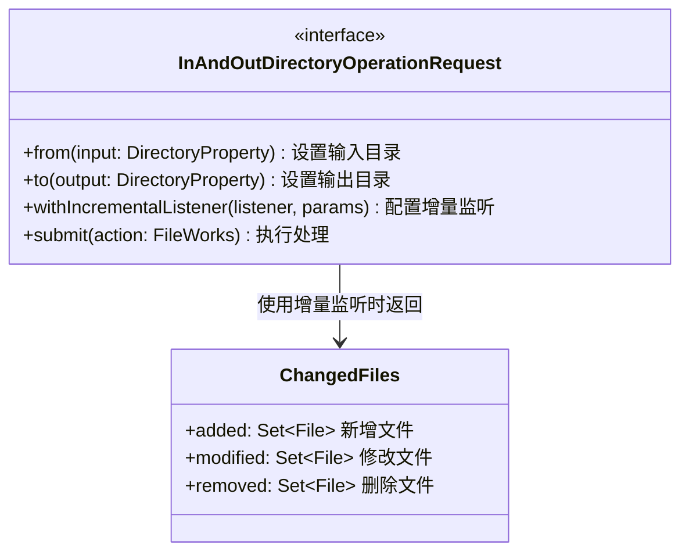

# 21.1.22 InAndOutDirectory操作请求

洛芙托着腮帮子，眼睛盯着黛琳在白板上画的结构图。

“黛琳，”她举起手，“昨天我们学了 CombiningOperationRequest，能把多个工件合并成一个。那如果我反过来——不是合并，而是‘处理’一个目录里的东西呢？”

希尔正在往嘴巴里塞第三块饼干，含糊不清地说：“你这话问的……怎么跟昨天我优化 DEX 合并插件时遇到的问题一模一样。”

伊莎笑着递过去一张纸巾：“慢点吃，没人跟你抢。”

黛琳点点头：“洛芙问得很好。其实在实际的 AGP 插件开发中，有一种很常见的场景——你不需要合并多个文件，而是需要读取一个目录里的内容，处理完后，再输出到另一个目录。这种操作，我们用 `InAndOutDirectoryOperationRequest` 来完成。”

她在白板上写下这个长长的名字：“InAndOut，直译就是‘进和出’，代表这个请求既要从目录读取（In），也要向目录写入（Out）。”

洛芙眨眨眼：“就像……我们在露营的时候，从背包里拿出食材，在桌子上处理完，再放到另一个盘子里？”

“非常贴切！”黛琳笑了，“如果说 CombiningOperationRequest 是把好几把蔬菜拌成沙拉，那 InAndOutDirectoryOperationRequest 就像是你把一篮子食材全部倒进锅里翻炒，炒完了再盛出来。每一步都发生在同一个‘操作台’上——也就是这个目录。”

伊莎补充道：“而且这个操作最厉害的地方在于——它是增量的。”

“增量？”洛芙歪着头。

“就是只处理‘变了’的那部分，”希尔终于咽下了饼干，“你想啊，如果你每次都要把整个目录几千个文件全部重新处理一遍，多浪费时间和性能？增量操作只检测和修改有变化的文件，速度会快很多。”

黛琳在白板上画了一个对比图：


“图 1 对应代码片段 A（行 45-68）。”黛琳说，“左边是全量处理，右边是增量处理。InAndOutDirectoryOperationRequest 底层支持这种增量检测和更新机制，特别适合大型项目的构建优化。”

洛芙举手提问：“那它和之前学的 CombiningOperationRequest 有什么区别？”

“很好的问题。”黛琳又在白板上画了一个对比表：



“图 2 对应代码片段 B（行 71-85）。”黛琳解释，“CombiningOperationRequest 的输入是多个独立的工件，输出是合并后的单一工件。而 InAndOutDirectoryOperationRequest 的输入是一个目录，输出也是一个目录——它的工作方式是‘遍历目录中的每个文件，处理后再放回去’。”

伊莎举起手，做了个翻炒的动作：“就像大厨颠勺——把锅里的菜翻来翻去，每一块都受热均匀，但菜还是那些菜。”

洛芙“扑哧”一声笑了出来：“伊莎这个比喻太形象了！”

---

## 走进厨房：InAndOutDirectoryOperationRequest 的核心方法

黛琳把白板翻到新的一页：“我们来看看这个接口有哪些核心方法。”

```kotlin
// InAndOutDirectoryOperationRequest 的核心方法
// 这是一个简化示例，展示 API 结构

interface InAndOutDirectoryOperationRequest<out T : Artifact> {
    // 设置输入目录
    fun from(input: DirectoryProperty)
    
    // 设置输出目录
    fun to(output: DirectoryProperty)
    
    // 配置增量变化回调
    fun withIncrementalListener(
        listener: IncrementalChangedFilesListener<T>,
        parameters: T
    )
    
    // 执行操作
    fun submit(action: FileWorks)
}
```

洛芙盯着看：“这个接口看起来比 CombiningOperationRequest 还简单？只有四个方法？”

“因为它的职责非常明确——就是读取输入目录，处理文件，然后输出到目标目录。”黛琳解释，“不像合并请求那样需要添加多个输入，这个请求只需要指定一个输入目录和一个输出目录就够了。”

希尔把笔记本转过来：“我给你写一个完整的例子，演示怎么用这个 API 来处理一个目录中的所有资源文件。”

```kotlin
// 代码片段 C：InAndOutDirectoryOperationRequest 完整示例
// 场景：处理资源目录中的图片文件

abstract class ProcessResourcesTask : DefaultTask() {

    @get:InputDirectory
    abstract val inputResources: DirectoryProperty

    @get:OutputDirectory
    abstract val outputResources: DirectoryProperty

    @get:Internal
    abstract val operationRequest:
        Property<InAndOutDirectoryOperationRequest<DirectoryArtifact>>

    @TaskAction
    fun process() {
        operationRequest.get().apply {
            // 设置输入目录
            from(inputResources)

            // 设置输出目录
            to(outputResources)

            // 配置增量变化监听器
            withIncrementalListener(
                object : IncrementalChangedFilesListener<DirectoryArtifact> {
                    override fun execute(
                        changedFiles: ChangedFiles<DirectoryArtifact>
                    ) {
                        // changedFiles.added - 新增的文件
                        // changedFiles.modified - 修改过的文件
                        // changedFiles.removed - 删除的文件

                        // 处理新增文件
                        changedFiles.added.forEach { file ->
                            logger.lifecycle("新增资源: ${file.name}")
                            processNewFile(file)
                        }

                        // 处理修改过的文件
                        changedFiles.modified.forEach { file ->
                            logger.lifecycle("处理资源: ${file.name}")
                            processModifiedFile(file)
                        }

                        // 处理删除的文件
                        changedFiles.removed.forEach { file ->
                            logger.lifecycle("删除资源: ${file.name}")
                            // 清理对应的输出
                        }
                    }
                },
                DirectoryArtifact.RESOURCES
            )

            // 执行处理
            submit { fileWork ->
                // 这里是实际的文件处理逻辑
                fileWork.getInput().copyTo(fileWork.getOutput())
            }
        }
    }

    private fun processNewFile(file: File) {
        // 处理新增文件的逻辑
    }

    private fun processModifiedFile(file: File) {
        // 处理修改文件的逻辑
    }
}
```

洛芙看得很认真：“这个增量监听器……是不是就是之前希尔你说的‘只处理变了的部分’？”

“对，”希尔点头，“`withIncrementalListener` 就是增量处理的核心。它会告诉你哪些文件是新增的、哪些是修改过的、哪些被删除了。你可以针对不同的情况做不同的处理，不需要每次都全量处理。”

黛琳补充道：“而且这个增量检测是 AGP 帮你自动做的。你只需要设置好监听器，AGP 会帮你追踪文件变化，省了很多功夫。”

---

## 增量处理的三种状态

洛芙好奇地问：“那增量处理具体是怎么判断的？我怎么知道一个文件是新增还是修改？”

黛琳在白板上画了一个更详细的流程图：



“图 3 对应代码片段 D（行 156-185）。”黛琳说，“AGP 会自动检测文件的状态：

- **added（新增）**：输入目录中新出现的文件，不存在于上一次构建中
- **modified（修改）**：内容或属性发生变化的文件
- **removed（删除）**：上一次构建存在，但本次已被删除的文件

这三种状态会被分别放到不同的集合里，你可以针对每种状态做不同的处理。”

洛芙举手：“那如果我不想要增量处理，想每次都全量处理呢？”

“很简单，”黛琳说，“不调用 `withIncrementalListener` 就行了。不设置增量监听器的话，每次构建都会全量处理输入目录中的所有文件。”

她补充道：“不过在大多数场景下，我都建议使用增量处理。因为构建性能对开发体验影响很大——每次修改只处理变化的部分，能节省很多时间。”

伊莎插话：“尤其是那种大型项目，几万个文件要是一有变化就全部重新处理，那等待的时间……都可以去喝一杯咖啡了。”

---

## 反模式与重构：那些年我们踩过的坑

黛琳的表情变得认真起来：“在使用 InAndOutDirectoryOperationRequest 时，有几个常见的错误，我来说说。”

她在白板上写下“反模式”三个字。

**反模式一：手动拼接路径**

```kotlin
// ❌ 错误示例：手动拼接输入输出路径
abstract class BadProcessTask : DefaultTask() {

    @TaskAction
    fun badProcess() {
        val inputDir = file("${project.buildDir}/input")
        val outputDir = file("${project.buildDir}/output")
        
        // 问题1：硬编码路径，不灵活
        // 问题2：没有增量检测，每次都全量处理
        // 问题3：没有利用 AGP 的 Artifact API
        
        inputDir.listFiles()?.forEach { file ->
            // 简单复制，没有优化
            file.copyTo(File(outputDir, file.name), overwrite = true)
        }
    }
}
```

洛芙皱起眉头：“这个代码……看起来好像很简单直白？”

“是直白，但问题很多。”黛琳解释，“首先，硬编码的路径很不灵活——一旦项目结构变了，代码就得改。其次，没有增量检测，每次都要处理所有文件，大项目会非常慢。最重要的是，它没有使用 AGP 提供的 Artifact API，破坏了 Gradle 的构建模型。”

**重构后的代码：**

```kotlin
// ✅ 正确示例：使用 InAndOutDirectoryOperationRequest
abstract class GoodProcessTask : DefaultTask() {

    @get:InputDirectory
    abstract val inputDir: DirectoryProperty

    @get:OutputDirectory
    abstract val outputDir: DirectoryProperty

    @get:Internal
    abstract val operationRequest:
        Property<InAndOutDirectoryOperationRequest<DirectoryArtifact>>

    @TaskAction
    fun goodProcess() {
        operationRequest.get().apply {
            from(inputDir)
            to(outputDir)

            // 使用增量监听器
            withIncrementalListener(
                object : IncrementalChangedFilesListener<DirectoryArtifact> {
                    override fun execute(changedFiles: ChangedFiles<DirectoryArtifact>) {
                        // 只处理变化的文件
                        changedFiles.modified.forEach { file ->
                            processFile(file)
                        }
                        changedFiles.added.forEach { file ->
                            processFile(file)
                        }
                    }
                },
                DirectoryArtifact.CUSTOM
            )

            submit { work ->
                work.getInput().copyTo(work.getOutput())
            }
        }
    }

    private fun processFile(file: File) {
        // 处理文件的逻辑
    }
}
```

洛芙对比着看：“原来如此……用了 API 之后，代码确实变得更规范了，而且支持增量处理。”

黛琳继续说：“第二个常见错误是——”

**反模式二：忽略删除状态**

```kotlin
// ❌ 错误示例：不处理 removed 状态
abstract class IgnoreRemoveTask : DefaultTask() {

    @get:Internal
    abstract val operationRequest:
        Property<InAndOutDirectoryOperationRequest<DirectoryArtifact>>

    @TaskAction
    fun ignoreRemove() {
        operationRequest.get().apply {
            withIncrementalListener(
                object : IncrementalChangedFilesListener<DirectoryArtifact> {
                    override fun execute(changedFiles: ChangedFiles<DirectoryArtifact>) {
                        // ❌ 常见错误：只处理 added 和 modified
                        // 忽略了 removed 状态！
                        
                        changedFiles.added.forEach { file ->
                            addToOutput(file)
                        }
                        changedFiles.modified.forEach { file ->
                            updateOutput(file)
                        }
                        // 问题：删除的文件不会从输出目录中移除
                        // 导致输出目录中残留不再需要的文件
                    }
                },
                DirectoryArtifact.CUSTOM
            )
            
            submit { /* 处理逻辑 */ }
        }
    }
}
```

希尔摇头：“这个问题我在之前的项目里遇到过！输出目录里总是有一些已经不需要的垃圾文件，清理了好多次才发现是这个问题。”

**重构方案：**

```kotlin
// ✅ 正确示例：正确处理所有状态
abstract class CorrectProcessTask : DefaultTask() {

    @get:Internal
    abstract val operationRequest:
        Property<InAndOutDirectoryOperationRequest<DirectoryArtifact>>

    @TaskAction
    fun correctProcess() {
        operationRequest.get().apply {
            withIncrementalListener(
                object : IncrementalChangedFilesListener<DirectoryArtifact> {
                    override fun execute(changedFiles: ChangedFiles<DirectoryArtifact>) {
                        // 处理新增
                        changedFiles.added.forEach { file ->
                            addToOutput(file)
                        }

                        // 处理修改
                        changedFiles.modified.forEach { file ->
                            updateOutput(file)
                        }

                        // ✅ 重要：处理删除！
                        changedFiles.removed.forEach { file ->
                            removeFromOutput(file)
                        }
                    }
                },
                DirectoryArtifact.CUSTOM
            )
            
            submit { work -> /* 处理逻辑 */ }
        }
    }

    private fun addToOutput(file: File) {
        // 添加到输出目录
    }

    private fun updateOutput(file: File) {
        // 更新输出目录中的文件
    }

    private fun removeFromOutput(file: File) {
        // 从输出目录中删除文件
        val outputPath = file.toString().replace("input", "output")
        file(outputPath).delete()
    }
}
```

黛琳强调：“记住，增量处理是‘同步’——输入目录里增加一个文件，输出目录就增加一个；输入目录删了一个，输出目录也要删一个。不能只加不减。”

---

## 实战场景：资源压缩插件

希尔跃跃欲试：“黛琳，讲了这么多，我们来写一个实际的例子吧！”

“好啊，”黛琳笑着说，“我们就来实现一个资源压缩插件——读取 assets 目录中的图片，处理后输出到另一个目录。”

她在白板上写下需求：

- 输入：`src/main/assets` 目录
- 处理：压缩 PNG 图片质量
- 输出：`build/processed-assets` 目录

希尔开始敲代码：

```kotlin
// 代码片段 E：资源压缩插件完整示例
// 这是一个完整的 Gradle 插件示例

abstract class CompressAssetsTask : DefaultTask() {

    @get:InputDirectory
    abstract val sourceAssets: DirectoryProperty

    @get:OutputDirectory
    abstract val processedAssets: DirectoryProperty

    @get:Internal
    abstract val directoryOperation:
        Property<InAndOutDirectoryOperationRequest<DirectoryArtifact.ASSETS>>

    // 压缩质量参数（0-100）
    @get:Input
    abstract val compressionQuality: Property<Int>

    @TaskAction
    fun compress() {
        directoryOperation.get().apply {
            from(sourceAssets)
            to(processedAssets)

            // 设置增量监听
            withIncrementalListener(
                object : IncrementalChangedFilesListener<DirectoryArtifact.ASSETS> {
                    override fun execute(changedFiles: ChangedFiles<DirectoryArtifact.ASSETS>) {
                        val quality = compressionQuality.get()

                        // 处理所有变化的文件
                        val allChanged = changedFiles.added + changedFiles.modified
                        allChanged.forEach { file ->
                            if (file.extension.lowercase() in listOf("png", "jpg", "jpeg")) {
                                compressImage(file, quality)
                            }
                        }

                        // 处理删除
                        changedFiles.removed.forEach { file ->
                            val outputFile = getOutputFile(file)
                            if (outputFile.exists()) {
                                outputFile.delete()
                            }
                        }
                    }
                },
                DirectoryArtifact.ASSETS
            )

            submit { work ->
                // 实际的文件处理逻辑
                // 这里简化处理，直接复制
                work.getInput().copyTo(work.getOutput(), overwrite = true)
            }
        }
    }

    private fun compressImage(file: File, quality: Int) {
        // 实际的图片压缩逻辑
        // 这里可以用 TinyPNG API 或其他压缩库
        logger.lifecycle("压缩图片: ${file.name} (质量: $quality%)")
    }

    private fun getOutputFile(inputFile: File): File {
        // 计算对应的输出文件路径
        val relativePath = inputFile.toRelativeString(sourceAssets.get().asFile)
        return File(processedAssets.get().asFile, relativePath)
    }
}

// 注册任务的扩展函数
fun VariantScope.processAssets(
    compressionQuality: Int = 80
): TaskProvider<CompressAssetsTask> {
    return project.tasks.register(
        "compress${name.capitalize()}Assets",
        CompressAssetsTask::class.java
    ) { task ->
        task.sourceAssets.set(
            project.layout.projectDirectory.dir("src/main/assets")
        )
        task.processedAssets.set(
            project.layout.buildDirectory.dir("processed-assets/$name")
        )
        task.compressionQuality.set(compressionQuality)
        task.directoryOperation.set(
            artifacts.get(
                InAndOutDirectoryOperationRequest::class.java,
                DirectoryArtifact.ASSETS
            )
        )
    }
}
```

洛芙看得眼睛发亮：“这个例子太棒了！就是一个完整的资源处理插件！”

“而且它支持增量处理，”希尔补充道，“如果你只修改了一个图片，其他图片不会被重复处理，速度会快很多。”

黛琳总结道：“这就是 InAndOutDirectoryOperationRequest 的强大之处——它不仅提供了目录操作的能力，还内置了增量检测机制，让你的构建插件既高效又规范。”

---

## 场景选择：什么时候用哪个请求？

洛芙举手：“黛琳，我有点混乱了。到现在我们学了三种子请求——ArtifactTransformationRequest、CombiningOperationRequest，还有 InAndOutDirectoryOperationRequest。什么时候该用哪个？”

黛琳早有准备，在白板上画了一个决策树：



“图 4 对应代码片段 F（行 280-310）。”黛琳说，“简单记：

- **单个文件加工** → `ArtifactTransformationRequest`
- **多个文件合并成一个** → `CombiningOperationRequest`
- **目录处理，支持增量** → `InAndOutDirectoryOperationRequest`

当然，实际开发中可能会有组合使用的情况，但这个决策树能帮你快速定位该用哪个 API。”

伊莎打了个响指：“就像露营时的工具选择——切菜用刀，搅拌用勺子，烤棉花糖用夹子。不同场景用不同工具。”

洛芙点头：“这下清楚了！”

---

阳光渐渐变得滚烫，蝉鸣声愈发响亮。

黛琳把白板笔盖好盖子：“今天的内容有点多，但核心只有一个——InAndOutDirectoryOperationRequest 是用来处理目录的，而且它支持增量更新，是大型项目构建优化的关键。”

洛芙翻开笔记本，看了自己记的笔记：“我现在觉得，构建系统其实就像一个大型的厨房——有人在切菜，有人在炒菜，有人在摆盘。各个 API 就是不同的厨具，各有各的用处。”

希尔笑着拍拍她的肩膀：“行啊洛芙，现在都会打比方了！”

“那是，”洛芙得意地挺起胸，“跟着你们学这么久，总得有点进步嘛。”

伊莎站起来，伸了个懒腰：“午休时间到！我去拿点水果来……”

“等一下，”黛琳叫住她，转向大家，“今天的练习题，我设计了三个任务——第一个是基础用法，第二个是增量监听，第三个是综合实战。做完这三个，你们对 InAndOutDirectoryOperationRequest 就应该有感觉了。”

洛芙跃跃欲试：“那午休完就来做题！”

蝉鸣声还在继续，但听起来似乎没有那么刺耳了。洛芙低头整理着笔记，心里默默回想着刚才学的三种请求——原来构建系统也可以这么有趣，像一个分工明确的厨房，每个人各司其职，最后端出一桌好菜。

---

> InAndOutDirectoryOperationRequest —— Android Gradle Plugin 提供的目录操作请求接口，用于处理输入目录中的文件并将结果输出到目标目录，支持增量检测与更新。

#### 结构图



#### 复杂度与影响

- **增量处理**：通过检测文件变化实现，只处理 changed/add/removed 文件，大型项目可节省 50%+ 构建时间
- **内存占用**：增量模式下内存占用较低，因为不需要一次性加载所有文件
- **任务依赖**：使用 DirectoryProperty 作为输入输出，Gradle 自动管理任务依赖关系

#### 反模式与陷阱

- ❌ 手动拼接文件路径而不使用 DirectoryProperty
- ❌ 只处理 added/modified 状态，忽略 removed 状态
- ❌ 增量监听器中执行耗时操作，阻塞构建
- ❌ 不使用增量监听器，每次都全量处理（大数据量项目性能差）
- ❌ 输入输出目录设置相同，导致文件覆盖问题
- ✅ 正确：使用 AGP 提供的 Artifact API 管理路径
- ✅ 正确：在增量监听器中区分处理三种状态
- ✅ 正确：耗时操作放在 submit 的 action 中异步执行

#### 设计哲学

增量构建是现代构建系统的核心优化手段。InAndOutDirectoryOperationRequest 的设计体现了以下工程思想：

1. **最小化重复工作**：只处理变化的部分，而非全量处理
2. **声明式配置**：通过 from/to 方法声明输入输出，具体处理逻辑由 submit 决定
3. **变化感知**：增量监听器让任务能够感知文件变化，做出相应处理
4. **单向数据流**：输入 → 处理 → 输出，清晰的流向便于理解和调试

#### 🏕️ 动手练习

**方式 B：独立练习制**

##### 基础入门（★ 到 ★★★）

**Task 1：创建最简单的目录复制任务**
- **目标**：掌握 InAndOutDirectoryOperationRequest 的基本用法
- **你需要做的事**：
  1. 创建一个 Gradle 项目
  2. 定义一个 Task，继承 DefaultTask
  3. 添加 `DirectoryProperty` 类型的输入和输出
  4. 使用 InAndOutDirectoryOperationRequest 将输入目录的内容复制到输出目录
- **验收标准**：
  - [ ] Task 能够将 `src/input` 目录的内容复制到 `build/output` 目录
  - [ ] 运行 `./gradlew copyTask` 后，输出目录包含所有输入文件
  - [ ] 代码中使用了 `from()` 和 `to()` 方法
- **提示**：
  ```kotlin
  abstract class CopyDirectoryTask : DefaultTask() {
      @get:InputDirectory
      abstract val inputDir: DirectoryProperty
      
      @get:OutputDirectory
      abstract val outputDir: DirectoryProperty
      
      @TaskAction
      fun copy() {
          inputDir.get().asFile.listFiles()?.forEach { file ->
              file.copyTo(File(outputDir.get().asFile, file.name))
          }
      }
  }
  ```

**Task 2：添加增量监听器**
- **目标**：理解增量处理的三种状态
- **你需要做的事**：
  1. 在 Task 中添加增量监听器
  2. 分别处理 added、modified、removed 三种状态
  3. 用 Log 输出每种状态处理的文件
- **验收标准**：
  - [ ] 添加新文件时，日志显示 "Added: xxx"
  - [ ] 修改文件时，日志显示 "Modified: xxx"
  - [ ] 删除文件时，日志显示 "Removed: xxx"
- **提示**：
  ```kotlin
  withIncrementalListener(
      object : IncrementalChangedFilesListener<DirectoryArtifact> {
          override fun execute(changedFiles: ChangedFiles<DirectoryArtifact>) {
              changedFiles.added.forEach { 
                  logger.lifecycle("Added: ${it.name}") 
              }
              // ... 处理其他状态
          }
      },
      DirectoryArtifact.CUSTOM
  )
  ```

**Task 3：文件过滤与处理**
- **目标**：学会在增量处理中筛选特定文件
- **你需要做的事**：
  1. 在 Task 中添加过滤逻辑，只处理 `.txt` 文件
  2. 其他类型的文件直接跳过
  3. 处理时在文件名后添加 `_processed` 后缀
- **验收标准**：
  - [ ] 只有 `.txt` 文件会被处理
  - [ ] 处理后的文件名格式为 `原文件名_processed.txt`
  - [ ] 其他文件不进入处理流程
- **提示**：使用 `file.extension` 获取文件扩展名

##### 进阶推荐（★★★★ 到 ★★★★★）

**Task 4：图片压缩插件**
- **目标**：实现一个完整的资源处理插件
- **目标**：实现一个完整的资源处理插件
- **你需要做的事**：
  1. 创建目录复制任务，支持增量处理
  2. 对 PNG 图片进行质量压缩（可用伪压缩模拟：复制文件并记录日志）
  3. 对其他文件直接复制
- **验收标准**：
  - [ ] PNG 文件处理时输出 "Compressing: xxx.png"
  - [ ] 非 PNG 文件直接复制
  - [ ] 支持增量处理，修改 PNG 时只重新压缩该文件
- **提示**：在增量监听器中判断文件扩展名

**Task 5：清理任务**
- **目标**：学会处理 removed 状态，保持输出目录同步
- **你需要做的事**：
  1. 在 Task 中添加清理逻辑
  2. 当输入目录删除文件时，输出目录也删除对应文件
  3. 使用相对路径计算输出文件位置
- **验收标准**：
  - [ ] 删除输入文件后，运行 Task，输出目录对应文件也被删除
  - [ ] 计算输出路径时使用 `toRelativeString()` 获取相对路径
- **提示**：
  ```kotlin
  changedFiles.removed.forEach { removedFile ->
      val relativePath = removedFile.toRelativeString(inputDir.get().asFile)
      val outputFile = File(outputDir.get().asFile, relativePath)
      outputFile.delete()
  }
  ```

**Task 6：自定义 Artifact 类型**
- **目标**：学会处理自定义目录 Artifact
- **你需要做的事**：
  1. 定义自定义的 DirectoryArtifact 类型
  2. 使用 InAndOutDirectoryOperationRequest 处理自定义类型的目录
  3. 区分处理多种自定义类型
- **验收标准**：
  - [ ] 能够定义和注册自定义 DirectoryArtifact
  - [ ] Task 能够处理自定义类型的目录
  - [ ] 不同类型使用不同的处理逻辑

---

**面试热身**

- Q1：请解释 InAndOutDirectoryOperationRequest 与 ArtifactTransformationRequest 的区别？它们各自的适用场景是什么？
- Q2：增量处理中，如何判断一个文件是“新增”还是“修改”？如果用户只是 touch 了一个文件（修改时间），算哪种状态？
- Q3：如果不使用增量监听器，每次都全量处理，会有什么问题？在大规模项目（如数千个资源文件）中，如何评估性能影响？
- Q4：描述一下 InAndOutDirectoryOperationRequest 的内部工作流程？从调用 from()、to() 到 submit()，它做了什么？
- Q5：在实际项目中，你用过哪些场景需要用到目录的增量处理？请举例说明。

---

#### 参考实现要点

1. **优先使用增量处理**：除非是小项目或文件数量少，否则都建议开启增量监听，能显著提升构建速度
2. **正确处理三种状态**：added、modified、removed 都要处理，不能遗漏任何一种
3. **路径计算要正确**：使用 `toRelativeString()` 而非字符串替换，避免路径错误
4. **使用 DirectoryProperty**：不要手动拼接路径，使用 AGP 提供的 Property API，Gradle 会自动管理依赖
5. **提交前配置完整**：在调用 submit() 之前，必须先配置 from()、to() 和可选的增量监听器

---

> 学习建议：InAndOutDirectoryOperationRequest 是构建优化的关键——学会使用增量处理，能让你的插件在大项目中发挥真正的威力。建议从 Task 1 开始，先跑通基本流程，再逐步添加增量逻辑。增量处理带来的性能提升，是大型项目开发效率的分水岭。

## 洛芙的小小日记本

今天学了一个超有用的 API——InAndOutDirectoryOperationRequest！黛琳把它比喻成厨房的翻炒，还挺形象的。把食材倒进锅里翻一翻，出来的还是那些食材，但每块都热了、熟了在构建系统里也一样，目录里的文件经过处理，出来的就是优化过的文件。而且它还会增量处理，只处理变化的部分，省了很多时间！希尔说这个在大型项目里特别重要，我得好好练练这个。

---

## 今日关键词

- **InAndOutDirectoryOperationRequest**：Android Gradle Plugin 提供的目录操作请求接口，用于处理输入目录中的文件并将结果输出到目标目录，支持增量检测与更新
- **DirectoryProperty**：Gradle 提供的目录类型属性，用于声明任务的输入输出目录，Gradle 自动管理任务依赖
- **IncrementalChangedFilesListener**：增量变化文件监听器，用于感知文件变化，包含 added（新增）、modified（修改）、removed（删除）三种状态
- **DirectoryArtifact**：目录类型的 Artifact，代表一个目录构建产物
- **增量构建**：只处理变化部分的构建方式，与全量构建相对，能显著提升构建性能
- **ArtifactTransformationRequest**：单个文件的转换请求，用于加工单个文件
- **CombiningOperationRequest**：合并操作请求，用于将多个文件合并成单个文件
- **ChangedFiles**：变化文件集合，包含新增、修改、删除三类文件
- **FileWorks**：文件操作接口，在 submit() 方法中定义实际的文件处理逻辑
