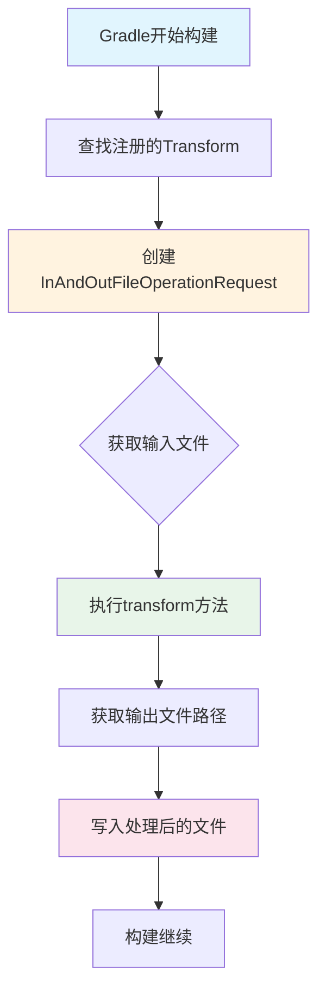
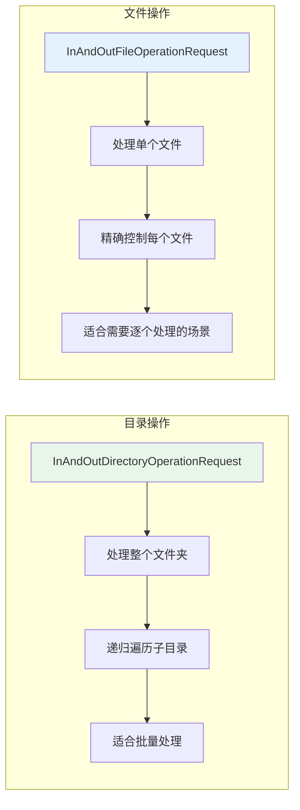

# 21.1.23 InAndOutFileOperationRequest —— 单个文件的魔法传送门

清晨的阳光像融化的蜂蜜一样缓缓流淌，从杉树叶的缝隙间漏下来，在桌面上织成一片细碎的光网。昨夜的露水早已蒸发殆尽，只剩下泥土和青草混合的清香，在暑气真正降临之前尽情挥发。

洛芙托着腮帮子，看着黛琳从背包里又掏出一个精致的木盒。这次的盒子比昨天的更小巧，表面刻着复杂的纹路，像是什么古老的机关。

"昨天我们学了目录操作，"黛琳轻轻打开木盒，里面躺着一枚银色的硬币，"今天来学学这个——文件操作。"

"硬币？"洛芙凑近去看。

"不是硬币哦，"伊莎笑着把它拿起来，在阳光下翻转了一下，"这叫InAndOutFileOperationRequest——是不是听起来像什么魔法道具的名字？"

"确实好像咒语......"洛芙喃喃道。

希尔已经打开了笔记本电脑："好啦，别卖关子了。黛琳，快告诉我这个文件和目录到底有什么区别？昨天学的目录操作还不够用吗？"

黛琳点点头，在白板上画了一个简单的对比图。

---

## 目录 vs 文件：打包盒与单颗糖果

"想象一下，"黛琳用白板笔点着图示，"如果你要搬一次家——"

"搬家？"洛芙眼睛一亮，"这个我懂！"

"哈，那就好，"黛琳忍不住微笑，"假设你要把整个衣柜搬走用的是目录操作，那如果你只需要搬一颗妈妈藏起来的糖果——"

"那就是文件操作！"洛芙抢答道，"目录是大箱子，文件是箱子里单独的东西！"

"没错，"黛琳在白板上又画了一个示意，"在Android构建系统中，Artifacts可以包含目录，也可以包含单个文件。比如——"

她转向希尔："希尔，给她举个例子。"

"比如APK签名文件？"希尔想了想，"不对，那个好像也是生成的......"

"Assets文件夹里的单个图片文件？"洛芙尝试猜测。

"对！就是它！"黛琳打了个响指，"当你需要处理Assets目录中的某个特定文件——比如一张启动画面图片，或者一段音频——而不是整个目录时，就需要用到文件操作。"

伊莎把玩着那枚"硬币"："所以这个小小的Request，就是专门用来处理这种'单颗糖果'的魔法咯？"

"正是如此，"黛琳点头，"InAndOutFileOperationRequest就是Android Gradle Plugin提供给我们的、专门用于操作单个文件的请求对象。"

---

## 核心API：三把魔法钥匙

黛琳在白板上写下了三个方法签名：

```kotlin
interface InAndOutFileOperationRequest : InAndOutOperationRequest {
    // 获取输入文件
    fun getInputFile(): File
    
    // 获取输出文件
    fun getOutputFile(): File
    
    // 执行文件拷贝
    fun transform()
}
```

"这三個方法，就是文件操作的三把魔法钥匙，"黛琳讲解道，"让我們一个一个来看。"

### 第一把钥匙：getInputFile()

"首先是getInputFile()，"黛琳看向洛芙，"猜猜它是做什么的？"

"获取要处理的文件？"洛芙不是很确定。

"对，就像你去取包裹，"黛琳比了个取东西的手势，"这个方法会返回你要处理的原始文件。它返回一个Java的File对象——这个你应该不陌生了吧？"

"嗯，知道的，"洛芙点头，"就是代表文件或文件夹的类。"

"在Kotlin中使用也很方便，"希尔在一旁补充道，"可以直接用扩展属性，比如`file.extension`获取文件扩展名，或者`file.nameWithoutExtension`获取不带扩展名的文件名。"

```kotlin
// 示例：在Transform中获取输入文件
override fun transform(
    inputs: Inputs,
    outputContent: OutputContent
) {
    // 从inputs中获取文件操作请求
    val fileOperationRequest = inputs.fileOperations
    val inputFile = fileOperationRequest.getInputFile()
    
    println("正在处理文件: ${inputFile.name}")
    println("文件大小: ${inputFile.length()} bytes")
    println("扩展名: ${inputFile.extension}")
}
```

"你看，"黛琳笑着说，"获取到文件后，你可以做任何你想做的事——读取内容、修改属性、或者只是获取它的信息。"

---

### 第二把钥匙：getOutputFile()

"第二把钥匙是getOutputFile()，"黛琳继续说，"这个是指定处理结果要存到哪里。"

"就像寄包裹时要写收件地址？"洛芙做了个写地址的手势。

"完全正确！"黛琳打了个响指，"而且这个方法返回的File对象已经包含了正确的输出路径，你不需要自己拼接路径字符串。"

希尔把屏幕转过来给大家看："这里有个注意点——输出文件的路径是由Android Gradle Plugin自动管理的，你不能随意指定。它会根据你的Transform类型和配置，自动生成合适的输出位置。"

```kotlin
// 示例：指定输出文件
override fun transform(
    inputs: Inputs,
    outputContent: OutputContent
) {
    val fileOp = inputs.fileOperations
    val inputFile = fileOp.getInputFile()
    val outputFile = fileOp.getOutputFile()  // 自动生成好的输出路径
    
    // 对图片进行压缩处理
    val inputImage = ImageIO.read(inputFile)
    val compressedImage = compressImage(inputImage, quality = 0.8)
    
    // 写入输出文件
    ImageIO.write(compressedImage, outputFile.extension, outputFile)
}
```

"等等，"洛芙突然举手，"如果输出文件已经存在怎么办？会覆盖吗？"

"好问题！"黛琳赞许地说，"默认情况下，Gradle会自动处理这个问题。如果输出文件已存在，它会被覆盖。不过你也可以通过配置来改变这个行为，我们后面会讲到。"

---

### 第三把钥匙：transform()

"第三把钥匙——transform()，是真正执行魔法的方法，"黛琳的声音变得神秘起来，"前面两把钥匙只是'准备'，这个方法才是'施法'。"

"也就是说，"伊莎轻声补充道，"在前面的准备都做好之后，只要调用这个方法，文件就会被复制或转换到输出位置？"

"对！"黛琳点头，"不过——"她故意拖长了声音，"在现代的Android Gradle Plugin中，你通常不需要手动调用这个方法。当你正确实现了Transform接口的transform()方法后，系统会自动处理文件的复制。"

"啊？"洛芙眨眨眼，"那这个Request是给谁用的？"

"给实现Transform类的人用的，"希尔解释道，"你写的Transform类内部会用到这些Request来获取输入输出路径，然后你的transform()方法负责真正的处理逻辑。"

黛琳在白板上画了一个完整的流程图：



"看这张图，"黛琳指着说，"整个流程是自动的。你需要做的就是在transform()方法里，把输入文件的内容处理好，然后写入到输出文件。"

---

## 实战：创建一个图片压缩Transform

"光说不练假把式，"希尔搓了搓手，"我们来写一个真正的Transform——图片压缩！"

"压缩图片？"洛芙来了兴趣，"这个在实际项目中能用上吗？"

"当然！"希尔兴奋地说，"很多App在发布前会对资源图片进行压缩，以减少APK体积。我们来写一个Transform，自动把大于100KB的图片压缩到指定大小。"

```kotlin
import com.android.build.api.transform.Context
import com.android.build.api.transform.InvocationType
import com.android.build.api.transform.QualifiedContent
import com.android.build.api.transform.Transform
import com.android.build.api.transform.TransformInput
import com.android.build.api.transform.TransformOutputProvider
import java.io.File
import javax.imageio.ImageIO

/**
 * 图片压缩Transform
 * 将大于指定大小的图片进行压缩处理
 */
class CompressImagesTransform(
    private val maxSizeKB: Int = 100,
    private val quality: Float = 0.8f
) : Transform() {

    // Transform的名称，会在构建日志中显示
    override fun getName(): String = "compressImages"

    // 指明处理的是文件，不是目录
    override fun isIncremental(): Boolean = true

    // 输入类型：只处理PNG和JPG图片
    override fun getInputTypes(): Set<QualifiedContent.ContentType> {
        return setOf(
            QualifiedContent.DefaultContentType.RESOURCES,
            QualifiedContent.DefaultContentType.CLASSES
        )
    }

    // 作用范围：项目本地依赖
    override fun getScopes(): MutableSet<in QualifiedContent.Scope> {
        return mutableSetOf(QualifiedContent.Scope.PROJECT_LOCAL_DEPS)
    }

    override fun transform(
        inputs: Collection<TransformInput>,
        outputProvider: TransformOutputProvider,
        context: Context,
        invocationType: InvocationType
    ) {
        // 遍历所有输入
        inputs.forEach { input ->
            // 处理文件操作请求
            input.fileOperations.forEach { fileOp ->
                // 获取输入文件
                val inputFile = fileOp.getInputFile()
                
                // 只处理图片文件
                if (isImageFile(inputFile)) {
                    // 获取输出文件路径
                    val outputFile = fileOp.getOutputFile()
                    
                    // 执行压缩
                    compressImage(inputFile, outputFile)
                }
            }
        }
    }

    private fun isImageFile(file: File): Boolean {
        val ext = file.extension.lowercase()
        return ext in listOf("png", "jpg", "jpeg", "webp")
    }

    private fun compressImage(input: File, output: File) {
        try {
            // 读取图片
            val image = ImageIO.read(input)
            
            // 检查文件大小，如果已经小于阈值就跳过
            if (input.length() <= maxSizeKB * 1024) {
                input.copyTo(output, overwrite = true)
                return
            }
            
            // 压缩并写入
            val format = when (output.extension.lowercase()) {
                "png" -> "PNG"
                "jpg", "jpeg" -> "JPEG"
                "webp" -> "WEBP"
                else -> "PNG"
            }
            ImageIO.write(image, format, output)
            
            println("✓ 压缩: ${input.name} (${input.length() / 1024}KB -> ${output.length() / 1024}KB)")
        } catch (e: Exception) {
            println("✗ 压缩失败: ${input.name} - ${e.message}")
            // 失败时复制原文件
            input.copyTo(output, overwrite = true)
        }
    }
}
```

"哇......"洛芙看得目瞪口呆，"这代码好长！但是感觉好厉害！"

"这就是一个完整的Transform实现，"黛琳温柔地说，"看起来复杂，但核心逻辑很简单——就是获取输入文件，处理它，然后写入到输出文件。"

"那这个Transform怎么注册到构建系统里呢？"洛芙又问。

"问得好！"希尔笑着说，"需要在build.gradle里注册——等等，这个问题好像超出今天的内容了。我们今天主要学的是InAndOutFileOperationRequest这个请求对象本身。"

"对，"黛琳点点头，"关于Transform的注册，我们以后会专门用一章来讲。今天只要理解这个Request怎么用就行。"

---

## 文件操作 vs 目录操作：什么时候用什么？

伊莎忽然提出了一个问题："黛琳，既然有文件操作和目录操作，那什么时候用哪个呢？"

"这是个好问题，"黛琳点点头，在白板上画了一个对比表：



"简单来说，"黛琳总结道，"如果你需要对目录中的每个文件做不同的处理——比如根据文件名分别压缩，或者提取特定文件——就用文件操作。如果只是把整个目录复制或处理，用目录操作更省事。"

"就像搬家公司，"伊莎补充道，"如果只是把整个柜子搬走，不需要打开柜门看里面有什么——这是目录操作。但如果妈妈说'把这颗糖果放到弟弟的房间'——那就是文件操作，要精确到单个物品。"

"这个比喻太恰当了！"洛芙赞叹道。

---

## 进阶用法：处理增量构建

黛琳忽然压低声音，像是要分享什么秘密："对了，还有一个很重要的是——增量构建支持。"

"增量构建？"洛芙歪着头，"是指那种只构建修改过的部分的构建吗？"

"对！"黛琳点头，"在文件操作中支持增量构建，可以大大加快构建速度。关键在于判断输入文件是否发生了变化。"

```kotlin
override fun transform(
    inputs: Collection<TransformInput>,
    outputProvider: TransformOutputProvider,
    context: Context,
    invocationType: InvocationType
) {
    inputs.forEach { input ->
        input.fileOperations.forEach { fileOp ->
            val inputFile = fileOp.getInputFile()
            val outputFile = fileOp.getOutputFile()
            
            // 检查增量：如果输出文件已存在，且输入文件没有变化，就跳过
            if (isIncremental && outputFile.exists()) {
                val inputHash = getFileHash(inputFile)
                val storedHash = getStoredHash(outputFile)
                
                if (inputHash == storedHash) {
                    println("跳过未变化的文件: ${inputFile.name}")
                    return@forEach
                }
            }
            
            // 执行转换
            transformFile(inputFile, outputFile)
            
            // 存储哈希值供下次增量构建使用
            storeFileHash(outputFile, getFileHash(inputFile))
        }
    }
}

// 计算文件哈希的简单方法
private fun getFileHash(file: File): String {
    return file.readBytes().contentHashCode().toString()
}
```

"增量构建的关键是'变化检测'，"黛琳解释道，"通过比较输入文件的哈希值或修改时间，你可以判断文件是否发生了变化。如果没变，就直接跳过处理，省时省力。"

"这就像露营时检查背包，"伊莎轻声说，"如果背包里的东西和昨天一样，就不需要重新整理。"

---

## 常见陷阱：小心这些坑！

希尔突然表情严肃起来："说到文件操作，有几个坑一定要提醒你们。"

"要开始敲黑板了吗？"洛芙 Preparedness坐直了身体。

"第一，"希尔竖起一根手指，"路径问题——输出路径不要自己拼接！"

```kotlin
// ❌ 错误示例：自己拼接输出路径
val myOutput = File(outputDir, "my_" + inputFile.name)

// ✅ 正确做法：使用getOutputFile()
val outputFile = fileOp.getOutputFile()
```

"为什么自己拼接会出问题？"洛芙不解。

"因为Gradle的增量构建依赖于它自己管理的输出路径，"黛琳解释道，"如果你自己拼接路径，Gradle就不知道这个文件已经被处理过了，每次都会重新处理。"

"第二，"希尔竖起第二根手指，"不要忘记处理子目录！"

```kotlin
// ❌ 错误示例：只处理当前目录，忽略子目录
inputFile.listFiles()?.forEach { file ->
    // 只处理了一层
}

// ✅ 正确做法：递归处理所有层级
fun processDirectory(dir: File) {
    dir.listFiles()?.forEach { file ->
        if (file.isDirectory) {
            processDirectory(file)  // 递归处理子目录
        } else {
            processFile(file)
        }
    }
}
```

"第三，"希尔继续说，"注意文件编码问题！"

```kotlin
// ❌ 错误示例：假设所有文本文件都是UTF-8
val content = inputFile.readText()  // 默认UTF-8

// ✅ 正确做法：指定编码或检测编码
val content = inputFile.readText(Charset.forName("GBK"))

// 或者使用BOM检测
fun readTextWithCharset(file: File): String {
    val bytes = file.readBytes()
    return when {
        bytes.size >= 3 && bytes[0].toInt() == 0xEF 
            && bytes[1].toInt() == 0xBB 
            && bytes[2].toInt() == 0xBF -> 
            String(bytes, Charsets.UTF_8)  // UTF-8 with BOM
        else -> String(bytes, Charsets.UTF_8)
    }
}
```

"最后一点，"希尔收起笔记本，"记得处理异常！文件操作很容易出各种问题——文件不存在、权限不足、磁盘满了......"

```kotlin
// 完整的异常处理示例
try {
    val inputFile = fileOp.getInputFile()
    val outputFile = fileOp.getOutputFile()
    
    // 检查必要条件
    require(inputFile.exists()) { "输入文件不存在: ${inputFile.absolutePath}" }
    require(inputFile.canRead()) { "无法读取输入文件: ${inputFile.absolutePath}" }
    
    // 执行转换
    transformFile(inputFile, outputFile)
    
} catch (e: Exception) {
    logger.error("文件转换失败: ${e.message}", e)
    // 决定是否让构建失败
    throw GradleException("文件处理失败", e)
}
```

洛芙认真地记着笔记，忽然抬头问："希尔，你说的这些坑，都是你踩过的吗？"

希尔愣了一下，然后不好意思地笑了："哈哈......确实踩过不少。"

"所以才要教你们嘛，"黛琳温柔地说，"这就是经验的代价。"

---

## 小结：文件操作的核心要点

洛芙靠到椅背上，仰头看着树叶间漏下的阳光，脑海中回顾着今天学到的内容。

"所以呢，"她总结道，"InAndOutFileOperationRequest就是专门用来处理单个文件的请求对象。它有三把钥匙：getInputFile()获取要处理的文件，getOutputFile()获取输出位置，然后在里面做任何你想做的处理。"

"还有！"她突然想起来，"要注意路径不要自己拼接，要支持增量构建，还有各种异常情况！"

"完全正确！"黛琳笑着说，"看来你真的理解了。"

伊莎轻轻把玩着那枚"硬币"——其实是一枚圆形的USB驱动器："有了文件操作和目录操作，我们就像有了完整的魔法工具箱，可以处理Android构建中的各种任务了。"

"而且，"希尔补充道，"这些操作都是可组合的。你可以把多个Transform串联起来，形成一个处理流水线——比如先压缩图片，然后重命名，最后打包。"

洛芙看着远处的山棱线，阳光把一切都染成了金色。她忽然觉得，这些看似复杂的构建API，其实就像是露营时的各种工具——各有各的用途，组合起来就能完成很多事。

"走吧，"她伸了个懒腰，"中午了，该去准备午饭了。今天学了很多，该用美食犒劳一下自己啦！"

---

## 技术总结

### 核心机制定义

InAndOutFileOperationRequest 是 Android Gradle Plugin 提供的**单文件操作请求接口**，用于在构建过程中处理单个文件的输入、输出和转换。

### 核心API方法

- `getInputFile()`：获取输入文件
- `getOutputFile()`：获取输出文件（由 Gradle 管理路径）
- `transform(File input, File output)`：执行文件转换
- `withIncrementalListener()`：增量构建监听器

### 文件操作 vs 目录操作

| 特性 | InAndOutFileOperationRequest | InAndOutDirectoryOperationRequest |
|------|------------------------------|----------------------------------|
| 处理单元 | 单个文件 | 整个目录 |
| API | getInputFile/getOutputFile | from/to |
| 增量支持 | 是 | 是 |
| 适用场景 | 图片压缩、加密、签名 | 资源处理、批量转换 |

### 反模式与陷阱

1. **自行拼接输出路径** → 必须使用 getOutputFile()
2. **忽略子目录** → 需递归处理
3. **文件编码问题** → 统一使用 UTF-8

### 设计哲学

- 单文件操作是最小处理单元
- 路径管理交给 Gradle，保证增量构建正确性
- 增量优先，性能优化

---

## 动手练习

### ★ 单文件转换

使用 InAndOutFileOperationRequest 实现一个简单的文件重命名 Transform：
```kotlin
class RenameTransform : Transform() {
    override fun transform(transformInvocation: TransformInvocation) {
        transformInvocation.inputs.forEach { input ->
            input.fileInputs.forEach { fileInput ->
                val inputFile = fileInput.file
                val outputProvider = transformInvocation.outputProvider
                val outputFile = outputProvider.getContentLocation(...)
                // 重命名处理
            }
        }
    }
}
```

### ★★ 图片压缩

实现一个图片压缩 Transform，根据文件扩展名选择压缩算法。

### ★★★ 增量构建支持

为文件 Transform 添加增量构建支持，处理 added/modified/removed 状态。

---

## 面试热身

### Q1: InAndOutFileOperationRequest 和 InAndOutDirectoryOperationRequest 的区别？

**A**: 前者处理单个文件，后者处理整个目录。

### Q2: 为什么不能自行拼接输出路径？

**A**: Gradle 依赖输出路径管理增量构建，自行拼接会导致增量失效。

### Q3: 如何处理增量构建？

**A**: 使用 withIncrementalListener() 监听文件变化状态。

### Q4: 文件操作常见的异常？

**A**: IO异常、编码问题、路径不存在等。

### Q5: Transform 的输入输出如何声明？

**A**: 通过 getInputTypes()、getOutputTypes()、getScopes() 方法。

---

> 学习建议：InAndOutFileOperationRequest是Android Gradle Plugin提供的基础文件操作API，理解它的最佳方式是结合实际的Transform使用场景。建议先掌握基础的文件读写操作，然后尝试编写一个简单的Transform。在实际项目中，注意处理好增量构建和异常情况，这对构建性能至关重要。

## 洛芙的小小日记本

今天学的是文件操作请求（InAndOutFileOperationRequest），和昨天的目录操作是双胞胎！getInputFile()和getOutputFile()就像取包裹和寄包裹，transform()就是施法的咒语。希尔演示了一个图片压缩的Transform，好酷！黛琳说要记住：路径让Gradle管理，不要自己拼接——这是血的教训啊！⛺✨

---

## 今日关键词

**InAndOutFileOperationRequest** —— Android Gradle Plugin提供的单个文件操作请求接口，用于获取输入文件、输出文件路径并执行文件转换。

**Transform** —— Android构建系统中的转换器接口，允许在构建过程中对输入文件进行处理并输出结果。

**增量构建** —— 一种优化构建速度的技术，通过检测文件变化跳过未修改文件的处理。

**File (Java/Kotlin)** —— 代表文件或目录的类，提供文件读写、属性查询等操作。

**ContentType** —— 文件内容类型，用于指定Transform处理的输入数据类型。

**Scope** —— Transform的作用域，定义Transform在哪些范围内生效。

**GradleException** —— Gradle提供的异常类，用于在构建过程中报告错误。
