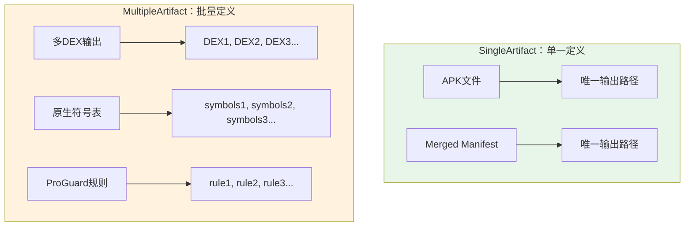

# 21.1.24 MultipleArtifact —— 宝箱与散落的珍珠

清晨的阳光依然那么热情，像是要把昨夜的凉意全部赶走。洛芙坐在树荫下，手里捧着一杯凉茶，看着黛琳从背包里掏出一把五颜六色的珠子。

“哇，好漂亮！”伊莎首先注意到了，“这是什么？”

“珠子？”洛芙也凑了过去。

“不是普通的珠子哦，”黛琳微微一笑，把珠子一颗一颗排在桌面上，“这些是MultipleArtifact——多重工件。”

“多重？”洛芙歪着头，“是昨天那个SingleArtifact的……双胞胎？”

“说是双胞胎不太对，”希尔正在调试笔记本电脑，头也不抬地说，“更像是——一颗宝石和一串珍珠的区别。”

“珍珠？”伊莎捻起一颗红色的珠子，放在阳光下，“这个比喻倒很贴切。”

黛琳点点头：“没错。SingleArtifact是单一的、确定的工件，比如一个APK、一个合并后的Manifest。但有时候，我们需要获取的不是一个文件，而是——一群文件。”

---

## 什么是多重工件？

黛琳把白板架好，开始画图：“想象一下，你在整理一个百宝箱。”

“百宝箱？”洛芙立刻来了精神。

“对，”黛琳边画边说，“SingleArtifact就像从百宝箱里拿出一个确定的东西——比如一把钥匙，或者一本书。你知道它就在那里，拿出来就行。”

她接着画：“但MultipleArtifact呢？就像宝箱里有一堆小珍珠——你不知道具体有多少颗，也不知道每颗长什么样，但你需要把它们全部倒出来，一个不落。”



洛芙看着图示：“那……什么情况下会有多个工件呢？”

“好问题，”黛琳指着图示说，“比如——你的App启用了多Dex功能，就会产生多个DEX文件。每个模块都可能贡献自己的DEX文件，最终打包时需要把它们全部收集起来。”

“还有原生开发的时候，”希尔补充道，“如果你有多个Native库，每个库都会产生自己的符号表文件。”

“再比如ProGuard，”黛琳接着说，“每个模块可能都有自己的混淆规则，最终需要把它们合并起来——在这之前，你需要先拿到所有的规则文件。”

---

## MultipleArtifact 的类型：有哪些多重工件？

黛琳在白板上列出了常见的MultipleArtifact类型：

```kotlin
object MultipleArtifact {
    // 多Dex输出文件
    val DEX: MultipleArtifactType
    
    // ProGuard 保持规则（多模块时会有多个）
    val MULTIDEX_KEEP_PROGUARD: MultipleArtifactType
    
    // 原生调试元数据
    val NATIVE_DEBUG_METADATA: MultipleArtifactType
    
    // 原生符号表
    val NATIVE_SYMBOL_TABLES: MultipleArtifactType
    
    // 预编译类文件
    val PRE_COMPILATION_CLASSES: MultipleArtifactType
}
```

“这些都是常见的MultipleArtifact类型，”黛琳解释道，“每个类型都代表一类可能产生多个文件的工件。”

伊莎好奇地问：“那……这些类型是怎么产生的呢？”

“很简单，”黛琳说，“当你的项目满足某些条件时，AGP会自动生成这些工件。比如——”

她扳着手指头数：

“第一，当你的minSdkVersion低于21时，需要启用MultiDex，就会产生多个DEX文件。”

“第二，当你有多个模块，每个模块都有自己的ProGuard规则文件时。”

“第三，当你使用Native开发，有多个.so库文件时。”

“第四，当你在项目中使用了数据绑定或注解处理器，会产生预编译的类文件。”

---

## 如何获取多重工件？

黛琳在电脑上敲了一段代码：“来，我们看看怎么获取MultipleArtifact。”

```kotlin
// 获取 MultipleArtifact 的方式
val androidExtension = project.extensions.getByType(AppExtension::class.java)

// 使用 artifacts.get() 获取多个文件
val dexFiles: Provider<FileCollection> = androidExtension.artifacts.get(MultipleArtifact.DEX)

// 使用 getAll() 获取所有文件（返回 List）
val allDexFiles: List<File> = androidExtension.artifacts
    .getAll(MultipleArtifact.DEX)
    .get()
```

“等等，”洛芙举手，“`get()`和`getAll()`有什么区别？”

“好问题！”黛琳笑着说，“`get()`返回一个Provider，可以延迟求值；`getAll()`返回一个List，直接包含所有文件。”

```kotlin
// get() vs getAll() 的区别

// 方式1：使用 get() - 推荐
// 返回 Provider<FileCollection>，延迟求值
val dexProvider: Provider<FileCollection> = artifacts.get(MultipleArtifact.DEX)

// 在任务中使用时才真正求值
tasks.register("printDexFiles") {
    doLast {
        // 这里是实际使用的时候才会获取文件列表
        val files = dexProvider.get()
        println("DEX文件数量: ${files.files.size}")
        files.forEach { println(it.name) }
    }
}

// 方式2：使用 getAll() - 直接获取
// 返回 List<File>，配置阶段就会解析
val dexList: List<File> = artifacts.getAll(MultipleArtifact.DEX).get()
println("DEX文件数量: ${dexList.size}")
```

希尔凑过来看：“其实我更推荐用`get()`，因为它支持增量构建和更好的任务依赖管理。”

“为什么？”洛芙问。

“因为Provider不会立即求值，”希尔解释道，“它只是声明了一种依赖关系。Gradle会根据这个声明，自动建立正确的任务依赖图。”

---

## 实战：处理多Dex输出

“我们来写一个实际的例子，”希尔兴奋地说，“处理多Dex输出！”

“这在实际项目中很常见吗？”洛芙问。

“非常常见！”希尔点头，“特别是对于大型App，方法数超过65536的，就必须用MultiDex。”

```kotlin
/**
 * 处理多Dex输出的示例插件
 */
abstract class MultiDexCollectorPlugin : Plugin<Project> {
    override fun apply(project: Project) {
        project.plugins.withType(AndroidApplicationPlugin::class.java) {
            val androidExtension = project.extensions.getByType(AppExtension::class.java)
            
            // 获取所有 DEX 文件
            val dexFiles: Provider<FileCollection> = androidExtension
                .artifacts
                .get(MultipleArtifact.DEX)
            
            // 创建一个任务来收集DEX信息
            val collectDexInfo = project.tasks.register("collectDexInfo") {
                group = "build"
                description = "收集所有DEX文件信息"
                
                doLast {
                    val files = dexFiles.get()
                    println("========== DEX 文件信息 ==========")
                    println("文件总数: ${files.files.size}")
                    
                    files.files.forEachIndexed { index, file ->
                        println("DEX #${index + 1}: ${file.name}")
                        println("  路径: ${file.absolutePath}")
                        println("  大小: ${file.length() / 1024} KB")
                    }
                    println("====================================")
                }
            }
        }
    }
}
```

“哇！”洛芙看着代码，“这个可以显示出所有的DEX文件信息！”

“对的，”黛琳说，“当你运行这个任务时，会看到类似这样的输出：”

```
> Task :app:collectDexInfo
========== DEX 文件信息 ==========
文件总数: 3
DEX #1: classes.dex
  路径: app/build/intermediates/dex/debug/mergeExtDexDebug/classes.dex
  大小: 1024 KB
DEX #2: classes2.dex
  路径: app/build/intermediates/dex/debug/mergeExtDexDebug/classes2.dex
  大小: 512 KB
DEX #3: classes3.dex
  路径: app/build/intermediates/dex/debug/mergeExtDexDebug/classes3.dex
  大小: 256 KB
====================================
```

---

## 多工件 vs 单工件：什么时候用什么？

洛芙看着这两种Artifact类型：“那我怎么知道什么时候用哪个？”

黛琳画了一个简单的决策图：

```mermaid
flowchart TD
    A[需要获取工件] --> B{是单个还是多个？}
    B -->|单个、确定的| C[使用 SingleArtifact]
    B -->|多个、不确定数量| D[使用 MultipleArtifact]
    
    C --> C1[APK、Merged Manifest等]
    D --> D1[DEX文件、符号表、ProGuard规则等]
    
    C --> E[artifacts.get(SingleArtifact.XXX)]
    D --> F[artifacts.get(MultipleArtifact.XXX)]
    
    style C fill:#e8f5e9
    style D fill:#fff3e0
```

“简单来说，”黛琳总结道，“如果这个工件在整个构建过程中只有一个——比如最终打包的APK——就用SingleArtifact。”

“如果这个工件可能有多个——比如多模块产生多个DEX，或者多个Native库产生多个符号表——就用MultipleArtifact。”

伊莎轻声补充：“就像你要拿一本书，直接拿SingleArtifact；但如果要拿一箱书，就要用MultipleArtifact。”

---

## 进阶：过滤和转换多重工件

“有时候，”希尔突然说，“你可能不需要所有的工件，只需要其中一部分。”

“比如？”洛芙问。

“比如只获取某个特定模块产生的DEX文件，或者只获取debug类型的符号表。”

```kotlin
// 使用过滤器筛选多重工件
val debugDexFiles: Provider<FileCollection> = androidExtension
    .artifacts
    .get(MultipleArtifact.DEX)
    .filter { file ->
        // 只保留 debug 相关的DEX文件
        file.name.contains("debug") || file.name.contains("classes")
    }

// 使用 map 转换工件
val dexFileNames: Provider<Set<String>> = dexFiles.map { fileCollection ->
    fileCollection.files.map { it.nameWithoutExtension }.toSet()
}
```

“这过滤功能真强大！”洛芙感叹道。

“还有更强大的，”黛琳笑着说，“你可以把MultipleArtifact和其他操作组合起来用。”

```kotlin
// 组合使用：获取 -> 过滤 -> 合并
val filteredAndMerged = androidExtension
    .artifacts
    .get(MultipleArtifact.NATIVE_SYMBOL_TABLES)
    .filter { file ->
        // 只保留 Release 版本的符号表
        file.name.contains("release")
    }
    .map { fileCollection ->
        // 合并所有文件到一个目录
        val outputDir = project.file("${project.buildDir}/merged-symbols")
        outputDir.mkdirs()
        
        fileCollection.files.forEach { file ->
            file.copyTo(File(outputDir, file.name), overwrite = true)
        }
        
        outputDir
    }
```

---

## 常见陷阱：小心这些坑！

希尔表情严肃起来：“虽然MultipleArtifact用起来不难，但有几个坑一定要避开。”

“又是坑？”洛芙吐了吐舌头。

“第一，”希尔竖起手指，“不要假设多重工件一定存在！”

```kotlin
// ❌ 错误示例：假设一定有多个DEX文件
val dexList = artifacts.getAll(MultipleArtifact.DEX).get()
// 当项目没有启用MultiDex时会报错！

// ✅ 正确做法：先检查是否存在
val dexProvider = artifacts.get(MultipleArtifact.DEX)
if (dexProvider.isPresent) {
    val dexFiles = dexProvider.get()
    // 处理 DEX 文件
} else {
    println("没有找到DEX文件，可能未启用MultiDex")
}
```

“第二，”希尔继续说，“不要在配置阶段就调用`getAll()`！”

```kotlin
// ❌ 错误示例：在配置阶段就获取所有文件
androidExtension.onConfiguration {
    val dexList = artifacts.getAll(MultipleArtifact.DEX).get() // 危险！
    // 这可能导致配置阶段膨胀，甚至死锁
}

// ✅ 正确做法：使用 Provider 延迟求值
val dexProvider = artifacts.get(MultipleArtifact.DEX)
tasks.register("processDex") {
    doLast {
        val dexFiles = dexProvider.get() // 在任务执行时才求值
        // 处理 DEX 文件
    }
}
```

“第三，”希尔补充道，“注意文件的生命周期！”

```kotlin
// ❌ 错误示例：保存文件引用供以后使用
class MyTask @Inject constructor(
    private val dexFiles: Provider<FileCollection>
) : DefaultTask() {
    
    private var cachedFiles: List<File>? = null
    
    fun process() {
        // 错误：在另一个任务中访问保存的文件引用
        cachedFiles?.forEach { file ->
            println(file.name)
        }
    }
}

// ✅ 正确做法：始终通过 Provider 获取最新的文件
class MyTask @Inject constructor(
    private val dexFiles: Provider<FileCollection>
) : DefaultTask() {
    
    @TaskAction
    fun process() {
        // 正确：每次都从 Provider 获取最新的文件
        dexFiles.get().files.forEach { file ->
            println("${file.name}: ${file.length()} bytes")
        }
    }
}
```

洛芙认真记笔记：“这些坑确实很重要，一不小心就会出问题。”

---

## 多工件的实际应用场景

黛琳见时候差不多了，总结道：“MultipleArtifact在实际项目中有几个典型应用场景——”

“第一，**构建分析工具**，”她扳着手指头说，“比如你想分析每个DEX文件的大小分布，或者统计符号表的信息，就需要用到MultipleArtifact。”

“第二，**自定义打包流程**，”希尔补充道，“比如你想把所有Native库重新打包成一个，或者想把多个ProGuard规则合并。”

“第三，**发布流水线**，”黛琳继续说，“在CI/CD中，你可能需要收集所有的输出文件，然后上传到服务器。”

“第四，**调试和排错**，”伊莎轻声说，“当你遇到Dex方法数超限时，需要查看每个Dex包含的具体方法。”

```kotlin
// 一个完整的多工件处理示例：DEX 分析
abstract class DexAnalysisTask : DefaultTask() {
    
    @get:InputFiles
    abstract val dexFiles: Provider<FileCollection>
    
    @TaskAction
    fun analyze() {
        val files = dexFiles.get().files
        
        println("========== DEX 分析报告 ==========")
        println("DEX 文件总数: ${files.size}")
        println("")
        
        files.forEachIndexed { index, file ->
            println("--- DEX #${index + 1}: ${file.name} ---")
            println("  文件大小: ${file.length() / 1024} KB")
            
            // 简单分析：读取DEX头信息
            try {
                val bytes = file.readBytes()
                val magic = String(bytes.sliceArray(0..2))
                println("  Magic: $magic")
            } catch (e: Exception) {
                println("  无法读取: ${e.message}")
            }
            println("")
        }
        println("==================================")
    }
}
```

---

## 小结：MultipleArtifact的核心要点

洛芙靠到椅背上，仰头看着树叶间漏下的阳光，总结道：“所以呢，MultipleArtifact就是用来处理多个同类型文件的——比如多个DEX、多个符号表、多个ProGuard规则。”

“对的，”黛琳点头，“获取方式是用`artifacts.get(MultipleArtifact.XXX)`，返回的是Provider，可以用`getAll()`直接获取List。”

“要注意的是，”希尔补充道，“不要假设工件一定存在，要在任务中延迟求值，还有注意文件的生命周期。”

伊莎轻轻把珠子收进盒子：“这些珠子就像散落的珍珠——你需要用正确的方法把它们一颗不落地收集起来。”

“而且，”黛琳笑着说，“不同的珠子要用不同的容器装。MultipleArtifact就是专门装这种散落珍珠的容器。”

洛芙看着远处的山脊线，阳光把一切都染成了金色。她忽然觉得，这些构建API就像露营时的各种收纳工具——有的适合放单件物品，有的适合放一堆小东西。了解了它们的用途，就能更好地管理项目的构建产物了。

“走吧，”她伸了个懒腰，“该吃午饭啦！上午学了很多，该补充能量了！”

---

## 技术总结

### 核心机制定义

MultipleArtifact 是 Android Gradle Plugin 提供的**多重工件类型接口**，用于获取同一类型的多个输出文件，如多DEX输出、原生符号表、ProGuard规则等。

### 核心类型

| 类型 | 说明 |
|------|------|
| `MultipleArtifact.DEX` | 多Dex输出文件 |
| `MultipleArtifact.MULTIDEX_KEEP_PROGUARD` | 多模块的ProGuard规则 |
| `MultipleArtifact.NATIVE_DEBUG_METADATA` | 原生调试元数据 |
| `MultipleArtifact.NATIVE_SYMBOL_TABLES` | 原生符号表 |
| `MultipleArtifact.PRE_COMPILATION_CLASSES` | 预编译类文件 |

### 核心API

- `artifacts.get(MultipleArtifact.XXX)` - 获取多个工件（返回Provider）
- `artifacts.getAll(MultipleArtifact.XXX)` - 获取所有工件（返回List）
- `.filter{}` - 过滤工件
- `.map{}` - 转换工件

### SingleArtifact vs MultipleArtifact

| 特性 | SingleArtifact | MultipleArtifact |
|------|----------------|------------------|
| 数量 | 单个 | 多个 |
| 返回类型 | Provider<File> | Provider<FileCollection> |
| 获取方法 | get() | get() / getAll() |
| 适用场景 | APK、Manifest等 | DEX、符号表、规则文件 |

### 反模式与陷阱

1. **假设工件一定存在** → 使用前检查 Provider.isPresent
2. **配置阶段调用getAll()** → 使用 Provider 延迟求值
3. **保存文件引用** → 始终通过 Provider 获取最新文件

### 设计哲学

- 批量产出，统一收集
- Provider延迟求值，优化构建性能
- 支持过滤和转换，灵活性高

---

## 动手练习

### ★ 获取多Dex文件

使用 MultipleArtifact.DEX 获取项目的所有DEX文件，并打印文件信息：
```kotlin
val dexFiles = androidExtension.artifacts.get(MultipleArtifact.DEX)
tasks.register("printDexInfo") {
    doLast {
        dexFiles.get().files.forEach { file ->
            println("${file.name}: ${file.length() / 1024}KB")
        }
    }
}
```

### ★★ 过滤符号表

实现一个任务，只处理Release版本的原生符号表：
```kotlin
val symbolTables = androidExtension.artifacts
    .get(MultipleArtifact.NATIVE_SYMBOL_TABLES)
    .filter { file -> file.name.contains("release") }
```

### ★★★ 自定义合并任务

创建一个任务，收集所有ProGuard规则文件并合并成一份：
```kotlin
// 目标：合并多个 MULTIDEX_KEEP_PROGUARD 文件
// 提示：使用 CombiningOperationRequest
```

---

## 面试热身

### Q1: SingleArtifact 和 MultipleArtifact 的区别？

**A**: SingleArtifact用于获取单个确定的工件，如APK；MultipleArtifact用于获取多个同类型工件，如多个DEX文件。

### Q2: 为什么不推荐在配置阶段调用 getAll()？

**A**: 配置阶段调用getAll()会导致立即求值，可能造成配置膨胀、构建变慢，甚至死锁。应该使用Provider延迟求值。

### Q3: MultipleArtifact 常见的类型有哪些？

**A**: DEX（多Dex输出）、MULTIDEX_KEEP_PROGUARD（ProGuard规则）、NATIVE_SYMBOL_TABLES（符号表）、NATIVE_DEBUG_METADATA（调试元数据）等。

### Q4: 如何过滤 MultipleArtifact 的结果？

**A**: 使用filter()方法进行过滤，如只保留特定模块或特定构建类型的文件。

### Q5: MultipleArtifact 在实际项目中的典型应用？

**A**: 构建分析、自定义打包、CI/CD发布流水线、调试排错等场景。

---

> 学习建议：MultipleArtifact是处理批量构建产物的关键API。理解它的最佳方式是结合实际场景——比如分析多Dex输出或收集多个模块的符号表。在实际项目中，注意使用Provider进行延迟求值，这对构建性能至关重要。同时要做好异常处理，因为并非所有项目都会产生MultipleArtifact（如未启用MultiDex时）。

## 洛芙的小小日记本

今天学的是MultipleArtifact——多重工件！和SingleArtifact的区别就像一颗宝石和一串珍珠。DEX文件、符号表、ProGuard规则，这些都可能产生多个输出。黛琳说要记住：用Provider延迟求值，不要在配置阶段就getAll()，还有处理前要先检查是否存在……又是干货满满的一天！⛺✨

---

## 今日关键词

**MultipleArtifact** —— Android Gradle Plugin提供的多重工件类型接口，用于获取同一类型的多个输出文件。

**Provider** —— Gradle的延迟求值容器，封装了属性的获取逻辑，在任务执行时才真正计算值。

**FileCollection** —— Gradle提供的文件集合类，可以包含多个文件并支持过滤、转换等操作。

**MultiDex** —— Android的多Dex技术，用于解决单个DEX文件方法数超过65536的限制。

**Native Symbol Table** —— 原生符号表文件，用于Native代码的调试和崩溃分析。

**ProGuard** —— Android的代码混淆和优化工具。

**增量构建** —— 通过检测文件变化跳过未修改文件的处理，提高构建速度。
