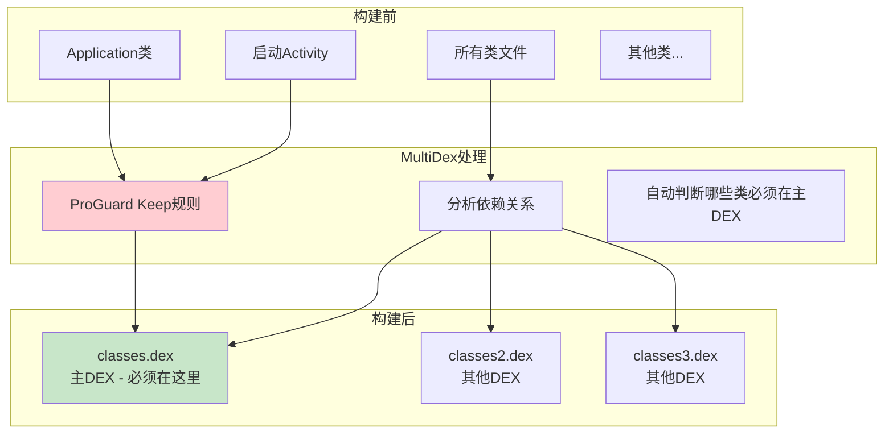
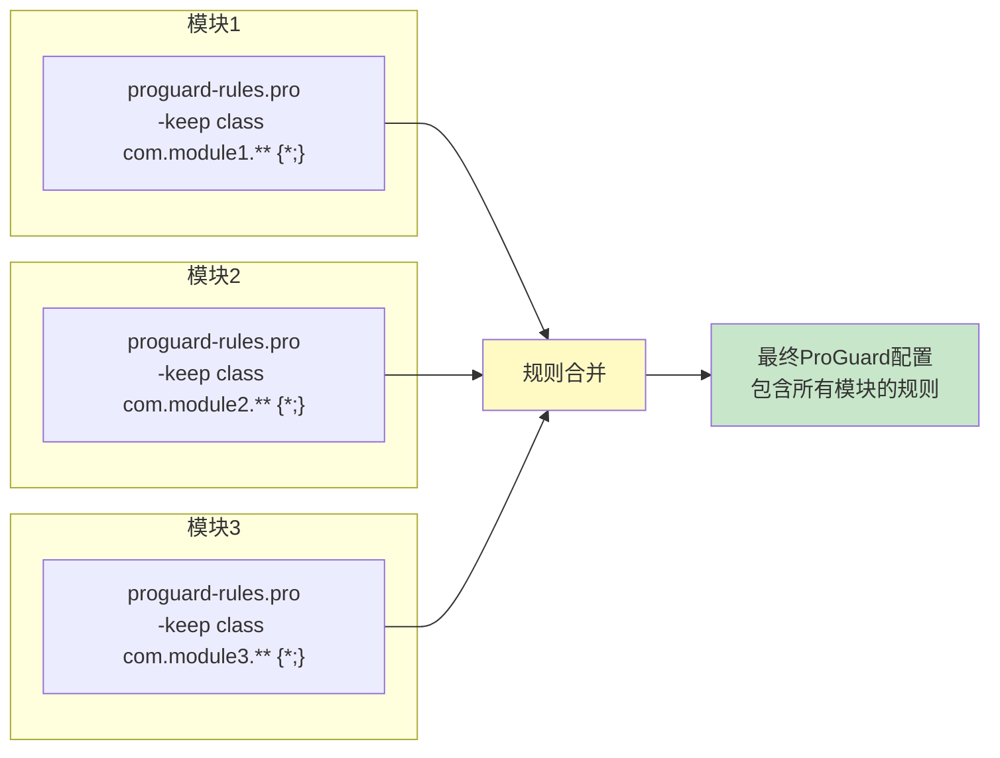

# 21.1.25 守护者的名单——MULTIDEX_KEEP_PROGUARD

午后的阳光愈发炽热，树荫成了最受欢迎的所在。洛芙用手扇着风，眼睛却紧盯着黛琳手中的白板笔。

“刚才我们说了MultipleArtifact是个大概念，”黛琳把白板翻到新的一页，“今天要讲的，是它的一个重要子类型——MULTIDEX_KEEP_PROGUARD。”

“又是ProGuard？”洛芙一回想，“上次好像听你提起过……”

“没错，”希尔从笔记本里抬起头，“就是那个用来混淆代码的工具。但这次我们要说的，不是混淆本身，而是——哪些类必须保留在主DEX里。”

“为什么需要保留？”伊莎歪着头，“混淆不应该把所有东西都藏起来吗？”

“这就涉及到MultiDex的一个大问题了，”黛琳的表情认真起来，“走错一步，你的App可能都启动不了。”

---

## MultiDex的烦恼：谁该住在主屋？

黛琳在白板上画了一栋大房子：“想象一下，你的App是一栋大公寓，有很多住户。”

“住户……就是类？”洛芙问。

“对，”黛琳点点头，“当方法数太多的时候，我们需要把住户分到多个单元楼——这就是MultiDex的作用。”

她继续画：“但是！并不是所有住户都能随便住。每个单元楼都有一个门禁系统，只有登记在册的住户才能进入。”

洛芙举手：“我懂了！主单元楼（主DEX）的门禁最严格，只有特定住户能住进去？”

“完全正确！”黛琳笑着说，“主DEX就像公寓的主入口，必须住着最重要的住户——那些App启动时就需要用到的类。”

“比如？”希尔问。

“比如Application类、启动Activity、还有——那些在你App出生前就必须存在的类。”黛琳说，“如果这些类不在主DEX里，App就会在启动时崩溃，报错信息是……”

“找不到类！”洛芙想起来之前遇到的错误，“就是那个'Traceback (most recent call last): ... NoClassDefFoundError'！”

“对，就是它。”黛琳点头，“所以，我们需要告诉构建系统：这些类必须放在主DEX里，不能被丢到其他单元楼。”

---

## ProGuard的Keep规则：守护者的名单

“这就是ProGuard的用武之地？”伊莎问。

“准确地说，是ProGuard的keep规则，”黛琳说，“你可以把它理解一份'守护者名单'——上面写着哪些类必须被保留，不能被混淆，也不能被丢到其他DEX。”



希尔补充道：“在Android 5.0之前，系统原生不支持MultiDex，所以主DEX必须包含所有关键类。现代系统虽然支持了，但一些启动时必须加载的类仍然需要放在主DEX。”

“所以，”黛琳总结，“MULTIDEX_KEEP_PROGUARD就是用来获取这些'守护者名单'的工件类型——当你的项目有多个模块时，每个模块都可能有自己的ProGuard规则文件。”

---

## 多模块的烦恼：散落各地的规则

洛芙皱起眉头：“如果有很多模块，那岂不是有很多份规则文件？”

“没错！”黛琳打了个响指，“这就是MULTIDEX_KEEP_PROGUARD存在的意义。”

她接着画图解释：“想象你是一个物业管理员，需要收集所有单元楼的住户规则手册——有的来自A栋，有的来自B栋，还有的来自C栋……”

“每个模块都有自己的proguard-rules.pro文件？”洛芙问。

“对，每个模块都可能定义自己的规则。”黛琳说，“构建系统需要把所有这些规则合并起来，才能正确处理主DEX的问题。”



“在过去，”希尔说，“你需要手动收集这些文件，然后合并成一个。但有了MULTIDEX_KEEP_PROGUARD，构建系统可以自动帮你完成这一步。”

---

## 如何获取MULTIDEX_KEEP_PROGUARD？

黛琳在电脑上敲了一段代码：“来，我们看看怎么获取MULTIDEX_KEEP_PROGUARD。”

```kotlin
// 获取 MULTIDEX_KEEP_PROGUARD 工件
val androidExtension = project.extensions.getByType(AppExtension::class.java)

// 使用 artifacts.get() 获取所有ProGuard规则文件
val proguardKeepFiles: Provider<FileCollection> = androidExtension
    .artifacts
    .get(MultipleArtifact.MULTIDEX_KEEP_PROGUARD)

// 也可以使用 getAll() 直接获取 List
val proguardKeepList: List<File> = androidExtension
    .artifacts
    .getAll(MultipleArtifact.MULTIDEX_KEEP_PROGUARD)
    .get()
```

“和之前的MultipleArtifact类型用法一样？”洛芙问。

“完全一样，”黛琳点头，“区别在于获取的内容不同——MULTIDEX_KEEP_PROGUARD专门获取ProGuard的keep规则文件。”

```kotlin
// 完整的示例：收集并打印所有ProGuard规则
abstract class CollectProguardRulesTask : DefaultTask() {
    
    @get:InputFiles
    abstract val proguardKeepFiles: Provider<FileCollection>
    
    @TaskAction
    fun collect() {
        val files = proguardKeepFiles.get().files
        
        println("========== ProGuard 规则文件 ==========")
        println("文件总数: ${files.size}")
        println("")
        
        files.forEachIndexed { index, file ->
            println("--- 文件 #${index + 1}: ${file.name} ---")
            println("路径: ${file.absolutePath}")
            println("大小: ${file.length()} bytes")
            println("")
            
            // 打印文件内容（限制行数）
            file.readLines().take(10).forEach { line ->
                println("  $line")
            }
            if (file.readLines().size > 10) {
                println("  ... (还有 ${file.readLines().size - 10} 行)")
            }
            println("")
        }
        println("======================================")
    }
}
```

---

## 实战：合并多模块的ProGuard规则

希尔兴奋地搓搓手：“光看不过瘾，我们来写一个真正有用的例子——合并多模块的ProGuard规则！”

“这在实际项目中很常用吗？”洛芙问。

“非常常用！”希尔点头，“当你需要在发布前检查所有规则，或者想统一管理所有模块的规则时，这个就派上用场了。”

```kotlin
/**
 * 合并多模块ProGuard规则的任务
 */
abstract class MergeProguardRulesTask : DefaultTask() {
    
    @get:InputFiles
    abstract val proguardKeepFiles: Provider<FileCollection>
    
    @get:OutputFile
    abstract val outputFile: Provider<File>
    
    @TaskAction
    fun merge() {
        val inputFiles = proguardKeepFiles.get().files
        val output = outputFile.get()
        
        println("开始合并 ${inputFiles.size} 个ProGuard规则文件...")
        
        // 创建输出文件
        output.bufferedWriter().use { writer ->
            // 写入文件头
            writer.write("# 合并后的ProGuard规则\n")
            writer.write("# 生成时间: ${java.time.LocalDateTime.now()}\n")
            writer.write("# 来源文件数量: ${inputFiles.size}\n")
            writer.write("\n")
            
            // 逐个合并文件
            inputFiles.forEachIndexed { index, file ->
                writer.write("\n# ========== 来源: ${file.name} ==========\n")
                writer.write("# 路径: ${file.absolutePath}\n")
                
                try {
                    file.forEachLine { line ->
                        // 跳过空行和注释，保留实际规则
                        if (line.isNotBlank() && !line.trim().startsWith("#")) {
                            writer.write("$line\n")
                        }
                    }
                } catch (e: Exception) {
                    logger.warn("读取文件 ${file.name} 失败: ${e.message}")
                }
            }
        }
        
        println("合并完成！输出文件: ${output.absolutePath}")
    }
}

// 注册任务
val mergeProguardRules = project.tasks.register(
    "mergeProguardRules",
    MergeProguardRulesTask::class.java
) {
    // 注入依赖
    it.proguardKeepFiles.set(
        androidExtension.artifacts.get(MultipleArtifact.MULTIDEX_KEEP_PROGUARD)
    )
    it.outputFile.set(
        project.file("${project.buildDir}/outputs/merged-proguard-rules.pro")
    )
}
```

运行这个任务，输出类似：

```
> Task :app:mergeProguardRules
开始合并 3 个ProGuard规则文件...
合并完成！输出文件: app/build/outputs/merged-proguard-rules.pro

========== 合并后的规则 ==========
# 合并后的ProGuard规则
# 生成时间: 2024-07-15T10:30:00
# 来源文件数量: 3

# ========== 来源: proguard-rules.pro ==========
-keep class com.module1.data.** { *; }
-keep class com.module1.ui.** { *; }

# ========== 来源: lib-proguard.pro ==========
-keep class com.library.Utils { *; }

# ========== 来源: core-proguard.pro ==========
-keep class com.app.core.** { *; }
-keepclassmembers class * {
    @android.webkit.JavascriptInterface <methods>;
}
```

---

## 理解ProGuard的keep规则格式

伊莎好奇地问：“这些-keep规则到底是什么格式？我看不太懂……”

“让我解释一下，”黛琳拿起白板笔，在白板上写了几种常见的规则：

```proguard
# 最基础的keep规则：保留整个类
-keep class com.example.myapp.MyClass { *; }

# 保留类中特定的方法
-keepclassmembers class com.example.myapp.MyClass {
    public void onClick(android.view.View);
}

# 保留包含特定注解的类
-keep @android.webkit.JavascriptInterface class * { *; }

# 保留继承自特定父类的所有类
-keep public class * extends android.app.Activity

# 保留实现了特定接口的类
-keep class * implements android.os.Parcelable {
    public static final android.os.Parcelable$Creator *;
}
```

“听起来像咒语！”洛芙吐了吐舌头。

“确实是有点像魔法咒语，”伊莎笑了，“不过这些咒语能保护重要的类不被消除。”

黛琳补充道：“在MultiDex场景下，这些规则告诉构建系统：被keep的类必须放在主DEX里，否则App启动时会找不到它们。”

---

## 常见的MultiDex Keep规则错误

希尔表情严肃起来：“不过，用不好这些规则会出大问题。”

“会出什么问题？”洛芙紧张地问。

“第一种错误，”希尔说，“keep了太多类。”

```kotlin
// ❌ 错误示例：keep了所有类
-keep class com.example.** { *; }

"这样做的话，"希尔解释，"所有类都会被放到主DEX，主DEX会变得巨大无比，超出65536的方法数限制，App依然会崩溃！"

"第二种错误，"希尔继续说，"keep了不该keep的类。"
```

```kotlin
// ❌ 错误示例：keep了动态生成的类
// R.java 是自动生成的，不应该手动keep
-keep class com.example.myapp.R$* { *; }

// ✅ 正确做法：让系统自动处理
// ProGuard会自动保留实际使用的资源类
```

“第三种错误，”希尔补充道，“忽略了依赖库的规则。”

```kotlin
// ❌ 错误示例：只keep了自己模块的类
-keep class com.myapp.** { *; }

// ✅ 正确做法：也要keep依赖库的重要类
-keep class com.google.gson.** { *; }
-keep class com.squareup.okhttp.** { *; }
```

---

## 自动化Keep规则生成

“有没有更聪明的方法？”伊莎问，“手动写这些规则好累啊……”

“有的！”黛琳笑着说，“现在很多库都会自动生成推荐的ProGuard规则。”

```kotlin
// 在 build.gradle 中启用库自动生成的规则
android {
    buildTypes {
        release {
            // 启用混淆
            minifyEnabled true
            
            // 自动合并依赖库的ProGuard规则
            // 这是默认行为，proguardFiles会自动包含依赖库的规则
            proguardFiles(
                getDefaultProguardFile("proguard-android-optimize.txt"),
                "proguard-rules.pro"
            )
        }
    }
}
```

“很多主流库都会在AAR包中包含proguard-rules.pro文件，”黛琳解释说，“AGP会自动把这些规则合并进来。”

“也就是说，”洛芙明白了，”我们其实不需要手动获取MULTIDEX_KEEP_PROGUARD来做这件事？“

“问得好！”黛琳点头，”对于大多数项目，AGP已经自动处理了这些规则。但如果你需要——”

她扳着手指头：

“第一，调试主DEX问题的时候，你需要看看具体有哪些规则。”

“第二，自定义构建流程的时候，你需要收集所有规则做分析。”

“第三，迁移旧项目的时候，你需要检查是否有冲突的规则。”

“在这些情况下，MULTIDEX_KEEP_PROGUARD就派上用场了。”

---

## 完整的MultiDex Keep检查工具

希尔突然灵机一动：“我们来写一个完整的检查工具，验证所有必要的类都被正确keep了！”

“这会很复杂吗？”洛芙问。

“不会，我们一步步来，”希尔笑着说，“首先，我们需要一个能检查类是否在主DEX的任务。”

```kotlin
/**
 * 检查MultiDex Keep规则的完整性
 */
abstract class CheckMultiDexKeepTask : DefaultTask() {
    
    @get:InputFiles
    abstract val proguardKeepFiles: Provider<FileCollection>
    
    @get:InputFiles
    abstract val dexFiles: Provider<FileCollection>
    
    @TaskAction
    fun check() {
        val keepFiles = proguardKeepFiles.get().files
        val dexFiles = dexFiles.get().files
        
        println("========== MultiDex Keep 检查报告 ==========")
        println("ProGuard规则文件数: ${keepFiles.size}")
        println("DEX文件数: ${dexFiles.size}")
        println("")
        
        // 收集所有被keep的类名
        val keptClasses = mutableSetOf<String>()
        keepFiles.forEach { file ->
            file.forEachLine { line ->
                val match = Regex("""-keep\s+class\s+([\w.$]+)""").find(line)
                match?.let {
                    keptClasses.add(it.groupValues[1])
                }
            }
        }
        
        println("发现 ${keptClasses.size} 个被keep的类/包")
        println("")
        
        // 检查关键类是否被keep
        val criticalClasses = listOf(
            "android.app.Application",
            "androidx.multidex.MultiDexApplication"
        )
        
        println("--- 关键类检查 ---")
        criticalClasses.forEach { className ->
            val isKept = keptClasses.any { kept ->
                className.startsWith(kept) || kept == className
            }
            val status = if (isKept) "✓ 已keep" else "⚠ 未明确keep"
            println("$className: $status")
        }
        
        println("")
        println("============================================")
    }
}

// 注册任务
val checkMultiDexKeep = project.tasks.register(
    "checkMultiDexKeep",
    CheckMultiDexKeepTask::class.java
) {
    it.proguardKeepFiles.set(
        androidExtension.artifacts.get(MultipleArtifact.MULTIDEX_KEEP_PROGUARD)
    )
    it.dexFiles.set(
        androidExtension.artifacts.get(MultipleArtifact.DEX)
    )
}
```

运行输出：

```
> Task :app:checkMultiDexKeep
========== MultiDex Keep 检查报告 ==========
ProGuard规则文件数: 3
DEX文件数: 2

发现 47 个被keep的类/包

--- 关键类检查 ---
android.app.Application: ✓ 已keep
androidx.multidex.MultiDexApplication: ✓ 已keep

============================================
```

---

## 嵌套模块与传递依赖

“对了，”洛芙突然想到一个问题，”如果模块A依赖模块B，那规则文件会怎么收集？”

“好问题！”黛琳说，“MULTIDEX_KEEP_PROGUARD会自动收集所有直接或间接依赖的模块的规则。”

```kotlin
// 模块依赖关系
// app (主模块)
//   ├── module-a (直接依赖)
//   │   └── module-b (传递依赖)
//   └── lib-c (直接依赖)

// 最终 MULTIDEX_KEEP_PROGUARD 会包含：
// - app/proguard-rules.pro
// - module-a/proguard-rules.pro
// - module-b/proguard-rules.pro (通过module-a传递)
// - lib-c/proguard-rules.pro
```

“如果我想排除某些模块的规则呢？”希尔问。

“那可以使用过滤器，”黛琳说。

```kotlin
// 过滤掉特定模块的规则文件
val filteredProguardFiles = androidExtension
    .artifacts
    .get(MultipleArtifact.MULTIDEX_KEEP_PROGUARD)
    .filter { file ->
        // 排除测试模块的规则
        !file.absolutePath.contains("test")
    }
```

---

## 调试主DEX问题的最佳实践

黛琳见时候差不多了，总结道：“最后，让我们来总结一下调试主DEX问题的最佳实践。”

“第一，”她竖起手指，”先运行你的App，看看报什么错。”

```kotlin
// 典型的MultiDex错误
// java.lang.NoClassDefFoundError: com/example/MyClass
//     at com.example.MainActivity.onCreate(MainActivity.java:)
//     ...
```

“第二，如果确认是主DEX问题，查看具体是哪个类找不到。”

“第三，在对应模块的proguard-rules.pro中添加keep规则。”

```proguard
# 示例：保留缺失的类
-keep class com.example.MyClass { *; }
```

“第四，使用MULTIDEX_KEEP_PROGUARD收集所有规则，确认没有遗漏。”

“第五，重新构建并测试。”

```kotlin
// 验证构建后的DEX包含正确的类
val dexFiles = androidExtension.artifacts.get(MultipleArtifact.DEX).get()
tasks.register("verifyMainDex") {
    doLast {
        val mainDex = dexFiles.files.firstOrNull { it.name == "classes.dex" }
        mainDex?.let {
            println("主DEX大小: ${it.length() / 1024} KB")
        }
    }
}
```

---

## 小结：MULTIDEX_KEEP_PROGUARD的核心要点

洛芙靠到椅背上，仰头看着树叶间漏下的阳光：“所以呢，MULTIDEX_KEEP_PROGUARD就是用来收集所有模块的ProGuard规则文件的？”

“对的，”黛琳点头，”这些规则告诉构建系统哪些类必须放在主DEX里。”

“要注意的是，”希尔补充道，”不要keep太多类，否则主DEX会超载；也要确保关键类都被keep了，否则App启动会崩溃。”

伊莎轻轻整理着桌面上的资料：“这些规则就像守护者的名单——，保护着App启动时必须存在的类。”

洛芙看着远处的山：“我现在有点理解为什么构建系统要这么复杂了……每个细节都有它的道理。”

“那是自然，”黛琳笑着说，”Android的构建系统是几十年工程经验的结晶，每一处设计都有它的用意。”

“走吧，”希尔合上笔记本，”太阳快下山了，我们该准备晚饭了！”

四个女孩收拾好东西，朝着营地的方向走去。夕阳把她们的影子拉得很长，就像那些被keep规则保护着的类——静静地守护着App的启动之路。

---

## 技术总结

### 核心机制定义

MULTIDEX_KEEP_PROGUARD 是 MultipleArtifact 的子类型，用于获取多模块项目中所有模块的 ProGuard keep 规则文件。这些规则指定了哪些类必须被保留在主 DEX 中，以确保 App 启动时能够正确加载。

### MultiDex Keep 的工作原理

当 Android 方法数超过 65536 时，需要启用 MultiDex 将代码分散到多个 DEX 文件中。但并非所有类都可以放在任意 DEX 中——启动时需要的类必须在主 DEX（classes.dex）中，否则会抛出 NoClassDefFoundError。

ProGuard 的 keep 规则用于标记这些必须保留的类，构建系统会根据这些规则自动决定哪些类应该放在主 DEX。

### 核心API使用

```kotlin
// 获取所有ProGuard keep规则文件
val proguardFiles: Provider<FileCollection> = androidExtension
    .artifacts
    .get(MultipleArtifact.MULTIDEX_KEEP_PROGUARD)

// 使用 getAll() 获取 List
val proguardList: List<File> = androidExtension
    .artifacts
    .getAll(MultipleArtifact.MULTIDEX_KEEP_PROGUARD)
    .get()
```

### 常见Keep规则格式

| 规则 | 作用 |
|------|------|
| `-keep class com.example.MyClass { *; }` | 保留整个类 |
| `-keepclassmembers class * { ... }` | 保留类成员 |
| `-keep @interface *` | 保留注解 |
| `-keep class * extends Activity` | 保留继承者 |

### 反模式与陷阱

1. **keep了太多类** → 主DEX超载，导致方法数仍然超限
2. **忽略依赖库的规则** → 依赖库的关键类未被keep
3. **手动keep自动生成的类** → 如R.java，应让系统处理
4. **未检查传递依赖的规则** → 子模块的规则可能被遗漏

### 设计哲学

- 声明式保留：由开发者明确指定必须保留的类
- 自动收集：多模块时自动合并所有规则
- 构建时验证：在打包前检查规则的完整性

---

## 动手练习

### ★ 获取ProGuard规则文件

使用 MULTIDEX_KEEP_PROGUARD 获取项目的所有ProGuard规则文件，并打印文件列表：
```kotlin
val proguardFiles = androidExtension
    .artifacts
    .get(MultipleArtifact.MULTIDEX_KEEP_PROGUARD)

tasks.register("printProguardFiles") {
    doLast {
        proguardFiles.get().files.forEach { file ->
            println("${file.name}: ${file.absolutePath}")
        }
    }
}
```

### ★★ 过滤特定模块的规则

实现一个任务，排除测试模块，只收集正式模块的ProGuard规则：
```kotlin
val filteredRules = androidExtension
    .artifacts
    .get(MultipleArtifact.MULTIDEX_KEEP_PROGUARD)
    .filter { file ->
        !file.absolutePath.contains("androidTest") &&
        !file.absolutePath.contains("test")
    }
```

### ★★★ 合并规则并检查冲突

创建一个任务，收集所有ProGuard规则，检测可能存在的冲突规则：
```kotlin
// 目标：合并所有规则并检测冲突
// 提示：-keep 和 -dontwarn 可能冲突
// 关键：识别重复规则和矛盾规则
```

---

## 面试热身

### Q1: 什么是MultiDex？为什么要使用它？

**A**: MultiDex是Android解决单个DEX文件方法数超65536限制的技术。当方法数超过限制时，需要将代码拆分到多个DEX文件中。

### Q2: 为什么有些类必须放在主DEX中？

**A**: App启动时需要加载的类（如Application、启动Activity）必须在主DEX中，否则会抛出NoClassDefFoundError，导致启动失败。

### Q3: ProGuard的keep规则是什么？

**A**: keep规则指定哪些类必须被保留，不能被混淆或移除。在MultiDex场景下，这些规则还决定了哪些类必须放在主DEX中。

### Q4: MULTIDEX_KEEP_PROGUARD的作用是什么？

**A**: 它用于获取项目中所有模块的ProGuard keep规则文件，以便进行分析、合并或调试主DEX问题。

### Q5: 常见的MultiDex Keep错误有哪些？

**A**: 1) keep了太多类导致主DEX超载；2) 忽略依赖库的规则导致启动崩溃；3) keep了不应该手动keep的自动生成类。

---

> 学习建议：MULTIDEX_KEEP_PROGUARD是处理MultiDex问题的关键工具。在实际项目中，除非遇到主DEX问题，否则不需要直接操作这些规则文件。但了解其工作原理有助于调试构建问题。推荐在实际项目中实践：添加一个keep规则，然后使用本章节的方法查看规则文件是如何变化的。

## 洛芙的小小日记本

今天学的是MULTIDEX_KEEP_PROGUARD！原来App启动时需要加载的类必须住在"主单元楼"——主DEX里。ProGuard的-keep规则就是"守护者名单"，告诉构建系统哪些类不能丢到其他DEX。黛琳说keep太多会导致主DEX超载，keep太少会启动崩溃……好难啊！但学会了这个，下次遇到NoClassDefFoundError就不怕啦！🌟

---

## 今日关键词

**MultipleArtifact.MULTIDEX_KEEP_PROGUARD** —— 获取多模块ProGuard keep规则文件的工件类型。

**MultiDex** —— Android的多Dex技术，用于解决单个DEX文件方法数超过65536的限制。

**主DEX（Primary DEX）** —— classes.dex，App启动时首先加载的DEX文件，必须包含启动所需的关键类。

**ProGuard keep规则** —— 指定哪些类必须被保留的规则，防止被混淆或移除。

**NoClassDefFoundError** —— 运行时错误，当需要的类找不到时抛出，常见于主DEX缺少必要类的情况。

**传递依赖** —— 通过其他模块间接依赖的模块，其规则也会被收集。

**FileCollection** —— Gradle的文件集合类，支持过滤、转换等操作。

**Provider** —— Gradle的延迟求值容器，用于声明依赖关系而非立即计算。
