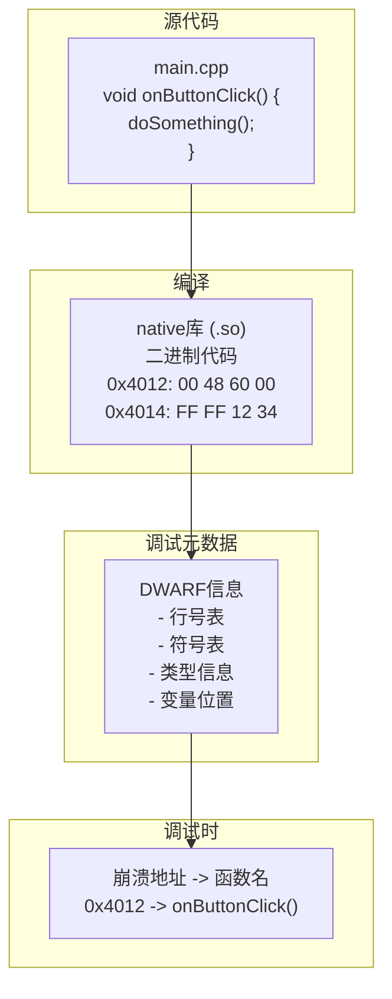
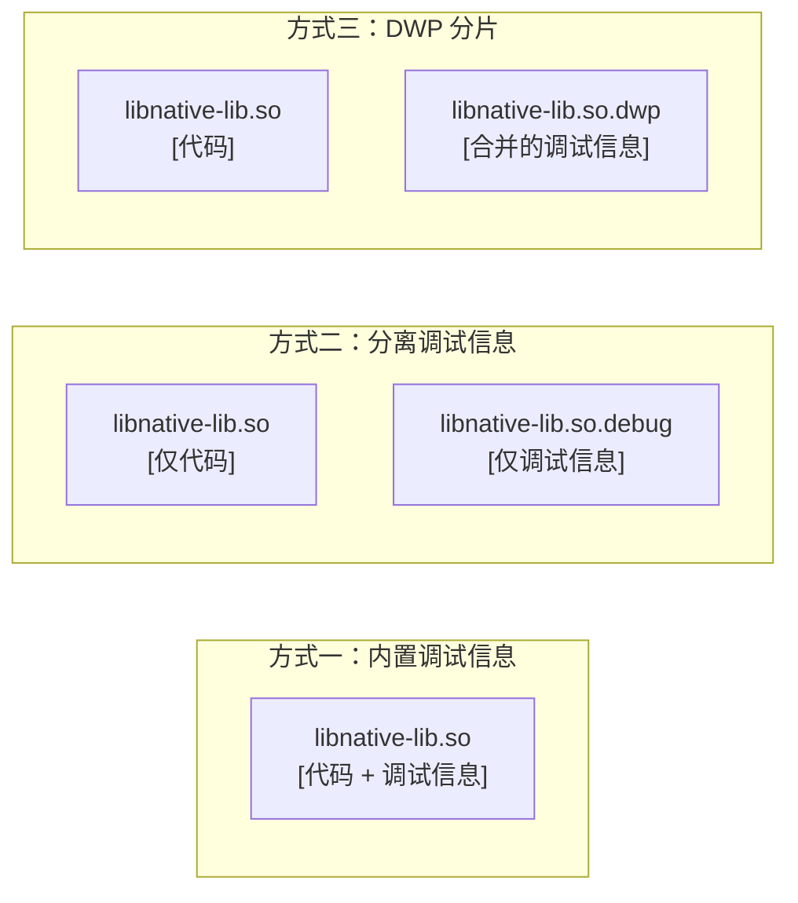
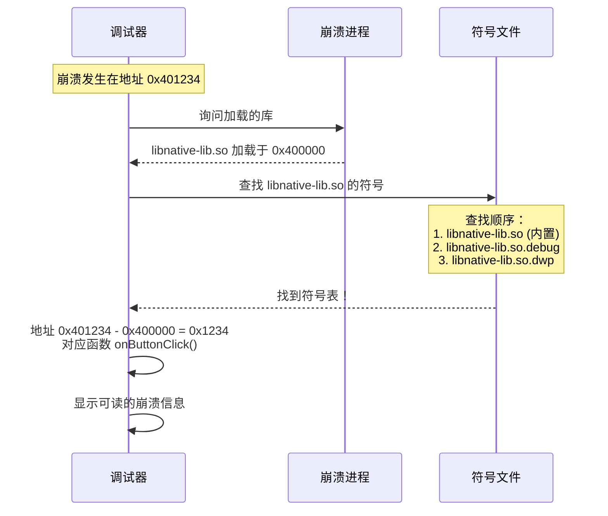
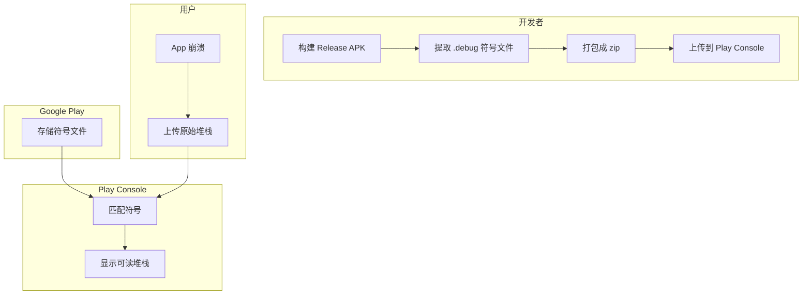

# 21.1.26 调试密码本——NATIVE_DEBUG_METADATA

午后的阳光透过树叶的缝隙，在草地上洒下点点光斑。洛芙用手挡在眼前，看了一会儿正在远处树枝上跳来跳去的小松鼠。

“黛琳，”洛芙转过身来，“上午说的ProGuard规则好难啊……现在又要讲什么新的？”

黛琳微微一笑：“今天要讲的，和上午的完全不一样——我们要聊聊 native 代码的调试。”

“native 代码？”洛芙眨眨眼，“就是……用C或者C++写的那些？”

“对，”黛琳点点头，“Android 不只有 Java 和 Kotlin，还有 C/C++ 这类原生代码。它们通过 NDK（Native Development Kit）进入 Android 世界。”

“说到 native 代码，”希尔突然来了精神，“那我们今天要讲 NATIVE_DEBUG_METADATA 了！”

“调试……元数据？”伊莎好奇地问，“这是什么东西？”

“如果说 native 代码是一本用密码写的书，”黛琳拿起一根草茎在手里转着，“那调试元数据就是这本书的注释和解密手册——没有它，你根本看不懂程序在干什么。”

---

## 当代码变成“黑箱”

黛琳找了一块平整的石头坐下：“洛芙，你有没有遇到过这种情况——App 突然就崩溃了，你去看日志，但只能看到一堆看都看不懂的地址？”

洛芙想了想：“嗯……有时候会看到类似 ‘0x00001234’ 这样的东西，完全不知道是什么意思。”

“那很可能就是 native 代码崩溃了。”黛琳说，“Java 和 Kotlin 的崩溃会有清晰的类名和方法名，但 native 代码的崩溃……”

她在地上画了一幅图：

```
Java/Kotlin 崩溃日志：
Caused by: java.lang.NullPointerException
    at com.example.app.MainActivity.onCreate(MainActivity.java:25)

Native 代码崩溃日志：
signal 11 (SIGSEGV), code 1 (SEGV_MAPERR)
pc 0x0000007f8a4c1234
```

“看到没有？”黛琳说，“native 代码的崩溃只有内存地址，没有函数名，没有文件名——就像一本被涂黑的书，你根本不知道发生了什么。”

“这就是调试元数据的用武之地？”洛芙问。

“没错！”黛琳笑了，“NATIVE_DEBUG_METADATA 就是用来获取这些'解密手册'的。”

---

## 调试元数据是何方神圣？

伊莎歪着头：“我还是不太明白……这个元数据到底是什么？”

“让我换个说法，”黛琳想了想，“你们玩过拼图吗？”

“拼图？”洛芙点点头，“玩过！”

“想象一下，”黛琳说，“拼图的每一小块都对应着原图的一个位置。但是，如果没有任何提示——没有参考图片，没有编号——你根本不知道这块应该放在哪里。”

她接着说：“native 代码编译后，就像一堆没有编号的拼图块。而调试元数据，就是这堆拼图的编号和参考图片。”



希尔补充道：“常见的调试元数据格式有 DWARF（Unix/Linux 主流）和 PDB（Windows 主流）。Android 上主要使用 DWARF。”

---

## 为什么需要 NATIVE_DEBUG_METADATA？

洛芙举手提问：“那为什么我们需要专门获取这个？它不应该是自动生成的吗？”

“好问题！”黛琳说，“在开发过程中，调试元数据确实是自动生成的。但是——”

她扳着手指头：

“第一，有时候你想看看构建产物里到底有什么元数据。”

“第二，你想把这些元数据提供给其他工具使用。”

“第三，在某些高级调试场景下，你需要自定义处理这些元数据。”

```kotlin
// 获取 NATIVE_DEBUG_METADATA 工件
val androidExtension = project.extensions.getByType(AppExtension::class.java)

// 使用 artifacts.get() 获取调试元数据文件
val nativeDebugMetadata: Provider<FileCollection> = androidExtension
    .artifacts
    .get(MultipleArtifact.NATIVE_DEBUG_METADATA)

// 使用 getAll() 获取 List
val debugMetadataList: List<File> = androidExtension
    .artifacts
    .getAll(MultipleArtifact.NATIVE_DEBUG_METADATA)
    .get()
```

---

## 调试元数据的实际内容

希尔打开电脑：“让我来展示一下，调试元数据文件里到底有什么。”

她在命令行里敲了几下，然后说：“看，这是我们项目中生成的调试元数据文件。”

```
libnative-lib.so 的调试元数据：
├── libnative-lib.so (主库文件)
├── libnative-lib.so.debug (调试符号文件)
└── libnative-lib.so.dwp (DWP 分片包)

每个文件包含：
- .debug_info: 完整的调试信息
- .debug_abbrev: 缩写表
- .debug_line: 行号表
- .debug_str: 字符串表
- .debug_frame: 栈展开信息
```

“听起来好复杂！”洛芙吐了吐舌头。

“确实复杂，”黛琳说，“但我们不需要理解每一个细节。关键是知道：这些元数据让调试器能够把机器码翻译成我们可以看懂的源代码。”

---

## 实战：收集并分析调试元数据

希尔跃跃欲试：“我们来写一个任务，收集项目中的所有调试元数据文件！”

```kotlin
/**
 * 收集并分析原生调试元数据
 */
abstract class CollectNativeDebugMetadataTask : DefaultTask() {
    
    @get:InputFiles
    abstract val debugMetadataFiles: Provider<FileCollection>
    
    @TaskAction
    fun collect() {
        val files = debugMetadataFiles.get().files
        
        println("========== Native 调试元数据 ==========")
        println("文件总数: ${files.size}")
        println("")
        
        files.forEachIndexed { index, file ->
            println("--- 文件 #${index + 1}: ${file.name} ---")
            println("路径: ${file.absolutePath}")
            println("大小: ${file.length() / 1024} KB")
            println("")
            
            // 根据文件类型显示不同信息
            when {
                file.extension == "so" -> {
                    println("类型: 原生共享库")
                    // 检查是否为调试版本
                    val isDebug = file.name.contains(".debug") || 
                                  file.nameWithoutExtension.endsWith("d")
                    println("调试版本: ${if (isDebug) "是" else "否"}")
                }
                file.extension == "dwp" -> {
                    println("类型: DWP 分片包 (DWARF Package File)")
                }
                file.name.endsWith(".debug") -> {
                    println("类型: 独立调试符号文件")
                }
                else -> {
                    println("类型: 其他调试文件")
                }
            }
            println("")
        }
        
        println("========================================")
    }
}

// 注册任务
val collectNativeDebugMetadata = project.tasks.register(
    "collectNativeDebugMetadata",
    CollectNativeDebugMetadataTask::class.java
) {
    it.debugMetadataFiles.set(
        androidExtension.artifacts.get(MultipleArtifact.NATIVE_DEBUG_METADATA)
    )
}
```

运行输出：

```
> Task :app:collectNativeDebugMetadata
========== Native 调试元数据 ==========
文件总数: 3

--- 文件 #1: libnative-lib.so ---
路径: app/build/intermediates/cmake/debug/obj/arm64-v8a/libnative-lib.so
大小: 2048 KB
类型: 原生共享库
调试版本: 是

--- 文件 #2: libnative-lib.so.debug ---
路径: app/build/intermediates/cmake/debug/obj/arm64-v8a/libnative-lib.so.debug
大小: 512 KB
类型: 独立调试符号文件

--- 文件 #3: libcrypto.so ---
路径: app/build/intermediates/cmake/debug/obj/arm64-v8a/libcrypto.so
大小: 1024 KB
类型: 原生共享库
调试版本: 否

========================================
```

---

## 调试符号的分离与合并

伊莎好奇地问：“为什么调试符号有的是独立的文件，有的是和库合并在一起的？”

“这是两种不同的处理方式。”黛琳解释道，“一种是把调试信息直接编译进 .so 文件，另一种是把调试信息单独存放在 .debug 文件里。”



“各有利弊，”希尔补充道，“内置调试信息方便分发，但文件会变大；分离文件可以减小主库体积，但调试时需要同时提供两个文件；DWP 是新出的方式，支持增量编译。”

---

## NDK 调试的配置

“说了这么多，”洛芙问，“到底怎么配置才能生成调试元数据？”

黛琳笑着说：“这个简单，在 NDK 配置里设置就可以了。”

```groovy
android {
    // NDK 配置
    ndkVersion "26.1.10909125"
    
    defaultConfig {
        ndk {
            // 启用调试符号
            debuggable = true
            
            // 指定 ABI
            abiFilters 'armeabi-v7a', 'arm64-v8a', 'x86', 'x86_64'
            
            // 生成 DWARF DWP 文件 (Android Studio 3.6+)
            dwarfDebugSymbol = 'none'  // 'none' | 'none' | 'dwp' | 'full'
        }
    }
    
    buildTypes {
        debug {
            // 调试构建默认启用调试符号
            ndk {
                debuggable = true
            }
        }
        release {
            // 发布构建通常不包含调试符号
            ndk {
                debuggable = false
            }
        }
    }
}
```

“等等，”洛芙发现一个问题，“刚才的代码里 dwarfDebugSymbol 有重复的值？”

“对，这是 AGP 版本差异的问题，”黛琳解释说，“不同版本的 AGP，这个配置的写法可能不一样。最新版本推荐使用 externalNativeBuild 里的 cmake 配置。”

```groovy
android {
    externalNativeBuild {
        cmake {
            // CMake 配置
            arguments "-DCMAKE_BUILD_TYPE:STRING=Debug",
                      "-DCMAKE_DEBUG_POSTFIX:STRING=.debug"
        }
    }
}
```

---

## 提取调试符号

希尔突然想到：“我们来写一个实际有用的例子——从库里提取调试符号！”

“这有什么用？”洛芙问。

“很有用！”希尔说，“有时候你只需要把调试符号发给别人进行调试，但不想发送整个库文件。”

```kotlin
/**
 * 提取调试符号到独立文件
 */
abstract class ExtractDebugSymbolsTask : DefaultTask() {
    
    @get:InputFiles
    abstract val debugMetadataFiles: Provider<FileCollection>
    
    @get:OutputDirectory
    abstract val outputDir: Provider<Directory>
    
    @TaskAction
    fun extract() {
        val inputFiles = debugMetadataFiles.get().files
        val output = outputDir.get().asFile
        
        println("开始提取调试符号...")
        println("输出目录: ${output.absolutePath}")
        
        inputFiles.forEach { file ->
            when {
                // .so 文件中分离调试符号
                file.extension == "so" && !file.name.contains(".debug") -> {
                    // 检查是否包含调试信息
                    val hasDebugInfo = checkHasDebugInfo(file)
                    
                    if (hasDebugInfo) {
                        // 使用 objcopy 提取调试符号
                        val debugFile = File(output, "${file.name}.debug")
                        extractDebugSymbols(file, debugFile)
                        println("已提取: ${debugFile.name}")
                    } else {
                        println("跳过(无调试信息): ${file.name}")
                    }
                }
                
                // .dwp 文件直接复制
                file.extension == "dwp" -> {
                    val outputFile = File(output, file.name)
                    file.copyTo(outputFile, overwrite = true)
                    println("已复制: ${outputFile.name}")
                }
            }
        }
        
        println("提取完成！")
    }
    
    private fun checkHasDebugInfo(file: File): Boolean {
        // 简单检查：debug 文件是否存在或 .so 是否包含调试段
        // 实际项目中可以使用 readelf 或 objdump 检查
        return try {
            val process = Runtime.get.exec("readelf -S ${file.absolutePath}")
            val output = process.inputStream.bufferedReader().readText()
            output.contains(".debug_info")
        } catch (e: Exception) {
            false
        }
    }
    
    private fun extractDebugSymbols(input: File, output: File) {
        // 使用 objcopy 提取调试段
        val process = Runtime.get.exec(
            "objcopy --only-keep-debug ${input.absolutePath} ${output.absolutePath}"
        )
        process.waitFor()
    }
}
```

---

## 调试时的符号查找

黛琳见缝插针地说：“你们知道调试器是怎么找到对应的符号的吗？”

洛芙摇头。

“调试器会按照一定的顺序查找符号文件。”黛琳解释道，“首先是 .so 文件本身（如果包含调试信息），然后是 .so.debug 文件，最后是 .dwp 文件。”



“如果找不到符号会怎样？”伊莎问。

“那就会显示原始的内存地址，”黛琳说，“就像你看到的 0x00001234 那样的无意义数字。”

---

## 发布时的符号处理

洛芙突然想到一个问题：“那发布的 App 还需要调试元数据吗？”

“不需要！”黛琳斩钉截铁地说，“发布版本的 App 不应该包含调试符号——这会泄露你的代码结构，而且文件会变得很大。”

“那怎么调试用户上报的崩溃？”洛芙问。

“这就是 Google Play 的symbol upload 机制出场了！”希尔兴奋地说。

黛琳点点头：“当你上传 App 到 Google Play 时，可以上传一个包含调试符号的 zip 包（.so.debug 文件）。用户 App 崩溃时，Play  Console 会自动用这些符号来显示可读的堆栈。”



“在 Android Studio 里，这个过程是自动的，”黛琳补充道，“你只需要在项目设置里关联 Play 账号，AS 会自动处理。”

---

## 使用 NATIVE_DEBUG_METADATA 自动化符号管理

希尔灵机一动：“我们来写一个完整的符号管理任务！”

“这会很复杂吗？”洛芙问。

“不会，我们一步一步来。”希尔笑着说。

```kotlin
/**
 * 自动化符号管理任务
 */
abstract class ManageNativeSymbolsTask : DefaultTask() {
    
    @get:InputFiles
    abstract val debugMetadataFiles: Provider<FileCollection>
    
    @get:OutputDirectory
    abstract val symbolsOutputDir: Provider<Directory>
    
    @TaskAction
    fun manage() {
        val inputFiles = debugMetadataFiles.get().files
        val outputDir = symbolsOutputDir.get().asFile
        
        println("========== 符号管理任务 ==========")
        println("输入文件数: ${inputFiles.size}")
        println("输出目录: ${outputDir.absolutePath}")
        println("")
        
        // 创建输出目录
        outputDir.mkdirs()
        
        // 按 ABI 分组
        val abiGroups = inputFiles.groupBy { file ->
            // 简单根据路径判断 ABI
            when {
                file.absolutePath.contains("armeabi-v7a") -> "armeabi-v7a"
                file.absolutePath.contains("arm64-v8a") -> "arm64-v8a"
                file.absolutePath.contains("x86_64") -> "x86_64"
                file.absolutePath.contains("x86") -> "x86"
                else -> "unknown"
            }
        }
        
        // 输出分组信息
        abiGroups.forEach { (abi, files) ->
            println("ABI: $abi (${files.size} 个文件)")
            files.forEach { file ->
                println("  - ${file.name} (${file.length() / 1024} KB)")
            }
            println("")
        }
        
        // 生成符号清单
        val manifestFile = File(outputDir, "symbols_manifest.txt")
        manifestFile.bufferedWriter().use { writer ->
            writer.write("# Native 符号清单\n")
            writer.write("# 生成时间: ${java.time.LocalDateTime.now()}\n")
            writer.write("# 文件总数: ${inputFiles.size}\n")
            writer.write("\n")
            
            inputFiles.forEach { file ->
                writer.write("${file.name}\n")
            }
        }
        
        println("清单已生成: ${manifestFile.name}")
        println("===================================")
    }
}

// 注册任务
val manageNativeSymbols = project.tasks.register(
    "manageNativeSymbols",
    ManageNativeSymbolsTask::class.java
) {
    it.debugMetadataFiles.set(
        androidExtension.artifacts.get(MultipleArtifact.NATIVE_DEBUG_METADATA)
    )
    it.symbolsOutputDir.set(
        project.file("${project.buildDir}/outputs/native-symbols")
    )
}
```

运行输出：

```
> Task :app:manageNativeSymbols
========== 符号管理任务 ==========
输入文件数: 5
输出目录: app/build/outputs/native-symbols

ABI: arm64-v8a (2 个文件)
  - libnative-lib.so (2048 KB)
  - libcrypto.so (1024 KB)

ABI: armeabi-v7a (2 个文件)
  - libnative-lib.so (1536 KB)
  - libcrypto.so (768 KB)

ABI: x86_64 (1 个文件)
  - libnative-lib.so.debug (256 KB)

清单已生成: symbols_manifest.txt
===================================
```

---

## 常见问题与解决

伊莎问：“如果调试的时候发现符号对不上怎么办？”

“好问题！”黛琳说，“这是 native 调试最常见的问题。”

“第一种情况，”希尔说，“符号文件版本不匹配。”

```kotlin
// 症状：调试器找不到符号
// 原因：使用的 .so.debug 与实际运行的 .so 不是同一个构建版本

// 解决：确保使用相同构建的符号文件
// 方法：在 Play Console 上传对应版本的符号
```

“第二种情况，”黛琳接着说，“调试信息被剥离了。”

```kotlin
// 症状：.so 文件不包含调试信息，也没有对应的 .debug 文件
// 原因：构建配置为 release 或使用了 strip

// 解决：在 CMakeLists.txt 中添加
set(CMAKE_BUILD_TYPE Debug)
// 或在 gradle 中设置
arguments "-DCMAKE_BUILD_TYPE:STRING=Debug"
```

“第三种情况，”希尔补充道，“ABI 不匹配。”

```kotlin
// 症状：只能在一种 ABI 上看到符号
// 原因：其他 ABI 的 .debug 文件没有被包含

// 解决：确保 ndk.abiFilters 包含了所有目标 ABI
ndk {
    abiFilters 'armeabi-v7a', 'arm64-v8a', 'x86', 'x86_64'
}
```

---

## 小结：NATIVE_DEBUG_METADATA 的核心要点

洛芙靠到椅背上，仰头看着树叶间漏下的阳光：“所以呢，NATIVE_DEBUG_METADATA 就是用来收集原生调试元数据的？”

“对的，”黛琳点头，“这些元数据让调试器能够把机器码翻译成我们可以看懂的源代码。”

“要注意的是，”希尔补充道，“调试元数据只在开发时有用，发布时应该剥离或者单独管理。”

伊莎轻轻整理着桌面上的资料：“如果说 native 代码是一本密码书，那调试元数据就是解密手册——没有它，我们根本看不懂程序在干什么。”

洛芙看着远处的山：“我现在觉得 native 调试好复杂啊……但学会了这些，下次遇到 native 崩溃就不怕啦！”

“那是自然，”黛琳笑着说，“native 调试虽然复杂，但有了正确的工具和方法，问题总能解决。”

“走吧，”希尔合上笔记本，“太阳快下山了，我们该准备晚饭了！”

四个女孩收拾好东西，朝着营地的方向走去。夕阳把她们的影子拉得很长，就像那些调试元数据——静静地守护着代码的可读性之路。

---

## 技术总结

### 核心机制定义

NATIVE_DEBUG_METADATA 是 MultipleArtifact 的子类型，用于获取 Android 项目中原生代码（C/C++）的调试元数据文件。这些文件包含 DWARF 调试信息，使调试器能够将二进制机器码映射回源代码。

### 调试元数据的组成

典型的调试元数据包含以下部分：
- **.debug_info**：完整的调试信息（编译单元、类型定义等）
- **.debug_abbrev**：缩写表，定义调试信息的结构
- **.debug_line**：行号表，映射地址到源代码行
- **.debug_str**：字符串表
- **.debug_frame**：栈展开信息

### 核心API使用

```kotlin
// 获取原生调试元数据文件
val debugMetadata: Provider<FileCollection> = androidExtension
    .artifacts
    .get(MultipleArtifact.NATIVE_DEBUG_METADATA)

// 使用 getAll() 获取 List
val metadataList: List<File> = androidExtension
    .artifacts
    .getAll(MultipleArtifact.NATIVE_DEBUG_METADATA)
    .get()
```

### 常见调试元数据类型

| 类型 | 描述 |
|------|------|
| .so | 包含调试信息的原生库 |
| .so.debug | 独立的调试符号文件 |
| .dwp | DWARF Package File，分片调试信息 |

### 反模式与陷阱

1. **发布版本包含调试符号** → 文件体积变大，泄露代码结构
2. **符号版本不匹配** → 调试时无法正确显示堆栈
3. **ABI 过滤导致符号缺失** → 某些架构无法调试
4. **混淆了调试模式和发布模式** → release 构建默认不包含调试信息

### 设计哲学

- **分离原则**：调试信息与代码分离，减少发布包体积
- **按需加载**：调试时按特定顺序查找符号文件
- **自动化管理**：通过 Play Console 自动关联符号

---

## 动手练习

### ★ 查看调试元数据文件

使用 NATIVE_DEBUG_METADATA 获取项目的调试元数据文件，并列出所有文件：
```kotlin
val debugMetadata = androidExtension
    .artifacts
    .get(MultipleArtifact.NATIVE_DEBUG_METADATA)

tasks.register("listDebugMetadata") {
    doLast {
        debugMetadata.get().files.forEach { file ->
            println("${file.name}: ${file.length() / 1024} KB")
        }
    }
}
```

### ★★ 按 ABI 分组整理符号

实现一个任务，按 ABI（armeabi-v7a、arm64-v8a 等）分组整理调试符号：
```kotlin
// 目标：按 ABI 分组输出
// 提示：文件路径中包含 ABI 名称
// 关键：使用 groupBy 分组
```

### ★★★ 导出 Play Console 格式的符号包

创建一个任务，导出符合 Play Console 要求的符号包格式：
```kotlin
// 目标：生成可以在 Play Console 上传的符号包
// 要求：按 ABI 目录结构组织，.so.debug 文件
// 关键：使用 objcopy 提取调试符号（如果需要分离）
```

---

## 面试热身

### Q1: 什么是调试元数据？为什么需要它？

**A**: 调试元数据是编译过程中生成的信息，用于将二进制机器码映射回源代码。它包含行号、变量名、函数名等，让调试器能够显示可读的堆栈信息。

### Q2: 常见的调试元数据格式有哪些？

**A**: 主流格式有 DWARF（Unix/Linux/Android）和 PDB（Windows）。Android NDK 主要使用 DWARF 格式。

### Q3: .so.debug 文件和 .dwp 文件有什么区别？

**A**: .so.debug 是独立的调试符号文件，可以单独分发；.dwp（DWARF Package File）是 DWARF 的分片格式，支持增量编译和模块化调试。

### Q4: NATIVE_DEBUG_METADATA 的作用是什么？

**A**: 它用于获取项目中所有原生库的调试元数据文件，以便进行分析、提取符号或上传到 Play Console。

### Q5: 发布 App 时如何处理调试符号？

**A**: 发布时应剥离或分离调试符号。可以通过 Play Console 上传符号包，这样用户崩溃时能看到可读的堆栈，但安装包本身不包含调试信息。

---

> 学习建议：NATIVE_DEBUG_METADATA 是处理 native 调试的关键。在实际项目中，除非遇到 native 代码崩溃，否则不需要直接操作这些文件。但了解其工作原理有助于调试复杂的 native 问题。推荐在实际 NDK 项目中实践：添加 native 代码，然后使用本章节的方法查看调试元数据文件是如何生成的。

## 洛芙的小小日记本

今天学的是NATIVE_DEBUG_METADATA！原来native代码崩溃时只能看到地址，需要调试元数据才能"翻译"成能看懂的函数名。黛琳说调试元数据就像密码书的注释本，没有它完全看不懂程序在干什么。发布时要剥离符号减小体积，但可以上传到Play Console自动匹配……好复杂！但希尔说熟能生巧，多实践就好啦！💪

---

## 今日关键词

**NATIVE_DEBUG_METADATA** —— 获取原生代码调试元数据的工件类型。

**DWARF** —— 主流的调试信息格式，用于将机器码映射回源代码。

**调试符号** —— 包含函数名、行号等调试信息的数据。

**.so.debug** —— 独立的调试符号文件，从 .so 中分离出来。

**.dwp** —— DWARF Package File，分片调试信息格式。

**NDK（Native Development Kit）** —— Android 原生开发工具包，用于开发 C/C++ 代码。

**ABI（Application Binary Interface）** —— 应用二进制接口，不同 CPU 架构使用不同的 ABI。

**符号上传** —— 将调试符号上传到 Play Console，以便显示可读的崩溃堆栈。

**objcopy** —— GNU 工具，用于操作目标文件，可以提取调试符号。

**Provider** —— Gradle 的延迟求值容器，用于声明依赖关系。

**FileCollection** —— Gradle 的文件集合类，支持过滤、转换等操作。
