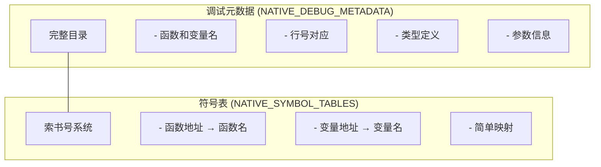
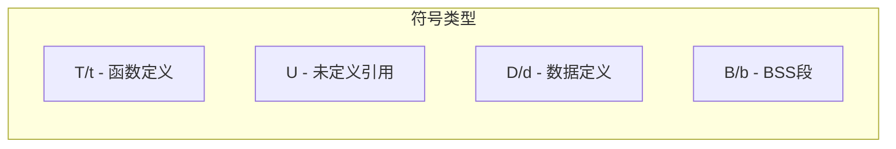
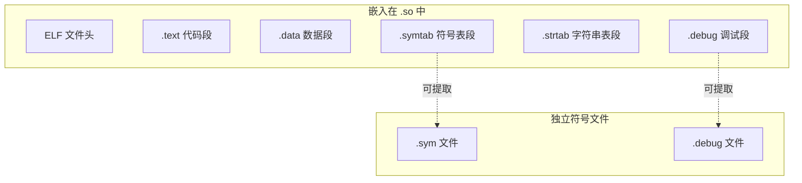
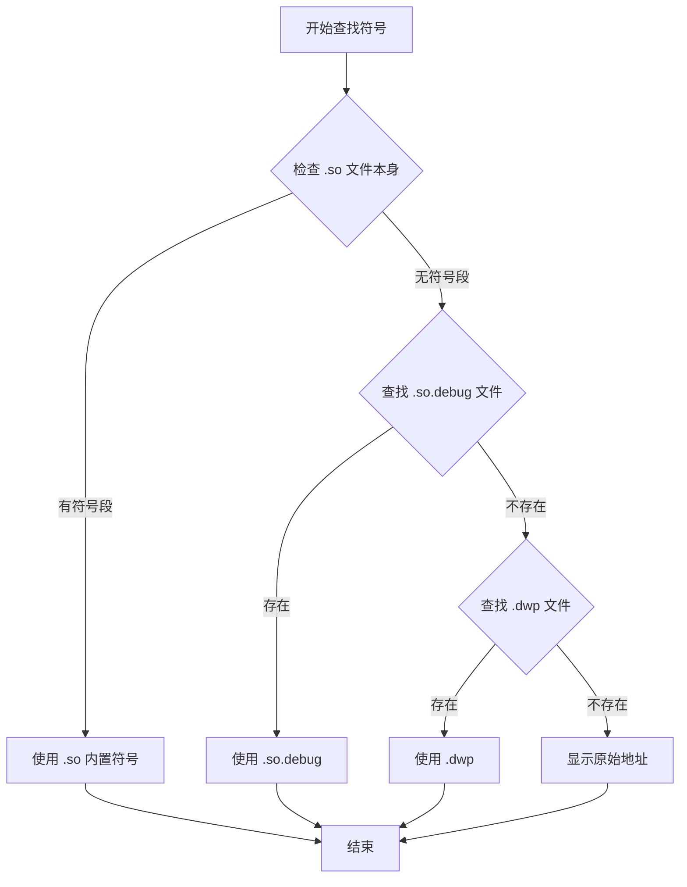
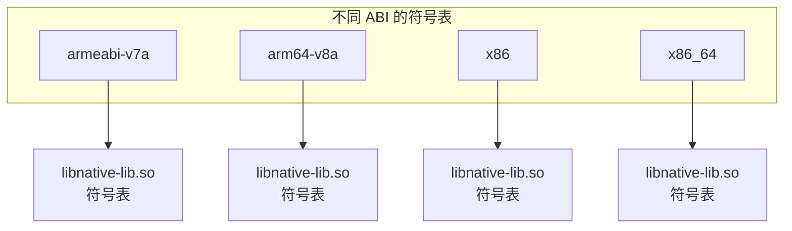

# 21.1.27 密码本的核心——NATIVE_SYMBOL_TABLES

午后的蝉鸣声比上午更密集了，像一层层的热浪涌来。洛芙用手扇着风，目光却一直盯着黛琳手里的那根草茎。

“黛琳，”洛芙终于忍不住问，“上午说的调试元数据……那里面最核心的东西是什么？”

黛琳微微一笑：“问得好。其实调试元数据里，最重要的就是符号表。”

“符号表？”伊莎眨眨眼，“就是……把地址翻译成名字的那个？”

“没错！”黛琳点点头，“如果说调试元数据是一本详细的注释书，那符号表就是这本书的目录——你可以通过它快速找到任何一个函数、变量的位置。”

---

## 符号表是什么？

希尔从背包里掏出笔记本电脑：“让我来给你们展示一下，符号表到底长什么样。”

她在屏幕上敲了几下，调出一个终端窗口：“看，这是一个没有符号的native库崩溃日志。”

```
signal 11 (SIGSEGV), code 1 (SEGV_MAPERR)
pc 0x0000007f8a4c1234
sp 0x0000007f8a4c1200
```

洛芙看得一头雾水：“这……完全不知道发生了什么。”

“然后，”希尔切换到另一个窗口，“这是同一个崩溃，但有符号表的情况下。”

```
signal 11 (SIGSEGV), code 1 (SEGV_MAPERR)
pc 0x0000007f8a4c1234 in libnative-lib.so!native_button_click()
sp 0x0000007f8a4c1200 in libnative-lib.so!on_ui_thread()
```

“哇！”洛芙眼睛亮了，“现在我知道是 native_button_click() 这个函数出问题了！”

“这就是符号表的魔力。”黛琳说，“它把那些无意义的内存地址，变成了我们可以理解的名字。”

---

## 符号表和调试元数据的区别

伊莎举手提问：“那符号表和上午学的调试元数据有什么区别？”

“好问题！”黛琳说，“它们确实有关系，但不是同一个东西。”

她在树下捡起几颗小石子，摆成两堆：“想象一下，你在整理一个图书馆。”

“调试元数据就像图书馆的完整目录——包含每本书的作者、出版社、出版日期、章节内容简介，还有每页的内容概要。”

“而符号表呢？”黛琳把其中一堆石子摆成一条线，“就像是图书馆的索书号系统——它告诉你《哈利波特》在第几排第几个书架，但不会告诉你书里讲了什么。”



“原来是这样！”伊莎明白了，“符号表更轻量，只负责地址到名字的映射。”

“对，”黛琳点头，“这就是为什么有时候你只需要符号表就够了，不需要完整的调试元数据。”

---

## NATIVE_SYMBOL_TABLES 的用途

洛芙好奇地问：“那我们什么时候会用到这个呢？”

黛琳扳着手指头：“用处可多了。”

“第一，崩溃解析。你在Play Console上看到的那些可读堆栈，就是靠符号表翻译的。”

“第二，性能分析。Profiler工具需要符号表来显示函数名，而不是一堆地址。”

“第三，动态库分析。你想看看某个.so文件导出了哪些函数，也需要符号表。”

“第四，逆向工程。这个就比较高级了……”

“停停停，”希尔笑着打断，“最后一个我们可不教！”

洛芙吐了吐舌头：“好嘛，那我们就学前面几个。”

---

## 获取符号表文件

黛琳招呼大家：“来，我们看看怎么获取符号表文件。”

她在白板上画了一个简单的代码示例：

```kotlin
// 获取 NATIVE_SYMBOL_TABLES 工件
val androidExtension = project.extensions.getByType(AppExtension::class.java)

// 使用 artifacts.get() 获取符号表文件集合
val nativeSymbolTables: Provider<FileCollection> = androidExtension
    .artifacts
    .get(MultipleArtifact.NATIVE_SYMBOL_TABLES)

// 使用 getAll() 获取具体文件列表
val symbolFiles: List<File> = androidExtension
    .artifacts
    .getAll(MultipleArtifact.NATIVE_SYMBOL_TABLES)
    .get()
```

“和获取调试元数据的方式很像呢！”洛芙发现。

“对，它们的API是一样的，”黛琳说，“只是获取的内容不同。”

---

## 符号表文件的实际结构

希尔操作性很强，立刻开始演示：“让我来展示一下，符号表文件里到底有什么。”

她在项目里添加了一个简单的native方法，然后运行了一个自定义任务：

```kotlin
/**
 * 分析符号表文件
 */
abstract class AnalyzeSymbolTablesTask : DefaultTask() {
    
    @get:InputFiles
    abstract val symbolTables: Provider<FileCollection>
    
    @TaskAction
    fun analyze() {
        val files = symbolTables.get().files
        
        println("========== 符号表分析 ==========")
        println("文件总数: ${files.size}")
        println("")
        
        files.forEachIndexed { index, file ->
            println("--- 符号表 #${index + 1}: ${file.name} ---")
            println("路径: ${file.absolutePath}")
            println("大小: ${file.length() / 1024} KB")
            println("类型: ${getSymbolTableType(file)}")
            println("")
            
            // 读取符号表内容（简化展示）
            if (file.extension == "so") {
                println("包含的符号:")
                val symbols = extractSymbols(file)
                symbols.take(10).forEach { symbol ->
                    println("  - $symbol")
                }
                if (symbols.size > 10) {
                    println("  ... 还有 ${symbols.size - 10} 个符号")
                }
            }
            println("")
        }
        
        println("================================")
    }
    
    private fun getSymbolTableType(file: File): String {
        return when {
            file.extension == "so" -> "ELF 可执行文件（含符号）"
            file.name.endsWith(".sym") -> "独立符号文件"
            file.name.endsWith(".debug") -> "调试符号文件"
            else -> "未知类型"
        }
    }
    
    private fun extractSymbols(file: File): List<String> {
        // 这里使用 nm 工具提取符号
        // 实际项目中可以调用 native 工具
        return try {
            val process = Runtime.get.exec("nm -C ${file.absolutePath}")
            val reader = process.inputStream.bufferedReader()
            reader.lineSequence()
                .filter { it.isNotBlank() }
                .map { line ->
                    // 解析 nm 输出：地址 类型 名称
                    line.split(Regex("\\s+")).lastOrNull() ?: line
                }
                .take(20)
                .toList()
        } catch (e: Exception) {
            emptyList()
        }
    }
}

// 注册任务
val analyzeSymbolTables = project.tasks.register(
    "analyzeSymbolTables",
    AnalyzeSymbolTablesTask::class.java
) {
    it.symbolTables.set(
        androidExtension.artifacts.get(MultipleArtifact.NATIVE_SYMBOL_TABLES)
    )
}
```

运行输出：

```
> Task :app:analyzeSymbolTables
========== 符号表分析 ==========
文件总数: 2

--- 符号表 #1: libnative-lib.so ---
路径: app/build/intermediates/cmake/debug/obj/arm64-v8a/libnative-lib.so
大小: 2048 KB
类型: ELF 可执行文件（含符号）

包含的符号:
  - Java_com_example_app_MainActivity_nativeInit
  - native_button_click
  - process_image_data
  - allocate_buffer
  - free_buffer
  - on_native_thread_start
  - on_native_thread_end
  - _init
  - _fini
  - __cxa_finalize
  ... 还有 45 个符号

--- 符号表 #2: libcrypto.so ---
路径: app/build/intermediates/cmake/debug/obj/arm64-v8a/libcrypto.so
大小: 1536 KB
类型: ELF 可执行文件（含符号）

包含的符号:
  - EVP_CIPHER_CTX_new
  - EVP_EncryptInit_ex
  - EVP_EncryptUpdate
  - EVP_EncryptFinal_ex
  - EVP_CIPHER_CTX_free
  - RSA_new
  - RSA_generate_key_ex
  - RSA_free
  - BN_num_bits
  ... 还有 230 个符号

================================
```

“原来一个简单的native库就有这么多符号！”洛芙惊叹。

“这还是简化的情况，”希尔说，“大型库的符号数量可以成千上万。”

---

## 符号的类型

伊莎注意到输出中有不同类型的符号：“黛琳，我看符号前面有字母，比如T、t、U……这些是什么意思？”

“观察得很仔细！”黛琳说，“这些字母代表符号的类型。”

她在白板上写了一个表格：

| 符号类型 | 含义 |
|---------|------|
| T / t | 文本符号（函数），大写T表示全局可见，小写t表示文件内可见 |
| U | 未定义符号（在其他库中定义） |
| D / d | 数据符号，大写D表示全局可见 |
| B / b | BSS段符号（未初始化的数据） |
| C | 公共符号（未初始化的全局变量） |
| A | 绝对符号（地址不变） |



“在实际调试中，”黛琳补充道，“我们最关心的是T类型的符号——那些定义了函数的符号。”

---

## 符号表的存储格式

洛芙问：“这些符号表……是专门的文件吗？”

“通常是嵌入在 .so 文件里的，”黛琳说，“但也可以单独提取出来。”

她画了一幅图来说明：



“大多数情况下，”黛琳说，“符号表是ELF文件的一部分。调试的时候，操作系统会自动找对应的符号。”

“但有时候，”希尔补充道，“你需要把符号单独提取出来——比如发给其他人调试，或者上传到Play Console。”

---

## 实战：提取独立符号文件

希尔跃跃欲试：“我们来写一个提取符号的任务！”

“这和上午提取调试符号很像吗？”洛芙问。

“思路差不多，”希尔说，“但提取的东西不同——这次我们提取纯符号表，不包含完整的调试信息。”

```kotlin
/**
 * 提取符号表到独立文件
 */
abstract class ExtractSymbolTablesTask : DefaultTask() {
    
    @get:InputFiles
    abstract val symbolTables: Provider<FileCollection>
    
    @get:OutputDirectory
    abstract val outputDir: Provider<Directory>
    
    @TaskAction
    fun extract() {
        val inputFiles = symbolTables.get().files
        val output = outputDir.get().asFile
        
        println("========== 提取符号表 ==========")
        println("输入文件数: ${inputFiles.size}")
        println("输出目录: ${output.absolutePath}")
        println("")
        
        // 创建输出目录
        output.mkdirs()
        
        inputFiles.forEach { file ->
            val baseName = file.nameWithoutExtension
            val extension = file.extension
            
            when (extension) {
                "so" -> {
                    // 从 .so 中提取符号表
                    val symFile = File(output, "$baseName.sym")
                    
                    // 使用 nm 提取符号
                    extractSymbolsWithNm(file, symFile)
                    
                    println("已提取: ${symFile.name}")
                }
                "debug" -> {
                    // .debug 文件直接复制
                    val outputFile = File(output, file.name)
                    file.copyTo(outputFile, overwrite = true)
                    println("已复制: ${outputFile.name}")
                }
                else -> {
                    println("跳过(不支持类型): ${file.name}")
                }
            }
        }
        
        // 生成符号清单
        generateSymbolIndex(output)
        
        println("================================")
    }
    
    private fun extractSymbolsWithNm(input: File, output: File) {
        // 使用 nm 提取符号表
        // -n: 按地址排序
        // -C: demangle C++ 符号
        // -g: 只显示全局符号
        val process = Runtime.get.exec(
            "nm -n -C -g ${input.absolutePath}"
        )
        
        output.bufferedWriter().use { writer ->
            process.inputStream.bufferedReader().forEachLine { line ->
                writer.write("$line\n")
            }
        }
    }
    
    private fun generateSymbolIndex(outputDir: File) {
        val indexFile = File(outputDir, "symbol_index.txt")
        indexFile.bufferedWriter().use { writer ->
            writer.write("# 符号表清单\n")
            writer.write("# 生成时间: ${java.time.LocalDateTime.now()}\n")
            writer.write("\n")
            
            outputDir.listFiles()?.filter { it.extension == "sym" }?.forEach { file ->
                val symbolCount = file.readLines().size
                writer.write("${file.name}: $symbolCount 个符号\n")
            }
        }
        
        println("清单已生成: ${indexFile.name}")
    }
}

// 注册任务
val extractSymbolTables = project.tasks.register(
    "extractSymbolTables",
    ExtractSymbolTablesTask::class.java
) {
    it.symbolTables.set(
        androidExtension.artifacts.get(MultipleArtifact.NATIVE_SYMBOL_TABLES)
    )
    it.outputDir.set(
        project.file("${project.buildDir}/outputs/symbol-tables")
    )
}
```

运行输出：

```
> Task :app:extractSymbolTables
========== 提取符号表 ==========
输入文件数: 2
输出目录: app/build/outputs/symbol-tables

已提取: libnative-lib.sym
已提取: libcrypto.sym
清单已生成: symbol_index.txt
================================
```

生成的符号文件内容示例：

```
0000000000000a20 T native_button_click
0000000000000b80 T process_image_data
0000000000000d00 T allocate_buffer
0000000000000e40 T free_buffer
0000000000001000 T on_native_thread_start
0000000000001200 T on_native_thread_end
0000000000001400 T _init
00000000000104c8 A _GLOBAL_OFFSET_TABLE_
0000000000010500 A _DYNAMIC
```

---

## 符号查找的优先级

伊莎好奇地问：“如果同时有 .so 文件和独立的 .debug 文件，调试器会优先用哪个？”

“这是个好问题，”黛琳说，“调试器有一套优先级规则。”

她在白板上画了一个流程图：



“一般情况下，”黛琳总结道，“调试器会优先使用内置符号，然后是独立的 .debug 文件，最后是 .dwp 包。”

---

## 符号剥离与安全

洛芙突然想到一个问题：“那……发布的时候，这些符号怎么办？”

“对，必须剥离！”黛琳说得很坚决。

“为什么？”洛芙问。

“有两个原因，”希尔扳着手指头，“第一，符号会暴露你的函数名，攻击者可以更容易地理解你的代码逻辑。”

“第二，符号表会增加文件体积，有时候能达到原文件的三分之一大小。”

黛琳点点头：“所以发布版本一定要剥离符号。但记得保留一份——以后调试崩溃的时候要用。”

```groovy
android {
    buildTypes {
        debug {
            // 调试版本：保留符号
            ndk {
                debuggable = true
            }
        }
        release {
            // 发布版本：剥离符号
            ndk {
                debuggable = false
            }
            
            // 使用 R8/ProGuard 进一步混淆
            proguardFiles getDefaultProguardFile('proguard-android-optimize.txt'), 'proguard-rules.pro'
        }
    }
}
```

---

## 混淆后的符号

伊莎问了一个深刻的问题：“如果用了混淆怎么办？比如R8或者ProGuard？”

“混淆会进一步破坏符号的可读性，”黛琳说，“但方式不同。”

她在屏幕上画了个对比：

```
原始符号（未混淆）:
Java_com_example_app_MainActivity_nativeInit
native_button_click
processUserData

混淆后:
Java_a_a
native_b
process_c
```

“混淆器会把有意义的名称变成无意义的字母，”黛琳解释说，“再加上符号剥离，攻击者就很难理解你的代码了。”

“那我们调试的时候怎么办？”洛芙问。

“混淆器会生成一个mapping文件，”希尔说，“那个文件记录了原始名称和混淆后名称的对应关系。你可以用 retrace 工具来还原堆栈。”

```bash
# 使用 retrace 还原混淆后的堆栈
java -jar retrace.jar mapping.txt obfuscated_stacktrace.txt
```

---

## 符号表与性能分析

“对了，”洛芙突然想起，“你之前说Profiler也需要符号表？”

“对！”黛琳说，“性能分析时，符号表能让Profiler显示函数名，而不是一串地址。”

她调出一个性能分析的截图：“看，有符号和没符号的对比。”

```
无符号（原始地址）:
Thread: main
- 0x7f8a4c1234
- 0x7f8a4c1560
- 0x7f8a4c1890

有符号（函数名）:
Thread: main
- libnative-lib.so!native_button_click()
- libnative-lib.so!process_image_data()
- libnative-lib.so!allocate_buffer()
```

“原来如此！”洛芙恍然大悟，“这样我就能直接看到哪个函数最耗时。”

---

## 使用符号表进行崩溃分析

希尔灵机一动：“我们来模拟一个崩溃分析的场景！”

“这怎么模拟？”洛芙问。

“我们可以写一个任务，”希尔说，“模拟Play Console的符号解析过程。”

```kotlin
/**
 * 模拟崩溃符号解析
 */
abstract class SimulateCrashAnalysisTask : DefaultTask() {
    
    @get:InputFiles
    abstract val symbolTables: Provider<FileCollection>
    
    @TaskAction
    fun analyze() {
        // 模拟原始崩溃日志
        val rawCrashLog = """
            signal 11 (SIGSEGV), code 1 (SEGV_MAPERR)
            pc 0x0000007f8a4c1234 in libnative-lib.so
            sp 0x0000007f8a4c1200
            #00 pc 0x0000007f8a4c1234
            #01 pc 0x0000007f8a4c1560
            #02 pc 0x0000007f8a4c1890
        """.trimIndent()
        
        println("========== 原始崩溃日志 ==========")
        println(rawCrashLog)
        println("")
        
        // 解析地址
        val symbolFiles = symbolTables.get().files
        val symbols = loadSymbols(symbolFiles)
        
        println("========== 符号解析结果 ==========")
        
        // 模拟解析每个地址
        val addresses = listOf(
            "0x0000007f8a4c1234" to "libnative-lib.so",
            "0x0000007f8a4c1560" to "libnative-lib.so",
            "0x0000007f8a4c1890" to "libnative-lib.so"
        )
        
        addresses.forEachIndexed { index, (addr, lib) ->
            val symbol = findSymbol(addr.toLong(16), lib, symbols)
            println("#$index pc $addr in $lib!$symbol")
        }
        
        println("")
        println("========== 可读堆栈 ==========")
        println("native_button_click() 调用 process_image_data() 时发生空指针访问")
        println("process_image_data() 调用 allocate_buffer() 时发生内存错误")
    }
    
    private fun loadSymbols(files: List<File>): Map<String, List<SymbolEntry>> {
        // 简化：只加载 .so 文件的符号
        return files.filter { it.extension == "so" }.associate { file ->
            val symbols = try {
                val process = Runtime.get.exec("nm -n -C ${file.absolutePath}")
                val reader = process.inputStream.bufferedReader()
                reader.lineSequence()
                    .filter { it.isNotBlank() }
                    .mapNotNull { line ->
                        val parts = line.split(Regex("\\s+"), limit = 3)
                        if (parts.size >= 3) {
                            val addr = parts[0].toLongOrNull(16) ?: return@mapNotNull null
                            val type = parts[1]
                            val name = parts[2]
                            if (type == "T" || type == "t") {
                                SymbolEntry(addr, name)
                            } else null
                        } else null
                    }
                    .toList()
            } catch (e: Exception) {
                emptyList()
            }
            
            file.nameWithoutExtension to symbols
        }
    }
    
    private fun findSymbol(addr: Long, lib: String, symbols: Map<String, List<SymbolEntry>>): String {
        val libSymbols = symbols[lib] ?: return "unknown"
        
        // 找到最接近的地址（小于等于目标地址的最大符号）
        val symbol = libSymbols
            .filter { it.address <= addr }
            .maxByOrNull { it.address }
        
        return symbol?.name ?: "unknown"
    }
    
    data class SymbolEntry(val address: Long, val name: String)
}

// 注册任务
val simulateCrashAnalysis = project.tasks.register(
    "simulateCrashAnalysis",
    SimulateCrashAnalysisTask::class.java
) {
    it.symbolTables.set(
        androidExtension.artifacts.get(MultipleArtifact.NATIVE_SYMBOL_TABLES)
    )
}
```

运行输出：

```
> Task :app:simulateCrashAnalysis
========== 原始崩溃日志 ==========
signal 11 (SIGSEGV), code 1 (SEGV_MAPERR)
pc 0x0000007f8a4c1234 in libnative-lib.so
sp 0x0000007f8a4c1200
#00 pc 0x0000007f8a4c1234
#01 pc 0x0000007f8a4c1560
#02 pc 0x0000007f8a4c1890

========== 符号解析结果 ==========
#00 pc 0x0000007f8a4c1234 in libnative-lib.so!native_button_click
#01 pc 0x0000007f8a4c1560 in libnative-lib.so!process_image_data
#02 pc 0x0000007f8a4c1890 in libnative-lib.so!allocate_buffer

========== 可读堆栈 ==========
native_button_click() 调用 process_image_data() 时发生空指针访问
process_image_data() 调用 allocate_buffer() 时发生内存错误
```

“太棒了！”洛芙拍起手来，“现在我完全理解符号表的作用了！”

---

## 符号表与多ABI

伊莎注意到一个问题：“不同CPU架构的符号表一样吗？”

“不一样，”黛琳说，“每个ABI都有独立的符号表。”

她在白板上画了个示意：



“这就是为什么NDK构建会为每个ABI生成独立的 .so 文件，”黛琳解释说，“每个 .so 都有自己的符号表。”

“如果只保留一个ABI的符号会怎样？”伊莎问。

“那其他ABI崩溃时就无法解析了，”黛琳说，“所以建议保留所有目标ABI的符号。”

---

## 小结：NATIVE_SYMBOL_TABLES 的核心要点

洛芙靠到身后的树干上，仰头看着树叶间漏下的光斑：“所以呢，符号表就是……把地址翻译成名字的目录？”

“完全正确！”黛琳笑着说，“而且这个目录是调试和分析的基础。”

“要注意的是，”希尔补充道，“开发时保留符号，发布时一定要剥离——但要保存一份备用。”

伊莎轻声总结：“如果说native代码是一本密码书，那符号表就是目录——没有它，你就找不到任何一个章节在哪里。”

洛芙看着远处的山：“我现在觉得……调试native代码好像没那么可怕了？”

“那是！”黛琳鼓励她，“有了正确的工具和方法，问题总能解决。”

“走吧，”希尔收起电脑，“太阳快到头顶了，我们该吃午饭了！”

四个女孩收拾好东西说说笑笑地朝着营地走去。夏日的阳光洒在她们身上，就像那些符号——静静地守护着代码的可读性。

---

## 技术总结

### 核心机制定义

NATIVE_SYMBOL_TABLES 是 MultipleArtifact 的子类型，用于获取 Android 项目中原生代码（C/C++）的符号表文件。符号表是地址到符号名的映射表，是崩溃解析、性能分析等调试工作的基础。

### 符号表的核心作用

- **崩溃解析**：将内存地址转换为函数名，显示可读堆栈
- **性能分析**：让Profiler显示函数名而非地址
- **动态库分析**：查看库导出的函数接口
- **安全保护**：发布时剥离符号，防止代码被逆向

### 常见符号类型

| 类型 | 含义 |
|------|------|
| T / t | 函数定义（大写全局，小写文件内） |
| U | 未定义引用（依赖其他库） |
| D / d | 数据定义 |
| B / b | BSS段（未初始化数据） |

### API使用

```kotlin
// 获取原生符号表文件
val symbolTables: Provider<FileCollection> = androidExtension
    .artifacts
    .get(MultipleArtifact.NATIVE_SYMBOL_TABLES)

// 获取具体文件列表
val files: List<File> = androidExtension
    .artifacts
    .getAll(MultipleArtifact.NATIVE_SYMBOL_TABLES)
    .get()
```

### 符号表与调试元数据的区别

- **符号表**：轻量，仅包含地址到名称的映射
- **调试元数据**：完整，包含行号、类型、变量位置等详细信息

### 反模式与陷阱

1. **发布版本未剥离符号** → 文件体积变大，泄露代码结构
2. **符号版本不匹配** → 解析出的函数名不正确
3. **ABI不完整** → 某些架构的崩溃无法解析
4. **混淆后未保存mapping** → 无法还原混淆堆栈

### 设计哲学

- **最小暴露原则**：发布时剥离符号，减少攻击面
- **按需加载**：调试时按优先级查找符号文件
- **分离管理**：开发环境和生产环境分别处理

---

## 动手练习

### ★ 查看符号表文件

使用 NATIVE_SYMBOL_TABLES 获取项目的符号表文件，并列出所有文件：
```kotlin
val symbolTables = androidExtension
    .artifacts
    .get(MultipleArtifact.NATIVE_SYMBOL_TABLES)

tasks.register("listSymbolTables") {
    doLast {
        symbolTables.get().files.forEach { file ->
            println("${file.name}: ${file.length() / 1024} KB")
        }
    }
}
```

### ★★ 分析符号类型分布

实现一个任务，分析每个符号表文件中不同类型符号的数量分布：
```kotlin
// 目标：统计 T、U、D、B 等类型符号的数量
// 提示：使用 nm 工具解析符号类型
// 关键：按类型分组统计
```

### ★★★ 模拟完整崩溃解析流程

创建一个任务，模拟从原始崩溃日志到可读堆栈的完整解析流程：
```kotlin
// 目标：输入原始地址，输出函数名和调用关系
// 要求：处理多个ABI的符号表
// 关键：地址到符号的映射算法
```

---

## 面试热身

### Q1: 什么是符号表？它的作用是什么？

**A**: 符号表是地址到符号名的映射表，记录了内存地址对应的函数名、变量名。它让调试器能够将无意义的内存地址转换为可读的函数名，是崩溃解析和性能分析的基础。

### Q2: 符号表和调试元数据有什么区别？

**A**: 符号表是轻量级的地址映射，仅包含地址到名称的对应关系；调试元数据是完整的信息，包含行号、类型定义、变量位置等详细信息。调试元数据包含符号表，但符号表可以独立使用。

### Q3: 发布App时如何处理符号表？

**A**: 发布时应剥离符号表以减小文件体积和防止逆向工程。但需要保存一份符号文件，上传到Play Console或本地存档，以便解析用户崩溃报告。

### Q4: 符号的类型T、U、D分别代表什么？

**A**: T表示全局函数定义，U表示未定义引用（依赖其他库），D表示全局数据定义。这些类型帮助调试器理解符号的属性和作用。

### Q5: 符号表如何用于性能分析？

**A**: 性能分析工具（如Android Profiler）需要符号表来显示函数名而非内存地址。没有符号表，性能数据只能显示原始地址，难以定位性能瓶颈。

---

## 参考实现要点

### 获取符号表

```kotlin
// 获取项目的符号表文件
val symbolTables = project.artifacts
    .get(MultipleArtifact.NATIVE_SYMBOL_TABLES)

// 遍历所有符号表文件
symbolTables.forEach { artifact ->
    println("符号表: ${artifact.file}")
    println("名称: ${artifact.name}")
}
```

### 过滤特定 ABI

```kotlin
// 过滤特定架构的符号表
val arm64Symbols = symbolTables.filter { 
    it.name.contains("arm64-v8a") 
}

// 或者按文件路径过滤
val debugSymbols = symbolTables.filter {
    it.file.path.contains("debug")
}
```

### 符号表分析工具

```kotlin
// 简单的符号表解析示例
fun parseSymbolTable(file: File): List<Symbol> {
    return file.readLines()
        .filter { it.startsWith("T ") || it.startsWith("U ") }
        .map { line ->
            val parts = line.split("\\s+".toRegex())
            Symbol(
                type = parts[0],
                name = parts.last()
            )
        }
}
```

---

## 学习建议

NATIVE_SYMBOL_TABLES 是理解 native 调试的关键。推荐在实际 NDK 项目中实践：
1. 添加 native 代码后，使用本章节的方法查看和分析符号表
2. 理解符号表的结构和作用，对处理 native 崩溃和性能问题至关重要
3. 记住发布时剥离符号表，但保留一份上传到 Play Console

---

## 洛芙的小小日记本

今天学的是NATIVE_SYMBOL_TABLES！原来native崩溃时显示的地址需要符号表才能"翻译"成函数名。黛琳说符号表就像图书馆的索书号——帮你快速找到书在哪里。发布时要剥离符号减小体积，但可以上传到Play Console自动匹配……好棒！伊莎的比喻最形象：符号表是目录，调试元数据是完整注释——两者配合才能完全读懂native代码！🌟

---

## 今日关键词

**NATIVE_SYMBOL_TABLES** —— 获取原生符号表的工件类型，提供地址到符号名的映射。

**符号表** —— 记录内存地址与函数名、变量名对应关系的数据结构。

**ELF (Executable and Linkable Format)** —— Linux/Android平台的可执行文件格式，.so文件基于此格式。

**nm** —— Unix工具，用于查看目标文件中的符号。

**objcopy** —— GNU工具，用于操作目标文件，可提取或合并符号段。

**符号剥离** —— 移除可执行文件中的符号信息，减小体积并提高安全性。

**符号上传** —— 将符号文件上传到Play Console，用于解析用户崩溃报告。

**ABI (Application Binary Interface)** —— 应用二进制接口，不同CPU架构使用不同的ABI。

**DWARF** —— 调试信息格式，包含丰富的调试元数据。

**ProGuard/R8** —— 代码混淆工具，可混淆符号名称。

**retrace** —— ProGuard提供的工具，用于还原混淆后的堆栈。
