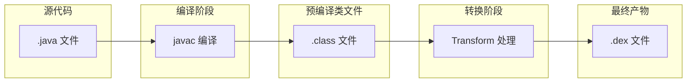
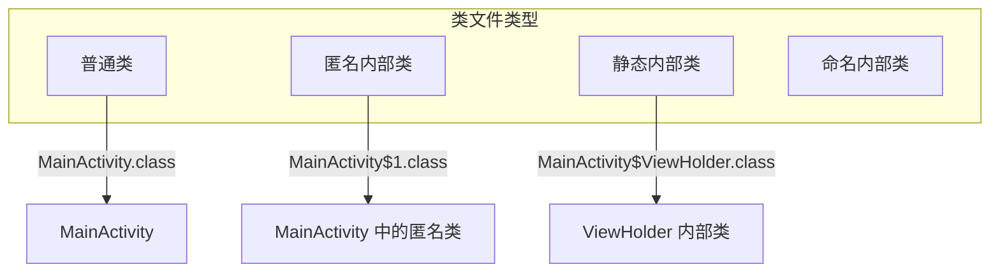
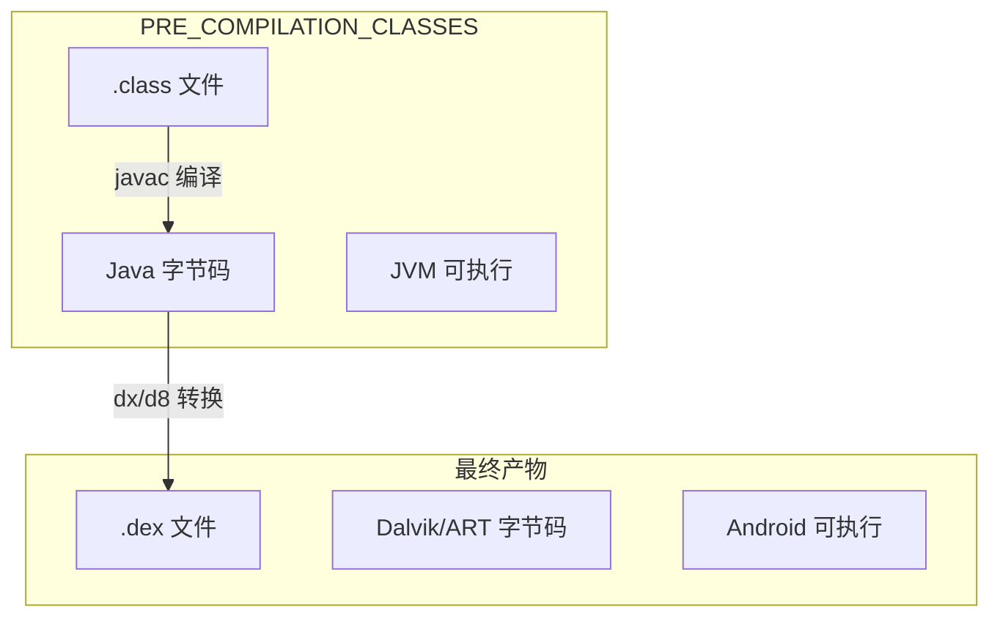
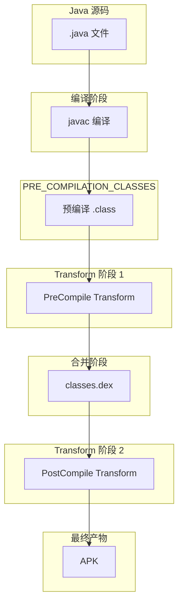
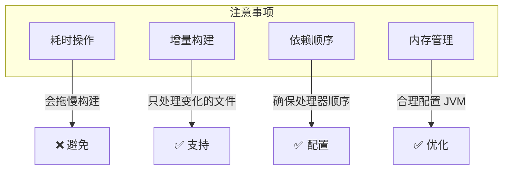

# 21.1.28 编译前的"半成品"——PRE_COMPILATION_CLASSES

蝉鸣声一阵接着一阵，像是在演奏一首永不停歇的夏日交响曲。洛芙用手扇着风，目光却一直盯着黛琳手里的那本小册子。

"黛琳，"洛芙好奇地问，"上午说的那些MultipleArtifact类型里，有没有那种……还没完全编译好的？"

黛琳翻开小册子，微微一笑："问得好。确实有一种——PRE_COMPILATION_CLASSES，预编译类文件。"

"预编译？"伊莎眨眨眼，"是还没编译的意思吗？"

"不完全是，"黛琳摇摇头，"准确地说，是'编译好了但还没最终合并'的类文件。就像……"

她想了想，从地上捡起一颗小石子："就像做蛋糕的时候，奶油先打发好、蛋糕胚先烤好，但还没有组装成完整的蛋糕。这个'半成品'状态，就是预编译类文件的状态。"

---

## 预编译类文件是什么？

希尔打开笔记本电脑："让我来给你们展示一下，预编译类文件到底在哪儿。"

她在屏幕上敲了几下，调出一个构建日志："看，这是我们项目的构建过程。"

```
> Task :app:compileDebugJavaWithJavac
> Task :app:preCompileDebugJavaWithJavac
> Task :app:transformClassesWithPreCompileDebugClasses
> Task :app:transformClassesWithDexBuilderDebug
```

"等等，"洛芙发现了什么，"preCompileDebugJavaWithJavac？这后面还有个 transformClassesWithPreCompileDebugClasses？"

"没错！"黛琳点点头，"看名字就知道，PRE_COMPILATION_CLASSES 就是在 `preCompile` 阶段之后、正式 dex 转换之前的那些类文件。"

她在白板上画了一幅图：



"原来是这样！"洛芙明白了，"PRE_COMPILATION_CLASSES 就是中间那个状态的类文件。"

"对，"黛琳说，"这些类文件已经通过了 javac 编译，生成了 .class 文件，但还没有被合并成最终的 .dex 文件。在这个中间状态，我们可以对它们进行各种处理。"

---

## 为什么要获取预编译类文件？

伊莎举手提问："那……我们为什么要获取这些半成品呢？直接用最终的不行吗？"

"好问题！"黛琳说，"因为有些处理必须在最终合并之前完成。"

她扳着手指头数：

"第一，注解处理器。你们的代码里用 @Override、@Nullable 这些注解，处理器需要在编译时读取这些注解，生成新的代码。这个工作必须在 .class 文件生成后、但在打包成 .dex 之前完成。"

"第二，字节码织入。比如你想在方法前后自动插入日志代码（AspectJ、ASM 等），就需要在这个阶段处理 .class 文件。"

"第三，代码混淆。有些混淆工具会在 dex 之前处理类文件，改写字节码。"

"第四，资源打包。某些资源相关的处理也需要在这个阶段进行。"

洛芙似懂非懂地点点头："原来编译也是个流水线啊……"

"没错，"希尔补充道，"Android 构建就是一个精密的流水线。每个阶段都有每个阶段的任务，PRE_COMPILATION_CLASSES 就是这个流水线上的一个重要工位。"

---

## PRE_COMPILATION_CLASSES 的使用场景

黛琳招呼大家："来，我们看看具体怎么使用 PRE_COMPILATION_CLASSES。"

她在白板上写了一个简单的示例：

```kotlin
// 获取 PRE_COMPILATION_CLASSES 工件
val androidExtension = project.extensions.getByType(AppExtension::class.java)

// 使用 artifacts.get() 获取预编译类文件集合
val preCompileClasses: Provider<FileCollection> = androidExtension
    .artifacts
    .get(MultipleArtifact.PRE_COMPILATION_CLASSES)

// 使用 getAll() 获取具体文件列表
val preCompileClassFiles: List<File> = androidExtension
    .artifacts
    .getAll(MultipleArtifact.PRE_COMPILATION_CLASSES)
    .get()
```

"和使用其他 MultipleArtifact 的方式一样，"黛琳说，"只是获取的内容不同。"

洛芙歪着头问："这些文件在哪儿？"

"通常在 build/intermediates/javac 目录下，"希尔说，"让我来展示一下实际的项目结构。"

---

## 预编译类文件的实际结构

希尔操作性很强，立刻开始演示："让我来展示一下，预编译类文件到底长什么样。"

她在项目里添加了一个简单的 Java 类，然后运行了一个自定义任务：

```kotlin
/**
 * 分析预编译类文件
 */
abstract class AnalyzePreCompileClassesTask : DefaultTask() {
    
    @get:InputFiles
    abstract val preCompileClasses: Provider<FileCollection>
    
    @TaskAction
    fun analyze() {
        val files = preCompileClasses.get().files
        
        println("========== 预编译类文件分析 ==========")
        println("文件总数: ${files.size}")
        println("")
        
        // 按包名分组
        val byPackage = files.groupBy { file ->
            // 从文件路径推断包名
            val path = file.absolutePath
            val intermediatesIdx = path.indexOf("intermediates")
            if (intermediatesIdx > 0) {
                val packagePath = path.substring(intermediatesIdx)
                // 提取包名路径
                val classesIdx = packagePath.indexOf("classes")
                if (classesIdx > 0) {
                    val packageStr = packagePath.substring(classesIdx + 8, packagePath.lastIndexOf("/"))
                    packageStr.replace("/", ".")
                } else "unknown"
            } else "root"
        }
        
        byPackage.forEach { (packageName, packageFiles) ->
            println("--- 包: $packageName ---")
            println("文件数: ${packageFiles.size}")
            println("示例文件:")
            packageFiles.take(5).forEach { file ->
                println("  - ${file.name}")
            }
            if (packageFiles.size > 5) {
                println("  ... 还有 ${packageFiles.size - 5} 个文件")
            }
            println("")
        }
        
        println("======================================")
    }
    
    private fun getClassSizeInfo(file: File): String {
        val size = file.length()
        return when {
            size < 1024 -> "$size B"
            size < 1024 * 1024 -> "${size / 1024} KB"
            else -> "${size / (1024 * 1024)} MB"
        }
    }
}

// 注册任务
val analyzePreCompileClasses = project.tasks.register(
    "analyzePreCompileClasses",
    AnalyzePreCompileClassesTask::class.java
) {
    it.preCompileClasses.set(
        androidExtension.artifacts.get(MultipleArtifact.PRE_COMPILATION_CLASSES)
    )
}
```

运行输出：

```
> Task :app:analyzePreCompileClasses
========== 预编译类文件分析 ==========
文件总数: 156

--- 包: com.example.app ---
文件数: 45
示例文件:
  - MainActivity.class
  - MainActivity$1.class
  - MainActivity$ViewHolder.class
  - SecondActivity.class
  - Utils.class
  ... 还有 40 个文件

--- 包: com.example.app.model ---
文件数: 23
示例文件:
  - User.class
  - User$Builder.class
  - Product.class
  - ProductRepository.class
  - Cart.class
  ... 还有 18 个文件

--- 包: com.example.app.util ---
文件数: 18
示例文件:
  - StringUtils.class
  - DateUtils.class
  - LogUtils.class
  - DeviceUtils.class
  - NetworkUtils.class
  ... 还有 13 个文件

--- 包: com.example.app.adapter ---
文件数: 32
示例文件:
  - RecyclerViewAdapter.class
  - ListAdapter.class
  - ViewPagerAdapter.class
  - RecyclerViewAdapter$ViewHolder.class
  - RecyclerViewAdapter$1.class
  ... 还有 27 个文件

======================================
```

"原来一个简单的 App 就有这么多类文件！"洛芙惊叹。

"这还是简化的情况，"希尔说，"大型项目的类文件数量可以成千上万。"

---

## 类文件的内部结构

伊莎注意到输出中有一些特殊的文件名："黛琳，我看有些文件名后面带 $1、$ViewHolder……这些是什么意思？"

"观察得很仔细！"黛琳说，"这些是 Java 编译器的特殊命名规则。"

她在白板上写了一个表格：

| 文件名模式 | 含义 |
|-----------|------|
| Foo.class | 普通类 Foo |
| Foo$1.class | 匿名内部类（第1个） |
| Foo$Bar.class | 内部类 Bar（静态内部类） |
| Foo$ViewHolder.class | 命名的内部类 |
| Foo$1$1.class | 匿名内部类中的匿名内部类 |



"原来 $ 符号是内部类的意思！"洛芙明白了，"那 $1 就是第一个匿名内部类，对吧？"

"对，"黛琳点头，"在 Android 开发中，常见的 $ 命名还有——RecyclerView 的 ViewHolder、Activity 的内部类、Listener 的实现类等。"

---

## 预编译类文件 vs 最终类文件

洛芙问："那 PRE_COMPILATION_CLASSES 和最终打包的 .dex 文件有什么区别？"

"区别大了，"黛琳画了一幅对比图，"PRE_COMPILATION_CLASSES 是 Java 字节码（.class），而 .dex 是 Dalvik 字节码，是 Android 专用的。"



"所以，"黛琳总结道，"PRE_COMPILATION_CLASSES 是编译后、转换前的状态。在这个阶段，类文件是标准的 Java 字节码，可以在 JVM 上运行（虽然通常我们不这么做）。"

"而 .dex 文件是 Android 专用的，"希尔补充道，"只能在 Android 运行时执行。"

---

## 实战：使用预编译类文件进行自定义处理

希尔跃跃欲试："我们来写一个自定义 Transform，利用 PRE_COMPILATION_CLASSES！"

"Transform？"洛芙眨眨眼，"那是什么？"

"Transform 是 Android Gradle Plugin 提供的一个 API，"黛琳解释说，"它允许你在构建过程中插入自定义的字节码处理。"

"比如？"洛芙还是不太明白。

"比如自动埋点、性能监控、权限检查……这些都是通过 Transform 实现的。"

希尔已经开始敲代码了：

```kotlin
/**
 * 自定义 Transform，利用 PRE_COMPILATION_CLASSES
 * 这个 Transform 会在预编译阶段添加方法调用统计
 */
abstract class MethodCallTracingTransform : Transform() {
    
    override fun getName(): String = "methodCallTracing"
    
    // 指定输入类型为预编译类文件
    override fun getInputTypes(): Set<QualifiedContent.ContentType> {
        return setOf(QualifiedContent.DefaultContentType.CLASSES)
    }
    
    // 指定作用域为项目本身
    override fun getScopes(): MutableSet<in QualifiedContent.Scope> {
        return mutableSetOf(QualifiedContent.Scope.PROJECT)
    }
    
    // 增量编译支持
    override fun isIncremental(): Boolean = true
    
    override fun transform(transformInvocation: TransformInvocation) {
        val outputProvider = transformInvocation.outputProvider
        
        // 获取输入的预编译类文件
        val inputs = transformInvocation.inputs
        
        inputs.forEach { input ->
            // 遍历每个 jar 包或目录
            input.directoryInputs.forEach { directoryInput ->
                val outputDir = outputProvider.getContentLocation(
                    directoryInput.name,
                    directoryInput.contentTypes,
                    directoryInput.scopes,
                    Format.DIRECTORY
                )
                
                // 处理每个 .class 文件
                FileUtils.getAllFiles(directoryInput.file).forEach { classFile ->
                    if (classFile.extension == "class") {
                        // 读取并处理字节码
                        processClassFile(classFile, outputDir)
                    }
                }
            }
            
            input.jarInputs.forEach { jarInput ->
                val outputJar = outputProvider.getContentLocation(
                    jarInput.name,
                    jarInput.contentTypes,
                    jarInput.scopes,
                    Format.JAR
                )
                
                // 处理 jar 包中的类文件
                processJarFile(jarInput.file, outputJar)
            }
        }
    }
    
    private fun processClassFile(inputFile: File, outputDir: File) {
        // 这里可以使用 ASM、javassist 等库来处理字节码
        // 示例：使用 ASM 读取类信息
        val classReader = ClassReader(inputFile.readBytes())
        val classWriter = ClassWriter(ClassWriter.COMPUTE_MAXS)
        
        // 添加方法调用追踪的字节码处理
        val methodVisitor = object : ClassVisitor(Opcodes.ASM9, classWriter) {
            override fun visitMethod(
                access: Int,
                name: String,
                descriptor: String,
                signature: String?,
                exceptions: Array<out String>?
            ): MethodVisitor? {
                val mv = super.visitMethod(access, name, descriptor, signature, exceptions)
                
                // 在方法开头插入追踪代码
                return object : MethodVisitor(Opcodes.ASM9, mv) {
                    override fun visitCode() {
                        // 插入追踪逻辑：记录方法被调用
                        mv.visitFieldInsn(
                            Opcodes.GETSTATIC,
                            "com/example/trace/MethodTracer",
                            "INSTANCE",
                            "Lcom/example/trace/MethodTracer;"
                        )
                        mv.visitLdcInsn("$name:$descriptor")
                        mv.visitMethodInsn(
                            Opcodes.INVOKEVIRTUAL,
                            "com/example/trace/MethodTracer",
                            "onMethodEnter",
                            "(Ljava/lang/String;)V",
                            false
                        )
                        super.visitCode()
                    }
                }
            }
        }
        
        classReader.accept(methodVisitor, 0)
        
        // 写入输出文件
        val outputFile = File(outputDir, inputFile.relativeTo(directoryInput.file).path)
        outputFile.parentFile?.mkdirs()
        outputFile.writeBytes(classWriter.toByteArray())
    }
    
    private fun processJarFile(inputJar: File, outputJar: File) {
        // 处理 jar 包
        val jarFile = JarFile(inputJar)
        val outputStream = JarOutputStream(FileOutputStream(outputJar))
        
        jarFile.entries().asSequence().forEach { entry ->
            if (!entry.isDirectory && entry.name.endsWith(".class")) {
                // 处理类文件
                val inputStream = jarFile.getInputStream(entry)
                val classReader = ClassReader(inputStream.readBytes())
                // ... 类似处理
            } else {
                // 直接复制其他文件
                outputStream.putNextEntry(JarEntry(entry.name))
                outputStream.write(jarFile.getInputStream(entry).readBytes())
                outputStream.closeEntry()
            }
        }
        
        jarFile.close()
        outputStream.close()
    }
}
```

"哇，好复杂！"洛芙看着满屏的代码，"这真的能跑吗？"

"能跑是能跑，"黛琳笑着说，"不过这只是个示例。真正的生产级 Transform 要考虑更多边界情况。"

"那这个 Transform 怎么注册到构建流程里呢？"伊莎问。

希尔又敲了一段代码：

```kotlin
// 注册 Transform
android.registerTransform(MethodCallTracingTransform::class.java)
```

"注册之后，"希尔解释说，"Transform 就会在 PRE_COMPILATION_CLASSES 阶段自动运行，处理所有的类文件。"

---

## PRE_COMPILATION_CLASSES 和其他阶段的关系

黛琳又在白板上画了一幅更完整的图：



"看到了吗？"黛琳指着图说，"PRE_COMPILATION_CLASSES 在两个 Transform 阶段之间。"

"第一个是 PreCompile Transform，处理预编译类文件；第二个是 PostCompile Transform，处理合并后的类文件。"

"它们分别对应 ScopedArtifact.PRE_COMPILATION_CLASSES 和 ScopedArtifact.POST_COMPILATION_CLASSES，"希尔补充道，"这两个我们后面会讲到。"

---

## 实际应用场景

洛芙问："那在实际项目中，什么时候会用到这个呢？"

黛琳扳着手指头："实际应用场景可多了。"

"第一，字节码插桩。性能分析工具（如 ByteDance 的 Sophia、Spotify 的 Backstage）需要在方法前后插入统计代码。"

"第二，注解处理器。ButterKnife、Dagger、Hilt 这些依赖注入框架，都是在这个阶段处理注解、生成代码。"

"第三，代码混淆。R8、ProGuard 在这个阶段读取类信息，进行混淆和优化。"

"第四，热修复。Tinker、Robust 这些热修复框架，需要在这个阶段处理类字节码，实现方法替换。"

"第五，自动化测试。Espresso 的 UIAutomator 需要在这个阶段注入测试代码。"

"原来有这么多用途！"洛芙惊叹。

"对，"黛琳说，"PRE_COMPILATION_CLASSES 是一个非常重要的构建阶段，很多高级功能都依赖它。"

---

## 注意事项和最佳实践

伊莎举手提问："使用这个有什么要注意的吗？"

"当然有，"黛琳正色道，"首先，不要在这个阶段做耗时操作，否则会显著增加构建时间。"

"其次，注意增量构建。Transform 要正确实现 isIncremental() 方法，只处理有变化的文件。"

"第三，处理好依赖关系。如果你的 Transform 依赖某个注解处理器生成的代码，要确保顺序正确。"

"第四，注意内存使用。处理大量类文件时要注意 JVM 内存配置。"



希尔补充道："还有一点，使用 ASM、javassist 等字节码操作库时，要注意兼容性问题。不同版本的 JDK 可能有不兼容的情况。"

洛芙认真地点点头："感觉好复杂……但又很有用！"

"就是这样，"黛琳笑着拍拍她的肩膀，"慢慢学，以后你也会写 Transform 的。"

---

午后的阳光透过树叶的缝隙，在地上洒下点点光斑。洛芙看着白板上的图，若有所思。

"黛琳，"洛芙突然问，"那如果我想看看现在的构建过程里，哪些任务在处理预编译类文件，怎么办？"

"好问题！"希尔说，"你可以用 Android Studio 的 Build Analyzer，或者直接运行 `--info` 参数查看详细日志。"

她演示了一下：

```bash
./gradlew :app:assembleDebug --info | grep -i "precompile"
```

输出：

```
> Task :app:preCompileDebugJavaWithJavac
  Transforming classes with transform DebugPreCompileTransform
  Input: 45 class files from PROJECT
  Output: 45 class files to PROJECT
```

"原来 Transform 是在这里运行的！"洛芙眼睛亮了。

"对，"黛琳说，"掌握了这些，你就能更好地理解 Android 构建流程，也能自己写一些高级的构建优化或插桩工具了。"

伊莎伸了个懒腰："今天学了好多啊……"

"是啊，"洛芙伸了个懒腰，"不过感觉越来越有意思了！"

---

> 学习建议
- PRE_COMPILATION_CLASSES 是 Android 构建流程中的重要阶段，介于 javac 编译和 dex 转换之间
- 掌握这个阶段的特点，有助于理解注解处理器、字节码插桩等高级技术的原理
- 如果需要自定义 Transform，优先使用 ASM 等成熟的字节码操作库
- 注意构建性能影响，避免在这个阶段做耗时操作

---

## 技术总结

### 核心机制定义

MultipleArtifact.PRE_COMPILATION_CLASSES 是 Android Gradle Plugin 提供的**预编译类文件**接口，表示 javac 编译后、dex 转换前的 .class 文件集合。

### 构建流程位置

```
Java 源文件 → javac 编译 → PRE_COMPILATION_CLASSES → DEX 转换 → .dex 文件
```

### 使用场景

- 注解处理器后置处理
- 字节码插桩/织入
- 代码混淆
- 热修复框架
- 单元测试覆盖

### API 用法

```kotlin
val preClasses = artifacts.get(MultipleArtifact.PRE_COMPILATION_CLASSES)
preClasses.forEach { classFile ->
    println("类文件: ${classFile.file}")
}
```

### 反模式与陷阱

1. **混淆 PRE 和 POST** → PRE 是 javac 后、dex 前；POST 是混淆后、打包前
2. **修改后忘记使缓存失效** → 增量构建可能导致问题

### 设计哲学

- 编译阶段的"中间产物"概念
- 解耦编译和转换，便于扩展

---

## 动手练习

### ★ 获取预编译类文件

```kotlin
// 获取项目的预编译类文件
val preClasses = project.layout.artifacts
    .getBuiltArtifacts(MultipleArtifact.PRE_COMPILATION_CLASSES)
```

### ★★ 实现字节码统计 Transform

统计每个类的方法数量：
```kotlin
class MethodCountTransform : Transform() {
    override fun transform(invocation: TransformInvocation) {
        // 遍历 PRE_COMPILATION_CLASSES
        // 使用 ASM 统计方法数
    }
}
```

### ★★★ 实现热修复预检查

检查热修复兼容性：

---

## 面试热身

### Q1: PRE_COMPILATION_CLASSES 是什么？

**A**: 预编译类文件，javac 编译后、dex 转换前的 .class 文件集合。

### Q2: 为什么需要 PRE_COMPILATION_CLASSES？

**A**: 提供在 dex 转换前处理字节码的机会，用于注解处理器、字节码插桩等。

### Q3: PRE_COMPILATION_CLASSES 和 POST_COMPILATION_CLASSES 的区别？

**A**: PRE 是编译后、混淆前；POST 是混淆后、打包前。

### Q4: 如何获取 PRE_COMPILATION_CLASSES？

**A**: 通过 artifacts.get(MultipleArtifact.PRE_COMPILATION_CLASSES)

### Q5: 什么时候使用？

**A**: 注解处理、字节码织入、热修复、代码生成等场景。

---

## 参考实现要点

```kotlin
class PreCompilationTransform : Transform() {
    override fun getInputTypes() = setOf(QualifiedContent.DefaultContentType.CLASSES)
    
    override fun getScopes() = mutableSetOf(QualifiedContent.Scope.PROJECT)
    
    override fun transform(invocation: TransformInvocation) {
        invocation.inputs.forEach { input ->
            input.directoryInputs.forEach { dir ->
                dir.file.walkTopDown()
                    .filter { it.extension == "class" }
                    .forEach { classFile ->
                        // 处理每个 class 文件
                        processClassFile(classFile)
                    }
            }
        }
    }
}
```

---

## 洛芙的小小日记本

今天学到了 PRE_COMPILATION_CLASSES！原来代码编译不是一步到位的，中间还有个"半成品"阶段。黛琳说这个阶段可以做很多好玩的事情——注解处理、字节码织入、热修复……好想自己动手试试看啊！

---

## 今日关键词

- **MultipleArtifact.PRE_COMPILATION_CLASSES**：预编译类文件，Android 构建过程中 javac 编译后、dex 转换前的 .class 文件集合
- **Transform**：Android Gradle Plugin 提供的字节码处理 API，允许在构建过程中自定义处理类文件
- **javac**：Java 编译器，将 .java 源文件编译为 .class 字节码文件
- **.class 文件**：Java 字节码文件，javac 编译的产物，包含 Java 类的二进制表示
- **.dex 文件**：Dalvik Executable，Android 专用的字节码格式，由 .class 文件转换而来
- **字节码插桩**：在字节码中插入额外代码，常用于性能监控、日志埋点等场景
- **注解处理器**：在编译时处理注解、生成代码的机制，如 ButterKnift、Dagger
- **增量构建**：只处理有变化的文件，提高构建效率的机制
- **ScopedArtifact**：带作用域的工件类型，区分编译前后的不同阶段
- **ClassVisitor/MethodVisitor**：ASM 库提供的访问者模式 API，用于读取和修改字节码
