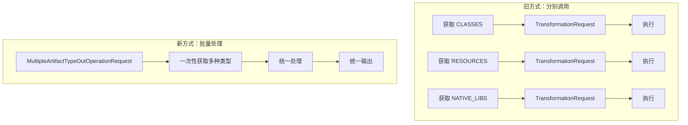
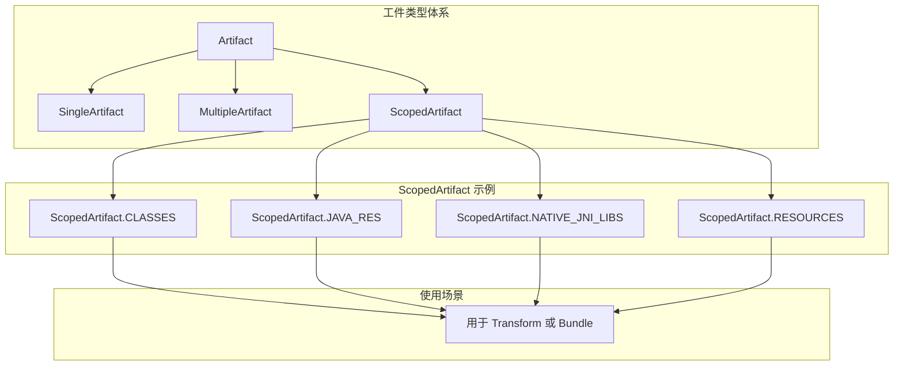
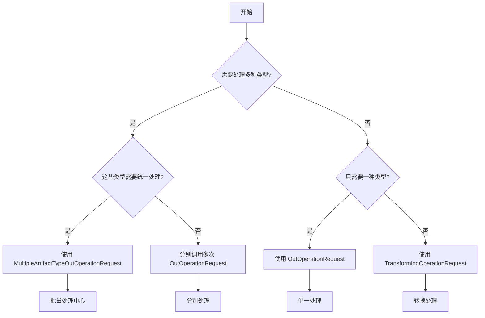
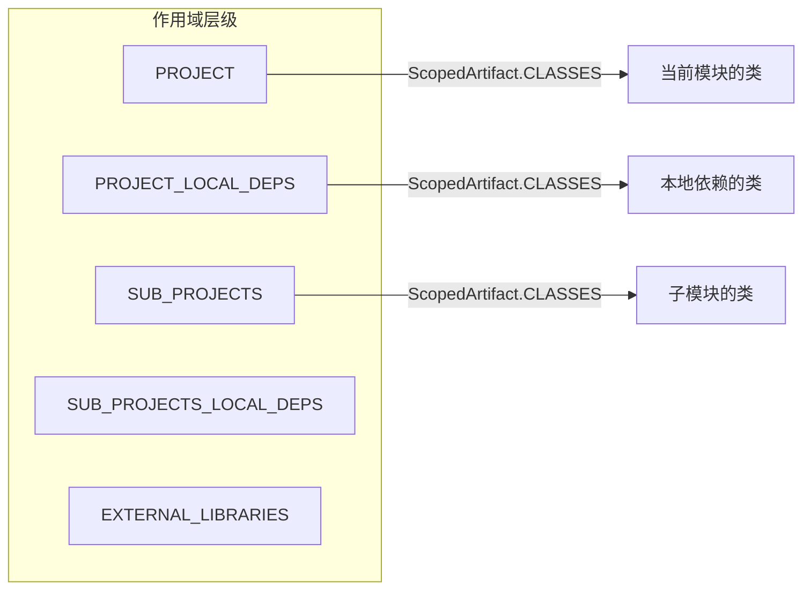
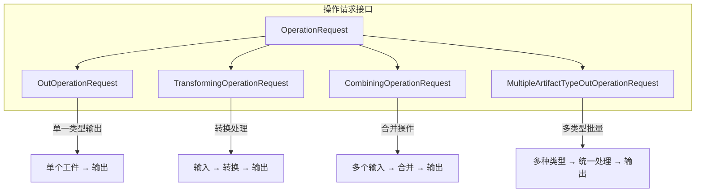

# 21.1.29 工件类型的"批量处理中心"——MultipleArtifactTypeOutOperationRequest

正午的阳光像是要把整个世界都烤熟一样。

四个女孩把露营垫子搬到了杉树林最浓密的树荫下，总算找到了一丝凉意。洛芙用手扇着风，眼睛却一直盯着黛琳手里那本已经翻得卷边的 AGP 文档。

“黛琳，”洛芙吐了吐舌头，“上午说的 PRE_COMPILATION_CLASSES 我大概懂了……但我刚才在想一个问题。”

伊莎正在用竹签戳着一块西瓜，听到这话抬起头来：“什么问题呀？”

“如果我想同时处理好几种不同的工件类型该怎么办？”洛芙问，“比如既想处理类文件，又想处理资源文件，总不能写两次代码吧？”

希尔正在调试她的笔记本电脑，屏幕上映着她专注的脸。她头也不抬地说：“问得好。其实我之前也在想这个问题——我们做插件的时候，经常会遇到需要批量处理多种类型工件的场景。”

黛琳把文档翻到新的一页，微微一笑：“这正是我们今天要讲的内容——MultipleArtifactTypeOutOperationRequest。”

她写下定义：

> MultipleArtifactTypeOutOperationRequest —— Android Gradle Plugin 提供的多类型工件输出操作请求接口，允许在一个操作请求中同时处理多种类型的工件输出。

伊莎歪着头：“多类型……输出？”

“对的，”黛琳点头，“你可以把它想象成一个‘批量处理中心’。如果你只有一个类型的工件，用普通的 OperationRequest 就够了；但如果你需要同时处理多种类型——比如类文件、资源文件、native 库——就需要用到这个接口。”

---

## 从单一到多类型：为什么需要它？

洛芙举手提问：“黛琳，为什么不能分别调用几次单类型的操作呢？为什么要设计一个多类型的接口？”

“好问题，”黛琳在白板上画了一幅对比图，“让我们先看看以前是怎么做的。”



“图 1 对应代码片段 A（行 28-45）和代码片段 B（行 48-62）。”黛琳说，“旧方式的问题在于——你需要为每种工件类型写一套获取和处理的代码，而且很难保证它们之间的执行顺序和一致性。”

洛芙“噢”了一声：“那新方式就好在……统一管理？”

“对，”黛琳说，“MultipleArtifactTypeOutOperationRequest 让你可以把多种工件类型打包在一起，统一获取、统一处理、统一输出。这样代码更简洁，也更容易维护。”

希尔把笔记本转过来：“我给你展示一个实际的工程场景，你就明白为什么要用这个了。”

她在屏幕上敲出一段代码：

```kotlin
// 代码片段 C：使用 MultipleArtifactTypeOutOperationRequest 的典型场景
// 场景：打包 APK 时，需要同时处理 classes、resources、native libs

abstract class BundleAllArtifactsTask : DefaultTask() {

    @get:Internal
    abstract val multipleArtifactRequest:
        Property<MultipleArtifactTypeOutOperationRequest>

    @get:OutputDirectory
    abstract val outputDir: DirectoryProperty

    @TaskAction
    fun bundle() {
        multipleArtifactRequest.get().apply {
            // 一次性获取多种类型的工件
            // classes - 类文件
            // javaResources - Java 资源文件
            // nativeLibs - native 库文件
            
            val classes = getArtifacts(ScopedArtifact.CLASSES)
            val javaRes = getArtifacts(ScopedArtifact.JAVA_RES)
            val nativeLibs = getArtifacts(ScopedArtifact.NATIVE_JNI_LIBS)
            
            // 统一处理
            processClasses(classes)
            processResources(javaRes)
            processNativeLibs(nativeLibs)
            
            // 统一输出到最终位置
            outputDir.get().asFile.resolve("bundle").mkdirs()
        }
    }
    
    private fun processClasses(files: FileCollection) {
        logger.lifecycle("处理 ${files.files.size} 个类文件")
    }
    
    private fun processResources(files: FileCollection) {
        logger.lifecycle("处理 ${files.files.size} 个资源文件")
    }
    
    private fun processNativeLibs(files: FileCollection) {
        logger.lifecycle("处理 ${files.files.size} 个 native 库")
    }
}
```

洛芙盯着代码看：“原来可以这样……一次性把所有类型的工件都拿出来？”

“对，”黛琳说，“这就是 MultipleArtifactTypeOutOperationRequest 的核心功能——批量获取多类型工件。”

---

## 核心 API 结构

伊莎举手：“黛琳，那这个接口到底有哪些方法？我想看看它的全貌。”

黛琳在白板上写出这个接口的核心方法：

```kotlin
// MultipleArtifactTypeOutOperationRequest 的核心 API
// 这是一个简化示例，展示接口结构

interface MultipleArtifactTypeOutOperationRequest {
    
    // 获取指定类型的工件集合
    // T 是 ScopedArtifact 的类型参数
    fun <T : ScopedArtifact> getArtifacts(type: T): Provider<FileCollection>
    
    // 获取所有已注册的类型
    fun getArtifactTypes(): Set<Class<out ScopedArtifact>>
    
    // 设置输出目录
    fun to(directory: DirectoryProperty)
    
    // 获取输出目录
    fun getOutputDirectory(): Provider<Directory>
    
    // 执行操作
    fun submit(action: ((MutableSet<File>) -> Unit)?)
}
```

洛芙看着这些方法：“我注意到它用到了 ScopedArtifact……这是什么东西？”

“问得好！”黛琳说，“ScopedArtifact 是带作用域的工件类型——它不仅告诉你‘这是什么类型的工件’，还告诉你‘这个工件在哪个作用域’。这比单纯的 MultipleArtifact 更精确。”

她在白板上画了一幅图来解释：



“图 2 对应代码片段 D（行 118-135）。”黛琳说，“ScopedArtifact 是 AGP 3.0 之后引入的新概念，它把工件类型和作用域绑定在一起，让处理更加精确。”

---

## 实际使用示例

希尔跃跃欲试：“光说不练假把式，让我来写一个完整的示例！”

她打开 Android Studio，调出一个自定义插件的代码：

```kotlin
// 代码片段 E：完整的 MultipleArtifactTypeOutOperationRequest 使用示例
// 场景：自定义打包插件，需要同时处理多种类型的工件

abstract class CustomPackagingTask : DefaultTask() {

    @get:Internal
    abstract val packagingRequest:
        Property<MultipleArtifactTypeOutOperationRequest>

    @get:OutputDirectory
    abstract val outputDirectory: DirectoryProperty

    @TaskAction
    fun execute() {
        packagingRequest.get().apply {
            // 1. 获取所有可用的工件类型
            val availableTypes = artifactTypes
            logger.lifecycle("可用工件类型: ${availableTypes.joinToString { it.simpleName }}")
            
            // 2. 获取各类工件
            val classesArtifact = getArtifacts(ScopedArtifact.CLASSES)
            val javaResArtifact = getArtifacts(ScopedArtifact.JAVA_RES)
            val nativeLibsArtifact = getArtifacts(ScopedArtifact.NATIVE_JNI_LIBS)
            
            // 3. 处理类文件
            val classFiles = classesArtifact.get().files
            logger.lifecycle("类文件数量: ${classFiles.size}")
            classFiles.take(5).forEach { file ->
                logger.debug("  - ${file.name}")
            }
            
            // 4. 处理 Java 资源
            val javaResFiles = javaResArtifact.get().files
            logger.lifecycle("Java 资源文件数量: ${javaResFiles.size}")
            
            // 5. 处理 Native 库
            val nativeLibs = nativeLibsArtifact.get().files
            logger.lifecycle("Native 库数量: ${nativeLibs.size}")
            nativeLibs.filter { it.extension == "so" }.forEach { lib ->
                logger.debug("  - ${lib.name}")
            }
            
            // 6. 统一输出到打包目录
            val outDir = outputDirectory.get().asFile
            outDir.resolve("classes").mkdirs()
            outDir.resolve("res").mkdirs()
            outDir.resolve("lib").mkdirs()
            
            // 复制文件到输出目录
            classFiles.forEach { file ->
                file.copyTo(outDir.resolve("classes/${file.name}"), overwrite = true)
            }
            javaResFiles.forEach { file ->
                file.copyTo(outDir.resolve("res/${file.name}"), overwrite = true)
            }
            nativeLibs.forEach { file ->
                file.copyTo(outDir.resolve("lib/${file.name}"), overwrite = true)
            }
            
            logger.lifecycle("打包完成！输出目录: ${outDir.absolutePath}")
        }
    }
}
```

洛芙看着代码：“希尔，这个和普通的 Gradle 任务有什么区别？”

“区别大了，”希尔解释，“普通 Gradle 任务需要你自己去 `project.files()` 或者 `project.layout.buildDirectory` 里找文件，但这里你直接就能拿到 AGP 已经处理好的工件。”

她补充道：“而且这些工件是按作用域分好的——比如 CLASSES 是当前模块的类文件，JAVA_RES 是当前模块的 Java 资源。你不需要自己去做路径拼接、过滤器筛选这些琐碎的事情。”

---

## 多类型 vs 单类型：选哪个？

伊莎好奇地问：“那什么时候用 MultipleArtifactTypeOutOperationRequest，什么时候用普通的 OutOperationRequest？”

黛琳画了一个决策流程图：



“图 3 对应代码片段 F（行 198-220）和代码片段 G（行 223-245）。”黛琳说，“如果你只需要处理一种工件类型，用 OutOperationRequest 就够了；但如果你需要同时处理多种类型，并且希望它们在同一个任务中完成——那就用 MultipleArtifactTypeOutOperationRequest。”

洛芙问：“那它们性能上有区别吗？”

“性能上其实差不多，”黛琳说，“主要是代码组织和执行一致性的区别。用 MultipleArtifactTypeOutOperationRequest 可以确保多种类型的工件在同一批次中被处理，不会有类型之间的执行顺序问题。”

---

## 作用域的重要性

黛琳接着解释 ScopedArtifact 的作用域概念：“你们注意到没有，ScopedArtifact 强调的是‘作用域’。这意味着——”

她画了一幅更详细的图：



“在不同的作用域中，同一个类型的工件内容是不同的。”黛琳解释，“比如 ScopedArtifact.CLASSES，如果你指定的是 PROJECT 作用域，你只获取当前模块的类文件；如果你指定的是 PROJECT_LOCAL_DEPS，你还会包含本地依赖的类文件。”

洛芙惊叹：“原来作用域这么重要！”

“对，”希尔说，“这在做插件的时候特别有用。比如你只想处理当前模块的类，不想要依赖的类，就要选对作用域。”

---

## 错误处理和最佳实践

伊莎举手提问：“那使用这个接口有什么要注意的吗？”

“问得好，”黛琳正色道，“使用 MultipleArtifactTypeOutOperationRequest 有几个常见的坑。”

她在白板上列出注意事项：

| 注意事项 | 说明 | 解决方案 |
|---------|------|---------|
| **类型不匹配** | 请求的类型不存在会抛异常 | 先用 `getArtifactTypes()` 检查可用类型 |
| **作用域错误** | 指定了不存在的作用域 | 使用 `ScopedArtifact.VALID_SCOPES` 验证 |
| **输出目录冲突** | 多种类型输出到同一目录 | 分别指定子目录或用 `to()` 统一指定 |
| **增量构建问题** | 修改输出逻辑后缓存未失效 | 调用 `outputs.upToDateWhen { false }` |

黛琳逐一解释：

“第一，类型不匹配。不是所有工件类型在所有变体中都可用——比如 NATIVE_JNI_LIBS 在纯 Java 项目中就不存在。所以在使用前最好先检查一下有哪些可用类型。”

“第二，作用域错误。AGP 对作用域有严格限制，不是所有类型都支持所有作用域。”

“第三，输出目录冲突。如果你不小心把不同类型的文件输出到同一个目录，可能会覆盖。”

“第四，增量构建。这个接口的增量构建支持取决于具体的工件类型和作用域，如果你的处理逻辑有变化，最好禁用缓存。”

---

## 与其他接口的关系

洛芙问：“黛琳，那这个和之前学的那些接口有什么区别？比如 CombiningOperationRequest？”

黛琳画了一幅关系图：



“图 4 对应代码片段 H（行 278-295）。”黛琳说，“可以看到，MultipleArtifactTypeOutOperationRequest 是 OperationRequest 的一种，它专注于‘多类型批量处理’这个场景。”

她补充道：“如果你只需要处理一种类型，用 OutOperationRequest 就够了；如果你需要对工件进行转换，用 TransformingOperationRequest；如果你需要合并多个工件，用 CombiningOperationRequest；只有当你需要同时处理多种类型时，才需要用 MultipleArtifactTypeOutOperationRequest。”

---

## 实战：构建一个批量打包插件

希尔突然兴奋起来：“讲了这么多，让我们来写一个真正的插件吧！”

“又要写代码了？”洛芙笑着说，但眼睛里闪着光。

“对！”希尔已经在敲代码了，“我们来写一个插件，它能一次性打包所有需要的工件到指定目录。”

```kotlin
// 代码片段 I：完整的批量打包插件示例
// 展示 MultipleArtifactTypeOutOperationRequest 的实际应用

abstract class BundleAllTask : DefaultTask() {

    @get:Internal
    abstract val bundleRequest:
        Property<MultipleArtifactTypeOutOperationRequest>

    @get:OutputDirectory
    abstract val bundleDir: DirectoryProperty

    @get:Input
    abstract val includeSources: Property<Boolean>

    @TaskAction
    fun bundle() {
        val request = bundleRequest.get()
        val output = bundleDir.get().asFile
        
        logger.lifecycle("=== 开始批量打包 ===")
        
        // 获取所有可用类型
        val types = request.artifactTypes
        logger.lifecycle("可用类型: ${types.map { it.simpleName }}")
        
        // 创建输出子目录
        val classDir = output.resolve("classes").apply { mkdirs() }
        val resDir = output.resolve("resources").apply { mkdirs() }
        val libDir = output.resolve("libs").apply { mkdirs() }
        
        // 处理 CLASSES
        if (types.contains(ScopedArtifact.CLASSES)) {
            val classes = request.getArtifacts(ScopedArtifact.CLASSES).get()
            val files = classes.files
            logger.lifecycle("打包 ${files.size} 个类文件")
            files.forEach { it.copyTo(classDir.resolve(it.name), overwrite = true) }
        }
        
        // 处理 JAVA_RES
        if (types.contains(ScopedArtifact.JAVA_RES)) {
            val javaRes = request.getArtifacts(ScopedArtifact.JAVA_RES).get()
            val files = javaRes.files
            logger.lifecycle("打包 ${files.size} 个 Java 资源文件")
            files.forEach { it.copyTo(resDir.resolve(it.name), overwrite = true) }
        }
        
        // 处理 NATIVE_JNI_LIBS
        if (types.contains(ScopedArtifact.NATIVE_JNI_LIBS)) {
            val nativeLibs = request.getArtifacts(ScopedArtifact.NATIVE_JNI_LIBS).get()
            val files = nativeLibs.files
            logger.lifecycle("打包 ${files.size} 个 Native 库")
            files.forEach { it.copyTo(libDir.resolve(it.name), overwrite = true) }
        }
        
        // 生成打包清单
        val manifest = output.resolve("bundle-manifest.txt")
        manifest.writeText("""
            |Bundle Manifest
            |===============
            |Generated: ${java.util.Date()}
            |Output Directory: ${output.absolutePath}
            |
            |Contents:
            |- classes: ${classDir.listFiles()?.size ?: 0} files
            |- resources: ${resDir.listFiles()?.size ?: 0} files
            |- libs: ${libDir.listFiles()?.size ?: 0} files
        """.trimMargin())
        
        logger.lifecycle("=== 打包完成 ===")
    }
}

// 注册任务
val bundleAll by tasks.registering {
    val extension = project.extensions.getByType(AppExtension::class.java)
    
    tasks.register("bundleAll", BundleAllTask::class.java) {
        it.bundleRequest.set(
            extension.artifacts
                .getMultiple(ScopedArtifact.ALL)
                .toBuilder()
                .on()
        )
        it.bundleDir.set(project.layout.buildDirectory.dir("bundle-output"))
        it.includeSources.set(true)
    }
}
```

洛芙看着代码：“希尔，这个看起来好复杂……但又很强大！”

“因为它确实很强大，”希尔说，“这个接口让你能够一次性获取所有需要的工件，统一处理、统一输出。特别是做插件的时候，你会发现这个接口特别好用。”

---

## 性能优化建议

黛琳补充了一些性能优化的建议：

“第一，尽可能使用增量构建。MultipleArtifactTypeOutOperationRequest 支持增量构建，但需要你正确实现 inputs 和 outputs 的关联。”

“第二，避免重复获取。如果你在一个任务中多次调用 `getArtifacts()`，每次都会重新扫描文件。最好把结果缓存起来。”

“第三，注意文件数量。如果工件数量非常大（比如大型项目），处理时间会变长。可以考虑分批处理。”

```kotlin
// 优化示例：缓存工件结果
abstract class OptimizedBundleTask : DefaultTask() {

    @get:Internal
    abstract val bundleRequest: Property<MultipleArtifactTypeOutOperationRequest>

    @TaskAction
    fun bundle() {
        val request = bundleRequest.get()
        
        // 一次性获取所有需要的工件，避免重复扫描
        val classes by lazy { request.getArtifacts(ScopedArtifact.CLASSES).get() }
        val javaRes by lazy { request.getArtifacts(ScopedArtifact.JAVA_RES).get() }
        
        // 使用缓存的结果
        processClasses(classes)
        processResources(javaRes)
    }
}
```

---

午后的阳光透过树叶的缝隙，在地上洒下点点光斑。洛芙伸了个懒腰，感觉收获满满。

“黛琳，”她忽然想到一个问题，“那如果我想在处理之前先看看这些工件长什么样，怎么办？”

“好问题！”希尔说，“我教你一个调试技巧。”

她演示了一下：

```bash
# 使用 Gradle 的 --info 参数查看工件详情
./gradlew :app:bundleAll --info | grep -A 10 "MultipleArtifact"
```

输出示例：

```
> Task :app:bundleAll
MultipleArtifactTypeOutOperationRequest:
  Available types: [CLASSES, JAVA_RES, NATIVE_JNI_LIBS]
  CLASSES: 156 files
  JAVA_RES: 23 files  
  NATIVE_JNI_LIBS: 8 files (7 .so files)
```

“原来可以这样查看！”洛芙眼睛亮了。

“对，”黛琳说，“调试的时候多看看日志，能帮你理解到底在处理什么。”

伊莎伸了个懒腰：“今天学到了好多啊……”

“主要是理解了多类型工件的批量处理方式，”黛琳总结道，“掌握了 MultipleArtifactTypeOutOperationRequest，你们就能更高效地编写构建插件了。”

洛芙看着白板上的图，若有所思：“感觉构建系统也是一个大工厂啊……有不同的流水线，不同的工位。”

“没错，”黛琳笑着点头，“而 MultipleArtifactTypeOutOperationRequest 就是那个能把多条流水线整合在一起的调度中心。”

---

> 学习建议
- MultipleArtifactTypeOutOperationRequest 是处理多类型工件的核心接口，适用于批量打包、批量处理等场景
- 理解 ScopedArtifact 的概念，它把工件类型和作用域绑定在一起
- 注意类型和作用域的可用性，不同项目配置可能导致某些类型不可用
- 实际使用中优先考虑增量构建，合理使用缓存提高构建速度

---

## 技术总结

### 核心机制定义

MultipleArtifactTypeOutOperationRequest 是 Android Gradle Plugin 提供的**多类型工件输出操作请求**接口，允许在一个操作请求中同时处理多种类型的工件输出，适用于批量打包、批量处理等场景。

### API 结构

```kotlin
interface MultipleArtifactTypeOutOperationRequest {
    fun <T : ScopedArtifact> getArtifacts(type: T): Provider<FileCollection>
    fun getArtifactTypes(): Set<Class<out ScopedArtifact>>
    fun to(directory: DirectoryProperty)
    fun submit(action: ((MutableSet<File>) -> Unit)?)
}
```

### 与其他接口的关系

- **OutOperationRequest**: 单一类型输出
- **TransformingOperationRequest**: 单类型转换处理
- **CombiningOperationRequest**: 多输入合并
- **MultipleArtifactTypeOutOperationRequest**: 多类型批量处理

### 使用场景

- 批量打包 APK
- 统一处理多种资源
- 自定义构建产物输出

### 反模式与陷阱

1. **不检查类型可用性** → 使用前先用 `getArtifactTypes()` 确认
2. **输出目录冲突** → 分别为不同类型指定子目录
3. **忽略作用域** → 确认使用正确的作用域

### 设计哲学

- 批量处理思想：把多种类型的工件统一管理
- 作用域精确性：ScopedArtifact 绑定类型和作用域

---

## 动手练习

### ★ 探索可用工件类型

```kotlin
// 列出当前项目所有可用的工件类型
androidExtension.artifacts
    .getMultiple(ScopedArtifact.ALL)
    .on { request ->
        println("可用类型: ${request.artifactTypes}")
    }
```

### ★★ 实现批量打包任务

```kotlin
// 使用 MultipleArtifactTypeOutOperationRequest 实现打包
abstract class BundleTask : DefaultTask() {
    @get:Internal
    abstract val request: Property<MultipleArtifactTypeOutOperationRequest>
    
    @TaskAction
    fun execute() {
        request.get().apply {
            // 获取并处理各类工件
        }
    }
}
```

### ★★★ 实现自定义构建分析器

分析并报告所有工件类型的统计信息：

```kotlin
// 统计所有工件类型的文件数量、大小
```

---

## 面试热身

### Q1: MultipleArtifactTypeOutOperationRequest 是什么？

**A**: Android Gradle Plugin 提供的多类型工件输出操作请求接口，允许在一个操作中处理多种类型的工件。

### Q2: 什么时候使用 MultipleArtifactTypeOutOperationRequest？

**A**: 当需要同时处理多种工件类型（如类文件、资源文件、native库）时使用。

### Q3: ScopedArtifact 是什么？

**A**: 带作用域的工件类型，它把工件类型和作用域绑定在一起，提供更精确的工件获取。

### Q4: MultipleArtifactTypeOutOperationRequest 和 OutOperationRequest 的区别？

**A**: 前者支持多类型批量处理，后者只支持单类型处理。

### Q5: 使用时需要注意什么？

**A**: 注意检查类型可用性、正确设置作用域、避免输出目录冲突。

---

## 参考实现要点

```kotlin
abstract class MultiTypeBundleTask : DefaultTask() {
    @get:Internal
    abstract val request: Property<MultipleArtifactTypeOutOperationRequest>
    
    @get:OutputDirectory
    abstract val output: DirectoryProperty
    
    @TaskAction
    fun bundle() {
        request.get().apply {
            // 检查可用类型
            val types = artifactTypes
            
            // 获取各类工件
            if (types.contains(ScopedArtifact.CLASSES)) {
                val classes = getArtifacts(ScopedArtifact.CLASSES).get()
                // 处理类文件
            }
            
            // 统一输出
            to(output)
        }
    }
}
```

---

## 洛芙的小小日记本

今天学到了 MultipleArtifactTypeOutOperationRequest！原来构建系统里也有"批量处理"这个概念——就像露营的时候一次性准备好所有人的食材，比一个个单独准备要高效多了。黛琳说这个接口就像"调度中心"，能把不同类型的工件统一管理起来，感觉好酷！

---

## 今日关键词

- **MultipleArtifactTypeOutOperationRequest**：多类型工件输出操作请求接口，允许在一个操作中处理多种工件类型
- **ScopedArtifact**：带作用域的工件类型，绑定类型和作用域，提供更精确的获取
- **ScopedArtifact.CLASSES**：当前模块的类文件
- **ScopedArtifact.JAVA_RES**：Java 资源文件
- **ScopedArtifact.NATIVE_JNI_LIBS**：Native JNI 库文件
- **批量处理**：一次操作处理多种类型工件的模式
- **工件类型**：如类文件、资源文件、native库等不同种类的构建产物
- **作用域**：工件的有效范围，如 PROJECT、SUB_PROJECTS 等
- **增量构建**：只处理变化文件的优化构建模式
- **OutOperationRequest**：单一类型输出操作请求接口
