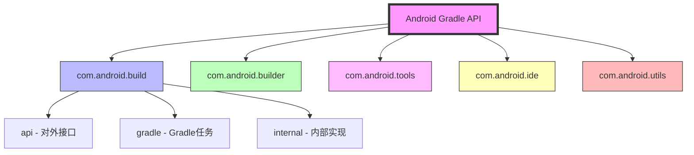
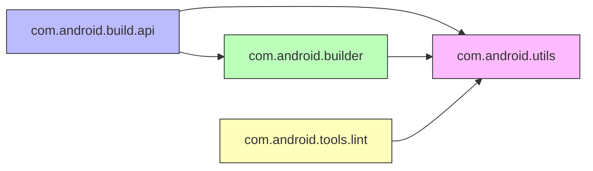
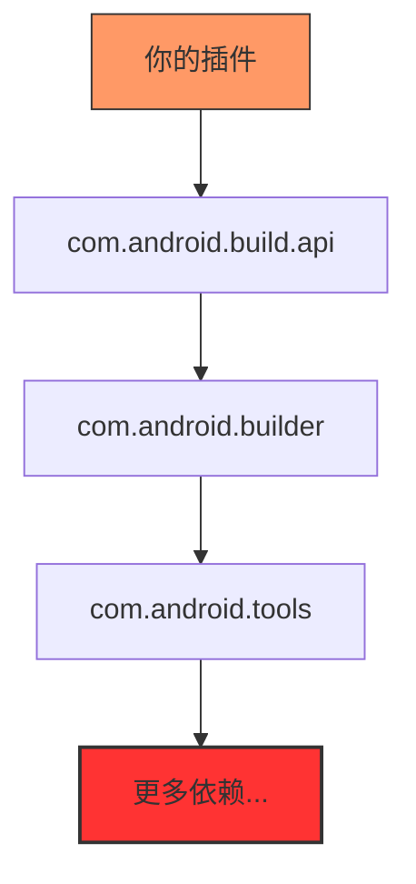
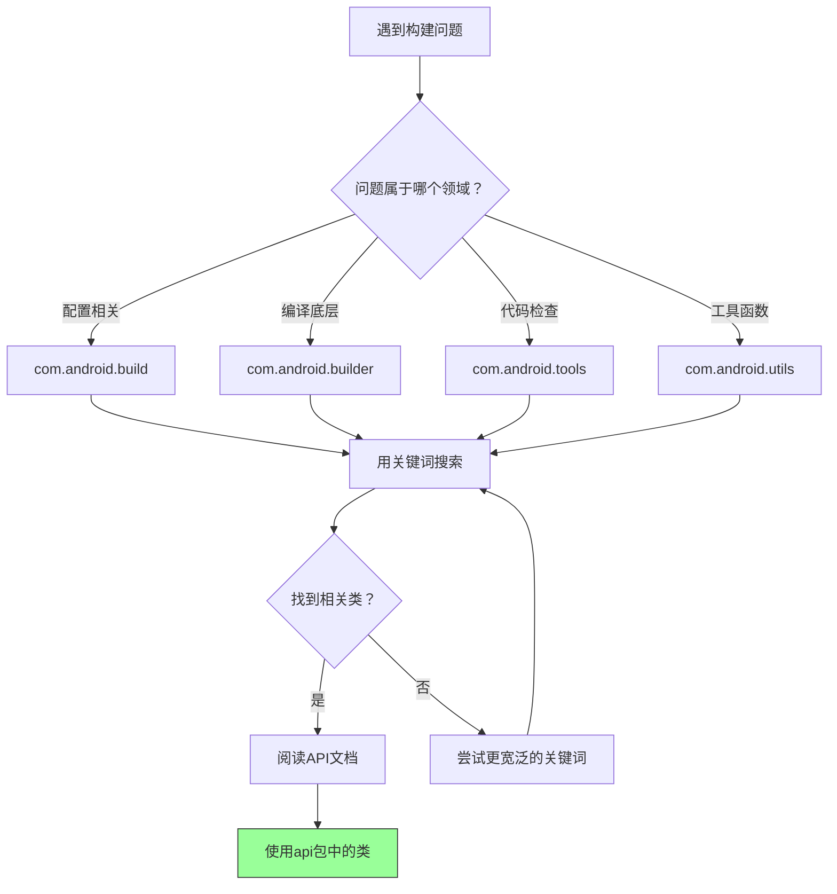
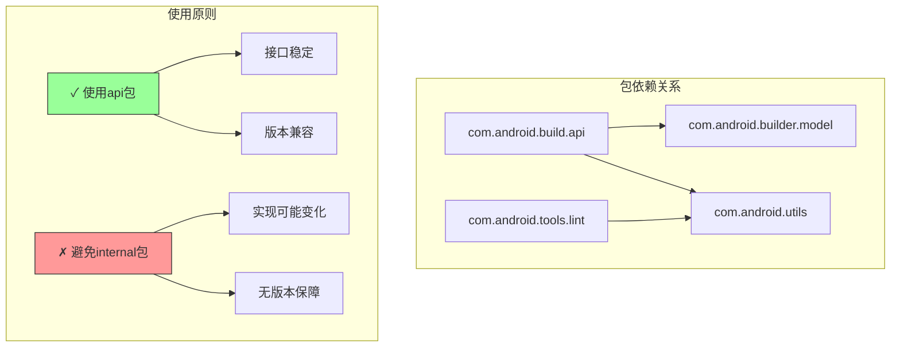

# 21.1.3 包装索引

午后的阳光把帐篷晒得暖烘烘的，洛芙整个人都懒洋洋地靠在充气垫上，手里摆弄着一根草茎。

“洛芙，发什么呆呢？”希尔从背包里翻出一盒饼干，包装纸发出“沙沙”的声音。

“在想昨天黛琳说的那些类，”洛芙翻了个身，把草茎含在嘴里，“几千个类……就算知道怎么找，也还是太多了啊。”

“那是因为你还没有掌握正确的姿势，”黛琳的声音从旁边传来，她正坐在一棵老松树下，树荫筛下来的光斑在她膝盖上的笔记本电脑上跳动，“今天要学的，就是来解决这个问题的。”

“今天学什么？”伊莎凑过来，手里还端着一杯刚冲好的热可可，蒸汽袅袅升起。

“Package Index——包装索引，”黛琳把电脑屏幕转过来给大家看，“如果说Class Index是图书馆的书目卡片，那Package Index就是图书馆的书架标签——它告诉我们，哪些类属于同一个‘部门’，哪些功能是配套的。”

洛芙一下子来了精神：“就是帮我们把那些几千个类分门别类的东西？”

“没错，”黛琳点点头，嘴角浮起一丝笑意，“学会了这个，你就不必再几千个类里大海捞针了。”


## 书架的魔法：什么是包装索引

伊莎歪着头看屏幕：“包装索引……是像我们的露营装备分类一样的东西吗？”

“太恰当了！”黛琳打了个响指，“想象一下，如果我们的露营装备不分类——帐篷、炊具、食物、药品全部堆在一起，找东西的时候有多麻烦？”

“那得翻个底朝天，”希尔夸张地做了一个翻包的动作，“上次我找急救包，结果翻出了三包饼干。”

“Gradle API也是一样的道理，”黛琳笑着说，“几千个类如果不分组，根本没法用。Package Index就是那套分类系统——它把所有相关的类归到同一个‘包’里，就像把帐篷归到‘住宿’区、炊具归到‘餐饮’区一样。”

洛芙看向屏幕，上面显示着一长串的包名：

- com.android.build.api
- com.android.build.gradle
- com.android.build.internal
- com.android.builder
- com.android.tools
- com.android.utils
- com.android.ide
- ...

“好多包啊……”洛芙感叹道，“这些包都有什么区别？”

“这就问对了，”黛琳把笔记本放在地上，站起身来，“今天我们不仅要认识这些包，还要学会怎么利用它们来快速找到想要的类。”


## 四大部落的秘密

黛琳又搬出了那块白色折叠板，在树荫下支好：“在说具体的包之前，我想先给你讲讲整体的分类逻辑。”

她拿起白板笔，在板面上画了一个大大的同心圆：



“整个Gradle API可以分成几个大部落，”黛琳解释道，“每个部落负责不同的领域。”

### com.android.build：最常用的那一群

“第一个、也是最重要的部落，是com.android.build，”黛琳用笔尖点了点最中间的那个圆，“这个包里的类，是我们开发者在日常工作中最常打交道的。”

“就是昨天说的那些？”洛芙问。

“对昨天的延续，”黛琳点头，“但今天的重点是——这个大包下面还有小分支。”

她在白板上写下：

```
com.android.build
├── api          # 对外暴露的接口
├── gradle       # Gradle特有的任务和扩展
├── internal     # 内部实现细节
└── res          # 资源相关
```

“build包就像一个大商场，”伊莎轻声说，“api是迎宾门，gradle是各个专卖店，internal是仓库？”

“伊莎的比喻永远这么精准，”黛琳笑道，“对，api是我们能用的‘门面’，gradle是具体做事的‘店员’，internal是‘仓库管理员’——虽然存在，但我们一般不直接去打扰。”

希尔操作性很强，立刻补充道：“我之前查过哈，api包里的类都是经过精心设计的，接口稳定，不会在插件升级时突然失效。internal包里的类可就不一定了，今天能用明天可能就变了。”

“所以我们应该尽量用api包里的类？”洛芙问。

“没错，”黛琳肯定地说，“这是第一条铁律——优先使用api包，避开internal包。”

### com.android.builder：背后的功臣

“接下来是com.android.builder，”黛琳把笔尖移到第二个圆上，“如果说build是‘前台’，那builder就是‘后台’。”

“昨天提到过的！”洛芙举手，“搬砖盖楼的人！”

“对的，”黛琳点头，“这个包里的类负责最底层的编译工作：Java字节码处理、DEX生成、资源打包……都是在这里完成的。”

她翻开笔记本，找到之前记的笔记：“虽然我们一般不直接调用builder包的类，但了解它能帮我们理解构建过程的本质。比如，当你遇到奇怪的编译错误时，去builder包的相关类里搜一搜，往往能找到线索。”

希尔补充道：“我上次被一个混淆问题困扰了很久，最后发现是builder包里的一个类在搞鬼——当然，不是直接调用它，而是看它的日志输出发现的线索。”

### com.android.tools：百宝箱

“百宝箱来了，”黛琳的表情变得轻快，“com.android.tools是这个系统里的‘工具箱’，里面装满了各种好用的辅助工具。”

她如数家珍地列出：

- **lint** —— 代码质量检查器，帮我们挑错别字、找出潜在bug
- **sdk** —— SDK管理相关
- **analytics** —— 构建数据分析
- **perf** —— 性能分析工具

“就像我们露营时的瑞士军刀，”伊莎托着腮帮子说，“不大，但关键时刻什么都能开。”

“对！”黛琳打了个响指，“lint就是最常用的那把刀——每次构建时它都会默默检查我们的代码，虽然有时候它的警告有点啰嗦，但真的能帮我们避免很多坑。”

洛芙想起之前被lint支配的恐惧：“那个lint真的超级严格，我有一次因为一个变量名拼错了，被它念叨了整整三页！”

“严格是好事，”黛琳笑着说，“等你以后维护上万行的项目时，就会感激lint了。”

### com.android.ide和com.android.utils：还有两兄弟

“还有两个小兄弟，”黛琳在白板上补上另外两个包：

- **com.android.ide** —— Android Studio IDE相关的API
- **com.android.utils** —— 零散的utility函数

“ide包主要是IDE集成用的，比如自定义lint检查器、模板生成器之类的，”黛琳解释道，“普通开发者很少直接用到，但它支撑着Android Studio的很多功能。”

“util包就像……垃圾袋？”希尔突发奇想，“什么零散的东西都能往里装？”

“也可以这么说，”黛琳被逗笑了，“字符串处理、文件操作、并行计算……各种小工具都在这里。虽然不起眼，但用到的时候特别方便。”


## 实战演练：用包索引找答案

“光说不练假把式，”黛琳把电脑拿回来，“现在我们来玩一个游戏——假设我有一个具体需求，你们能用包索引帮我找到对应的类吗？”

“什么需求？”洛芙跃跃欲试。

“需求一：我想在构建完成后，自动把APK复制到指定的文件夹。”

洛芙想了想：“这应该是……build相关？”

“对，在build包的gradle子包里，”黛琳引导道，“想一想，复制文件属于什么操作？”

“task！”希尔反应最快，“构建过程中的task！”

“没错，”黛琳打开搜索框，输入"copy"：

屏幕上瞬间过滤出了相关的类：

- CopyTask
- SyncCopyTask
- ...

“找到了！”洛芙兴奋地说，“CopyTask！就是它！”

“很好，”黛琳点头，“现在需求二：我想在构建时检测代码中是否有性能问题。”

洛芙已经有思路了：“tools包！lint！”

“对，”黛琳输入"lint"：

- Lint
- LintAnalyzeOptions
- LintCheckForTest
- ...

“原来lint也有这么多相关的类！”洛芙感叹道。

“这就是包索引的威力，”黛琳总结道，“先确定是哪个‘部门’的问题，再去那个部门里找对应的类——而不是在几千个类里盲目搜索。”


## 包的结构：点与层次

伊莎盯着屏幕看了一会儿：“黛琳，我发现这些包名都是有规律的……”

“对，就是你看到的点分隔符，”黛琳指着包名说，“com.android.build.api这个全名，可以拆成三部分：”

```
com.android  |  build  |  api
   ^            ^        ^
   |            |        |
  公司/组织     模块     子模块
```

“第一部分是命名空间，通常是公司或组织的域名反转，”黛琳解释道，“android.com反转就是com.android。”

“那build就是模块？”洛芙问。

“对，一个大模块，”黛琳点头，“api就是build模块里的一个子模块。这样设计的好处是——当你看到完整的包名时，你就能大概猜到这个类是做什么的。”

希尔补充道：“而且这种层级结构也方便管理。你看android {}闭包里的android.buildFeatures {}，对应的包就是com.android.build.api.BuildFeatures——包名和代码里的调用链是对应的。”


## 包与包之间的依赖关系

“说了这么多单个包，”黛琳的表情变得认真起来，“现在我要讲一个很重要但很多人忽视的问题——包与包之间的依赖关系。”

她在白板上画了一幅图：



“注意箭头的方向，”黛琳强调，“api包依赖builder包，但builder包不能依赖api包——因为api是‘门面’，builder是‘后台’，后台不能依赖前台。”

“为什么？”洛芙不解。

“这是架构设计的基本原则——依赖方向必须是从具体到抽象、从低层到高层，”黛琳解释道，“如果builder依赖api，那api改动时就会影响builder，这是不合理的。”

伊莎若有所思：“就像……厨房不能依赖餐厅？厨房做菜，餐厅吃饭，厨房不能因为餐厅的菜单变了就罢工？”

“太精准了！”黛琳赞叹道，“这就是依赖反转的原则——高层模块依赖低层模块的抽象，而不是具体实现。”


## 常见问题：包级别的坑

“接下来我们讲几个常见的坑，”黛琳的语气变得严肃，“这些都是初学者很容易踩的雷区。”

### 坑一：分不清api和internal

“第一个坑，也是最大的坑——用错了包，”黛琳郑重地说，“很多初学者为了省事，会直接使用internal包里的类。”

“有什么问题吗？”洛芙问。

“问题大了，”希尔接过话头，“我之前就是，吃过大亏。internal包里的类随时可能变——今天还好好能用的方法，明天插件一升级就没了，连个报错都没有，就是不生效。”

“所以要坚决用api包？”洛芙问。

“对，”黛琳点头，“这是血泪教训——只使用api包里的类，internal包里的东西，再好用也不要碰。”

### 坑二：忽略包的版本

“第二个坑是忽略包的版本，”黛琳继续说，“不同版本的Gradle插件，包的结构可能不一样。”

她在电脑上打开版本说明页面：“看，AGP 8.0和8.1的包结构就有差异。有些类在8.0里是api包，到了8.1可能就挪到internal去了。”

“那怎么办？”洛芙问。

“查文档，”黛琳说，“官方文档会标注每个类属于哪个包、哪个版本可用。养成查文档的习惯，比什么都强。”

### 坑三：依赖爆炸

“第三个坑是依赖爆炸，”黛琳的表情更加严肃，“有时候你会发现，只是引入了一个小功能，结果依赖了一堆包。”

她在白板上画了一个警示图：



“依赖越多，构建越慢，出问题的概率也越大，”黛琳强调，“所以，能用简单方式解决的，就不要引入复杂的库。”


## 导航的艺术

“说了这么多，”希尔活动了一下手指，“我们来实战一下——假设我现在遇到了一个具体问题，我该怎么用包索引来找到解决方案？”

“什么问题？”伊莎好奇地问。

“比如——我想自定义一个构建流程，在编译Java代码之前先做一次处理，”希尔说，“我该找哪个类？”

洛芙按照刚才学的思路分析：“编译Java代码……应该是builder包里的？”

“对，但不完整，”黛琳引导道，“想一想，‘在编译之前先做处理’——这在Gradle里叫什么？”

“Task！”希尔反应过来了，“前置Task！”

“对了，”黛琳在搜索框输入"Transform"：

屏幕上出现了：

- Transform
- TransformTask
- ...

“找到了！”希尔激动地说，“Transform！就是它！”

“Transform就是用来在编译过程中插入自定义处理的，”黛琳解释道，“它属于com.android.build.api包，是专门给我们用来扩展构建流程的。”

“原来如此！”洛芙恍然大悟，“先用包名确定大方向，再用关键词搜索具体类——这就是包索引的正确用法！”


## 包索引的实际应用

傍晚的阳光变得柔和，金色的余晖在树叶间跳动。

“最后，我们来总结一下包索引在实际开发中的用法，”黛琳把白板擦干净，开始画最后一幅图：



“这就是一个标准的问题解决流程，”黛琳总结道：

1. **先定性**：确定问题属于哪个领域
2. **再搜索**：用关键词在对应的包里搜索
3. **看文档**：找到类后，仔细阅读API文档
4. **用api包**：只使用api包里的类，避免internal包

伊莎轻声感叹：“感觉像……有了一张藏宝地图？”

“对，就是藏宝地图，”黛琳微笑着说，“有了这张地图，你就不必在几千个类里盲目探索了。”


## 小结：包装索引的心法

夜幕降临，星星开始一颗一颗地冒出来。

“今天的内容差不多了，”黛琳收起白板，“最后总结一下今天学的重点：”

1. **包装索引是分类系统**——把几千个类分门别类，方便查找
2. **四大包各司其职**——build是前台，builder是后台，tools是工具箱，utils是零散工具
3. **层级命名有规律**——com.android.模块.子模块，见名知意
4. **依赖有方向**——只能从高层依赖低层，不能反向
5. **只用api包**——internal包再好用也不碰，避免版本陷阱
6. **搜索是核心技能**——先定领域，再搜关键词，最后看文档

洛芙看着笔记本上密密麻麻的笔记：“原来找类也有这么多门道……”

“等你熟练了就好了，”希尔拍拍她的肩膀，“我刚开始也是晕头转向的，现在嘛——基本一眼就能找到该用哪个类。”

“希尔说的对，”伊莎温柔地说，“这就像认路一样，走多了就熟了。”

远处传来蟋蟀的鸣叫声，夜色越来越浓了。


---

## 核心机制定义

### 包装索引（Package Index）
Android Gradle插件API的包级别组织结构，将相关功能的类归入同一个命名空间（package），方便开发者按功能领域查找和使用API。

### 核心包结构
- **com.android.build**：Gradle插件的主要API包，包含对外暴露的接口和配置类，是日常开发最常用的包
- **com.android.builder**：构建引擎的核心包，处理底层编译、DEX生成、资源打包等底层工作
- **com.android.tools**：工具包，包含lint代码检查、SDK管理、性能分析等辅助工具
- **com.android.utils**：工具函数包，提供各种零散的辅助方法
- **com.android.ide**：IDE集成相关的API，支撑Android Studio的部分功能

### 包层级命名规范
```
com.android.<组织反转域名>
  └── <模块名>
      └── <子模块>
```
例如：`com.android.build.api` 表示Android构建模块的API子模块

### api包 vs internal包
- **api包**：经过精心设计的公开接口，接口稳定，版本兼容性好，应该优先使用
- **internal包**：内部实现细节，随时可能变化，不建议直接使用



## 反模式与陷阱

### 1. 使用internal包的类
很多初学者为了省事直接使用internal包里的类，认为“能用就行”。**危害**：internal包随时可能在插件升级时变化，导致构建突然失败。**正确做法**：坚持使用api包，寻找功能等效的公开API。

### 2. 忽略版本差异
不同版本的AGP包结构可能不同，在AGP 8.0能用的类到了8.1可能就变了。**正确做法**：查阅对应版本的官方文档，确认类和API的可用性。

### 3. 依赖层级混乱
引入过多不必要的依赖，导致构建速度变慢、包体积变大。**正确做法**：按需引入，只使用必要的API。

### 4. 盲目搜索所有包
在几千个类里盲目搜索关键词，而不是先确定问题属于哪个包。**正确做法**：先定性（配置问题？编译问题？检查问题？），再到对应的包里搜索。

### 5. 不理解依赖方向
错误地认为可以随意依赖任何包，导致架构混乱。**正确做法**：遵循依赖原则——高层模块依赖低层模块的抽象，依赖方向不能反向。

## 设计哲学

### 1. 命名空间隔离
通过包名层级实现命名空间隔离，不同功能领域的类分属不同包，避免命名冲突。例如：build包下的类不会和tools包下的类冲突。

### 2. 接口公开原则
api包作为对外公开的接口层，经过精心设计，保证稳定性和兼容性。这是“约定优于配置”思想的体现——开发者应该依赖稳定接口。

### 3. 依赖单向性
包与包之间的依赖是单向的，从高层api到低层builder、utils。单向依赖是软件架构的基本原则，便于维护和测试。

### 4. 工具与核心分离
tools包作为辅助工具独立存在，lint、分析器等不影响核心构建流程。这种分离让工具可以独立演进。

### 5. 功能内聚性
同一个包内的类功能高度相关，例如build.api包里的类都是用于配置和扩展构建流程的。这种设计方便开发者按功能定位API。


---

## 动手练习

**练习一**：在Package Index中查找所有与lint相关的包和类，记录它们的职责差异

**练习二**：对比com.android.build.api和com.android.build.internal包中类似功能的类，理解为什么一个可用一个不可用

**练习三**：创建一个自定义Gradle插件，使用api包中的类配置构建变体

**练习四**：在构建流程中加入自定义的Transform，理解Transform在包结构中的位置

**练习五**：研究不同AGP版本（7.x、8.x）的包结构变化，记录breaking changes

**练习六**：使用utils包中的工具类处理字符串和文件操作，体验utility包的使用方式

**练习七**：分析一个第三方Gradle插件的依赖，判断它是否正确使用了api包

**练习八**：创建一个自定义lint检查器，理解com.android.tools.lint包的用法

**练习九**：对比使用Builder模式和直接new对象，理解API设计对使用方式的影响

**练习十**：画出你自己项目的依赖关系图，分析是否有过多或不必要的依赖

## 面试热身

**Q1: 请解释Android Gradle Plugin中com.android.build包的作用，以及它与com.android.builder包的区别？**

A1: com.android.build是Gradle插件的主要API包，包含暴露给开发者的接口和配置类，如AppExtension、BuildFeatures、Variant等，我们日常配置的android {}闭包就是这个包的入口。com.android.builder是构建引擎的核心包，处理底层编译、DEX生成、资源打包等底层工作，一般不直接调用。简单理解：build是“前台”（面向开发者），builder是“后台”（底层实现）。

**Q2: 为什么要优先使用api包而非internal包？使用internal包有什么风险？**

A2: api包是经过精心设计的公开接口，接口稳定、版本兼容性好，AGP升级时会保证api包的兼容性。internal包是内部实现，随时可能变化，可能在一个小版本升级后就被移除或改名，导致构建突然失败。风险：依赖internal包的代码可能在AGP升级后无法编译。

**Q3: 请解释包命名中的层级结构（如com.android.build.api）？**

A3: 包名采用点分隔的层级结构。com.android是组织反转域名，build是模块名，api是子模块名。这种层级设计有两个好处：1）避免命名冲突，不同功能用不同包；2）见名知意，看到包名就知道这个类属于哪个领域。

**Q4: 如果你需要在编译过程中插入自定义处理，应该使用哪个包里的哪个类？**

A4: 应该在com.android.build.api包中使用Transform类（或TransformTask）。Transform允许在DEX打包之前对编译产物进行自定义处理，是扩展Gradle构建流程的主要方式。

**Q5: 请解释Package Index相比Class Index的优势？**

A5: Class Index提供完整的类列表（几千个类），Package Index按功能领域将类分组。优势：1）缩小搜索范围，先定位包再搜类；2）理解类之间的关联，同一个包内的类通常功能相关；3）理解架构设计，包的依赖关系体现了系统的设计思想。

## 参考实现要点

### 包索引查找示例
```kotlin
// 问题：自定义APK输出路径
// 分析：属于构建配置问题 → com.android.build包
// 搜索：output、path、directory
// 找到：BaseVariantOutputDirectory、ApkVariantManager等

android.applicationVariants.all { variant ->
    variant.outputs.all { output ->
        // 自定义输出文件名
        output.outputFileName = "${variant.name}-${versionName}.apk"
    }
}
```

### 核心原则
1. **先定位包，再搜索类**——效率倍增
2. **只使用api包**——稳定性保障
3. **查阅官方文档**——确认版本可用性
4. **理解依赖方向**——避免架构问题
5. **工具与核心分离**——按需使用tools包


---

## 学习建议

包装索引是比类别索引更高一层的组织方式。学会使用包装索引后，你应该建立起“包→类”的两层查找习惯：遇到问题时，先判断问题属于哪个功能领域（哪个包），再到那个包里搜索具体需要的类。

建议日常开发中多观察Gradle插件输出的日志、错误信息，它们会告诉你触发了哪个包里的类。久而久之，你会形成一种直觉——看到一个问题，就能立刻想到该去哪个包里找答案。

同时，记住“只用api包”这个铁律。虽然internal包里的类有时候用起来很方便，但版本升级时很可能失效。把精力花在api包的熟练使用上，收益更稳定、更长久。

## 洛芙的小小日记本

今天学到了超有用的东西！黛琳说包索引就像图书馆的书架标签，把几千个类分门别类。我学会了先确定是build还是builder还是tools的问题，再到对应的包里搜索——效率比之前高多了！希尔说得对，走多了就熟了，我会加油的~🌙

## 今日关键词

**Package Index（包装索引）**：Gradle API的包级别组织结构，按功能领域将相关类分组。

**com.android.build**：Gradle插件的主要API包，包含对外暴露的接口和配置类。

**com.android.builder**：构建引擎核心包，处理底层编译和打包工作。

**com.android.tools**：工具包，包含lint、分析器等辅助工具。

**com.android.utils**：工具函数包，提供各种零散的辅助方法。

**com.android.ide**：IDE集成相关API。

**命名空间（Namespace）**：包名的层级结构，避免命名冲突的机制。

**api包**：公开接口层，版本稳定，应该优先使用。

**internal包**：内部实现层，随时可能变化，不建议直接使用。

**依赖方向**：包与包之间的调用关系，遵循从高层到低层的原则。

**Transform**：在编译过程中插入自定义处理的API，属于com.android.build.api包。

**Lint**：代码质量检查工具，属于com.android.tools包。

**Builder模式**：Gradle API中常用的对象创建模式。

**AGP版本**：Android Gradle Plugin版本，不同版本包结构可能不同。
