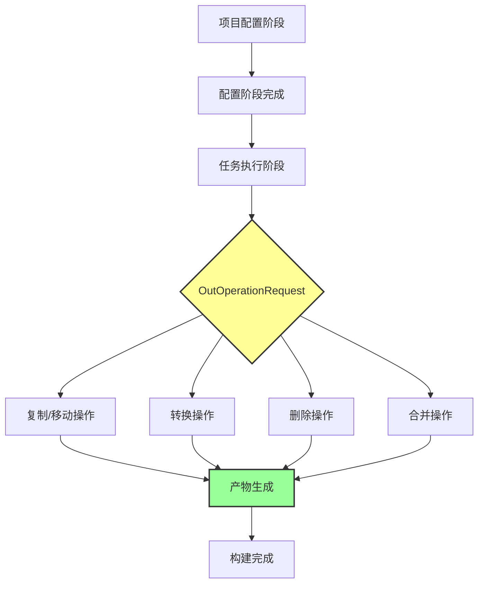
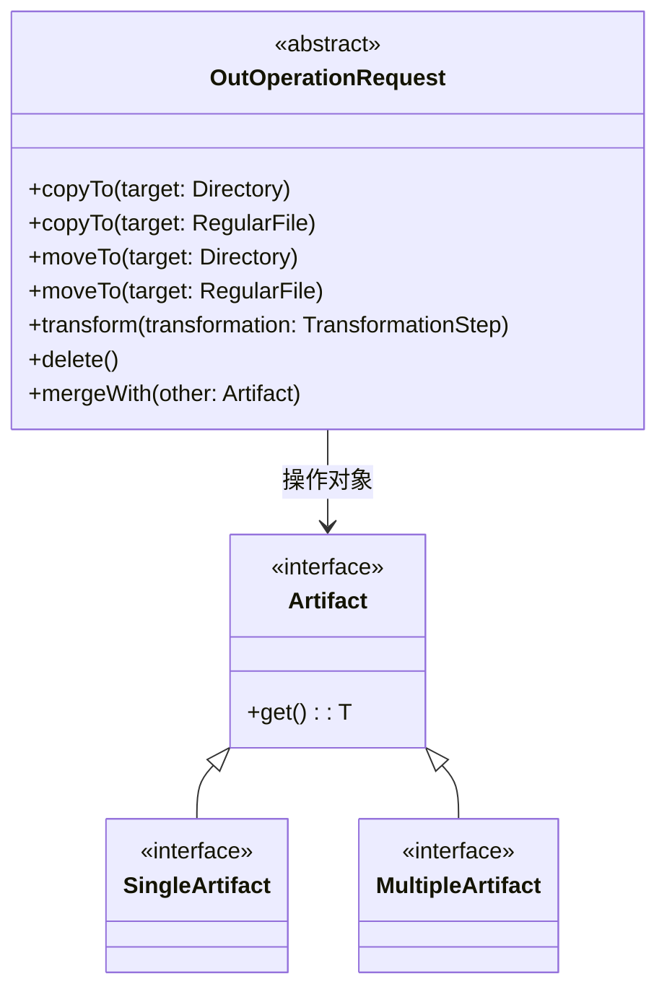

# 21.1.30 输出操作请求

太阳慢慢爬上了头顶，树荫的范围一点点缩小。希尔抬手用草帽扇着风，眼睛却一直盯着笔记本屏幕。

"黛琳姐，"希尔突然开口，"刚才你说的那个 PRE_COMPILATION_CLASSES，我有个问题。"

黛琳正用树枝在地上画着什么，闻言抬起头来。

"你说这些 Artifact 类型吧，它们定义了'我要什么样的产物'，"希尔继续说，"那有没有一种方法，能够'请求'这些产物被执行某种操作？就像……就像我不仅告诉厨师我要一份牛排，还告诉他'帮我切成丁'那样？"

伊莎在一旁听到了，轻轻笑了："希尔这个比喻好有意思。"

"确实问到点子上了。"黛琳点点头，把树枝放在地上，"在 Android 构建系统里，这种'请求执行操作'的机制，就叫做 OutOperationRequest——输出操作请求。"

洛芙正好剥开一颗青梅，酸酸甜甜的味道让她眯起了眼睛："又是 Request……感觉 Android 里有好多 Request 啊。"

"不一样的，"黛琳笑着说，"Intent 的 Request 是'请求系统做某件事'，而 OutOperationRequest 是'请求构建系统对产物做某件事'。一个是运行时的事件，一个是构建时的描述。"

"构建时的描述……"洛芙若有所思地点点头。

---

## 产物与操作的分离

黛琳在地上画了一个大大的圆，又在圆里画了几个小圆。

"你们看，如果我们把 Android 构建想象成一座工厂，"她开始解释，"那么 Artifact 就是'生产出来的产品'——比如 APK、AAB、mapping 文件、预编译的类文件，等等。"

"那 OutOperationRequest 呢？"洛芙问。

"OutOperationRequest 就像是工厂流水线上的'操作指令'。"黛琳用树枝点了点那些小圆，"它不关心产出什么具体产品，它关心的是'对这个产品执行什么操作'。比如：帮我复制这个文件、帮我合并这些内容、帮我保存到这个位置……"

"我懂了！"希尔兴奋地一击掌，"就像刚才说的牛排例子——牛排是 Artifact，'切成丁'就是 OutOperationRequest！"

"对，就是这个意思。"黛琳笑了，"而且更有趣的是，OutOperationRequest 本身也是可以被组合的。一个操作的结果可以作为下一个操作的输入，形成一个操作链。"

伊莎，托着腮帮子，看着地上的图形，轻声说："就像河流一样……一股水流过来，有的分支去灌溉农田，有的分支去推动水车，有的分支继续向前流淌……"

"伊莎的比喻总是这么美。"黛琳温柔地说。

---

## 核心 API 结构

希尔把笔记本转过来，让大家都能看到屏幕。

"我找到了 OutOperationRequest 的定义，"她说，"虽然文档不是很详细，但我们可以通过它的方法看出它的用途。"

```kotlin
/**
 * OutOperationRequest - 输出操作请求
 * 
 * 这是 Android Gradle Plugin 提供的 API，用于描述
 * 对构建产物的各种操作请求。
 * 
 * 主要操作类型：
 * - copy: 复制文件到指定位置
 * - move: 移动文件到指定位置
 * - transform: 对内容进行转换处理
 * - delete: 删除指定的文件或目录
 * - merge: 合并多个输入为一个输出
 */
abstract class OutOperationRequest {
    
    // 请求复制操作 - 将产物复制到指定目录
    abstract fun copyTo(targetDirectory: Directory)
    
    // 请求复制操作 - 将产物复制到指定文件
    abstract fun copyTo(targetFile: RegularFile)
    
    // 请求移动操作 - 移动产物到指定目录
    abstract fun moveTo(targetDirectory: Directory)
    
    // 请求移动操作 - 移动产物到指定文件
    abstract fun moveTo(targetFile: RegularFile)
    
    // 请求转换操作 - 对产物进行转换处理
    abstract fun transform(
        transformation: TransformationStep
    )
    
    // 请求删除操作 - 删除产物
    abstract fun delete()
    
    // 请求合并操作 - 将多个产物合并为一个
    abstract fun mergeWith(other: Artifact)
}
```

"这些方法……看起来好直接啊。"洛芙说，"copyTo、moveTo、delete……就像文件系统操作一样。"

"没错，"黛琳点点头，"OutOperationRequest 的设计理念就是'让构建操作像文件操作一样简单'。你不需要知道背后复杂的构建流程，只需要告诉系统'把东西搬到这里'或者'把东西删掉'就行。"

---

## 实际操作示例

希尔新建了一个 Kotlin 文件，开始写示例代码。

"我用一个具体的例子来说明吧，"她说，"假设我们有一个任务，需要把预编译的类文件复制到最终的输出目录："

```kotlin
import com.android.build.api.artifact.ArtifactType
import com.android.build.api.artifact.OutOperationRequest
import com.android.build.api.artifact.SingleArtifact
import org.gradle.api.file.Directory
import org.gradle.api.file.RegularFile

/**
 * 示例：使用 OutOperationRequest 复制预编译类文件
 * 
 * 场景：某个 Gradle 插件需要将预编译的类文件
 * 复制到指定的输出目录，以便后续处理。
 */
abstract class CopyPrecompiledClassesTask : org.gradle.api.DefaultTask() {
    
    // 声明输入：预编译类文件目录
    @get:org.gradle.api.tasks.InputDirectory
    abstract val precompiledClassesDir: Directory
    
    // 声明输出：目标目录
    @get:org.gradle.api.tasks.OutputDirectory
    abstract val outputDirectory: Directory
    
    @org.gradle.api.tasks.TaskAction
    fun taskAction() {
        // 获取 OutOperationRequest
        // 在实际使用中，这个 request 会由 Android 构建系统注入
        val request = getOutOperationRequest()
        
        // 请求复制操作：将预编译类文件复制到输出目录
        request.copyTo(precompiledClassesDir) { source ->
            // 这里可以使用 lambda 表达式来精确定位目标
            outputDirectory.dir("classes")
        }
    }
    
    // 抽象方法，由 Gradle 注入实际实现
    abstract fun getOutOperationRequest(): OutOperationRequest
}
```

"这个例子有点复杂，"希尔吐了吐舌头，"让我简化一下，给你们看更直观的用法："

```kotlin
/**
 * 简化版：展示 OutOperationRequest 的核心用法
 */
class SimpleBuildOperationDemo {
    
    fun demonstrateOperations(request: OutOperationRequest) {
        
        // 示例1：复制操作
        // 将构建产物复制到指定目录
        val outputDir: Directory = project.layout.buildDirectory.dir("output").get()
        request.copyTo(outputDir)
        
        // 示例2：移动操作
        // 将构建产物移动到新位置（原来的位置会被删除）
        val archiveDir: Directory = project.layout.buildDirectory.dir("archives").get()
        request.moveTo(archiveDir)
        
        // 示例3：转换操作
        // 对产物进行转换，比如压缩、混淆等
        request.transform(ProguardTransform())
        
        // 示例4：删除操作
        // 清理临时文件或中间产物
        request.delete()
        
        // 示例5：合并操作
        // 将多个产物合并为一个
        val otherArtifact: Artifact = project.artifacts.getByType(SingleArtifact::class.java)
        request.mergeWith(otherArtifact)
    }
}
```

"原来如此！"洛芙眼睛亮了起来，"这些操作就像搭积木一样，可以随意组合。"

"对的，"黛琳说，"这就是 OutOperationRequest 的强大之处——它把复杂的构建逻辑抽象成了简单的操作请求，让开发者可以专注于'做什么'而不是'怎么做'。"

---

## 生命周期与使用场景

伊莎忽然想到一个问题："黛琳，这些操作请求……在什么时候会被执行啊？"

"好问题。"黛琳点点头，"OutOperationRequest 的执行时机和 Android 构建的生命周期紧密相关。"

她在白板上画了一幅图：



"在 Android 构建过程中，"黛琳指着图解释，"OutOperationRequest 主要在'任务执行阶段'被处理。在这个阶段，构建系统会："

1. **解析请求**：读取所有 OutOperationRequest，了解需要执行什么操作
2. **确定依赖**：分析操作之间的依赖关系，决定执行顺序
3. **执行操作**：按照确定的顺序执行复制、移动、转换、删除、合并等操作
4. **产出结果**：生成最终的构建产物

"所以，"黛琳补充道，"如果你需要在构建过程中对某些产物进行处理，比如添加签名、压缩文件、生成文档等，都可以通 OutOperationRequest 来实现。"

---

## 与 Artifact 的配合

"我有点混淆了，"洛芙举手说，"Artifact 和 OutOperationRequest 到底有什么区别？"

黛琳笑着看向希尔："希尔，你来用那个牛排的比喻解释一下？"

希尔想了想："嗯……如果把餐厅比作 Android 构建系统的话——"

"餐厅！"伊莎眼睛一亮，"这个比喻我喜欢。"

"那我来继续，"希尔说，"Artifact 就是端上来的'菜品'——牛排、鱼排、甜点，它们是具体的产物。而 OutOperationRequest 呢，就是'点菜时的特殊要求'——七分熟、去掉香菜、甜品要热的……"

"我明白了！"洛芙兴奋地说，"Artifact 定义了'是什么'，OutOperationRequest 定义了'怎么做'！"

"没错，"黛琳总结道，"Artifact 是静态的描述，说明你要处理什么；OutOperationRequest 是动态的请求，说明要怎么处理。在实际使用中，它们经常一起出现："

```kotlin
/**
 * Artifact 与 OutOperationRequest 配合使用示例
 */
class BuildPipelineDemo {
    
    fun buildWithArtifactsAndOperations(
        artifact: MultipleArtifact<Directory>,
        request: OutOperationRequest
    ) {
        // 步骤1：获取 Artifact（预编译的类文件）
        val precompiledClasses = artifact.get()
        
        // 步骤2：使用 OutOperationRequest 执行操作
        // 复制到临时目录进行进一步处理
        val tempDir = project.layout.buildDirectory.dir("temp/processed").get()
        request.copyTo(tempDir)
        
        // 步骤3：对复制后的内容进行转换
        request.transform(OptimizeClassesTransform())
        
        // 步骤4：将处理结果移动到最终输出目录
        val finalDir = project.layout.buildDirectory.dir("final/classes").get()
        request.moveTo(finalDir)
    }
}
```

"这样一看就清晰多了。"洛芙满意地点点头。

---

## 常见使用模式

希尔打开了一个新的代码窗口："我在实际项目中，见过几种常见的 OutOperationRequest 使用模式，给你们总结一下："

### 模式一：单步处理

最简单的情况，只需要对一个 Artifact 执行一个操作。

```kotlin
// 单步处理：将 APK 复制到发布目录
singleArtifact(ArtifactType.APK).onEach { apk ->
    operations.copyTo(
        targetDirectory = project.layout.buildDirectory.dir("releases")
    )
}
```

### 模式二：链式处理

对一个 Artifact 执行多个操作，形成处理链。

```kotlin
// 链式处理：复制 -> 压缩 -> 签名 -> 移动
operations
    .copyTo(tempDir)           // 复制到临时目录
    .transform(ZipAlignTransform())  // 压缩对齐
    .transform(SigningTransform())   // 添加签名
    .moveTo(releaseDir)        // 移动到发布目录
```

### 模式三：多输入合并

将多个 Artifact 合并为一个输出。

```kotlin
// 多输入合并：合并多个模块的类文件
val module1Classes = artifacts.of(module1Project).get(ArtifactType.JAVA_CLASSES)
val module2Classes = artifacts.of(module2Project).get(ArtifactType.JAVA_CLASSES)

operations
    .addInput(module1Classes)
    .addInput(module2Classes)
    .mergeWith(module1Classes)  // 合并
    .copyTo(mergedOutputDir)    // 输出
```

### 模式四：条件处理

根据不同条件执行不同的操作。

```kotlin
// 条件处理：调试构建 vs 发布构建
val isRelease = project.hasProperty("release")

operations.copyTo(
    if (isRelease) {
        // 发布版本：添加混淆和签名
        operations.transform(ProguardTransform())
        operations.transform(SigningTransform())
        releaseOutputDir
    } else {
        // 调试版本：直接复制
        debugOutputDir
    }
)
```

"这些模式好实用！"洛芙感叹道，"感觉学会了这些，就可以自己写构建插件了。"

"确实如此，"黛琳微笑着说，"很多 Android 构建插件的底层原理，就是这些看似简单的操作组合。"

---

## 反模式与注意事项

伊莎忽然严肃起来："黛琳，这些操作有没有什么需要注意的'坑'啊？"

"当然有，"黛琳点点头，"我正要说这个。"

她在白板上写了几条注意事项：

### 反模式一：忽略执行顺序

```kotlin
// ❌ 错误示例：操作顺序不当
operations
    .moveTo(dirA)    // 先移动
    .copyTo(dirB)    // 再复制 - 但 move 后原始文件已不存在！
```

```kotlin
// ✅ 正确做法：明确操作的执行顺序和依赖
operations
    .copyTo(tempDir) // 先复制到临时目录
    .moveTo(dirA)    // 移动到目标位置
    .copyTo(dirB)    // 从临时目录复制到第二个位置
```

### 反模式二：路径冲突

```kotlin
// ❌ 错误示例：多个操作试图写入同一位置
operations.copyTo(buildDir.dir("output/classes"))
operations.moveTo(buildDir.dir("output/classes")) // 冲突！
```

```kotlin
// ✅ 正确做法：确保每个操作有唯一的输出目标
operations.copyTo(buildDir.dir("output/classes"))
operations.moveTo(archiveDir.dir("backup/classes")) // 不同的目标
```

### 反模式三：忘记处理null

```kotlin
// ❌ 错误示例：未检查产物是否存在
val artifact = artifactType.get()  // 可能为 null
operations.copyTo(outputDir)       // 操作 null 会崩溃
```

```kotlin
// ✅ 正确做法：先检查产物是否存在
val artifact = artifactType.get()
if (artifact != null) {
    operations.copyTo(outputDir)
} else {
    project.logger.warn("Artifact 不存在，跳过操作")
}
```

"最后一条太重要了，"希尔补充道，"我之前就因为没检查 null，导致构建在 CI 上失败，排查了好久。"

"构建相关的 bug 最难排查了。"伊莎同情地说。

---

## 实战练习

希尔拍了拍手："说了这么多，让我们来动手实践一下吧！"

她打开了一个预先准备好的练习项目。

"这个练习的目标是："希尔说，"创建一个简单的 Gradle 任务，使用 OutOperationRequest 将一个源目录中的文件复制到目标目录。"

```kotlin
// 练习 starter code
abstract class CopyFilesTask : DefaultTask() {
    
    @get:InputDirectory
    abstract val sourceDirectory: DirectoryProperty
    
    @get:OutputDirectory
    abstract val targetDirectory: DirectoryProperty
    
    @TaskAction
    fun execute() {
        // TODO: 使用 OutOperationRequest 实现文件复制
        // 提示：
        // 1. 获取 OutOperationRequest
        // 2. 调用 copyTo 方法
        // 3. 确保源目录存在
        
        // 你的代码写在这里：
        
    }
}
```

"给你们一点提示，"希尔笑着说，"在实际的 Android 构建中，OutOperationRequest 会通过属性注入的方式提供给任务。你们可以先假设有一个 `operations` 属性可以使用。"

洛芙开始试着写代码，不一会儿就有了雏形。

"黛琳姐，"洛芙举手，"我有个问题——如果我想在复制的同时对文件进行重命名，该怎么做？"

"好问题！"黛琳说，"这就要用到 OutOperationRequest 的 transform 方法了。不过这个话题我们可以在下一章详细讲，今天先掌握基础。"

---

## 四季如歌

太阳已经偏西，阳光从直射变成了斜射，树荫的范围又慢慢扩大了。一阵风吹过，带来些许凉意，蝉鸣声似乎也没有那么刺耳了。

"不知不觉又说了一下午。"伊莎伸了个懒腰。

"收获好多啊。"洛芙整理着笔记本，"Artifact、OutOperationRequest……感觉构建系统也没有那么神秘了。"

黛琳收拾着地上的白板笔："构建系统确实很复杂，但把它拆分成一个个小的概念来理解，就没那么可怕了。"

"明天我们讲什么？"希尔问。

"明天啊……"黛琳想了想，"明天我们来聊聊这些操作请求在实际项目中是怎么被组合使用的——Transformation Pipeline."

"听起来就很厉害！"洛芙期待地说。

夕阳把四个女孩的影子拉得很长，她们收拾好营地，朝着下山的方向走去。蝉鸣声渐渐远去，山路上留下了她们欢快的笑声。

---

## 专业技术总结

> **OutOperationRequest** — Android Gradle Plugin 提供的构建输出操作请求接口，用于描述对构建产物（Artifact）的各种处理操作，如复制、移动、转换、删除、合并等。

#### 结构图



#### 复杂度与影响

- **时间复杂度**：O(n)，n 为处理的 Artifact 数量
- **空间复杂度**：O(m)，m 为临时文件大小
- **构建性能影响**：过多的 OutOperationRequest 会延长构建时间，建议合并操作

#### 反模式与陷阱

1. **操作顺序错误**：move 操作会删除原始文件，后续操作可能失败
2. **路径冲突**：多个操作写入同一目标会导致覆盖或失败
3. **忽略 null 检查**：Artifact 可能不存在，未检查会导致运行时崩溃
4. **过度使用**：每个小操作都创建独立的 Request 会降低构建效率

#### 设计哲学

- **操作与数据分离**：Artifact 定义"是什么"，OutOperationRequest 定义"怎么做"
- **声明式 API**：开发者描述期望的结果，构建系统负责实现细节
- **链式调用**：支持操作组合，形成处理管道

#### 🏕️ 动手练习

**目标**：创建一个 Gradle 任务，使用 OutOperationRequest 将源目录中的文件复制到目标目录。

**步骤**：

1. 创建 `build.gradle.kts` 文件，添加 `android` 和 `kotlin` 插件
2. 定义一个继承 `DefaultTask` 的任务类 `CopyFilesTask`
3. 添加两个属性：`sourceDirectory`（输入）和 `targetDirectory`（输出），使用 `DirectoryProperty`
4. 在 `@TaskAction` 方法中实现复制逻辑
5. 注册任务并配置源目录和目标目录
6. 运行任务，观察输出

**验收标准**：

- [ ] 任务能够成功运行
- [ ] 源目录中的文件被复制到目标目录
- [ ] 目录结构保持一致

**提示代码**：

```kotlin
abstract class CopyFilesTask : DefaultTask() {
    
    @get:InputDirectory
    abstract val sourceDirectory: DirectoryProperty
    
    @get:OutputDirectory
    abstract val targetDirectory: DirectoryProperty
    
    @TaskAction
    fun execute() {
        // 使用 project 对象获取文件和目录
        val source = sourceDirectory.get()
        val target = targetDirectory.get()
        
        // 复制文件（可以先使用 Gradle 内置的复制任务）
        project.copy {
            from(source)
            into(target)
        }
    }
}
```

#### 面试热身

1. **Q1**: OutOperationRequest 和 Artifact 有什么区别？请用自己的话解释。
2. **Q2**: 解释一下 OutOperationRequest 的典型使用场景。
3. **Q3**: 如果你需要将多个模块的类文件合并为一个，你会怎么做？
4. **Q4**: 描述一下 OutOperationRequest 的生命周期。
5. **Q5**: 在使用 OutOperationRequest 时，有哪些常见的错误需要避免？

#### 参考实现要点

1. 优先使用声明式 API，让构建系统优化执行顺序
2. 多个相似操作尽量合并，减少 IO 开销
3. 操作链不宜过长，每一步都会增加构建时间
4. 做好错误处理，特别是处理可能不存在的 Artifact
5. 善用 transform 方法进行复杂的数据转换处理

> 今天学会了 OutOperationRequest——它就像构建系统里的"操作指令"，告诉我们如何处理已经生产出来的"产品"。artifact告诉我们"是什么"，OutOperationRequest告诉我们"怎么做"，两者配合，就能搭建出复杂的构建流水线。

---

## 洛芙的小小日记本

> 今天好充实！原来Android构建就像一座工厂，Artifact是产品，OutOperationRequest是加工指令。希尔说的牛排例子太生动了——告诉厨师不仅要牛排，还要七分熟、去骨～构建系统也没有那么神秘啦！明天继续加油！✨

---

## 今日关键词

- **OutOperationRequest**：Android Gradle Plugin 提供的构建输出操作请求接口，用于描述对构建产物的各种处理操作
- **Artifact**：构建过程中产生的产物，如 APK、AAB、类文件等
- **SingleArtifact**：单一类型的构建产物
- **MultipleArtifact**：多种类型的构建产物集合
- **Transformation**：对Artifact进行转换处理的操作
- **Gradle Plugin**：扩展 Gradle 功能的插件
- **DirectoryProperty**：Gradle 中表示目录的属性类型
- **TaskAction**：Gradle 任务中实际执行逻辑的方法
- **Build Pipeline**：构建流水线，一系列构建操作的组合
- **copyTo**：将产物复制到指定位置的操作
- **moveTo**：将产物移动到指定位置的操作
- **delete**：删除产物的操作
- **mergeWith**：合并多个产物的操作
