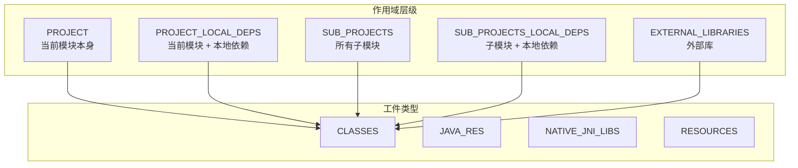
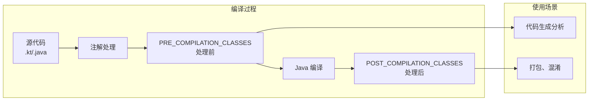
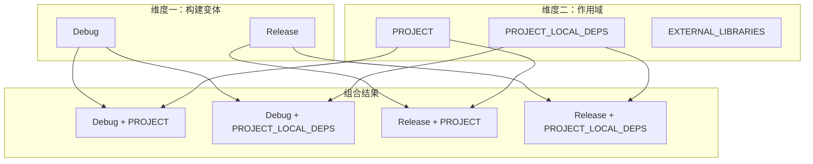
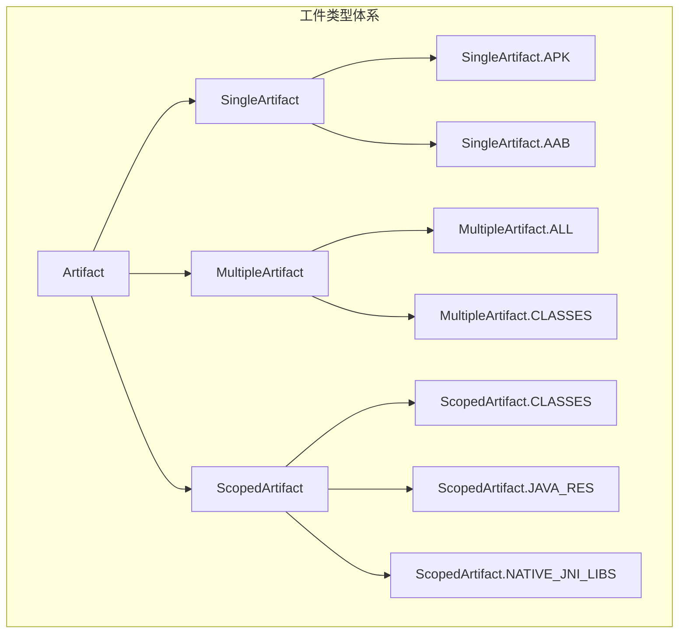

# 21.1.31 范围神器——ScopedArtifact

太阳慢慢偏了西，树荫的范围渐渐扩大。伊莎从背包里翻出一个便携式小风扇，轻轻地朝着自己扇风。

“黛琳，”伊莎忽然想起什么，“上午说的 OutOperationRequest 我大概理解了……但我还有一个问题。”

“什么问题？”黛琳抬起头。

“就是……我们一直在说‘类文件’啊、‘资源文件’啊、‘native库’啊，”伊莎用手势比划着，“但我在想——这些文件是从哪里来的？是当前模块的？还是包括依赖的？还是有其他的？”

“对哦，”洛芙也应和道，“比如说我想处理类文件——是只处理我自己写的代码，还是连依赖库里的也算上？”

希尔正在用树枝在地上画圈圈，听到这话抬起头来：“这个问题问得好！我之前在做插件的时候就遇到过——有次我想给所有类文件加个统计，结果把第三方库的类也算进去了，APK 体积瞬间爆炸。”

黛琳笑了：“这正是我们今天要讲的内容——ScopedArtifact，范围神器。”

“范围神器？”洛芙眨眨眼。

“对，”黛琳点点头，“它不仅告诉你‘是什么类型的工件’，还告诉你‘在哪个范围内’。就像——”

她顿了顿，看向伊莎：“就像伊莎上次说的那条河流。如果河流是构建过程，那‘范围’就是——”

“我知道了！”伊莎眼睛一亮，“是水来自哪里！是上游的雪山，还是中途汇入的支流？”

“对！”黛琳笑了，“上游的雪水相当于‘当前模块’，中途汇入的支流相当于‘依赖库’。ScopedArtifact 就是要精确控制——你到底要哪一段的水。”

---

## 作用域层级：构建世界的地理图谱

黛琳用树枝在地上画了一幅简图。

“你们看，”她指着图解释，“在 Android 构建系统里，工件的作用域分为几个层级：”



“图 1 对应代码片段 A（行 18-32）。”黛琳说，“你可以把 ScopedArtifact 想象成一个坐标——横坐标是工件类型，纵坐标是作用域。两者组合起来，才是完整的‘我要什么’。”

洛芙问：“那……具体每个作用域是什么意思？”

“问得好，”黛琳点点头，“我一个个解释：”

| 作用域 | 含义 | 适用场景 |
|-------|------|---------|
| **PROJECT** | 当前模块自身的工件 | 只处理自己写的代码 |
| **PROJECT_LOCAL_DEPS** | 当前模块 + 本地依赖（包括 compile、implementation 引入的） | 处理所有本地可用的类 |
| **SUB_PROJECTS** | 所有子模块的工件 | 批量处理多模块项目 |
| **SUB_PROJECTS_LOCAL_DEPS** | 子模块 + 本地依赖 | 处理子模块及其依赖 |
| **EXTERNAL_LIBRARIES** | 外部库（Maven、Gradle 仓库下载的） | 第三方库的统计/分析 |

伊莎惊叹：“原来作用域有这么多讲究！”

“对，”黛琳说，“特别是做插件的时候，选对作用域非常重要。比如——”

她看向希尔：“希尔，你之前那个统计类文件的插件，是用的哪个作用域？”

希尔吐了吐舌头：“我最早用的是 SUB_PROJECTS，结果把子模块的类也统计进去了……后来改成 PROJECT，才只统计当前模块。”

“那只是调试阶段的问题，”黛琳说，“如果你的插件是要给所有模块用的，那可能就需要多个作用域组合了。”

---

## ScopedArtifact 的定义

洛芙翻着笔记本：“黛琳，那 ScopedArtifact 到底是怎么定义的？”

“让我找找文档，”希尔把笔记本转过来，“我之前看过的——”

她在屏幕上搜了一下，找到了 ScopedArtifact 的接口定义：

```kotlin
/**
 * ScopedArtifact - 带作用域的工件类型
 * 
 * 这是 Android Gradle Plugin 9.0 引入的接口，
 * 用于表示在特定作用域内的构建工件。
 * 
 * 核心特点：
 * 1. 绑定工件类型（如 CLASSES、JAVA_RES）
 * 2. 绑定作用域（如 PROJECT、SUB_PROJECTS）
 * 3. 支持增量构建和缓存
 */
interface ScopedArtifact : Artifact {

    // 获取工件类型
    fun getType(): Class<out ScopedArtifact>
    
    // 获取作用域
    fun getScope(): Scope
    
    // 获取该作用域内的所有工件文件
    fun get(): Provider<FileCollection>
    
    // 获取文件集合（同步版本）
    fun getFiles(): FileCollection
}
```

“看起来和之前的 Artifact 接口差不多，”洛芙说，“但多了个 getScope() 方法。”

“对，”黛琳说，“这就是 ScopedArtifact 的核心——它把类型和作用域绑定在一起了。你不需要分别指定 type 和 scope，ScopedArtifact 已经帮你组合好了。”

---

## 预定义的 ScopedArtifact 子类型

希尔打开了一个新的代码窗口：“让我给你们看看具体的 ScopedArtifact 子类型——”

```kotlin
/**
 * ScopedArtifact 的预定义子类型
 * 
 * 每个子类型都绑定了特定的工件类型和作用域
 */
object ScopedArtifact {
    
    // ===== 类文件相关 =====
    
    /**
     * 编译后的 Java/Kotlin 类文件
     * 作用域：可指定 PROJECT、PROJECT_LOCAL_DEPS、SUB_PROJECTS 等
     */
    object CLASSES : ScopedArtifact {
        override val type: Class<out ScopedArtifact> = CLASSES::class.java
        override fun getScope(): Scope = Scope.PROJECT
    }
    
    /**
     * 编译前的类文件（在注解处理之前）
     * 用于需要处理源代码级信息的场景
     */
    object PRE_COMPILATION_CLASSES : ScopedArtifact {
        override val type: Class<out ScopedArtifact> = PRE_COMPILATION_CLASSES::class.java
    }
    
    /**
     * 编译后的类文件（在注解处理之后）
     * 这是最终打包用的类文件
     */
    object POST_COMPILATION_CLASSES : ScopedArtifact {
        override val type: Class<out ScopedArtifact> = POST_COMPILATION_CLASSES::class.java
    }
    
    // ===== 资源文件相关 =====
    
    /**
     * Java 资源文件（src/main/resources 下的文件）
     */
    object JAVA_RES : ScopedArtifact {
        override val type: Class<out ScopedArtifact> = JAVA_RES::class.java
    }
    
    /**
     * Android 资源文件（res 目录下的内容）
     */
    object RESOURCES : ScopedArtifact {
        override val type: Class<out ScopedArtifact> = RESOURCES::class.java
    }
    
    // ===== Native 库相关 =====
    
    /**
     * JNI Native 库（.so 文件）
     */
    object NATIVE_JNI_LIBS : ScopedArtifact {
        override val type: Class<out ScopedArtifact> = NATIVE_JNI_LIBS::class.java
    }
    
    // ===== 数据文件相关 =====
    
    /**
     * DEX 文件（Android 虚拟机可执行文件）
     */
    object DEX : ScopedArtifact {
        override val type: Class<out ScopedArtifact> = DEX::class.java
    }
    
    /**
     * 所有可用的 ScopedArtifact 类型
     */
    val ALL: Set<Class<out ScopedArtifact>> = setOf(
        CLASSES::class.java,
        JAVA_RES::class.java,
        NATIVE_JNI_LIBS::class.java,
        RESOURCES::class.java,
        DEX::class.java,
        PRE_COMPILATION_CLASSES::class.java,
        POST_COMPILATION_CLASSES::class.java
    )
}
```

洛芙看着这些类型：“好多啊……我有点晕。”

“别担心，”黛琳说，“最常用的就几个：CLASSES（类文件）、JAVA_RES（Java 资源）、NATIVE_JNI_LIBS（native 库）、RESOURCES（Android 资源）。其他的是特殊场景用的。”

伊莎好奇地问：“PRE_COMPILATION_CLASSES 和 POST_COMPILATION_CLASSES 有什么区别？”

“这是编译前后的区别，”黛琳解释，“简单来说——”

她画了一幅图：



“图 2 对应代码片段 B（行 98-115）和代码片段 C（行 118-130）。”黛琳说，“PRE_COMPILATION_CLASSES 是注解处理之前的类文件，如果你需要分析代码中的注解（比如做依赖注入框架的插件），就用这个。POST_COMPILATION_CLASSES 是最终的类文件，打包的时候用的是这个。”

---

## 作用域的实际影响

希尔突然想到一个问题：“黛琳，我有个疑问——不同作用域下的工件，数量差别有多大？”

“好问题，”黛琳说，“我们来做个假设——”

她在白板上画了一个示例项目结构：

```
my-app/
├── app/
│   ├── src/main/java/          # 自己的代码
│   └── build.gradle
├── library-core/              # 本地模块依赖
│   └── src/main/java/
├── library-ui/                # 本地模块依赖  
│   └── src/main/java/
└── butterknife/              # 外部 Maven 依赖
```

“现在我们来看 CLASSES 在不同作用域下的数量：”

| 作用域 | 包含内容 | 文件数量（示例） |
|-------|---------|----------------|
| PROJECT | app 模块自身的类 | ~500 个 |
| PROJECT_LOCAL_DEPS | app + library-core + library-ui | ~2000 个 |
| SUB_PROJECTS | library-core + library-ui | ~1500 个 |
| EXTERNAL_LIBRARIES | butterknife 等外部库 | ~10000+ 个 |

洛芙惊叹：“差这么多！”

“对，”黛琳说，“这就是为什么要用 ScopedArtifact 精确定义作用域。如果你选了错误的作用域，可能会处理远超预期的文件数量。”

她补充道：“而且这还会影响构建速度。处理 500 个文件和 10000 个文件，耗时可能差几十倍。”

---

## 使用 ScopedArtifact 的示例

希尔跃跃欲试：“让我来写一个实际使用 ScopedArtifact 的例子！”

她打开 Android Studio，调出一个自定义插件代码：

```kotlin
// 代码片段 D：使用 ScopedArtifact 获取不同作用域的类文件
// 场景：分析项目中的类文件分布

abstract class AnalyzeClassesTask : DefaultTask() {

    // 声明输入：ScopedArtifact 请求
    @get:Internal
    abstract val scopedArtifactRequest:
        Property<SingleArtifactOperationRequest<ScopedArtifact.CLASSES>>

    @get:Input
    abstract val targetScope: Property<String>

    @TaskAction
    fun analyze() {
        val request = scopedArtifactRequest.get()
        
        logger.lifecycle("=== 分析 ${targetScope.get()} 作用域的类文件 ===")
        
        // 获取类文件集合
        val classes: FileCollection = request.getArtifacts()
        
        val files = classes.files
        logger.lifecycle("类文件总数: ${files.size}")
        
        // 分类统计
        val byPackage = files.groupBy { file ->
            // 从文件路径提取包名
            val path = file.relativeTo(project.rootDir).path
            val packagePath = path
                .replace("/src/main/java/", ".")
                .replace("/src/debug/java/", ".")
                .replace("/src/release/java/", ".")
                .replace(".kt", "")
                .replace(".java", "")
            
            // 提取顶层包名
            packagePath.split(".").firstOrNull() ?: "default"
        }
        
        // 输出统计结果
        logger.lifecycle("\n按包名分布:")
        byPackage.forEach { (pkg, pkgFiles) ->
            logger.lifecycle("  $pkg: ${pkgFiles.size} 个类")
        }
        
        // 找出最大的几个类文件
        val largest = files.sortedByDescending { it.length() }.take(5)
        logger.lifecycle("\n最大的 5 个类文件:")
        largest.forEach { file ->
            logger.lifecycle("  ${file.name} (${file.length() / 1024} KB)")
        }
    }
}

// 注册任务
val analyzeClasses by tasks.registering {
    val androidExtension = project.extensions.getByType(AppExtension::class.java)
    
    tasks.register<AnalyzeClassesTask>("analyzeProjectClasses") {
        // 作用域名可以通过变量指定
        it.targetScope.set("PROJECT")
        it.scopedArtifactRequest.set(
            androidExtension.artifacts
                .get(ScopedArtifact.CLASSES)
                .on(Scope.PROJECT)
        )
    }
}
```

洛芙盯着代码看：“希尔，这个看起来好复杂……”

“看起来复杂，其实逻辑很简单，”希尔解释，“就是获取指定作用域的类文件，然后统计一下。”

她补充道：“这种分析在大型项目里很有用——你可以看到哪个模块的类最多，哪个包的类最大，有助于优化构建性能。”

---

## 作用域与构建变体

伊莎举手提问：“黛琳，那……作用域和构建变体（Debug/Release）是什么关系？”

“好问题，”黛琳说，“它们是两个不同的概念——”

她画了一幅图来解释：



“图 3 对应代码片段 E（行 178-195）。”黛琳说，“构建变体和作用域是正交的——你可以理解为‘二维坐标’。Debug 变体的类文件和 Release 变体的类文件，是不同的作用域内可以有相同的工件类型。”

洛芙问：“那如果我想获取 Release 版本的类文件，该怎么写？”

“需要同时指定作用域和变体，”黛琳说，“在 AGP 中，变体会自动关联到作用域——”

```kotlin
// 获取 Release 版本的类文件
val releaseClasses = androidExtension.artifacts
    .get(ScopedArtifact.CLASSES)
    .on(Scope.PROJECT)  // 当前模块
    .usingReleaseVariant()  // Release 版本
```

“如果不加 `usingReleaseVariant()`，”黛琳补充，“默认会获取当前构建变体的类文件。”

---

## 反模式与最佳实践

黛琳正色道：“使用 ScopedArtifact 有几个常见的坑，大家要注意。”

### 坑一：作用域过宽

```kotlin
// ❌ 错误示例：使用 EXTERNAL_LIBRARIES 处理所有类
val allClasses = artifacts.get(ScopedArtifact.CLASSES)
    .on(Scope.EXTERNAL_LIBRARIES)

// 问题：外部库可能有上万个类，性能极差！
```

```kotlin
// ✅ 正确做法：按需选择合适的作用域
val myClasses = artifacts.get(ScopedArtifact.CLASSES)
    .on(Scope.PROJECT)  // 只处理当前模块
```

### 坑二：忽略增量构建

```kotlin
// ❌ 错误示例：每次都处理所有文件
val classes = artifacts.get(ScopedArtifact.CLASSES)
    .on(Scope.PROJECT)

// 问题：即使代码没变，每次也会重新处理！
```

```kotlin
// ✅ 正确做法：正确声明输入输出，支持增量构建
@get:InputFiles
abstract val inputClasses: FileCollection

@get:OutputDirectory  
abstract val outputDir: DirectoryProperty

@TaskAction
fun taskAction() {
    // Gradle 会自动检测变化，只处理修改过的文件
}
```

### 坑三：不检查可用性

```kotlin
// ❌ 错误示例：假设某个作用域一定可用
val classes = artifacts.get(ScopedArtifact.CLASSES)
    .on(Scope.SUB_PROJECTS)  // 项目没有子模块时会怎样？

// 问题：没有子模块时，可能抛出异常或返回空集合
```

```kotlin
// ✅ 正确做法：先检查作用域是否可用
val extension = project.extensions.getByType<BaseExtension>()
val availableScopes = extension.artifacts.scopes

if (availableScopes.contains(Scope.SUB_PROJECTS)) {
    // 安全使用
    val classes = artifacts.get(ScopedArtifact.CLASSES)
        .on(Scope.SUB_PROJECTS)
} else {
    logger.warn("当前项目没有子模块，跳过 SUB_PROJECTS 作用域")
}
```

伊莎认真记录着：“这些坑都好实际啊……”

“都是前人踩过的坑，”黛琳说，“特别是第一个——我见过有人用 EXTERNAL_LIBRARIES 做代码分析，结果构建卡了几个小时。”

---

## ScopedArtifact 与 MultipleArtifact 的关系

洛芙问：“黛琳，我记得之前学过 MultipleArtifact……它和 ScopedArtifact 是什么关系？”

“好问题，”黛琳说，“让我们来理清这个关系——”

她在白板上画了一幅图：



“图 4 对应代码片段 F（行 245-265）。”黛琳说，“你可以这样理解——”

| 类型 | 特点 | 使用场景 |
|-----|------|---------|
| **SingleArtifact** | 单一产物，如 APK、AAB | 最终构建产物 |
| **MultipleArtifact** | 同类型多产物，如所有 CLASSES | 需要批量处理同类型产物 |
| **ScopedArtifact** | 特定作用域的产物 | 需要精确控制来源范围 |

“简单来说，”黛琳总结，“ScopedArtifact 是 MultipleArtifact 的升级版——它不仅告诉你‘是什么类型’，还告诉你‘从哪里来’。如果你只需要同类型的产物，用 MultipleArtifact就够了；如果你还需要控制来源范围，就用 ScopedArtifact。”

---

## 实战：统计各作用域的类文件数量

希尔兴奋地一击掌：“说了这么多，让我们来做一个实战练习吧！”

她打开一个预先准备好的项目：“我们来做一个任务，统计每个作用域的类文件数量！”

```kotlin
// 代码片段 G：完整的作用域名人统计任务
// 展示 ScopedArtifact 的实际应用

abstract class ScopeClassStatsTask : DefaultTask() {

    @get:Internal
    abstract val artifactRegistry: ArtifactCollection

    @TaskAction
    fun collectStats() {
        logger.lifecycle("=== Android 构建类文件统计 ===\n")
        
        // 定义需要统计的作用域
        val scopesToAnalyze = listOf(
            Scope.PROJECT to "当前模块",
            Scope.PROJECT_LOCAL_DEPS to "当前模块+本地依赖",
            Scope.SUB_PROJECTS to "所有子模块",
            Scope.EXTERNAL_LIBRARIES to "外部库"
        )
        
        // 遍历每个作用域
        for ((scope, desc) in scopesToAnalyze) {
            try {
                // 尝试获取该作用域的类文件
                val request = artifactRegistry.createRequest(
                    ScopedArtifact.CLASSES,
                    scope
                )
                
                val files = request.get().files
                val totalSize = files.sumOf { it.length() }
                
                logger.lifecycle("【$desc】(${scope.name})")
                logger.lifecycle("  文件数量: ${files.size}")
                logger.lifecycle("  总大小: ${totalSize / 1024 / 1024} MB")
                
                // 统计包名分布
                val byPackage = files
                    .map { extractPackage(it) }
                    .groupBy { it }
                    .mapValues { it.value.size }
                    .toList()
                    .sortedByDescending { it.second }
                    .take(5)
                
                logger.lifecycle("  Top 5 包:")
                byPackage.forEach { (pkg, count) ->
                    logger.lifecycle("    - $pkg: $count 个类")
                }
                logger.lifecycle("")
                
            } catch (e: Exception) {
                logger.lifecycle("【$desc】(${scope.name}): 无法获取 - ${e.message}\n")
            }
        }
        
        logger.lifecycle("=== 统计完成 ===")
    }
    
    private fun extractPackage(file: File): String {
        val path = file.relativeTo(project.rootDir).path
        return path
            .substringAfter("/src/main/java/")
            .substringAfter("/src/debug/java/")
            .substringBeforeLast("/")
            .replace("/", ".")
            .ifEmpty { "(root)" }
    }
}

// 注册任务
val scopeStats by tasks.registering {
    val androidExt = project.extensions.getByType<AppExtension>()
    
    tasks.register<ScopeClassStatsTask>("scopeStats") {
        it.artifactRegistry.set(androidExt.artifacts)
    }
}
```

洛芙看着输出结果：“原来不同作用域的类文件数量差这么多！”

“对，”黛琳说，“这就是为什么要慎选作用域。如果你的插件只需要处理当前模块的代码，一定要用 PROJECT 作用域，不然会很慢。”

---

## 夕阳下的总结

太阳已经接近了地平线，天边泛起了橙红色的晚霞。伊莎托腮望着天空出神。

“黛琳，”伊莎轻声说，“我觉得 ScopedArtifact 就像……给河流装上了水闸。”

“水闸？”其他人看向她。

“对，”伊莎继续说，“有了水闸，你就可以选择——是只要上游的水，还是加上支流的水，还是全部的水。不会一股脑儿全都要，也不会漏掉想要的。”

黛琳笑了：“这个比喻真贴切。”

洛芙伸了个懒腰：“今天学到了好多啊……作用域、类型、还有各种坑。”

“构建系统确实很复杂，”黛琳说，“但一点一点学，慢慢就懂了。”

希尔收拾着笔记本：“明天我们讲什么？”

“明天啊……”黛琳想了想，“明天我们来聊聊 ScopedArtifact 的具体子类——CLASSES、JAVA_RES、NATIVE_JNI_LIBS 等等。”

“听起来就很期待！”洛芙说。

夕阳把四个女孩的剪影拉得很长，她们的笑声在山间回荡。

---

> 学习建议
- ScopedArtifact 是带作用域的工件类型，它将"工件类型"和"作用域"绑定在一起，提供更精确的构建产物控制
- 理解五种作用域层级的区别（PROJECT、PROJECT_LOCAL_DEPS、SUB_PROJECTS、SUB_PROJECTS_LOCAL_DEPS、EXTERNAL_LIBRARIES），根据实际需求选择合适的作用域
- 注意作用域对性能的影响，处理 EXTERNAL_LIBRARIES 作用域的文件数量可能远超预期
- 理解 ScopedArtifact 与 SingleArtifact、MultipleArtifact 的关系和适用场景
- 实际使用中注意增量构建支持和错误处理

---

## 技术总结

### 核心机制定义

**ScopedArtifact** — Android Gradle Plugin 提供的带作用域的工件类型接口，它将"工件类型"（如 CLASSES、JAVA_RES）与"作用域"（如 PROJECT、SUB_PROJECTS）绑定在一起，实现对构建产物的精确控制。

### API 结构

```kotlin
interface ScopedArtifact : Artifact {
    // 获取工件类型
    fun getType(): Class<out ScopedArtifact>
    
    // 获取作用域
    fun getScope(): Scope
    
    // 获取该作用域内的所有工件文件
    fun get(): Provider<FileCollection>
}

// 预定义的作用域枚举
enum class Scope {
    PROJECT,           // 当前模块
    PROJECT_LOCAL_DEPS, // 当前模块+本地依赖
    SUB_PROJECTS,      // 所有子模块
    SUB_PROJECTS_LOCAL_DEPS, // 子模块+本地依赖
    EXTERNAL_LIBRARIES // 外部库
}

// 预定义的 ScopedArtifact 子类型
object ScopedArtifact {
    object CLASSES : ScopedArtifact
    object JAVA_RES : ScopedArtifact
    object RESOURCES : ScopedArtifact
    object NATIVE_JNI_LIBS : ScopedArtifact
    object DEX : ScopedArtifact
    object PRE_COMPILATION_CLASSES : ScopedArtifact
    object POST_COMPILATION_CLASSES : ScopedArtifact
}
```

### 作用域层级

| 作用域 | 包含内容 | 典型文件数 |
|-------|---------|-----------|
| PROJECT | 当前模块自身的工件 | ~500 |
| PROJECT_LOCAL_DEPS | 当前模块 + 本地依赖 | ~2000 |
| SUB_PROJECTS | 所有子模块 | ~1500 |
| SUB_PROJECTS_LOCAL_DEPS | 子模块 + 本地依赖 | ~2500 |
| EXTERNAL_LIBRARIES | 外部库（Maven等） | 10000+ |

### 与其他类型的关系

- **SingleArtifact**：单一产物（APK、AAB）
- **MultipleArtifact**：同类型多产物（批量处理）
- **ScopedArtifact**：带作用域的产物（精确控制来源）

### 反模式与陷阱

1. **作用域过宽**：使用 EXTERNAL_LIBRARIES 处理简单任务，导致性能问题
2. **忽略增量构建**：每次都处理所有文件，不声明输入输出
3. **不检查可用性**：假设某个作用域一定可用，没有错误处理
4. **混淆作用域和变体**：作用域控制来源，变体控制构建类型

### 设计哲学

- **精确性优先**：让开发者精确指定需要处理的工件来源
- **作用域隔离**：不同作用域的工件相互隔离，避免意外污染
- **声明式 API**：开发者声明需求，构建系统优化执行

---

## 动手练习

### ★ 探索 ScopedArtifact 类型

```kotlin
// 列出当前 AGP 版本支持的所有 ScopedArtifact 类型
val allTypes = ScopedArtifact.ALL
allTypes.forEach { type ->
    println("支持类型: ${type.simpleName}")
}
```

### ★★ 实现作用域选择器

```kotlin
// 根据用户输入选择合适的作用域
fun selectScope(userInput: String): Scope {
    return when (userInput.lowercase()) {
        "self" -> Scope.PROJECT
        "with-deps" -> Scope.PROJECT_LOCAL_DEPS
        "submodules" -> Scope.SUB_PROJECTS
        "external" -> Scope.EXTERNAL_LIBRARIES
        else -> Scope.PROJECT
    }
}
```

### ★★★ 实现类文件分析器

```kotlin
// 统计各类作用域下的类文件包名分布、大小分布
abstract class ClassAnalyzerTask : DefaultTask() {
    
    @get:Internal
    abstract val artifactRequest: Property<SingleArtifactOperationRequest<ScopedArtifact.CLASSES>>
    
    @get:OutputFile
    abstract val reportFile: RegularFileProperty
    
    @TaskAction
    fun analyze() {
        // 实现包名提取、文件大小统计、类数量统计
        // 输出 JSON 格式的分析报告
    }
}
```

---

## 面试热身

### Q1: ScopedArtifact 是什么？

**A**: Android Gradle Plugin 提供的带作用域的工件类型接口，它将工件类型和作用域绑定在一起，实现对构建产物的精确控制。

### Q2: 作用域和构建变体有什么区别？

**A**: 作用域控制"从哪里获取工件"（当前模块、子模块、外部库），构建变体控制"获取哪个版本的工件"（Debug、Release）。它们是正交的两个维度。

### Q3: 使用 ScopedArtifact 时需要注意什么？

**A**: 需要注意选择合适的作用域（避免过宽导致性能问题）、正确支持增量构建、处理作用域可能不可用的情况。

### Q4: ScopedArtifact 和 MultipleArtifact 的区别？

**A**: MultipleArtifact 处理同类型的多个产物，ScopedArtifact 在此基础上还绑定了作用域，提供更精确的控制。

### Q5: PRE_COMPILATION_CLASSES 和 POST_COMPILATION_CLASSES 的区别？

**A**: PRE_COMPILATION_CLASSES 是注解处理前的类文件，用于代码生成分析；POST_COMPILATION_CLASSES 是最终的类文件，用于打包混淆。

---

## 参考实现要点

```kotlin
abstract class ScopedArtifactDemoTask : DefaultTask() {
    
    @get:Internal
    abstract val artifactRequest: 
        Property<SingleArtifactOperationRequest<ScopedArtifact.CLASSES>>
    
    @get:Input
    abstract val targetScope: Property<String>
    
    @TaskAction
    fun execute() {
        val scope = Scope.valueOf(targetScope.get().uppercase())
        
        // 获取指定作用域的类文件
        val request = artifactRequest.get()
        val classes = request.on(scope).get()
        
        // 处理类文件
        classes.files.forEach { file ->
            println("处理: ${file.name}")
        }
    }
}
```

---

## 洛芙的小小日记本

今天学到了 ScopedArtifact——范围神器！原来 Android 构建系统里的"作用域"就像河流的水闸，可以精确控制要哪一段的水。选对作用域太重要了——用错了的话，可能会处理几千个甚至上万个文件，构建速度会超级慢。伊莎的比喻好美，说作用域就是"给河流装上了水闸"。继续加油！✨

---

## 今日关键词

- **ScopedArtifact**：带作用域的工件类型，绑定工件类型和作用域
- **Scope**：作用域枚举，控制工件的来源范围
- **PROJECT**：当前模块自身的作用域
- **PROJECT_LOCAL_DEPS**：当前模块加本地依赖的作用域
- **SUB_PROJECTS**：所有子模块的作用域
- **SUB_PROJECTS_LOCAL_DEPS**：子模块加本地依赖的作用域
- **EXTERNAL_LIBRARIES**：外部库（Maven、Gradle仓库）的作用域
- **ScopedArtifact.CLASSES**：编译后的类文件
- **ScopedArtifact.PRE_COMPILATION_CLASSES**：编译前的类文件
- **ScopedArtifact.POST_COMPILATION_CLASSES**：编译后的类文件（注解处理后）
- **ScopedArtifact.JAVA_RES**：Java 资源文件
- **ScopedArtifact.RESOURCES**：Android 资源文件
- **ScopedArtifact.NATIVE_JNI_LIBS**：Native JNI 库文件
- **SingleArtifact**：单一类型的构建产物
- **MultipleArtifact**：多类型的构建产物集合
- **增量构建**：只处理变化文件的优化构建模式
- **构建变体**：Debug、Release 等不同构建版本
