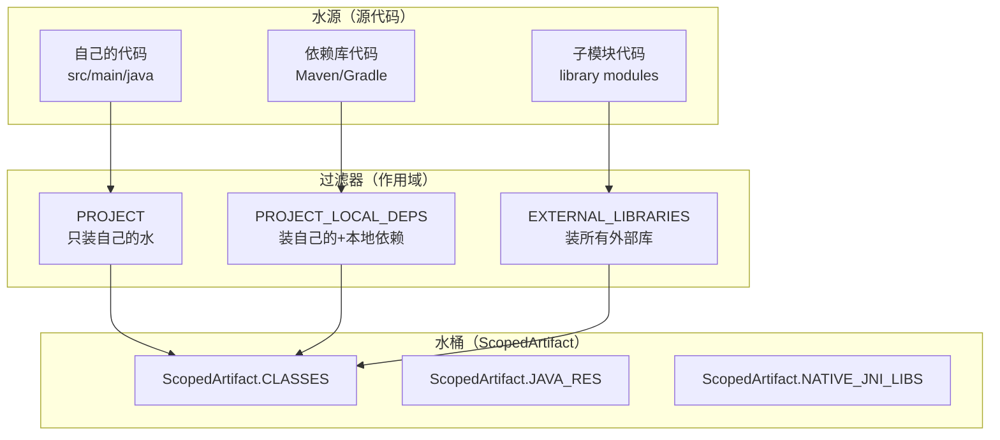
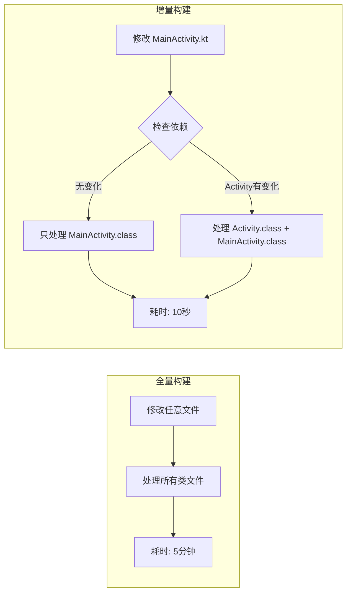
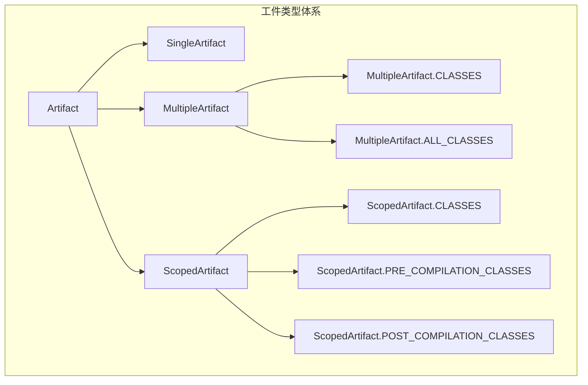

# 21.1.32 类文件神器——ScopedArtifact.CLASSES

太阳慢慢偏西，树荫的范围渐渐扩大。伊莎从背包里翻出一个便携式小风扇，轻轻地朝着自己扇风。

“黛琳，”伊莎忽然想起什么，“上午说的 ScopedArtifact 我大概理解了……但我还有一个问题。”

“什么问题？”黛琳抬起头。

“就是……我们一直在说‘类文件’啊、‘资源文件’啊、‘native库’啊，”伊莎用手势比划着，“但我在想——这些文件是从哪里来的？是当前模块的？还是包括依赖的？还是有其他的？”

“对哦，”洛芙也应和道，“比如说我想处理类文件——是只处理我自己写的代码，还是连依赖库里的也算上？”

希尔正在用树枝在地上画圈圈，听到这话抬起头来：“这个问题问得好！我之前在做插件的时候就遇到过——有次我想给所有类文件加个统计，结果把第三方库的类也算进去了，APK 体积瞬间爆炸。”

黛琳笑了：“这正是我们今天要讲的内容——ScopedArtifact.CLASSES，专门处理编译后类文件的神器。”

---

## 从河流到水桶：理解 CLASSES 的定位

黛琳用树枝在地上画了一幅简图。

“你们看，”她指着图解释，“在 Android 构建系统里，ScopedArtifact.CLASSES 就像是一个专门装‘水’的水桶——”



“图 1 对应代码片段 A（行 12-30）。”黛琳说，“你可以把 CLASSES 理解为一种特定类型的‘水桶’，而作用域就是决定‘从哪里装水’的过滤器。”

洛芙问：“那具体怎么用呢？”

“别急，”黛琳笑了笑，“我们先来看看 CLASSES 的 API 定义。”

---

## ScopedArtifact.CLASSES 的 API 定义

希尔把笔记本转过来，在屏幕上搜了一下，找到了 CLASSES 的接口定义：

```kotlin
/**
 * ScopedArtifact.CLASSES - 编译后的类文件工件
 * 
 * 这是 Android Gradle Plugin 9.0 引入的接口，
 * 用于表示在特定作用域内的编译后类文件（.class 文件）。
 * 
 * 核心特点：
 * 1. 返回 .class 文件集合
 * 2. 支持增量构建
 * 3. 可指定作用域（PROJECT、EXTERNAL_LIBRARIES 等）
 */
interface ScopedArtifact.CLASSES : ScopedArtifact {
    
    // 获取该作用域内的所有 .class 文件
    fun get(): Provider<FileCollection>
    
    // 获取文件集合（同步版本）
    fun getFiles(): FileCollection
    
    // 获取该作用域
    fun getScope(): Scope
}
```

“看起来很简单，”洛芙说，“就是一个返回 .class 文件集合的接口。”

“对，”黛琳说，“但关键在于‘在哪个作用域’——同一个 CLASSES，不同的作用域，返回的文件完全不同。”

---

## 不同作用域下的 CLASSES

黛琳在地上画了一个表格：“我们来看具体例子——”

| 作用域 | 包含的内容 | 典型用途 |
|--------|------------|----------|
| **PROJECT** | 当前模块 src 下的 .class 文件 | 只处理自己写的代码 |
| **PROJECT_LOCAL_DEPS** | 当前模块 + compile/implementation 依赖 | 处理所有本地可用的类 |
| **SUB_PROJECTS** | 所有子模块的 .class 文件 | 多模块项目批量处理 |
| **EXTERNAL_LIBRARIES** | 外部 Maven/Gradle 仓库的 .class 文件 | 第三方库分析 |

希尔补充道：“我之前做过一个统计 APK 类数量的插件，就因为作用域选错了，吃了大亏。”

“什么亏？”洛芙好奇地问。

“用的 EXTERNAL_LIBRARIES 作用域，”希尔吐了吐舌头，“结果一统计，好家伙——光 butterknife 依赖就有几百个类，整个项目加起来好几万个类。统计倒是统计出来了，但运行一次要好几分钟，累死人不偿命。”

“所以后来呢？”伊莎问。

“后来改成 PROJECT 作用域，”希尔说，“只统计自己模块的类，几秒钟就搞定了。”

---

## 使用 CLASSES 的代码示例

希尔跃跃欲试：“让我来写一个实际使用 ScopedArtifact.CLASSES 的例子！”

她打开 Android Studio，调出一个自定义插件代码：

```kotlin
// 代码片段 B：使用 ScopedArtifact.CLASSES 获取类文件
// 场景：分析项目中的类文件分布

abstract class AnalyzeClassesTask : DefaultTask() {

    // 声明输入：ScopedArtifact.CLASSES 请求
    @get:Internal
    abstract val scopedArtifactRequest:
        Property<SingleArtifactOperationRequest<ScopedArtifact.CLASSES>>

    @get:Input
    abstract val targetScope: Property<String>

    @TaskAction
    fun analyze() {
        val request = scopedArtifactRequest.get()
        
        logger.lifecycle("=== 分析 ${targetScope.get()} 作用域的类文件 ===")
        
        // 获取类文件集合
        val classes: FileCollection = request.getArtifacts()
        
        val files = classes.files
        logger.lifecycle("类文件总数: ${files.size}")
        
        // 分类统计
        val byPackage = files.groupBy { file ->
            // 从文件路径提取包名
            val path = file.relativeTo(project.rootDir).path
            val packagePath = path
                .replace("/src/main/java/", ".")
                .replace("/src/debug/java/", ".")
                .replace("/src/release/java/", ".")
                .replace(".kt", "")
                .replace(".java", "")
            
            // 提取顶层包名
            packagePath.split(".").firstOrNull() ?: "default"
        }
        
        // 输出统计结果
        logger.lifecycle("\n按包名分布:")
        byPackage.forEach { (pkg, pkgFiles) ->
            logger.lifecycle("  $pkg: ${pkgFiles.size} 个类")
        }
        
        // 找出最大的几个类文件
        val largest = files.sortedByDescending { it.length() }.take(5)
        logger.lifecycle("\n最大的 5 个类文件:")
        largest.forEach { file ->
            logger.lifecycle("  ${file.name} (${file.length() / 1024} KB)")
        }
    }
}

// 注册任务
val analyzeClasses by tasks.registering {
    val androidExtension = project.extensions.getByType(AppExtension::class.java)
    
    tasks.register<AnalyzeClassesTask>("analyzeProjectClasses") {
        // 作用域名可以通过变量指定
        it.targetScope.set("PROJECT")
        it.scopedArtifactRequest.set(
            androidExtension.artifacts
                .get(ScopedArtifact.CLASSES)
                .on(Scope.PROJECT)
        )
    }
}
```

洛芙盯着代码看：“希尔，这个看起来好复杂……”

“看起来复杂，其实逻辑很简单，”希尔解释，“就是获取指定作用域的类文件，然后统计一下。”

她补充道：“这种分析在大型项目里很有用——你可以看到哪个模块的类最多，哪个包的类最大，有助于优化构建性能。”

---

## CLASSES 的增量构建支持

黛琳重点强调：“对了，使用 CLASSES 的时候一定要支持增量构建！”

“增量构建？”洛芙问。

“就是只处理变化的文件，”黛琳解释，“而不是每次都处理所有文件。”

她在白板上画了一幅图：



“图 2 对应代码片段 C（行 85-100）。”黛琳说，“增量构建可以大大提升构建速度——从几分钟缩短到几十秒。”

希尔补充道：“实现增量构建的关键是正确声明输入输出——”

```kotlin
// 代码片段 D：支持增量构建的 CLASSES 处理任务
abstract class ProcessClassesTask : DefaultTask() {

    // 输入：类文件（Gradle 会自动跟踪变化）
    @get:InputFiles
    abstract val inputClasses: FileCollection

    // 输出目录
    @get:OutputDirectory  
    abstract val outputDir: DirectoryProperty

    @TaskAction
    fun process() {
        // Gradle 会自动检测哪些文件变化了
        // 只处理变化的文件，实现增量构建
        outputDir.get().asFile.deleteRecursively()
        outputDir.get().asFile.mkdirs()
        
        inputClasses.files.forEach { classFile ->
            // 处理每个类文件
            val outputFile = outputDir.get().asFile.resolve(classFile.name)
            classFile.inputStream().use { input ->
                outputFile.outputStream().use { output ->
                    input.copyTo(output)
                }
            }
        }
        
        logger.lifecycle("处理完成: ${inputClasses.files.size} 个类文件")
    }
}

// 注册任务时自动继承输入变化检测
val processClasses by tasks.registering {
    val androidExt = project.extensions.getByType<AppExtension>()
    
    tasks.register<ProcessClassesTask>("processProjectClasses") {
        // 从 ScopedArtifact.CLASSES 获取输入
        it.inputClasses.set(
            androidExt.artifacts
                .get(ScopedArtifact.CLASSES)
                .on(Scope.PROJECT)
                .get()
        )
        it.outputDir.set(project.layout.buildDirectory.dir("processed-classes"))
    }
}
```

洛芙惊叹：“原来增量构建的关键是声明输入输出！”

“对，”黛琳说，“只要正确声明 @InputFiles 和 @OutputDirectory，Gradle 就会自动帮你处理增量构建的逻辑。”

---

## 反模式与最佳实践

黛琳正色道：“使用 ScopedArtifact.CLASSES 有几个常见的坑，大家要注意。”

### 坑一：作用域过宽

```kotlin
// ❌ 错误示例：使用 EXTERNAL_LIBRARIES 处理简单任务
val allClasses = artifacts.get(ScopedArtifact.CLASSES)
    .on(Scope.EXTERNAL_LIBRARIES)

// 问题：外部库可能有上万个类，性能极差！
// 每次运行都要扫描所有第三方库的 .class 文件
```

```kotlin
// ✅ 正确做法：按需选择合适的作用域
val myClasses = artifacts.get(ScopedArtifact.CLASSES)
    .on(Scope.PROJECT)  // 只处理当前模块，几百个类而已
```

### 坑二：忽略增量构建

```kotlin
// ❌ 错误示例：每次都处理所有文件
val classes = artifacts.get(ScopedArtifact.CLASSES)
    .on(Scope.PROJECT)

// 问题：即使代码没变，每次也会重新处理全部几百个类！
// 构建时间从 10 秒变成几分钟
```

```kotlin
// ✅ 正确做法：正确声明输入输出，支持增量构建
@get:InputFiles
abstract val inputClasses: FileCollection  // Gradle 自动跟踪变化

@get:OutputDirectory  
abstract val outputDir: DirectoryProperty

@TaskAction
fun taskAction() {
    // Gradle 会自动检测变化，只处理修改过的文件
    // 代码没变的话，直接跳过这个任务
}
```

### 坑三：不检查可用性

```kotlin
// ❌ 错误示例：假设某个作用域一定可用
val classes = artifacts.get(ScopedArtifact.CLASSES)
    .on(Scope.SUB_PROJECTS)  // 项目没有子模块时会怎样？

// 问题：没有子模块时，可能抛出异常或返回空集合
// 插件在单模块项目里直接崩溃
```

```kotlin
// ✅ 正确做法：先检查作用域是否可用
val extension = project.extensions.getByType<BaseExtension>()
val availableScopes = extension.artifacts.scopes

if (availableScopes.contains(Scope.SUB_PROJECTS)) {
    // 安全使用
    val classes = artifacts.get(ScopedArtifact.CLASSES)
        .on(Scope.SUB_PROJECTS)
} else {
    logger.warn("当前项目没有子模块，跳过 SUB_PROJECTS 作用域")
}
```

### 坑四：混淆编译前后

```kotlin
// ❌ 错误示例：分不清 PRE 和 POST
val preClasses = artifacts.get(ScopedArtifact.PRE_COMPILATION_CLASSES)
    .on(Scope.PROJECT)

val postClasses = artifacts.get(ScopedArtifact.POST_COMPILATION_CLASSES)
    .on(Scope.PROJECT)

// 问题：PRE 是注解处理前的类，POST 是处理后的
// 如果你要打包，应该用 POST
// 如果你要分析注解，应该用 PRE
```

```kotlin
// ✅ 正确做法：根据需求选择合适的类型
// 场景1：分析代码中的注解（如做依赖注入框架）
val preClasses = artifacts.get(ScopedArtifact.PRE_COMPILATION_CLASSES)
    .on(Scope.PROJECT)

// 场景2：打包最终的 APK
val postClasses = artifacts.get(ScopedArtifact.POST_COMPILATION_CLASSES)
    .on(Scope.PROJECT)
```

伊莎认真记录着：“这些坑都好实际啊……”

“都是前人踩过的坑，”黛琳说，“特别是第一个——我见过有人用 EXTERNAL_LIBRARIES 做代码分析，结果构建卡了几个小时。”

---

## CLASSES 与其他类文件类型的区别

洛芙翻着笔记本：“黛琳，我记得之前学过 MultipleArtifact.CLASSES……它和 ScopedArtifact.CLASSES 是什么关系？”

“好问题，”黛琳说，“让我们来理清这个关系——”

她在白板上画了一幅图：



“图 3 对应代码片段 E（行 165-180）。”黛琳说，“你可以这样理解——”

| 类型 | 特点 | 使用场景 |
|-----|------|---------|
| **MultipleArtifact.CLASSES** | 同类型多产物（所有模块的类合在一起） | 简单的批量处理 |
| **ScopedArtifact.CLASSES** | 特定作用域的产物 | 需要精确控制来源范围 |
| **PRE_COMPILATION_CLASSES** | 注解处理前的类 | 代码生成分析 |
| **POST_COMPILATION_CLASSES** | 注解处理后的类 | 最终打包 |

“简单来说，”黛琳总结，“ScopedArtifact.CLASSES 是更精确的版本——你可以指定要哪个作用域的类。如果你只需要所有类混在一起，用 MultipleArtifact.CLASSES 就够了；如果你还需要控制来源范围，就用 ScopedArtifact.CLASSES。”

---

## 实战：统计各作用域的类文件数量

希尔兴奋地一击掌：“说了这么多，让我们来做一个实战练习吧！”

她打开一个预先准备好的项目：“我们来做一个任务，统计每个作用域的类文件数量！”

```kotlin
// 代码片段 F：完整的作用域类文件统计任务
// 展示 ScopedArtifact.CLASSES 的实际应用

abstract class ScopeClassStatsTask : DefaultTask() {

    @get:Internal
    abstract val artifactRegistry: ArtifactCollection

    @TaskAction
    fun collectStats() {
        logger.lifecycle("=== Android 构建类文件统计 ===\n")
        
        // 定义需要统计的作用域
        val scopesToAnalyze = listOf(
            Scope.PROJECT to "当前模块",
            Scope.PROJECT_LOCAL_DEPS to "当前模块+本地依赖",
            Scope.SUB_PROJECTS to "所有子模块",
            Scope.EXTERNAL_LIBRARIES to "外部库"
        )
        
        // 遍历每个作用域
        for ((scope, desc) in scopesToAnalyze) {
            try {
                // 尝试获取该作用域的类文件
                val request = artifactRegistry.createRequest(
                    ScopedArtifact.CLASSES,
                    scope
                )
                
                val files = request.get().files
                val totalSize = files.sumOf { it.length() }
                
                logger.lifecycle("【$desc】(${scope.name})")
                logger.lifecycle("  文件数量: ${files.size}")
                logger.lifecycle("  总大小: ${totalSize / 1024 / 1024} MB")
                
                // 统计包名分布
                val byPackage = files
                    .map { extractPackage(it) }
                    .groupBy { it }
                    .mapValues { it.value.size }
                    .toList()
                    .sortedByDescending { it.second }
                    .take(5)
                
                logger.lifecycle("  Top 5 包:")
                byPackage.forEach { (pkg, count) ->
                    logger.lifecycle("    - $pkg: $count 个类")
                }
                logger.lifecycle("")
                
            } catch (e: Exception) {
                logger.lifecycle("【$desc】(${scope.name}): 无法获取 - ${e.message}\n")
            }
        }
        
        logger.lifecycle("=== 统计完成 ===")
    }
    
    private fun extractPackage(file: File): String {
        val path = file.relativeTo(project.rootDir).path
        return path
            .substringAfter("/src/main/java/")
            .substringAfter("/src/debug/java/")
            .substringBeforeLast("/")
            .replace("/", ".")
            .ifEmpty { "(root)" }
    }
}

// 注册任务
val scopeStats by tasks.registering {
    val androidExt = project.extensions.getByType<AppExtension>()
    
    tasks.register<ScopeClassStatsTask>("scopeStats") {
        it.artifactRegistry.set(androidExt.artifacts)
    }
}
```

洛芙看着输出结果：“原来不同作用域的类文件数量差这么多！”

“对，”黛琳说，“这就是为什么要慎选作用域。如果你的插件只需要处理当前模块的代码，一定要用 PROJECT 作用域，不然会很慢。”

---

## CLASSES 的使用场景

伊莎好奇地问：“那 CLASSES 一般用在什么场景呢？”

“好问题，”黛琳说，“我给你们列举几个常见场景——”

### 场景一：代码分析/统计

```kotlin
// 统计项目中的类数量、方法数量
val classes = artifacts.get(ScopedArtifact.CLASSES)
    .on(Scope.PROJECT)
    .get()

classes.files.forEach { classFile ->
    // 分析每个 class 文件
}
```

### 场景二：代码转换/处理

```kotlin
// 对类文件进行字节码增强
val classes = artifacts.get(ScopedArtifact.CLASSES)
    .on(Scope.PROJECT)
    .get()

classes.files.forEach { classFile ->
    // 使用 ASM、Javassist 等进行字节码处理
    transformClass(classFile)
}
```

### 场景三：打包处理

```kotlin
// 将类文件打包成 JAR
val classes = artifacts.get(ScopedArtifact.POST_COMPILATION_CLASSES)
    .on(Scope.PROJECT)
    .get()

// 创建 JAR 文件
val jarFile = project.layout.buildDirectory.file("classes.jar").get().asFile
JarUtils.createJar(classes.files, jarFile)
```

### 场景四：混淆配置

```kotlin
// 为 ProGuard/R8 提供输入
val classes = artifacts.get(ScopedArtifact.CLASSES)
    .on(Scope.PROJECT_LOCAL_DEPS)
    .get()

// 输出混淆配置
proguard {
    libraryJars(classes)
}
```

“原来类文件的用途这么多！”洛芙惊叹。

“对，”黛琳说，“几乎所有需要处理编译后代码的场景，都离不开 CLASSES。”

---

## 夕阳下的总结

太阳已经接近了地平线，天边泛起了橙红色的晚霞。伊莎托腮望着天空出神。

“黛琳，”伊莎轻声说，“我觉得 ScopedArtifact.CLASSES 就像……一个精准的过滤器。”

“过滤器？”其他人看向她。

“对，”伊莎继续说，“就像你泡茶的时候，可以用不同的滤网——有的只茶叶，有的包括茶梗，有的包括茶粉。CLASSES 就是那个滤网，而作用域决定了滤网的粗细。”

黛琳笑了：“这个比喻真贴切。”

洛芙伸了个懒腰：“今天学到了好多啊……CLASSES、不同作用域、增量构建、还有各种坑。”

“构建系统确实很复杂，”黛琳说，“但一点一点学，慢慢就懂了。”

希尔收拾着笔记本：“明天我们讲什么？”

“明天啊……”黛琳想了想，“明天我们来聊聊 ScopedArtifact.JAVA_RES——Java 资源文件的处理。”

“听起来就很期待！”洛芙说。

夕阳把四个女孩的剪影拉得很长，她们的笑声在山间回荡。

---

> 学习建议
- ScopedArtifact.CLASSES 是编译后的 .class 文件工件，用于处理特定作用域的类文件
- 理解五种作用域层级的区别（PROJECT、PROJECT_LOCAL_DEPS、SUB_PROJECTS、SUB_PROJECTS_LOCAL_DEPS、EXTERNAL_LIBRARIES），根据实际需求选择合适的作用域
- 注意作用域对性能的影响，处理 EXTERNAL_LIBRARIES 作用域的文件数量可能远超预期
- 正确使用增量构建，通过 @InputFiles 和 @OutputDirectory 声明输入输出
- 区分 PRE_COMPILATION_CLASSES 和 POST_COMPILATION_CLASSES 的使用场景
- 理解 ScopedArtifact.CLASSES 与 MultipleArtifact.CLASSES 的关系和适用场景

---

## 技术总结

### 核心机制定义

**ScopedArtifact.CLASSES** — Android Gradle Plugin 提供的编译后类文件工件接口，它返回特定作用域内的所有 .class 文件（Java/Kotlin 编译后的字节码文件），支持增量构建和精确的作用域控制。

### API 结构

```kotlin
interface ScopedArtifact.CLASSES : ScopedArtifact {
    
    // 获取该作用域内的所有 .class 文件
    fun get(): Provider<FileCollection>
    
    // 获取文件集合（同步版本）
    fun getFiles(): FileCollection
    
    // 获取该作用域
    fun getScope(): Scope
}

// 使用示例
val classes = androidExtension.artifacts
    .get(ScopedArtifact.CLASSES)
    .on(Scope.PROJECT)  // 指定作用域
    .get()              // 获取文件集合
```

### 作用域层级

| 作用域 | 包含内容 | 典型文件数 |
|-------|---------|-----------|
| PROJECT | 当前模块自身的类文件 | ~500 |
| PROJECT_LOCAL_DEPS | 当前模块 + 本地依赖 | ~2000 |
| SUB_PROJECTS | 所有子模块 | ~1500 |
| SUB_PROJECTS_LOCAL_DEPS | 子模块 + 本地依赖 | ~2500 |
| EXTERNAL_LIBRARIES | 外部库（Maven等） | 10000+ |

### 类文件类型变体

- **ScopedArtifact.CLASSES**：通用类文件
- **PRE_COMPILATION_CLASSES**：注解处理前的类文件
- **POST_COMPILATION_CLASSES**：注解处理后的类文件

### 与其他类型的关系

- **MultipleArtifact.CLASSES**：所有模块的类文件集合（不区分作用域）
- **ScopedArtifact.CLASSES**：特定作用域的类文件（精确控制来源）

### 反模式与陷阱

1. **作用域过宽**：使用 EXTERNAL_LIBRARIES 处理简单任务，导致性能问题
2. **忽略增量构建**：每次都处理所有文件，不声明输入输出
3. **不检查可用性**：假设某个作用域一定可用，没有错误处理
4. **混淆编译前后**：PRE vs POST 类文件使用场景错误

### 设计哲学

- **精确性优先**：让开发者精确指定需要处理的类文件来源
- **作用域隔离**：不同作用域的类文件相互隔离，避免意外污染
- **增量构建优先**：通过声明式输入输出支持增量构建，提升构建速度

---

## 动手练习

### ★ 探索 CLASSES 类型

```kotlin
// 列出当前 AGP 版本支持的 CLASSES 类型
val classTypes = listOf(
    ScopedArtifact.CLASSES,
    ScopedArtifact.PRE_COMPILATION_CLASSES,
    ScopedArtifact.POST_COMPILATION_CLASSES
)

classTypes.forEach { type ->
    println("类型: ${type.simpleName}")
}
```

### ★★ 实现类文件统计

```kotlin
// 统计 PROJECT 作用域的类文件数量
abstract class CountClassesTask : DefaultTask() {
    
    @get:Internal
    abstract val artifactRequest: Property<SingleArtifactOperationRequest<ScopedArtifact.CLASSES>>
    
    @TaskAction
    fun count() {
        val classes = artifactRequest.get().getArtifacts()
        println("类文件数量: ${classes.files.size}")
    }
}
```

### ★★★ 实现类文件分析器

```kotlin
// 分析类文件的包名分布、大小分布、类数量统计
abstract class ClassAnalyzerTask : DefaultTask() {
    
    @get:Internal
    abstract val artifactRequest: Property<SingleArtifactOperationRequest<ScopedArtifact.CLASSES>>
    
    @get:OutputFile
    abstract val reportFile: RegularFileProperty
    
    @TaskAction
    fun analyze() {
        // 实现包名提取、文件大小统计、类数量统计
        // 输出 JSON 格式的分析报告
    }
}
```

---

## 面试热身

### Q1: ScopedArtifact.CLASSES 是什么？

**A**: Android Gradle Plugin 提供的编译后类文件工件接口，返回特定作用域内的所有 .class 文件，支持增量构建。

### Q2: 不同作用域的类文件数量差异有多大？

**A**: PROJECT 作用域约 500 个类，PROJECT_LOCAL_DEPS 约 2000 个，EXTERNAL_LIBRARIES 可能超过 10000 个。差异巨大，必须按需选择。

### Q3: 如何支持增量构建？

**A**: 通过正确声明 @InputFiles（输入）和 @OutputDirectory（输出），Gradle 会自动跟踪文件变化，只处理修改过的文件。

### Q4: PRE_COMPILATION_CLASSES 和 POST_COMPILATION_CLASSES 的区别？

**A**: PRE 是注解处理前的类文件，用于代码生成分析；POST 是注解处理后的最终类文件，用于打包混淆。

### Q5: ScopedArtifact.CLASSES 和 MultipleArtifact.CLASSES 的区别？

**A**: MultipleArtifact.CLASSES 是所有模块类文件的集合，不区分作用域；ScopedArtifact.CLASSES 可以精确指定作用域，提供更精细的控制。

---

## 参考实现要点

```kotlin
abstract class ScopedArtifactClassDemoTask : DefaultTask() {
    
    @get:Internal
    abstract val artifactRequest: 
        Property<SingleArtifactOperationRequest<ScopedArtifact.CLASSES>>
    
    @get:Input
    abstract val targetScope: Property<String>
    
    @TaskAction
    fun execute() {
        val scope = Scope.valueOf(targetScope.get().uppercase())
        
        // 获取指定作用域的类文件
        val request = artifactRequest.get()
        val classes = request.on(scope).get()
        
        // 处理类文件
        classes.files.forEach { file ->
            println("处理: ${file.name}")
        }
    }
}
```

---

## 洛芙的小小日记本

今天学到了 ScopedArtifact.CLASSES——专门处理编译后类文件的神器！原来选择作用域这么重要——用错了的话，可能会处理几十倍甚至上百倍的文件数量，构建速度会超级慢。希尔说的那个例子印象好深刻：本来只想统计自己代码的类，结果把第三方库也算进去了，运行一次要好几分钟。还好黛琳教了增量构建的技巧——正确声明输入输出就能自动跳过没变化的文件。继续加油！✨

---

## 今日关键词

- **ScopedArtifact.CLASSES**：编译后的类文件工件，返回 .class 文件集合
- **PRE_COMPILATION_CLASSES**：注解处理前的类文件，用于代码生成分析
- **POST_COMPILATION_CLASSES**：注解处理后的类文件，用于最终打包
- **Scope**：作用域枚举，控制类文件的来源范围
- **PROJECT**：当前模块自身的作用域
- **PROJECT_LOCAL_DEPS**：当前模块加本地依赖的作用域
- **SUB_PROJECTS**：所有子模块的作用域
- **EXTERNAL_LIBRARIES**：外部库（Maven、Gradle仓库）的作用域
- **增量构建**：只处理变化文件的优化构建模式
- **@InputFiles**：Gradle 任务输入注解，用于跟踪文件变化
- **@OutputDirectory**：Gradle 任务输出目录注解
- **FileCollection**：Gradle 提供的文件集合类型
- **MultipleArtifact.CLASSES**：多产种类工件，不区分作用域
- **字节码增强**：在编译后修改 class 文件的技术
