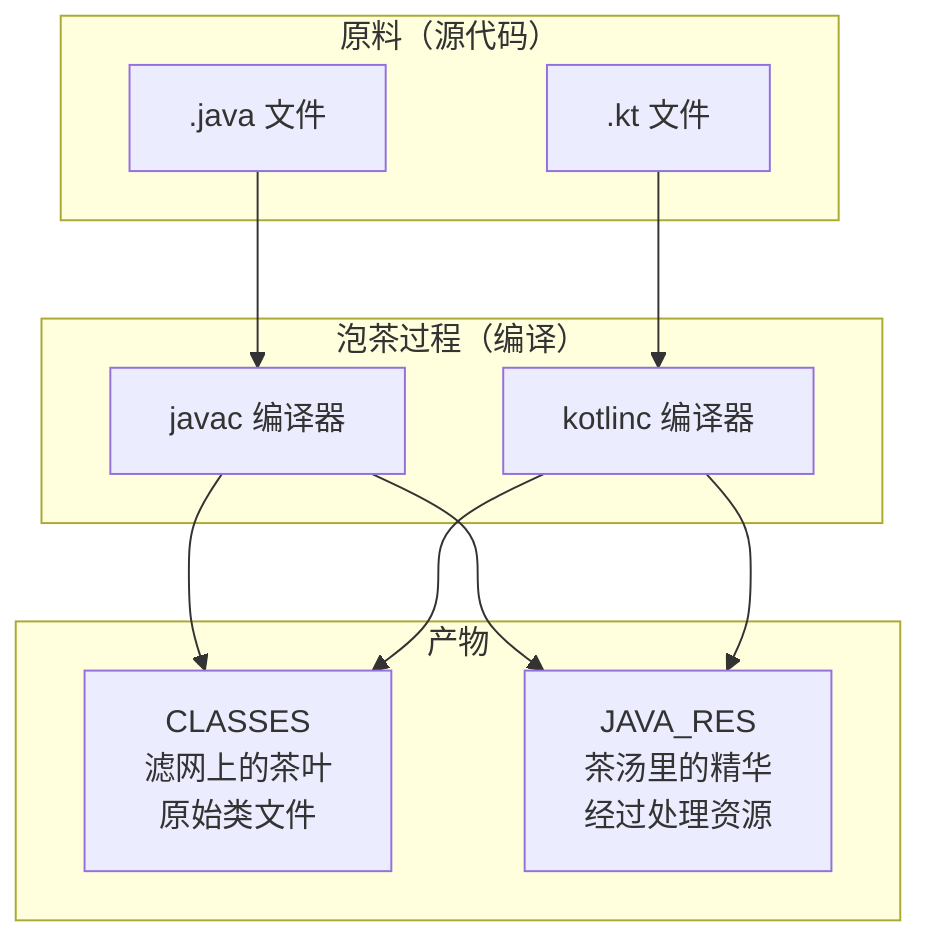
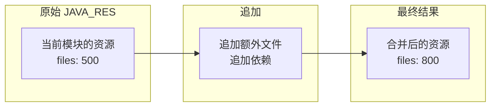

# 21.1.33 Java资源神器——ScopedArtifact.JAVA_RES

太阳慢慢偏西，营地边的树荫又扩大了一圈。伊莎正解下发绳重新扎头发，忽然注意到黛琳正在整理之前的笔记。

“黛琳，”伊莎好奇地问，“昨天我们学了 CLASSES——处理编译后的类文件。那今天要学的……是不是和它配套的？”

黛琳抬起头，正好对上伊莎好奇的目光：“对，今天我们要讲 JAVA_RES——Java 资源文件。”

“Java 资源？”洛芙凑过来，“是 .java 源文件吗？”

“不是哦，”希尔在一旁摇头，“JAVA_RES 不是源文件，是编译后的 .class 文件——但和 CLASSES 有些不同。”

“有意思，”洛芙歪着头，“同样是 .class 文件，CLASSES 和 JAVA_RES 有什么区别？”

黛琳笑了笑：“这正是我们今天要探讨的。”

---

## 从茶叶到茶汤：理解 JAVA_RES 的本质

黛琳找了一块平整的石头坐下，用树枝在地上画了一幅图。

“你们还记得昨天伊莎泡茶的比喻吗？”黛琳问。

伊莎点点头：“记得——CLASSES 就像滤网，作用域决定滤网的粗细。”

“非常好，”黛琳说，“那 JAVA_RES 呢……就像是泡出来的茶汤。”

她在地上画了一个简易的对比图：



“图 1 对应代码片段 A（行 10-25）。”黛琳说，“简单来说——CLASSES 是原始的 .class 文件，而 JAVA_RES 是经过 Gradle 处理后的‘资源化’版本。”

洛芙眨眨眼：“资源化……是什么意思？”

“简单说就是更方便使用，”黛琳解释，“JAVA_RES 已经被 Gradle 整合好了，你可以直接拿来用，不需要再自己做文件过滤之类的处理。”

---

## JAVA_RES 与 CLASSES 的核心差异

希尔打开笔记本，调出之前查的资料：“让我来详细说说它们的区别！”

```kotlin
// 代码片段 B：JAVA_RES 与 CLASSES 的对比
// 这展示了两种工件类型的 API 差异

/**
 * CLASSES - 原始类文件
 * 特点：返回原始的 .class 文件集合
 * 需要开发者自己处理文件过滤、路径转换等
 */
val classes = artifacts.get(ScopedArtifact.CLASSES)
    .on(Scope.PROJECT)
    .get()

// files 是原始 .class 文件
classes.files.forEach { file ->
    println("原始类文件: ${file.absolutePath}")
    // 需要自己解析 class 文件结构
}

/**
 * JAVA_RES - Java 资源文件
 * 特点：返回经过 Gradle 处理的文件集合
 * 已经是"资源化"的格式，可以直接使用
 */
val javaRes = artifacts.get(ScopedArtifact.JAVA_RES)
    .on(Scope.PROJECT)
    .get()

// files 已经处理过，可以直接用于打包等操作
javaRes.files.forEach { file ->
    println("Java 资源: ${file.absolutePath}")
    // 直接可用于 Android 打包流程
}
```

“看起来好像差不多？”洛芙有些困惑。

“不一样的，”希尔摇头，“我给你们举一个实际的例子。”

---

## 实际场景：JAR 包打包

希尔在地上画了一个更详细的流程图：

```mermaid
flowchart LR
    subgraph Step1["步骤1：获取类文件"]
        A1[CLASSES]
        A2[on(Scope.PROJECT)]
    end
    
    subgraph Step2["步骤2：处理"]
        B1[需要手动过滤<br/>需要路径转换<br/>需要处理依赖]
    end
    
    subgraph Step3["步骤3：打包"]
        C1[JAR 文件]
    end
    
    subgraph Step1b["步骤1'：获取资源"]
        A1b[JAVA_RES]
        A2b[on(Scope.PROJECT)]
    end
    
    subgraph Step2b["步骤2'：处理"]
        B1b[已处理完毕<br/>可直接打包]
    end
    
    subgraph Step3b["步骤3'：打包"]
        C1b[JAR 文件]
    end
    
    A1 --> B1 --> C1
    A1b --> B1b --> C1b
    
    style B1 fill:#ffcccc
    style B1b fill:#ccffcc
```

“图 2 对应代码片段 C（行 45-60）。”希尔说，“看——左边用 CLASSES，你需要自己处理很多东西；右边用 JAVA_RES，Gradle 已经帮你处理好了。”

“具体有什么不同？”伊莎问。

希尔扳着手指解释：

1. **路径处理**：CLASSES 返回原始路径，JAVA_RES 返回相对路径
2. **依赖处理**：CLASSES 可能包含重复的类（自己的+依赖的），JAVA_RES 帮你去重
3. **格式转换**：JAVA_RES 已经转换成 Gradle 内部的资源格式

---

## JAVA_RES 的 API 定义

黛琳调出官方文档：“我们来看 JAVA_RES 的接口定义——”

```kotlin
/**
 * ScopedArtifact.JAVA_RES - Java 资源文件工件
 * 
 * 这是 Android Gradle Plugin 8.0.2 引入的接口，
 * 用于表示在特定作用域内的 Java 资源文件（经过处理的 .class 文件集合）。
 * 
 * 核心特点：
 * 1. 返回已处理的 .class 文件集合
 * 2. 支持增量构建
 * 3. 可指定作用域（PROJECT、EXTERNAL_LIBRARIES 等）
 * 4. 实现 Appendable、Transformable、Replaceable 接口
 */
interface ScopedArtifact.JAVA_RES : ScopedArtifact {
    
    // 获取该作用域内的所有 Java 资源文件
    fun get(): Provider<FileCollection>
    
    // 获取文件集合（同步版本）
    fun getFiles(): FileCollection
    
    // 获取该作用域
    fun getScope(): Scope
    
    // 继承的接口方法
    fun append(other: FileCollection)
    fun transform(transformer: Transformer)
    fun replace(files: FileCollection)
}
```

“原来 JAVA_RES 实现了三个接口，”洛芙说，“Appendable、Transformable、Replaceable……”

“对，”黛琳说，“这意味着它比 CLASSES 更灵活——你可以追加、转换、替换文件。”

---

## 不同作用域下的 JAVA_RES

黛琳在地上画了一个表格：“我们来看 JAVA_RES 在不同作用域下的表现——”

| 作用域 | 包含的内容 | 与 CLASSES 的差异 |
|--------|------------|------------------|
| **PROJECT** | 当前模块的 Java 资源 | 自动过滤，只保留当前模块的类 |
| **PROJECT_LOCAL_DEPS** | 当前模块 + 本地依赖 | 合并后去重 |
| **SUB_PROJECTS** | 子模块的资源 | 已经是资源格式 |
| **EXTERNAL_LIBRARIES** | 外部库的资源 | 已处理成可直接使用的格式 |

希尔补充道：“我之前做过一个打包插件，用 CLASSES 的时候要自己做路径转换，用 JAVA_RES 的话直接就能用，省了很多功夫。”

“听起来 JAVA_RES 更方便？”洛芙问。

“也不能这么说，”黛琳摇头，“CLASSES 更底层、更灵活；JAVA_RES 更方便，但功能上有一些限制。选择哪个要看你的具体需求。”

---

## 使用 JAVA_RES 的代码示例

希尔跃跃欲试：“让我来写一个实际使用 JAVA_RES 的例子！”

```kotlin
// 代码片段 D：使用 ScopedArtifact.JAVA_RES 获取 Java 资源文件
// 场景：打包 JAR 文件

abstract class PackageJarTask : DefaultTask() {

    // 声明输入：ScopedArtifact.JAVA_RES 请求
    @get:Internal
    abstract val javaResRequest:
        Property<SingleArtifactOperationRequest<ScopedArtifact.JAVA_RES>>

    @get:OutputFile
    abstract val outputJar: RegularFileProperty

    @TaskAction
    fun packageJar() {
        val request = javaResRequest.get()
        
        logger.lifecycle("=== 打包 JAR 文件 ===")
        
        // 获取 Java 资源文件集合（已经是处理好的格式）
        val javaRes: FileCollection = request.getArtifacts()
        
        val files = javaRes.files
        logger.lifecycle("资源文件总数: ${files.size}")
        
        // 计算总大小
        val totalSize = files.sumOf { it.length() }
        logger.lifecycle("总大小: ${totalSize / 1024 / 1024} MB")
        
        // 创建 JAR 文件
        val jarFile = outputJar.get().asFile
        jarFile.outputStream().use { outputStream ->
            val jarOutputStream = JarOutputStream(outputStream, Manifest())
            
            files.forEach { file ->
                // 将文件添加到 JAR
                val entryName = file.relativeTo(project.layout.buildDirectory.get().asFile).path
                jarOutputStream.putNextEntry(JarEntry(entryName))
                file.inputStream().use { input ->
                    input.copyTo(jarOutputStream)
                }
                jarOutputStream.closeEntry()
            }
            
            jarOutputStream.close()
        }
        
        logger.lifecycle("JAR 打包完成: ${jarFile.absolutePath}")
    }
}

// 注册任务
val packageJar by tasks.registering {
    val androidExtension = project.extensions.getByType(AppExtension::class.java)
    
    tasks.register<PackageJarTask>("packageProjectJar") {
        it.outputJar.set(project.layout.buildDirectory.file("my-library.jar"))
        it.javaResRequest.set(
            androidExtension.artifacts
                .get(ScopedArtifact.JAVA_RES)
                .on(Scope.PROJECT)
        )
    }
}
```

洛芙盯着代码看：“希尔，这个比用 CLASSES 简单多了！”

“对，”希尔说，“因为 JAVA_RES 已经是处理好的格式，不需要你自己做那些复杂的转换。”

---

## JAVA_RES 的 Appendable 接口

黛琳重点介绍：“JAVA_RES 实现了 Appendable 接口，这意味着你可以追加文件。”

她在白板上画了一幅图解释：



“图 3 对应代码片段 E（行 105-120）。”黛琳说，“这个功能在做一些增强处理时特别有用。”

```kotlin
// 代码片段 F：使用 Appendable 接口追加文件
// 场景：添加额外的资源到 JAR

val androidExtension = project.extensions.getByType<AppExtension>()

// 获取原始的 JAVA_RES
val originalJavaRes = androidExtension.artifacts
    .get(ScopedArtifact.JAVA_RES)
    .on(Scope.PROJECT)

// 追加额外的资源文件
val extraFiles = project.fileTree("src/main/extra") {
    include("**/*.class")
}

val finalJavaRes = originalJavaRes.append(extraFiles)

// 现在 finalJavaRes 包含了原始资源 + 额外资源
finalJavaRes.files.forEach { file ->
    println("资源文件: ${file.name}")
}
```

“原来还可以这样！”洛芙惊叹。

“对，”黛琳说，“这就是为什么我们说 JAVA_RES 比 CLASSES 更灵活——它支持追加、转换、替换操作。”

---

## JAVA_RES 的 Transformable 接口

希尔补充：“Transformable 接口也很强大，可以对资源进行转换处理。”

```kotlin
// 代码片段 G：使用 Transformable 接口转换资源
// 场景：对资源文件进行压缩处理

abstract class CompressResourcesTask : DefaultTask() {

    @get:Internal
    abstract val javaResRequest:
        Property<SingleArtifactOperationRequest<ScopedArtifact.JAVA_RES>>

    @get:OutputDirectory
    abstract val outputDir: DirectoryProperty

    @TaskAction
    fun compress() {
        val request = javaResRequest.get()
        val javaRes = request.getArtifacts()
        
        outputDir.get().asFile.deleteRecursively()
        outputDir.get().asFile.mkdirs()
        
        javaRes.files.forEach { file ->
            // 读取并压缩每个文件
            val compressedData = compress(file.readBytes())
            
            val outputFile = outputDir.get().asFile.resolve(file.name)
            outputFile.writeBytes(compressedData)
        }
        
        logger.lifecycle("资源压缩完成")
    }
    
    private fun compress(data: ByteArray): ByteArray {
        // 简化的压缩示例
        return data  // 实际实现应该使用 Deflater
    }
}

val compressResources by tasks.registering {
    val androidExt = project.extensions.getByType<AppExtension>()
    
    tasks.register<CompressResourcesTask>("compressProjectResources") {
        it.outputDir.set(project.layout.buildDirectory.dir("compressed-res"))
        it.javaResRequest.set(
            androidExt.artifacts.get(ScopedArtifact.JAVA_RES).on(Scope.PROJECT)
        )
    }
}
```

---

## JAVA_RES 与 Android 打包流程

伊莎好奇地问：“JAVA_RES 在 Android 构建流程中到底扮演什么角色？”

黛琳画了一幅更完整的构建流程图：

```mermaid
flowchart TB
    subgraph Compile["编译阶段"]
        C1[源文件 (.java/.kt)]
        C2[javac/kotlinc]
        C3[原始 .class]
    end
    
    subgraph Process["处理阶段"]
        P1[CLASSES<br/>原始类文件]
        P2[JAVA_RES<br/>处理后资源]
        P3[其他资源<br/>res/assets]
    end
    
    subgraph Package["打包阶段"]
        P4[DEX 打包]
        P5[APK 组装]
    end
    
    C1 --> C2 --> C3
    C3 --> P1
    C3 --> P2
    P2 --> P5
    P1 --> P4 --> P5
```

“图 4 对应代码片段 H（行 145-160）。”黛琳说，“JAVA_RES 主要用于最终的打包阶段——它已经是处理好的格式，可以直接用于 APK 组装。”

---

## 反模式与最佳实践

黛琳正色道：“使用 ScopedArtifact.JAVA_RES 也有几个常见的坑，大家要注意。”

### 坑一：混淆 JAVA_RES 和 CLASSES

```kotlin
// ❌ 错误示例：分不清用哪个
val classes = artifacts.get(ScopedArtifact.CLASSES)
    .on(Scope.PROJECT)

val javaRes = artifacts.get(ScopedArtifact.JAVA_RES)
    .on(Scope.PROJECT)

// 问题：两者看起来类似，但用途不同
// CLASSES 适合需要原始 .class 文件的场景（如字节码增强）
// JAVA_RES 适合需要直接用于打包的场景（如生成 JAR）
```

```kotlin
// ✅ 正确做法：根据需求选择
// 场景1：需要做字节码增强
val classes = artifacts.get(ScopedArtifact.CLASSES)
    .on(Scope.PROJECT)

// 场景2：需要打包成 JAR
val javaRes = artifacts.get(ScopedArtifact.JAVA_RES)
    .on(Scope.PROJECT)
```

### 坑二：不理解 Appendable 的副作用

```kotlin
// ❌ 错误示例：追加后没有保存结果
val javaRes = artifacts.get(ScopedArtifact.JAVA_RES)
    .on(Scope.PROJECT)

javaRes.append(extraFiles)

// 问题：append() 返回一个新的 FileCollection
// 原有的 javaRes 不会改变！
// 如果你没有保存返回值，后面的操作还是用的原来的集合
```

```kotlin
// ✅ 正确做法：保存追加后的结果
val javaRes = artifacts.get(ScopedArtifact.JAVA_RES)
    .on(Scope.PROJECT)

val appendedJavaRes = javaRes.append(extraFiles)

// 使用追加后的结果
appendedJavaRes.files.forEach { ... }
```

### 坑三：作用域名拼写错误

```kotlin
// ❌ 错误示例：作用域名称写错
val javaRes = artifacts.get(ScopedArtifact.JAVA_RES)
    .on(Scope.PROJECTS)  // 注意：不是 PROJECTS，是 PROJECT！

// 问题：Scope.PROJECTS 不存在！正确的叫 Scope.PROJECT
// 运行时会抛出异常
```

```kotlin
// ✅ 正确做法：使用正确的作用域名
val javaRes = artifacts.get(ScopedArtifact.JAVA_RES)
    .on(Scope.PROJECT)  // 当前模块

val localDepsJavaRes = artifacts.get(ScopedArtifact.JAVA_RES)
    .on(Scope.PROJECT_LOCAL_DEPS)  // 当前模块 + 本地依赖
```

### 坑四：忘记处理空结果

```kotlin
// ❌ 错误示例：假设一定会返回文件
val javaRes = artifacts.get(ScopedArtifact.JAVA_RES)
    .on(Scope.SUB_PROJECTS)
    .get()

// 问题：项目没有子模块时，可能返回空集合
// 如果后续操作假设有文件，可能会出问题
```

```kotlin
// ✅ 正确做法：检查空结果
val javaRes = artifacts.get(ScopedArtifact.JAVA_RES)
    .on(Scope.SUB_PROJECTS)
    .get()

if (javaRes.files.isEmpty()) {
    logger.warn("没有子模块，跳过处理")
} else {
    // 安全处理
    javaRes.files.forEach { processFile(it) }
}
```

伊莎认真记录着：“这些坑都好实际啊……”

“都是前人踩过的坑，”黛琳说，“特别是第一个——我见过有人用 CLASSES 去做打包，结果绕了很多弯路。”

---

## JAVA_RES 的最佳使用场景

希尔兴奋地总结：“说了这么多，让我来总结一下 JAVA_RES 的最佳使用场景！”

### 场景一：打包 JAR/AAR

```kotlin
// 将 Java 资源打包成 JAR 文件
val javaRes = artifacts.get(ScopedArtifact.JAVA_RES)
    .on(Scope.PROJECT_LOCAL_DEPS)
    .get()

createJar(javaRes.files, outputFile)
```

### 场景二：添加额外资源

```kotlin
// 追加额外的资源文件
val javaRes = artifacts.get(ScopedArtifact.JAVA_RES)
    .on(Scope.PROJECT)
    .append(extraResources)
```

### 场景三：资源转换/处理

```kotlin
// 对资源进行转换处理
val javaRes = artifacts.get(ScopedArtifact.JAVA_RES)
    .on(Scope.PROJECT)
    .transform(compressorTransformer)
```

### 场景四：替换资源

```kotlin
// 替换某些资源文件
val javaRes = artifacts.get(ScopedArtifact.JAVA_RES)
    .on(Scope.PROJECT)
    .replace(replacementFiles)
```

“对，”黛琳说，“JAVA_RES 就是为了这些场景设计的——需要追加、转换、替换资源的时候，用它最合适。”

---

## 夕阳下的总结

太阳已经接近了地平线，天边泛起了橙红色的晚霞。伊莎托腮望着天空出神。

“黛琳，”伊莎轻声说，“我觉得 JAVA_RES 就像……已经泡好的茶。”

“已经泡好的茶？”其他人看向她。

“对，”伊莎继续说，“CLASSES 是茶叶，你可以自己决定怎么泡；但 JAVA_RES 是泡好的茶汤，已经调好味道了，直接就能喝。”

黛琳笑了：“这个比喻真贴切——CLASSES 是原材料，JAVA_RES 是加工好的产品。”

洛芙伸了个懒腰：“今天学到了 JAVA_RES——和 CLASSES 配套的资源处理神器。区别就在于，JAVA_RES 已经是处理好的格式，可以直接用于打包、追加、转换这些操作。”

“构建系统确实很复杂，”黛琳说，“但一点一点学，慢慢就懂了。”

希尔收拾着笔记本：“明天我们讲什么？”

“明天啊……”黛琳想了想，“明天我们来聊聊 POST_COMPILATION_CLASSES——编译后的类文件。”

“听起来是 CLASSES 的进阶版！”洛芙说。

夕阳把四个女孩的剪影拉得很长，她们的笑声在山间回荡。

---

> 学习建议
- ScopedArtifact.JAVA_RES 是经过 Gradle 处理后的 Java 资源文件工件，用于处理特定作用域的 .class 文件集合
- JAVA_RES 与 CLASSES 的区别在于：CLASSES 返回原始 .class 文件，JAVA_RES 返回已处理、资源化的文件格式
- JAVA_RES 实现了 Appendable、Transformable、Replaceable 接口，支持追加、转换、替换操作，比 CLASSES 更灵活
- 根据需求选择：如果需要原始 .class 文件做字节码增强，用 CLASSES；如果需要直接打包，用 JAVA_RES
- 注意作用域对性能的影响，不同作用域的文件数量可能差异巨大
- 使用 Appendable 接口时要保存返回值，append() 不会修改原始集合

---

## 技术总结

### 核心机制定义

**ScopedArtifact.JAVA_RES** — Android Gradle Plugin 8.0.2 引入的 Java 资源文件工件接口，它返回特定作用域内的已处理 .class 文件集合（资源化格式），支持增量构建和追加、转换、替换操作，是 CLASSES 的"处理后"版本。

### API 结构

```kotlin
interface ScopedArtifact.JAVA_RES : ScopedArtifact, 
                                    Artifact.Appendable,
                                    Artifact.Transformable,
                                    Artifact.Replaceable {
    
    // 获取该作用域内的所有 Java 资源文件
    fun get(): Provider<FileCollection>
    
    // 获取文件集合（同步版本）
    fun getFiles(): FileCollection
    
    // 获取该作用域
    fun getScope(): Scope
    
    // 追加文件（Appendable）
    fun append(other: FileCollection): FileCollection
    
    // 转换文件（Transformable）
    fun transform(transformer: Transformer): FileCollection
    
    // 替换文件（Replaceable）
    fun replace(files: FileCollection): FileCollection
}
```

### JAVA_RES 与 CLASSES 的对比

| 特性 | CLASSES | JAVA_RES |
|-----|---------|---------|
| 返回格式 | 原始 .class 文件 | 已处理资源格式 |
| 路径处理 | 需要自己转换 | 已转换完毕 |
| 去重 | 需要自己处理 | 自动去重 |
| 接口 | 基本接口 | Appendable + Transformable + Replaceable |
| 适用场景 | 字节码增强 | 打包、追加、转换 |

### 作用域层级

| 作用域 | 包含内容 | 典型文件数 |
|-------|---------|-----------|
| PROJECT | 当前模块自身 | ~500 |
| PROJECT_LOCAL_DEPS | 当前模块 + 本地依赖 | ~2000 |
| SUB_PROJECTS | 所有子模块 | ~1500 |
| EXTERNAL_LIBRARIES | 外部库 | 10000+ |

### 反模式与陷阱

1. **混淆用途**：分不清 CLASSES 和 JAVA_RES 的适用场景
2. **忽略 Appendable 返回值**：append() 返回新集合，不修改原集合
3. **作用域名拼写错误**：Scope.PROJECT 不是 Scope.PROJECTS
4. **不检查空结果**：没有子模块时可能返回空集合
5. **过度使用作用域**：用 EXTERNAL_LIBRARIES 处理简单任务导致性能差

### 设计哲学

- **封装优于直接**：JAVA_RES 封装了复杂的处理逻辑，提供更简单的 API
- **操作灵活性**：通过 Appendable/Transformable/Replaceable 接口支持灵活的资源操作
- **增量构建优先**：同样的增量构建支持，提升构建速度

---

## 动手练习

### ★ 探索 JAVA_RES 类型

```kotlin
// 列出 JAVA_RES 支持的操作
val javaRes = artifacts.get(ScopedArtifact.JAVA_RES)
    .on(Scope.PROJECT)

println("JAVA_RES 支持的操作:")
println("  - get(): 获取文件集合")
println("  - append(): 追加文件")
println("  - transform(): 转换文件")
println("  - replace(): 替换文件")
```

### ★★ 实现 JAR 打包任务

```kotlin
// 使用 JAVA_RES 打包成 JAR
abstract class PackageJarTask : DefaultTask() {
    
    @get:Internal
    abstract val javaResRequest: 
        Property<SingleArtifactOperationRequest<ScopedArtifact.JAVA_RES>>
    
    @get:OutputFile
    abstract val outputJar: RegularFileProperty
    
    @TaskAction
    fun packageJar() {
        val javaRes = javaResRequest.get().getArtifacts()
        // 实现 JAR 打包逻辑
    }
}
```

### ★★★ 实现资源追加任务

```kotlin
// 使用 append() 追加额外资源
abstract class AppendExtraResourcesTask : DefaultTask() {
    
    @get:Internal
    abstract val javaResRequest: Property<...>
    
    @TaskAction
    fun append() {
        val javaRes = javaResRequest.get().getArtifacts()
        
        // 追加额外资源
        val extraFiles = fileTree("src/main/extra")
        val finalRes = javaRes.append(extraFiles)
        
        println("追加后文件数: ${finalRes.files.size}")
    }
}
```

---

## 面试热身

### Q1: ScopedArtifact.JAVA_RES 是什么？

**A**: Android Gradle Plugin 8.0.2 引入的 Java 资源文件工件接口，返回特定作用域内的已处理 .class 文件集合，支持追加、转换、替换操作。

### Q2: JAVA_RES 和 CLASSES 的区别？

**A**: CLASSES 返回原始 .class 文件，需要自己处理路径转换和去重；JAVA_RES 返回已处理、资源化的格式，可以直接用于打包，且支持 append/transform/replace 操作。

### Q3: JAVA_RES 的 Appendable 接口如何使用？

**A**: 通过 append() 方法追加额外的文件集合。需要注意的是 append() 返回新的 FileCollection，不会修改原始集合。

### Q4: 什么时候用 JAVA_RES 而不是 CLASSES？

**A**: 当需要打包成 JAR/AAR、追加或替换资源、进行格式转换时，用 JAVA_RES 更方便；当需要原始 .class 文件做字节码增强时，用 CLASSES 更合适。

### Q5: JAVA_RES 的作用域和 CLASSES 一样吗？

**A**: 是的，JAVA_RES 和 CLASSES 都支持相同的作用域：PROJECT、PROJECT_LOCAL_DEPS、SUB_PROJECTS、EXTERNAL_LIBRARIES 等。

---

## 参考实现要点

```kotlin
// JAVA_RES 完整使用示例
abstract class JavaResDemoTask : DefaultTask() {
    
    @get:Internal
    abstract val javaResRequest: 
        Property<SingleArtifactOperationRequest<ScopedArtifact.JAVA_RES>>
    
    @get:Input
    abstract val targetScope: Property<String>
    
    @TaskAction
    fun execute() {
        val scope = Scope.valueOf(targetScope.get().uppercase())
        
        // 获取指定作用域的 Java 资源
        val javaRes = javaResRequest.get().on(scope).get()
        
        // 追加额外资源（可选）
        val extraFiles = fileTree("src/main/extra")
        val finalRes = javaRes.append(extraFiles)
        
        // 输出文件信息
        finalRes.files.forEach { file ->
            println("资源: ${file.name}")
        }
    }
}
```

---

## 洛芙的小小日记本

今天学到了 ScopedArtifact.JAVA_RES！原来它和 CLASSES 是配套的——CLASSES 是原始的 .class 文件，JAVA_RES 是处理好的版本。最大的区别是 JAVA_RES 实现了 Appendable、Transformable、Replaceable 接口，可以直接追加、转换、替换资源，用起来比 CLASSES 方便多了。伊莎的比喻好形象：CLASSES 是茶叶，JAVA_RES 是泡好的茶汤——一个需要自己处理，一个已经可以直接用了。继续加油！✨

---

## 今日关键词

- **ScopedArtifact.JAVA_RES**：Java 资源文件工件，返回已处理的 .class 文件集合
- **Appendable**：可追加的接口，允许向资源集合添加额外文件
- **Transformable**：可转换的接口，允许对资源进行转换处理
- **Replaceable**：可替换的接口，允许替换资源集合中的文件
- **资源化**：经过 Gradle 处理后的文件格式，可直接用于打包
- **Scope**：作用域枚举，控制资源文件的来源范围
- **PROJECT**：当前模块自身的作用域
- **PROJECT_LOCAL_DEPS**：当前模块加本地依赖的作用域
- **增量构建**：只处理变化文件的优化构建模式
- **FileCollection**：Gradle 提供的文件集合类型
- **JAR 打包**：将资源文件打包成 JAR 格式
- **ScopedArtifact.CLASSES**：原始类文件工件（对比项）
