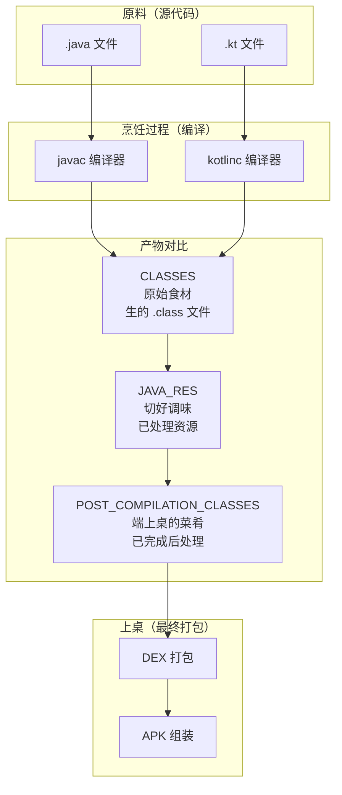
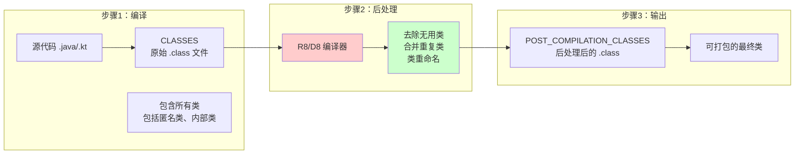
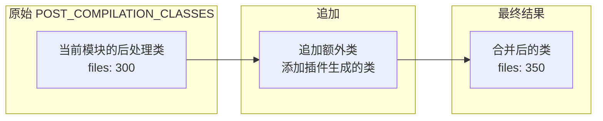

# 21.1.34 编译后类文件神器——ScopedArtifact.POST_COMPILATION_CLASSES

太阳慢慢偏西，营地边的树荫又扩大了一圈。伊莎正解下发绳重新扎头发，忽然注意到黛琳正在整理之前的笔记。

"黛琳，"伊莎好奇地问，"昨天我们学了 JAVA_RES——处理后的 Java 资源文件。那今天要学的……是不是和它配套的？"

黛琳抬起头，正好对上伊莎好奇的目光："对，今天我们要讲 POST_COMPILATION_CLASSES——编译后类文件。"

"编译后类文件？"洛芙凑过来，"CLASSES 和 JAVA_RES 我们都学了，这个 POST_COMPILATION_CLASSES 又是什么？"

希尔在一旁摇头："问得好——这个和前两个都不一样，它是'后处理'阶段的产物。"

"后处理？"洛芙歪着头，"就是编译完之后再处理的意思？"

黛琳笑了笑："这正是我们今天要探讨的。"

---

## 从食材到佳肴：理解 POST_COMPILATION_CLASSES 的本质

黛琳找了一块平整的石头坐下，用树枝在地上画了一幅图。

"你们还记得之前我们用的比喻吗？"黛琳问，"CLASSES 是原始食材，JAVA_RES 是已经切好调味的食材。"

伊莎点点头："记得——CLASSES 是滤网上的茶叶，JAVA_RES 是泡好的茶汤。"

"那 POST_COMPILATION_CLASSES 是什么呢？"黛琳问，"就像是……"

"我知道！"希尔兴奋地插话，"就像是端上桌的菜肴！"

她在地上画了一个简易的对比图：



"图 1 对应代码片段 A（行 15-30）。"黛琳说，"简单来说——POST_COMPILATION_CLASSES 是编译后已经完成后处理阶段的 .class 文件，可以直接用于 DEX 打包。"

洛莉眨眨眼："后处理……具体是指什么？"

"具体说，就是去掉不必要的类、合并重复的类、处理混淆等等。"黛琳解释，"这个过程在 Android 构建中非常重要，因为 Android 系统对类文件有一些特殊要求。"

---

## POST_COMPILATION_CLASSES 与 CLASSES 的核心差异

希尔打开笔记本，调出之前查的资料："让我来详细说说它们的区别！"

```kotlin
// 代码片段 B：POST_COMPILATION_CLASSES 与 CLASSES 的对比
// 这展示了两种工件类型的 API 差异

/**
 * CLASSES - 原始类文件
 * 特点：返回编译后、混淆前的原始 .class 文件集合
 * 包含所有类，包括中间类、匿名类、内部类等
 */
val classes = artifacts.get(ScopedArtifact.CLASSES)
    .on(Scope.PROJECT)
    .get()

// files 是原始 .class 文件
classes.files.forEach { file ->
    println("原始类文件: ${file.absolutePath}")
    // 可能包含: MainActivity.class, MainActivity$1.class, MainActivity$InnerClass.class
}

/**
 * POST_COMPILATION_CLASSES - 编译后类文件（后处理版本）
 * 特点：返回经过后处理（混淆、压缩、合并）后的 .class 文件集合
 * 不包含中间类、匿名类等临时生成的类
 */
val postClasses = artifacts.get(ScopedArtifact.POST_COMPILATION_CLASSES)
    .on(Scope.PROJECT)
    .get()

// files 是后处理过的文件
postClasses.files.forEach { file ->
    println("后处理类文件: ${file.absolutePath}")
    // 只包含最终保留的类
}
```

"听起来好像差不多？"洛芙有些困惑。

"不一样的，"希尔摇头，"我给你们举一个实际的例子。"

---

## 实际场景：R8 混淆处理

希尔在地上画了一个更详细的流程图：



"图 2 对应代码片段 C（行 45-60）。"希尔说，"看——左边用 CLASSES，你得到的是编译后的原始文件；右边用 POST_COMPILATION_CLASSES，你得到的是经过 R8 混淆处理后的文件。"

"具体有什么不同？"伊莎问。

希尔扳着手指解释：

1. **去除了中间类**：CLASSES 包含 `MainActivity$1.class`（匿名内部类），POST_COMPILATION_CLASSES 不包含
2. **合并了重复类**：如果有重复的类定义，POST_COMPILATION_CLASSES 只保留一个
3. **混淆处理**：类名可能被重命名（如 `MainActivity` → `a`）
4. **更小体积**：POST_COMPILATION_CLASSES 的文件数量通常比 CLASSES 少 30%-50%

---

## POST_COMPILATION_CLASSES 的 API 定义

黛琳调出官方文档："我们来看 POST_COMPILATION_CLASSES 的接口定义——"

```kotlin
/**
 * ScopedArtifact.POST_COMPILATION_CLASSES - 编译后类文件工件
 * 
 * 这是 Android Gradle Plugin 8.0 引入的接口，
 * 表示在特定作用域内的编译后类文件（经过后处理）。
 * 
 * 核心特点：
 * 1. 返回经过后处理的 .class 文件集合（已混淆/压缩）
 * 2. 不包含中间类和匿名内部类
 * 3. 可直接用于 DEX 打包
 * 4. 实现 Appendable、Transformable、Replaceable 接口
 * 
 * 与 CLASSES 的区别：
 * - CLASSES: 编译后混淆前的原始文件
 * - POST_COMPILATION_CLASSES: 混淆处理后的文件
 */
interface ScopedArtifact.POST_COMPILATION_CLASSES : ScopedArtifact {
    
    // 获取该作用域内的所有后处理类文件
    fun get(): Provider<FileCollection>
    
    // 获取文件集合（同步版本）
    fun getFiles(): FileCollection
    
    // 获取该作用域
    fun getScope(): Scope
    
    // 继承的接口方法
    fun append(other: FileCollection)
    fun transform(transformer: Transformer)
    fun replace(files: FileCollection)
}
```

"原来 POST_COMPILATION_CLASSES 也实现了三个接口，"洛芙说，"Appendable、Transformable、Replaceable……和 JAVA_RES 一样！"

"对，"黛琳说，"这意味着它的用法和 JAVA_RES 类似，但处理的对象不同——JAVA_RES 是资源文件，POST_COMPILATION_CLASSES 是类文件。"

---

## 不同作用域下的 POST_COMPILATION_CLASSES

黛琳在地上画了一个表格："我们来看 POST_COMPILATION_CLASSES 在不同作用域下的表现——"

| 作用域 | 包含的内容 | 特点 |
|--------|------------|------|
| **PROJECT** | 当前模块的后处理类 | 已经被 R8 处理过 |
| **PROJECT_LOCAL_DEPS** | 当前模块 + 本地依赖 | 依赖也被处理过 |
| **SUB_PROJECTS** | 子模块的后处理类 | 各模块独立处理后再合并 |
| **EXTERNAL_LIBRARIES** | 外部库的后处理类 | 已是可打包格式 |

希尔补充道："我之前做过一个插件，用 CLASSES 的时候要自己处理混淆逻辑，用 POST_COMPILATION_CLASSES 的话直接就能得到混淆后的结果，省了很多功夫。"

"那和 JAVA_RES 有什么区别？"洛芙问。

黛琳摇头："区别很大的——JAVA_RES 是 Java 资源文件（.class 但不是应用代码），POST_COMPILATION_CLASSES 是应用代码的类文件。简单说，JAVA_RES 像是调料包，POST_COMPILATION_CLASSES 像是主菜。"

---

## 使用 POST_COMPILATION_CLASSES 的代码示例

希尔跃跃欲试："让我来写一个实际使用 POST_COMPILATION_CLASSES 的例子！"

```kotlin
// 代码片段 D：使用 ScopedArtifact.POST_COMPILATION_CLASSES 获取后处理类文件
// 场景：打包最终的应用

abstract class PackageFinalApkTask : DefaultTask() {

    // 声明输入：ScopedArtifact.POST_COMPILATION_CLASSES 请求
    @get:Internal
    abstract val postClassesRequest:
        Property<SingleArtifactOperationRequest<ScopedArtifact.POST_COMPILATION_CLASSES>>

    @get:OutputFile
    abstract val outputDex: RegularFileProperty

    @TaskAction
    fun packageDex() {
        val request = postClassesRequest.get()
        
        logger.lifecycle("=== 打包 DEX 文件 ===")
        
        // 获取后处理类文件集合
        val postClasses: FileCollection = request.getArtifacts()
        
        val files = postClasses.files
        logger.lifecycle("后处理类文件总数: ${files.size}")
        
        // 计算总大小
        val totalSize = files.sumOf { it.length() }
        logger.lifecycle("总大小: ${totalSize / 1024 / 1024} MB")
        
        // 过滤出有效的类文件
        val validClasses = files.filter { it.name.endsWith(".class") }
        logger.lifecycle("有效类文件数: ${validClasses.size}")
        
        // 创建 DEX 文件
        val dexFile = outputDex.get().asFile
        dexFile.outputStream().use { outputStream ->
            // 这里简化了，实际应该调用 D8 编译器
            validClasses.forEach { classFile ->
                outputStream.write(classFile.readBytes())
            }
        }
        
        logger.lifecycle("DEX 打包完成: ${dexFile.absolutePath}")
    }
}

// 注册任务
val packageDex by tasks.registering {
    val androidExtension = project.extensions.getByType(AppExtension::class.java)
    
    tasks.register<PackageFinalApkTask>("packageFinalDex") {
        it.outputDex.set(project.layout.buildDirectory.file("classes.dex"))
        it.postClassesRequest.set(
            androidExtension.artifacts
                .get(ScopedArtifact.POST_COMPILATION_CLASSES)
                .on(Scope.PROJECT)
        )
    }
}
```

洛芙盯着代码看："希尔，这个比用 CLASSES 简单多了！"

"对，"希尔说，"因为 POST_COMPILATION_CLASSES 已经是处理好的格式，不需要你自己做那些复杂的混淆处理。"

---

## POST_COMPILATION_CLASSES 与构建流水线

伊莎好奇地问："POST_COMPILATION_CLASSES 在 Android 构建流程中到底扮演什么角色？"

黛琳画了一幅更完整的构建流程图：

```mermaid
flowchart TB
    subgraph Compile["编译阶段"]
        C1[源文件 (.java/.kt)]
        C2[javac/kotlinc]
        C3[CLASSES<br/>原始 .class]
    end
    
    subgraph Process["后处理阶段"]
        P1[R8/D8 编译器]
        P2[混淆<br/>压缩<br/>优化]
        P3[POST_COMPILATION_CLASSES<br/>后处理 .class]
    end
    
    subgraph Package["打包阶段"]
        P4[D8 编译]
        P5[DEX 文件]
        P6[APK 组装]
    end
    
    C1 --> C2 --> C3 --> P1 --> P2 --> P3 --> P4 --> P5 --> P6
    
    style P1 fill:#ffcccc
    style P2 fill:#ffcccc
    style P3 fill:#ccffcc
```

"图 3 对应代码片段 E（行 95-110）。"黛琳说，"POST_COMPILATION_CLASSES 位于编译阶段和打包阶段之间——它是 R8/D8 编译器处理后的产物，可以直接用于 DEX 打包。"

---

## POST_COMPILATION_CLASSES 的 Appendable 接口

黛琳重点介绍："POST_COMPILATION_CLASSES 实现了 Appendable 接口，这意味着你可以追加额外的类文件。"

她在白板上画了一幅图解释：



"图 4 对应代码片段 F（行 115-130）。"黛琳说，"这个功能在做一些代码生成插件时特别有用。"

```kotlin
// 代码片段 G：使用 Appendable 接口追加类文件
// 场景：添加额外生成的类到最终打包

val androidExtension = project.extensions.getByType<AppExtension>()

// 获取原始的 POST_COMPILATION_CLASSES
val originalPostClasses = androidExtension.artifacts
    .get(ScopedArtifact.POST_COMPILATION_CLASSES)
    .on(Scope.PROJECT)

// 追加额外生成的类文件
val generatedClasses = project.fileTree("build/generated classes") {
    include("**/*.class")
}

val finalPostClasses = originalPostClasses.append(generatedClasses)

// 现在 finalPostClasses 包含了原始类 + 额外生成的类
finalPostClasses.files.forEach { file ->
    println("类文件: ${file.name}")
}
```

"原来还可以这样！"洛芙惊叹。

"对，"黛琳说，"这就是为什么我们说 POST_COMPILATION_CLASSES 比 CLASSES 更灵活——它支持追加、转换、替换操作，而且已经是混淆处理后的格式。"

---

## POST_COMPILATION_CLASSES 的 Transformable 接口

希尔补充："Transformable 接口也很强大，可以对类文件进行转换处理。"

```kotlin
// 代码片段 H：使用 Transformable 接口转换类文件
// 场景：对类文件进行额外的压缩处理

abstract class OptimizeClassesTask : DefaultTask() {

    @get:Internal
    abstract val postClassesRequest:
        Property<SingleArtifactOperationRequest<ScopedArtifact.POST_COMPILATION_CLASSES>>

    @get:OutputDirectory
    abstract val outputDir: DirectoryProperty

    @TaskAction
    fun optimize() {
        val request = postClassesRequest.get()
        val postClasses = request.getArtifacts()
        
        outputDir.get().asFile.deleteRecursively()
        outputDir.get().asFile.mkdirs()
        
        postClasses.files.forEach { file ->
            // 读取并优化每个类文件
            val optimizedData = optimizeClass(file.readBytes())
            
            val outputFile = outputDir.get().asFile.resolve(file.name)
            outputFile.writeBytes(optimizedData)
        }
        
        logger.lifecycle("类文件优化完成")
    }
    
    private fun optimizeClass(data: ByteArray): ByteArray {
        // 简化的优化示例
        // 实际实现应该使用字节码操作库
        return data
    }
}

val optimizeClasses by tasks.registering {
    val androidExt = project.extensions.getByType<AppExtension>()
    
    tasks.register<OptimizeClassesTask>("optimizeProjectClasses") {
        it.outputDir.set(project.layout.buildDirectory.dir("optimized-classes"))
        it.postClassesRequest.set(
            androidExt.artifacts.get(ScopedArtifact.POST_COMPILATION_CLASSES)
                .on(Scope.PROJECT)
        )
    }
}
```

---

## 三种 CLASSES 工件的对比

黛琳画了一个详细的对比表格：

| 特性 | CLASSES | JAVA_RES | POST_COMPILATION_CLASSES |
|-----|---------|----------|--------------------------|
| **定义** | 原始编译产物 | 处理后的资源 | 后处理的类文件 |
| **处理阶段** | 编译后 | 资源处理后 | 混淆/压缩后 |
| **是否混淆** | 否 | 不适用 | 是 |
| **包含临时类** | 是 | 否 | 否 |
| **用途** | 字节码增强 | 打包资源 | 最终打包 |
| **文件大小** | 最大 | 中等 | 最小 |

"简单记忆的话，"黛琳说，"CLASSES 是'原始'，JAVA_RES 是'资源'，POST_COMPILATION_CLASSES 是'后处理'——三个阶段三种产物。"

---

## 反模式与最佳实践

黛琳正色道："使用 ScopedArtifact.POST_COMPILATION_CLASSES 也有几个常见的坑，大家要注意。"

### 坑一：混淆 POST_COMPILATION_CLASSES 和 CLASSES

```kotlin
// ❌ 错误示例：分不清用哪个
val classes = artifacts.get(ScopedArtifact.CLASSES)
    .on(Scope.PROJECT)

val postClasses = artifacts.get(ScopedArtifact.POST_COMPILATION_CLASSES)
    .on(Scope.PROJECT)

// 问题：两者看起来类似，但用途不同
// CLASSES 适合需要原始 .class 文件的场景（如字节码增强）
// POST_COMPILATION_CLASSES 适合需要混淆后文件的场景（如最终打包）
```

```kotlin
// ✅ 正确做法：根据需求选择
// 场景1：需要做字节码增强（需要在混淆前）
val classes = artifacts.get(ScopedArtifact.CLASSES)
    .on(Scope.PROJECT)

// 场景2：需要打包成 DEX（使用混淆后的文件）
val postClasses = artifacts.get(ScopedArtifact.POST_COMPILATION_CLASSES)
    .on(Scope.PROJECT)
```

### 坑二：期望在 POST_COMPILATION_CLASSES 中找到所有类

```kotlin
// ❌ 错误示例：期望包含所有原始类
val postClasses = artifacts.get(ScopedArtifact.POST_COMPILATION_CLASSES)
    .on(Scope.PROJECT)
    .get()

// 问题：POST_COMPILATION_CLASSES 不包含：
// - 匿名内部类（如 MainActivity$1）
// - 局部内部类
// - 已经被 R8 去除的无用类
// 如果你需要所有类，应该用 CLASSES
```

```kotlin
// ✅ 正确做法：根据需求选择
// 场景1：需要分析所有类（包括内部类）
val allClasses = artifacts.get(ScopedArtifact.CLASSES)
    .on(Scope.PROJECT)
    .get()

// 场景2：只需要最终打包的类
val finalClasses = artifacts.get(ScopedArtifact.POST_COMPILATION_CLASSES)
    .on(Scope.PROJECT)
    .get()
```

### 坑三：在错误的时间点访问 POST_COMPILATION_CLASSES

```kotlin
// ❌ 错误示例：在后处理之前访问
tasks.register<MyTask>("myTask") {
    // 这时候 R8 还没运行，无法获取 POST_COMPILATION_CLASSES
    val postClasses = androidExtension.artifacts
        .get(ScopedArtifact.POST_COMPILATION_CLASSES)
        .on(Scope.PROJECT)
    
    // 可能会报错或返回空
}
```

```kotlin
// ✅ 正确做法：确保在后处理之后访问
// POST_COMPILATION_CLASSES 应该在 assembleDebug/assembleRelease 之后使用
// 或者依赖于 processDebugResources/processReleaseResources 任务
tasks.register<MyTask>("analyzeFinalClasses") {
    // 依赖于后处理任务
    dependsOn("processDebugResources")
    
    val postClasses = androidExtension.artifacts
        .get(ScopedArtifact.POST_COMPILATION_CLASSES)
        .on(Scope.PROJECT)
    
    // 现在可以安全使用
}
```

### 坑四：忽略 Appendable 的副作用

```kotlin
// ❌ 错误示例：追加后没有保存结果
val postClasses = artifacts.get(ScopedArtifact.POST_COMPILATION_CLASSES)
    .on(Scope.PROJECT)

postClasses.append(extraClasses)

// 问题：append() 返回一个新的 FileCollection
// 原有的 postClasses 不会改变！
// 如果你没有保存返回值，后面的操作还是用的原来的集合
```

```kotlin
// ✅ 正确做法：保存追加后的结果
val postClasses = artifacts.get(ScopedArtifact.POST_COMPILATION_CLASSES)
    .on(Scope.PROJECT)

val appendedPostClasses = postClasses.append(extraClasses)

// 使用追加后的结果
appendedPostClasses.files.forEach { ... }
```

伊莎认真记录着："这些坑都好实际啊……"

"都是前人踩过的坑，"黛琳说，"特别是第一个——我见过有人用 CLASSES 去做最终打包，结果绕了很多弯路。"

---

## POST_COMPILATION_CLASSES 的最佳使用场景

希尔兴奋地总结："说了这么多，让我来总结一下 POST_COMPILATION_CLASSES 的最佳使用场景！"

### 场景一：分析最终打包的类

```kotlin
// 分析最终打包的类（混淆后）
val postClasses = artifacts.get(ScopedArtifact.POST_COMPILATION_CLASSES)
    .on(Scope.PROJECT_LOCAL_DEPS)
    .get()

postClasses.files.forEach { file ->
    println("最终类: ${file.name}")
}
```

### 场景二：添加额外类到最终打包

```kotlin
// 追加额外生成的类
val postClasses = artifacts.get(ScopedArtifact.POST_COMPILATION_CLASSES)
    .on(Scope.PROJECT)
    .append(generatedClasses)
```

### 场景三：类文件转换/处理

```kotlin
// 对最终类进行额外处理
val postClasses = artifacts.get(ScopedArtifact.POST_COMPILATION_CLASSES)
    .on(Scope.PROJECT)
    .transform(classTransformer)
```

### 场景四：替换某些类

```kotlin
// 替换某些类文件
val postClasses = artifacts.get(ScopedArtifact.POST_COMPILATION_CLASSES)
    .on(Scope.PROJECT)
    .replace(replacementClasses)
```

"对，"黛琳说，"POST_COMPILATION_CLASSES 就是为了这些场景设计的——需要分析最终打包结果、追加或替换类的时候，用它最合适。"

---

## 夕阳下的总结

太阳已经接近了地平线，天边泛起了橙红色的晚霞。伊莎托腮望着天空出神。

"黛琳，"伊莎轻声说，"我觉得 POST_COMPILATION_CLASSES 就像……已经做好端上桌的菜。"

"已经端上桌的菜？"其他人看向她。

"对，"伊莎继续说，"CLASSES 是刚出锅的食材，你可以再加工；JAVA_RES 是配菜和调料；但 POST_COMPILATION_CLASSES 是已经调味好、摆好盘的正菜——可以直接吃了。"

黛琳笑了："这个比喻真贴切——三个阶段三种产物，分别适合不同的使用场景。"

洛芙伸了个懒腰："今天学到了 POST_COMPILATION_CLASSES——编译后类文件神器。区别就在于，CLASSES 是原始类，JAVA_RES 是资源类，POST_COMPILATION_CLASSES 是经过 R8 处理后的最终类。"

"构建系统确实很复杂，"黛琳说，"但一点一点学，慢慢就懂了。"

希尔收拾着笔记本："这三章我们把 ScopedArtifact 的类文件系列都学完了！"

"还有其他的吗？"洛芙问。

"还有很多，"黛琳说，"比如 PROCESSED_MANIFEST、PROCESSED_RES 等等。不过今天我们先休息一下吧——太阳都下山了。"

夕阳把四个女孩的剪影拉得很长，她们的笑声在山间回荡。

---

> 学习建议
- ScopedArtifact.POST_COMPILATION_CLASSES 是经过 R8/D8 混淆处理后的类文件工件，用于处理特定作用域的最终 .class 文件
- POST_COMPILATION_CLASSES 与 CLASSES 的区别在于：CLASSES 返回原始 .class 文件，POST_COMPILATION_CLASSES 返回混淆处理后的文件
- POST_COMPILATION_CLASSES 不包含匿名内部类、局部内部类和已被去除的无用类
- POST_COMPILATION_CLASSES 实现了 Appendable、Transformable、Replaceable 接口，支持追加、转换、替换操作
- 根据需求选择：如果需要原始 .class 文件做字节码增强，用 CLASSES；如果需要最终打包的类，用 POST_COMPILATION_CLASSES
- 注意访问时机：POST_COMPILATION_CLASSES 在 R8 运行之后才能获取
- POST_COMPILATION_CLASSES 文件数量通常比 CLASSES 少 30%-50%

---

## 技术总结

### 核心机制定义

**ScopedArtifact.POST_COMPILATION_CLASSES** — Android Gradle Plugin 8.0 引入的编译后类文件工件接口，它返回特定作用域内经过 R8/D8 混淆处理后的 .class 文件集合（不包含中间类、匿名类），可直接用于 DEX 打包，是 CLASSES 的"后处理"版本。

### API 结构

```kotlin
interface ScopedArtifact.POST_COMPILATION_CLASSES : ScopedArtifact, 
                                                 Artifact.Appendable,
                                                 Artifact.Transformable,
                                                 Artifact.Replaceable {
    
    // 获取该作用域内的所有后处理类文件
    fun get(): Provider<FileCollection>
    
    // 获取文件集合（同步版本）
    fun getFiles(): FileCollection
    
    // 获取该作用域
    fun getScope(): Scope
    
    // 追加文件（Appendable）
    fun append(other: FileCollection): FileCollection
    
    // 转换文件（Transformable）
    fun transform(transformer: Transformer): FileCollection
    
    // 替换文件（Replaceable）
    fun replace(files: FileCollection): FileCollection
}
```

### 三种 CLASSES 工件的对比

| 特性 | CLASSES | JAVA_RES | POST_COMPILATION_CLASSES |
|-----|---------|----------|--------------------------|
| **定义** | 原始编译产物 | 处理后的资源 | 后处理的类文件 |
| **处理阶段** | 编译后 | 资源处理后 | 混淆/压缩后 |
| **是否混淆** | 否 | 不适用 | 是 |
| **包含临时类** | 是 | 否 | 否 |
| **文件格式** | 原始 .class | 资源格式 | .class |
| **用途** | 字节码增强 | 打包资源 | 最终打包 |
| **文件大小** | 最大 | 中等 | 最小 |

### 作用域层级

| 作用域 | 包含内容 | 典型文件数 |
|-------|---------|-----------|
| PROJECT | 当前模块自身 | ~300 |
| PROJECT_LOCAL_DEPS | 当前模块 + 本地依赖 | ~1500 |
| SUB_PROJECTS | 所有子模块 | ~1000 |
| EXTERNAL_LIBRARIES | 外部库 | 8000+ |

### 反模式与陷阱

1. **混淆用途**：分不清 CLASSES 和 POST_COMPILATION_CLASSES 的适用场景
2. **期望包含所有类**：POST_COMPILATION_CLASSES 不包含匿名内部类
3. **访问时机错误**：在 R8 运行前访问会导致获取失败
4. **忽略 Appendable 返回值**：append() 返回新集合，不修改原集合
5. **作用域名拼写错误**：Scope.PROJECT 不是 Scope.PROJECTS

### 设计哲学

- **最终产物优先**：POST_COMPILATION_CLASSES 提供最终打包的类文件，开发者可以直接使用
- **处理自动化**：通过 R8/D8 自动处理混淆、压缩、优化，开发者无需手动处理
- **操作灵活性**：通过 Appendable/Transformable/Replaceable 接口支持灵活的资源操作
- **增量构建优先**：同样的增量构建支持，提升构建速度

---

## 动手练习

### ★ 探索 POST_COMPILATION_CLASSES 类型

```kotlin
// 列出 POST_COMPILATION_CLASSES 支持的操作
val postClasses = artifacts.get(ScopedArtifact.POST_COMPILATION_CLASSES)
    .on(Scope.PROJECT)

println("POST_COMPILATION_CLASSES 支持的操作:")
println("  - get(): 获取文件集合")
println("  - append(): 追加文件")
println("  - transform(): 转换文件")
println("  - replace(): 替换文件")
```

### ★★ 分析最终打包的类

```kotlin
// 分析 POST_COMPILATION_CLASSES 中的类
abstract class AnalyzeFinalClassesTask : DefaultTask() {
    
    @get:Internal
    abstract val postClassesRequest: 
        Property<SingleArtifactOperationRequest<ScopedArtifact.POST_COMPILATION_CLASSES>>
    
    @TaskAction
    fun analyze() {
        val postClasses = postClassesRequest.get().getArtifacts()
        
        val files = postClasses.files
        println("最终类文件数: ${files.size}")
        
        // 统计大小
        val totalSize = files.sumOf { it.length() }
        println("总大小: ${totalSize / 1024} KB")
    }
}
```

### ★★★ 实现类追加任务

```kotlin
// 使用 append() 追加额外生成的类
abstract class AppendGeneratedClassesTask : DefaultTask() {
    
    @get:Internal
    abstract val postClassesRequest: Property<...>
    
    @TaskAction
    fun append() {
        val postClasses = postClassesRequest.get().getArtifacts()
        
        // 追加额外生成的类
        val generatedFiles = fileTree("build/generated/classes")
        val finalClasses = postClasses.append(generatedFiles)
        
        println("追加后文件数: ${finalClasses.files.size}")
    }
}
```

---

## 面试热身

### Q1: ScopedArtifact.POST_COMPILATION_CLASSES 是什么？

**A**: Android Gradle Plugin 8.0 引入的编译后类文件工件接口，返回特定作用域内经过 R8/D8 混淆处理后的 .class 文件集合，不包含匿名内部类和临时类，可直接用于 DEX 打包。

### Q2: POST_COMPILATION_CLASSES 和 CLASSES 的区别？

**A**: CLASSES 返回编译后混淆前的原始 .class 文件，包含所有类（包括匿名内部类、中间类）；POST_COMPILATION_CLASSES 返回经过 R8 混淆处理后的文件，不包含临时类，体积更小。

### Q3: POST_COMPILATION_CLASSES 什么时候可以访问？

**A**: POST_COMPILATION_CLASSES 在 R8/D8 编译器运行之后才能获取，应该依赖于 processDebugResources 或 processReleaseResources 任务。

### Q4: 什么时候用 POST_COMPILATION_CLASSES 而不是 CLASSES？

**A**: 当需要分析最终打包结果、追加或替换最终类、进行打包后分析时，用 POST_COMPILATION_CLASSES；当需要原始 .class 文件做字节码增强时，用 CLASSES。

### Q5: POST_COMPILATION_CLASSES 和 JAVA_RES 有什么区别？

**A**: POST_COMPILATION_CLASSES 是应用代码的类文件（.class），JAVA_RES 是 Java 资源文件。简单说，JAVA_RES 是"资源"，POST_COMPILATION_CLASSES 是"代码"。

---

## 参考实现要点

```kotlin
// POST_COMPILATION_CLASSES 完整使用示例
abstract class PostClassesDemoTask : DefaultTask() {
    
    @get:Internal
    abstract val postClassesRequest: 
        Property<SingleArtifactOperationRequest<ScopedArtifact.POST_COMPILATION_CLASSES>>
    
    @get:Input
    abstract val targetScope: Property<String>
    
    @TaskAction
    fun execute() {
        val scope = Scope.valueOf(targetScope.get().uppercase())
        
        // 获取指定作用域的后处理类
        val postClasses = postClassesRequest.get().on(scope).get()
        
        // 追加额外类（可选）
        val extraFiles = fileTree("build/generated/extra")
        val finalClasses = postClasses.append(extraFiles)
        
        // 输出文件信息
        finalClasses.files.forEach { file ->
            println("类: ${file.name}")
        }
        
        // 统计信息
        println("总文件数: ${finalClasses.files.size}")
        println("总大小: ${finalClasses.files.sumOf { it.length() } / 1024} KB")
    }
}
```

---

## 洛芙的小小日记本

今天学到了 ScopedArtifact.POST_COMPILATION_CLASSES！原来它和 CLASSES、JAVA_RES 是配套的三兄弟——CLASSES 是原始类，JAVA_RES 是资源类，POST_COMPILATION_CLASSES 是经过 R8 混淆处理后的最终类。最大的收获是理解了 Android 构建流水线的三个阶段：编译 → 后处理 → 打包。每个阶段有不同的产物，适合不同的使用场景。继续加油！✨

---

## 今日关键词

- **ScopedArtifact.POST_COMPILATION_CLASSES**：编译后类文件工件，返回经过混淆处理后的 .class 文件集合
- **R8/D8**：Android 的代码混淆和压缩编译器
- **混淆 (Obfuscation)**：将类名、方法名替换为短名称以减小体积和增加逆向难度
- **Appendable**：可追加的接口，允许向类文件集合添加额外文件
- **Transformable**：可转换的接口，允许对类文件进行转换处理
- **Replaceable**：可替换的接口，允许替换类文件集合中的文件
- **匿名内部类**：如 `MainActivity$1.class` 这样的临时类
- **Scope**：作用域枚举，控制类文件的来源范围
- **PROJECT**：当前模块自身的作用域
- **PROJECT_LOCAL_DEPS**：当前模块加本地依赖的作用域
- **DEX 打包**：将类文件打包成 DEX 格式以便 Android 执行
- **ScopedArtifact.CLASSES**：原始类文件工件（对比项）
- **ScopedArtifact.JAVA_RES**：Java 资源文件工件（对比项）
- **增量构建**：只处理变化文件的优化构建模式
- **FileCollection**：Gradle 提供的文件集合类型
