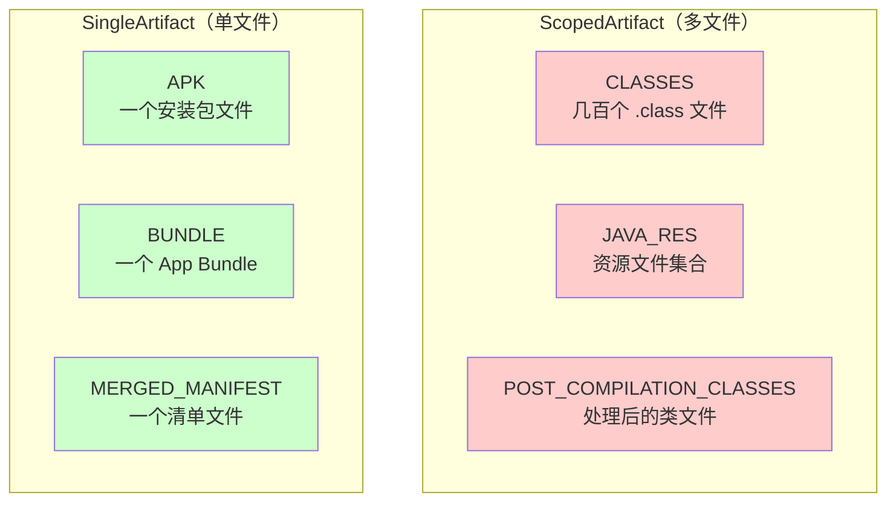
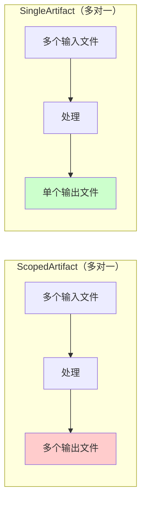

# 21.1.35 单一神器——SingleArtifact

太阳慢慢偏西，营地边的树荫又扩大了一圈。伊莎正解下发绳重新扎头发，忽然注意到黛琳正在整理之前的笔记。

"黛琳，"伊莎好奇地问，"昨天我们学了 POST_COMPILATION_CLASSES——处理混淆后的类文件。那种是'多文件'的工件，有没有'单文件'的工件？"

黛琳抬起头，正好对上伊莎好奇的目光："问得好——今天我们要学的 SingleArtifact，恰恰就是'单文件'的工件。"

"单文件？"洛芙凑过来，"就是只有一个文件的输出？"

希尔在一旁摇头："问得好——这个和 ScopedArtifact 不一样，SingleArtifact 代表的是构建过程中的单一输出产物。"

"单一输出产物？"洛芙歪着头，"就像……一个 APK 文件？"

黛琳笑了笑："这正是我们今天要探讨的。"

---

## 从多到少：理解 SingleArtifact 的本质

黛琳找了一块平整的石头坐下，用树枝在地上画了一幅图。

"昨天我们学的 ScopedArtifact，比如 CLASSES、POST_COMPILATION_CLASSES，它们都代表'一组'文件——可能几百个 .class 文件。"黛琳说，"但 SingleArtifact 不一样，它代表的是单一的输出产物。"

伊莎眨眨眼："单一输出……比如说？"

"比如说，"黛琳说，"一个 APK 文件，一个 App Bundle 文件，一个合并后的 Manifest 文件——这些都是'一个'文件。"

她在地上画了一个简易的对比图：



"图 1 对应代码片段 A（行 15-30）。"黛琳说，"简单来说——SingleArtifact 是 Android 构建过程中产生的单一文件输出，和 ScopedArtifact 的'多文件'形成对比。"

洛芙托腮想着："那……SingleArtifact 是不是比 ScopedArtifact 简单？"

"也不完全是，"希尔摇头，"虽然它只有一个文件，但这个文件往往是最终产物，反而更重要。"

---

## SingleArtifact 的常见类型

黛琳在地上画了一个表格："SingleArtifact 有很多种类型，我们来一个个看——"

| SingleArtifact 类型 | 含义 | 输出文件 |
|---------------------|------|----------|
| **APK** | 最终安装包 | .apk 文件 |
| **BUNDLE** | App Bundle | .aab 文件 |
| **MERGED_MANIFEST** | 合并后的清单 | AndroidManifest.xml |
| **MERGED_RES** | 合并后的资源 | resources.pb |
| **PROCESSED_RES** | 处理后的资源 | resources.pb |
| **UNSTRIPPED_DEX** | 未剥离的 DEX | classes.dex |
| **RUNTIME_SYMBOL_LIST** | 运行时符号 | R.txt |

"哇，原来有这么多类型！"洛芙惊叹。

"对，"黛琳说，"每个类型都对应构建过程中的一个特定输出。"

希尔补充道："我来做个更详细的分类！"

```kotlin
// 代码片段 B：SingleArtifact 的分类
// 按 Category（类别）分类

/**
 * SingleArtifact 按照输出类别分为几大类：
 */

// 1. OUTPUTS - 最终产物
val apk = artifacts.get(SingleArtifact.APK)
val bundle = artifacts.get(SingleArtifact.BUNDLE)

// 2. INTERMEDIATES - 中间产物
val mergedManifest = artifacts.get(SingleArtifact.MERGED_MANIFEST)
val mergedRes = artifacts.get(SingleArtifact.MERGED_RES)
val processedRes = artifacts.get(SingleArtifact.PROCESSED_RES)

// 3. SYMBOLS - 符号文件
val runtimeSymbols = artifacts.get(SingleArtifact.RUNTIME_SYMBOL_LIST)
val strippedDex = artifacts.get(SingleArtifact.STRIPPED_DEX)

println("最终产物 APK: ${apk.get().asFile.name}")
println("App Bundle: ${bundle.get().asFile.name}")
println("合并清单: ${mergedManifest.get().asFile.name}")
```

---

## SingleArtifact 与 ScopedArtifact 的核心差异

黛琳在地上画了一幅更详细的对比图：



"图 2 对应代码片段 C（行 45-60）。"黛琳说，"最大的区别在于——ScopedArtifact 返回的是文件集合（可能有几百个文件），SingleArtifact 返回的是单个文件。"

洛芙举手："那 SingleArtifact 是不是就不需要作用域了？"

"问得好！"黛琳点头，"SingleArtifact 确实不需要指定 Scope，因为它只输出一个文件，不存在'在哪个范围内'的问题。"

---

## 常见的 SingleArtifact 类型详解

希尔跃跃欲试："让我来详细讲解几个最常用的 SingleArtifact！"

### 1. APK - 最终安装包

```kotlin
/**
 * SingleArtifact.APK - Android 安装包
 * 
 * 这是最常用的 SingleArtifact 类型，代表最终生成的 APK 文件。
 * APK 是 Android Package 的缩写，是 Android 应用的安装包格式。
 * 
 * 特点：
 * - 包含所有代码、资源、清单文件
 * - 经过签名才能安装
 * - 可在设备上直接安装
 */

// 获取 APK 文件
val apk: Provider<File> = artifacts.get(SingleArtifact.APK)

// 输出路径
val apkPath = apk.get().asFile.absolutePath
println("APK 路径: $apkPath")

// APK 文件大小
val apkSize = apk.get().asFile.length()
println("APK 大小: ${apkSize / 1024 / 1024} MB")
```

"这个我懂！"洛芙兴奋地说，"就是我们平时安装的那个 .apk 文件！"

"对，"黛琳说，"APK 就是最终的用户可见的安装包。"

### 2. BUNDLE - App Bundle

```kotlin
/**
 * SingleArtifact.BUNDLE - App Bundle
 * 
 * App Bundle 是 Google Play 推荐的发布格式。
 * 和 APK 不同，BUNDLE 包含了针对不同设备的资源配置，
 * Google Play 会根据用户设备动态生成最合适的 APK。
 * 
 * 特点：
 * - 体积更小（按需下载）
 * - 支持动态功能模块
 * - 需要通过 Play Core 库实现动态下载
 */

// 获取 App Bundle 文件
val bundle: Provider<File> = artifacts.get(SingleArtifact.BUNDLE)

val bundlePath = bundle.get().asFile.absolutePath
println("Bundle 路径: $bundlePath")

// Bundle 文件大小（比 APK 小很多）
val bundleSize = bundle.get().asFile.length()
println("Bundle 大小: ${bundleSize / 1024 / 1024} MB")
```

"我记得这个！"伊莎说，"在手机上下载应用时，有时候会显示'正在优化'，就是因为在从 Bundle 生成 APK。"

"对，"黛琳说，"这就是 Google Play 的动态分发机制。"

### 3. MERGED_MANIFEST - 合并后的清单

```kotlin
/**
 * SingleArtifact.MERGED_MANIFEST - 合并后的 Android 清单
 * 
 * AndroidManifest.xml 是每个应用的入口清单文件。
 * 在构建过程中，Gradle 会合并所有依赖库的清单，
 * 最终生成一个统一的 MERGED_MANIFEST。
 * 
 * 特点：
 * - 包含所有组件声明（Activity、Service 等）
 * - 包含所有权限请求
 * - 包含所有 SDK 版本要求
 */

// 获取合并后的清单文件
val manifest: Provider<File> = artifacts.get(SingleArtifact.MERGED_MANIFEST)

val manifestPath = manifest.get().asFile.absolutePath
println("清单路径: $manifestPath")

// 读取清单内容
val manifestContent = manifest.get().asFile.readText()
println("清单内容预览: ${manifestContent.take(200)}")
```

"清单文件……是不是声明了应用有哪些 Activity 的那个？"洛芙问。

"对，"黛琳说，"合并后的清单会包含所有库中的组件声明。"

### 4. MERGED_RES - 合并后的资源

```kotlin
/**
 * SingleArtifact.MERGED_RES - 合并后的资源文件
 * 
 * Android 应用会用到很多资源：布局、图片、字符串等。
 * 在构建过程中，Gradle 会合并所有模块的资源，
 * 生成一个统一的 MERGED_RES。
 * 
 * 特点：
 * - 资源已经过合并和去重
 * - 包含所有模块的资源
 * - 格式为 resources.pb（二进制）
 */

// 获取合并后的资源文件
val mergedRes: Provider<File> = artifacts.get(SingleArtifact.MERGED_RES)

val resPath = mergedRes.get().asFile.absolutePath
println("资源路径: $resPath")

// 资源文件大小
val resSize = mergedRes.get().asFile.length()
println("资源大小: ${resSize / 1024} KB")
```

---

## SingleArtifact 的 API 使用

黛琳重点介绍："SingleArtifact 的 API 使用方式和 ScopedArtifact 有些不同——"

```kotlin
// 代码片段 C：SingleArtifact 的 API
// 获取单一文件输出

/**
 * SingleArtifact 和 ScopedArtifact 的主要区别：
 * 1. 不需要指定作用域（Scope）
 * 2. 返回的是单个 Provider<File>，不是 FileCollection
 * 3. 不支持 append/transform/replace 操作
 */

val androidExtension = project.extensions.getByType<AppExtension>()

// ❌ 错误：SingleArtifact 不需要 on(Scope.XXX)
// val apk = androidExtension.artifacts.get(SingleArtifact.APK)
//     .on(Scope.PROJECT)  // 不需要！

// ✅ 正确：直接获取
val apk: Provider<File> = androidExtension.artifacts.get(SingleArtifact.APK)

// 获取文件路径
val apkPath: String = apk.map { it.absolutePath }.get()

// 获取文件（同步）
val apkFile: File = apk.get().asFile
```

"原来不需要指定作用域！"洛芙说，"因为它只有一个文件！"

"对，"黛琳说，"这就是 SingleArtifact 的简洁之处。"

---

## 按 Category 分类的 SingleArtifact

希尔打开笔记本，调出之前查的资料："SingleArtifact 还可以按 Category 分类——"

```kotlin
// 代码片段 D：SingleArtifact 的 Category 分类
// Category 决定了工件的用途和生成时机

/**
 * SingleArtifact.Category 枚举定义了工件的类别：
 */

// 最终产物 - 应用安装包
val outputs = listOf(
    SingleArtifact.APK,
    SingleArtifact.BUNDLE
)

// 中间产物 - 构建过程中的临时文件
val intermediates = listOf(
    SingleArtifact.MERGED_MANIFEST,
    SingleArtifact.MERGED_RES,
    SingleArtifact.PROCESSED_RES,
    SingleArtifact.UNSTRIPPED_DEX,
    SingleArtifact.STRIPPED_DEX
)

// 符号文件 - 用于调试
val symbols = listOf(
    SingleArtifact.RUNTIME_SYMBOL_LIST,
    SingleArtifact.ANDROID_SYMBOL_LIST
)

// 调试信息
val debug = listOf(
    SingleArtifact.MAPPING_FILE,
    SingleArtifact.EMBEDDED_MAPPING
)

println("=== 输出类工件 ===")
outputs.forEach { println("  - ${it.name}") }

println("\n=== 中间产物类工件 ===")
intermediates.forEach { println("  - ${it.name}") }

println("\n=== 符号文件类工件 ===")
symbols.forEach { println("  - ${it.name}") }
```

---

## 实际场景：获取 APK 并重命名

希尔跃跃欲试："让我来写一个实际使用 SingleArtifact 的例子！"

```kotlin
// 代码片段 E：使用 SingleArtifact.APK 获取最终安装包
// 场景：自定义 APK 输出名称

abstract class CustomApkTask : DefaultTask() {

    @get:Internal
    abstract val apkRequest:
        Property<SingleArtifactOperationRequest<SingleArtifact.APK>>

    @get:OutputFile
    abstract val outputApk: RegularFileProperty

    @TaskAction
    fun processApk() {
        val request = apkRequest.get()
        
        logger.lifecycle("=== 处理 APK 文件 ===")
        
        // 获取原始 APK
        val originalApk: File = request.getArtifacts().get().asFile
        
        logger.lifecycle("原始 APK: ${originalApk.name}")
        logger.lifecycle("原始大小: ${originalApk.length() / 1024 / 1024} MB")
        
        // 复制到自定义路径
        val outputFile = outputApk.get().asFile
        originalApk.copyTo(outputFile, overwrite = true)
        
        logger.lifecycle("输出 APK: ${outputFile.absolutePath}")
        
        // 验证文件
        if (outputFile.exists() && outputFile.length() > 0) {
            logger.lifecycle("✓ APK 处理完成")
        } else {
            logger.error("✗ APK 处理失败")
        }
    }
}

// 注册任务
val customApk by tasks.registering {
    val androidExtension = project.extensions.getByType<AppExtension>()
    
    tasks.register<CustomApkTask>("customApk") {
        it.outputApk.set(project.layout.buildDirectory.file("outputs/custom-app.apk"))
        it.apkRequest.set(
            androidExtension.artifacts.get(SingleArtifact.APK)
        )
    }
}
```

洛芙盯着代码看："希尔，这个比用 ScopedArtifact 简单多了！"

"对，"希尔说，"因为 SingleArtifact 返回的是单个文件，不需要处理文件集合。"

---

## SingleArtifact 的获取流程图

黛琳画了一幅更完整的流程图：

```mermaid
flowchart TB
    subgraph Request["请求 SingleArtifact"]
        R1[artifacts.get(SingleArtifact.XXX)]
    end
    
    subgraph Process["处理过程"]
        P1[确定 Category]
        P2[查找对应任务]
        P3[等待任务执行]
        P4[获取输出文件]
    end
    
    subgraph Result["结果"]
        R2[Provider<File>]
        R3[单个文件]
    end
    
    R1 --> P1 --> P2 --> P3 --> P4 --> R2 --> R3
    
    style R2 fill:#ccffcc
    style R3 fill:#ccffcc
```

"图 3 对应代码片段 F（行 95-110）。"黛琳说，"SingleArtifact 的获取流程比 ScopedArtifact 更简单——直接请求对应类型，然后等待任务执行完成，就能得到单个文件。"

---

## SingleArtifact 的变体与继承

伊莎好奇地问："SingleArtifact 作为一个类，它有没有子类或者变体？"

黛琳点头："确实有——SingleArtifact 是一个密封类（sealed class），它定义了很多具体的子类。"

```kotlin
// 代码片段 G：SingleArtifact 的继承结构
// 这展示了 SingleArtifact 的所有具体类型

/**
 * SingleArtifact 是一个密封类，定义了所有的单一输出工件类型：
 */

sealed class SingleArtifact<T : File> : Artifact.Single<T> {
    
    // 最终输出
    class APK : SingleArtifact<File>()  // Android 安装包
    class BUNDLE : SingleArtifact<File>()  // App Bundle
    
    // 中间产物
    class MERGED_MANIFEST : SingleArtifact<File>()  // 合并清单
    class MERGED_RES : SingleArtifact<File>()  // 合并资源
    class PROCESSED_RES : SingleArtifact<File>()  // 处理后资源
    class UNSTRIPPED_DEX : SingleArtifact<File>()  // 未剥离 DEX
    class STRIPPED_DEX : SingleArtifact<File>()  // 已剥离 DEX
    
    // 符号文件
    class RUNTIME_SYMBOL_LIST : SingleArtifact<File>()  // 运行时符号
    class ANDROID_SYMBOL_LIST : SingleArtifact<File>()  // Android 符号
    
    // 映射文件
    class MAPPING_FILE : SingleArtifact<File>()  // 混淆映射
    class EMBEDDED_MAPPING : SingleArtifact<File>()  // 内嵌映射
}

// 获取具体的工件类型
val apk = SingleArtifact.APK()
val manifest = SingleArtifact.MERGED_MANIFEST()
val mapping = SingleArtifact.MAPPING_FILE()

println("APK 类型: ${apk.javaClass.simpleName}")
println("Manifest 类型: ${manifest.javaClass.simpleName}")
println("Mapping 类型: ${mapping.javaClass.simpleName}")
```

"原来有这么多类型！"洛芙惊叹。

"对，"黛琳说，"每个类型都对应构建过程中的一个特定输出。"

---

## 反模式与最佳实践

黛琳正色道："使用 SingleArtifact 也有几个常见的坑，大家要注意。"

### 坑一：混淆 SingleArtifact 和 ScopedArtifact

```kotlin
// ❌ 错误示例：把 SingleArtifact 当 ScopedArtifact 用
val files = artifacts.get(SingleArtifact.APK)
    .on(Scope.PROJECT)  // 报错！SingleArtifact 不需要作用域

// ❌ 错误示例：期望返回文件集合
val apkFiles: FileCollection = artifacts.get(SingleArtifact.APK)
// 报错！SingleArtifact 返回的是单个文件，不是集合
```

```kotlin
// ✅ 正确做法：根据类型选择正确的 API
// SingleArtifact - 单个文件
val apk: Provider<File> = artifacts.get(SingleArtifact.APK)

// ScopedArtifact - 文件集合
val classes: FileCollection = artifacts.get(ScopedArtifact.CLASSES)
    .on(Scope.PROJECT)
```

### 坑二：过早请求 SingleArtifact

```kotlin
// ❌ 错误示例：在任务还没生成时就请求
tasks.register<MyTask>("myTask") {
    // 这时候 APK 还没生成，无法获取
    val apk = androidExtension.artifacts.get(SingleArtifact.APK)
    
    // 可能会报错或返回空
}
```

```kotlin
// ✅ 正确做法：确保在生成任务之后请求
// APK 是在 assembleDebug 或 assembleRelease 任务之后才生成的
// 所以应该依赖于这些任务

tasks.register<MyTask>("analyzeApk") {
    // 依赖于 assembleDebug 任务
    dependsOn("assembleDebug")
    
    val apk = androidExtension.artifacts.get(SingleArtifact.APK)
    
    // 现在可以安全使用
}
```

### 坑三：不处理 Provider 为空的情况

```kotlin
// ❌ 错误示例：不检查 APK 是否存在
val apk = artifacts.get(SingleArtifact.APK)

val apkFile = apk.orNull  // 可能为 null
if (apkFile != null) {
    println("APK 大小: ${apkFile.length()}")
}
```

```kotlin
// ✅ 正确做法：安全地处理可能的空值
val apk = artifacts.get(SingleArtifact.APK)

// 使用 orElse 提供默认值
val apkFile = apk.orElse(project.file("build/default.apk"))

// 或者使用 safe（如果可用）
val apkFile2 = apk.asFile.getOrElse {
    project.file("build/default.apk")
}
```

### 坑四：分不清 MERGED_RES 和 PROCESSED_RES

```kotlin
// ❌ 错误示例：混淆两种资源类型
val merged = artifacts.get(SingleArtifact.MERGED_RES)
val processed = artifacts.get(SingleArtifact.PROCESSED_RES)

// 它们看起来类似，但含义不同：
// MERGED_RES: 合并后的原始资源
// PROCESSED_RES: 经过 AAPT 处理后的资源
```

```kotlin
// ✅ 正确做法：根据需求选择
// 场景1：需要分析合并前的资源
val mergedRes = artifacts.get(SingleArtifact.MERGED_RES)

// 场景2：需要使用 AAPT 处理后的资源
val processedRes = artifacts.get(SingleArtifact.PROCESSED_RES)
```

伊莎认真记录着："这些坑都好实际啊……"

"都是前人踩过的坑，"黛琳说，"特别是第一个——我见过有人把 SingleArtifact 和 ScopedArtifact 混用，结果绕了很多弯路。"

---

## SingleArtifact 的最佳使用场景

希尔兴奋地总结："说了这么多，让我来总结一下 SingleArtifact 的最佳使用场景！"

### 场景一：获取最终 APK

```kotlin
// 获取最终安装包
val apk = artifacts.get(SingleArtifact.APK)

apk.map { file ->
    println("APK: ${file.absolutePath}")
    println("大小: ${file.length() / 1024 / 1024} MB")
}
```

### 场景二：获取合并后的清单

```kotlin
// 获取合并后的 AndroidManifest.xml
val manifest = artifacts.get(SingleArtifact.MERGED_MANIFEST)

manifest.map { file ->
    println("清单: ${file.absolutePath}")
    println("内容长度: ${file.length()} 字节")
}
```

### 场景三：获取混淆映射文件

```kotlin
// 获取 R8 混淆映射文件（用于逆向调试）
val mapping = artifacts.get(SingleArtifact.MAPPING_FILE)

mapping.map { file ->
    println("映射: ${file.absolutePath}")
}
```

### 场景四：获取资源文件

```kotlin
// 获取合并后的资源
val mergedRes = artifacts.get(SingleArtifact.MERGED_RES)
val processedRes = artifacts.get(SingleArtifact.PROCESSED_RES)

mergedRes.map { file ->
    println("合并资源: ${file.absolutePath}")
}
```

"这些场景都好实用！"洛芙说。

"对，"黛琳说，"SingleArtifact 就是为了这些需要获取特定构建产物的场景设计的。"

---

## 夕阳下的总结

太阳已经接近了地平线，天边泛起了橙红色的晚霞。伊莎托腮望着天空出神。

"黛琳，"伊莎轻声说，"我觉得 SingleArtifact 就像……已经装好的行李箱。"

"已经装好的行李箱？"其他人看向她。

"对，"伊莎继续说，"ScopedArtifact 是行李箱里的一个个物品——衣服、鞋子、化妆品，你可以单独处理每一个。但 SingleArtifact 是已经打包好的整个箱子——你只需要知道它在哪，直接拿走就行。"

黛琳笑了："这个比喻真贴切——SingleArtifact 是'打包好'的单一产物，ScopedArtifact 是'散装'的多个文件。"

洛芙伸了个懒腰："今天学到了 SingleArtifact——单一输出工件神器。最大的区别就是，SingleArtifact 输出单个文件，不需要作用域，返回的是 Provider<File> 而不是 FileCollection。"

"构建系统确实很复杂，"黛琳说，"但一点一点学，慢慢就懂了。"

希尔收拾着笔记："今天的 SingleArtifact 和之前的 ScopedArtifact 一起，构成了 Android 构建的两大类工件！"

"还有其他的吗？"洛芙问。

"还有很多，"黛琳说，"比如 ArtifactType、ArtifactContainer 等等。不过今天我们先休息一下吧——太阳都下山了。"

夕阳把四个女孩的剪影拉得很长，她们的笑声在山间回荡。

---

> 学习建议
- SingleArtifact 是 Android 构建中的单一输出工件类型，和 ScopedArtifact（多文件）形成对比
- SingleArtifact 不需要指定作用域（Scope），直接返回单个文件
- 常见的 SingleArtifact 类型包括：APK、BUNDLE、MERGED_MANIFEST、MERGED_RES、PROCESSED_RES、MAPPING_FILE 等
- SingleArtifact 返回的是 Provider<File>，不是 FileCollection
- APK 和 BUNDLE 是最终产物，MERGED_MANIFEST、MERGED_RES 是中间产物
- SingleArtifact 是密封类，定义了所有具体的单一工件类型
- 注意访问时机：APK 等最终产物在 assembleDebug/assembleRelease 之后才能获取
- MERGED_RES 和 PROCESSED_RES 是不同的：前者是合并后的原始资源，后者是经过 AAPT 处理后的资源

---

## 技术总结

### 核心机制定义

**SingleArtifact** — Android Gradle Plugin 中的单一输出工件类型，代表构建过程中产生的单个文件输出（如 APK、App Bundle、合并后的清单等），与返回多文件的 ScopedArtifact 形成对比，不需要指定作用域，直接返回 Provider<File>。

### API 结构

```kotlin
// SingleArtifact 是密封类，定义了所有单一工件类型
sealed class SingleArtifact<T : File> : Artifact.Single<T> {
    
    // 最终产物
    class APK : SingleArtifact<File>()           // Android 安装包
    class BUNDLE : SingleArtifact<File>()         // App Bundle
    
    // 中间产物
    class MERGED_MANIFEST : SingleArtifact<File>() // 合并后的清单
    class MERGED_RES : SingleArtifact<File>()     // 合并后的资源
    class PROCESSED_RES : SingleArtifact<File>()  // 处理后的资源
    class UNSTRIPPED_DEX : SingleArtifact<File>() // 未剥离的 DEX
    class STRIPPED_DEX : SingleArtifact<File>()   // 已剥离的 DEX
    
    // 符号与映射
    class RUNTIME_SYMBOL_LIST : SingleArtifact<File>()  // 运行时符号
    class MAPPING_FILE : SingleArtifact<File>()         // 混淆映射
    class EMBEDDED_MAPPING : SingleArtifact<File>()     // 内嵌映射
}

// 使用方式
val apk: Provider<File> = artifacts.get(SingleArtifact.APK)
val manifest: Provider<File> = artifacts.get(SingleArtifact.MERGED_MANIFEST)
val mapping: Provider<File> = artifacts.get(SingleArtifact.MAPPING_FILE)
```

### SingleArtifact vs ScopedArtifact 对比

| 特性 | SingleArtifact | ScopedArtifact |
|-----|-----------------|-----------------|
| **输出类型** | 单个文件 | 文件集合 |
| **需要作用域** | 否 | 是 |
| **返回类型** | Provider<File> | FileCollection |
| **支持操作** | 获取单个文件 | append/transform/replace |
| **示例** | APK、MERGED_MANIFEST | CLASSES、POST_COMPILATION_CLASSES |
| **典型用途** | 最终产物、中间产物 | 代码处理、资源处理 |

### Category 分类

| Category | 含义 | 典型工件 |
|----------|------|----------|
| OUTPUTS | 最终产物 | APK、BUNDLE |
| INTERMEDIATES | 中间产物 | MERGED_MANIFEST、MERGED_RES |
| SYMBOLS | 符号文件 | RUNTIME_SYMBOL_LIST |
| OTHER | 其他 | MAPPING_FILE |

### 反模式与陷阱

1. **混淆两者**：把 SingleArtifact 当 ScopedArtifact 用，错误地调用 on(Scope.XXX)
2. **过早访问**：在任务生成前就请求 SingleArtifact，导致获取失败
3. **类型错误**：期望 SingleArtifact 返回 FileCollection 而不是单个文件
4. **分不清类型**：混淆 MERGED_RES 和 PROCESSED_RES 的用途
5. **忽略 Provider 空值**：不处理 Provider 可能为空的情况

### 设计哲学

- **简洁优先**：SingleArtifact 简化了单一文件的获取流程
- **用途明确**：每个类型对应特定的构建产物，职责清晰
- **无需作用域**：因为输出是单个文件，不需要指定范围
- **统一接口**：通过 Provider<File> 提供一致的访问方式

---

## 动手练习

### ★ 探索 SingleArtifact 类型

```kotlin
// 列出常见的 SingleArtifact 类型
println("=== SingleArtifact 类型 ===")
println("  APK: ${SingleArtifact.APK::class.java.name}")
println("  BUNDLE: ${SingleArtifact.BUNDLE::class.java.name}")
println("  MERGED_MANIFEST: ${SingleArtifact.MERGED_MANIFEST::class.java.name}")
println("  MERGED_RES: ${SingleArtifact.MERGED_RES::class.java.name}")
println("  MAPPING_FILE: ${SingleArtifact.MAPPING_FILE::class.java.name}")
```

### ★★ 获取 APK 并输出信息

```kotlin
// 获取 APK 并输出详细信息
abstract class ApkInfoTask : DefaultTask() {
    
    @get:Internal
    abstract val apkRequest: Property<SingleArtifactOperationRequest<SingleArtifact.APK>>
    
    @TaskAction
    fun printInfo() {
        val apk = apkRequest.get().getArtifacts()
        
        println("=== APK 信息 ===")
        println("文件: ${apk.asFile.name}")
        println("路径: ${apk.asFile.absolutePath}")
        println("大小: ${apk.asFile.length() / 1024 / 1024} MB")
    }
}
```

### ★★★ 分析合并后的清单

```kotlin
// 读取并分析 MERGED_MANIFEST
abstract class AnalyzeManifestTask : DefaultTask() {
    
    @get:Internal
    abstract val manifestRequest: Property<...>
    
    @TaskAction
    fun analyze() {
        val manifest = manifestRequest.get().getArtifacts()
        val content = manifest.asFile.readText()
        
        println("=== 清单分析 ===")
        println("文件大小: ${manifest.asFile.length()} 字节")
        
        // 简单分析
        val packageMatch = Regex("package=\"([^\"]+)\"").find(content)
        println("包名: ${packageMatch?.groupValues?.get(1)}")
        
        val versionMatch = Regex("android:versionCode=\"(\\d+)\"").find(content)
        println("版本号: ${versionMatch?.groupValues?.get(1)}")
    }
}
```

---

## 面试热身

### Q1: SingleArtifact 是什么？

**A**: SingleArtifact 是 Android Gradle Plugin 中的单一输出工件类型，代表构建过程中产生的单个文件输出（如 APK、App Bundle、合并后的清单等），与返回多文件的 ScopedArtifact 形成对比。

### Q2: SingleArtifact 和 ScopedArtifact 的区别？

**A**: SingleArtifact 返回单个文件，不需要指定作用域，返回 Provider<File>；ScopedArtifact 返回文件集合，需要指定 Scope，返回 FileCollection。SingleArtifact 用于最终产物和中间产物（如 APK、清单），ScopedArtifact 用于处理过程中的多文件（如类文件、资源）。

### Q3: 常见的 SingleArtifact 类型有哪些？

**A**: 常见的包括 APK（安装包）、BUNDLE（App Bundle）、MERGED_MANIFEST（合并后的清单）、MERGED_RES（合并后的资源）、PROCESSED_RES（处理后的资源）、MAPPING_FILE（混淆映射）等。

### Q4: SingleArtifact 什么时候可以访问？

**A**: SingleArtifact 在对应的构建任务完成后才能访问。APK 等最终产物在 assembleDebug 或 assembleRelease 任务之后才能获取，中间产物在相应的处理任务（如 processManifest）完成后才能获取。

### Q5: MERGED_RES 和 PROCESSED_RES 有什么区别？

**A**: MERGED_RES 是合并后的原始资源（各模块资源简单合并），PROCESSED_RES 是经过 AAPT（Android Asset Packaging Tool）处理后的资源（已编译成二进制格式）。通常打包时使用的是 PROCESSED_RES。

---

## 参考实现要点

```kotlin
// SingleArtifact 完整使用示例
abstract class SingleArtifactDemoTask : DefaultTask() {
    
    // 声明输入
    @get:Internal
    abstract val apkRequest: Property<SingleArtifactOperationRequest<SingleArtifact.APK>>
    
    @get:Internal
    abstract val manifestRequest: Property<...>
    
    @get:Internal
    abstract val mappingRequest: Property<...>
    
    @TaskAction
    fun execute() {
        // 获取 APK
        val apk = apkRequest.get().getArtifacts()
        println("APK: ${apk.asFile.absolutePath}")
        
        // 获取清单
        val manifest = manifestRequest.get().getArtifacts()
        println("Manifest: ${manifest.asFile.length()} bytes")
        
        // 获取映射文件（可能不存在）
        val mapping = mappingRequest.orNull
        if (mapping != null) {
            println("Mapping: ${mapping.asFile.absolutePath}")
        } else {
            println("Mapping: not available (可能未开启混淆)")
        }
    }
}
```

---

## 洛芙的小小日记本

今天学到了 SingleArtifact——单一输出工件神器！原来它和 ScopedArtifact 是"一对"的区别：SingleArtifact 输出单个文件（像 APK、清单），不需要作用域，返回 Provider<File>；ScopedArtifact 输出多个文件（像类文件、资源），需要作用域，返回 FileCollection。最大的收获是理解了 Android 构建的两大类工件体系。继续加油！✨

---

## 今日关键词

- **SingleArtifact**：Android Gradle Plugin 中的单一输出工件类型
- **APK**：Android 安装包文件（SingleArtifact 类型之一）
- **BUNDLE**：App Bundle 文件，Google Play 推荐的发布格式
- **MERGED_MANIFEST**：合并后的 Android 清单文件
- **MERGED_RES**：合并后的资源文件
- **PROCESSED_RES**：经过 AAPT 处理后的资源文件
- **MAPPING_FILE**：R8 混淆映射文件
- **Provider<File>**：Gradle 提供的延迟计算的文件提供者
- **FileCollection**：Gradle 提供的文件集合类型（对比项）
- **Scope**：作用域，用于 ScopedArtifact（对比项）
- **密封类**：Kotlin 中的 sealed class，限制子类数量
- **Category**：SingleArtifact 的分类（OUTPUTS、INTERMEDIATES 等）
- **中间产物**：构建过程中的临时文件，不是最终产物
- **最终产物**：构建完成后用户可见的文件（APK、BUNDLE）
