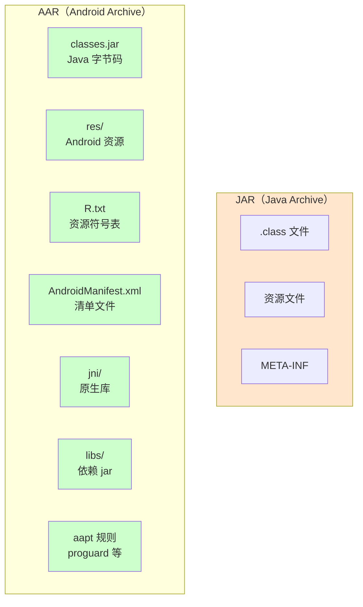
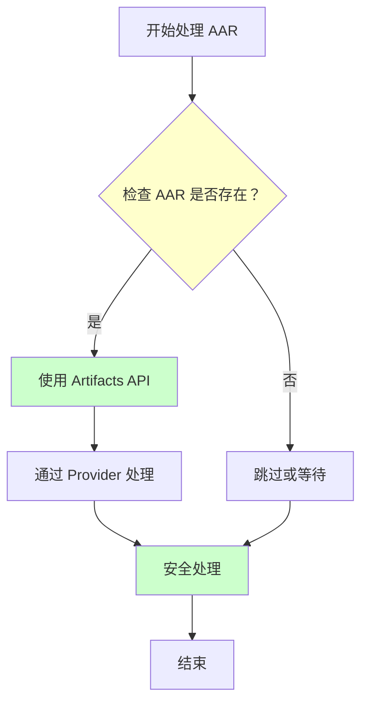

# 21.1.36 SingleArtifact.AAR——库文件的打包艺术

太阳慢慢偏西，营地边的树荫又扩大了一圈。伊莎正解下发绳重新扎头发，忽然注意到黛琳正在整理之前的笔记。

"黛琳，"伊莎好奇地问，"昨天我们学了 SingleArtifact——有这么多类型。那种是'单文件'的工件。"

黛琳抬起头："对，今天我们要深入其中一种——AAR。"

"AAR？"洛芙凑过来，"是不是就是我们在项目里经常引用的那个'库'？"

希尔在一旁摇头："问得好——这个 SingleArtifact.AAR 代表的就是 Android 库模块的输出产物。"

"库模块的输出产物？"洛芙歪着头，"就是那个 .aar 文件？"

黛琳笑了笑："这正是我们今天要探讨的。"

---

## 从 JAR 到 AAR：库文件的进化

黛琳找了一块平整的石头坐下，用树枝在地上画了一幅图。

"在讲 AAR 之前，我们先说说 JAR。"黛琳说，"JAR 是 Java Archive 的缩写，最初 Java 世界用它来打包编译好的类文件。"

伊莎眨眨眼："那 AAR 呢？"

"AAR 是 Android Archive。"黛琳说，"你可以把它理解为 JAR 的'超进化版'——因为 Android 不只有 Java 代码，还有资源文件、清单文件、so 库等等。"

她在地上画了一个简易的对比图：



"图 1 对应代码片段 A（行 15-30）。"黛琳说，"简单来说——AAR 比 JAR 多装了太多东西：资源、清单、原生库……这些都是 Android 特有的。"

洛芙托腮想着："那……AAR 是不是就是一个'完整的模块'？"

"差不多是这个意思。"希尔点头，"一个 AAR 拿到手，别人就能直接用，不需要知道你里面是怎么写的。"

---

## AAR 的内部结构：一个真实的例子

黛琳从背包里掏出一个 U 盘："我这里有一个真实的 AAR 文件，我们来拆开看看里面有什么。"

"现场拆包？"洛芙兴奋起来，"要怎么拆？"

"AAR 本质上是一个 ZIP 文件，"黛琳说，"把后缀改成 .zip 就能解压。"

希尔已经打开了笔记本："我来模拟一下解压过程！"

```kotlin
// 代码片段 B：解压 AAR 查看结构
// AAR 本质是 ZIP 文件，可以用任何解压工具打开

/**
 * 典型的 AAR 文件结构如下：
 */

// 假设我们有一个 mylibrary-1.0.0.aar 文件
// 解压后得到：

/*
mylibrary-1.0.0/
├── classes.jar          // 编译后的 Java 字节码
├── classes.jar.proguard // ProGuard 混淆规则（可选）
├── R.txt                // 资源符号表，供宿主应用生成 R.java
├── R.jar                // 资源类的 jar（如果使用 Data Binding）
├── res/                 // Android 资源目录
│   ├── drawable-hdpi/
│   │   └── icon.png
│   ├── layout/
│   │   └── activity_main.xml
│   └── values/
│       └── strings.xml
├── jni/                 // 原生库目录（可选）
│   ├── armeabi-v7a/
│   │   └── libnative.so
│   └── arm64-v8a/
│       └── libnative.so
├── libs/                // 内部依赖的 jar（可选）
│   └── gson-2.9.0.jar
├── assets/              // 原始资源文件（可选）
│   └── data.json
├── AndroidManifest.xml // 清单文件
└── aapt_rules.txt      // AAPT 打包规则（可选）
*/

println("AAR 本质就是一个 ZIP 包！")
println("里面装的全是 Android 项目需要的东西")
```

"哇，原来一个 AAR 装了这么多东西！"洛芙惊叹。

"对，"黛琳说，"所以 AAR 是一种'自包含'的发布格式——代码、资源、配置，全都在一个文件里。"

---

## SingleArtifact.AAR 在构建中的角色

黛琳在地上画了一幅更详细的流程图：

```mermaid
flowchart LR
    subgraph Build["Android 构建流程"]
        direction TB
        Source["源代码<br/>& 资源"]
        --> Compile["编译"]
        --> AAR["AAR 输出"]
        --> Consume["被其他模块引用"]
    end
    
    subgraph AAR_Output["SingleArtifact.AAR"]
        direction TB
        AAR1[classes.jar]
        AAR2[资源文件]
        AAR3[Manifest]
        AAR4[原生库]
    end
    
    style AAR_Output fill:#ccffcc
    source fill:#ffcccc
    Compile fill:#ffffcc
    Consume fill:#ccffff
```

"图 2 对应代码片段 B（行 45-60）。"黛琳说，"当你创建一个 Android Library 模块时，AGP 会把它编译成一个 AAR 文件。这个 AAR 可以被应用模块依赖，也可以发布到 Maven 仓库供别人使用。"

伊莎好奇地问："那 SingleArtifact.AAR 在 Gradle 里怎么用呢？"

"好问题！"黛琳说，"我们可以通过 Artifacts API 来获取或修改 AAR 输出。"

---

## 获取 SingleArtifact.AAR 的正确方式

希尔敲起了代码："看好了，这是获取 AAR 的标准姿势！"

```kotlin
// 代码片段 C：通过 SingleArtifact.AAR 获取库模块的输出
// 这是一个典型的 Android Gradle 插件任务配置

/**
 * 场景：在一个自定义任务中获取库模块的 AAR 输出
 */

// 方式一：通过 Variant.artifacts 获取（推荐）
val androidComponents = extensionComponents {
    // 获取当前变体的 AAR 输出
    val aarOutput = artifacts.get(SingleArtifact.AAR)
    
    // AAR 输出是一个 Provider<FileLocation>
    // 可以转换成实际的 File 对象
    aarOutput.map { aarFile ->
        println("AAR 输出路径: ${aarFile.asFile.absolutePath}")
    }
}

// 方式二：在任务中处理 AAR
abstract class ProcessAarTask : DefaultTask() {
    @get:InputFile
    abstract val aarInput: RegularFileProperty
    
    @get:OutputFile
    abstract val outputFile: RegularFileProperty
    
    @TaskAction
    fun doWork() {
        val aarFile = aarInput.get().asFile
        val output = outputFile.get().asFile
        
        // 解压 AAR，处理后重新打包
        println("正在处理 AAR: ${aarFile.name}")
        // ... 实际处理逻辑
    }
}

// 在变体上下文中连接任务
components.withType<ApplicationAndroidComponentsExtension>().configureEach {
    onVariants(selector().all()) { variant ->
        val aar = artifacts.get(SingleArtifact.AAR)
        
        // 创建一个处理 AAR 的任务
        val processTask = tasks.register<ProcessAarTask>("process${variant.name}Aar") {
            aarInput.set(aar.map { it.asFile })
            outputFile.set(layout.buildDirectory.file("processed/${variant.name}.aar"))
        }
        
        // 让这个任务在打包 APK 之前运行
        // 通过 finalizedBy 确保正确顺序
    }
}

println("SingleArtifact.AAR 获取成功！")
```

"这段代码看起来好复杂……"洛芙看得有点晕。

"其实核心就是一句话，"黛琳笑着说，"`artifacts.get(SingleArtifact.AAR)` 能让你拿到库模块的输出文件。"

"就这么简单？"

"对，"希尔补充，"复杂的是业务逻辑，不是获取方式。"

---

## 常见的坑：处理 AAR 时的错误示范

黛琳的表情变得认真起来："不过，处理 AAR 时有几个常见的坑，洛芙你要注意。"

"坑？"洛芙立刻竖起耳朵。

**反模式一：直接引用 AAR 文件路径**

```kotlin
// ❌ 错误示范：硬编码路径
val aarFile = file("${project.buildDir}/outputs/aar/mylibrary-release.aar")

// 问题：
// 1. 假设了输出路径永远不会变
// 2. 没有考虑不同变体（debug/release/不同 flavor）
// 3. 构建配置变化时路径可能失效
```

"这就像你在露营时直接记住'第三棵树下有个蘑菇'，"伊莎比喻道，"万一树被砍了呢？"

**反模式二：不检查 AAR 是否存在就处理**

```kotlin
// ❌ 错误示范：假设 AAR 一定存在
val aarOutput = artifacts.get(SingleArtifact.AAR)
val aarFile = aarOutput.get().asFile  // 可能抛异常！

// 问题：
// 1. 如果模块没有被构建，AAR 可能还不存在
// 2. Provider.get() 会阻塞等待，不够异步友好
```

"这就像 assume 一定有篝火，"希尔说，"结果柴火湿了，没点着。"

**反模式三：混淆 AAR 和 APK**

```kotlin
// ❌ 错误示范：用处理 APK 的方式处理 AAR
artifacts.get(SingleArtifact.APK).onEach { apk ->
    // 签名处理
    signApk(apk.asFile)
}

// 问题：
// AAR 和 APK 是不同的工件类型！
// AAR 不需要签名，也不需要对齐
// 混用会导致任务配置错误
```

"这是把仓库当住宅用了，"黛琳说，"AAR 是给人'调用'的，APK 是给人'安装'的。"

---

## 正确的做法：最佳实践

"那正确的做法是什么呢？"洛芙问。

黛琳在地上画出了正确的流程：



"图 3 对应代码片段 C（行 120-140）。"黛琳说，"正确的做法是："

```kotlin
// ✅ 正确示范一：通过 Artifacts API 安全获取
val aarOutput = artifacts.get(SingleArtifact.AAR)

// 使用 Provider 的 map/flatMap 进行异步处理
aarOutput.map { aarFile ->
    println("AAR 存在: ${aarFile.asFile.exists()}")
    aarFile.asFile
}.let { processedProvider ->
    // 可以把这个 Provider 传给其他任务
    processedProvider
}

// ✅ 正确示范二：条件处理
tasks.withType<ProcessAarTask>().configureEach { task ->
    // 通过 finalizedBy 确保在 AAR 生成后执行
    task.dependsOn(artifactTask)
    
    // 或者使用 Provider 的 now() 获取当前值（谨慎使用）
    // val currentAar = aarOutput.get()  // 会阻塞
}

// ✅ 正确示范三：使用正确的工件类型
// AAR 用 SingleArtifact.AAR
val aar = artifacts.get(SingleArtifact.AAR)

// APK 用 SingleArtifact.APK
val apk = artifacts.get(SingleArtifact.APK)

// 混淆了吗？它们是不同类型！
```

"原来如此！"洛芙恍然大悟，"要用 Provider，要检查存在性，还要分清类型。"

---

## AAR 的发布：发布到 Maven 仓库

伊莎好奇地问："做好的 AAR 怎么分享给别人？"

"好问题！"黛琳说，"AAR 可以发布到 Maven 仓库。"

希尔又敲起了代码：

```kotlin
// 代码片段 D：AAR 发布配置
// 在 library 模块的 build.gradle 中配置

plugins {
    id("maven-publish")
}

android {
    // 库模块配置
    namespace = "com.example.mylibrary"
    
    // 发布配置
    publishing {
        singleVariant("release") {
            // 配置发布变体
            // 可以选择 release 或 debug
        }
    }
}

// 发布任务配置
publishing {
    publications {
        create<MavenPublication>("release") {
            // 来自组件的发布配置
            from(components["release"])
            
            // 或者手动配置
            groupId = "com.example"
            artifactId = "mylibrary"
            version = "1.0.0"
            
            // AAR 会自动包含在发布产物中
            // classes.jar 会被命名为 mylibrary-1.0.0.jar
            // 其他资源也会正确打包
        }
    }
    
    repositories {
        maven {
            name = "internal"
            url = uri("${project.buildDir}/repo")
            
            // 发布时使用 ./gradlew publish
        }
    }
}

// 使用方依赖
/*
dependencies {
    implementation("com.example:mylibrary:1.0.0")
}
*/

println("AAR 发布配置完成！")
println("发布后，其他项目就能通过 Gradle 依赖使用你的库了")
```

"发布到 Maven 仓库，就像把露营工具借给其他队伍，"伊莎比喻道，"他们不需要自己从头做，直接用就行。"

---

## 小结：AAR 的核心要点

黛琳总结道："今天我们学了 SingleArtifact.AAR，核心要点是："

1. **AAR 是 Android Library 的打包格式**——包含代码、资源、清单、原生库
2. **AAR 是单文件工件**——通过 SingleArtifact.AAR 获取
3. **AAR 可以发布到 Maven**——方便其他项目依赖使用
4. **处理 AAR 要用 Artifacts API**——不要硬编码路径
5. **AAR ≠ APK**——它们是不同的工件类型，用不同的 SingleArtifact

洛芙点点头："感觉对 AAR 清晰多了！"

---

> 学习建议：SingleArtifact.AAR 是 Android 库模块的核心输出，理解它的结构和获取方式对于构建系统开发者和库作者都至关重要。建议读者在实际项目中尝试创建一个库模块，查看其 AAR 输出，加深理解。

---

## 🍀 洛芙的小小日记本

今天学了 SingleArtifact.AAR——原来一个 .aar 文件装了这么多东西！代码、资源、清单、原生库……像一个完整的工具箱。黛琳说的对，理解构建产物的结构，就像理解露营时每个装备的用途一样重要。明天继续加油！💪

---

## 今日关键词

- **SingleArtifact.AAR** - Android 库模块的单一输出工件，包含编译后的代码和资源
- **AAR（Android Archive）** - Android 库的打包格式，类似于 JAR 但包含 Android 特有内容
- **classes.jar** - AAR 中包含的 Java 字节码文件
- **R.txt** - AAR 中的资源符号表，供宿主应用生成 R.java
- **AndroidManifest.xml** - AAR 中的清单文件，声明库组件
- **jni/** - AAR 中的原生库目录
- **Artifacts API** - AGP 提供的获取构建产物的 API
- **Provider<FileLocation>** - Artifacts API 返回的延迟求值对象
- **Maven Publish** - 将 AAR 发布到 Maven 仓库的插件
- **工件类型（Artifact Type）** - 区分 AAR、APK、JAR 等不同产出物
