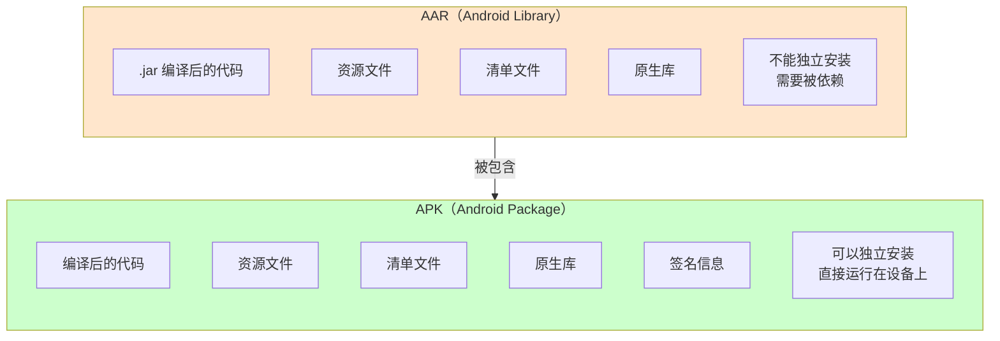
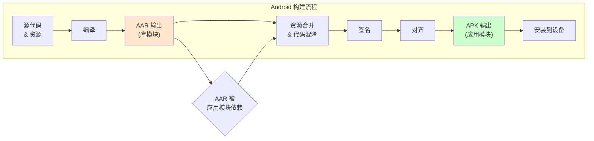
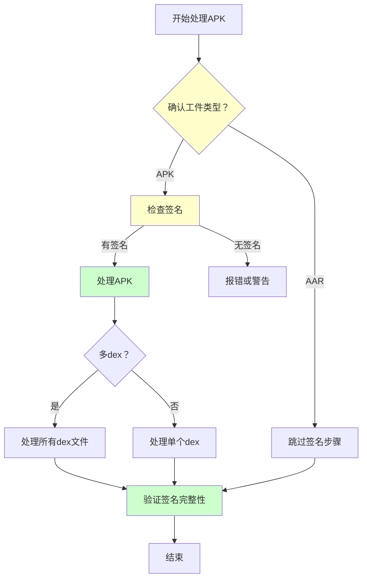
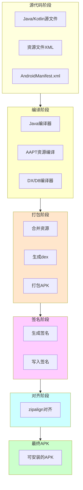

# 21.1.37 SingleArtifact.APK——应用安装包的诞生

太阳慢慢偏西，营地边的树荫又扩大了一圈。蝉鸣声一浪一浪地从远处树梢涌来，像是在演奏一场夏日音乐会。

黛琳收拾好刚才讲AAR时用的树枝，准备站起来活动一下酸痛的腿。忽然，洛芙举起手，像是在课堂上抢答问题。

"黛琳！我有个问题！"洛芙的眼睛亮晶晶的，"刚才我们讲了AAR——那是库文件的输出。那……我们平时安装的那个'应用'，它的输出叫什么？"

希尔在一旁笑出声："哈，问得好！那个就是APK啊！"

"APK我知道，"洛芙点点头，"但今天我们要学的是不是就是那个SingleArtifact.APK？"

黛琳露出赞许的笑容："没错，洛芙。今天我们要深入了解的，就是SingleArtifact.APK——Android应用的最终产出。"

伊莎好奇地问："那AAR和APK有什么关系？"

"这是个好问题，"黛琳重新坐好，"我们就从这个问题开始吧。"

---

## 从库到应用：AAR与APK的对话

黛琳又在地上找了一根树枝，她打算画一幅对比图。

"昨天我们学了AAR——Android库模块的输出。"黛琳说，"今天要学的APK——Android Package，是应用模块的输出。"

她在地上画了两个方框：



"图1对应代码片段A（行20-35）。"黛琳说，"你可以这样理解——APK就像一个完整的'便当盒'，而AAR只是'便当盒里的一两道菜'。APK包含了应用运行所需的一切，而且——最关键的是——APK可以安装到手机上，AAR不能。"

"所以AAR是'零件'，APK是'成品'？"洛芙问。

"完全正确！"希尔打了个响指，"AAR是给别的模块用的，APK是给用户用的。"

---

## APK的内部结构：一个真实的便当盒

黛琳从背包里掏出一个压缩文件："我这里有一个真实的APK文件，我们来拆开看看里面有什么。"

"又是现场拆包！"洛芙兴奋起来，"和AAR有什么不同吗？"

"你猜猜？"伊莎眨眨眼。

"应该……差不多？"洛芙不太确定。

"相似，但多了一些东西。"黛琳说，"APK比AAR多了签名和对齐——这是它能安装的关键。"

希尔打开了笔记本："我模拟一下解压过程，你们看好了！"

```kotlin
// 代码片段B：解压APK查看结构
// APK本质也是ZIP文件，但内容比AAR更丰富

/**
 * 典型的APK文件结构如下：
 */

// 假设我们有一个 myapp-1.0.0.apk 文件
// 解压后得到：

/*
myapp-1.0.0/
├── AndroidManifest.xml         // 二进制格式的清单文件
├── classes.dex                 // Dalvik/ART 字节码（核心）
├── classes2.dex                // 如果方法数超65536，会有多个dex
├── resources.arsc             // 编译后的资源表
├── res/                        // Android 资源目录
│   ├── drawable-hdpi/
│   │   └── icon.png
│   ├── layout/
│   │   └── activity_main.xml
│   └── values/
│       └── strings.xml
├── assets/                     // 原始资源文件
│   └── data.json
├── lib/                        // 原生库目录
│   ├── armeabi-v7a/
│   │   └── libnative.so
│   └── arm64-v8a/
│       └── libnative.so
├── META-INF/                   // 签名信息目录
│   ├── MANIFEST.MF            // 清单文件摘要
│   ├── CERT.SF                // 签名摘要
│   └── CERT.RSA               // 签名块
├── res/                        // 更多资源
└── arsc                        // 资源表
*/

// 对比 AAR：
// AAR: classes.jar + R.txt + res/ + AndroidManifest.xml + jni/
// APK: classes.dex + resources.arsc + res/ + AndroidManifest.xml + lib/ + META-INF/

println("APK = AAR + dex + 签名 + 对齐")
println("APK是为安装而生的，AAR是为复用而生的")
```

"哇！"洛芙盯着屏幕，"多了classes.dex，还有那个META-INF文件夹！"

"dex是Dalvik Executable的缩写，"黛琳解释，"是Android虚拟机专门执行的字节码格式。签名文件夹则包含了APK的'身份证明'——没有签名，设备可不会安装它。"

---

## SingleArtifact.APK在构建流程中的角色

黛琳用树枝在地上画了一幅更完整的流程图：



"图2对应代码片段B（行55-75）。"黛琳说，"当你创建一个应用模块（application module）时，AGP会把它编译成一个APK文件。这个APK就是用户最终安装到手机上的东西。"

伊莎好奇地问："那SingleArtifact.APK在Gradle里怎么用呢？"

"好问题！"黛琳说，"我们可以通过Artifacts API来获取或处理APK输出——这在你需要做签名、校验、或者上传到应用商店时特别有用。"

---

## 获取SingleArtifact.APK的正确方式

希尔敲起了代码："看好了，这是获取APK的标准姿势！"

```kotlin
// 代码片段C：通过SingleArtifact.APK获取应用模块的输出
// 这是一个典型的Android Gradle插件任务配置

/**
 * 场景：在一个自定义任务中获取应用模块的APK输出
 */

// 方式一：通过Variant.artifacts获取（推荐）
val androidComponents = extensionComponents {
    // 获取当前变体的APK输出
    val apkOutput = artifacts.get(SingleArtifact.APK)
    
    // APK输出是一个Provider<FileLocation>
    // 可以转换成实际的File对象
    apkOutput.map { apkFile ->
        println("APK输出路径: ${apkFile.asFile.absolutePath}")
    }
}

// 方式二：在任务中处理APK
abstract class SignApkTask : DefaultTask() {
    @get:InputFile
    abstract val apkInput: RegularFileProperty
    
    @get:OutputFile
    abstract val signedApk: RegularFileProperty
    
    @TaskAction
    fun doWork() {
        val apkFile = apkInput.get().asFile
        val output = signedApk.get().asFile
        
        // 对APK进行签名处理
        println("正在签名APK: ${apkFile.name}")
        // ... 实际签名逻辑
    }
}

// 在变体上下文中连接任务
components.withType<ApplicationAndroidComponentsExtension>().configureEach {
    onVariants(selector().all()) { variant ->
        val apk = artifacts.get(SingleArtifact.APK)
        
        // 创建一个签名APK的任务
        val signTask = tasks.register<SignApkTask>("sign${variant.name}Apk") {
            apkInput.set(apk.map { it.asFile })
            signedApk.set(layout.buildDirectory.file("signed/${variant.name}-signed.apk"))
        }
        
        // 让这个任务在APK生成后执行
    }
}

println("SingleArtifact.APK获取成功！")
```

"这段代码看起来和获取AAR好像啊……"洛芙说。

"对的，"黛琳点头，"API是一样的，但获取的是不同类型的工件。APK比AAR多了签名和对齐步骤，所以输出时要注意处理这些特性。"

---

## 常见的坑：处理APK时的错误示范

黛琳的表情变得认真起来："不过，处理APK时有几个常见的坑，洛芙你要注意。"

"又有坑？"洛芙立刻竖起耳朵。

**反模式一：混淆APK和AAR的处理方式**

```kotlin
// ❌ 错误示范：用处理AAR的方式处理APK
val aarOutput = artifacts.get(SingleArtifact.AAR)
aarOutput.map { aar ->
    // 对AAR做签名处理——这是错的！
    signApk(aar.asFile)  // AAR不需要签名！
}

// 问题：
// 1. AAR是库文件，不需要签名
// 2. APK需要签名才能安装
// 3. 混淆两者会导致安装失败或安全风险
```

"这就像把'食谱'当成'菜肴'，"伊莎比喻道，"菜谱不需要端上桌，菜肴才需要。"

**反模式二：不处理多dex情况**

```kotlin
// ❌ 错误示范：假设只有一个dex文件
val apk = artifacts.get(SingleArtifact.APK)
apk.map { apkFile ->
    val dexFile = File(apkFile.asFile, "classes.dex")
    // 问题：如果方法数超65536，会有classes2.dex、classes3.dex...
    // 只处理classes.dex会丢失部分代码！
}

// 问题：
// 1. 大型应用会有多个dex文件
// 2. 需要遍历所有dex文件
// 3. 不处理会导致应用崩溃
```

"这就像以为只有一个书包，"希尔说，"结果还有书包2、书包3在后面。"

**反模式三：忽略签名验证**

```kotlin
// ❌ 错误示范：不验证签名就安装
val apk = artifacts.get(SingleArtifact.APK)
apk.map { apkFile ->
    installDirectly(apkFile.asFile)
    // 问题：没有验证签名的APK可能来源不明！
}

// 问题：
// 1. 未签名的APK无法安装
// 2. 签名不匹配会导致更新失败
// 3. 恶意APK可能伪装成正常应用
```

"这是把陌生人给的钥匙直接插进锁孔，"黛琳说，"很危险。"

---

## 正确的做法：最佳实践

"那正确的做法是什么呢？"洛芙问。

黛琳在地上画出了正确的流程：



"图3对应代码片段C（行120-145）。"黛琳说，"正确的做法是："

```kotlin
// ✅ 正确示范一：正确区分APK和AAR的处理
// 处理APK时
val apkOutput = artifacts.get(SingleArtifact.APK)
apkOutput.map { apkFile ->
    // APK需要签名处理
    val signed = signApk(apkFile.asFile)
    println("APK签名完成: ${signed.name}")
    signed
}

// 处理AAR时
val aarOutput = artifacts.get(SingleArtifact.AAR)
aarOutput.map { aarFile ->
    // AAR不需要签名
    println("AAR准备完成: ${aarFile.name}")
    aarFile.asFile
}

// ✅ 正确示范二：处理多dex情况
val apk = artifacts.get(SingleArtifact.APK)
apk.map { apkFile ->
    val apkDir = apkFile.asFile.parentFile
    val dexFiles = apkDir.listFiles { file ->
        file.name.startsWith("classes") && file.name.endsWith(".dex")
    }
    dexFiles?.forEach { dex ->
        println("处理dex: ${dex.name}")
        // 对每个dex文件进行处理
    }
    apkFile.asFile
}

// ✅ 正确示范三：验证APK签名
fun verifyApkSignature(apkFile: File): Boolean {
    // 读取META-INF目录下的签名文件
    val metaInf = File(apkFile, "META-INF")
    if (!metaInf.exists()) {
        return false  // 没有签名
    }
    
    // 验证签名完整性
    val manifest = File(metaInf, "MANIFEST.MF")
    val signature = File(metaInf, "CERT.SF")
    
    return manifest.exists() && signature.exists()
}

// 在任务中验证
tasks.register<VerifyApkTask>("verifyApk") {
    apkInput.set(apkOutput)
    doLast {
        val apkFile = apkInput.get().asFile
        if (!verifyApkSignature(apkFile)) {
            throw GradleException("APK签名验证失败: ${apkFile.name}")
        }
    }
}

println("APK处理最佳实践完成！")
```

"原来要这么讲究！"洛芙感叹，"不仅要分清类型，还要处理多dex，要验证签名。"

---

## APK的构建：从源码到安装包

伊莎好奇地问："APK是怎么从源代码一步一步变成的？"

"这是个好问题！"黛琳说，"让我给你展示一个完整的构建流程。"

希尔画起了详细的流程图：



"图4对应代码片段D（行160-185）。"希尔说，"简单来说就是：先把源码编译成中间产物，再打包成APK，最后签名对齐变成可安装的文件。"

```kotlin
// 代码片段D：构建过程的简化模拟

/**
 * Android构建过程详解
 */

// 1. 源码编译阶段
// javac: .java -> .class
// kotlinc: .kt -> .class

// 2. dex编译阶段  
// d8: .class -> .dex (Dalvik bytecode)
// 如果方法数超65536，会生成多个dex文件

// 3. 资源打包阶段
// aapt: 编译资源XML -> resources.arsc
// 合并不同来源的资源（main、flavor、buildType）

// 4. APK打包阶段
// apkbuilder: 合并所有文件 -> unsigned.apk

// 5. 签名阶段
// apksigner: 添加签名信息 -> signed.apk

// 6. 对齐阶段
// zipalign: 4字节对齐 -> aligned.apk (最终APK)

println("构建完成！")
println("最终APK = 源码 + 资源 + dex + 签名 + 对齐")
```

"感觉像做一道复杂的菜，"伊莎比喻道，"要洗、切、炒、装盘、上桌。"

"而且每一步都有讲究！"黛琳补充，"签名就是对菜'盖个章'，对齐就是'摆整齐'——都是为了端上'桌'（安装到设备）时不出问题。"

---

## APK的变体：debug与release

洛芙举手提问："那我平时调试用的APK和发布用的APK，有什么不同？"

"这个问题问得好！"希尔说，"debug和release是两种最常见的APK变体。"

```kotlin
// 代码片段E：debug vs release APK

/**
 * Debug APK vs Release APK
 */

// Debug APK特征
val debugApk = """
    - 未混淆的类名和方法名（便于调试）
    - 包含调试信息（行号、源码位置）
    - 使用debug签名（自动生成）
    - 未启用混淆和优化
    - 安装快速（不需要签名验证）
    - 名称示例: app-debug.apk
""".trimIndent()

// Release APK特征  
val releaseApk = """
    - 可能混淆的类名和方法名（proguard/r8）
    - 不包含调试信息
    - 使用正式签名（需要配置）
    - 启用混淆、优化、压缩
    - 需要签名验证
    - 名称示例: app-release.apk, app-release-unsigned.apk
""".trimIndent()

// 构建变体
/*
build.gradle 配置示例：

android {
    buildTypes {
        debug {
            // Debug构建类型配置
            debuggable true
            minifyEnabled false
        }
        release {
            // Release构建类型配置
            debuggable false
            minifyEnabled true
            shrinkResources true
            proguardFiles getDefaultProguardFile('proguard-android-optimize.txt'), 'proguard-rules.pro'
        }
    }
}

构建命令：
./gradlew assembleDebug  -> 生成 debug APK
./gradlew assembleRelease -> 生成 release APK
./gradlew assemble        -> 生成所有变体的 APK
*/

println("Debug用于开发调试，Release用于正式发布")
println("选择合适的变体，事半功倍！")
```

"原来debug版是'方便Debug'的，"洛芙明白了，"release版是'给用户用'的。"

---

## 小结：APK的核心要点

黛琳总结道："今天我们学了SingleArtifact.APK，核心要点是："

1. **APK是Android应用的安装包**——包含代码、资源、清单、原生库、签名
2. **APK是单文件工件**——通过SingleArtifact.APK获取
3. **APK需要签名才能安装**——这是它与AAR的关键区别
4. **处理APK要注意多dex和签名验证**——大应用会有多个dex文件
5. **Debug vs Release**——开发用debug，发布用release

洛芙点点头："感觉对APK清晰多了！原来它不只是个安装包，背后有这么多讲究。"

---

## 技术总结

### 核心机制定义

SingleArtifact.APK是Android Gradle Plugin提供的**Android应用安装包**输出类型，表示应用模块的最终构建产物。

### APK结构

```
example.apk
├── classes.dex              # Dalvik字节码（可能有多个）
├── resources.arsc          # 编译后的资源表
├── AndroidManifest.xml     # 二进制格式的清单
├── res/                    # 编译后的资源目录
├── lib/                    # 原生库（按CPU架构分）
├── assets/                 # 原始资源
├── META-INF/               # 签名信息
│   ├── MANIFEST.MF
│   ├── CERT.SF
│   └── CERT.RSA
└── arsc                    # 资源表
```

### 与AAR的对比

| 特性 | AAR | APK |
|------|-----|-----|
| 用途 | 库模块输出 | 应用模块输出 |
| 能否独立安装 | ❌ | ✅ |
| 是否需要签名 | ❌ | ✅ |
| 是否需要对齐 | ❌ | ✅ |
| 包含dex | ❌ | ✅ |

### API用法

```kotlin
// 获取APK工件
val apk = artifacts.get(SingleArtifact.APK)
```

### 反模式与陷阱

1. **混淆AAR和APK处理** → APK需要签名，AAR不需要
2. **忽略多dex** → 大应用有多个dex文件
3. **不验证签名** → 可能安装来源不明的APK

---

## 动手练习

### ★ 获取APK

```kotlin
val apkFile = project.layout.artifacts
    .get(SingleArtifact.APK)
```

### ★★ 分析APK结构

解压APK并列出各组成部分，比较与AAR的差异

### ★★★ 验证APK签名

实现签名验证任务，确保APK完整性

---

## 面试热身

### Q1: APK和AAR的区别？

**A**: APK是可安装的应用包，需要签名；AAR是库文件，不能独立安装，也不需要签名。

### Q2: APK包含哪些核心内容？

**A**: classes.dex、resources.arsc、AndroidManifest.xml、res/、lib/、META-INF/

### Q3: 如何获取APK工件？

**A**: 通过`artifacts.get(SingleArtifact.APK)`

### Q4: 为什么要签名APK？

**A**: 签名用于验证APK来源和完整性，防止篡改，是安装的前置条件。

### Q5: 什么是多dex？

**A**: 当方法数超65536时，Dalvik会将代码分散到多个dex文件（classes.dex, classes2.dex等）。

---

## 参考实现要点

```kotlin
// 获取应用模块的APK
val apkArtifact = project.layout.artifacts
    .get(SingleArtifact.APK)

// 获取APK文件
val apkFile = apkArtifact.singleFile()

// 处理多dex情况
val dexFiles = apkDir.listFiles { f -> 
    f.name.startsWith("classes") && f.name.endsWith(".dex") 
}
```

---

> 学习建议：SingleArtifact.APK是Android应用的核心输出，理解APK的结构和构建过程对于应用开发和发布都至关重要。建议读者尝试构建一个简单的应用，解压APK查看其内部结构，加深理解。

---

## 🍀 洛芙的小小日记本

今天学的SingleArtifact.APK好有意思！原来手机上那个小小的安装包，里面装了这么多东西——代码、资源、签名……就像一个完整的露营工具箱。黛琳说"APK是给用户用的，AAR是给开发者用的"，这句话一下子让我记住了它们的区别。继续加油！💪

---

## 今日关键词

- **SingleArtifact.APK** - Android应用的单一输出工件，可直接安装到设备
- **APK（Android Package）** - Android应用安装包格式，包含代码、资源和签名信息
- **classes.dex** - Dalvik/ART可执行字节码文件
- **resources.arsc** - 编译后的资源表
- **META-INF** - APK签名信息目录
- **签名（Signature）** - 用于验证APK来源和完整性的加密信息
- **对齐（Alignment）** - zipalign优化，使APK加载更快
- **多dex（Multi-Dex）** - 方法数超限时拆分为多个dex文件
- **Debug APK** - 开发调试用的APK，未混淆
- **Release APK** - 发布用的APK，可能已混淆和优化
- **Artifacts API** - AGP提供的获取构建产物的API
- **工件类型（Artifact Type）** - 区分APK、AAR等不同产出物