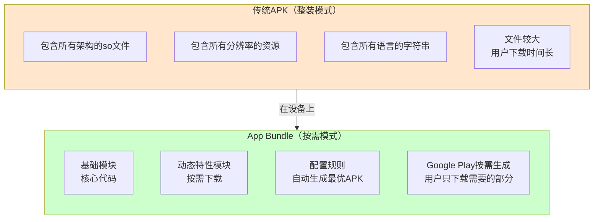
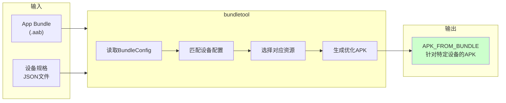
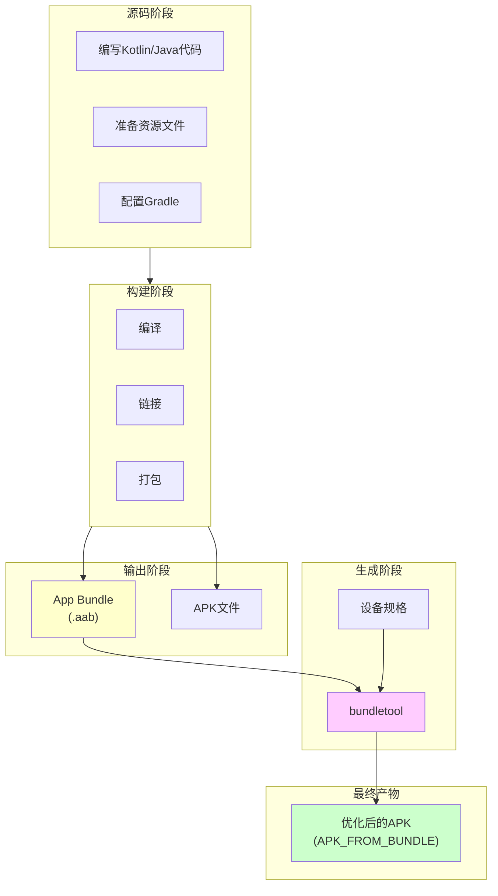
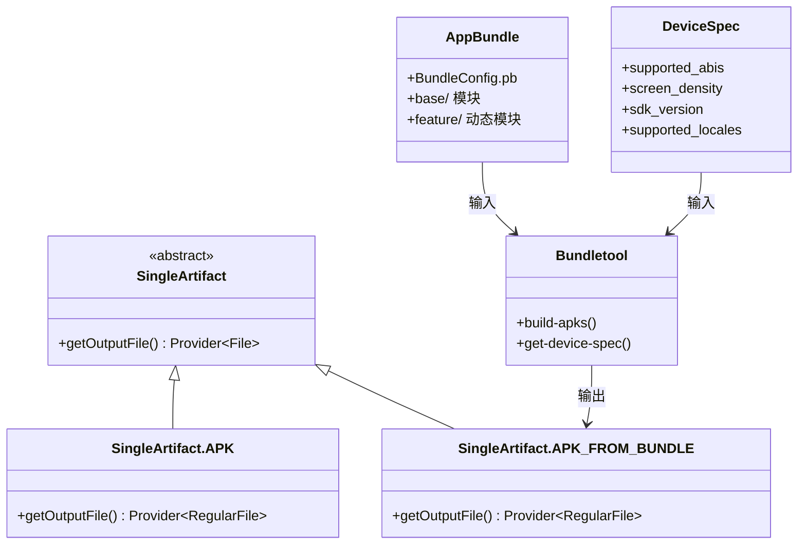

# 21.1.38 SingleArtifact.APK_FROM_BUNDLE——从Bundle到APK的魔法

太阳慢慢偏西，营地边的树荫又扩大了一圈。蝉鸣声一浪一浪地从远处树梢涌来，像是在演奏一场夏日音乐会。

黛琳收拾好刚才讲APK时用的树枝，准备站起来活动一下酸痛的腿。忽然，洛芙举起手，像是在课堂上抢答问题。

"黛琳！我有个问题！"洛芙的眼睛亮晶晶的，"刚才我们讲了APK——那是应用安装包。那……Google Play上傳的那个'AAB'文件又是什么？听说现在都要用AAB而不是APK上传了？"

希尔在一旁笑出声："哈，问得好！那叫App Bundle！"

"App Bundle？"洛芙歪着头，"是不是就是那个。aab文件？"

黛琳露出赞许的笑容："没错，洛芙。今天我们要深入了解的，就是SingleArtifact.APK_FROM_BUNDLE——从App Bundle生成的APK。"

伊莎好奇地问："那APK和App Bundle有什么关系？"

"这是个好问题，"黛琳重新坐好，"我们就从这个问题开始吧。"

---

## 从整装到按需：为什么需要App Bundle

黛琳又在地上找了一根树枝，她打算画一幅对比图。

"昨天我们学了APK——它是应用的完整安装包。"黛琳说，"今天要学的App Bundle（缩写为AAB）——是一种新的发布格式，它比APK更聪明。"

她在地上画了两个方框：



"图1对应代码片段A（行20-35）。"黛琳说，"你可以这样理解——APK就像一个'大礼包'，不管用户的手机是什么配置，你都给他一模一样的东西。而App Bundle就像一个'魔法盒'，Google Play会根据用户手机的CPU架构、屏幕密度、语言设置等，自动生成最適合他的APK。"

"所以App Bundle会更小？"洛芙问。

"通常会小很多！"希尔打了个响指，"比如你的应用支持arm64-v8a、armeabi-v7a两种架构，还有xxhdpi、xxxhdpi两种屏幕密度。如果是传统APK，所有这些都要打包进去，可能有50MB。但用App Bundle，用户用arm64-v8a手机+xxhdpi屏幕的话，可能只需要下载20MB！"

"这么神奇！"洛芙瞪大了眼睛，"那这个APK_FROM_BUNDLE又是什么意思？"

"这是个好问题，"黛琳解释道，"APK_FROM_BUNDLE就是我们从App Bundle'变'出来的那个APK。它不是直接由你的模块生成的，而是由bundletool根据Bundle配置生成的。"

---

## APK_FROM_BUNDLE：Bundle的魔法产物

黛琳从背包里掏出一个笔记本："我给你们讲讲这个'魔法'是怎么发生的。"

"首先，你的项目会构建出一个。aab文件——这就是App Bundle。"黛琳说，"然后，Google Play（或者你本地使用bundletool）会从这个AAB生成APK。这个生成的APK，就是SingleArtifact.APK_FROM_BUNDLE。"

"那它和普通的APK有什么区别？"洛芙问。

"表面上看，它们都是。apk文件，都可以安装到手机上。"黛琳说，"但内部有区别——APK_FROM_BUNDLE是根据特定设备配置生成的，它只包含该设备需要的代码和资源。"

希尔补充道："还有一种特殊的APK叫做Universal APK，就是把Bundle里所有变体都打包进去，可以在任何设备上安装——但这种通常只用于测试。"

"我明白了！"伊莎眼睛一亮，"所以SingleArtifact.APK是'源文件'，SingleArtifact.APK_FROM_BUNDLE是'加工后的成品'！"

"伊莎的比喻很贴切！"黛琳笑着说，"我们来看具体的实现。"

---

## 深入理解：APK_FROM_BUNDLE的内部结构

黛琳打开笔记本，开始画第二幅图。

"要理解APK_FROM_BUNDLE，我们先来看看App Bundle里面有什么。"黛琳说，"一个AAB本质上也是一个ZIP文件，但它有特殊的结构。"

```kotlin
// 代码片段B：App Bundle (AAB) 的内部结构
/**
 * 典型的App Bundle文件结构如下：
 */

// 假设我们有一个 myapp-1.0.0.aab 文件
// 解压后得到：

/*
myapp-1.0.0.aab/
├── BundleConfig.pb               // Bundle的配置文件，描述模块和变体
├── base/                         // 基础模块（必选）
│   ├── manifest/AndroidManifest.xml
│   ├── dex/
│   │   ├── classes.dex
│   │   └── classes2.dex
│   ├── res/
│   │   ├── drawable-hdpi/
│   │   ├── drawable-xhdpi/
│   │   └── values/
│   │       └── strings.xml
│   └── lib/                      // 原生库（按架构分离）
│       ├── arm64-v8a/
│       │   └── libnative.so
│       └── armeabi-v7a/
│           └── libnative.so
├── feature_module1/              // 动态特性模块（可选）
│   ├── manifest/AndroidManifest.xml
│   ├── dex/
│   └── res/
└── asset_module/                 // 资产模块（可选）
    └── assets/
        └── game_data/
*/

// 对比普通APK：
// APK: 包含所有资源 + 所有架构 + 所有语言的完整包
// AAB: 包含基础模块 + 动态模块的配置，按需生成最优APK

println("AAB = 模块化的应用发布格式")
println("APK_FROM_BUNDLE = AAB + bundletool 生成的目标设备APK")
```

"哇！"洛芙盯着屏幕，"原来AAB是分模块的！那这些模块是怎么变成APK的？"

"这就轮到bundletool出场了。"黛琳说，"bundletool是Google提供的命令行工具，它会读取AAB的配置，然后生成针对特定设备的APK。"

---

## bundletool：魔法工厂的工匠

"bundletool就像一个精细的工匠，"伊莎比喻道，"它会根据客户的要求——也就是设备配置——从原材料（App Bundle）中打造出最适合的产品（APK）。"

黛琳点点头："没错。我们来看看bundletool的工作流程。"



"图2对应代码片段C（行45-60）。"黛琳说，"bundletool会根据DeviceSpec中描述的设备信息——CPU架构、屏幕密度、SDK版本、语言等——从AAB中选择对应的资源进行打包。"

"能不能给我看个实际的DeviceSpec长什么样？"洛芙问。

"当然可以。"希尔调出一段代码：

```kotlin
// 代码片段D：设备规格JSON示例
// bundletool使用JSON文件来描述目标设备的配置

/**
 * 一个典型的device-spec.json文件：
 */

val deviceSpec = """
{
  "supported_abis": ["arm64-v8a"],      // 只支持64位ARM
  "supported_locales": ["en", "zh-CN"], // 只包含英语和简体中文
  "screen_density": xxxhdpi,             // 超超高清屏幕
  "sdk_version": {
    "min": 21,                           // 最低支持Android 5.0
    "target": 34                          // 目标Android 14
  }
}
"""

// bundletool命令示例：
// bundletool build-apks 
//   --bundle=myapp.aab 
//   --output=myapp.apks 
//   --device-spec=device-spec.json

// 这会生成一个APK文件，只包含arm64-v8a架构的资源，
// 只包含英语和中文，而且针对xxxhdpi屏幕优化

println("bundletool根据设备规格生成最优APK")
println("这就是APK_FROM_BUNDLE的来源！")
```

"太棒了！"洛芙兴奋地说，"所以我提交AAB到Google Play，它就会自动为每个用户生成最适合他们手机的APK！"

"没错！"黛琳笑着说，"这就是App Bundle的魔力——一次上传，无限优化。"

---

## SingleArtifact.APK_FROM_BUNDLE的正确理解

黛琳喝了一口水，继续说道："现在我们来正式认识一下SingleArtifact.APK_FROM_BUNDLE这个类。"

"在Android Gradle API中，SingleArtifact是一个抽象类，表示单一的输出工件。"黛琳说，"APK和APK_FROM_BUNDLE都是它的子类，但它们的来源不同。"

```kotlin
// 代码片段E：SingleArtifact类层次结构（简化版）

/**
 * SingleArtifact<T> 是表示单一输出工件的基类
 * 不同的子类代表不同类型的输出
 */

// APK - 应用模块的直接输出
abstract class SingleArtifact<out File> {
    // 获取输出文件
    abstract fun getOutputFile(): Provider<File>
}

// APK - 模块直接生成的APK
class SingleArtifact.APK : SingleArtifact<RegularFile>()

// APK_FROM_BUNDLE - 从App Bundle生成的APK
class SingleArtifact.APK_FROM_BUNDLE : SingleArtifact<RegularFile>()

/**
 * 使用示例：
 */

// 在Android Gradle插件中访问APK_FROM_BUNDLE
val apks: TaskProvider<BuildApksTask> = project.tasks.named("buildApks")

// 获取生成的APK文件
val bundleApk: Provider<RegularFile> = apks.flatMap { task ->
    task.singleArtifactApkFromBundle
}

/**
 * APK vs APK_FROM_BUNDLE 的区别：
 * 
 * 1. 来源不同：
 *    - APK: 由app模块直接构建生成
 *    - APK_FROM_BUNDLE: 由bundletool从AAB生成
 * 
 * 2. 内容不同：
 *    - APK: 包含所有变体的完整包
 *    - APK_FROM_BUNDLE: 只包含针对特定设备的资源
 * 
 * 3. 使用场景不同：
 *    - APK: 直接安装或发布到应用商店
 *    - APK_FROM_BUNDLE: 需要通过bundletool生成
 */

println("APK_FROM_BUNDLE是Bundle的衍生品")
```

"原来是这样！"洛芙点点头，"APK是'原生'的，APK_FROM_BUNDLE是'衍生'的。"

"完全正确！"希尔说，"而且APK_FROM_BUNDLE这个工件类型很重要，因为它是你在构建流程中最常接触到的最终产物——毕竟用户手机上安装的就是这个。"

---

## 反模式：混淆APK和APK_FROM_BUNDLE

黛琳的表情变得认真起来："我要特别强调一个常见的误区。"

"很多人会把APK和APK_FROM_BUNDLE混为一谈，认为它们是一样的。"黛琳说，"但实际上，它们在构建过程中的角色完全不同。"

"APK是直接由你的app模块构建的，"黛琳继续说，"而APK_FROM_BUNDLE需要先构建AAB，再由bundletool生成。"

```kotlin
// 反模式示例：错误地假设APK_FROM_BUNDLE可以直接从模块获取

// ❌ 错误做法：试图直接访问APK_FROM_BUNDLE
// 这会导致构建错误，因为APK_FROM_BUNDLE不是直接输出

// 错误代码示例：
// androidComponents.onVariants(selector().all()) { variant ->
//     val apkFromBundle = variant.artifacts.get(SingleArtifact.APK_FROM_BUNDLE)
//     // 这个在应用模块中通常不可用！
// }

// ✅ 正确做法：明确区分使用场景

// 场景1：直接构建APK（用于测试或侧载）
androidComponents.onVariants(selector().all()) { variant ->
    // 获取直接生成的APK
    val apkArtifact = variant.artifacts.get(SingleArtifact.APK)
    println("APK路径: ${apkArtifact.get().asFile}")
}

// 场景2：构建AAB后生成APK_FROM_BUNDLE（用于发布）
tasks.named("buildApks") {
    // bundletool会生成APK_FROM_BUNDLE
    // 输出到 build/outputs/apks/ 目录
    println("生成APK bundle...")
}

// 场景3：在测试中使用bundletool本地生成
tasks.register<Exec>("generateTestApk") {
    workingDir(projectDir)
    commandLine("bundletool", "build-apks",
        "--bundle=${layout.buildDirectory.get()}/outputs/bundle/release/app-release.aab",
        "--output=${layout.buildDirectory.get()}/outputs/apks/test/test.apks",
        "--device-spec=device-spec.json")
}
```

"记住，"黛琳总结道，"APK_FROM_BUNDLE不是你想生成就能生成的——它需要先有App Bundle，然后用bundletool来生成。"

---

## 动态特性：App Bundle的高级魔法

伊莎忽然想起什么："黛琳，你刚才提到'动态特性模块'，那是什么？"

"啊，说到这个，"黛琳的眼睛亮了起来，"Dynamic Features是App Bundle最强大的特性之一！"

"想象一下，"伊莎比喻道，"你的应用是一个乐高积木拼成的城堡，但用户只需要城堡的一部分——比如他只是想玩游戏，那他就不需要城堡的'商店'部分。"

"Exactly！"希尔说，"Dynamic Features允许你把应用拆分成多个模块，用户在安装时只需要下载基础模块，其他模块在需要时才下载。"

```kotlin
// 代码片段F：Dynamic Features配置示例

/**
 * 在build.gradle中配置动态特性模块
 */

// app/build.gradle
android {
    // 启用动态特性
    dynamicFeatures = [":feature:game", ":feature:profile"]
    
    // 启用Bundle
    bundle {
        language {
            enableSplit = true  // 按语言分离
        }
        density {
            enableSplit = true  // 按屏幕密度分离
        }
        abi {
            enableSplit = true  // 按CPU架构分离
        }
    }
}

// feature/game/build.gradle
android {
    namespace = "com.example.app.feature.game"
    
    // 这是动态特性模块
    androidFeatures {
        // 启用按需下载
        enableDynamicResolution = true
    }
}

/**
 * 动态特性的好处：
 * 
 * 1. 减少初始下载体积
 * 2. 用户只下载需要的功能
 * 3. 应用可以在后台下载额外模块
 * 4. 节省用户的存储空间和流量
 */

// 编程式下载动态模块
val installTask = SplitInstallManagerFactory.create(context)
    .request()
    .addModuleRequests(listOf("game"))
    .addListener listener = object : SplitInstallStateUpdatedListener() {
        override fun onStateUpdate(state: SplitInstallSessionState) {
            when (state.status()) {
                SplitInstallSessionStatus.DOWNLOADED -> {
                    println("模块下载完成！")
                }
                SplitInstallSessionStatus.INSTALLED -> {
                    println("模块已安装，可以使用了！")
                }
            }
        }
    }
```

"这也太酷了吧！"洛芙惊叹道，"那游戏模块不用的时候就不下载？"

"对！"黛琳说，"这就是App Bundle的'动态交付'能力。用户打开游戏时，应用会提示下载游戏模块；不玩游戏的用户永远不需要下载它。"

---

## 构建流程全览：从源码到APK

希尔在地上画了一幅完整的流程图。

"我们来梳理一下，从你写代码到用户手机上装上APK的全过程。"希尔说。



"图3对应代码片段G（行95-120）。"希尔说，"注意看，APK（左侧）是构建直接输出的，而APK_FROM_BUNDLE（右侧）是通过bundletool二次生成的。"

"我有个问题，"洛芙举手，"那Google Play是用哪种方式生成APK给用户的？"

"好问题！"黛琳说，"Google Play使用自己的bundletool服务，会根据每个用户的设备配置生成APK_FROM_BUNDLE。所以你上传AAB，Google Play会自动为全球数百万用户生成数百万种不同的APK！"

"这工作量也太大了吧！"洛芙惊叹。

"这就是云端计算的魔力。"希尔笑着说。

---

## 实际应用：在Gradle中使用APK_FROM_BUNDLE

"好了，理论讲完了，"黛琳说，"我们来看看在实际项目中怎么使用。"

"如果你想本地生成APK_FROM_BUNDLE，可以用bundletool。"黛琳继续说，"Android Studio也提供了可视化的方式。"

```kotlin
// 代码片段H：在Gradle中配置AAB和APK输出

// app/build.gradle.kts

plugins {
    id("com.android.application")
    kotlin("android")
}

android {
    namespace = "com.example.myapp"
    compileSdk = 34

    defaultConfig {
        applicationId = "com.example.myapp"
        minSdk = 21
        targetSdk = 34
        versionCode = 1
        versionName = "1.0"
    }

    // 配置App Bundle
    bundle {
        // 语言分离
        language {
            enableSplit = true
        }
        // 屏幕密度分离
        density {
            enableSplit = true
        }
        // ABI分离
        abi {
            enableSplit = true
        }
    }

    // 配置不同的构建变体
    buildTypes {
        release {
            isMinifyEnabled = true
            isShrinkResources = true
            proguardFiles(
                getDefaultProguardFile("proguard-android-optimize.txt"),
                "proguard-rules.pro"
            )
        }
        debug {
            isDebuggable = true
        }
    }
    
    // 配置签名
    signingConfigs {
        create("release") {
            storeFile = file("keystore.jks")
            storePassword = System.getenv("KEYSTORE_PASSWORD")
            keyAlias = System.getenv("KEY_ALIAS")
            keyPassword = System.getenv("KEY_PASSWORD")
        }
    }
    
    // 为release构建类型配置签名
    buildTypes.getByName("release") {
        signingConfig = signingConfigs.getByName("release")
    }
}

// 配置构建任务
tasks.named<com.android.build.gradle.tasks.BuildApksTask>("buildApks") {
    // 输出文件命名
    val outputFileName = "myapp-${project.version}.apks"
    outputs.file(layout.buildDirectory.file("outputs/apks/$outputFileName"))
}

/**
 * 运行构建：
 * 
 * ./gradlew assembleRelease
 * // 生成 app/build/outputs/bundle/release/app-release.aab
 * 
 * ./gradlew buildApks
 * // 生成 app/build/outputs/apks/ 目录下的APK文件
 * // 包含所有变体的APK
 */

// 本地测试APK_FROM_BUNDLE
tasks.register<Exec>("installApkFromBundle") {
    workingDir(projectDir)
    commandLine("adb", "install", 
        "app/build/outputs/apks/debug/app-debug.apks")
}
```

"这些都是实际项目中会用到的配置。"黛琳说，"记住，上传到Google Play只需要AAB，Play会自动处理后续的APK生成工作。"

---

## 章节收尾：Bundle的哲学

太阳已经完全偏西，晚霞把天空染成了蜜桃色。蝉鸣声渐渐弱了下来，取而代之的是远处青蛙的低吟。

洛芙靠在树干上，仰头看着天空中的云彩慢慢飘过。

"黛琳，"洛芙轻声说，"我忽然觉得，App Bundle好像一个懂得体贴的朋友——它知道每个人需要的东西不一样，所以为每个人准备最適合的礼物。"

黛琳笑了："洛芙，这个比喻真美。是的，App Bundle的核心哲学就是'按需分配'——不让用户为不需要的东西付出版本和流量的代价。"

"这不只是技术的进步，"伊莎轻声说，"也是对用户的一种尊重。"

希尔伸了个懒腰："好了，今天的魔法课到此结束！明天我们要讲什么？"

"明天啊，"黛琳想了想，"我们继续讲SingleArtifact家族的其他成员吧——比如ASSETS。"

"太好了！"洛芙跳起来，"那今天的日记有素材了！"

四个女孩收拾好东西，准备去河边洗洗手，然后做晚饭。夕阳把她们的影子拉得很长很长，就像App Bundle把一个应用，分成了无数个最適合每個人的小包裹。

---

> 技术总结

---

## SingleArtifact.APK_FROM_BUNDLE——核心机制定义

**SingleArtifact.APK_FROM_BUNDLE** 是Android Gradle API中表示从App Bundle生成的APK工件的类。它与直接构建生成的SingleArtifact.APK不同，APK_FROM_BUNDLE是由bundletool根据特定的设备规格（Device Spec）从App Bundle（.aab文件）动态生成的优化APK。这种方式实现了应用的按需分发，用户只下载其设备所需的代码和资源，从而显著减少下载体积和存储占用。

---

#### 结构图



---

#### 反模式与陷阱

**1. 混淆APK和APK_FROM_BUNDLE的构建流程**
- 问题：在app模块中直接尝试获取APK_FROM_BUNDLE工件
- 解决：APK_FROM_BUNDLE需要通过buildApks任务或bundletool生成，不是模块的直接输出

**2. 错误配置Bundle分离选项**
- 问题：未启用split配置导致生成完整的AAB
- 解决：正确配置bundle{ language { enableSplit = true } }等选项

**3. 本地测试时不使用bundletool**
- 问题：直接安装AAB到设备（这是不可能的）
- 解决：使用bundletool build-apks命令生成APK后再安装

---

#### 设计哲学

**按需分配原则**：App Bundle的核心设计思想是将应用的资源和代码模块化，根据用户设备的实际配置动态生成最优的APK。这种方式体现了以下工程实践：

1. **最小化用户成本**：用户只下载必要的内容，减少流量和存储占用
2. **云端优化能力**：Google Play服务器端集中处理APK生成，充分利用计算资源
3. **模块化架构**：Dynamic Features支持功能按需加载，促进应用架构演进
4. **向后兼容**：bundletool支持生成兼容旧设备的APK，确保覆盖率

---

#### 🏕️ 动手练习

**目标**：掌握App Bundle的构建和本地APK生成流程，理解APK_FROM_BUNDLE的工作原理

**项目概览**：创建一个支持App Bundle的Android项目，配置动态特性模块，并使用bundletool本地生成针对特定设备的APK

---

**Task 1：创建支持App Bundle的项目配置**

**目标**：在Android项目中启用App Bundle支持

**步骤**：
1. 在app/build.gradle.kts中确保使用Android Gradle Plugin 3.2.0+
2. 添加bundle配置块，启用语言、密度、ABI分离
3. 确保minSdk >= 21

**验收标准**：
- [ ] build.gradle.kts中包含bundle{...}配置块
- [ ] 启用了density { enableSplit = true }
- [ ] 启用了abi { enableSplit = true }

**提示代码**：
```kotlin
android {
    bundle {
        density { enableSplit = true }
        abi { enableSplit = true }
        language { enableSplit = true }
    }
}
```

---

**Task 2：构建App Bundle（.aab）**

**目标**：生成可供发布的App Bundle文件

**步骤**：
1. 在Android Studio中运行 assembleRelease 任务
2. 或者在命令行执行 ./gradlew assembleRelease
3. 找到生成的。aab文件

**验收标准**：
- [ ] build/outputs/bundle/release/ 目录下存在 .aab 文件
- [ ] 文件大小合理（应该比传统APK小）

**提示代码**：
```bash
./gradlew assembleRelease
# 输出位置: app/build/outputs/bundle/release/app-release.aab
```

---

**Task 3：下载并配置bundletool**

**目标**：获取bundletool用于本地APK生成

**步骤**：
1. 从GitHub下载bundletool-release.jar
2. 保存到项目根目录的tools/文件夹
3. 创建简单的device-spec.json文件

**验收标准**：
- [ ] bundletool.jar存在于指定目录
- [ ] device-spec.json配置了目标设备参数

**提示代码**：
```bash
# device-spec.json 示例
{
  "supported_abis": ["arm64-v8a"],
  "screen_density": xxxhdpi,
  "supported_locales": ["en", "zh-CN"],
  "sdk_version": { "min": 21, "target": 34 }
}
```

---

**Task 4：使用bundletool生成APK_FROM_BUNDLE**

**目标**：从AAB生成针对特定设备的APK

**步骤**：
1. 使用bundletool build-apks命令
2. 指定AAB文件和device-spec.json
3. 查看生成的APK文件

**验收标准**：
- [ ] 成功执行bundletool命令
- [ ] 生成output.apks文件
- [ ] 使用unzip查看APK内容，确认只包含目标设备的资源

**提示代码**：
```bash
java -jar tools/bundletool.jar build-apks \
    --bundle=app/build/outputs/bundle/release/app-release.aab \
    --output=app/build/outputs/apks/test-device.apks \
    --device-spec=tools/device-spec.json
```

---

**Task 5：对比APK和APK_FROM_BUNDLE的差异**

**目标**：理解两种APK的区别

**步骤**：
1. 使用SingleArtifact.APK获取直接构建的APK
2. 使用bundletool生成APK_FROM_BUNDLE
3. 解压两个APK，对比文件大小和内容

**验收标准**：
- [ ] 记录两个APK的文件大小
- [ ] 列出APK_FROM_BUNDLE包含的ABI和屏幕密度
- [ ] 解释差异原因

**提示代码**：
```kotlin
// 使用 unzip 比较
// unzip -l app-release.apk | grep -E "(lib/|res/)"
// 对比两个APK的资源差异
```

---

#### 面试热身

**Q1：请解释App Bundle和APK的区别，以及为什么App Bundle可以减小应用体积？**

参考要点：Bundle是发布格式，包含模块化配置；APK是安装格式；Bundle通过分离不同CPU架构、屏幕密度、语言等资源，让用户只下载需要的部分

**Q2：SingleArtifact.APK和SingleArtifact.APK_FROM_BUNDLE有什么区别？**

参考要点：APK是模块直接构建的输出，APK_FROM_BUNDLE是bundletool二次加工的产物；前者包含所有变体，后者针对特定设备

**Q3：什么是Dynamic Features？它和App Bundle是什么关系？**

参考要点：Dynamic Features允许将应用功能拆分成独立模块，按需下载；它是App Bundle的高级特性

**Q4：如果要在Google Play发布，应该上传APK还是AAB？**

参考要点：上传AAB，Google Play会自动处理APK生成；这是Google Play的新要求

**Q5：本地测试时如何生成和安装APK_FROM_BUNDLE？**

参考要点：使用bundletool build-apks命令，或在Android Studio中使用生成的APKs

---

#### 参考实现要点

1. **优先使用App Bundle发布**：Google Play已要求新应用使用AAB格式，可显著减少用户下载体积

2. **正确配置分离选项**：启用density、abi、language分离是获得最佳体积优化的关键

3. **Dynamic Features按需使用**：不要过度拆分模块，保持合理的模块边界，一般按功能域划分

4. **本地测试用bundletool**：开发阶段使用bundletool模拟不同设备的APK生成，确保覆盖测试

5. **注意minSdk限制**：某些Bundle特性需要较高的minSdk支持，确保目标用户群体的设备兼容性

---

> 学习建议

掌握App Bundle和APK_FROM_BUNDLE的概念是现代Android开发的必备技能。建议在实际项目中尝试构建AAB，并使用bundletool进行本地测试。通过对比传统APK和Bundle生成APK的大小差异，能直观理解其优化效果。

---

## 洛芙的小小日记本

今天黛琳教会了我App Bundle的魔法！原来Google Play是这样为每个人定制最適合的APK的——就像伊莎说的，这是一种"温柔的体贴"。bundletool就像魔法工匠，把一个Bundle变成千千万万个独特的APK。我也要学会这种"为用户着想"的思维方式！

---

## 今日关键词

**SingleArtifact.APK_FROM_BUNDLE**：从App Bundle生成的APK工件类型，由bundletool根据设备规格生成

**App Bundle（.aab）**：Android应用的发布格式，包含模块化配置，按需生成优化APK

**bundletool**：Google提供的命令行工具，用于从App Bundle生成APK文件

**Dynamic Features**：动态特性模块，允许应用功能按需下载

**Device Spec**：设备规格描述文件，定义目标设备的CPU架构、屏幕密度、SDK版本等

**Split Install**：按需安装动态模块的技术

**资源分离（Split）**：将应用资源按维度（语言、密度、ABI）分离打包的技术

**RegularFile**：Gradle API中表示单一文件的输出提供者

**BuildApksTask**：Gradle任务，负责生成APK文件集合

**ProGuard**：代码混淆和压缩工具，用于减小APK体积
