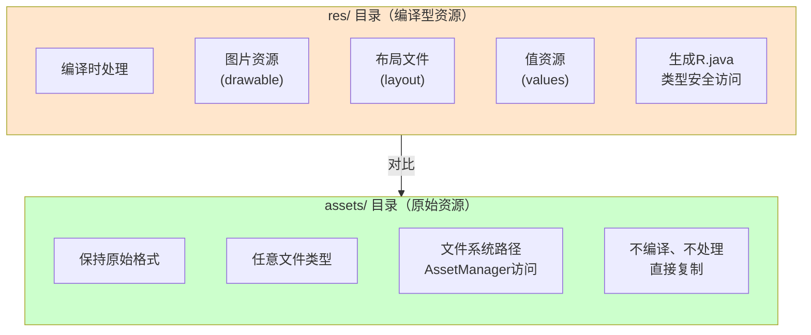
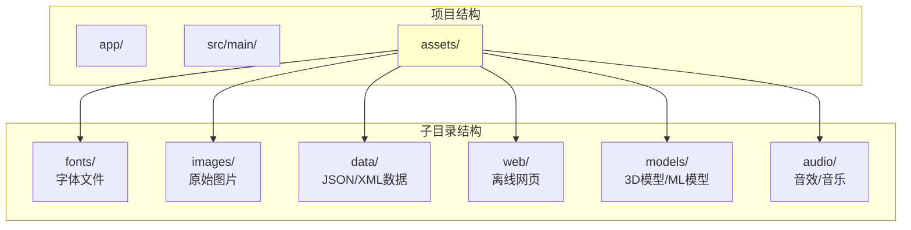
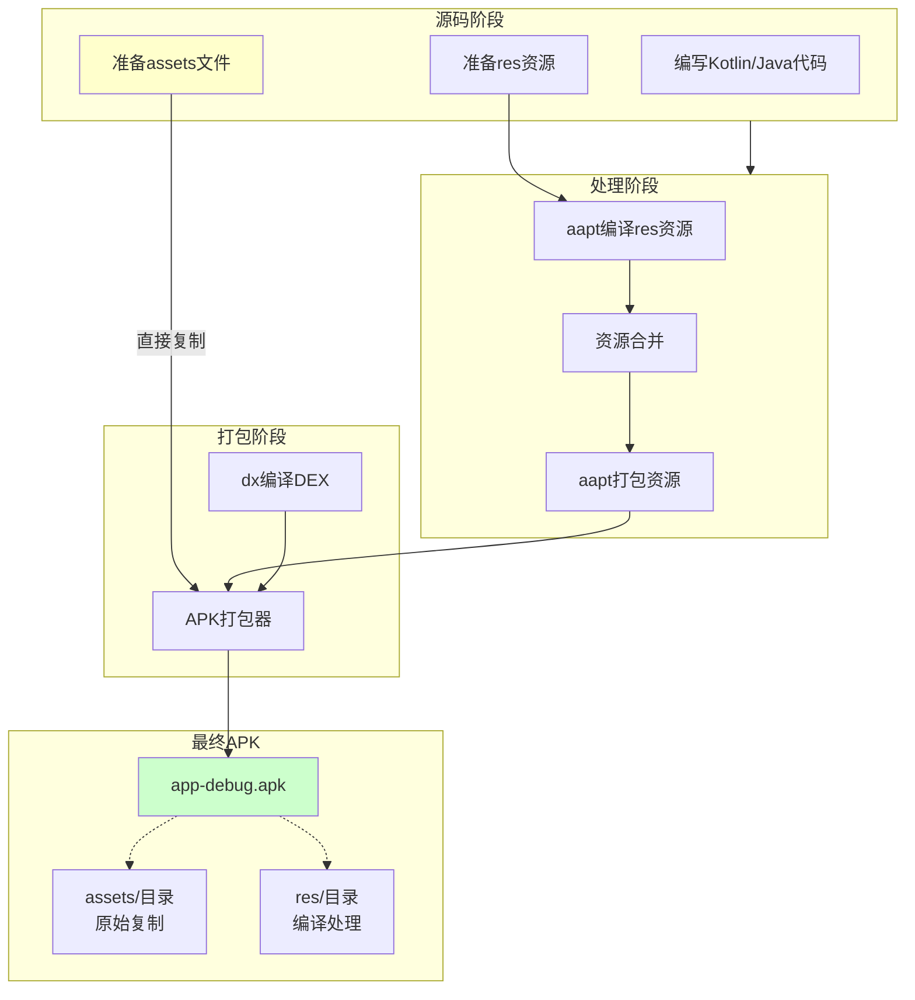

# 21.1.39 SingleArtifact.ASSETS——应用资源的神秘盒子

太阳慢慢偏西，营地边的树荫又扩大了一圈。蝉鸣声一浪一浪地从远处树梢涌来，像是在演奏一场夏日音乐会。

黛琳收拾好刚才讲APK_FROM_BUNDLE时用的笔记本，准备休息一下喝口水。忽然，洛芙举起手，像是在课堂上抢答问题。

"黛琳！我还有个问题！"洛芙的眼睛亮晶晶的，"刚才我们讲了APK，那……App里的那些图片啊、字体啊、还有那些放在assets文件夹里的东西，它们最后都去哪儿了？"

希尔在一旁笑出声："哈，问得好！那些就是今天要讲的——ASSETS！"

"assets？"洛芙歪着头，"是不是就是那个assets文件夹？"

黛琳露出赞许的笑容："没错，洛芙。今天我们要深入了解的，就是SingleArtifact.ASSETS——Android构建中的资源工件类型。"

伊莎好奇地问："那assets和res有什么区别？"

"这是个好问题，"黛琳重新坐好，"我们就从这个问题开始吧。"

---

## 神秘盒子：assets文件夹的秘密

黛琳又在地上找了一根树枝，她打算画一幅对比图。

"在Android项目中，你可以放资源的地方有两个——res文件夹和assets文件夹。"黛琳说，"它们看起来差不多，但本质上完全不同。"

她在地上画了两个方框：



"图1对应代码片段A（行20-35）。"黛琳说，"你可以这样理解——res文件夹就像一个'经过训练的士兵'，所有进入这里的资源都会被Android系统编译、优化、编号，方便快速访问。而assets文件夹就像一个'神秘盒子'，里面的东西保持原样，不会被编译，只是简单地复制到APK里。"

"那为什么需要两种方式？"洛芙问。

"好问题！"黛琳说，"各有各的用途。res适合大多数场景——图片、布局、字符串、颜色等，它们需要被系统高效管理。而assets适合存放'原封不动'的东西——比如游戏数据文件、离线网页、自定义字体文件、JSON数据等。"

---

## SingleArtifact.ASSETS：资源的打包形式

黛琳从背包里掏出一个笔记本："我给你们讲讲SingleArtifact.ASSETS是什么。"

"在Android Gradle API中，SingleArtifact.ASSETS表示应用的assets输出工件。"黛琳说，"当你构建APK时，所有放在assets目录下的文件都会被收集到这个工件中。"

"那它和APK是什么关系？"洛芙问。

"assets是APK的一部分，"黛琳解释道，"准确地说，APK是一个ZIP文件，assets目录是其中的一个子目录。SingleArtifact.ASSETS就是指这个目录里的内容。"

希尔补充道："还有一点很重要——assets不会被编译，不会生成R.java中的ID，你需要用AssetManager来读取它们。"

"我明白了！"伊莎眼睛一亮，"所以assets就像一个'保留原貌'的资源仓库！"

"伊莎的比喻很贴切！"黛琳笑着说，"我们来看具体的实现。"

---

## 深入理解：assets的工作原理

黛琳打开笔记本，开始画第二幅图。

"要理解assets，我们先来看看它们是如何被读取的。"黛琳说，"Android提供了AssetManager类来处理assets目录的文件。"

```kotlin
// 代码片段B：使用AssetManager读取assets

/**
 * AssetManager的使用方式：
 */

// 方式1：通过Context获取AssetManager
val assetManager = context.assets

// 方式2：读取文本文件
// open("filename.txt") 返回 InputStream
val textContent = assetManager.open("config.json").bufferedReader().use { it.readText() }

// 方式3：读取图片
// 注意：assets中的图片不会生成资源ID，不能用R.drawable访问
val bitmap = BitmapFactory.decodeStream(assetManager.open("images/logo.png"))

// 方式4：列出assets目录中的文件
val fileList = assetManager.list("")  // 根目录下的文件
val imageFiles = assetManager.list("images")  // images目录下的文件

// 方式5：读取字体（Android 8.0+）
val font = Font.Builder(assetManager, "fonts/custom_font.ttf").build()

/**
 * assets vs res 的对比：
 * 
 * res/：
 *   - 需要在XML中引用，如 @drawable/logo
 *   - 会生成资源ID
 *   - 编译时会被优化（如PNG压缩）
 *   - 适合UI资源
 * 
 * assets/：
 *   - 需要用AssetManager读取
 *   - 不生成资源ID
 *   - 保持原始格式
 *   - 适合数据文件、游戏资源、离线内容
 */

println("AssetManager是读取assets的唯一官方途径")
```

"哇！"洛芙盯着屏幕，"原来读取assets这么复杂！那assets文件夹里的文件结构是怎样的？"

"这个问题问得好，"黛琳说，"assets支持任意目录结构。你可以随便创建文件夹，就像普通文件系统一样。"

---

## assets的目录结构与组织方式

黛琳画了一幅图来说明assets的典型结构。



"图2对应代码片段C（行45-60）。"黛琳说，"assets目录下的子目录可以根据功能任意创建，这给了开发者很大的灵活性。"

"能不能给我看个实际的项目例子？"洛芙问。

"当然可以。"希尔调出一段代码：

```kotlin
// 代码片段D：一个典型项目的assets目录结构

/**
 * app/src/main/assets/
 * ├── fonts/
 * │   ├── custom_font.ttf
 * │   └── icon_font.ttf
 * ├── images/
 * │   ├── spritesheet.png
 * │   └── background.jpg
 * ├── data/
 * │   ├── levels.json
 * │   └── config.xml
 * ├── web/
 * │   ├── offline.html
 * │   ├── style.css
 * │   └── script.js
 * ├── models/
 * │   └── ml_model.tflite
 * ├── audio/
 * │   ├── bgm.mp3
 *   └── sfx/
 *       └── click.wav
 * └── game/
 *     ├── sprites.json
 *     └── maps/
 *         ├── map1.bin
 *         └── map2.bin
 */

// 读取示例
fun loadGameData(context: Context): GameData {
    val json = context.assets.open("data/levels.json")
        .bufferedReader()
        .use { it.readText() }
    
    return Gson().fromJson(json, GameData::class.java)
}

fun loadCustomFont(context: Context): Typeface {
    return Typeface.Builder(context.assets, "fonts/custom_font.ttf")
        .build()
}

println("assets支持任意目录结构，灵活组织资源文件")
```

"太棒了！"洛芙兴奋地说，"原来assets可以用来放这么多类型的内容！"

"没错！"黛琳笑着说，"这就是assets的魔力——它是一个'什么都能装'的篮子。"

---

## SingleArtifact.ASSETS在构建中的角色

黛琳喝了一口水，继续说道："现在我们来正式认识一下SingleArtifact.ASSETS这个类在构建系统中的角色。"

"在Android Gradle API中，每个应用模块的构建会生成多个输出工件，"黛琳说，"ASSETS就是其中之一。"

```kotlin
// 代码片段E：SingleArtifact类层次结构与ASSETS

/**
 * SingleArtifact<T> 是表示单一输出工件的基类
 * 不同的子类代表不同类型的输出
 */

// APK - 应用模块的直接输出
abstract class SingleArtifact<out File> {
    // 获取输出文件
    abstract fun getOutputFile(): Provider<File>
}

// 各种SingleArtifact类型
class SingleArtifact.APK : SingleArtifact<RegularFile>()
class SingleArtifact.APK_FROM_BUNDLE : SingleArtifact<RegularFile>()
class SingleArtifact.ASSETS : SingleArtifact<Directory>

/**
 * 在Android Gradle Plugin中使用：
 */

// 获取ASSETS工件
androidComponents.onVariants(selector().all()) { variant ->
    val assets: Provider<Directory> = variant.artifacts.get(SingleArtifact.ASSETS)
    
    // assets目录包含所有需要打包的原始资源
    println("assets目录: ${assets.get().asFile.absolutePath}")
}

/**
 * ASSETS工件的特点：
 * 
 * 1. 类型是Directory（目录），不是单个File
 * 2. 包含assets/目录下的所有文件和子目录
 * 3. 在APK打包时会被复制到APK的assets/目录下
 * 4. 不会经过任何编译处理，保持原始格式
 */

println("SingleArtifact.ASSETS代表构建输出的资源目录")
```

"原来是这样！"洛芙点点头，"assets目录会被直接复制到APK里。"

"完全正确！"希尔说，"而且这个过程是自动的——你只需要把文件放到assets目录，Gradle会帮你处理剩下的事情。"

---

## 反模式：assets的常见误区

黛琳的表情变得认真起来："我要特别强调几个常见的误区。"

"第一个误区是把assets当res用。"黛琳说，"很多人习惯把所有图片都放到assets里，认为这样更方便。但实际上，res更高效——它会生成资源ID，可以直接在XML中引用，还会自动适配不同屏幕密度。"

"第二个误区是忘记assets不会编译。"黛琳继续说，"比如你在assets里放了一个XML文件，它不会像res/xml那样被编译成二进制格式，而是保持原始的文本格式。"

```kotlin
// 反模式示例：错误地使用assets

// ❌ 错误做法1：在assets中放图片用于UI
// assets/images/logo.png
// 读取方式复杂，需要AssetManager
val bitmap = BitmapFactory.decodeStream(context.assets.open("images/logo.png"))

// ✅ 正确做法：用res
// res/drawable/logo.png
// 引用简单，XML中直接用 @drawable/logo
imageView.setImageResource(R.drawable.logo)

// ❌ 错误做法2：期望assets文件会被编译优化
// assets/data/config.xml
// 这个XML不会被编译，保持原始格式

// ✅ 正确做法：用res/xml
// res/xml/network_config.xml
// 这个XML会被编译成二进制格式，更高效

// ❌ 错误做法3：assets路径写错
// 错误：context.assets.open("file.txt") 
// 错误：context.assets.open("/file.txt")

// ✅ 正确做法：不要以斜杠开头
// 正确：context.assets.open("file.txt") 
// 正确：context.assets.open("subdir/file.txt")

// ✅ 正确做法4：处理assets不存在的情况
fun readAssetSafely(context: Context, path: String): String? {
    return try {
        context.assets.open(path).bufferedReader().use { it.readText() }
    } catch (e: IOException) {
        println("文件不存在: $path")
        null
    }
}
```

"记住，"黛琳总结道，"res是'正规军'，assets是'特种兵'——各有各的用途，不要混用。"

---

## assets的高级用法：动态加载与更新

伊莎忽然想起什么："黛琳，如果我想动态加载一些内容，比如游戏的新关卡，该怎么处理？"

"啊，说到这个，"黛琳的眼睛亮了起来，"assets有一个很强大的特性——它可以在应用安装后被更新！"

"想象一下，"伊莎比喻道，"你的应用是一个可以不断成长的生命，assets就是它可以吸收的新养分。"

"Exactly！"希尔说，"但注意——安装包里的assets是只读的，如果你想更新内容，需要另外下载文件到其他位置（比如内部存储或外部存储）。"

```kotlin
// 代码片段F：assets的高级用法

/**
 * assets的读取是只限于apk内部的
 * 如果需要更新，需要下载到其他位置
 */

// 方式1：只读读取（从APK中）
fun readFromAssets(context: Context, filename: String): String {
    return context.assets.open(filename).bufferedReader().use { it.readText() }
}

// 方式2：下载更新内容到内部存储
suspend fun downloadAndSaveUpdate(context: Context, url: String) {
    val httpClient = OkHttpClient()
    val response = httpClient.newCall(Get(url)).execute()
    
    // 保存到 filesDir（应用私有目录）
    val file = File(context.filesDir, "updates/new_data.json")
    response.body?.byteStream()?.use { input ->
        file.outputStream().use { output ->
            input.copyTo(output)
        }
    }
}

// 方式3：使用更新的数据（优先使用下载的，如果没有则使用assets）
fun loadDataWithFallback(context: Context, filename: String): String {
    // 优先读取下载的文件
    val updateFile = File(context.filesDir, "updates/$filename")
    if (updateFile.exists()) {
        return updateFile.readText()
    }
    
    // 回退到assets
    return context.assets.open(filename).bufferedReader().use { it.readText() }
}

// 方式4：asset作为默认数据，首次运行时复制到可写目录
fun initializeDataIfNeeded(context: Context) {
    val dbFile = File(context.getDatabasePath("app.db"))
    
    if (!dbFile.exists()) {
        // 从assets复制到数据库目录
        context.assets.open("databases/app.db").use { input ->
            dbFile.outputStream().use { output ->
                input.copyTo(output)
            }
        }
    }
}

/**
 * assets的使用场景：
 * 
 * 1. 默认数据：首次运行需要的初始数据
 * 2. 静态资源：不需要更新的资源（字体、图标等）
 * 3. 游戏数据：关卡配置、游戏逻辑等
 * 4. 离线内容：不需要联网的网页、文档等
 * 5. ML模型：机器学习模型文件（TensorFlow Lite等）
 */

println("assets是只读的，更新需要下载到其他位置")
```

"这也太酷了吧！"洛芙惊叹道，"那游戏更新不就可以只更新数据文件，不用更新整个应用？"

"对！"黛琳说，"这就是assets的'分离式更新'能力。应用本体保持不变，只需要下载新的数据文件。"

---

## 构建流程中的assets处理

希尔在地上画了一幅完整的流程图。

"我们来梳理一下，assets在APK构建过程中的处理流程。"希尔说。



"图3对应代码片段G（行95-120）。"希尔说，"注意看，assets是直接复制的，没有任何编译处理；而res会经过aapt的编译和优化。"

"我有个问题，"洛芙举手，"那assets里放太大的文件会不会导致APK太大？"

"好问题！"黛琳说，"确实有这个风险。Google Play对APK大小有限制——初始下载不能超过150MB。如果超过这个限制，你需要使用App Bundle或者把资源放到其他地方。"

---

## 实际应用：在Gradle中配置assets

"好了，理论讲完了，"黛琳说，"我们来看看在实际项目中怎么配置assets。"

"assets的默认位置是src/main/assets，"黛琳继续说，"你也可以在Gradle中自定义位置。"

```kotlin
// 代码片段H：在Gradle中配置assets

// app/build.gradle.kts

plugins {
    id("com.android.application")
    kotlin("android")
}

android {
    namespace = "com.example.myapp"
    compileSdk = 34

    defaultConfig {
        applicationId = "com.example.myapp"
        minSdk = 21
        targetSdk = 34
    }

    // 配置sourceSets（可以添加额外的assets目录）
    sourceSets {
        getByName("main") {
            // 添加额外的assets源集
            assets.srcDirs("src/main/assets", "src/extra/assets")
        }
    }
}

// 使用 Gradle任务获取ASSETS工件信息
tasks.register("printAssetsInfo") {
    doLast {
        val assetsDir = file("src/main/assets")
        if (assetsDir.exists()) {
            println("=== Assets 目录信息 ===")
            println("位置: ${assetsDir.absolutePath}")
            
            // 递归列出所有文件
            assetsDir.walkTopDown().forEach { file ->
                if (file.isFile) {
                    val sizeKB = file.length() / 1024
                    println("${file.relativeTo(assetsDir)} - ${sizeKB}KB")
                }
            }
            
            // 统计总大小
            val totalSize = assetsDir.walkTopDown()
                .filter { it.isFile }
                .sumOf { it.length() }
            println("\n总大小: ${totalSize / 1024}KB")
        }
    }
}

/**
 * assets配置的注意事项：
 * 
 * 1. assets目录默认在 src/main/assets
 * 2. 可以通过sourceSets添加多个assets目录
 * 3. assets中的文件会保持原始格式复制到APK
 * 4. 避免在assets中放大型文件，考虑使用App Bundle的动态特性
 */

// 在代码中访问assets
// val content = context.assets.open("filename.txt").bufferedReader().readText()
```

"这些都是实际项目中会用到的配置。"黛琳说，"记住，assets是原始资源的存放地，适合放不需要编译处理的内容。"

---

## 章节收尾：资源的哲学

太阳已经完全偏西，晚霞把天空染成了蜜桃色。蝉鸣声渐渐弱了下来，取而代之的是远处青蛙的低吟。

洛芙靠在树干上，仰头看着天空中的云彩慢慢飘过。

"黛琳，"洛芙轻声说，"我忽然觉得，assets和res好像两种不同的生活方式——res是'有秩序的'，一切都编号分类，井井有条；assets是'自由的'，保持原样，不受约束。"

黛琳笑了："洛芙，这个比喻真美。是的，它们代表了Android资源系统的两种哲学——'规范化管理'和'灵活自由'。"

"这不只是技术的选择，"伊莎轻声说，"也是对资源本身的一种尊重——有些需要被照顾得很好，有些需要保持它们原本的样子。"

希尔伸了个懒腰："好了，今天的魔法课到此结束！明天我们要讲什么？"

"明天啊，"黛琳想了想，"我们继续讲SingleArtifact家族的其他成员吧。"

"太好了！"洛芙跳起来，"那今天的日记有素材了！"

四个女孩收拾好东西，准备去河边洗洗手，然后做晚饭。夕阳把她们的影子拉得很长很长，就像assets文件夹里的每一个文件，都保持着它们原本的样子，走进了无数用户的手机里。

---

> 技术总结

---

## SingleArtifact.ASSETS——核心机制定义

**SingleArtifact.ASSETS** 是Android Gradle API中表示应用assets资源目录的工件类型。它指向构建输出中的assets目录，该目录包含所有放置在src/main/assets下的原始文件。这些文件在APK打包过程中保持原始格式，不会经过编译处理（如资源ID生成、二进制编译等），而是被简单地复制到APK的assets/目录中。开发者需要使用Android的AssetManager API来读取这些文件，这种设计适用于游戏数据、自定义字体、离线内容、机器学习模型等需要保持原始格式的资源。

---

#### 结构图

```mermaid
classDiagram
    class SingleArtifact {
        <<abstract>>
        +getOutputFile() Provider~File~
    }
    
    class SingleArtifact.APK {
        +getOutputFile() Provider~RegularFile~
    }
    
    class SingleArtifact.APK_FROM_BUNDLE {
        +getOutputFile() Provider~RegularFile~
    }
    
    class SingleArtifact.ASSETS {
        +getOutputFile() Provider~Directory~
    }
    
    class AssetManager {
        +open(String) InputStream
        +list(String) Array~String~
    }
    
    class ProjectStructure {
        +src/main/assets/
        +src/main/res/
    }
    
    SingleArtifact <|-- SingleArtifact.ASSETS
    SingleArtifact.ASSETS -->|提供| AssetManager
    ProjectStructure -->|生成| SingleArtifact.ASSETS
```

---

#### 反模式与陷阱

**1. 混淆assets和res的用途**
- 问题：在assets中放UI图片，导致无法在XML中直接引用
- 解决：UI资源应放res/，assets仅用于不需要编译的原始文件

**2. assets路径书写错误**
- 问题：使用斜杠开头（如"/file.txt"）导致文件找不到
- 解决：assets路径不应以斜杠开头，直接用"filename"或"subdir/filename"

**3. 未处理assets不存在的情况**
- 问题：直接调用open()而不捕获IOException
- 解决：使用try-catch包裹，或在调用前检查文件是否存在

**4. 在assets中放置过大的文件**
- 问题：超过Google Play的150MB限制
- 解决：使用App Bundle的动态特性，或将大文件放到服务器端下载

---

#### 设计哲学

**原始资源保留原则**：assets的设计理念是提供一种"不加修饰"地打包资源的方式。这种方式体现了以下工程实践：

1. **灵活性优先**：不限制文件类型，支持任意格式的资源
2. **原始格式保持**：文件不被编译，保持其原始状态
3. **动态更新支持**：与应用分离，可单独更新内容
4. **游戏/离线场景友好**：特别适合游戏数据、离线网页、ML模型等场景

---

#### 🏕️ 动手练习

**目标**：掌握assets资源的管理和读取方式，理解assets与res的区别

**项目概览**：创建一个使用assets资源的Android应用，实现自定义字体加载、JSON数据读取等功能

---

**Task 1：创建项目并配置assets目录**

**目标**：在Android项目中正确设置assets目录结构

**步骤**：
1. 创建Android项目（如果还没有）
2. 在src/main/下创建assets目录
3. 创建子目录并添加示例文件

**验收标准**：
- [ ] assets目录存在于 src/main/assets
- [ ] 至少包含一个子目录（如fonts/、data/）
- [ ] 每个子目录至少有一个文件

**提示代码**：
```kotlin
// 目录结构示例：
// app/src/main/assets/
// ├── fonts/
// │   └── custom_font.ttf
// └── data/
//     └── config.json
```

---

**Task 2：读取assets中的文本文件**

**目标**：使用AssetManager读取assets中的JSON配置

**步骤**：
1. 在assets/data/目录下创建config.json
2. 在代码中使用AssetManager读取文件
3. 解析JSON内容

**验收标准**：
- [ ] 成功读取config.json内容
- [ ] 使用Gson或Kotlinx.serialization解析JSON
- [ ] 将解析结果显示到Log或UI

**提示代码**```kotlin
// config.json
// {"app_name": "MyApp", "version": "1.0.0"}

// 读取代码
val json = context.assets.open("data/config.json")
    .bufferedReader()
    .use { it.readText() }
val config = Gson().fromJson(json, Config::class.java)
```

---

**Task 3：加载自定义字体**

**目标**：使用assets中的字体文件设置TextView字体

**步骤**：
1. 在assets/fonts/目录下放入ttf字体文件
2. 使用Typeface.Builder创建自定义字体
3. 应用到TextView

**验收标准**：
- [ ] 成功加载ttf字体文件
- [ ] TextView显示自定义字体
- [ ] 处理字体加载失败的异常

**提示代码**：
```kotlin
// 加载自定义字体
val typeface = Typeface.Builder(context.assets, "fonts/custom_font.ttf")
    .build()
textView.typeface = typeface
```

---

**Task 4：对比assets和res的访问方式**

**目标**：理解两种资源访问方式的差异

**步骤**：
1. 同一张图片分别放入assets和res/drawable
2. 分别使用AssetManager和R.drawable访问
3. 对比两种方式的代码复杂度和性能

**验收标准**：
- [ ] 完成两种方式的代码实现
- [ ] 记录两种方式的代码行数
- [ ] 总结各自的适用场景

**提示代码**：
```kotlin
// assets方式（复杂）
val bitmap = BitmapFactory.decodeStream(context.assets.open("images/photo.png"))

// res方式（简单）
imageView.setImageResource(R.drawable.photo)
```

---

**Task 5：实现资源回退机制**

**目标**：实现"下载资源优先，assets资源兜底"的策略

**步骤**：
1. 检查内部存储是否有更新文件
2. 如果有，读取更新文件
3. 如果没有，从assets读取默认文件

**验收标准**：
- [ ] 优先读取更新文件（模拟）
- [ ] 回退到assets默认文件
- [ ] 处理两种情况都失败的情况

**提示代码**：
```kotlin
fun loadDataWithFallback(context: Context, filename: String): String? {
    // 优先读取下载的文件
    val updateFile = File(context.filesDir, "updates/$filename")
    if (updateFile.exists()) {
        return updateFile.readText()
    }
    
    // 回退到assets
    return try {
        context.assets.open(filename).bufferedReader().use { it.readText() }
    } catch (e: IOException) {
        null
    }
}
```

---

#### 面试热身

**Q1：请解释assets和res的区别，以及各自的使用场景？**

参考要点：res是编译型资源，生成R.java ID，适合UI资源；assets是原始资源，保持原格式，适合数据文件、字体、游戏资源等

**Q2：如何读取assets中的文件？需要使用什么API？**

参考要点：使用AssetManager类的open()方法返回InputStream，list()方法列出目录内容

**Q3：assets中的文件会被编译吗？APK打包流程中如何处理？**

参考要点：assets不经过编译，直接复制到APK的assets/目录，保持原始格式

**Q4：如果需要动态更新assets中的内容，应该怎么做？**

参考要点：assets在APK中是只读的，动态更新需要下载到其他位置（如filesDir），然后优先读取更新文件

**Q5：SingleArtifact.ASSETS在Gradle构建中扮演什么角色？**

参考要点：表示应用模块的assets输出工件，是一个Directory类型，包含所有assets源文件

---

#### 参考实现要点

1. **合理选择资源位置**：UI资源用res，数据文件、游戏资源用assets

2. **注意APK大小**：assets中的文件会直接增加APK体积，避免放入过大的文件

3. **使用AssetManager处理异常**：读取assets可能抛出IOException，必须妥善处理

4. **路径不要以斜杠开头**：assets.open("file.txt")正确，assets.open("/file.txt")错误

5. **考虑动态更新需求**：如果内容需要经常更新，放在服务器端下载，assets只作为默认初始数据

---

> 学习建议

掌握assets资源的管理是Android开发的重要技能。建议在实际项目中同时使用assets和res两种资源方式，体会它们的差异。可以通过一个小项目来练习——比如实现一个简单的阅读应用，使用assets存储电子书内容，用res存储应用图标和界面资源。

---

## 洛芙的小小日记本

今天黛琳教会了我assets的魔法！原来应用里还有这样一个"神秘盒子"，保持着所有文件的原汁原味。res是"被照顾好的孩子"，assets是"保持本真的孩子"。希尔说得对——选对资源存放方式，才能让应用既高效又灵活！

---

## 今日关键词

**SingleArtifact.ASSETS**：Android Gradle API中的assets资源工件类型，指向构建输出的assets目录

**AssetManager**：Android提供的用于读取assets文件的API

**assets目录**：存放原始资源文件的目录，位于src/main/assets/，内容会被原样复制到APK

**res目录**：存放编译型资源的目录，位于src/main/res/，资源会被编译优化并生成R.java ID

**原始资源**：不经过编译处理，保持原始格式的资源文件

**Typeface.Builder**：用于从assets创建自定义字体的API（Android 8.0+）

**资源回退机制**：优先使用更新文件，没有时使用默认assets资源的策略

**APK打包**：将应用代码、资源、assets等合并成APK文件的过程
