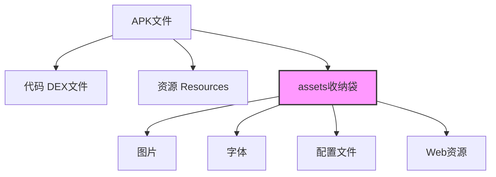
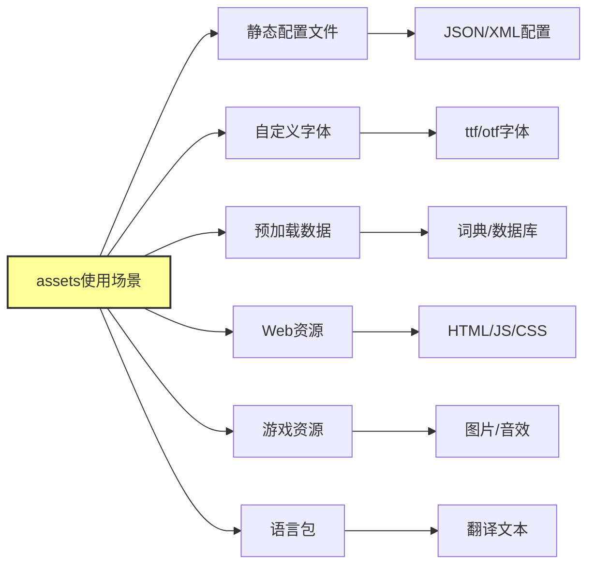
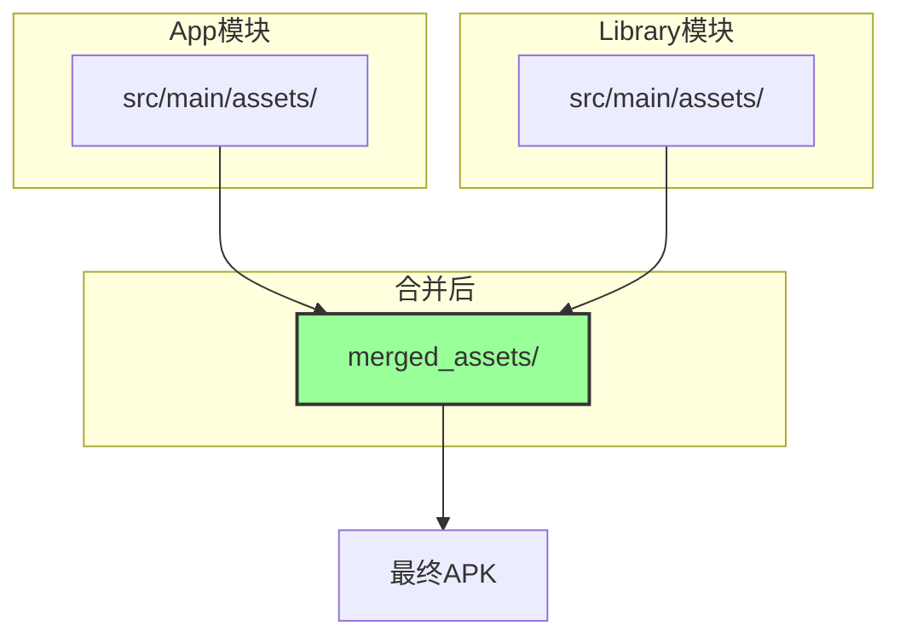
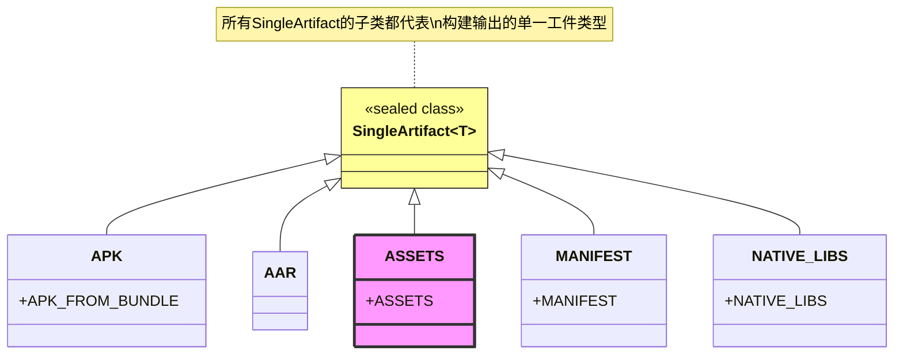
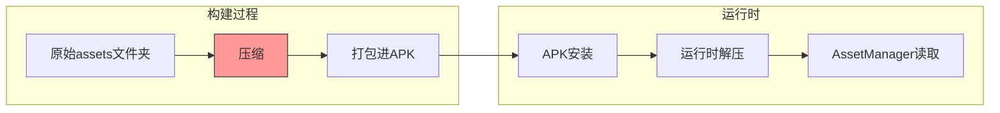

# 21.1.39 SingleArtifact.ASSETS

太阳已经完全偏西，阳光从金色变成了橙红色，把整个露营地染上一层温暖的色调。树荫比中午时分扩大了不少，正好覆盖住他们围坐的小圈。蝉鸣声依然此起彼伏，但听起来像是傍晚的大合唱，显得格外有精神。

洛芙靠在一棵老橡树上，手里转着一根草茎。她的目光却盯着黛琳刚才在白板上画的那张图——关于APK怎么从App Bundle生成的过程。伊莎正在用树枝在地上画着圈圈，似乎在想什么心事。希尔则低着头，在笔记本上敲敲打打。

“黛琳，”洛芙突然开口，“你刚才说的那些工件里，是不是还有一个叫ASSETS的？我看到图上画了。”

黛琳正在收拾白板笔的手停了下来。她转过身，嘴角微微上扬：“哦？你注意到了？没错，今天我们要讲的正好就是它。”

“ASSETS？”伊莎抬起头，眼睛亮了一下，“是不是就是那些图片、字体、还有那些奇怪的文件？我记得以前做项目的时候，好像有个文件夹叫assets。”

“对，就是它！”希尔也抬起头，“我之前还想问呢，这个assets文件夹到底是怎么工作的？为什么有时候能放东西进去，有时候又不行？”

黛琳重新拿起白板笔，在白板的空白处画了一个小盒子：“来，我们今天就来讲讲这个——SingleArtifact.ASSETS。”

---

## 像行李箱一样的assets

“想象一下，”黛琳开始画图，“你要去露营，需要带很多东西。有些人把所有东西都塞进行李箱，有些人则用收纳袋分类装好。行李箱就是你的APK，而assets文件夹就像是——”

“收纳袋！”洛芙眼睛一亮。

“对，收纳袋。”黛琳笑着点头，“assets就是Android用来放'额外行李'的地方。这些行李不包括代码（那是另一回事），而是一些静态的文件——图片、字体、配置文件、JSON数据，甚至是预加载的WebView页面。”

她画了一个简单的图：



“这里有个很重要的事情，”黛琳重点标注，“assets和resources不一样。resources会被编译进二进制格式（有R.java来索引），但assets是原封不动打包进去的。”

“那它们有什么优缺点？”洛芙问。

“好问题，”黛琳点点头，“assets的优点是灵活——你可以放任意类型的文件，不需要通过Android的资源系统。但缺点是，没有自动索引，需要自己用AssetManager来读取。”

---

## AssetManager的魔法

希尔把笔记本转过来：“我刚才查了一下其实现代的用法，来给你们演示一下。”

她敲了一段代码：

```kotlin
// 读取assets文件夹中的文件
// assets文件夹位于 src/main/assets/
class AssetReader(private val context: Context) {
    
    // 读取文本文件内容
    fun readTextFile(fileName: String): String? {
        return try {
            context.assets.open(fileName).bufferedReader().use { it.readText() }
        } catch (e: IOException) {
            e.printStackTrace()
            null
        }
    }
    
    // 读取图片为Bitmap
    fun readImage(fileName: String): Bitmap? {
        return try {
            BitmapFactory.decodeStream(context.assets.open(fileName))
        } catch (e: IOException) {
            e.printStackTrace()
            null
        }
    }
    
    // 列出assets文件夹中的所有文件
    fun listFiles(dir: String = ""): List<String> {
        return try {
            context.assets.list(dir).toList()
        } catch (e: IOException) {
            emptyList()
        }
    }
}
```

“哇，好像没有那么难嘛！”洛芙探过头来看，“我还以为要很复杂的操作。”

“其实还好，”希尔说，“就是标准的Java IO操作。open()方法返回一个InputStream，你可以用任何方式处理它。”

伊莎在旁边补充：“就像从背包里拿东西一样——你想拿什么姿势拿都可以，AssetManager只是负责把东西递给你。”

---

## assets的用途和使用场景

黛琳重新回到白板前：“那什么时候该用assets呢？我来给你们列举几个典型的场景。”

她在白板上画了一个更大的图：



“第一，”黛琳说，“静态配置文件。比如你有一个很大的JSON文件，不需要在运行时修改，放assets里最合适。”

“第二，自定义字体。”她继续，“有些app需要特殊的品牌字体，就可以放在assets里。”

“第三，预加载数据。”伊莎插话，“比如一个词典应用，需要预先装好词典数据。”

“对，还有第四个——WebView的离线资源。”黛琳说，“有时候你的app里嵌了一个网页离线版，就可以把HTML、CSS、JS都放在assets里，这样用户没网的时候也能用。”

“游戏也常用这个！”希尔兴奋地说，“所有的图片、音效、资源文件，都可以通过assets来加载。”

---

## 在构建系统中使用ASSETS

洛芙举手：“那个，我有个问题——刚才希尔说的都是运行时怎么读，那构建的时候呢？gradle怎么知道要打包哪些assets？”

黛琳笑了：“这就要回到我们之前说的SingleArtifact了。你记得我们之前讲过的Artifact类型吗？”

“记得，”洛芙点头，“有输出类型的工件，比如APK、bundle什么的。”

“对，SingleArtifact.ASSETS就是专门用来描述assets文件夹的工件类型。”黛琳在白板上写下：

> **SingleArtifact.ASSETS** — Assets that will be packaged in the resulting AAR, APK or Bundle.
> 
> When used as an input, the content will be the merged assets. For the APK, the assets will be compressed before packaging.

“这句话有几个重点，”黛琳逐条解释，“第一，它会被打包进AAR、APK或Bundle。第二，如果作为输入（就是被其他任务使用），那么内容是合并后的assets——也就是说，所有模块的assets会合并在一起。第三，对于APK，assets会在打包前被压缩。”

“合并？”洛芙注意到这个词，“你是说多个模块的assets会合并？”

“对，”黛琳点头，“假设你有一个app模块，还有一个library模块，两边都有assets文件夹。构建的时候，library的assets会被合并到app的assets里。”

她画了个图来说明：



---

## 如何添加新的assets文件夹

“那我要怎么添加自己的assets文件夹呢？”希尔问，“我记得好像不是直接在build.gradle里写路径？”

“对，有专门的API。”黛琳说，“在Android Gradle Plugin里，你要通过Sources来添加。”

她在白板上写了一段代码示例：

```kotlin
// 在 build.gradle.kts 中添加 assets 文件夹
android {
    sourceSets {
        getByName("main") {
            assets.srcDirs("src/main/assets")
            // 可以添加多个assets目录
            assets.srcDirs("src/additional_assets")
        }
    }
}
```

“还有一个更现代的方式，”希尔补充，“是通过android.buildFeatures来配置。”

不过黛琳摆摆手：“那个是另一个层面的东西了。我们今天主要讲SingleArtifact.ASSETS这个工件类型本身。”

她重新回到白板前，在ASSETS旁边又画了几个其他类型：



“看到没有，”黛琳指着ASSETS说，“它和APK、NATIVE_LIBS这些是并列的，都是最终构建产物的不同类型。”

---

## 实际用例示例

伊莎一直安静地听着，这时候突然说：“我有个想法——能不能举一个具体的例子？比如我们真的写一个用到assets的功能？”

“好啊！”希尔立刻来了精神，“我们来做一个小功能——读取一个预置的配置文件。”

她打开笔记本，开始敲代码：

```kotlin
// 场景：读取一个叫 config.json 的配置文件
// 文件位于 src/main/assets/config.json

// config.json 内容示例：
/*
{
    "app_name": "露营指南",
    "version": "1.0.0",
    "features": {
        "offline_maps": true,
        "weather_alerts": false,
        "camping_sites": ["富士山", "河口湖", "朝雾高原"]
    }
}
*/

data class AppConfig(
    val appName: String,
    val version: String,
    val features: Features
)

data class Features(
    val offlineMaps: Boolean,
    val weatherAlerts: Boolean,
    val campingSites: List<String>
)

// 使用Gson解析JSON
class ConfigLoader(private val context: Context) {
    
    private val gson = Gson()
    
    fun loadConfig(): AppConfig? {
        return try {
            val json = context.assets.open("config.json")
                .bufferedReader()
                .use { it.readText() }
            
            // Gson自动映射JSON到数据类
            gson.fromJson(json, AppConfig::class.java)
        } catch (e: Exception) {
            Log.e("ConfigLoader", "Failed to load config", e)
            null
        }
    }
}
```

“这样就能在app启动的时候读取预置的配置了，”希尔解释道，“不需要从服务器下载，也不需要硬编码在代码里。”

洛芙看得入神：“感觉assets就像是给app提供了一个'小仓库'，可以放各种静态的东西。”

“对，就是这个感觉！”伊莎笑着说，“而且这个仓库是编译进APK里的，用户下载的时候就已经有了。”

---

## 压缩和性能

黛琳突然想起什么：“对了，还有一件事要提醒你们——assets在打包进APK的时候会被压缩。”

她画了一个对比图：



“这里有个性能问题需要注意，”黛琳说，“如果你有大量的assets文件，特别是一些需要快速加载的资源（比如游戏资源），压缩可能会影响加载速度。”

“那怎么办？”洛芙问。

“有几种解决方案，”黛琳解释，“第一，有些资源可以用raw资源代替（不压缩），但那样会增加APK体积。第二，可以把不需要压缩的文件用特定的打包方式。第三，对于游戏，常用做法是分成多个APK或者使用Play Feature Delivery来动态下载资源。”

希尔补充：“还有一种方式是——干脆不压缩，Android允许你设置。”

```kotlin
android {
    packaging {
        // 排除特定文件不压缩
        resources.excludes += "assets/game/**"
    }
}
```

---

## 章节末尾的安静时刻

太阳已经完全落山了，天边只剩下一抹淡淡的晚霞。露营地的天空渐渐染上深蓝色，星星开始一颗一颗地冒出来。

伊莎仰头看着天空，喃喃地说：“今天的星星真好看啊。就像assets一样——它们就在那里，静静地待命，等着被需要的时候取出来用。”

洛芙不禁笑了：“伊莎姐，这也能联想到assets？”

“为什么不行？”伊莎也笑了，“星星也是资源啊，而且是静态的、不变的资源。就像assets一样——你放进去的是什么，出来的时候就是什么。”

黛琳收拾好东西，拍了拍手：“好了，今天就到这里吧。SingleArtifact.ASSETS的核心就是——它是一个容器，用来存放那些不需要编译、但需要打包进最终产物的静态文件。”

“那它和resources有什么区别？”洛芙最后问。

“很好的问题，”黛琳想了想，“简单说——resources会被编译，有R.java来索引；assets就是原样打包，用的时候自己找。什么时候用哪个？一般来说，能用resources解决的优先用resources，因为系统提供了更好的管理方式。但如果你的文件格式特殊、或者需要自己处理，就用assets。”

希尔合上笔记本：“今天的知识点挺清晰的——assets就是一个静态资源仓库，用AssetManager来读取。”

夜风轻轻吹过，带着松针的清香。远处的山轮廓渐渐模糊，只有蝉鸣声还在继续。

---

## 专业技术总结

> **SingleArtifact.ASSETS 定义** — SingleArtifact.ASSETS 是 Android Gradle Plugin 中表示应用资源文件夹的 Artifact 类型，代表那些将被原样打包进最终 AAR、APK 或 Bundle 的静态文件集合。这些文件在构建时会被合并（来自不同模块），并在打包进 APK 时进行压缩。

#### 结构图

```mermaid
classDiagram
    class Artifacts {
        +getSingleArtifact(type: Class~T~): Provider~T~
    }
    
    class SingleArtifact {
        <<sealed class>>
        +name: String
        +getFileName(): String
    }
    
    class SingleArtifact~ASSETS {
        +ASSETS: SingleArtifact~ASSETS~
    }
    
    SingleArtifact <|-- SingleArtifact~ASSETS
    Artifacts ..> SingleArtifact~ASSETS : "获取"
    
    note for SingleArtifact~ASSETS "代表 assets 文件夹的工件类型\n构建时合并，运行时分发"
```

#### 复杂度与影响

| 方面 | 影响 |
|------|------|
| APK体积 | assets会被压缩，增加额外体积 |
| 加载性能 | 运行时需要解压，小文件多时会有IO开销 |
| 灵活性 | 几乎支持所有文件格式 |
| 可维护性 | 需要手动管理，没有R.java索引 |

#### 反模式与陷阱

1. **在assets里放大型数据库文件** → 建议使用Play Feature Delivery动态下载，或使用Room内置的预填充数据库功能
2. **不处理文件读取异常** → assets文件可能不存在或损坏，必须做好异常处理
3. **assets和raw资源混淆** → raw资源会编译进二进制，assets是原样打包，用途不同

#### 设计哲学

- **静态内容优先** — assets适合放不需要在运行时修改的静态内容
- **原样打包原则** — assets中的文件不会经过Android资源系统编译，保持原始格式
- **模块合并机制** — 多模块的assets在构建时自动合并，但注意命名冲突
- **压缩策略选择** — 根据加载性能需求选择是否压缩

---

## 动手练习

**目标**：创建一个使用assets的简单应用，练习AssetManager的读取操作

### Task 1: 创建项目并添加assets

- 在 `src/main/assets/` 目录下创建 `greeting.txt`，内容为"露营愉快！"
- 创建一个新的Android项目（或使用现有项目）
- 验证文件结构：`src/main/assets/greeting.txt`

**验收标准**：
- [ ] assets/greeting.txt 文件存在且内容正确
- [ ] 项目能够正常编译

### Task 2: 读取文本文件

- 在MainActivity中添加代码，使用AssetManager读取greeting.txt
- 将读取的内容显示在TextView上

**提示代码**：
```kotlin
val greeting = assets.open("greeting.txt").bufferedReader().use { it.readText() }
textView.text = greeting
```

**验收标准**：
- [ ] app启动后显示"露营愉快！"
- [ ] 能够正确处理文件不存在的情况（不崩溃）

### Task 3: 列出assets目录

- 添加一个按钮，点击后列出assets目录下所有文件
- 使用 `assets.list("")` 获取文件列表
- 在Logcat输出文件列表

**提示代码**：
```kotlin
val files = assets.list("")  // 空字符串代表根目录
files?.forEach { Log.d("Assets", it) }
```

**验收标准**：
- [ ] 点击按钮后Logcat显示assets目录内容
- [ ] 能够处理空目录的情况

### Task 4: 加载JSON配置

- 在assets中创建 `settings.json`：
```json
{
    "theme": "dark",
    "notifications": true,
    "camping_sites": ["富士山", "河口湖"]
}
- 使用Gson解析并显示内容
- 添加 Gson 依赖：`implementation 'com.google.code.gson:gson:2.10.1'`

**验收标准**：
- [ ] JSON文件正确解析
- [ ] 数据正确显示在UI上

### Task 5: 加载图片资源

- 在assets中放一张图片 `camp.jpg`
- 使用BitmapFactory解码并显示在ImageView上

**提示代码**：
```kotlin
val bitmap = BitmapFactory.decodeStream(assets.open("camp.jpg"))
imageView.setImageBitmap(bitmap)
```

**验收标准**：
- [ ] 图片正确加载并显示
- [ ] 处理加载失败的情况

### Task 6: 面试热身

- 用自己的话解释assets和resources的区别
- 什么时候应该使用assets而不是resources？
- assets在APK中是如何存储的？
- 如何处理assets文件的异常读取？
- assets的压缩对性能有什么影响？

---

## 学习建议

> assets是Android应用中存放静态资源的重要方式，它提供了最大的灵活性——几乎可以存放任何类型的文件。但这种灵活性也带来了责任：开发者需要自己管理文件的读取、异常处理和生命周期。记住，能用resources解决的场景优先用resources，因为它有更好的系统支持和性能优化。只有在需要特殊格式或自行处理时，才使用assets。

---

## 洛芙的小小日记本

今天学的是assets——就是APK里那个像收纳袋一样的地方。黛琳说，它不像resources会被编译，而是原样打包进去，用的时候自己找。还讲了很多实际用法，感觉assets虽然简单，但用好它还是挺有门道的。明天要继续学什么工件类型呢？期待～

---

## 今日关键词

- **SingleArtifact.ASSETS**: Android Gradle Plugin中表示应用资源文件夹的工件类型，用于存放需要原样打包进APK/AAR/Bundle的静态文件
- **AssetManager**: Android提供的用于读取assets文件夹内容的API，通过Context.assets访问
- **assets目录**: 项目中位于src/main/assets/的目录，用于放置静态资源文件
- **资源合并**: 构建时来自不同模块的assets会自动合并到最终产物中
- **文件压缩**: assets在打包进APK时默认会被压缩，影响加载性能
- **资源类型选择**: 根据是否需要编译、是否需要R.java索引、文件格式等因素选择resources还是assets
