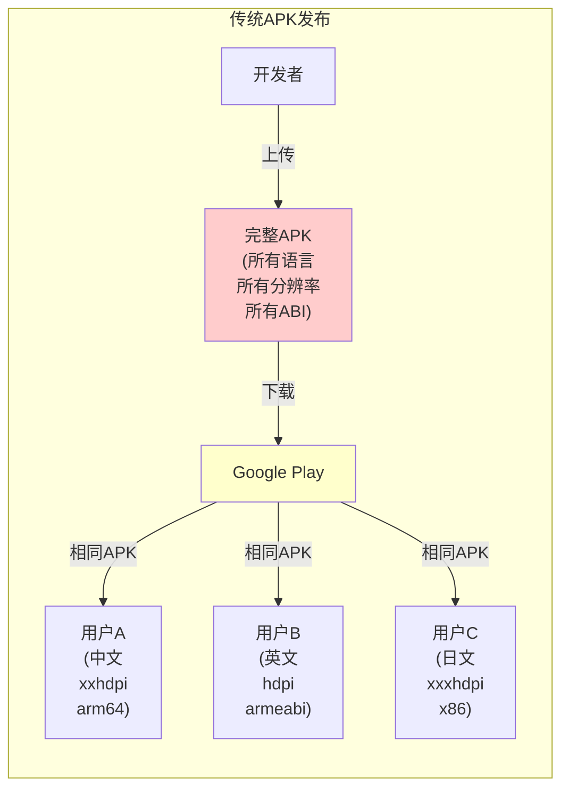
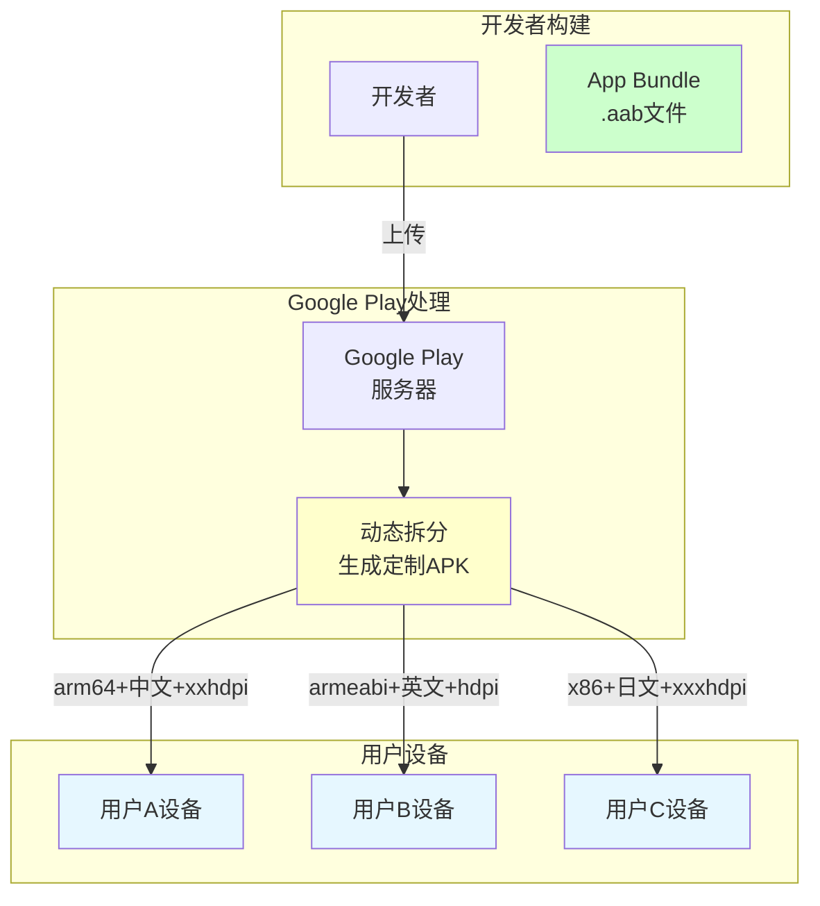
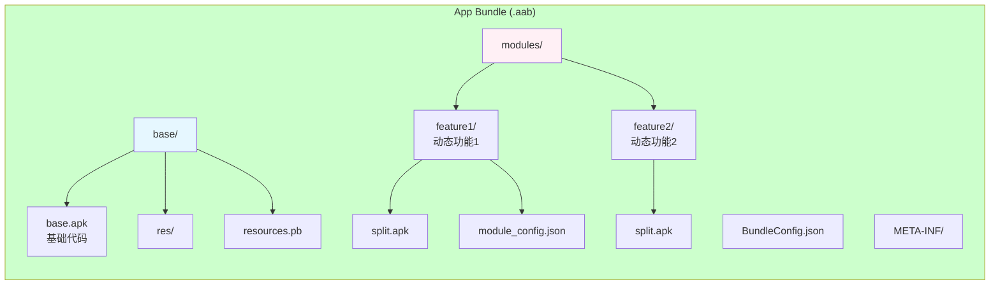
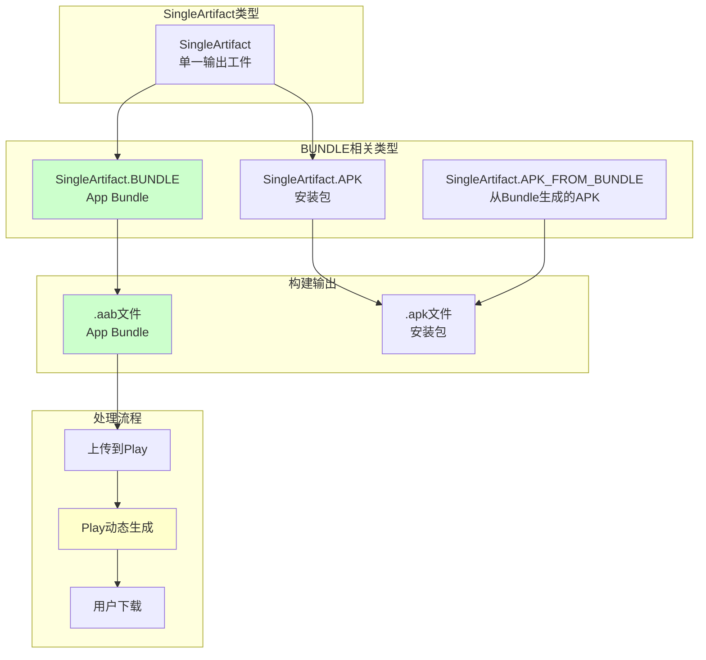

# 21.1.40 SingleArtifact.BUNDLE——App Bundle的神秘面纱

夕阳慢慢染红了远处的山峦，天空从金黄色渐变成橙红色，最后染上几抹淡淡的紫霞。蝉鸣声依旧此起彼伏，像是在为这美好的夏日傍晚伴奏。

洛芙正靠着树干翻看今天的笔记，忽然注意到黛琳从背包里拿出了一个蓝色的文件夹，上面印着Google Play的图标。

"黛琳，那是什么？"洛芙好奇地问。

"哦，这个啊，"黛琳举起文件夹，"这是我之前做的一个小项目——用App Bundle格式发布的。"

"App Bundle？"洛芙眼睛一亮，"是不是就是那个比APK更小的发布格式？"

希尔正好抬起头："哈，问对问题了！今天我们要讲的，就是SingleArtifact.BUNDLE——Android App Bundle的构建工件类型！"

"太好了！"伊莎轻轻鼓掌，"我一直想知道，为什么用App Bundle发布应用会更小，今天终于能弄明白了！"

黛琳笑着点点头："那我们就开始吧——从App Bundle的工作原理说起。"

---

## 神秘礼物：App Bundle是什么

黛琳找了一块平整的石头坐下，她打算从最基础的概念开始讲起。

"在说BUNDLE之前，我们先来想想一个老问题，"黛琳说，"以前我们是怎么发布应用的？"

"APK啊！"洛芙毫不犹豫地说，"就是一个安装包，用户下载了就能用。"

"对，"黛琳说，"传统的APK是一个'全能包'——里面包含了针对所有设备的资源、语言、ABI（CPU架构）。无论用户的手机是什么配置，你都给他发送完全相同的APK。"

她在地上画了一幅示意图：



"图1对应代码片段A（行15-30）。"黛琳说，"问题来了——用户A只需要arm64的中文xxhdpi资源，但APK里还包含了armeabi、x86等其他CPU架构的资源，还有英文、日文的语言资源——这些对他来说都是'垃圾'，白占空间。"

"原来如此！"洛芙恍然大悟，"那App Bundle是怎么解决这个问题的？"

"App Bundle的思路是——'我不要给你一个完整的包'，"黛琳说，"我只给你你需要的那部分。"

---

## 按需定制：App Bundle的工作原理

黛琳画了第二幅图来解释App Bundle的工作流程。

"当你上传App Bundle到Google Play时，"黛琳说，"Play会'切开'这个Bundle，为每个用户设备生成一个量身定制的APK。"



"图2对应代码片段B（行30-45）。"黛琳说，"这就是SingleArtifact.BUNDLE的魔力——它是一个'母体'，包含了所有可能的配置，但最后到达用户手里的，是只属于他那个设备的APK。"

伊莎眼睛闪闪发亮："这就像……一个会自动分拣的快递中心！"

"伊莎的比喻太贴切了！"黛琳笑着说，"Google Play就是那个'分拣中心'，它会根据用户的设备信息，从Bundle里取出对应的资源组装成APK。"

---

## SingleArtifact.BUNDLE：Gradle中的Bundle工件

希尔打开笔记本，开始讲解SingleArtifact.BUNDLE在Gradle API中的具体定义。

"在Android Gradle API中，"希尔说，"SingleArtifact.BUNDLE表示构建输出的App Bundle文件。"

```kotlin
// 代码片段C：SingleArtifact.BUNDLE的定义和使用

/**
 * SingleArtifact.BUNDLE - Android App Bundle 工件类型
 * 
 * App Bundle (.aab) 是Google Play推荐的发布格式
 * 它是一种特殊的ZIP格式，包含：
 *   - base/：基础模块代码和资源
 *   - config/：针对不同配置的拆分资源
 *   - modules/：动态功能模块（可选）
 *   - BundleConfig.json：Bundle的配置文件
 */

// 获取BUNDLE工件
androidComponents.onVariants(selector().all()) { variant ->
    val bundle: Provider<RegularFile> = variant.artifacts.get(SingleArtifact.BUNDLE)
    
    println("Bundle文件: ${bundle.get().asFile.absolutePath}")
    println("Bundle大小: ${bundle.get().asFile.length() / 1024 / 1024} MB")
}

/**
 * SingleArtifact.BUNDLE vs SingleArtifact.APK：
 * 
 * APK:
 *   - 最终安装包，用户可以直接安装
 *   - 包含所有资源的完整副本
 *   - 体积较大
 * 
 * BUNDLE:
 *   - 发布的中间格式，需要Play处理
 *   - 只包含基础资源，配置拆分由Play生成
 *   - 体积较小（但不是最终安装包）
 *   - 必须通过Play发布
 */

println("BUNDLE是发布格式，不是安装格式")
```

"等等，"洛芙举手，"你说BUNDLE不是安装格式？那用户怎么安装？"

"好问题！"黛琳说，"BUNDLE需要通过Google Play来'转换'成APK。用户看到的仍然是下载APK，但这个APK是Play动态生成的。"

---

## App Bundle的内部结构

黛琳在地上画了一幅Bundle的内部结构图。

"App Bundle实际上是一个ZIP文件，"黛琳说，"它的内部有特定的目录结构。"



"图3对应代码片段D（行55-70）。"黛琳说，"Bundle里有几个关键部分——base/是基础模块，modules/是动态功能模块，BundleConfig.json告诉Play怎么拆分这个Bundle。"

"动态功能模块是什么？"洛芙问。

"动态功能模块是App Bundle的一个强大特性，"黛琳解释说，"你可以把应用的一些功能拆分成独立模块，用户需要时才下载。比如——"

"比如一个地图应用，"希尔补充道，"基础包只包含地图浏览功能，离线地图下载功能作为动态模块，用户点击'下载离线地图'时才去下载那个模块。"

"原来是这样！"洛芙兴奋地说，"这样应用的初始安装包就会小很多！"

"完全正确！"黛琳说，"这就是App Bundle的核心价值——按需下载，减少初始安装体积。"

---

## 在Gradle中生成App Bundle

希尔跃跃欲试："让我来写一个实际生成App Bundle的配置！"

```kotlin
// 代码片段E：在Gradle中配置App Bundle生成

// app/build.gradle.kts

plugins {
    id("com.android.application")
    kotlin("android")
    // 启用App Bundle支持
    id("com.android.dynamic-feature") // 如果有动态模块
}

android {
    namespace = "com.example.myapp"
    compileSdk = 34
    
    defaultConfig {
        applicationId = "com.example.myapp"
        minSdk = 21
        targetSdk = 34
        
        // 启用Bundle生成
        // 在Android Studio中，这步是默认的
    }
    
    buildTypes {
        release {
            // 启用代码混淆和压缩
            isMinifyEnabled = true
            isShrinkResources = true
            proguardFiles(
                getDefaultProguardFile("proguard-android-optimize.txt"),
                "proguard-rules.pro"
            )
        }
        debug {
            // Debug构建默认不生成Bundle
            // 要生成Bundle需要额外配置
        }
    }
    
    // 配置Bundle生成的选项
    bundle {
        // 语言资源：默认包含所有语言
        // 设置为true可以让Play只包含设备需要的语言
        language {
            enableSplit = true
        }
        
        // ABI拆分：为不同CPU架构生成不同APK
        abi {
            enableSplit = true
        }
        
        // 屏幕密度拆分：为不同屏幕密度生成不同APK
        density {
            enableSplit = true
        }
    }
}

/**
 * Bundle生成的Gradle任务：
 * 
 * assembleDebug - 生成debug APK
 * assembleRelease - 生成release APK  
 * bundleDebug - 生成debug Bundle
 * bundleRelease - 生成release Bundle
 */

// 查看Bundle任务的输出
tasks.register("printBundleInfo") {
    doLast {
        val bundleDir = layout.buildDirectory.get().asFile.resolve("outputs/bundle")
        
        if (bundleDir.exists()) {
            println("=== Bundle 输出信息 ===")
            bundleDir.walkTopDown().forEach { file ->
                if (file.isFile) {
                    println("${file.name} - ${file.length() / 1024} KB")
                }
            }
        }
    }
}

println("Bundle配置完成，b bundleRelease 生成App Bundle")
```

"这个配置看起来好复杂！"洛芙说。

"其实大部分都是默认的，"希尔说，"你只需要应用'com.android.application'插件，然后运行bundleRelease任务就会自动生成Bundle。"

---

## APK与BUNDLE：详细对比

黛琳在地上画了一个详细的对比表格。

"我来总结一下APK和BUNDLE的核心区别。"黛琳说。

```kotlin
// 代码片段F：APK vs BUNDLE 详细对比

/**
 * APK (Android Package Kit)
 * 
 * 特点：
 * - 最终安装包格式
 * - 可以直接安装在设备上
 * - 包含所有资源（语言、ABI、屏幕密度）
 * - 体积较大
 * - 可以通过任何渠道分发（Play、APK文件、第三方商店）
 * - 一次构建，多个用户下载相同的内容
 */

// 获取APK
val apk: Provider<RegularFile> = artifacts.get(SingleArtifact.APK)
println("APK: ${apk.get().asFile.name}")


/**
 * BUNDLE (App Bundle)
 * 
 * 特点：
 * - 发布格式，不是安装格式
 * - 必须通过Google Play分发
 * - Play根据设备动态生成APK
 * - 体积较小（因为资源被拆分）
 * - 按需下载，首次安装体积小
 * - 支持动态功能模块
 * - Play负责最终APK的生成
 */

// 获取BUNDLE
val bundle: Provider<RegularFile> = artifacts.get(SingleArtifact.BUNDLE)
println("Bundle: ${bundle.get().asFile.name}")


/**
 * 体积对比示例：
 * 
 * 假设应用支持：
 * - 3种语言：中文、英文、日文
 * - 4种ABI：arm64-v8a, armeabi-v7a, x86, x86_64
 * - 5种屏幕密度：mdpi, hdpi, xhdpi, xxhdpi, xxxhdpi
 * 
 * 完整APK：150 MB
 * 
 * App Bundle：80 MB（只有基础资源）
 * 
 * 用户下载的实际APK：
 * - arm64 + 中文 + xxhdpi 设备：约40 MB
 * - armeabi + 英文 + hdpi 设备：约25 MB
 * 
 * 平均节省：约60-70%
 */

println("Bundle让每个用户只下载他需要的那部分")
```

"平均节省60-70%！"洛芙惊叹，"那确实很厉害！"

"而且这对用户体验也很好，"伊莎说，"尤其是网络不好的用户，下载的应用更小，流量消耗更少。"

---

## App Bundle的限制与注意事项

黛琳的表情变得认真起来："不过，App Bundle也有一些限制，大家需要注意。"

### 限制一：必须通过Google Play分发

"第一个限制是最重要的——App Bundle只能通过Google Play分发。"黛琳说，"你不能用Bundle直接安装到设备上。"

```kotlin
// ❌ 错误：尝试直接安装Bundle
// adb install app.aab
// 报错：Failure [INSTALL_PARSE_FAILED_NO_CERTIFICATES]

// ✅ 正确：Bundle需要Play处理后安装
// 1. 上传到Play Console
// 2. Play生成设备专属APK
// 3. 用户从Play下载安装

// 或者使用bundletool本地测试
// bundletool build-apks --bundle=app.aab --output=app.apks
// bundletool install-apks --apks=app.apks
```

### 限制二：不支持某些分发方式

"如果你需要通过官网直接下载APK，或者通过第三方商店分发，那就不适合用Bundle。"黛琳补充道。

### 限制三：首次发布需要时间

"Bundle上传到Play后，Play需要时间来生成所有配置的APK。"黛琳说，"首次发布可能需要几个小时才能覆盖所有设备配置。"

### 限制四：动态模块有复杂性

"动态功能模块虽然强大，但增加了应用的复杂性。"黛琳说，"你需要处理模块下载、状态管理、错误处理等情况。"

```kotlin
// 动态模块的使用示例
// 需要使用Play Core库

// 检查模块是否已下载
val moduleManager = SplitInstallManagerFactory.create(context)
val installedModules = moduleManager.installedModules
println("已安装模块: $installedModules")

// 请求下载动态模块
val request = SplitInstallRequest.newBuilder()
    .addModule("offline_maps")
    .build()

moduleManager.registerListener { state ->
    when (state) {
        is SplitInstallSessionStatus.DOWNLOADING -> {
            println("下载中: ${state.bytesDownloaded()}/${state.totalBytesToDownload()}")
        }
        is SplitInstallSessionStatus.INSTALLED -> {
            println("模块已安装: ${state.moduleNames()}")
        }
        is SplitInstallSessionStatus.FAILED -> {
            println("下载失败: ${state.errorCode()}")
        }
    }
}

moduleManager.startInstall(request)
```

---

## SingleArtifact.BUNDLE的获取时机

希尔讲解了一个很重要的 practical 问题："什么时候可以获取BUNDLE工件？"

"BUNDLE是在bundle任务完成后才生成的。"希尔说，"所以你不能在任何时候都能获取它。"

```kotlin
// 代码片段G：BUNDLE的获取时机

/**
 * BUNDLE生成的任务依赖链：
 * 
 * compileKotlin → processResources → mergeResources → 
 * bundleDebug/bundleRelease → SingleArtifact.BUNDLE
 */

// ❌ 错误：在编译任务之前就请求BUNDLE
tasks.register<MyTask>("earlyTask") {
    // 这时候BUNDLE还没生成，会获取失败
    val bundle = androidExtension.artifacts.get(SingleArtifact.BUNDLE)
}

// ✅ 正确：确保在bundle任务之后
tasks.register<AnalyzeBundleTask>("analyzeBundle") {
    // 依赖于bundleRelease任务
    dependsOn("bundleRelease")
    
    // 现在可以安全获取
    val bundle = androidExtension.artifacts.get(SingleArtifact.BUNDLE)
    
    doLast {
        println("Bundle大小: ${bundle.get().asFile.length() / 1024 / 1024} MB")
    }
}

// 或者使用finalizedBy
tasks.register<CopyBundleTask>("copyBundle") {
    // bundleRelease完成后自动执行
    finalizedBy("bundleRelease")
    
    val bundle = androidExtension.artifacts.get(SingleArtifact.BUNDLE)
    
    doLast {
        val output = project.file("dist/app.aab")
        bundle.get().asFile.copyTo(output, overwrite = true)
        println("已复制Bundle到: ${output.absolutePath}")
    }
}

println("BUNDLE必须在bundleRelease任务完成后才能获取")
```

---

## 实际场景：上传Bundle到Play Console

黛琳讲起了实际的工作流程："最后，我们来看看Bundle在实际发布中的应用。"

```kotlin
// 代码片段H：Bundle发布工作流

/**
 * App Bundle的完整发布流程：
 */

// 1. 开发阶段：生成Bundle
// ./gradlew bundleRelease
// 输出：app/build/outputs/bundle/release/app-release.aab

// 2. 上传到Play Console
// 可以通过Play Console网页上传
// 也可以使用命令行工具（fastlane、Gradle Play Publisher等）

// 3. Play处理Bundle
// Play服务器分析Bundle配置
// 为每个设备配置生成优化的APK
// 这个过程可能需要几小时

// 4. 发布测试
// 可以使用内部测试轨道快速测试
// ./gradlew bundleDebug
// 然后用bundletool本地测试

/**
 * bundletool本地测试：
 */

// 生成APKS文件（包含所有配置的APK）
// bundletool build-apks \
//   --bundle=app-release.aab \
//   --output=app-release.apks \
//   --ks=keystore.jks \
//   --ks-key-alias=mykey

// 安装到设备（会自动选择合适的APK）
// bundletool install-apks \
//   --apks=app-release.apks

// 获取设备规格
// bundletool get-device-spec --output=spec.json

// 根据规格生成APK
// bundletool build-apks \
//   --bundle=app-release.aab \
//   --output=device.apks \
//   --device-spec=spec.json

println("Bundle发布流程：构建 → 上传 → Play处理 → 用户下载")
```

---

## 反模式：Bundle的常见误区

黛琳总结了几个常见的误区：

### 误区一：Bundle可以直接安装

"很多人以为拿到.aab文件就可以直接安装，"黛琳说，"这是错的——aab必须通过Play处理成apk才能安装。"

```kotlin
// ❌ 误区1：Bundle可以直接安装
// 错误：adb install app.aab

// ✅ 正确做法：
// 1. Play处理后安装（用户从Play下载）
// 2. 本地测试用bundletool转换
// bundletool build-apks --bundle=app.aab --output=app.apks
// bundletool install-apks --apks=app.apks
```

### 误区二：Bundle比APK小所以一定更好

"Bundle本身可能比完整APK小，但不代表所有情况都用Bundle。"黛琳说，"如果你不发Play，或者需要直接分发APK，那APK更合适。"

```kotlin
// ❌ 误区2：忽略分发渠道
// 如果你要：
// - 直接官网下载 → 用APK
// - 第三方商店 → 用APK
// - Google Play发布 → 用Bundle

// ✅ 正确做法：根据分发渠道选择格式
val useBundle = true // 通过Play发布
val useApk = false // 直接分发
```

### 误区三：所有资源都拆分

"不是所有资源都应该拆分，"黛琳说，"有些资源很小，拆分带来的体积节省微乎其微，反而增加了复杂性。"

```kotlin
// ❌ 误区3：过度拆分
// bundle {
//     density {
//         enableSplit = true // 某些场景可能不需要
//     }
// }

// ✅ 正确做法：根据实际需求配置拆分策略
// 建议：先默认启用，观察实际节省效果再调整
```

### 误区四：忽视Play Core库的集成

"如果使用动态功能模块，必须集成Play Core库来处理模块下载。"黛琳说，"这增加了包体积和复杂度。"

```kotlin
// ✅ 正确做法：评估是否需要动态模块
// 考虑因素：
// - 模块是否足够大（值得单独下载）
// - 模块是否可选（不是所有用户都需要）
// - 团队是否有精力处理下载逻辑

// 如果不需要动态功能，可以不用Play Core库
```

---

## Bundle与动态功能模块的结合

伊莎好奇地问："黛琳，动态功能模块和App Bundle是什么关系？"

"好问题！"黛琳说，"动态功能模块是App Bundle的一个高级特性——你可以在Bundle里包含多个模块，用户按需下载。"

```kotlin
// 代码片段I：动态功能模块的配置

// feature/build.gradle.kts
plugins {
    id("com.android.dynamic-feature")
    kotlin("android")
}

android {
    namespace = "com.example.myapp.feature"
    
    // 动态模块配置
    dynamicFeatures = listOf("feature") // 在主模块中声明
}

// feature/src/main/AndroidManifest.xml
// <manifest xmlns:android="http://schemas.android.com/apk/res/android"
//     xmlns:dist="http://schemas.android.com/apk/dist">
//     
//     <dist:module
//         dist:name="offline_maps"
//         dist:title="@string/module_offline_maps_title"
//         dist:onDemand="true"  <!-- 可选：用户需要时下载 -->
//         dist:fusing="true">   <!-- 允许在安装时包含 -->
//     </dist:module>
// </manifest>

/**
 * 动态模块的类型：
 * 
 * 1. onDemand（按需下载）
 *    - 用户首次打开应用时不会下载
 *    - 用户触发特定功能时才下载
 *    - 适合：离线地图、高级功能、很少使用的功能
 * 
 * 2. installTime（安装时下载）
 *    - 用户安装应用时一起下载
 *    - 但独立于基础APK
 *    - 适合：功能模块化但基本所有用户都需要
 */

/**
 * 动态模块的文件结构：
 * 
 * app/
 * ├── build.gradle.kts (主模块)
 * └── src/main/
 * 
 * feature/
 * ├── build.gradle.kts (动态模块)
 * └── src/main/
 *     ├── AndroidManifest.xml
 *     ├── java/...
 *     └── res/...
 * 
 * 输出：
 * app/build/outputs/bundle/release/
 * ├── app-release.aab (基础Bundle)
 * └── feature/
 *     └── feature-release.aab (动态模块Bundle)
 */

println("动态模块让应用真正实现'按需加载'")
```

---

## 章节收尾：Bundle的哲学

夕阳已经完全落下山去，天空变成了深蓝色，几颗星星开始若隐若现。远处传来蟋蟀的低吟，和蝉鸣交织成一首夏夜的交响曲。

洛芙躺在草地上，双手枕在头后，盯着天上的星星。

"黛琳，"洛芙轻声说，"我觉得App Bundle好像……一个会变魔术的盒子。"

"会变魔术的盒子？"其他三人看向她。

"对，"洛芙继续说，"开发者放进去的是一个完整的Bundle，但到了每个用户手里，就变成了只属于他们自己的APK——不多不少，刚刚好。"

伊莎笑了："这就像……露营时的便当，开发者做好了'全家桶'，但每个人只打开自己那份。"

"伊莎的便当比喻也很棒！"黛琳笑着说，"App Bundle的核心理念就是'按需分配'——不让任何一个用户承担不必要的下载负担。"

希尔收拾着笔记本："今天我们学到了SingleArtifact.BUNDLE——App Bundle的构建工件类型。它是发布到Google Play的格式，会由Play动态生成设备专属的APK。"

"最大的收获是理解了为什么App Bundle能节省体积，"黛琳补充说，"因为它把完整的资源拆分了，Play只给用户发送他设备需要的那部分。"

洛芙坐起来："那明天我们要讲什么？"

"明天啊，"黛琳想了想，"我们继续讲SingleArtifact家族的其他成员吧——比如MERGED_MANIFEST、MERGED_NATIVE_LIBS之类的。"

"太好了！"洛芙跳起来，"感觉越学越深入了！"

四个女孩收拾好东西，准备去做晚饭。夜色渐浓，星星越来越多，就像Bundle里的每一个资源模块，都在等待属于自己的那个"设备"来领取。

---

> 技术总结

---

## SingleArtifact.BUNDLE——核心机制定义

**SingleArtifact.BUNDLE** 是Android Gradle API中表示App Bundle构建输出的工件类型。App Bundle（.aab）是一种发布格式而非安装格式，包含应用的代码和资源，但由Google Play在用户下载时动态生成设备专属的APK。这种机制通过语言拆分、ABI拆分、屏幕密度拆分等方式显著减少用户下载的应用体积，平均可节省60-70%的下载大小。SingleArtifact.BUNDLE在bundleRelease或bundleDebug任务完成后生成，是向Play分发应用的标准格式。

---

#### 结构图



---

#### 反模式与陷阱

**1. 误以为Bundle可以直接安装**
- 问题：尝试用adb install直接安装.aab文件
- 解决：Bundle必须通过Play处理，或使用bundletool本地转换为apks后安装

**2. 忽略分发渠道限制**
- 问题：需要直接分发APK时仍选择Bundle
- 解决：Bundle只适合Play分发，其他渠道用APK

**3. 过度拆分资源**
- 问题：启用所有拆分选项，增加复杂性但节省有限
- 解决：根据实际需求配置，默认选项通常最优

**4. 忽视Play Core库集成成本**
- 问题：使用动态模块但低估维护成本
- 解决：评估模块大小和使用频率后再决定是否使用动态模块

**5. Bundle生成时机错误**
- 问题：在bundle任务完成前请求BUNDLE工件
- 解决：使用dependsOn确保在bundleRelease完成后执行

---

#### 设计哲学

**按需分配原则**：App Bundle的设计体现了Google对现代应用分发的深刻理解——不再追求"一个包打天下"，而是让每个用户获得"刚刚好"的体验。这种设计体现了以下工程实践：

1. **减少用户成本**：无论是下载时间还是流量消耗，都最小化
2. **保持开发简洁**：开发者仍只需构建一次Bundle
3. **Play承担复杂性**：拆分和生成的复杂性由Google服务器处理
4. **支持动态功能**：模块化设计让功能可以按需加载
5. **持续优化**：Play不断改进生成算法，用户持续受益

---

#### 🏕️ 动手练习

**目标**：掌握App Bundle的生成、测试和发布流程

**项目概览**：配置Android项目生成App Bundle，使用bundletool进行本地测试

---

**Task 1：生成App Bundle**

**目标**：在Android项目中配置并生成App Bundle

**步骤**：
1. 确保项目使用com.android.application插件
2. 运行./gradlew bundleRelease
3. 找到生成的.aab文件

**验收标准**：
- [ ] bundleRelease任务成功执行
- [ ] 在outputs/bundle/release/目录下找到.aab文件
- [ ] 记录Bundle文件大小

**提示代码**：
```bash
# 生成Release Bundle
./gradlew bundleRelease

# 生成Debug Bundle  
./gradlew bundleDebug

# 查看输出
ls -la app/build/outputs/bundle/release/
```

---

**Task 2：使用bundletool本地测试Bundle**

**目标**：使用bundletool工具将Bundle转换为APK并安装到设备

**步骤**：
1. 下载bundletool（如果还没有）
2. 使用bundletool生成APKS文件
3. 安装到设备测试

**验收标准**：
- [ ] 成功生成.apks文件
- [ ] 成功安装到设备
- [ ] 应用可以正常启动

**提示代码**：
```bash
# 生成APKS（包含所有配置的APK）
java -jar bundletool.jar build-apks \
  --bundle=app/build/outputs/bundle/release/app-release.aab \
  --output=app.apks \
  --ks=your-keystore.jks \
  --ks-key-alias=your-alias

# 安装到设备
java -jar bundletool.jar install-apks --apks=app.apks
```

---

**Task 3：分析Bundle拆分配置**

**目标**：配置Bundle拆分选项并观察效果

**步骤**：
1. 在build.gradle中配置bundle选项
2. 启用/禁用不同拆分选项
3. 比较生成Bundle的大小变化

**验收标准**：
- [ ] 完成配置修改
- [ ] 记录不同配置下的Bundle大小
- [ ] 总结各拆分选项的效果

**提示代码**：
```kotlin
android {
    bundle {
        language {
            enableSplit = true  // 语言拆分
        }
        abi {
            enableSplit = true  // ABI拆分
        }
        density {
            enableSplit = true  // 屏幕密度拆分
        }
    }
}
```

---

**Task 4：模拟不同设备的APK生成**

**目标**：使用bundletool为特定设备生成专属APK

**步骤**：
1. 获取目标设备的规格信息
2. 使用bundletool生成针对该设备的APK
3. 比较大小差异

**验收标准**：
- [ ] 获取设备规格JSON
- [ ] 生成设备专属APK
- [ ] 对比与完整APK的大小差异

**提示代码**：
```bash
# 获取设备规格
java -jar bundletool.jar get-device-spec --output=device-spec.json

# 为特定设备生成APK
java -jar bundletool.jar build-apks \
  --bundle=app-release.aab \
  --device-spec=device-spec.json \
  --output=device-apks.apks
```

---

**Task 5：探索动态功能模块**

**目标**：创建一个简单的动态功能模块

**步骤**：
1. 在Android Studio中添加动态模块
2. 配置模块为onDemand类型
3. 实现模块的按需下载逻辑

**验收标准**：
- [ ] 动态模块创建成功
- [ ] 模块配置为按需下载
- [ ] 实现模块下载和加载逻辑

**提示代码**：
```kotlin
// AndroidManifest.xml中配置
// <dist:module
//     dist:name="premium_feature"
//     dist:onDemand="true"
//     dist:title="@string/premium_feature_title">
// </dist:module>

// 代码中请求下载
val splitInstallManager = SplitInstallManagerFactory.create(context)
val request = SplitInstallRequest.newBuilder()
    .addModule("premium_feature")
    .build()
splitInstallManager.startInstall(request)
```

---

#### 面试热身

**Q1：请解释App Bundle的工作原理？**

参考要点：App Bundle是发布格式，包含所有资源但按配置拆分，由Google Play在用户下载时动态生成设备专属APK，实现按需下载，减少用户下载体积。

**Q2：App Bundle和APK的区别是什么？**

参考要点：APK是最终安装包，包含完整资源；Bundle是发布格式，需Play处理生成APK。Bundle体积更小但只能通过Play分发，APK可直接安装和分发。

**Q3：App Bundle支持哪些拆分方式？**

参考要点：语言拆分（不同语言资源）、ABI拆分（不同CPU架构）、屏幕密度拆分（不同屏幕分辨率）、动态功能模块拆分（可选功能模块）。

**Q4：SingleArtifact.BUNDLE在Gradle构建中的角色是什么？**

参考要点：表示应用模块的App Bundle输出工件，在bundleRelease任务完成后生成，是上传到Play Console的标准发布格式。

**Q5：使用App Bundle有什么限制？**

参考要点：只能通过Google Play分发、需要Play Core库处理动态模块下载、首次发布需要处理时间、不支持直接安装。

---

#### 参考实现要点

1. **默认配置足够**：大多数情况下，不需要额外配置Bundle生成，默认选项已是最优

2. **测试使用bundletool**：本地测试Bundle时使用bundletool工具，避免每次都上传Play

3. **考虑动态模块成本**：动态模块虽然强大，但增加了复杂性，只在真正需要时使用

4. **Bundle不是替代APK**：如果需要直接分发（如官网下载），仍需构建APK

5. **关注Play Console分析**：发布后关注Play Console的安装包大小分析，了解实际节省效果

---

> 学习建议

App Bundle是现代Android应用发布的标准格式，建议所有通过Google Play分发的应用都使用Bundle。通过本章节的学习，应该理解Bundle的工作原理、优势和限制，以及