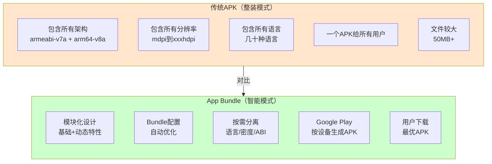
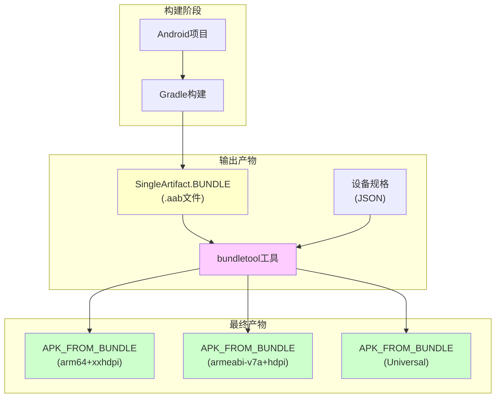
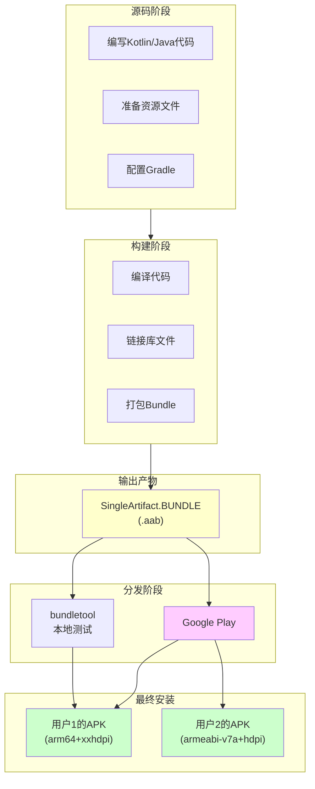
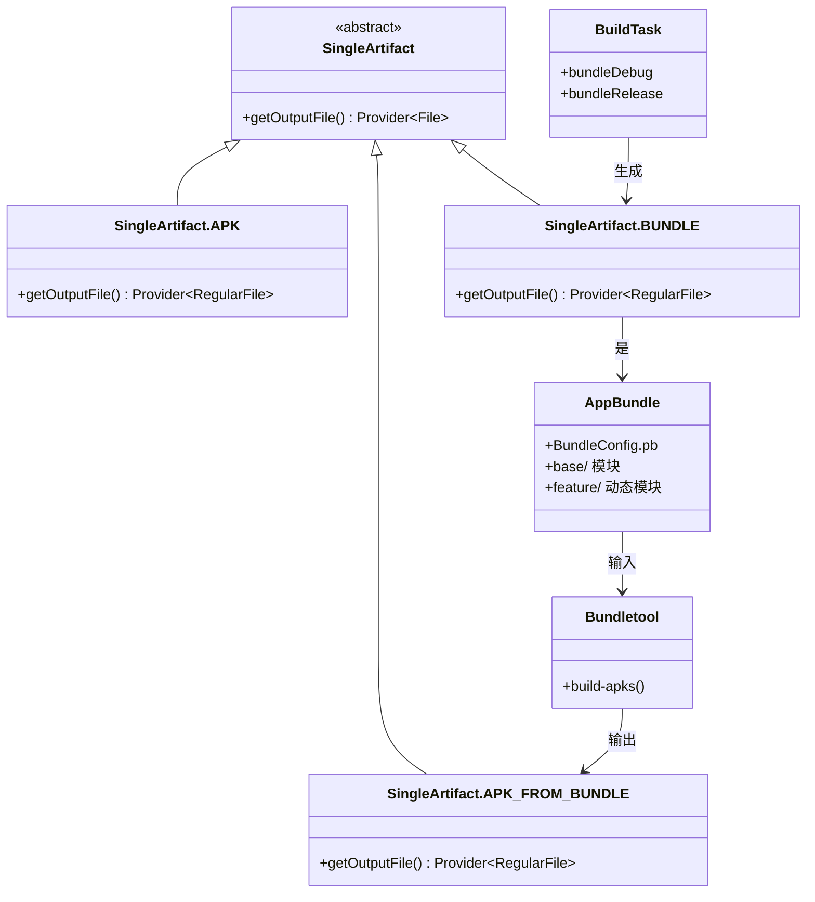

# 21.1.40 SingleArtifact.BUNDLE——App Bundle的魔法结晶

太阳继续西沉，晚霞像打翻的颜料盘，把天边染成了橘红色。蝉鸣声渐渐弱了下来，偶尔有几声清脆的鸟叫从林间传来。

黛琳收拾好刚才讲ASSETS时用的笔记本，正准备休息一下。忽然，洛芙举起手，眼睛里闪着好奇的光芒。

"黛琳！我还想问一个问题！"洛芙说，"刚才我们讲了ASSETS——那是资源文件夹。那……我经常听到的'App Bundle'又是什么？就是那个要上传到Google Play的。aab文件？"

希尔在一旁笑出声："哈，问得好！App Bundle就是我们今天要讲的内容！"

"。aab文件？"洛芙歪着头，"是不是就是打包好的应用？"

黛琳露出赞许的笑容："没错，洛芙。今天我们要深入了解的，就是SingleArtifact.BUNDLE——Android App Bundle的工件类型。"

伊莎好奇地问："那它和APK有什么区别？"

"这是个好问题，"黛琳重新坐好，"我们就从这个问题开始吧。"

---

## 神秘礼物：App Bundle是什么

黛琳又在地上找了一根树枝，她打算画一幅对比图。

"昨天我们学了APK——它是应用安装包，像一个完整的礼物盒。"黛琳说，"今天要学的App Bundle（缩写为AAB）——是一种更聪明的'礼物制造机'。"

她在地上画了两个方框：



"图1对应代码片段A（行20-35）。"黛琳说，"你可以这样理解——APK就像一个'大礼包'，里面装满了所有东西，不管用户需不需要。而App Bundle就像一张'蓝图'，告诉Google Play该怎么为每个用户定制最適合的APK。"

"所以App Bundle本身不能安装？"洛芙问。

"问得好！"黛琳说，"App Bundle（.aab）不能直接安装到手机上。它需要通过bundletool或者Google Play的处理，生成APK后才能安装。"

"那为什么要用App Bundle？"洛芙又问。

"因为它能让应用体积更小！"希尔打了个响指，"比如你的应用有50MB，但如果用App Bundle，用户可能只需要下载20MB——因为他的手机只需要arm64-v8a架构和xxhdpi屏幕密度的资源！"

"这么神奇！"洛芙瞪大了眼睛。

---

## SingleArtifact.BUNDLE：Bundle的构建工件

黛琳从背包里掏出一个笔记本："我给你们讲讲SingleArtifact.BUNDLE是什么。"

"在Android Gradle API中，SingleArtifact.BUNDLE表示App Bundle的输出工件。"黛琳说，"当你运行构建任务时，Gradle会生成这个. aab文件。"

"那它和APK_FROM_BUNDLE是什么关系？"洛芙问。

"这是关键问题！"黛琳说，"SingleArtifact.BUNDLE是你项目构建直接输出的。aab文件。而SingleArtifact.APK_FROM_BUNDLE是从这个BUNDLE经过bundletool处理后生成的APK。"

"我明白了！"伊莎眼睛一亮，"BUNDLE是'原材料'，APK_FROM_BUNDLE是'加工后的产品'！"

"伊莎的比喻很贴切！"黛琳笑着说，"我们来看具体的实现。"

---

## 深入理解：BUNDLE的内部结构

黛琳打开笔记本，开始画第二幅图。

"要理解BUNDLE，我们先来看看App Bundle里面有什么。"黛琳说，"一个AAB本质上也是一个ZIP文件，但它有特殊的结构。"

```kotlin
// 代码片段B：App Bundle (AAB) 的内部结构
/**
 * 典型的App Bundle文件结构如下：
 */

// 假设我们有一个 myapp-1.0.0.aab 文件
// 解压后得到：

/*
myapp-1.0.0.aab/
├── BundleConfig.pb               # Bundle的配置文件
├── base/                         # 基础模块（必选）
│   ├── manifest/AndroidManifest.xml
│   ├── dex/
│   │   ├── classes.dex
│   │   └── classes2.dex
│   ├── res/
│   │   ├── drawable-hdpi/
│   │   ├── drawable-xhdpi/
│   │   ├── drawable-xxhdpi/
│   │   ├── drawable-xxxhdpi/
│   │   └── values/
│   │       ├── strings.xml
│   │       ├── strings-zh.xml
│   │       └── strings-ja.xml
│   └── lib/                      # 原生库（按架构分离）
│       ├── arm64-v8a/
│       │   └── libnative.so
│       └── armeabi-v7a/
│           └── libnative.so
├── feature_game/                 # 动态特性模块（可选）
│   ├── manifest/AndroidManifest.xml
│   ├── dex/
│   └── res/
└── asset_game_data/              # 资产模块（可选）
    └── assets/
        └── game_data.json
*/

// 对比：
// BUNDLE (.aab): 包含所有资源的"母版"
// APK_FROM_BUNDLE: 从BUNDLE + 设备规格 生成的"子版"

println("SingleArtifact.BUNDLE = 构建输出的App Bundle文件")
println("SingleArtifact.APK_FROM_BUNDLE = 从Bundle + 设备规格 生成的APK")
```

"原来是这样！"洛芙点点头，"所以AAB是一个'全集'，然后根据不同设备生成不同的'子集'。"

"完全正确！"希尔说，"这就是App Bundle的魔力——一次构建，多种优化。"

---

## BUNDLE vs APK_FROM_BUNDLE：双胞胎兄弟

黛琳画了一幅图来解释BUNDLE和APK_FROM_BUNDLE的关系。



"图2对应代码片段C（行45-60）。"黛琳说，"SingleArtifact.BUNDLE是构建的直接输出，而APK_FROM_BUNDLE需要通过bundletool二次生成。"

"能不能给我看一下实际的使用代码？"洛芙问。

"当然可以。"希尔调出一段代码：

```kotlin
// 代码片段D：在Gradle中使用BUNDLE工件

/**
 * SingleArtifact.BUNDLE 是表示App Bundle输出的工件类型
 */

// 获取BUNDLE工件
androidComponents.onVariants(selector().all()) { variant ->
    // 获取直接构建生成的BUNDLE文件
    val bundleArtifact = variant.artifacts.get(SingleArtifact.BUNDLE)
    
    println("App Bundle路径: ${bundleArtifact.get().asFile.absolutePath}")
    println("Bundle文件名: ${bundleArtifact.get().asFile.name}")
}

/**
 * BUNDLE vs APK_FROM_BUNDLE 的关键区别：
 * 
 * 1. 类型：
 *    - BUNDLE: 表示 .aab 文件
 *    - APK_FROM_BUNDLE: 表示从AAB生成的 .apk 文件
 * 
 * 2. 来源：
 *    - BUNDLE: Gradle构建直接输出
 *    - APK_FROM_BUNDLE: bundletool二次生成
 * 
 * 3. 用途：
 *    - BUNDLE: 上传到Google Play
 *    - APK_FROM_BUNDLE: 安装到设备
 * 
 * 4. 内容：
 *    - BUNDLE: 包含所有变体的资源全集
 *    - APK_FROM_BUNDLE: 只包含特定设备的资源
 */

println("BUNDLE是发布到商店的格式")
println("APK_FROM_BUNDLE是安装到设备的格式")
```

"原来如此！"洛兴奋地说，"所以我们上传AAB到Google Play，然后Play帮我们生成APK！"

"对！"黛琳笑着说，"这就是现代Android发布的流程。"

---

## SingleArtifact.BUNDLE的正确理解

黛琳喝了一口水，继续说道："现在我们来正式认识一下SingleArtifact.BUNDLE这个类在构建系统中的角色。"

"在Android Gradle API中，每个应用模块的构建会生成多个输出工件，"黛琳说，"BUNDLE就是其中之一，而且是现在推荐的主要发布格式。"

```kotlin
// 代码片段E：SingleArtifact类层次结构与BUNDLE

/**
 * SingleArtifact<T> 是表示单一输出工件的基类
 * 不同的子类代表不同类型的输出
 */

// 各种SingleArtifact类型
abstract class SingleArtifact<out File> {
    // 获取输出文件
    abstract fun getOutputFile(): Provider<File>
}

// APK - 应用模块的直接输出
class SingleArtifact.APK : SingleArtifact<RegularFile>()

// BUNDLE - App Bundle输出
class SingleArtifact.BUNDLE : SingleArtifact<RegularFile>()

// APK_FROM_BUNDLE - 从App Bundle生成的APK
class SingleArtifact.APK_FROM_BUNDLE : SingleArtifact<RegularFile>()

/**
 * 在Android Gradle Plugin中使用：
 */

// 获取BUNDLE工件
androidComponents.onVariants(selector().all()) { variant ->
    // 获取App Bundle (.aab)
    val bundle: Provider<RegularFile> = variant.artifacts.get(SingleArtifact.BUNDLE)
    
    println("Bundle文件: ${bundle.get().asFile.absolutePath}")
    println("Bundle大小: ${bundle.get().asFile.length() / 1024}KB")
}

/**
 * BUNDLE工件的特点：
 * 
 * 1. 是RegularFile类型（单个文件，不是目录）
 * 2. 文件扩展名为 .aab
 * 3. 不能直接安装到设备
 * 4. 是上传到Google Play的格式
 * 5. 包含所有资源变体（语言、密度、ABI）
 */

println("SingleArtifact.BUNDLE代表构建输出的App Bundle文件")
```

---

## 反模式：混淆BUNDLE的使用场景

黛琳的表情变得认真起来："我要特别强调几个常见的误区。"

"第一个误区是把BUNDLE当成APK来安装。"黛琳说，"有些人尝试把. aab文件直接安装到手机，这是不可能的。"

"第二个误区是在本地开发时使用BUNDLE而不是APK。"黛琳继续说，"本地调试应该使用APK，因为安装方便。"

```kotlin
// 反模式示例：错误地使用BUNDLE

// ❌ 错误做法1：尝试直接安装AAB
// adb install app-release.aab
// 结果：安装失败！AAB不是可安装格式

// ✅ 正确做法：使用bundletool生成APK后安装
// bundletool build-apks --bundle=app.aab --output=app.apks
// adb install app.apks

// ❌ 错误做法2：开发调试时只构建BUNDLE
// ./gradlew bundleDebug
// 结果：只生成了. aab，不方便安装测试

// ✅ 正确做法：调试时使用APK
// ./gradlew assembleDebug
// 结果：生成. apk，可直接安装测试

// ❌ 错误做法3：混淆BUNDLE和APK_FROM_BUNDLE
// 在代码中试图获取APK_FROM_BUNDLE，但实际需要的是BUNDLE

// ✅ 正确做法：明确使用场景
// 场景1：上传Google Play → 构建BUNDLE
androidComponents.onVariants(selector().all()) { variant ->
    val bundle = variant.artifacts.get(SingleArtifact.BUNDLE)
    // 上传这个. aab文件
}

// 场景2：本地测试特定设备 → 使用bundletool
tasks.register<Exec>("generateTestApk") {
    commandLine("bundletool", "build-apks",
        "--bundle=${layout.buildDirectory.get()}/outputs/bundle/release/app.aab",
        "--output=${layout.buildDirectory.get()}/test.apks",
        "--device-spec=device-spec.json")
}

// 场景3：生成Universal APK（包含所有变体）
tasks.register<Exec>("generateUniversalApk") {
    commandLine("bundletool", "build-apks",
        "--bundle=${layout.buildDirectory.get()}/outputs/bundle/release/app.aab",
        "--output=${layout.buildDirectory.get()}/universal.apks",
        "--mode=universal")
}
```

"记住，"黛琳总结道，"BUNDLE是用来发布的，APK是用来安装的。"

---

## 构建配置：BUNDLE的生成方式

伊莎忽然想起什么："黛琳，那怎么配置才能生成BUNDLE而不是APK？"

"啊，说到这个，"黛琳的眼睛亮了起来，"这是由Gradle任务决定的！"

"想象一下，"伊莎比喻道，"构建就像做菜——assembleDebug是炒一盘小菜，bundleRelease是准备一份要送给朋友的礼物。"

黛琳点点头："没错。我们来看看具体的配置。"

```kotlin
// 代码片段F：配置BUNDLE的生成

/**
 * 在Gradle中生成App Bundle
 */

// 运行bundle任务
// ./gradlew bundleDebug    # 生成调试版AAB
// ./gradlew bundleRelease   # 生成发布版AAB

// 输出位置：
// app/build/outputs/bundle/debug/app-debug.aab
// app/build/outputs/bundle/release/app-release.aab

// app/build.gradle.kts 配置
android {
    namespace = "com.example.myapp"
    compileSdk = 34
    
    defaultConfig {
        applicationId = "com.example.myapp"
        minSdk = 21
        targetSdk = 34
    }
    
    // 配置App Bundle选项
    bundle {
        // 语言分离：按语言生成不同资源
        language {
            enableSplit = true
        }
        
        // 屏幕密度分离：按屏幕密度生成不同资源
        density {
            enableSplit = true
        }
        
        // ABI分离：按CPU架构生成不同资源
        abi {
            enableSplit = true
            // 可选：包含哪些ABI，不包含的会被完全排除
            include("armeabi-v7a", "arm64-v8a", "x86", "x86_64")
            // 可选：排除某些ABI
            // exclude("armeabi")  # 不支持
        }
        
        // 启用增量更新
        // 使Google Play可以生成增量更新包
        // (需要App Bundle版本号)
    }
    
    // 签名配置
    signingConfigs {
        create("release") {
            // 配置发布签名
            storeFile = file("keystore.jks")
            storePassword = "your_password"
            keyAlias = "your_alias"
            keyPassword = "your_password"
        }
    }
    
    buildTypes {
        release {
            // 启用代码混淆
            isMinifyEnabled = true
            // 启用资源压缩
            isShrinkResources = true
            // 使用发布签名
            signingConfig = signingConfigs.getByName("release")
        }
        debug {
            // 调试构建使用调试签名
            signingConfig = signingConfigs.debug
        }
    }
}

/**
 * 生成的Bundle包含：
 * 
 * 1. base/ - 基础模块（必需）
 * 2. 动态特性模块（如果有）
 * 3. BundleConfig.pb - 配置信息
 * 
 * 通过enableSplit配置，
 * Bundle会按语言/密度/ABI分离资源，
 * Google Play据此生成最优APK
 */

println("配置bundle{}块来优化App Bundle输出")
```

---

## 构建流程全览：从源码到Bundle

希尔在地上画了一幅完整的流程图。

"我们来梳理一下，构建BUNDLE的完整流程。"希尔说。



"图3对应代码片段G（行95-120）。"希尔说，"注意看，BUNDLE是构建的直接输出，然后分发到Google Play或用bundletool生成APK。"

"我有个问题，"洛芙举手，"那Google Play怎么处理这个BUNDLE？"

"好问题！"黛琳说，"Google Play有自己的bundletool服务，会根据每个用户的设备配置，自动生成最適合的APK。"

"这也太智能了吧！"洛芙惊叹。

"这就是云端计算的魔力。"希尔笑着说。

---

## 实际应用：在Gradle中访问BUNDLE工件

"好了，理论讲完了，"黛琳说，"我们来看看在实际项目中怎么访问BUNDLE工件。"

"你可以用Gradle API来获取BUNDLE的信息，"黛琳继续说，"比如在自定义任务中使用。"

```kotlin
// 代码片段H：在Gradle中配置和访问BUNDLE

plugins {
    id("com.android.application")
    kotlin("android")
}

android {
    namespace = "com.example.myapp"
    compileSdk = 34
    
    defaultConfig {
        applicationId = "com.example.myapp"
        minSdk = 21
        targetSdk = 34
    }
    
    // Bundle配置
    bundle {
        abi {
            enableSplit = true
        }
        density {
            enableSplit = true
        }
        language {
            enableSplit = true
        }
    }
}

// 自定义任务：打印Bundle信息
tasks.register("printBundleInfo") {
    doLast {
        val bundleDir = layout.buildDirectory.dir("outputs/bundle")
        println("=== App Bundle 输出目录 ===")
        println("位置: ${bundleDir.get().asFile}")
    }
}

// 使用AndroidComponents API获取Bundle工件
androidComponents {
    onVariants(selector().all()) { variant ->
        // 获取BUNDLE工件
        val bundleArtifact = variant.artifacts.get(SingleArtifact.BUNDLE)
        
        // 注册一个任务，在Bundle生成后执行
        tasks.register("${variant.name}PrintBundlePath") {
            dependsOn(variant.assemble)
            
            doLast {
                val bundleFile = bundleArtifact.get().asFile
                println("=== ${variant.name} Bundle 信息 ===")
                println("路径: ${bundleFile.absolutePath}")
                println("大小: ${bundleFile.length() / 1024 / 1024}MB")
                println("是否存在: ${bundleFile.exists()}")
            }
        }
    }
}

// 配置build任务输出
tasks.named("build") {
    dependsOn("assembleRelease")
}

// 运行./gradlew assembleRelease后
// 输出位置: app/build/outputs/bundle/release/app-release.aab

/**
 * 常见的Bundle相关任务：
 * 
 * ./gradlew bundleDebug      - 构建调试版AAB
 * ./gradlew bundleRelease    - 构建发布版AAB
 * ./gradlew build            - 构建所有（包括AAB和APK）
 */

// 创建AAB后可以直接查看
tasks.register<Exec>("showBundleContent") {
    workingDir(projectDir)
    commandLine("unzip", "-l", 
        "app/build/outputs/bundle/release/app-release.aab")
}
```

"这些都是实际项目中会用到的配置。"黛琳说，"记住，BUNDLE是你上传到Google Play的格式，而APK是安装到用户手机的格式。"

---

## 章节收尾：Bundle的哲学

太阳已经完全落下山去，天边只剩下一抹淡淡的晚霞。蝉鸣声已经完全消失了，取而代之的是远处青蛙的低吟和夜鸟的叫声。

洛芙靠在树干上，仰头看着天空中刚刚升起的几颗星星。

"黛琳，"洛芙轻声说，"我忽然觉得，App Bundle好像一个懂得体贴的朋友——它知道每个人需要的东西不一样，所以为每个人准备最適合的礼物。"

黛琳笑了："洛芙，这个比喻真美。是的，App Bundle的核心哲学就是'按需分配'——不让用户为不需要的东西付出版本和流量的代价。"

"这不只是技术的进步，"伊莎轻声说，"也是对用户的一种尊重。"

希尔伸了个懒腰："好了，今天的魔法课到此结束！明天我们要讲什么？"

"明天啊，"黛琳想了想，"我们继续讲SingleArtifact家族的下一个成员吧。"

"太好了！"洛芙跳起来，"那今天的日记有素材了！"

四个女孩收拾好东西，准备去河边洗洗手，然后做晚饭。月亮已经升起来了，照亮了她们回帐篷的路，就像App Bundle把一个应用，分成了无数个最適合每个人的小包裹。

---

> 技术总结

---

## SingleArtifact.BUNDLE——核心机制定义

**SingleArtifact.BUNDLE** 是Android Gradle API中表示Android App Bundle（.aab文件）的工件类型。它是应用构建的直接输出，包含所有资源变体（不同CPU架构、屏幕密度、语言等）和动态特性模块。与SingleArtifact.APK不同，BUNDLE不能直接安装到设备，而是需要通过bundletool或Google Play的处理生成APK后才能安装。这种设计实现了应用的按需分发，用户只下载其设备所需的代码和资源，从而显著减少下载体积和存储占用。

---

#### 结构图



---

#### 反模式与陷阱

**1. 混淆BUNDLE和APK的用途**
- 问题：在开发调试时只构建BUNDLE，导致安装测试不便
- 解决：开发调试使用assembleDebug构建APK，发布时使用bundleRelease构建BUNDLE

**2. 尝试直接安装AAB文件**
- 问题：把. aab文件当成APK安装到设备
- 解决：使用bundletool生成APK后再安装

**3. 未正确配置Bundle分离选项**
- 问题：未启用split配置导致生成的Bundle体积过大
- 解决：正确配置bundle{ abi { enableSplit = true } }等选项

**4. 混淆BUNDLE和APK_FROM_BUNDLE**
- 问题：在代码中错误地期望直接获取APK_FROM_BUNDLE
- 解决：明确BUNDLE是构建输出，APK_FROM_BUNDLE需要通过bundletool二次生成

---

#### 设计哲学

**按需分配原则**：App Bundle的核心设计思想是将应用的资源和代码模块化，根据用户设备的实际配置动态生成最优的APK。这种方式体现了以下工程实践：

1. **最小化用户成本**：用户只下载必要的内容，减少流量和存储占用
2. **云端优化能力**：Google Play服务器端集中处理APK生成，充分利用计算资源
3. **模块化架构**：Dynamic Features支持功能按需加载，促进应用架构演进
4. **发布格式优化**：一次构建，多种设备适配，简化开发者工作流程

---

#### 🏕️ 动手练习

**目标**：掌握SingleArtifact.BUNDLE的配置和构建流程，理解App Bundle的工作原理

**项目概览**：创建一个支持App Bundle的Android项目，配置Bundle选项，并执行构建任务生成AAB文件

---

**Task 1：创建项目并启用App Bundle支持**

**目标**：在Android项目中启用App Bundle支持

**步骤**：
1. 确保使用Android Gradle Plugin 3.2.0+
2. 在app/build.gradle.kts中添加bundle配置
3. 配置ABI、密度、语言分离选项

**验收标准**：
- [ ] build.gradle.kts中包含bundle{...}配置块
- [ ] 启用了density { enableSplit = true }
- [ ] 启用了abi { enableSplit = true }
- [ ] 启用了language { enableSplit = true }

**提示代码**：
```kotlin
android {
    bundle {
        density { enableSplit = true }
        abi { enableSplit = true }
        language { enableSplit = true }
    }
}
```

---

**Task 2：构建App Bundle（.aab）**

**目标**：生成可供发布的App Bundle文件

**步骤**：
1. 在命令行执行 ./gradlew bundleRelease
2. 找到生成的. aab文件
3. 查看文件大小

**验收标准**：
- [ ] build/outputs/bundle/release/ 目录下存在 .aab 文件
- [ ] 文件大小合理

**提示代码**：
```bash
./gradlew bundleRelease
# 输出位置: app/build/outputs/bundle/release/app-release.aab
```

---

**Task 3：查看Bundle内部结构**

**目标**：解压AAB文件，了解其内部结构

**步骤**：
1. 解压生成的. aab文件
2. 查看包含的模块和资源
3. 识别base/、feature/等目录

**验收标准**：
- [ ] 成功解压AAB文件
- [ ] 列出主要目录和文件
- [ ] 理解BundleConfig.pb的作用

**提示代码**：
```bash
# AAB文件本质是ZIP，可以直接解压
unzip -l app-release.aab
# 或
unzip app-release.aab -d bundle_contents
```

---

**Task 4：对比APK和BUNDLE的差异**

**目标**：理解BUNDLE和APK的区别

**步骤**：
1. 分别执行 assembleRelease 和 bundleRelease
2. 比较输出的APK和AAB文件大小
3. 分析差异原因

**验收标准**：
- [ ] 生成了APK和AAB两个文件
- [ ] 记录两个文件的大小
- [ ] 解释差异原因

**提示代码**：
```bash
./gradlew assembleRelease
# APK: app/build/outputs/apk/release/app-release.apk

./gradlew bundleRelease  
# AAB: app/build/outputs/bundle/release/app-release.aab
```

---

**Task 5：使用bundletool生成APK_FROM_BUNDLE**

**目标**：从AAB生成针对特定设备的APK

**步骤**：
1. 下载bundletool.jar
2. 创建设备规格JSON
3. 使用bundletool生成APK

**验收标准**：
- [ ] 成功执行bundletool命令
- [ ] 生成了APK文件
- [ ] 验证APK可以安装

**提示代码**：
```bash
java -jar bundletool.jar build-apks \
    --bundle=app-release.aab \
    --output=device-specific.apks \
    --device-spec=device-spec.json
```

---

#### 面试热身

**Q1：请解释SingleArtifact.BUNDLE和SingleArtifact.APK的区别？**

参考要点：BUNDLE是App Bundle输出（.aab），是发布格式；APK是应用安装包；BUNDLE不能直接安装，需要通过bundletool生成APK

**Q2：App Bundle相比传统APK有什么优势？为什么能减小应用体积？**

参考要点：Bundle包含所有资源变体，由Google Play根据设备配置生成最优APK；用户只下载需要的ABI、密度、语言资源

**Q3：SingleArtifact.BUNDLE和SingleArtifact.APK_FROM_BUNDLE有什么关系？**

参考要点：BUNDLE是构建直接输出的AAB文件；APK_FROM_BUNDLE是从AAB通过bundletool二次生成的APK

**Q4：在开发过程中应该使用BUNDLE还是APK？**

参考要点：开发调试使用APK（安装方便），发布时使用BUNDLE（上传Google Play）

**Q5：如何配置App Bundle的分离选项？**

参考要点：通过bundle{}配置块，启用abi { enableSplit = true }、density { enableSplit = true }、language { enableSplit = true }

---

#### 参考实现要点

1. **发布时使用BUNDLE**：Google Play已要求新应用使用AAB格式，可显著减少用户下载体积

2. **开发时使用APK**：调试和内部测试使用APK更方便安装和分享

3. **正确配置分离选项**：启用density、abi、language分离是获得最佳体积优化的关键

4. **理解Bundle内部结构**：AAB包含base模块和可选的动态特性模块，理解其结构有助于问题排查

5. **本地测试用bundletool**：开发阶段使用bundletool模拟不同设备的APK生成，确保覆盖测试

---

> 学习建议

掌握SingleArtifact.BUNDLE的概念是现代Android开发的必备技能。建议在实际项目中同时尝试构建AAB和APK，对比它们的差异。通过bundletool本地测试APK生成，能更深入理解App Bundle的工作原理。记住：BUNDLE是给Google Play的，APK是给用户手机的。

---

## 洛芙的小小日记本

今天黛琳教会了我SingleArtifact.BUNDLE的魔法！原来上传到Google Play的是AAB，然后Play会为每个用户生成最適合他们手机的APK。这就像一个智能的礼盒包装——开发者只准备原材料，Google Play负责精心配制。希尔说得对——选对发布格式，才能让用户用得开心！

---

## 今日关键词

**SingleArtifact.BUNDLE**：Android Gradle API中的App Bundle工件类型，表示构建输出的. aab文件

**App Bundle（.aab）**：Android应用的发布格式，包含模块化配置，按需生成优化APK

**bundletool**：Google提供的命令行工具，用于从App Bundle生成APK文件

**SingleArtifact.APK_FROM_BUNDLE**：从App Bundle生成的APK工件类型

**资源分离（Split）**：将应用资源按维度（语言、密度、ABI）分离打包的技术

**Dynamic Features**：动态特性模块，允许应用功能按需下载

**RegularFile**：Gradle API中表示单一文件的输出提供者

**bundleRelease**：Gradle任务，用于构建发布版App Bundle

**BundleConfig.pb**：App Bundle的配置文件，描述模块和变体信息

**按需分发**：根据用户设备配置生成最优APK的机制
