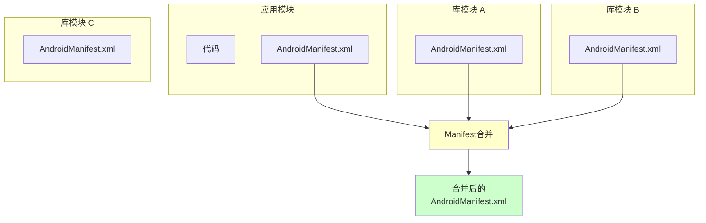
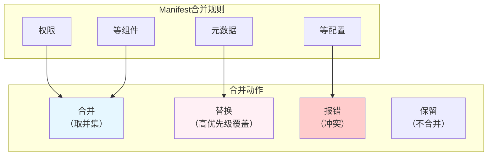
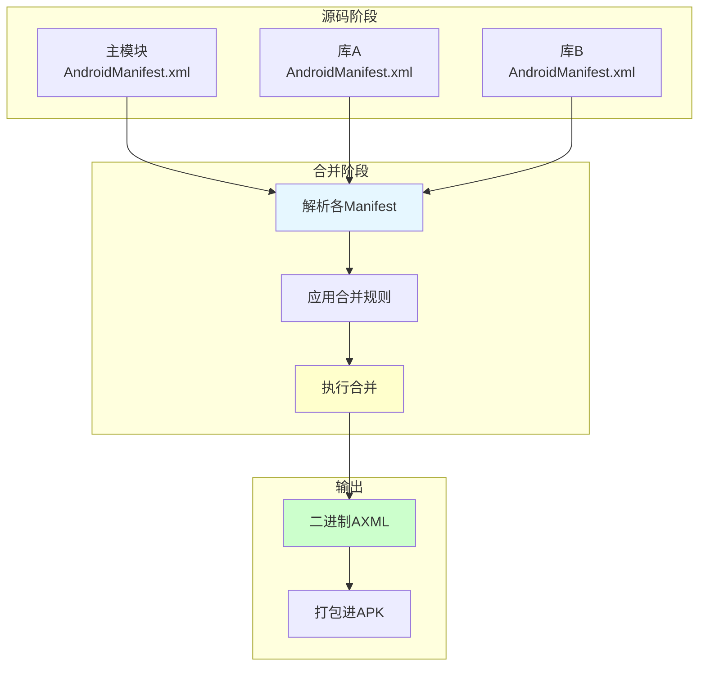
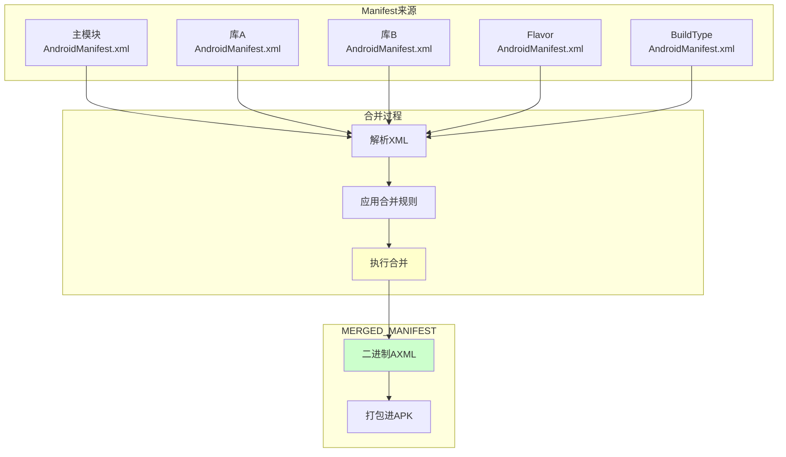

# 21.1.41 SingleArtifact.MERGED_MANIFEST——Manifest的融合魔法

太阳继续西沉，晚霞开始染红天边，从金黄色渐变成橙红色，最后染上几抹淡淡的紫霞。蝉鸣声一浪一浪地从远处树梢涌来，但比白天弱了许多，像是这场夏日交响曲正在慢慢走向尾声。

洛芙正翻着今天的笔记，忽然注意到黛琳从背包里拿出了一个文件夹，里面装着几张叠在一起的纸。

"黛琳，那是什么？"洛芙好奇地问。

"这个啊，"黛琳举起文件夹，"这是我之前项目里的AndroidManifest.xml——不过不是一份，是很多份合并之后的最终版本。"

"很多份？"洛芙眨眨眼，"一个应用需要这么多Manifest？"

希尔正好抬起头："哈，问得好！今天我们要讲的，就是SingleArtifact.MERGED_MANIFEST——合并后的Manifest！"

"Manifest也要合并？"洛芙更惊讶了，"就像……把好几封信拼成一封？"

"比那还复杂一点，"黛琳笑着说，"不过你的思路是对的——我们就从这个问题开始吧。"

---

## 神秘来信：为什么需要多个Manifest

黛琳找了一块平整的石头坐下，她打算从最基础的概念开始讲起。

"在说MERGED_MANIFEST之前，"黛琳说，"我们先来想想另一个问题——为什么一个应用需要多个Manifest？"

洛芙想了想："是不是……因为有很多库？"

"对！"黛琳说，"当你项目里依赖了一个库——比如RecyclerView、Glide、或者任何第三方库——每个库都有自己的AndroidManifest.xml。"

她在地上画了一幅示意图：



"图1对应代码片段A（行15-30）。"黛琳说，"每个库都需要声明自己的组件——比如Activity、Service、BroadcastReceiver，还有需要的权限。应用的Manifest也需要声明自己的组件和权限。构建系统会把它们全部合并成一份。"

"那合并的时候会不会打架？"洛芙问，"比如两个库都声明了同一个权限？"

"这就是合并规则的用武之地了，"黛琳说，"合并的时候有明确的规则——有些会合并，有些会覆盖，有些会报错。"

---

## 合并的规则：Manifest的"相处之道"

黛琳画了第二幅图来解释合并规则。

"Manifest合并不是随便拼凑的，"黛琳说，"Android构建系统有严格的合并规则。"



"图2对应代码片段B（行30-45）。"黛琳说，"一般来说——权限是合并的（取并集），组件是合并的，元数据是替换的，uses-sdk配置冲突会报错。"

伊莎好奇地问："那什么叫'替换'？"

"就是优先级高的会覆盖优先级低的，"黛琳解释说，"比如应用Manifest和库Manifest都声明了一个<meta-data>，应用的值会覆盖库的值。"

"原来是这么回事！"洛芙恍然大悟，"那MERGED_MANIFEST就是最终合并好的那一份？"

"没错，"黛琳说，"SingleArtifact.MERGED_MANIFEST就是表示这份合并后的Manifest文件的工件类型。"

---

## SingleArtifact.MERGED_MANIFEST：合并后的Manifest工件

希尔打开笔记本，开始讲解SingleArtifact.MERGED_MANIFEST的具体定义。

"在Android Gradle API中，"希尔说，"SingleArtifact.MERGED_MANIFEST表示构建过程中生成的、合并后的AndroidManifest.xml文件。"

```kotlin
// 代码片段C：SingleArtifact.MERGED_MANIFEST的定义和使用

/**
 * SingleArtifact.MERGED_MANIFEST - 合并后的AndroidManifest.xml 工件类型
 * 
 * 这是一个单文件工件，代表所有Manifest合并后的最终结果
 * 文件格式是二进制的AXML（Android XML）
 * 路径通常在：app/build/intermediates/merged_manifests/
 */

// 获取MERGED_MANIFEST工件
androidComponents.onVariants(selector().all()) { variant ->
    val mergedManifest: Provider<RegularFile> = variant.artifacts.get(SingleArtifact.MERGED_MANIFEST)
    
    println("合并后的Manifest文件: ${mergedManifest.get().asFile.absolutePath}")
    println("文件大小: ${mergedManifest.get().asFile.length()} bytes")
}

/**
 * MERGED_MANIFEST vs 原始Manifest：
 * 
 * 原始Manifest（app/src/main/AndroidManifest.xml）：
 *   - 开发者直接编写的文本XML
 *   - 位于源码目录
 * 
 * MERGED_MANIFEST：
 *   - 构建时合并后的二进制XML
 *   - 包含了所有库模块的声明
 *   - 是最终打包进APK的版本
 */

println("MERGED_MANIFEST是构建过程的中间产物")
```

"这个MERGED_MANIFEST在哪里能找到？"洛芙问。

"通常在build目录下的merged_manifests文件夹里，"希尔说，"但更好的方式是通过Artifacts API来获取，这样更可靠。"

---

## 合并过程详解：从源码到最终Manifest

黛琳在地上画了一幅更详细的合并流程图。

"我们来看看Manifest合并的具体过程。"黛琳说。



"图3对应代码片段D（行55-70）。"黛琳说，"合并过程发生在构建的早期，在代码编译之前。合并后的Manifest会被转换成二进制格式，然后打包进APK。"

"那合并的时候具体做了什么？"洛芙问。

"很多事，"黛琳说，"比如把所有权限合并到一起，把所有Activity、Service等组件列出来，处理所有的intent-filter，还有把所有的application节点合并……"

---

## 实际用例：MERGED_MANIFEST的用途

希尔讲解了一个很重要的实际问题："MERGED_MANIFEST可以用来做什么？"

"最常见的用途是静态分析。"希尔说，"你可以读取合并后的Manifest来分析应用的所有组件和权限。"

```kotlin
// 代码片段E：读取和分析MERGED_MANIFEST

/**
 * 场景：分析应用的所有组件和权限
 */

import org.w3c.dom.Document
import javax.xml.parsers.DocumentBuilderFactory

androidComponents.onVariants(selector().all()) { variant ->
    val mergedManifest: Provider<RegularFile> = variant.artifacts.get(SingleArtifact.MERGED_MANIFEST)
    
    // 读取合并后的Manifest
    val manifestFile = mergedManifest.get().asFile
    
    // 解析XML（注意：MERGED_MANIFEST是二进制格式，需要用AXML解析器）
    // 这里用简单的文本方式演示结构
    println("=== Manifest分析 ===")
    println("文件路径: ${manifestFile.absolutePath}")
    
    // 可以分析的内容：
    // 1. 所有声明的权限
    // 2. 所有Activity/Service/BroadcastReceiver
    // 3. 所有intent-filter
    // 4. 应用的package、versionCode等
}

/**
 * 典型的分析场景：
 * 
 * 1. 权限检查工具：检查应用请求的所有权限
 * 2. 组件扫描工具：列出所有组件，用于安全分析
 * 3. 依赖分析：推断应用使用了哪些库
 * 4. 合规检查：确保Manifest符合某些规范
 */

// 权限分析示例
tasks.register<AnalyzePermissionsTask>("analyzePermissions") {
    dependsOn("processDebugResources")
    
    val mergedManifest = androidExtension.artifacts.get(SingleArtifact.MERGED_MANIFEST)
    
    doLast {
        val manifestFile = mergedManifest.get().asFile
        println("分析权限：$manifestFile")
        // 实际项目中可以使用AXML解析库
    }
}

println("MERGED_MANIFEST常用于静态分析和工具开发")
```

"听起来好专业！"洛芙说，"那普通人需要关心这个吗？"

"如果是应用开发者，可能不太会直接用到，"黛琳说，"但如果是做工具、或者研究别人的应用，就会用到这个。"

---

## 合并冲突：Manifest的"世界大战"

黛琳的表情变得认真起来："Manifest合并最麻烦的情况是冲突。"

"冲突？"洛芙问，"就是合并不了的情况？"

"对，"黛琳说，"有些情况下，合并会失败或者产生意外结果。"

```kotlin
// 代码片段F：常见的Manifest合并冲突

/**
 * 冲突场景1：相同的组件名称
 */

// app/src/main/AndroidManifest.xml
/*
<manifest package="com.example.app">
    <application>
        <activity android:name=".MainActivity" />
    </application>
</manifest>
*/

// library/src/main/AndroidManifest.xml
/*
<manifest package="com.example.library">
    <application>
        <activity android:name=".MainActivity" />  <!-- 冲突！ -->
    </application>
</manifest>
*/

/**
 * 冲突场景2：冲突的uses-sdk
 */

// app/build.gradle
/*
android {
    defaultConfig {
        minSdk = 21
        targetSdk = 34
    }
}
*/

// library/build.gradle
/*
android {
    defaultConfig {
        minSdk = 23  <!-- 冲突！应用是21，库是23 -->
    }
}
*/

/**
 * 冲突场景3：权限冲突
 */

// app/AndroidManifest.xml
/*
<uses-permission android:name="android.permission.CAMERA" />
*/

// library/AndroidManifest.xml
/*
<uses-permission android:name="android.permission.CAMERA" />  <!-- 重复但不冲突 -->
*/

// 结果：权限会自动合并，最终只有一个CAMERA权限请求

/**
 * 解决冲突的方法：
 * 
 * 1. tools:node="replace" - 完全替换
 * 2. tools:node="merge" - 强制合并
 * 3. tools:node="remove" - 移除
 * 4. tools:node="removeAll" - 移除所有同名节点
 */

println("合并冲突需要用tools:node属性来解决")
```

"原来是这样！"洛芙说，"那如果真的冲突了，构建会失败吗？"

"不一定，"黛琳说，"有些冲突会导致构建失败（比如uses-sdk冲突），有些只是警告（比如重复的权限）。关键是要理解合并规则。"

---

## tools:node：解决冲突的魔法棒

伊莎好奇地问："黛琳，你刚才说的tools:node是什么？"

"好问题！"黛琳说，"tools:node是Manifest合并的'控制开关'，可以精确控制如何处理冲突。"

```kotlin
// 代码片段G：tools:node的使用

/**
 * tools:node的常见值：
 * 
 * replace - 完全替换低优先级的节点
 * merge - 强制合并子节点
 * remove - 移除该节点
 * removeAll - 移除所有同名节点
 * mark - 标记为需要人工处理（会报错）
 */

/**
 * 示例1：替换整个application节点
 */

<!-- library的Manifest -->
<application
    android:name=".MyApp"
    tools:node="replace">  <!-- 替换整个application -->
    <activity android:name=".LibraryActivity" />
</application>

/**
 * 示例2：移除某个权限
 */

<!-- library的Manifest -->
<uses-permission 
    android:name="android.permission.READ_CONTACTS"
    tools:node="remove" />  <!-- 移除这个权限 -->

/**
 * 示例3：移除所有同名的meta-data
 */

<meta-data
    android:name="api_key"
    android:value="library_key"
    tools:node="removeAll" />  <!-- 移除所有api_key -->

/**
 * 示例4：强制合并
 */

<!-- library的Manifest -->
<application>
    <activity android:name=".LibraryActivity">
        <intent-filter>
            <action android:name="android.intent.action.MAIN" />
            <category android:name="android.intent.category.LAUNCHER" />
        </intent-filter>
    </activity>
</application>

<!-- 添加tools:merge="children"强制合并子节点 -->
<activity
    android:name=".LibraryActivity"
    tools:merge="children">
    <intent-filter>
        <!-- 这里的intent-filter会与主模块的合并 -->
    </intent-filter>
</activity>

println("tools:node是控制Manifest合并行为的关键属性")
```

"这个tools:node好强大！"洛芙说，"感觉像是在给合并器下命令。"

"没错，"黛琳笑着说，"它就是用来精确控制合并行为的。"

---

## 获取MERGED_MANIFEST的正确方式

希尔敲起了代码，讲解如何正确获取MERGED_MANIFEST工件。

"在Gradle任务中获取MERGED_MANIFEST是有讲究的。"希尔说，"你不能在任何时候都获取它。"

```kotlin
// 代码片段H：MERGED_MANIFEST的获取时机

/**
 * Manifest合并发生在构建的早期
 * 任务依赖链：
 * 
 * processManifest → mergeDebugManifest/mergeReleaseManifest → MERGED_MANIFEST
 */

// ❌ 错误：在processManifest之前就请求MERGED_MANIFEST
tasks.register<MyTask>("earlyTask") {
    // 这时候MERGED_MANIFEST还没生成，会获取失败
    val manifest = androidExtension.artifacts.get(SingleArtifact.MERGED_MANIFEST)
}

// ✅ 正确：确保在mergeManifest任务之后
tasks.register<AnalyzeMergedManifestTask>("analyzeMergedManifest") {
    // 依赖于mergeDebugManifest任务
    dependsOn("mergeDebugManifest")
    
    val mergedManifest = androidExtension.artifacts.get(SingleArtifact.MERGED_MANIFEST)
    
    doLast {
        println("Manifest文件: ${mergedManifest.get().asFile.absolutePath}")
        println("文件大小: ${mergedManifest.get().asFile.length()} bytes")
    }
}

// 或者使用finalizedBy
tasks.register<ProcessMergedManifestTask>("processMergedManifest") {
    finalizedBy("mergeDebugManifest")
    
    val mergedManifest = androidExtension.artifacts.get(SingleArtifact.MERGED_MANIFEST)
    
    doLast {
        // 分析或处理合并后的Manifest
        val file = mergedManifest.get().asFile
        println("处理Manifest: ${file.name}")
    }
}

// 推荐：使用onVariants回调（在配置阶段）
androidComponents.onVariants(selector().all()) { variant ->
    // 这里可以安全地获取MERGED_MANIFEST
    // 因为回调会在工件可用时被调用
    val mergedManifest: Provider<RegularFile> = variant.artifacts.get(SingleArtifact.MERGED_MANIFEST)
    
    println("Variant: ${variant.name}")
    println("Merged Manifest: ${mergedManifest.get().asFile}")
}

println("MERGED_MANIFEST必须在mergeManifest任务完成后才能获取")
```

"原来时机这么重要！"洛芙说。

"构建任务都有依赖关系，"黛琳说，"了解这些依赖关系才能正确获取工件。"

---

## 实际场景：构建一个Manifest分析工具

黛琳讲起了实际的工作场景："我们来做一个小工具，读取MERGED_MANIFEST并输出所有组件。"

```kotlin
// 代码片段I：完整的Manifest分析示例

/**
 * 场景：创建一个Gradle任务，分析应用的Manifest
 */

tasks.register<AnalyzeMergedManifestTask>("analyzeMergedManifest") {
    group = "analysis"
    description = "分析合并后的Manifest"

    // 确保依赖正确的任务
    dependsOn("mergeDebugManifest")

    doLast {
        // 获取MERGED_MANIFEST
        val manifestProvider = androidExtension.artifacts.get(SingleArtifact.MERGED_MANIFEST)
        val manifestFile = manifestProvider.get().asFile

        println("=".repeat(40))
        println("Manifest分析报告")
        println("=".repeat(40))
        println("文件: ${manifestFile.name}")
        println("大小: ${manifestFile.length()} bytes")
        println()

        // 读取Manifest内容（二进制格式，需要解析器）
        // 这里我们假设Manifest是可读的XML（debug版本可能保留原始XML）
        
        // 实际项目中可以使用以下库来解析二进制AXML：
        // - axmlprinter
        // - android-binres
        // - Androguard
        
        // 示例：使用简单的正则来匹配（不推荐生产环境）
        val content = manifestFile.readText()
        
        // 统计权限数量
        val permissionPattern = """android:name="android\.permission\.\w+"""".toRegex()
        val permissions = permissionPattern.findAll(content).map { it.value }.toSet()
        
        println("权限数量: ${permissions.size}")
        permissions.take(10).forEach { println("  - $it") }
        if (permissions.size > 10) {
            println("  ... 还有 ${permissions.size - 10} 个")
        }
        println()

        // 统计Activity数量
        val activityPattern = """<activity[^>]*android:name="[^"]+"""".toRegex()
        val activities = activityPattern.findAll(content).map { it.value }.toSet()
        
        println("Activity数量: ${activities.size}")
        activities.take(5).forEach { println("  - $it") }
        if (activities.size > 5) {
            println("  ... 还有 ${activities.size - 5} 个")
        }

        println("=".repeat(40))
    }
}

// 简化版：直接在回调中处理
androidComponents.onVariants(selector().all()) { variant ->
    val mergedManifest = variant.artifacts.get(SingleArtifact.MERGED_MANIFEST)
    
    // 注册一个任务来处理Manifest
    tasks.register("${variant.name}PrintManifest", PrintManifestTask::class) {
        manifestFile.set(mergedManifest.map { it.asFile })
    }
}

abstract class PrintManifestTask : DefaultTask() {
    @TaskAction
    fun print() {
        val file = manifestFile.get()
        println("Manifest: ${file.absolutePath}")
    }
}

println("Manifest分析工具对于理解应用结构很有帮助")
```

"这个工具看起来好有用！"洛芙说，"可以看看应用到底声明了哪些权限和组件。"

"很多安全工具就是这样做的，"黛琳说，"比如检查应用是否请求了不必要的权限。"

---

## 反模式：Manifest合并的常见误区

黛琳总结了几个常见的误区：

### 误区一：以为Manifest不会自动合并

"很多人不知道Manifest会自动合并，"黛琳说，"以为只要在主Manifest里声明就行。"

```kotlin
// ❌ 误区1：忽略库的Manifest
// 以为库声明的组件会自动出现在主模块
// 实际上：库的Manifest会被自动合并，不需要手动添加

// ✅ 正确做法：
// 理解库的组件会自动合并
// 如果需要替换，使用tools:node
```

### 误区二：冲突时随意使用tools:node

"有些开发者一遇到冲突就用replace，"黛琳说，"这可能会丢失库的声明。"

```kotlin
// ❌ 误区2：过度使用replace
// library的Manifest：
/*
<application
    tools:node="replace">
    <!-- 整个application被替换，可能丢失重要配置 -->
</application>
*/

// ✅ 正确做法：
// 先理解冲突的原因
// 只替换必要的部分，而不是整个节点
```

### 误区三：忽略Manifest合并警告

"构建时经常会有合并警告，"黛琳说，"很多人直接忽略。"

```kotlin
// ❌ 误区3：忽略警告
// 构建输出：
// Warning: Module mylibrary specifies ...
// 但开发者视而不见

// ✅ 正确做法：
// 认真对待每个警告
// 理解警告的原因并修复
// 潜在的问题可能隐藏在警告中
```

### 误区四：认为MERGED_MANIFEST可以直接编辑

"有人想修改MERGED_MANIFEST来改变应用行为，"黛琳说，"这是不行的——它是构建产物。"

```kotlin
// ❌ 误区4：尝试修改MERGED_MANIFEST
// 试图在构建后手动编辑merged_manifests中的文件
// 下次构建会被覆盖

// ✅ 正确做法：
// 修改源码中的AndroidManifest.xml
// 然后重新构建
```

---

## Manifest合并的优先级规则

希尔补充了一个重要的知识点："Manifest合并是有优先级顺序的。"

```kotlin
// 代码片段J：Manifest合并的优先级

/**
 * Manifest合并优先级（从低到高）：
 * 
 * 1. 依赖库的Manifest（优先级最低）
 *    - transitive依赖的库
 *    - 直接依赖的库
 * 
 * 2. 主模块的Manifest（优先级最高）
 *    - app/src/main/AndroidManifest.xml
 * 
 * 3. 构建变体的Manifest
 *    - debug/AndroidManifest.xml
 *    - release/AndroidManifest.xml
 *    - 优先级最高
 */

/**
 * 变体特定的Manifest
 */

// src/main/AndroidManifest.xml
/*
<application>
    <activity android:name=".MainActivity" />
</application>
*/

// src/debug/AndroidManifest.xml
/*
<application>
    <activity android:name=".debug.DebugActivity"
              tools:node="replace" />  <!-- 替换主模块的MainActivity -->
</application>
*/

// src/release/AndroidManifest.xml
/*
<application>
    <!-- release版本的特殊配置 -->
</application>
*/

/**
 * flavor特定的Manifest
 */

// src/main/AndroidManifest.xml

// src/free/AndroidManifest.xml
/*
<application>
    <meta-data
        android:name="flavor"
        android:value="free"
        tools:node="replace" />
</application>
*/

// src/pro/AndroidManifest.xml
/*
<application>
    <meta-data
        android:name="flavor"
        android:value="pro"
        tools:node="replace" />
</application>
*/

println("变体和flavor可以有自己专属的Manifest，优先级最高")
```

"原来变体也能有单独的Manifest！"洛芙说。

"对，"黛琳说，"这在调试和发布不同配置时非常有用。"

---

## 章节收尾：Manifest的融合艺术

晚霞已经完全消退，天空变成了深蓝色，几颗星星开始若隐若现。远处传来蟋蟀的低吟，和偶尔的蛙鸣交织在一起。

洛芙躺在草地上，双手枕在头后，盯着天上的星星。

"黛琳，"洛芙轻声说，"我觉得Manifest合并好像……一个调解员。"

"调解员？"其他三人看向她。

"对，"洛芙继续说，"每个库都像是一个人，都有自己的要求和声明。Manifest合并就像是一个调解员，把大家的要求整合在一起——能合并的合并，该替换的替换，有冲突的报错。"

伊莎笑了："洛芙的比喻很贴切！Manifest合并确实像一个'和事佬'，把不同的组件和权限整合成一个和谐的整体。"

希尔收拾着笔记本："今天我们学到了SingleArtifact.MERGED_MANIFEST——合并后的AndroidManifest.xml工件。它是构建过程中生成的、包含了所有模块声明的最终Manifest。"

"最大的收获是理解了Manifest合并的规则和冲突处理方式，"黛琳补充说，"以及如何通过tools:node来精确控制合并行为。"

洛芙坐起来："那明天我们要讲什么？"

"明天啊，"黛琳想了想，"我们继续讲SingleArtifact家族的其他成员吧——比如MERGED_NATIVE_LIBS、VERSION_CONTROL_INFO_FILE之类的。"

"太好了！"洛芙跳起来，"感觉越来越深入了！"

四个女孩收拾好东西，准备去做晚饭。夜色渐浓，星星越来越多，就像每个库里形形色色的组件和权限，都在Manifest这个"大熔炉"里被融合成了一个完整的应用。

---

> 技术总结

---

## SingleArtifact.MERGED_MANIFEST——核心机制定义

**SingleArtifact.MERGED_MANIFEST** 是Android Gradle API中表示合并后的AndroidManifest.xml文件的工件类型。当应用模块依赖多个库模块时，每个库都有自己的AndroidManifest.xml，构建系统在编译前会将这些Manifest文件按照特定的合并规则整合成一份最终的Manifest。这份合并后的Manifest包含了应用主模块和所有依赖库的组件声明、权限请求、元数据等，是最终打包进APK的版本。MERGED_MANIFEST工件在mergeDebugManifest或mergeReleaseManifest任务完成后生成，可用于静态分析、权限检查、组件扫描等场景。

---

#### 结构图



---

#### 反模式与陷阱

**1. 忽略Manifest合并警告**
- 问题：构建时的合并警告被直接忽略
- 解决：认真对待每个警告，理解原因并修复

**2. 冲突时盲目使用tools:node="replace"**
- 问题：过度使用replace导致库的声明丢失
-解决：先理解冲突原因，只替换必要的部分

**3. 尝试直接编辑MERGED_MANIFEST**
- 问题：构建产物会被下次构建覆盖
- 解决：修改源码中的Manifest，然后重新构建

**4. 忽略变体和Flavor特定的Manifest**
- 问题：不了解变体可以有独立的Manifest
- 解决：利用变体Manifest进行调试和发布配置

**5. 在错误时机请求MERGED_MANIFEST**
- 问题：在mergeManifest任务完成前请求导致失败
- 解决：使用dependsOn确保正确的任务依赖

---

#### 设计哲学

**模块化与整合的统一**：Manifest合并机制体现了Android构建系统的核心理念——既保持模块的独立性，又实现整体的统一性。这种设计允许库开发者独立声明自己的需求，而应用开发者无需关心这些细节。合并规则的设计体现了以下工程实践：

1. **声明式配置**：通过Manifest声明组件和权限，而非代码硬编码
2. **最小权限原则**：库只声明必要的权限，应用可以选择覆盖
3. **可预测性**：明确的合并规则让结果可预期
4. **灵活性**：tools:node提供细粒度的控制能力
5. **自动化**：构建系统自动处理，开发者无需手动合并

---

#### 🏕️ 动手练习

**目标**：掌握Manifest合并的原理和MERGED_MANIFEST的使用

**项目概览**：创建一个多模块项目，观察Manifest合并过程和结果

---

**Task 1：创建包含库依赖的项目**

**目标**：创建一个应用模块和一个库模块，观察Manifest合并

**步骤**：
1. 创建一个Android应用模块
2. 创建一个Android库模块
3. 在库模块中声明一个Activity和一个权限
4. 在应用模块中依赖库模块
5. 构建项目并观察

**验收标准**：
- [ ] 应用模块依赖库模块成功
- [ ] 构建成功完成
- [ ] 在build目录找到MERGED_MANIFEST

**提示代码**：
```kotlin
// settings.gradle.kts
include(":app")
include(":mylibrary")

// app/build.gradle.kts
dependencies {
    implementation(project(":mylibrary"))
}

// mylibrary/src/main/AndroidManifest.xml
/*
<manifest xmlns:android="http://schemas.android.com/apk/res/android">
    <uses-permission android:name="android.permission.INTERNET" />
    <application>
        <activity android:name=".LibraryActivity" />
    </application>
</manifest>
*/
```

---

**Task 2：观察Manifest合并结果**

**目标**：使用工具查看合并后的Manifest内容

**步骤**：
1. 构建debug版本
2. 找到merged_manifests目录
3. 使用AXML解析器或工具查看内容
4. 记录权限和组件

**验收标准**：
- [ ] 找到合并后的Manifest文件
- [ ] 识别出库的权限声明
- [ ] 识别出库的Activity声明

**提示代码**：
```bash
# 找到MERGED_MANIFEST路径
find app/build -name "AndroidManifest.xml" -path "*merged*"

# 使用axmlprinter（需要下载）
java -jar axmlprinter.jar merged_manifest.xml output.xml
cat output.xml
```

---

**Task 3：处理Manifest合并冲突**

**目标**：模拟并解决Manifest合并冲突

**步骤**：
1. 在主模块和库模块都声明同一个Activity
2. 构建并观察错误
3. 使用tools:node解决冲突
4. 重新构建验证

**验收标准**：
- [ ] 观察到合并冲突错误
- [ ] 使用tools:node成功解决
- [ ] 构建成功

**提示代码**：
```xml
<!-- 库模块 -->
<activity android:name=".MainActivity"
          tools:node="remove" />

<!-- 或者 -->
<activity android:name=".MainActivity"
          tools:node="replace"
          android:name=".LibraryMainActivity" />
```

---

**Task 4：使用变体特定的Manifest**

**目标**：为debug和release版本创建不同的Manifest配置

**步骤**：
1. 在src/debug/创建AndroidManifest.xml
2. 在src/release/创建AndroidManifest.xml
3. 在各自Manifest中添加独特的配置
4. 构建不同变体并观察结果

**验收标准**：
- [ ] 创建debug和release的Manifest
- [ ] 构建debug版本并验证
- [ ] 构建release版本并验证

**提示代码**：
```xml
<!-- src/debug/AndroidManifest.xml -->
<application>
    <meta-data
        android:name="build_type"
        android:value="debug"
        tools:node="replace" />
</application>

<!-- src/release/AndroidManifest.xml -->
<application>
    <meta-data
        android:name="build_type"
        android:value="release"
        tools:node="replace" />
</application>
```

---

**Task 5：创建Manifest分析任务**

**目标**：编写Gradle任务分析MERGED_MANIFEST

**步骤**：
1. 在build.gradle中创建自定义任务
2. 获取SingleArtifact.MERGED_MANIFEST
3. 解析并统计权限和组件
4. 输出分析报告

**验收标准**：
- [ ] 自定义任务成功执行
- [ ] 正确获取MERGED_MANIFEST
- [ ] 输出权限和组件统计

**提示代码**：
```kotlin
tasks.register<AnalyzeManifestTask>("analyzeManifest") {
    dependsOn("mergeDebugManifest")
    
    doLast {
        val manifest = androidExtension.artifacts.get(SingleArtifact.MERGED_MANIFEST)
        val file = manifest.get().asFile
        println("Manifest: ${file.absolutePath}")
        // 使用正则或其他方式统计
    }
}
```

---

#### 面试热身

**Q1：请解释AndroidManifest.xml的合并过程？**

参考要点：多个Manifest（主模块、库模块、变体）按照优先级和合并规则整合成最终文件，权限取并集，组件合并，元数据替换，uses-sdk冲突会报错。

**Q2：SingleArtifact.MERGED_MANIFEST是什么？**

参考要点：表示构建过程中生成的合并后的AndroidManifest.xml文件，是打包进APK的最终版本。

**Q3：Manifest合并冲突如何解决？**

参考要点：使用tools:node属性，如replace（替换）、remove（移除）、merge（强制合并）等。

**Q4：MERGED_MANIFEST在构建流程中的位置？**

参考要点：在mergeDebugManifest或mergeReleaseManifest任务完成后生成，早于代码编译。

**Q5：变体特定的Manifest优先级？**

参考要点：构建变体Manifest（debug/release）> Flavor Manifest > 主模块Manifest > 库模块Manifest。

---

#### 参考实现要点

1. **理解合并规则**：权限自动合并，组件自动合并，元数据替换，uses-sdk冲突报错

2. **谨慎使用tools:node**：只在真正需要时使用，避免过度覆盖导致丢失重要配置

3. **关注构建警告**：Manifest合并警告通常意味着潜在问题，应该认真对待

4. **利用变体Manifest**：为debug和release提供不同配置，如不同的App ID或组件

5. **MERGED_MANIFEST用于分析**：适合做静态分析、权限检查、组件扫描等工具开发

---

> 学习建议

理解Manifest合并机制对于处理多模块项目和排查构建问题非常重要。通过本章节的学习，应该理解MERGED_MANIFEST的概念、Manifest合并的规则和优先级，以及如何处理合并冲突。动手练习中的多模块项目创建和Manifest分析是实践这些概念的好方法。

---

# 洛芙的小小日记本

今天好累但是好开心！黛琳讲的Manifest合并好有意思——原来每个库都有自己的"小纸条"，最后要把它们叠成一张"大纸条"。tools:node就像是调解员手里的魔法棒，可以决定谁留下谁走开。伊莎说我的"调解员"比喻很贴旗好开心呀！明天还要继续学MERGED_NATIVE_LIBS什么的，感觉Android构建好复杂但是好有趣！

---

# 今日关键词

**SingleArtifact.MERGED_MANIFEST** - 表示合并后的AndroidManifest.xml文件的工件类型，是构建过程中所有Manifest合并的最终结果

**AndroidManifest.xml** - Android应用的清单文件，声明应用组件、权限、配置等核心信息

**Manifest合并** - 将主模块和依赖库的Manifest按照规则整合成单一文件的过程

**tools:node** - Manifest中的属性，用于控制节点合并行为，如replace、remove、merge等

**mergeDebugManifest** - Gradle任务，负责合并debug变体的Manifest

**mergeRelease