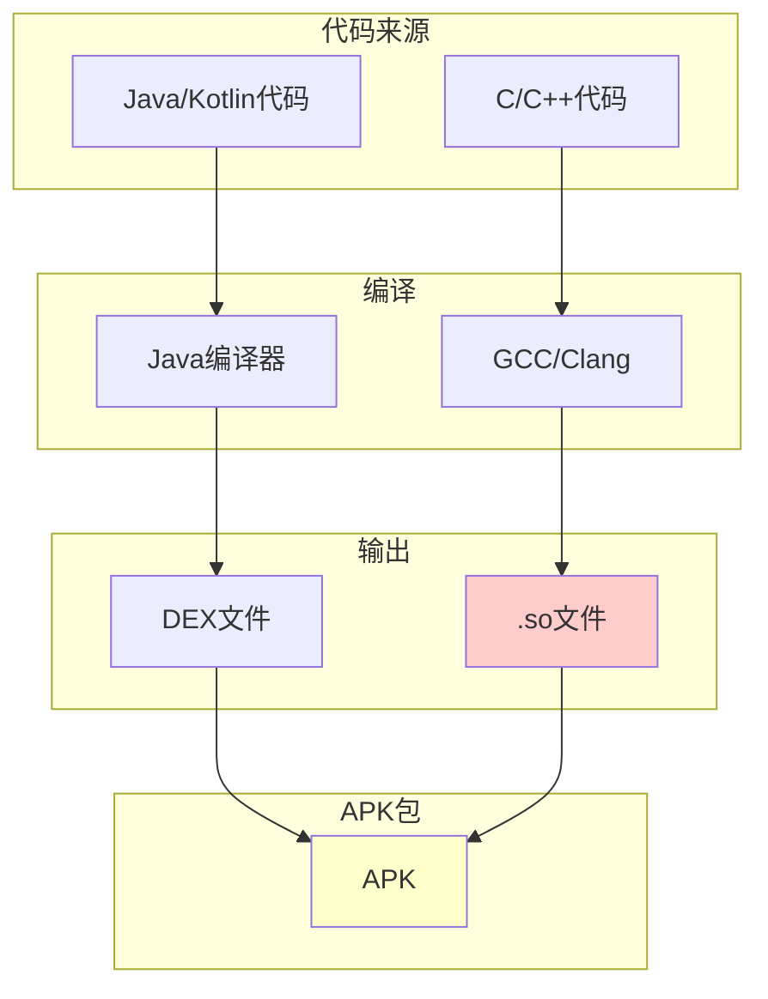
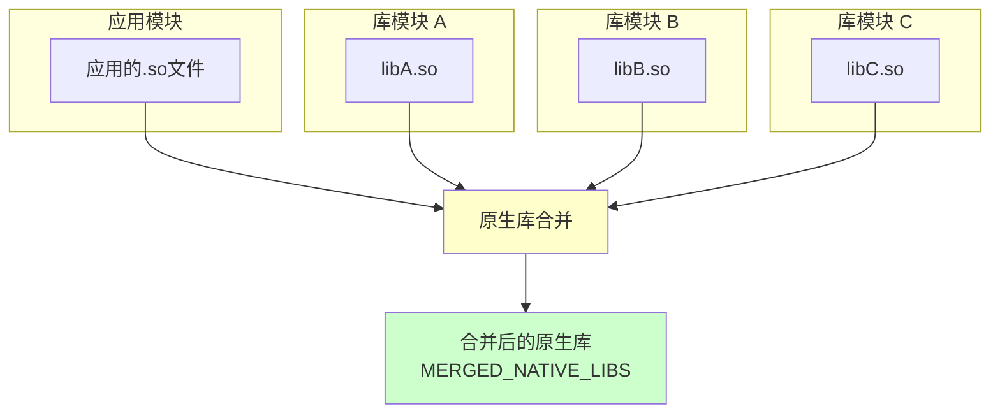
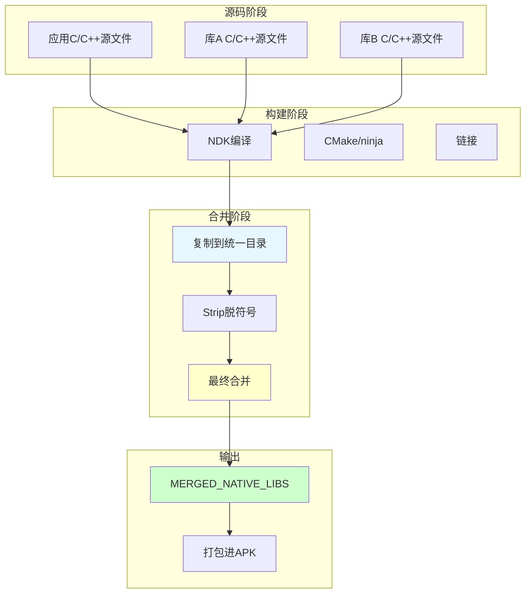
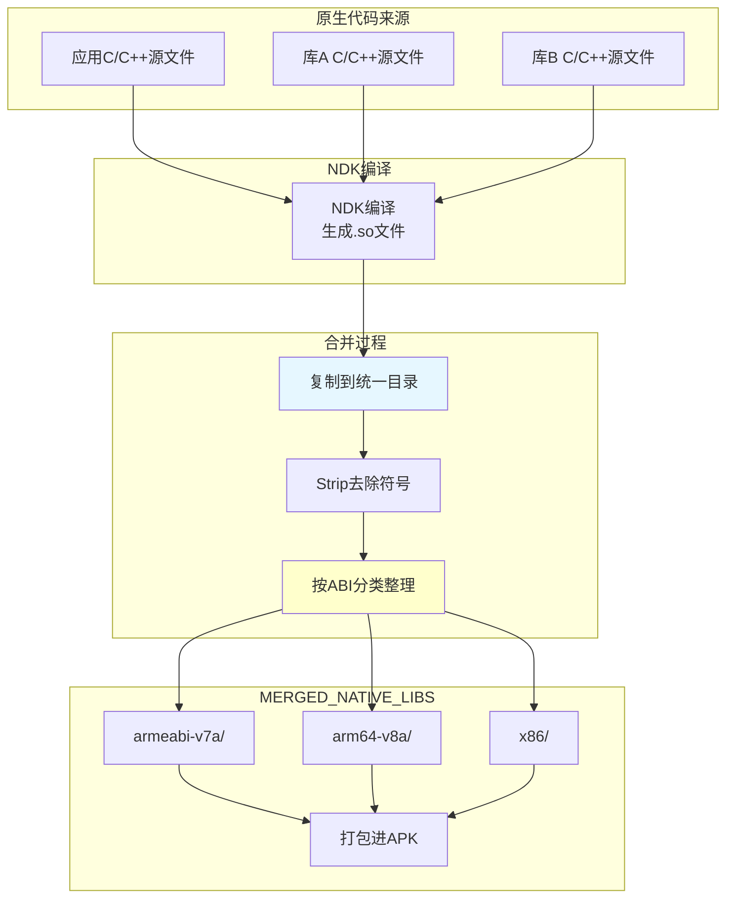

# 21.1.42 SingleArtifact.MERGED_NATIVE_LIBS——_native_li_bs的融合魔法

晚霞已经完全消退，天空变成了深蓝色，几颗星星开始一颗一颗地亮起来，像是谁在黑色的天鹅绒上撒了一把碎钻石。蟋蟀的叫声此起彼伏，偶尔有夜风吹过，带着草木的清香。

洛芙躺在草地上，双手枕在头后，盯着天上的星星。刚才黛琳讲的Manifest合并还历历在目，她忍不住好奇地问："黛琳，那库里的其他东西呢？比如那些很厉害的本领——叫什么来的……"

"你是说原生代码？"希尔抢着说，"就是.so文件！"

"对对对！"洛芙坐起来，"那些库也要合并吗？"

黛琳笑着点点头："没错，今天我们要讲的就是SingleArtifact.MERGED_NATIVE_LIBS——合并后的原生库工件！"

---

## 神秘来客：什么是原生库

黛琳找了一块平整的石头坐下今晚的露营教学。

"在说MERGED_NATIVE_LIBS之前，"黛琳说，"我们先来想想一个问题——什么是原生库？"

洛芙想了想："是不是就是那些C/C++写的代码？就像游戏里用到的那些？"

"对！"黛琳说，"原生库就是用C或C++等语言编写的、编译成机器码的库文件。在Android上，它们以.so为后缀——意思是Shared Object，共享对象。"

她在地上画了一幅示意图：



"图1对应代码片段A（行15-30）。"黛琳说，"Java/Kotlin代码会编译成DEX文件，而C/C++代码会编译成.so文件。它们最终都会被放进APK里。"

伊莎好奇地问："为什么要用原生库？"

"好问题！"希尔说，"原生库主要有几个用途——性能敏感的代码（比如图像处理、视频编解码、游戏引擎）、调用系统底层API、还有复用现有的C/C++库。"

---

## 为什么要合并原生库

黛琳的表情变得认真起来："现在我们来说说——为什么要合并原生库？"

"是不是……因为一个应用会依赖很多库？"洛芙猜测。

"对！"黛琳说，"当你项目里依赖了多个库——比如你用了Google Play Services、用了一些视频编解码库、可能还用了某个加密库——每个库可能都带有自己的.so文件。"

她画了第二幅图来解释：



"图2对应代码片段B（行30-45）。"黛琳说，"每个库都有自己的原生代码，构建系统会把它们全部复制到一个统一的目录下，这就是MERGED_NATIVE_LIBS。"

"那合并的时候会做些什么？"洛芙问。

"主要就是复制和整理，"黛琳说，"把各个库的.so文件按规则放到一起，处理一些重复和冲突。"

---

## SingleArtifact.MERGED_NATIVE_LIBS：合并后的原生库工件

希尔打开笔记本，开始讲解SingleArtifact.MERGED_NATIVE_LIBS的具体定义。

"在Android Gradle API中，"希尔说，"SingleArtifact.MERGED_NATIVE_LIBS表示构建过程中生成的、合并后的原生库目录或文件。"

```kotlin
// 代码片段C：SingleArtifact.MERGED_NATIVE_LIBS的定义和使用

/**
 * SingleArtifact.MERGED_NATIVE_LIBS - 合并后的原生库 工件类型
 * 
 * 这是一个目录类型的工件，包含了所有原生库的合并结果
 * 通常位于：app/build/intermediates/cmake/debug/obj/ 或 ndkBuild/debug/obj/
 */

import com.android.build.api.artifact.SingleArtifact

/**
 * 获取MERGED_NATIVE_LIBS工件
 */
androidComponents.onVariants(selector().all()) { variant ->
    val mergedNativeLibs: Provider<Directory> = 
        variant.artifacts.get(SingleArtifact.MERGED_NATIVE_LIBS)
    
    println("合并后的原生库目录: ${mergedNativeLibs.get().asFile.absolutePath}")
    
    // 列出所有.so文件
    mergedNativeLibs.get().asFile.listFiles()?.forEach { file ->
        println("  - ${file.name} (${file.length()} bytes)")
    }
}

/**
 * MERGED_NATIVE_LIBS vs 源码原生文件：
 * 
 * 源码中的原生代码（app/src/main/cpp/）：
 *   - 开发者编写的C/C++源文件
 *   - 位于源码目录
 * 
 * MERGED_NATIVE_LIBS：
 *   - 编译后的.so文件
 *   - 包含了所有依赖库的原生库
 *   - 是最终打包进APK的版本
 */

println("MERGED_NATIVE_LIBS是构建过程的中间产物")
```

"这个MERGED_NATIVE_LIBS在哪里能找到？"洛芙问。

"通常在build目录下的obj或lib文件夹里，"希尔说，"但更好的方式是通过Artifacts API来获取，这样更可靠。"

---

## 原生库合并过程详解：从源码到最终库

黛琳在地上画了一幅更详细的合并流程图。

"我们来看看原生库合并的具体过程。"黛琳说。



"图3对应代码片段D（行55-70）。"黛琳说，"原生库的合并发生在构建的后期——在代码编译完成后。主要步骤是：NDK把C/C++源文件编译成目标文件（.o），然后链接成.so文件，最后复制到统一的目录。"

"那合并的时候具体做了什么？"洛芙问。

"主要是复制和清理工作，"黛琳说，"比如去掉调试符号（strip）、按ABI分类存放、处理重复的库……"

---

## 实际用例：MERGED_NATIVE_LIBS的用途

希尔讲解了一个很重要的实际问题："MERGED_NATIVE_LIBS可以用来做什么？"

"最常见的用途是检查和分析。"希尔说，"你可以看看应用到底打包了哪些原生库。"

```kotlin
// 代码片段E：读取和分析MERGED_NATIVE_LIBS

/**
 * 场景：分析应用的所有原生库
 */

import org.apache.tools.ant.taskdefs.condition.Os

androidComponents.onVariants(selector().all()) { variant ->
    val mergedNativeLibs: Provider<Directory> = 
        variant.artifacts.get(SingleArtifact.MERGED_NATIVE_LIBS)
    
    // 列出所有.so文件
    val soFiles = mergedNativeLibs.get().asFile.walkTopDown()
        .filter { it.extension == "so" }
        .toList()
    
    println("=== 原生库分析 ===")
    println("总数量: ${soFiles.size}")
    
    // 按ABI分类
    val byAbi = soFiles.groupBy { file ->
        // 根据路径判断ABI，如 arm64-v8a, armeabi-v7a, x86, x86_64
        file.parentFile?.name ?: "unknown"
    }
    
    byAbi.forEach { (abi, files) ->
        println("\nABI: $abi")
        files.forEach { file ->
            println("  - ${file.name} (${file.length() / 1024} KB)")
        }
    }
}

/**
 * 典型的分析场景：
 * 
 * 1. APK分析工具：检查应用包含哪些.so文件
 * 2. 体积优化：找出重复或不必要的库
 * 3. ABI兼容性：检查是否支持目标架构
 * 4. 安全审计：检查是否有未知或可疑的库
 */

// 完整分析任务示例
tasks.register<AnalyzeNativeLibsTask>("analyzeNativeLibs") {
    dependsOn("compileDebugNdk")  // 确保NDK编译完成
    
    doLast {
        val nativeLibsDir = androidExtension.artifacts
            .get(SingleArtifact.MERGED_NATIVE_LIBS)
            .get().asFile
        
        println("=".repeat(40))
        println("原生库分析报告")
        println("=".repeat(40))
        
        // 统计每个ABI的库数量和大小
        nativeLibsDir.listFiles()?.forEach { abiDir ->
            if (abiDir.isDirectory) {
                val soFiles = abiDir.listFiles()?.filter { it.extension == "so" } ?: emptyList()
                val totalSize = soFiles.sumOf { it.length() }
                
                println("\n${abiDir.name}:")
                println("  库数量: ${soFiles.size}")
                println("  总大小: ${totalSize / 1024 / 1024} MB")
            }
        }
        
        println("=".repeat(40))
    }
}

println("MERGED_NATIVE_LIBS常用于静态分析和体积优化")
```

"听起来好专业！"洛芙说，"那普通人需要关心这个吗？"

"如果是应用开发者，可能不太会直接用到，"黛琳说，"但如果是做性能优化、或者打包多ABI的应用，就会用到这个。"

---

## ABI：不同的手机架构

伊莎好奇地问："黛琳，你刚才说的ABI是什么？"

"好问题！"黛琳说，"ABI是Application Binary Interface的缩写——应用二进制接口。不同的手机CPU使用不同的指令集，就需要不同的.so文件。"

```kotlin
// 代码片段F：常见的ABI类型

/**
 * Android支持的ABI类型：
 * 
 * 1. armeabi-v7a - 32位ARM，主流旧手机
 * 2. arm64-v8a - 64位ARM，主流新手机
 * 3. x86 - 32位x86，主要用于模拟器
 * 4. x86_64 - 64位x86，主要用于模拟器
 * 5. mips/mips64 - 较少使用
 */

/**
 * ABI过滤示例
 */

// build.gradle
android {
    defaultConfig {
        ndk {
            // 只打包arm64-v8a，减小APK体积
            abiFilters += "arm64-v8a"
        }
    }
}

/**
 * 常见问题：
 * 
 * 1. 只打包一个ABI能提升性能吗？
 *    - 不能，但能减小APK体积
 *    - 用户手机如果不是对应ABI会崩溃
 * 
 * 2. 应该打包哪些ABI？
 *    - 建议：arm64-v8a + armeabi-v7a（兼容性最好）
 *    - 如果不关心旧设备：只 arm64-v8a
 *    - 如果需要模拟器测试：加上 x86/x86_64
 */

/**
 * 查看MERGED_NATIVE_LIBS中的ABI目录
 */

androidComponents.onVariants(selector().all()) { variant ->
    val nativeLibs = variant.artifacts.get(SingleArtifact.MERGED_NATIVE_LIBS)
    
    nativeLibs.get().asFile.listFiles()?.forEach { abiDir ->
        println("ABI目录: ${abiDir.name}")
        abiDir.listFiles()?.filter { it.extension == "so" }?.forEach { so ->
            println("  - ${so.name}")
        }
    }
}

println("ABI决定了.so文件能在哪些手机上运行")
```

"原来手机和手机还不一样！"洛芙说。

"对，"黛琳说，"这就像不同型号的玩具需要不同的电池一样。"

---

## 合并冲突：原生库的"世界大战"

黛琳的表情变得认真起来："原生库合并也有可能遇到问题。"

"会出什么问题？"洛芙问。

"主要有几种情况，"黛琳说，"比如重复的库、冲突的版本、不兼容的ABI……"

```kotlin
// 代码片段G：常见的原生库合并问题

/**
 * 问题1：重复的.so文件
 */

// 场景：两个库都包含了libjpeg.so
// app依赖的库A有libjpeg.so
// app依赖的库B也有libjpeg.so

// 合并时会怎样？
// - 通常会保留一个（根据依赖顺序）
// - 可能会导致运行时找不到符号

/**
 * 解决：排除重复的依赖
 */

// build.gradle
configurations.all {
    exclude group: "org.apache.commons", module: "commons-native"
}

/**
 * 问题2：不同版本的同一个库
 */

// 场景：库A依赖libpng 1.6
//       库B依赖libpng 1.5

// 合并时会怎样？
// - Gradle会尝试自动解决
// - 可能使用高版本，或报错

/**
 * 解决：统一版本或排除
 */

// build.gradle
dependencies {
    implementation("libpng:1.6.37") {
        // 强制使用这个版本
    }
}

/**
 * 问题3：ABI冲突
 */

// 场景：库A只支持armeabi-v7a
//       库B只支持arm64-v8a

// 用户手机是arm64-v8a
// 运行时会怎样？
// - 库A的.so不会被打包进去
// - 如果代码调用了库A的函数，会崩溃

/**
 * 解决：确保所有库都支持目标ABI
 */

// build.gradle
android {
    defaultConfig {
        ndk {
            // 选择所有库都支持的ABI
            abiFilters += listOf("armeabi-v7a", "arm64-v8a")
        }
    }
}

println("合并问题需要根据具体情况分析和解决")
```

"原来这么复杂！"洛芙说。

"所以理解合并机制很重要，"黛琳说，"才能在遇到问题时快速定位。"

---

## 获取MERGED_NATIVE_LIBS的正确方式

希尔敲起了代码，讲解如何正确获取MERGED_NATIVE_LIBS工件。

"在Gradle任务中获取MERGED_NATIVE_LIBS是有讲究的。"希尔说，"你不能在任何时候都获取它。"

```kotlin
// 代码片段H：MERGED_NATIVE_LIBS的获取时机

/**
 * 原生库编译发生在构建的后期
 * 任务依赖链：
 * 
 * compileDebugNdk → MERGED_NATIVE_LIBS
 */

// ❌ 错误：在compileDebugNdk之前就请求MERGED_NATIVE_LIBS
tasks.register<MyTask>("earlyTask") {
    // 这时候原生库还没编译完成，会获取失败
    val libs = androidExtension.artifacts.get(SingleArtifact.MERGED_NATIVE_LIBS)
}

// ✅ 正确：确保在compileDebugNdk任务之后
tasks.register<AnalyzeNativeLibsTask>("analyzeNativeLibs") {
    // 依赖于NDK编译任务
    dependsOn("compileDebugNdk")
    
    val nativeLibs = androidExtension.artifacts.get(SingleArtifact.MERGED_NATIVE_LIBS)
    
    doLast {
        println("原生库目录: ${nativeLibs.get().asFile.absolutePath}")
        nativeLibs.get().asFile.listFiles()?.forEach { dir ->
            println("  ABI: ${dir.name}")
            dir.listFiles()?.filter { it.extension == "so" }?.forEach { so ->
                println("    - ${so.name}")
            }
        }
    }
}

// 推荐：使用onVariants回调（在配置阶段）
androidComponents.onVariants(selector().all()) { variant ->
    // 这里可以安全地获取MERGED_NATIVE_LIBS
    // 因为回调会在工件可用时被调用
    val nativeLibs: Provider<Directory> = 
        variant.artifacts.get(SingleArtifact.MERGED_NATIVE_LIBS)
    
    println("Variant: ${variant.name}")
    println("Native Libs: ${nativeLibs.get().asFile}")
    
    // 注册一个任务来处理原生库
    tasks.register("${variant.name}StripNativeLibs", StripNativeLibsTask::class) {
        nativeLibsDir.set(nativeLibs.map { it.asFile })
    }
}

abstract class StripNativeLibsTask : DefaultTask() {
    @InputFiles
    abstract val nativeLibsDir: DirectoryProperty
    
    @TaskAction
    fun strip() {
        nativeLibsDir.get().asFile.walkTopDown()
            .filter { it.extension == "so" }
            .forEach { soFile ->
                println("处理: ${soFile.name}")
                // 实际的strip操作
            }
    }
}

println("MERGED_NATIVE_LIBS必须在NDK编译任务完成后才能获取")
```

"原来时机这么重要！"洛芙说。

"构建任务都有依赖关系，"黛琳说，"了解这些依赖关系才能正确获取工件。"

---

## 实际场景：构建一个原生库分析工具

黛琳讲起了实际的工作场景："我们来做一个小工具，统计MERGED_NATIVE_LIBS中的库信息。"

```kotlin
// 代码片段I：完整的原生库分析示例

/**
 * 场景：创建一个Gradle任务，分析应用的原生库
 */

tasks.register<AnalyzeNativeLibsTask>("analyzeNativeLibs") {
    group = "analysis"
    description = "分析合并后的原生库"

    // 确保依赖正确的任务
    dependsOn("compileDebugNdk")

    doLast {
        // 获取MERGED_NATIVE_LIBS
        val nativeLibsProvider = androidExtension.artifacts.get(SingleArtifact.MERGED_NATIVE_LIBS)
        val nativeLibsDir = nativeLibsProvider.get().asFile

        println("=".repeat(40))
        println("原生库分析报告")
        println("=".repeat(40))
        println("目录: ${nativeLibsDir.absolutePath}")
        println()

        // 按ABI统计
        val abiStats = mutableMapOf<String, MutableList<File>>()
        
        nativeLibsDir.listFiles()?.forEach { abiDir ->
            if (abiDir.isDirectory) {
                val soFiles = abiDir.listFiles()?.filter { it.extension == "so" } ?: emptyList()
                abiStats[abiDir.name] = soFiles.toMutableList()
            }
        }

        var totalSize = 0L
        var totalCount = 0
        
        abiStats.forEach { (abi, files) ->
            val abiSize = files.sumOf { it.length() }
            totalSize += abiSize
            totalCount += files.size
            
            println("ABI: $abi")
            println("  库数量: ${files.size}")
            println("  总大小: ${abiSize / 1024 / 1024} MB")
            
            files.forEach { file ->
                println("    - ${file.name} (${file.length() / 1024} KB)")
            }
            println()
        }

        println("总计:")
        println("  ABI数量: ${abiStats.size}")
        println("  库总数: $totalCount")
        println("  总大小: ${totalSize / 1024 / 1024} MB")
        
        println("=".repeat(40))
        
        // APK体积估算（假设每个ABI都要打包）
        val estimatedSize = totalSize
        println("预估APK增加体积: ${estimatedSize / 1024 / 1024} MB")
    }
}

// 简化版：直接在回调中处理
androidComponents.onVariants(selector().all()) { variant ->
    val nativeLibs = variant.artifacts.get(SingleArtifact.MERGED_NATIVE_LIBS)
    
    // 注册一个任务来处理原生库
    tasks.register("${variant.name}PrintNativeLibs", PrintNativeLibsTask::class) {
        nativeLibsDir.set(nativeLibs.map { it.asFile })
    }
}

abstract class PrintNativeLibsTask : DefaultTask() {
    @InputFiles
    abstract val nativeLibsDir: DirectoryProperty
    
    @TaskAction
    fun print() {
        nativeLibsDir.get().asFile.listFiles()?.forEach { abiDir ->
            println("ABI: ${abiDir.name}")
            abiDir.listFiles()?.filter { it.extension == "so" }?.forEach { so ->
                println("  - ${so.name} (${so.length() / 1024} KB)")
            }
        }
    }
}

println("原生库分析工具对于优化APK体积很有帮助")
```

"这个工具看起来好有用！"洛芙说，"可以看看应用到底包含哪些原生库。"

"很多APK分析工具就是这样做的，"黛琳说，"比如检查应用是否包含了不必要的库。"

---

## 反模式：原生库合并的常见误区

黛琳总结了几个常见的误区：

### 误区一：以为所有.so都会被打包

"很多人以为只要加了NDK依赖，所有.so都会进APK，"黛琳说，"其实不一定。"

```kotlin
// ❌ 误区1：不了解ABI过滤
// build.gradle没有设置abiFilters
// 导致打包了所有ABI，或者只打包了某些ABI

// ✅ 正确做法：
// 根据目标用户群体设置合适的ABI
// 如果不关心旧设备：只 arm64-v8a
// 如果需要兼容性：armeabi-v7a + arm64-v8a
```

### 误区二：忽略重复的库

"有些开发者不知道项目里有重复的原生库，"黛琳说，"导致APK体积增大。"

```kotlin
// ❌ 误区2：忽略重复的.so
// 两个库都带libjpeg.so
// 没做排除，结果打包了两次

// ✅ 正确做法：
// 定期运行分析任务
// 使用exclude或force来统一版本
```

### 误区三：不处理ABI兼容性问题

"有些库只支持特定的ABI，"黛琳说，"不处理好会导致崩溃。"

```kotlin
// ❌ 误区3：不检查库是否支持目标ABI
// 用户手机是arm64-v8a
// 但某个库只有armeabi-v7a版本
// 运行时会崩溃

// ✅ 正确做法：
// 检查依赖的所有库是否支持目标ABI
// 或者增加更多ABI支持
```

### 误区四：在错误时机处理原生库

"有人想在NDK编译前就处理.so文件，"黛琳说，"这是不行的。"

```kotlin
// ❌ 误区4：在compileDebugNdk之前处理
// tasks.register<MyTask>("task") {
//     // 原生库还不存在，处理失败
// }

// ✅ 正确做法：
// 依赖于compileDebugNdk任务
// 或者在onVariants回调中处理
```

---

## 原生库的Strip和优化

希尔补充了一个重要的知识点："原生库可以做一些优化。"

"比如Strip，就是去掉调试符号，"希尔说，"可以显著减小文件大小。"

```kotlin
// 代码片段J：原生库的优化

/**
 * Strip：去掉调试符号
 * 
 * .so文件包含：
 * - 机器码（必需）
 * - 调试符号（可选，用于调试）
 * - 符号表（可选，用于崩溃分析）
 * 
 * Strip可以移除调试符号和部分符号
 * 通常可以减小20-50%的体积
 */

/**
 * Release版本自动Strip
 */

// build.gradle
android {
    buildTypes {
        release {
            // NDK的Release构建会自动Strip
            ndk {
                abiFilters += listOf("armeabi-v7a", "arm64-v8a")
            }
        }
    }
}

/**
 * 手动Strip
 */

tasks.register<StripNativeLibsTask>("stripNativeLibs") {
    dependsOn("compileDebugNdk")
    
    doLast {
        val nativeLibs = androidExtension.artifacts.get(SingleArtifact.MERGED_NATIVE_LIBS)
        
        nativeLibs.get().asFile.walkTopDown()
            .filter { it.extension == "so" }
            .forEach { soFile ->
                // 使用ndk-build的arm-linux-androideabi-strip
                // 或llvm-strip
                exec {
                    workingDir = soFile.parentFile
                    commandLine("arm-linux-androideabi-strip", soFile.name)
                }
                
                println("Stripped: ${soFile.name}")
            }
    }
}

/**
 * 其他优化：
 * 
 * 1. 压缩：使用LZ4或zstd压缩.so（需要运行时解压）
 * 2. 合并：把多个.so合并成一个（需要修改加载逻辑）
 * 3. 移除：删除不需要的.so
 */

println("原生库优化可以显著减小APK体积")
```

"原来还有这么多门道！"洛芙说。

"原生库的优化是APK体积优化的重要部分，"黛琳说，"特别是对大型应用来说。"

---

## 章节收尾：原生库的融合艺术

星星越来越多，像是有人在黑色的画布上用金粉一笔一笔地点缀。远处的山轮廓已经完全模糊，只剩下黑黢黢的一片。偶尔有萤火虫在草丛中闪烁，像是在回应天上的星星。

洛芙躺在草地上，双手枕在头后，盯着天上的星星。

"黛琳，"洛芙轻声说，"我觉得原生库合并好像……一个博物馆。"

"博物馆？"其他三人看向她。

"对，"洛芙继续说，"每个库都像是一个展品——来自不同的地方、不同的设计师、不同的年代。MERGED_NATIVE_LIBS就像是把它们都摆在一起，按类别整理好，让用户能够参观。"

伊莎笑了："洛芙的比喻很贴切！原生库合并确实像一个'策展人'，把不同的.so文件整合成一个和谐的展览。"

希尔收拾着笔记本："今天我们学到了SingleArtifact.MERGED_NATIVE_LIBS——合并后的原生库工件。它是构建过程中生成的、包含了所有模块原生代码的最终结果。"

"最大的收获是理解了原生库合并的规则和ABI的概念，"黛琳补充说，"以及如何通过ABI过滤来控制打包哪些架构的库。"

洛芙坐起来："那明天我们要讲什么？"

"明天啊，"黛琳想了想，"我们继续讲SingleArtifact家族的其他成员吧——比如VERSION_CONTROL_INFO_FILE、APK_FROM_MANIFEST之类的。"

"太好了！"洛芙跳起来，"感觉越来越深入了！"

四个女孩收拾好东西，准备回帐篷休息。星星越来越多，就像每个库里形形色色的原生代码，都在MERGED_NATIVE_LIBS这个"大展厅"里被融合成了一个完整的应用。

---

> 技术总结

---

## SingleArtifact.MERGED_NATIVE_LIBS——核心机制定义

**SingleArtifact.MERGED_NATIVE_LIBS** 是Android Gradle API中表示合并后的原生库（.so文件）的工件类型。当应用模块依赖多个带有原生代码的库模块时，每个库都有自己的.so文件，构建系统在编译后会将这些原生库文件复制到一个统一的目录下，形成MERGED_NATIVE_LIBS。这个目录包含了所有ABI（ armeabi-v7a、arm64-v8a、x86、x86_64等）的原生库，是最终打包进APK的版本。MERGED_NATIVE_LIBS工件在compileDebugNdk或compileReleaseNdk任务完成后生成，可用于静态分析、体积优化、ABI兼容性检查等场景。

---

#### 结构图



---

#### 反模式与陷阱

**1. 不了解ABI过滤机制**
- 问题：打包了不需要的ABI或缺少必要的ABI
- 解决：根据目标用户群体设置合适的abiFilters

**2. 忽略重复的原生库**
- 问题：多个库包含相同的.so，导致APK体积增大
- 解决：使用exclude或force来统一版本

**3. 不检查ABI兼容性**
- 问题：库只支持特定ABI，导致运行时崩溃
- 解决：检查所有依赖的库是否支持目标ABI

**4. 在错误时机处理原生库**
- 问题：在NDK编译前就请求MERGED_NATIVE_LIBS
- 解决：使用dependsOn确保正确的任务依赖

**5. 忽略Strip优化**
- 问题：Release版本没有自动Strip，APK体积过大
- 解决：确保Release构建使用NDK的优化模式

---

#### 设计哲学

**性能与兼容性的平衡**：原生库合并机制体现了Android构建系统的核心理念——既保持模块的独立性，又实现整体的统一性。这种设计允许库开发者独立提供原生代码，而应用开发者可以选择性地打包。这种设计体现了以下工程实践：

1. **ABI分离**：不同架构使用不同的.so文件，按目录分类存放
2. **按需打包**：通过abiFilters控制打包哪些ABI，平衡兼容性和体积
3. **自动化合并**：构建系统自动处理，开发者无需手动复制
4. **可优化性**：支持Strip等优化手段，减小APK体积
5. **可追溯性**：MERGED_NATIVE_LIBS可追溯，便于分析问题

---

#### 🏕️ 动手练习

**目标**：掌握原生库合并的原理和MERGED_NATIVE_LIBS的使用

**项目概览**：创建一个包含原生代码的多模块项目，观察原生库合并过程和结果

---

**Task 1：创建包含原生代码的项目**

**目标**：创建一个应用模块和一个带原生代码的库模块，观察原生库合并

**步骤**：
1. 创建一个Android应用模块
2. 创建一个Android库模块，添加C/C++代码
3. 在应用模块中依赖库模块
4. 构建项目并观察

**验收标准**：
- [ ] 应用模块依赖库模块成功
- [ ] NDK编译成功
- [ ] 在build目录找到MERGED_NATIVE_LIBS

**提示代码**：
```kotlin
// settings.gradle.kts
include(":app")
include(":mylibrary")

// app/build.gradle.kts
android {
    externalNativeBuild {
        cmake {
            path = file("src/main/cpp/CMakeLists.txt")
        }
    }
}

// mylibrary/src/main/cpp/native-lib.cpp
extern "C" JNIEXPORT jstring JNICALL
Java_com_example_mylibrary_MyLibrary_stringFromJNI(JNIEnv* env, jclass) {
    return env->NewStringUTF("Hello from C++");
}
```

---

**Task 2：观察原生库合并结果**

**目标**：使用工具查看合并后的原生库内容

**步骤**：
1. 构建debug版本
2. 找到MERGED_NATIVE_LIBS目录
3. 查看各ABI目录下的.so文件
4. 记录库名称和大小

**验收标准**：
- [ ] 找到MERGED_NATIVE_LIBS目录
- [ ] 识别出多个ABI目录
- [ ] 列出各ABI下的.so文件

**提示代码**：
```bash
# 找到MERGED_NATIVE_LIBS路径
find app/build -type d -name "obj" | grep merged

# 列出所有.so文件
find app/build -name "*.so" -type f

# 查看目录结构
ls -la app/build/intermediates/cmake/debug/obj/
```

---

**Task 3：配置ABI过滤**

**目标**：通过配置只打包特定的ABI

**步骤**：
1. 在build.gradle中配置abiFilters
2. 分别尝试不同的ABI组合
3. 构建并观察结果

**验收标准**：
- [ ] 配置abiFilters成功
- [ ] 构建成功
- [ ] 验证只包含指定的ABI

**提示代码**：
```kotlin
// build.gradle.kts
android {
    defaultConfig {
        ndk {
            // 只打包64位ARM
            abiFilters += listOf("arm64-v8a")
            
            // 或者打包两种
            abiFilters += listOf("armeabi-v7a", "arm64-v8a")
        }
    }
}
```

---

**Task 4：处理原生库合并冲突**

**目标**：模拟并解决原生库合并问题

**步骤**：
1. 引入两个包含相同.so的库
2. 构建并观察结果
3. 使用exclude或force解决
4. 重新构建验证

**验收标准**：
- [ ] 观察到重复的.so文件
- [ ] 使用配置解决重复问题
- [ ] 构建成功

**提示代码**：
```kotlin
// build.gradle.kts
configurations.all {
    // 排除重复的库
    exclude(group = "com.example", module = "duplicate-lib")
    
    // 或者强制使用特定版本
    resolutionStrategy {
        force("com.example:lib:1.0.0")
    }
}
```

---

**Task 5：创建原生库分析任务**

**目标**：编写Gradle任务分析MERGED_NATIVE_LIBS

**步骤**：
1. 在build.gradle中创建自定义任务
2. 获取SingleArtifact.MERGED_NATIVE_LIBS
3. 统计各ABI的库数量和大小
4. 输出分析报告

**验收标准**：
- [ ] 自定义任务成功执行
- [ ] 正确获取MERGED_NATIVE_LIBS
- [ ] 输出ABI统计信息

**提示代码**：
```kotlin
tasks.register<AnalyzeNativeLibsTask>("analyzeNativeLibs") {
    dependsOn("compileDebugNdk")
    
    doLast {
        val nativeLibs = androidExtension.artifacts.get(SingleArtifact.MERGED_NATIVE_LIBS)
        val dir = nativeLibs.get().asFile
        
        dir.listFiles()?.forEach { abiDir ->
            if (abiDir.isDirectory) {
                val files = abiDir.listFiles()?.filter { it.extension == "so" } ?: emptyList()
                println("${abiDir.name}: ${files.size} 个库, ${files.sumOf { it.length() }} bytes")
            }
        }
    }
}
```

---

#### 面试热身

**Q1：请解释Android原生库（.so文件）的合并过程？**

参考要点：多个模块的C/C++源文件通过NDK编译成.so文件，然后按ABI分类复制到统一目录，形成MERGED_NATIVE_LIBS，最终打包进APK。

**Q2：SingleArtifact.MERGED_NATIVE_LIBS是什么？**

参考要点：表示构建过程中生成的合并后的原生库目录，包含了所有ABI的.so文件。

**Q3：ABI是什么？有哪些常见的ABI类型？**

参考要点：ABI是应用二进制接口，决定.so文件能在哪些CPU架构上运行。常见的有armeabi-v7a（32位ARM）、arm64-v8a（64位ARM）、x86、x86_64等。

**Q4：MERGED_NATIVE_LIBS在构建流程中的位置？**

参考要点：在compileDebugNdk或compileReleaseNdk任务完成后生成，在APK打包之前。

**Q5：如何优化原生库的APK体积？**

参考要点：配置abiFilters只打包必要的ABI、使用Strip去除调试符号、排除重复的库、统一库版本等。

---

#### 参考实现要点

1. **理解ABI概念**：不同手机使用不同的CPU架构，需要不同的.so文件

2. **合理配置ABI过滤**：根据目标用户群体选择合适的ABI，平衡兼容性和体积

3. **关注重复库问题**：定期运行分析任务，检查是否有重复的.so文件

4. **注意任务依赖**：MERGED_NATIVE_LIBS必须在NDK编译完成后才能获取

5. **利用分析工具**：MERGED_NATIVE_LIBS适合做静态分析、ABI兼容性检查、体积优化

---

> 学习建议

理解原生库合并机制对于处理包含NDK代码的项目和优化APK体积非常重要。通过本章节的学习，应该理解MERGED_NATIVE_LIBS的概念、原生库合并的规则和ABI的概念，以及如何处理合并问题。动手练习中的多模块项目创建和原生库分析是实践这些概念的好方法。

---

# 洛芙的小小日记本

今天好累但是好开心！黛琳讲的原生库合并好有意思——原来那些.so文件也要像Manifest一样被整理到一起。ABI就像是不同的"语言"，不同手机说不同的话，只能听懂对应语言的.so文件。伊莎说我的"博物馆"比喻很贴切好开心呀！明天还要继续学其他SingleArtifact类型，感觉Android构建好复杂但是好有趣！

---

# 今日关键词

**SingleArtifact.MERGED_NATIVE_LIBS** - 表示合并后的原生库（.so文件）的工件类型，是构建过程中所有原生库合并的最终结果

**原生库（.so文件）** - 用C/C++等语言编写的、编译成机器码的库文件，Shared Object

**ABI（应用二进制接口）** - 决定.so文件能在哪些CPU架构上运行，如armeabi-v7a、arm64-v8a、x86等

**NDK（Native Development Kit）** - Android官方工具集，用于编译C/C++代码为.so文件

**CMake** - NDK使用的构建系统，用于编译原生代码

**Strip** - 去除.so文件中的调试符号，减小文件体积的过程

**ABI过滤（abiFilters）** - Gradle配置，控制只打包哪些ABI的.so文件

**mergeDebugManifest** - Gradle任务，负责合并debug变体的Manifest（与本章无关但易混淆）