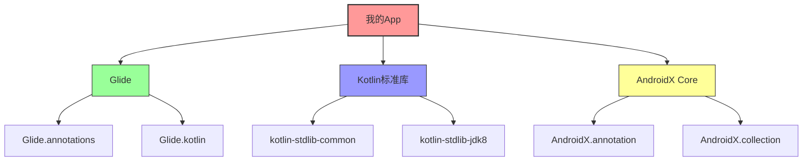
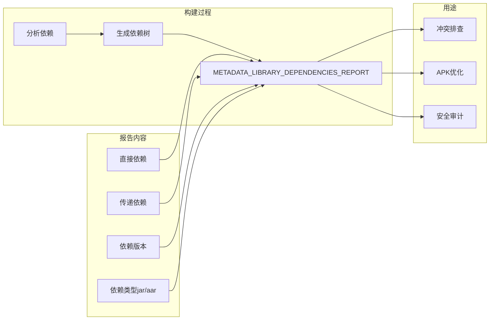

# 21.1.43 SingleArtifact.METADATA_LIBRARY_DEPENDENCIES_REPORT——依赖的星空图谱

星星已经铺满了整个天空，像银色的沙砾洒在深蓝色的天鹅绒上。偶尔有流星划过，引来伊莎的一阵低呼。夜晚的露营地比白天更加安静，只有蟋蟀的鸣叫声此起彼伏，还有远处偶尔传来的猫头鹰的叫声。

洛芙裹紧了自己的外套，虽然是夏天，但夜里的山间还是有些凉意。她的目光从星空收回，看向黛琳刚才在白板上画的一幅图。

"所以你的意思是，"洛芙总结着刚才学到的内容，"我们 app 里用到的那些 .so 文件，最后都会合并成一个大文件？"

"对，"黛琳点点头，"MERGED_NATIVE_LIBS 就是合并后的结果。就像把所有小石头堆成一座小山。"

"那我知道啦！"希尔突然兴奋起来，"下一个是不是要讲依赖报告？就是我们 app 用了哪些库的那个清单？"

黛琳笑了："没错！今天我们要讲的就是 SingleArtifact.METADATA_LIBRARY_DEPENDENCIES_REPORT——库依赖元数据报告！"

---

## 露营清单：什么是依赖报告

黛琳把白板翻到新的一页，开始画新的图示。

"你们有没有遇到过这种情况？"黛琳问道，"开发一个 app，中途加了这个库、那个库，到后来自己都搞不清楚到底用了哪些依赖了？"

洛芙举手："我有！我之前做一个项目，光是引入图片加载库就试了三个——Glide、Fresco、Coil，最后用了 Coil，但另外两个的依赖好像还留在 gradle 里没删干净。"

"这就是依赖报告存在的意义。"黛琳说，"METADATA_LIBRARY_DEPENDENCIES_REPORT 就是 Android 构建系统生成的、记录所有库依赖关系的报告。它就像你的露营清单——上面写着帐篷、睡袋、炊具、防蚊液……每一样都写得清清楚楚。"

"那这个报告长什么样啊？"洛芙好奇地问。

黛琳打开笔记本电脑，连接上投影仪。不一会儿，白板上出现了一个 JSON 文件的内容。

"看，这就是依赖报告的样子——"

```json
{
  "configuration": "releaseRuntimeClasspath",
  "variant": "release",
  "artifacts": [
    {
      "file": "com.github.bumptech.glide-glide-4.15.1.jar",
      "type": "jar",
      "module": "com.github.bumptech.glide:glide:4.15.1"
    },
    {
      "file": "org.jetbrains.kotlin-kotlin-stdlib-1.8.20.jar",
      "type": "jar", 
      "module": "org.jetbrains.kotlin:kotlin-stdlib:1.8.20"
    },
    {
      "file": "androidx.core-core-ktx-1.10.1.aar",
      "type": "aar",
      "module": "androidx.core:core-ktx:1.10.1"
    }
  ],
  "dependencies": {
    "com.example.myapp:app:1.0.0": [
      "com.github.bumptech.glide:glide:4.15.1",
      "org.jetbrains.kotlin:kotlin-stdlib:1.8.20"
    ]
  }
}
```

"哇，好详细！"洛芙凑近屏幕看，"连每个 jar 包、aar 包都记录下来了。"

"这还只是简化后的示例，"黛琳说，"真实的报告会包含更多的元数据，比如依赖的传递关系——也就是你的依赖的依赖。"

---

## 星空地图：依赖报告的结构

伊莎这时候端着一杯热可可走了过来，她把杯子递给洛芙，然后看向白板。

"我可以把它想象成星空地图吗？"伊莎问道，"每个库就像一颗星星，而依赖关系就是星星之间的连线？"

"这个比喻太棒了！"黛琳说，"没错，依赖报告就是你的项目的星空地图。"

她在白板上画了一幅简图：



"看，"黛琳指着图说，"你的 app 直接依赖 Glide、Kotlin 和 AndroidX Core。但 Glide 本身又依赖它自己的注解库和 Kotlin 扩展库。这些就是'传递依赖'。"

"原来如此！"洛芙说，"所以依赖报告会告诉我，不光是我直接用的库，还有那些' indirect'的库？"

"对，"黛琳说，"METADATA_LIBRARY_DEPENDENCIES_REPORT 会完整记录整个依赖树。"

---

## 生成依赖报告

希尔这时候已经打开了 Android Studio，她要让洛芙她们看看实际怎么生成这个报告。

"在 Android 构建系统里，"黛琳开始讲解，"获取 METADATA_LIBRARY_DEPENDENCIES_REPORT 有几种方式。"

她在白板上写下了几种常见的方法：

**方式一：使用 Gradle 任务**

```bash
# 生成依赖报告
./gradlew app:dependencies > dependencies.txt

# 生成特定变体的依赖
./gradlew app:dependencies --configuration releaseRuntimeClasspath
```

"这样就会在终端输出完整的依赖树，"黛琳说，"不过输出是文本格式的，不太方便程序化处理。"

**方式二：通过 Artifact API 获取**

"如果你想在自定义的 Gradle 插件或 task 里访问依赖报告，"黛琳说，"可以使用 Android Gradle Plugin 提供的 Artifact API。"

```kotlin
abstract class DependenciesReportTask : DefaultTask() {

    @get:OutputFile
    abstract val reportFile: RegularFileProperty

    @TaskAction
    fun generateReport() {
        // 获取 METADATA_LIBRARY_DEPENDENCIES_REPORT artifact
        val reportProvider = project.extensions
            .getByType(AndroidComponentsExtension::class.java)
            .onVariants(selector().all()) { variant ->
                val metadataReport = variant.artifacts
                    .get(SingleArtifact.METADATA_LIBRARY_DEPENDENCIES_REPORT)
                
                // 处理报告内容
                val reportContent = metadataReport.get().asFile.readText()
                // 写入输出文件
                reportFile.get().asFile.writeText(reportContent)
            }
    }
}
```

"等等，"洛芙打断道，"这个 METADATA_LIBRARY_DEPENDENCIES_REPORT 是什么类型的？它是怎么生成的？"

黛琳点点头："好问题！METADATA_LIBRARY_DEPENDENCIES_REPORT 是 Android Gradle Plugin 9.0 引入的 SingleArtifact 类型之一。它会在构建过程中自动生成，包含了当前 variant 的所有库依赖信息。"

---

## 依赖报告的实际用途

"那这个报告到底有什么用呢？"洛芙问道，"我总不能只是为了看看自己用了什么库吧？"

"用处可大了！"希尔这时候插话道，"我来给你举几个例子——"

她走到白板前，画了几个场景：

**场景一：排查依赖冲突**

```
问题：运行时出现 NoClassDefFoundError
原因：两个库依赖了不同版本的同一个库

解决方法：查看依赖报告，找出冲突的库，添加排除规则或使用 resolutionStrategy 统一版本
```

"比如你的 app 同时依赖了 Glide 和某些相机库，它们可能都依赖了不同版本的 AndroidX Core，"希尔解释道，"没有依赖报告，这种冲突很难排查。"

**场景二：缩减 APK 大小**

"第二个用途是优化 APK 大小，"希尔继续说，"通过依赖报告，你可以看到哪些库其实不需要、哪些库有更轻量的替代品。"

```groovy
// build.gradle 示例：优化依赖
configurations.all {
    resolutionStrategy {
        // 强制使用统一版本
        force 'androidx.core:core-ktx:1.10.1'
        // 排除不需要的模块
        exclude group: 'com.squareup.okhttp3', module: 'okhttp'
    }
}
```

**场景三：安全审计**

"第三个用途是安全审计，"黛琳补充道，"你可以用依赖报告来检查是否有已知安全漏洞的库版本。"

"这就像检查露营装备有没有损坏一样重要！"伊莎说。

---

## 洛芙的尝试：生成自己的依赖报告

"好了，理论说得够多了，"希尔说，"我们来实际操作一下吧！"

她打开 Android Studio，调出 terminal 面板。

"看好了，洛芙——"

```bash
$ ./gradlew app:dependencies --configuration debugRuntimeClasspath

debugRuntimeClasspath
+--- com.github.bumptech.glide:glide:4.15.1
|    +--- com.github.bumptech.glide:annotations:4.15.1
|    +--- com.github.bumptech.glide:compiler:4.15.1
|    \--- androidx.webkit:webkit:1.7.0
+--- org.jetbrains.kotlin:kotlin-stdlib:1.8.20
|    +--- org.jetbrains.kotlin:kotlin-stdlib-common:1.8.20
|    \--- org.jetbrains.kotlin:kotlin-stdlib-jdk7:1.8.20
+--- androidx.core:core-ktx:1.10.1
|    \--- androidx.annotation:annotation:1.6.0
\--- com.squareup.okhttp3:okhttp:4.11.0
     +--- com.squareup.okhttp3:okhttp-urlconnection:4.11.0
     \--- com.squareup.okhttp3:okio:1.6.0
```

"哇，好长一串！"洛芙惊叹道，"这还是 debug 版本，要是 release 还得了？"

"对，"黛琳说，"大型项目的依赖树可能有几百个节点。没有这份报告，你根本不可能搞清楚。"

"那如果我们想导出 JSON 格式的呢？"洛芙又问。

"可以用 Gradle 的 --format 参数，"希尔说，"不过需要插件支持。比如——"

```groovy
// 在 build.gradle 中添加插件
plugins {
    id 'com.github.johnrengelman.dependency-analysis' version '1.0.0'
}
```

"这个插件可以生成更详细的依赖分析报告，"希尔补充道，"包括重复依赖、未使用依赖等等。"

---

## 依赖报告与构建变体

洛芙看着终端里的一大串依赖信息，忽然想到一个问题。

"黛琳，我刚才注意到命令里有 `debugRuntimeClasspath` 和 `releaseRuntimeClasspath`，"洛芙说，"是不是不同 variant 的依赖会不一样？"

"没错！"黛琳说，"这正是 METADATA_LIBRARY_DEPENDENCIES_REPORT 的另一个重要特性——它是 variant-specific 的。"

她在白板上画了一个表格：

| 构建变体 | 依赖特点 |
|---------|---------|
| debug | 包含测试依赖、调试工具 |
| release | 移除调试依赖，可能有混淆后的库 |
| free | 包含广告相关依赖 |
| paid | 不包含广告依赖 |

"比如你的 app 有免费版和付费版，"黛琳解释说，"免费版依赖了广告 SDK，付费版不依赖。这两种 variant 的依赖报告内容就不一样。"

"所以 METADATA_LIBRARY_DEPENDENCIES_REPORT 会为每个 variant 生成不同的报告？"洛芙问。

"对，"黛琳说，"这就是它作为 SingleArtifact 的意义——每个 variant 都有自己独立的依赖报告 artifact。"

---

## 依赖管理的最佳实践

伊莎这时候又给大家添了添热可可，然后说道："说了这么多依赖报告，你们觉得最重要的是什么？"

"知道用什么库？"洛芙猜测。

"不完全是，"伊莎说，"我觉得是'知道什么时候该加依赖、什么时候该删依赖'。"

黛琳点点头："伊莎说得对。依赖报告不是摆设，它提醒我们要定期清理不再使用的依赖。"

她在白板上写下了几条最佳实践：

1. **定期审查依赖**：每月用依赖报告检查一次，看是否有未使用的库
2. **使用固定版本**：避免使用 `+` 这样的动态版本，防止隐性升级
3. **优先使用 AndroidX**：减少第三方库依赖，减小 APK 大小
4. **及时更新依赖**：安全漏洞修复不能拖延
5. **小心传递依赖**：不是你自己直接依赖的库，也要关注

"就像露营，"伊莎说，"不是带的东西越多越好——带够了、带对了，才是最重要的。"

---

## 夜晚的星空与代码

话题渐渐聊完了，洛芙再次仰头看向天空。流星比刚才更多了，偶尔有两三颗同时划过。

"黛琳，谢谢你今天的讲解！"洛芙说，"我现在终于理解依赖报告是怎么回事了。"

"不客气，"黛琳微笑着说，"其实依赖管理就像整理行李——知道你带了什么、为什么带、什么时候该扔掉。"

"我觉得最难的是判断什么时候该扔掉。"洛芙老实地说。

"所以才需要依赖报告呀，"希尔说，"它帮你看清现状，你来做决定。"

夜风轻轻吹过，带来了远处的松针香味。蟋蟀还在叫，但声音似乎小了一些——也许是因为她们聊得太投入，没注意到时间已经这么晚了。

"好了，今天就到这里吧，"黛琳说，"明天我们还要早起爬山呢。"

四个女孩收拾好白板和笔记本电脑，陆陆续续钻进了帐篷。星空依旧璀璨，仿佛在诉说着无尽的故事。

---

## 专业技术总结

> 本章核心技术机制定义：SingleArtifact.METADATA_LIBRARY_DEPENDENCIES_REPORT — Android 构建系统生成的库依赖元数据报告，以 JSON 或文本格式记录当前构建变体的所有库依赖信息，包括直接依赖和传递依赖，用于依赖分析、冲突排查和 APK 优化。

---

#### 结构图



#### 复杂度与影响

- **时间复杂度**：O(n)，n 为依赖树节点数
- **空间复杂度**：O(n)，报告文件大小与依赖数量成正比
- **构建影响**：生成依赖报告会增加少量构建时间（通常 < 5秒）

#### 反模式与陷阱

1. **使用动态版本号**：`implementation 'com.example:lib:+'`，可能导致隐性升级，破坏构建稳定性 → 修复：使用固定版本号
2. **忽略传递依赖**：只关注直接依赖，忽略传递依赖导致的冲突 → 修复：定期审查完整依赖树
3. **不及时更新依赖**：使用有安全漏洞的旧版本库 → 修复：使用依赖检查工具（如 OWASP Dependency-Check）

#### 设计哲学

**依赖最小化原则**：
- 只引入必要的依赖
- 优先使用 AndroidX 和 Kotlin 标准库
- 定期清理未使用的依赖
- 警惕"杀鸡用牛刀"的过度设计

#### 🏕️ 动手练习

**目标**：掌握使用 Gradle 生成和分析依赖报告

**Task 1：生成基础依赖报告**
- 目标：学会使用 Gradle 命令生成依赖报告
- 步骤：
  1. 打开 Android Studio 的 Terminal
  2. 运行 `./gradlew app:dependencies`
  3. 将输出保存到文件
- 验收标准：
  - [ ] 能够成功运行命令
  - [ ] 输出包含完整的依赖树
  - [ ] 能区分 debug 和 release 配置

**Task 2：分析依赖冲突**
- 目标：识别并解决依赖冲突
- 步骤：
  1. 查看 Task 1 的输出，找出重复的库
  2. 在 build.gradle 中添加 resolutionStrategy
  3. 重新生成报告验证冲突已解决
- 验收标准：
  - [ ] 找到至少一个重复依赖
  - [ ] 添加排除/强制版本配置
  - [ ] 重新构建成功，依赖树中冲突消失

**Task 3：生成 Variant 特定依赖报告**
- 目标：理解不同构建变体的依赖差异
- 步骤：
  1. 定义至少两个构建变体（如 free/paid）
  2. 分别生成 debug 和 release 的依赖报告
  3. 对比分析差异
- 验收标准：
  - [ ] 生成 freeDebug、freeRelease、paidDebug、paidRelease 四个报告
  - [ ] 识别出不同 variant 间的依赖差异
  - [ ] 分析差异的合理性

**Task 4：使用代码获取依赖 Report（选做）**
- 目标：了解如何通过 API 访问依赖报告
- 步骤：
  1. 创建自定义 Gradle Task
  2. 使用 AndroidComponentsExtension 访问 artifact
  3. 读取并解析报告内容
- 验收标准：
  - [ ] Task 能够成功运行
  - [ ] 输出依赖报告文件
  - [ ] 理解 Artifact API 的基本用法

**Task 5：依赖优化实践**
- 目标：根据报告进行依赖优化
- 步骤：
  1. 分析依赖报告
  2. 找出可以移除或替换的库
  3. 执行优化并验证功能正常
- 验收标准：
  - [ ] 列出至少 3 个可优化的依赖
  - [ ] 执行至少 1 项优化
  - [ ] APK 大小有可感知的变化

#### 面试热身

Q1: 请解释什么是传递依赖，以及为什么它很重要？
Q2: 如果遇到两个库依赖了不同版本的同一个库，你会如何排查和解决？
Q3: 依赖报告在 APK 优化中有什么作用？
Q4: 为什么建议使用固定版本号而不是动态版本号？
Q5: 如何确保项目依赖的安全性？

#### 参考实现要点

1. 使用 `./gradlew app:dependencies > deps.txt` 快速导出依赖
2. 使用 `implementation platform('...')` 管理版本统一
3. 使用 `gradle dependencies` 插件生成可视化报告
4. 定期执行 `./gradlew dependencyUpdates` 检查可更新依赖
5. 在 CI/CD 中集成依赖安全检查

---

> 学习建议：依赖管理是 Android 开发中的必备技能。建议每次添加新依赖时，都先用依赖报告检查是否会引入新的传递依赖；每月至少审查一次完整依赖树，清理未使用的库。

---

## 🍹洛芙的小小日记本

今天学到了依赖报告！原来我的 app 用了这么多库啊……黛琳说就像露营清单一样，带什么、不带什么都要想清楚。明天爬山加油！

---

## 今日关键词

- **SingleArtifact.METADATA_LIBRARY_DEPENDENCIES_REPORT**：Android 构建系统生成的库依赖元数据报告，记录当前构建变体的所有库依赖信息
- **依赖报告**：记录项目所有直接依赖和传递依赖的清单，可用于分析、优化和安全审计
- **直接依赖**：在 build.gradle 中直接声明的依赖
- **传递依赖**：依赖的依赖（间接依赖），由直接依赖引入
- **构建变体**：不同配置组合产生的构建结果（如 debug/release、free/paid）
- **依赖冲突**：两个依赖引用了不同版本的同一个库导致的问题
- **Gradle 任务**：Gradle 构建系统中的可执行任务，用于执行构建、分析等操作
- **Artifact API**：Android Gradle Plugin 提供的用于访问构建产物的 API
- **AndroidX**：Android 官方维护的 Jetpack 库，提供向后兼容的 Android 开发组件
- **APK 优化**：通过减少依赖、混淆代码等方式减小 APK 大小的过程
- **安全审计**：检查依赖库是否存在已知安全漏洞的过程
- **动态版本号**：使用 `+` 或 `latest.version` 等不确定版本号的依赖声明方式
- **resolutionStrategy**：Gradle 中用于控制依赖解析策略的配置方式
- **NoClassDefFoundError**：运行时错误，通常由依赖冲突或缺失依赖导致
- **CI/CD**：持续集成/持续部署，自动化构建和发布流程
