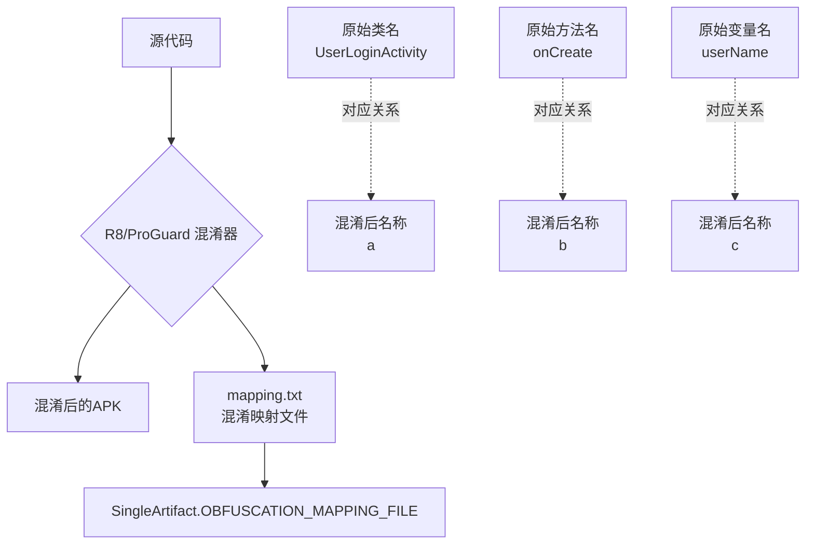
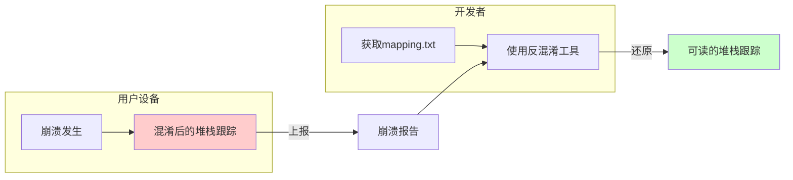
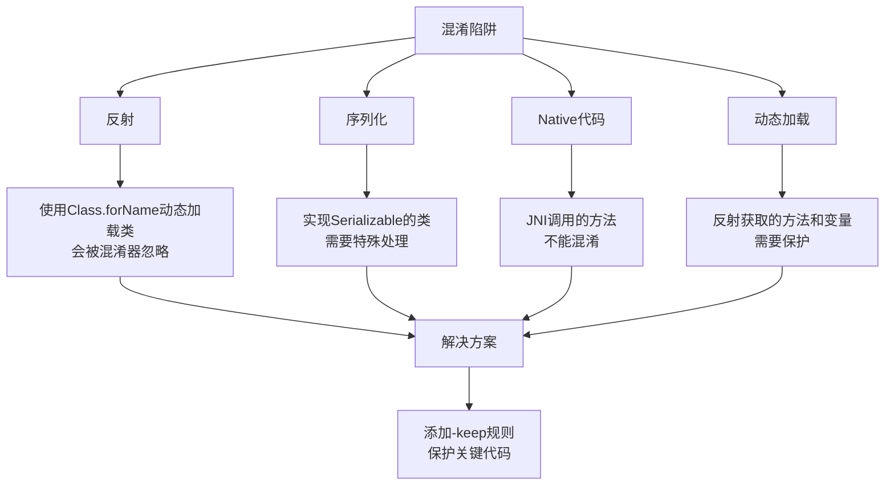
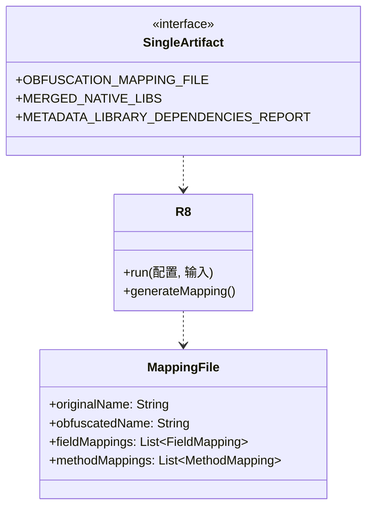

# 21.1.44 SingleArtifact.OBFUSCATION_MAPPING_FILE——混淆的密码簿

星星已经铺满了整个天空，像银色的沙砾洒在深蓝色的天鹅绒上。偶尔有流星划过，引来伊莎的一阵低呼。夜晚的露营地比白天更加安静，只有蟋蟀的鸣叫声此起彼伏，还有远处偶尔传来的猫头鹰的叫声。

洛芙裹紧了自己的外套，虽然是夏天，但夜里的山间还是有些凉意。她的目光从星空收回，看向黛琳刚才在白板上画的图。

“刚才讲的依赖报告真的很实用，”洛芙说道，“以后我知道怎么查app里用了哪些库了。”

“那是当然，”希尔点点头，“不过今天我要讲的更酷——你们有没有想过，为什么有些app那么难破解？”

“咦？”洛芙歪着头，“你是说那些混淆过的代码？”

“没错！”希尔兴奋起来，“今天我们要讲的就是SingleArtifact.OBFUSCATION_MAPPING_FILE——混淆映射文件！这个东西就像密码本，能把乱码一样的混淆代码还原回原来的名字！”

---

## 露营密码本：什么是混淆映射

黛琳把白板翻到新的一页，开始画新的图示。

“你们先想想，”黛琳问道，“如果我们把代码里的类名、方法名都改成毫无意义的字母，比如把UserLoginActivity改成a，把onCreate改成b，会发生什么？”

洛芙举手：“代码会变得很难读懂！”

“对，”黛琳笑着说，“这就是混淆——把有意义的命名改成无意义的短名称，让破解者看不懂代码在做什么。但是——”

“但是如果我自己也看不懂了，还怎么调试？”洛芙问道。

“这就是混淆映射文件存在的意义了，”黛琳说，“OBFUSCATION_MAPPING_FILE 就是混淆器生成的一份对照表，上面清楚地写着'原来叫UserLoginActivity的类，现在改名叫a了'、'原来叫onCreate的方法，现在改名叫b了'。”

伊莎轻声说道：“就像是一本密码本——敌人看到的是乱码，但我们有密码本，就能把乱码翻译回原来的意思。”

---

## 混淆的魔法：ProGuard和R8

希尔打开笔记本电脑，调出一个代码页面。

“要想生成混淆映射文件，我们首先要启用代码混淆，”希尔说道，“在Android构建系统里，这个工作是由ProGuard或者R8完成的。”

她快速敲了一段代码：

```kotlin
// build.gradle (app level)
android {
    buildTypes {
        release {
            // 启用代码混淆
            minifyEnabled true
            // 启用资源混淆（可选）
            shrinkResources true
            // 指定混淆规则文件
            proguardFiles getDefaultProguardFile('proguard-android-optimize.txt'), 'proguard-rules.pro'
        }
    }
}
```

“这里的minifyEnabled true就是开启混淆的开关，”希尔解释道，“开启后，构建时会自动调用R8（现在是默认的混淆器，之前是ProGuard）来处理你的代码。”

洛芙好奇地问：“那混淆映射文件会自动生成吗？”

“会的，”黛琳接过话题，“当你启用minifyEnabled后，构建完成后会在输出目录生成一个mapping.txt文件，这就是混淆映射文件。”

她说着在白板上画了一幅图：



“你们看，”黛琳指着图说，“mapping.txt里记录了所有的对应关系，SingleArtifact.OBFUSCATION_MAPPING_FILE就是代表这个映射文件的Artifact类型。”

---

## 获取混淆映射文件

伊莎问道：“那我们怎么在构建过程中获取这个映射文件呢？”

“这就要用到Android Gradle Plugin提供的Artifact API了，”黛琳说，“我们可以通过Provider来获取OBFUSCATION_MAPPING_FILE类型的输出。”

她示意希尔演示一下具体的代码。

希尔清了清嗓子，在电脑上敲起来：

```kotlin
// 在 Android Gradle Plugin 8.0+ 中获取混淆映射文件
abstract class ObfuscationMappingPlugin : Plugin<Project> {
    override fun apply(project: Project) {
        val androidExtension = project.extensions.getByType(AppExtension::class.java)
        
        androidExtension.onVariants(selector().all()) { variant ->
            val variantName = variant.name
            println("处理变体: $variantName")
            
            // 获取混淆映射文件的Artifact
            val mappingFile = variant.artifacts.get(SingleArtifact.OBFUSCATION_MAPPING_FILE)
            
            // 输出文件路径
            println("混淆映射文件路径: ${mappingFile.asFile.get().absolutePath}")
        }
    }
}
```

“这里的关键是`variant.artifacts.get(SingleArtifact.OBFUSCATION_MAPPING_FILE)`，”希尔解释道，“它会返回一个File对象，指向构建生成的混淆映射文件。”

洛芙问道：“那这个映射文件里具体是什么呢？”

希尔把笔记本电脑转过来，让大家都看到屏幕：“我找到一个示例，这是R8生成的mapping.txt的一部分内容。”

```text
android.support.constraint.ConstraintLayout -> a.android.support.constraint.ConstraintLayout:
    void setLinearChildCount(int) -> a
    void setVerticalBias(float) -> a
    void setWrapBehaviorInParent$(boolean) -> a
com.example.myapp.MainActivity -> a.com.example.myapp.MainActivity:
    void onCreate(android.os.Bundle) -> a
    void onResume() -> a
    void onPause() -> a
com.example.myapp.utils.NetworkHelper -> a.com.example.myapp.utils.NetworkHelper:
    boolean isNetworkAvailable() -> a
    void showToast(android.content.Context, java.lang.String) -> a
```

“你们看，”希尔指着屏幕说，“左边是原始的类名、方法名，右边是混淆后的名称。就像是一本对照词典。”

---

## 反混淆：把乱码变回来

伊莎托着腮帮子，若有所思地说：“这个映射文件真的很重要呢。如果没有它，用户上报的崩溃日志就完全看不懂了。”

“对！”洛芙恍然大悟，“我在网上看到过一些崩溃日志，里面的方法名都是a、b、c这样的，完全不知道是什么意思！”

黛琳点点头：“这就是混淆映射文件最大的用处——反混淆（Deobfuscation）。当我们从用户那里收到崩溃报告时，可以利用mapping.txt把混淆后的堆栈跟踪还原回原始代码。”

她走到白板前，画了一幅对比图：



“你们看，”黛琳解释道，“用户在手机上看到的崩溃日志是混淆后的，比如'a.onCreate()'，但我们用mapping.txt还原后，就能看到原来是'com.example.myapp.MainActivity.onCreate()’。”

希尔补充道：“Android Studio其实已经内置了反混淆功能，只需要在设置里指定mapping.txt文件的路径就可以自动还原堆栈跟踪。”

她打开Android Studio的设置界面，演示给大家看：

```kotlin
// 在 Android Studio 中配置反混淆：
// 1. Run -> Edit Configurations
// 2. 找到 ProGuard tab
// 3. Add mapping.txt file
// 4. Apply

// 或者在代码中调用 retrace 工具：
// android-sdk/tools/proguard/bin/retrace.sh mapping.txt stacktrace.txt
```

---

## 混淆规则：精细控制

洛芙举手提问：“如果我想保留某些类名不混淆，应该怎么做？”

“好问题！”黛琳笑着说，“混淆器默认会混淆所有类，但我们可以添加规则来保护特定的类。”

她在白板上写下几种常见的混淆规则：

```kotlin
// proguard-rules.pro

// 保留指定的类名不混淆
-keep class com.example.myapp.model.User { *; }

// 保留指定包下的所有类
-keep class com.example.myapp.data.** { *; }

// 保留继承自特定类的所有子类
-keep class * extends android.app.Activity

// 保留指定注解标记的所有类
-keep @android.webkit.JavascriptInterface class *

// 保留枚举
-keepclassmembers enum * {
    public static **[] values();
    public static ** valueOf(java.lang.String);
}

// 保留序列化类
-keepclassmembers class * implements java.io.Serializable {
    private static final java.io.ObjectStreamField[] serialPersistentFields;
    private void writeObject(java.io.ObjectOutputStream);
    private void readObject(java.io.ObjectInputStream);
    java.lang.Object writeReplace();
    java.lang.Object readResolve();
}
```

“你们看，”黛琳指着规则说，“-keep就是保护的意思。我们用-keep告诉R8：'这些类不要混淆，用户需要知道它们的原始名称。”

洛芙认真记笔记：“那这些规则要放在哪里？”

“放在app目录下的proguard-rules.pro文件里，”希尔回答道，“然后在build.gradle里通过proguardFiles指定这个文件。”

---

## 混淆的注意事项

伊莎突然想到一个问题：“如果混淆过度，会不会导致app出问题？”

“会的，”黛琳严肃地说，“混淆器有时候会过度 aggressive，把不该混淆的东西也混淆了，导致运行时出错。”

她在白板上列出常见的混淆陷阱：



“有几种情况需要特别注意，”黛琳讲解道：

“第一，反射。如果你用Class.forName('com.example.MyClass')动态加载类，混淆器不知道这个类的存在，可能会把它删掉或者混淆。解决方法是添加-keep规则。”

“第二，序列化。实现了Serializable或Parcelable的类，如果混淆了字段名，反序列化时会出错。”

“第三，Native方法。用JNI调用的本地方法不能混淆，否则找不到对应的函数。”

“第四，动态加载。插件化、热修复等技术常用的动态加载机制，也需要保护相关类。”

---

## 实际案例：调试线上崩溃

希尔站起来，模仿着讲故事的样子：“让我来演示一个真实的场景——假如我们的线上app崩溃了，用户发来这样的崩溃日志。”

她切换到一个模拟的崩溃报告界面：

```
java.lang.NullPointerException: 
    at a.onCreate(Unknown Source)
    at a.a(Unknown Source)
    at android.app.ActivityThread.performLaunchActivity(ActivityThread.java:2691)
    at android.app.ActivityThread.handleLaunchActivity(ActivityThread.java:2758)
    ...
```

“天哪，这完全看不懂！”洛芙惊呼。

“别急，”希尔笑着说，“我们用mapping.txt来还原它。”

她打开mapping.txt，找到对应的类：

```
com.example.myapp.ui.MainActivity -> a:
    void onCreate(android.os.Bundle) -> a
com.example.myapp.ui.LoginActivity -> a:
    void checkLoginStatus() -> a
```

“看到了吗？”希尔兴奋地说，“a.onCreate对应的是MainActivity.onCreate，a.a对应的是LoginActivity.checkLoginStatus。”

她把还原后的堆栈展示给大家：

```
java.lang.NullPointerException: 
    at com.example.myapp.ui.MainActivity.onCreate(MainActivity.java:123)
    at com.example.myapp.ui.LoginActivity.checkLoginStatus(LoginActivity.java:45)
    at android.app.ActivityThread.performLaunchActivity(ActivityThread.java:2691)
    at android.app.ActivityThread.handleLaunchActivity(ActivityThread.java:2758)
    ...
```

“现在是不是清楚多了？”希尔说，“我们一眼就看出是MainActivity的onCreate方法第123行抛出了空指针！”

洛芙感叹道：“原来混淆映射文件这么重要！没有它，我们根本没法调试线上的问题。”

---

## 构建变体与混淆映射

黛琳补充道：“还有一个重要的点——不同的构建变体会生成不同的混淆映射文件。”

她在白板上画了一个表格：

| 构建变体 | minifyEnabled | 映射文件位置 |
|---------|---------------|-------------|
| debug | false | 无（不混淆）|
| release | true | outputs/mapping/release/mapping.txt |
| 自定义变体 | true | outputs/mapping/<变体名>/mapping.txt |

“每个启用了混淆的变体都会生成自己的mapping.txt，”黛琳解释道，“所以当你要调试某个特定变体的崩溃时，一定要用对应的映射文件。”

洛芙问道：“那debug版本为什么不需要混淆？”

“debug版本主要是用来调试的，”希尔回答，“混淆后反而会增加调试的复杂性。而且debug版本通常只在开发者的手机上运行，不需要保护。”

---

## 守护者计划：版本管理

伊莎轻声说：“我觉得混淆映射文件应该像宝贝一样保存好。”

“对！”黛琳认真地说，“这是最重要的工件之一。每次发布release版本，都要妥善保存对应的mapping.txt。”

她扳着手指说：“第一，每次发版都要存档mapping.txt；第二，把mapping.txt和apk的版本号对应起来；第三，最好上传到专门的崩溃分析平台，让它们自动做反混淆。”

希尔点头同意：“现在很多平台都支持自动上传mapping.txt。比如Firebase Crashlytics，只要在构建时配置好，就会自动关联崩溃报告和映射文件。”

她在电脑上展示了配置：

```kotlin
// build.gradle (app level)
android {
    buildTypes {
        release {
            minifyEnabled true
            // Firebase Crashlytics 自动上传 mapping
            // 需要在 app 的 build.gradle 中添加插件
            // 插件会自动在构建完成后上传 mapping.txt
        }
    }
}

// 或者手动上传 mapping.txt 到 Crashlytics
// ./gradlew crashlyticsUploadDistributionRelease
```

---

## 夜空下的思考

洛芙仰头看着星空，心中感慨万千。

“所以混淆映射文件，”她总结道，“就是我们代码的'守护者'——平时它让代码变得面目全非保护我们，但当需要的时候，它又能帮我们还原真相。”

伊莎微笑着说：“就像夜空一样——白天我们看不见星星，但它们一直在那里。”

黛琳把白板笔收起来：“今天我们学完了SingleArtifact.OBFUSCATION_MAPPING_FILE。它代表的就是混淆映射文件这个Artifact类型。掌握了它，你就能在发布应用时保护代码，同时在遇到崩溃时快速定位问题。”

希尔打了个响指：“好了，今晚的露营课堂到此为止！明天我们继续讲别的Artifact类型！”

夜风吹过，蟋蟀的鸣叫声更加响亮了。洛芙最后抬头看了一眼星空，那些星星就像无数个守护者，在黑夜中闪闪发光。

---

## 专业技术总结

> **SingleArtifact.OBFUSCATION_MAPPING_FILE** 是 Android Gradle Plugin 中表示混淆映射文件的 Artifact 类型。该文件由 R8 或 ProGuard 在代码混淆过程中生成，记录了原始类名、方法名与混淆后名称之间的对应关系，主要用于反混淆堆栈跟踪和调试线上崩溃。

### 结构图



### 复杂度与影响

- **性能影响**：混淆过程会增加构建时间，但运行时性能不受影响
- **文件大小**：混淆后 APK 通常可减少 5%-25% 的体积
- **安全性**：有效防止代码被直接阅读和逆向工程

### 反模式与陷阱

1. **未保存映射文件**：每次发布必须保存对应的 mapping.txt，否则无法调试崩溃
2. **混淆过度**：未正确配置 -keep 规则导致运行时崩溃（如反射、序列化相关代码）
3. **跨版本混用**：使用错误版本的 mapping.txt 进行反混淆，导致定位错误

### 设计哲学

- **最小化暴露**：默认混淆所有代码，只在必要时保留
- **可逆性**：通过映射文件实现代码保护与调试能力的平衡
- **版本对应**：每个发布版本应有对应的映射文件存档

### 🏕️ 动手练习

**目标**：理解混淆映射文件的生成和使用方法，掌握基本反混淆技能

**Task 1：启用代码混淆**

- 目标：在 Android 项目中启用代码混淆
- 步骤：
  1. 在 app/build.gradle 中设置 minifyEnabled true
  2. 创建 proguard-rules.pro 文件
  3. 执行 assembleRelease 构建
- 验收标准：
  - [ ] 构建成功完成
  - [ ] 在 outputs/mapping/release/ 目录下找到 mapping.txt
- 提示：
  ```kotlin
  android {
      buildTypes {
          release {
              minifyEnabled true
              proguardFiles getDefaultProguardFile('proguard-android-optimize.txt'), 'proguard-rules.pro'
          }
      }
  }
  ```

**Task 2：添加混淆规则**

- 目标：保护特定类不被混淆
- 步骤：
  1. 创建一个自定义的数据类（如 UserInfo）
  2. 在 proguard-rules.pro 中添加 -keep 规则
  3. 重新构建并检查 mapping.txt
- 验收标准：
  - [ ] 自定义类的名称在 mapping.txt 中保持不变
- 提示：
  ```proguard
  -keep class com.example.myapp.model.** { *; }
  ```

**Task 3：手动反混淆堆栈**

- 目标：使用 retrace 工具还原混淆后的堆栈跟踪
- 步骤：
  1. 准备一个混淆后的堆栈跟踪文件
  2. 使用 Android SDK 中的 retrace 工具
  3. 验证还原结果
- 验收标准：
  - [ ] 成功运行 retrace 命令
  - [ ] 输出包含原始类名和方法名
- 提示：
  ```bash
  # retrace 工具位置
  # $ANDROID_HOME/tools/proguard/bin/retrace.sh
  ./retrace.sh mapping.txt obfuscated_stacktrace.txt
  ```

**Task 4：配置 Firebase Crashlytics 自动上传**

- 目标：配置 Crashlytics 自动上传映射文件
- 步骤：
  1. 在项目中添加 Firebase Crashlytics 插件
  2. 配置 build.gradle 中的 firebaseCrashlytics 块
  3. 执行 crashlyticsUploadDistributionRelease 任务
- 验收标准：
  - [ ] 插件添加成功
  - [ ] 构建日志显示 mapping.txt 上传成功
- 提示：
  ```kotlin
  // build.gradle (app)
  plugins {
      id 'com.google.firebase.crashlytics'
  }
  
  android {
      buildTypes {
          release {
              firebaseCrashlytics {
                  mappingFileUploadEnabled true
              }
          }
      }
  }
  ```

### 面试热身

Q1: 请解释什么是代码混淆，以及为什么需要对 Android 应用进行混淆？

Q2: ProGuard 和 R8 有什么区别？R8 相比 ProGuard 有什么优势？

Q3: 混淆映射文件（mapping.txt）的主要作用是什么？如何使用它来反混淆堆栈跟踪？

Q4: 在配置混淆规则时，-keep 和 -keepclassmembers 有什么区别？分别适用于什么场景？

Q5: 如果应用在发布后出现崩溃，但混淆映射文件丢失了，你还能定位问题吗？如果可以，有哪些替代方案？

### 参考实现要点

1. 每次 release 构建都必须保存对应版本的 mapping.txt，建议使用版本控制系统或专门的存储服务
2. 优先使用 R8 而非 ProGuard，R8 是 Google 官方推荐的混淆器，性能更好
3. 混淆规则应该从小范围开始，逐步添加，避免一次性添加过多 -keep 导致混淆失效
4. 使用 Firebase Crashlytics 或类似工具自动管理映射文件，可以实现崩溃报告的自动反混淆
5. 在 CI/CD 流程中集成混淆构建，确保每次发布都有对应的映射文件存档

> 学习建议：混淆是应用安全的重要一环，但不要为了安全而过度混淆，导致应用不稳定。建议在开发阶段充分测试混淆后的应用，确保所有功能正常工作后再发布。

## 洛芙的小小日记本

今晚学到了混淆映射文件！原来那些看起来像乱码的崩溃日志，用mapping.txt就能还原成可以看懂的信息。黛琳说每次发版都要好好保存这个文件，就像保护宝贝一样。看来做Android开发真的要很细心呢！

---

## 今日关键词

- **SingleArtifact.OBFUSCATION_MAPPING_FILE**：Android Gradle Plugin中表示混淆映射文件的Artifact类型，用于在构建过程中获取混淆生成的名称映射表
- **ProGuard**：Java字节码混淆工具，Android早期使用的代码混淆器，现已被R8替代
- **R8**：Google官方的代码混淆和压缩工具，是ProGuard的继任者，集成在Android Gradle Plugin中
- **混淆（Obfuscation）**：将代码中的类名、方法名、变量名等改为无意义短名称的过程，用于保护代码不被轻易逆向
- **反混淆（Deobfuscation）**：利用混淆映射文件将混淆后的代码名称还原为原始名称的过程
- **mapping.txt**：R8/ProGuard生成的混淆映射文件，记录原始名称与混淆后名称的对应关系
- **-keep规则**：ProGuard/R8的配置文件指令，用于指定哪些类或成员不需要混淆
- **minifyEnabled**：Gradle构建配置中的布尔值选项，设置为true时启用代码混淆和资源压缩
- **Firebase Crashlytics**：Google提供的崩溃报告服务，支持自动上传映射文件并实现崩溃日志自动反混淆
- **retrace工具**：ProGuard/R8提供的命令行工具，用于手动将混淆后的堆栈跟踪还原为可读形式
